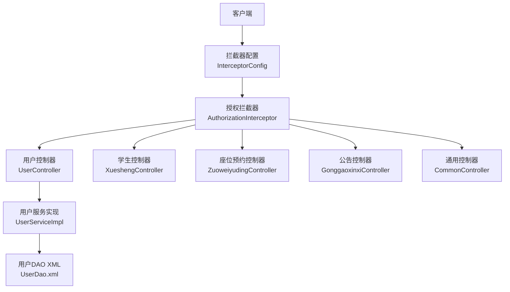
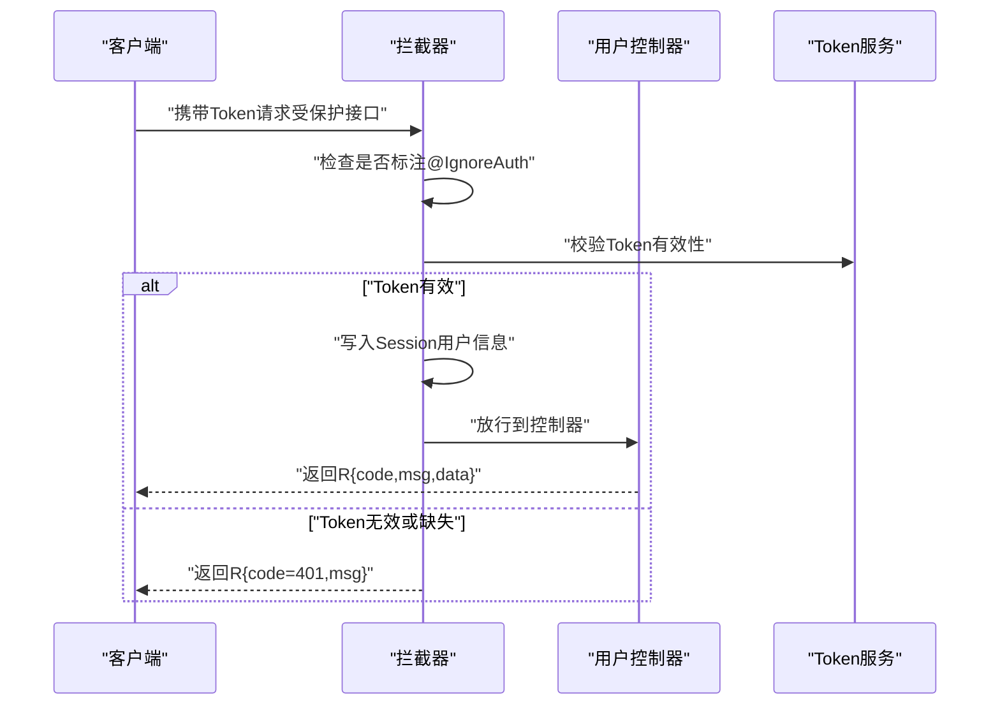
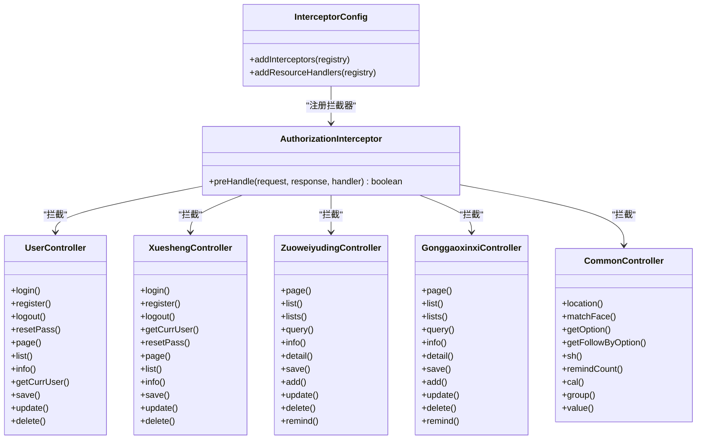

# API接口文档

<cite>
**本文引用的文件**
- [UserController.java](file://src/main/java/com/controller/UserController.java)
- [XueshengController.java](file://src/main/java/com/controller/XueshengController.java)
- [ZuoweiyudingController.java](file://src/main/java/com/controller/ZuoweiyudingController.java)
- [GonggaoxinxiController.java](file://src/main/java/com/controller/GonggaoxinxiController.java)
- [CommonController.java](file://src/main/java/com/controller/CommonController.java)
- [AuthorizationInterceptor.java](file://src/main/java/com/interceptor/AuthorizationInterceptor.java)
- [InterceptorConfig.java](file://src/main/java/com/config/InterceptorConfig.java)
- [IgnoreAuth.java](file://src/main/java/com/annotation/IgnoreAuth.java)
- [R.java](file://src/main/java/com/utils/R.java)
- [UserEntity.java](file://src/main/java/com/entity/UserEntity.java)
- [XueshengEntity.java](file://src/main/java/com/entity/XueshengEntity.java)
- [ZuoweiyudingEntity.java](file://src/main/java/com/entity/ZuoweiyudingEntity.java)
- [GonggaoxinxiEntity.java](file://src/main/java/com/entity/GonggaoxinxiEntity.java)
- [UserDao.xml](file://src/main/resources/mapper/UserDao.xml)
</cite>

## 目录
1. [简介](#简介)
2. [项目结构与架构概览](#项目结构与架构概览)
3. [核心组件](#核心组件)
4. [架构总览](#架构总览)
5. [详细接口定义](#详细接口定义)
6. [依赖关系分析](#依赖关系分析)
7. [性能与扩展性建议](#性能与扩展性建议)
8. [故障排除与调试指南](#故障排除与调试指南)
9. [结论](#结论)
10. [附录：响应与状态码规范](#附录响应与状态码规范)

## 简介
本文件为“自习室管理系统”的完整RESTful API接口文档，覆盖用户认证、座位预约、公告管理、通用查询等模块。文档提供每个接口的HTTP方法、URL路径、请求参数、响应格式、错误码说明，并给出鉴权机制、权限控制、安全注意事项、版本管理与兼容策略、测试与调试建议以及常见问题排查。

## 项目结构与架构概览
- 控制器层：各业务模块控制器统一以REST风格暴露接口，如/users、/xuesheng、/zuoweiyuding、/gonggaoxinxi、/common。
- 拦截器层：全局拦截器负责Token校验与跨域处理，未标注忽略鉴权注解的接口均需携带Token。
- 实体与映射：MyBatis Plus实体类与XML映射文件完成数据库交互。
- 工具与返回封装：统一返回对象R封装code/msg/data，便于前端解析。

图表来源
- [InterceptorConfig.java:19-23](file://src/main/java/com/config/InterceptorConfig.java#L19-L23)
- [AuthorizationInterceptor.java:36-94](file://src/main/java/com/interceptor/AuthorizationInterceptor.java#L36-L94)
- [UserController.java:38-174](file://src/main/java/com/controller/UserController.java#L38-L174)
- [XueshengController.java:46-283](file://src/main/java/com/controller/XueshengController.java#L46-L283)
- [ZuoweiyudingController.java:32-223](file://src/main/java/com/controller/ZuoweiyudingController.java#L32-L223)
- [GonggaoxinxiController.java:46-207](file://src/main/java/com/controller/GonggaoxinxiController.java#L46-L207)
- [CommonController.java:40-248](file://src/main/java/com/controller/CommonController.java#L40-L248)
- [UserDao.xml:4-12](file://src/main/resources/mapper/UserDao.xml#L4-L12)

章节来源
- [InterceptorConfig.java:11-38](file://src/main/java/com/config/InterceptorConfig.java#L11-L38)
- [AuthorizationInterceptor.java:28-94](file://src/main/java/com/interceptor/AuthorizationInterceptor.java#L28-L94)

## 核心组件
- 授权拦截器与注解
  - 拦截器通过请求头读取Token，校验失败统一返回401未授权。
  - 注解@IgnoreAuth用于开放接口（如登录、注册、公告详情等）。
- 统一返回对象R
  - 默认返回code=0表示成功；错误时返回code与msg；可附加data字段承载业务数据。
- 实体模型
  - 用户、学生、座位预约、公告等实体类定义了字段与序列化规则。

章节来源
- [AuthorizationInterceptor.java:36-94](file://src/main/java/com/interceptor/AuthorizationInterceptor.java#L36-L94)
- [IgnoreAuth.java:8-13](file://src/main/java/com/annotation/IgnoreAuth.java#L8-L13)
- [R.java:9-51](file://src/main/java/com/utils/R.java#L9-L51)
- [UserEntity.java:14-77](file://src/main/java/com/entity/UserEntity.java#L14-L77)
- [XueshengEntity.java:32-200](file://src/main/java/com/entity/XueshengEntity.java#L32-L200)
- [ZuoweiyudingEntity.java:22-211](file://src/main/java/com/entity/ZuoweiyudingEntity.java#L22-L211)
- [GonggaoxinxiEntity.java:32-148](file://src/main/java/com/entity/GonggaoxinxiEntity.java#L32-L148)

## 架构总览
- 鉴权流程
  - 客户端携带Token请求受保护接口。
  - 拦截器从Header读取Token，若未标注忽略鉴权且Token无效，返回401。
  - Token有效则将用户信息注入Session，放行到控制器。
- 跨域与预检
  - 拦截器设置标准CORS头；对OPTIONS预检请求直接返回200并短路后续处理。
- 通用查询
  - 通用接口支持联动下拉、单条跟随查询、状态审核、提醒计数、分组统计、求和、按值统计等。

图表来源
- [AuthorizationInterceptor.java:58-93](file://src/main/java/com/interceptor/AuthorizationInterceptor.java#L58-L93)
- [UserController.java:51-60](file://src/main/java/com/controller/UserController.java#L51-L60)

## 详细接口定义

### 一、用户认证与会话接口
- 登录
  - 方法与路径：POST /users/login
  - 请求参数：username、password、captcha（可选）
  - 成功响应：R.code=0，R.data.token
  - 失败响应：R.code=非0，R.msg（账号或密码不正确）
  - 鉴权：该接口忽略鉴权
  - 示例：见“附录：接口调用示例”
- 注册
  - 方法与路径：POST /users/register
  - 请求体：UserEntity（username、password、role等）
  - 成功响应：R.code=0
  - 失败响应：R.code=非0，R.msg（用户已存在）
  - 鉴权：该接口忽略鉴权
- 退出
  - 方法与路径：GET /users/logout
  - 成功响应：R.code=0，R.msg（退出成功）
  - 鉴权：受Token保护
- 密码重置
  - 方法与路径：POST /users/resetPass
  - 请求参数：username
  - 成功响应：R.code=0，R.msg（密码已重置为：123456）
  - 失败响应：R.code=非0，R.msg（账号不存在）
  - 鉴权：该接口忽略鉴权
- 当前会话用户信息
  - 方法与路径：GET /users/session
  - 成功响应：R.code=0，R.data为当前UserEntity
  - 鉴权：受Token保护
- 列表/分页/详情/保存/修改/删除
  - 方法与路径：
    - GET /users/page → 分页列表
    - GET /users/list → 简易列表
    - GET /users/info/{id} → 详情
    - POST /users/save → 保存
    - POST /users/update → 修改
    - POST /users/delete → 批量删除
  - 参数：分页参数、UserEntity字段、JSON请求体、批量ID数组
  - 鉴权：受Token保护

章节来源
- [UserController.java:51-60](file://src/main/java/com/controller/UserController.java#L51-L60)
- [UserController.java:65-74](file://src/main/java/com/controller/UserController.java#L65-L74)
- [UserController.java:79-83](file://src/main/java/com/controller/UserController.java#L79-L83)
- [UserController.java:88-98](file://src/main/java/com/controller/UserController.java#L88-L98)
- [UserController.java:132-137](file://src/main/java/com/controller/UserController.java#L132-L137)
- [UserController.java:103-108](file://src/main/java/com/controller/UserController.java#L103-L108)
- [UserController.java:113-118](file://src/main/java/com/controller/UserController.java#L113-L118)
- [UserController.java:123-127](file://src/main/java/com/controller/UserController.java#L123-L127)
- [UserController.java:142-150](file://src/main/java/com/controller/UserController.java#L142-L150)
- [UserController.java:155-164](file://src/main/java/com/controller/UserController.java#L155-L164)
- [UserController.java:169-173](file://src/main/java/com/controller/UserController.java#L169-L173)

### 二、学生认证与信息接口
- 登录
  - 方法与路径：POST /xuesheng/login
  - 请求参数：username（学号）、password、captcha（可选）
  - 成功响应：R.code=0，R.data.token
  - 失败响应：R.code=非0，R.msg（账号或密码不正确）
  - 鉴权：该接口忽略鉴权
- 注册
  - 方法与路径：POST /xuesheng/register
  - 请求体：XueshengEntity（学号、密码、姓名等）
  - 成功响应：R.code=0
  - 失败响应：R.code=非0，R.msg（注册用户已存在）
  - 鉴权：该接口忽略鉴权
- 退出
  - 方法与路径：GET /xuesheng/logout
  - 成功响应：R.code=0，R.msg（退出成功）
  - 鉴权：受Token保护
- 当前会话用户信息
  - 方法与路径：GET /xuesheng/session
  - 成功响应：R.code=0，R.data为当前XueshengEntity
  - 鉴权：受Token保护
- 密码重置
  - 方法与路径：POST /xuesheng/resetPass
  - 请求参数：username（学号）
  - 成功响应：R.code=0，R.msg（密码已重置为：123456）
  - 失败响应：R.code=非0，R.msg（账号不存在）
  - 鉴权：该接口忽略鉴权
- 列表/分页/详情/保存/修改/删除
  - 方法与路径：
    - GET /xuesheng/page → 分页列表
    - GET /xuesheng/list → 简易列表
    - GET /xuesheng/info/{id} → 详情
    - POST /xuesheng/save → 保存
    - POST /xuesheng/update → 修改
    - POST /xuesheng/delete → 批量删除
  - 参数：分页参数、XueshengEntity字段、JSON请求体、批量ID数组
  - 鉴权：受Token保护

章节来源
- [XueshengController.java:58-68](file://src/main/java/com/controller/XueshengController.java#L58-L68)
- [XueshengController.java:73-85](file://src/main/java/com/controller/XueshengController.java#L73-L85)
- [XueshengController.java:90-94](file://src/main/java/com/controller/XueshengController.java#L90-L94)
- [XueshengController.java:99-104](file://src/main/java/com/controller/XueshengController.java#L99-L104)
- [XueshengController.java:110-119](file://src/main/java/com/controller/XueshengController.java#L110-L119)
- [XueshengController.java:125-132](file://src/main/java/com/controller/XueshengController.java#L125-L132)
- [XueshengController.java:137-142](file://src/main/java/com/controller/XueshengController.java#L137-L142)
- [XueshengController.java:168-172](file://src/main/java/com/controller/XueshengController.java#L168-L172)
- [XueshengController.java:189-200](file://src/main/java/com/controller/XueshengController.java#L189-L200)
- [XueshengController.java:221-226](file://src/main/java/com/controller/XueshengController.java#L221-L226)
- [XueshengController.java:232-236](file://src/main/java/com/controller/XueshengController.java#L232-L236)

### 三、座位预约接口
- 后端列表/前端列表/简易列表/查询
  - 方法与路径：
    - GET /zuoweiyuding/page → 后端分页（自动注入当前角色条件）
    - GET /zuoweiyuding/list → 前端列表
    - GET /zuoweiyuding/lists → 简易列表
    - GET /zuoweiyuding/query → 视图查询
  - 参数：分页参数、ZuoweiyudingEntity过滤字段
  - 鉴权：受Token保护
- 后端详情/前端详情
  - 方法与路径：
    - GET /zuoweiyuding/info/{id}
    - GET /zuoweiyuding/detail/{id}
  - 鉴权：受Token保护
- 后端保存/前端保存
  - 方法与路径：
    - POST /zuoweiyuding/save → 后端保存
    - POST /zuoweiyuding/add → 前端保存（同时更新自习室selected字段）
  - 请求体：ZuoweiyudingEntity
  - 鉴权：受Token保护
- 修改/删除
  - 方法与路径：
    - POST /zuoweiyuding/update
    - POST /zuoweiyuding/delete
  - 请求体：JSON（update为ZuoweiyudingEntity，delete为批量ID数组）
  - 鉴权：受Token保护
- 提醒接口
  - 方法与路径：GET /zuoweiyuding/remind/{columnName}/{type}?remindstart=&remindend=
  - 参数：columnName（列名）、type（1数字/2日期）、可选范围参数
  - 返回：R.code=0，R.data.count
  - 鉴权：受Token保护

章节来源
- [ZuoweiyudingController.java:50-61](file://src/main/java/com/controller/ZuoweiyudingController.java#L50-L61)
- [ZuoweiyudingController.java:66-71](file://src/main/java/com/controller/ZuoweiyudingController.java#L66-L71)
- [ZuoweiyudingController.java:76-81](file://src/main/java/com/controller/ZuoweiyudingController.java#L76-L81)
- [ZuoweiyudingController.java:86-92](file://src/main/java/com/controller/ZuoweiyudingController.java#L86-L92)
- [ZuoweiyudingController.java:97-101](file://src/main/java/com/controller/ZuoweiyudingController.java#L97-L101)
- [ZuoweiyudingController.java:106-110](file://src/main/java/com/controller/ZuoweiyudingController.java#L106-L110)
- [ZuoweiyudingController.java:118-124](file://src/main/java/com/controller/ZuoweiyudingController.java#L118-L124)
- [ZuoweiyudingController.java:129-152](file://src/main/java/com/controller/ZuoweiyudingController.java#L129-L152)
- [ZuoweiyudingController.java:157-162](file://src/main/java/com/controller/ZuoweiyudingController.java#L157-L162)
- [ZuoweiyudingController.java:168-172](file://src/main/java/com/controller/ZuoweiyudingController.java#L168-L172)
- [ZuoweiyudingController.java:177-219](file://src/main/java/com/controller/ZuoweiyudingController.java#L177-L219)

### 四、公告管理接口
- 后端列表/前端列表/简易列表/查询
  - 方法与路径：
    - GET /gonggaoxinxi/page
    - @IgnoreAuth GET /gonggaoxinxi/list
    - GET /gonggaoxinxi/lists
    - GET /gonggaoxinxi/query
  - 参数：分页参数、GonggaoxinxiEntity过滤字段
  - 鉴权：部分接口忽略鉴权
- 后端详情/前端详情
  - 方法与路径：
    - GET /gonggaoxinxi/info/{id}
    - @IgnoreAuth GET /gonggaoxinxi/detail/{id}
  - 鉴权：部分接口忽略鉴权
- 后端保存/前端保存
  - 方法与路径：
    - POST /gonggaoxinxi/save
    - POST /gonggaoxinxi/add
  - 请求体：GonggaoxinxiEntity
  - 鉴权：受Token保护
- 修改/删除
  - 方法与路径：
    - POST /gonggaoxinxi/update
    - POST /gonggaoxinxi/delete
  - 请求体：JSON（update为GonggaoxinxiEntity，delete为批量ID数组）
  - 鉴权：受Token保护
- 提醒接口
  - 方法与路径：GET /gonggaoxinxi/remind/{columnName}/{type}?remindstart=&remindend=
  - 参数：columnName（列名）、type（1数字/2日期）、可选范围参数
  - 返回：R.code=0，R.data.count
  - 鉴权：受Token保护

章节来源
- [GonggaoxinxiController.java:57-64](file://src/main/java/com/controller/GonggaoxinxiController.java#L57-L64)
- [GonggaoxinxiController.java:69-75](file://src/main/java/com/controller/GonggaoxinxiController.java#L69-L75)
- [GonggaoxinxiController.java:80-85](file://src/main/java/com/controller/GonggaoxinxiController.java#L80-L85)
- [GonggaoxinxiController.java:89-96](file://src/main/java/com/controller/GonggaoxinxiController.java#L89-L96)
- [GonggaoxinxiController.java:101-105](file://src/main/java/com/controller/GonggaoxinxiController.java#L101-L105)
- [GonggaoxinxiController.java:110-115](file://src/main/java/com/controller/GonggaoxinxiController.java#L110-L115)
- [GonggaoxinxiController.java:123-129](file://src/main/java/com/controller/GonggaoxinxiController.java#L123-L129)
- [GonggaoxinxiController.java:134-140](file://src/main/java/com/controller/GonggaoxinxiController.java#L134-L140)
- [GonggaoxinxiController.java:145-150](file://src/main/java/com/controller/GonggaoxinxiController.java#L145-L150)
- [GonggaoxinxiController.java:156-160](file://src/main/java/com/controller/GonggaoxinxiController.java#L156-L160)
- [GonggaoxinxiController.java:165-203](file://src/main/java/com/controller/GonggaoxinxiController.java#L165-L203)

### 五、通用查询与辅助接口
- 地理位置反向编码
  - 方法与路径：GET /location?lng=&lat=
  - 成功响应：R.code=0，R.data为城市/区域信息
  - 失败响应：R.code=非0，R.msg（AK未配置）
  - 鉴权：受Token保护
- 人脸识别比对
  - 方法与路径：GET /matchFace?face1=&face2=
  - 成功响应：R.code=0，R.data为比对结果
  - 失败响应：R.code=非0，R.msg（配置或文件问题）
  - 鉴权：受Token保护
- 下拉联动选项
  - 方法与路径：GET /option/{tableName}/{columnName}?level=&parent=
  - 成功响应：R.code=0，R.data为选项列表
  - 鉴权：@IgnoreAuth
- 跟随查询（根据某列值取单条记录）
  - 方法与路径：GET /follow/{tableName}/{columnName}?columnValue=
  - 成功响应：R.code=0，R.data为记录
  - 鉴权：@IgnoreAuth
- 审核状态更新
  - 方法与路径：POST /sh/{tableName}
  - 请求体：JSON（含status字段等）
  - 成功响应：R.code=0
  - 鉴权：受Token保护
- 提醒计数
  - 方法与路径：GET /remind/{tableName}/{columnName}/{type}?remindstart=&remindend=
  - 成功响应：R.code=0，R.data.count
  - 鉴权：@IgnoreAuth
- 单列求和
  - 方法与路径：GET /cal/{tableName}/{columnName}
  - 成功响应：R.code=0，R.data为聚合结果
  - 鉴权：@IgnoreAuth
- 分组统计
  - 方法与路径：GET /group/{tableName}/{columnName}
  - 成功响应：R.code=0，R.data为分组结果
  - 鉴权：@IgnoreAuth
- 按值统计
  - 方法与路径：GET /value/{tableName}/{xColumnName}/{yColumnName}
  - 成功响应：R.code=0，R.data为统计结果（日期字段格式化）
  - 鉴权：@IgnoreAuth

章节来源
- [CommonController.java:52-62](file://src/main/java/com/controller/CommonController.java#L52-L62)
- [CommonController.java:71-105](file://src/main/java/com/controller/CommonController.java#L71-L105)
- [CommonController.java:113-127](file://src/main/java/com/controller/CommonController.java#L113-L127)
- [CommonController.java:135-144](file://src/main/java/com/controller/CommonController.java#L135-L144)
- [CommonController.java:152-157](file://src/main/java/com/controller/CommonController.java#L152-L157)
- [CommonController.java:167-198](file://src/main/java/com/controller/CommonController.java#L167-L198)
- [CommonController.java:203-211](file://src/main/java/com/controller/CommonController.java#L203-L211)
- [CommonController.java:216-224](file://src/main/java/com/controller/CommonController.java#L216-L224)
- [CommonController.java:229-246](file://src/main/java/com/controller/CommonController.java#L229-L246)

### 六、请求与响应规范
- 请求头
  - Token：Bearer Token（除标注@IgnoreAuth的接口外）
  - Content-Type：application/json
- 请求体
  - JSON对象，字段与实体类一致
- 响应体
  - R对象：code（数字）、msg（字符串）、data（任意）
  - 分页数据：data包含列表与分页信息
- 时间字段
  - 实体类中使用注解指定格式，注意前后端统一格式

章节来源
- [R.java:9-51](file://src/main/java/com/utils/R.java#L9-L51)
- [ZuoweiyudingEntity.java:73-98](file://src/main/java/com/entity/ZuoweiyudingEntity.java#L73-L98)
- [GonggaoxinxiEntity.java:76-83](file://src/main/java/com/entity/GonggaoxinxiEntity.java#L76-L83)
- [XueshengEntity.java:97-106](file://src/main/java/com/entity/XueshengEntity.java#L97-L106)

### 七、鉴权机制、权限控制与安全
- Token传递
  - Header键：Token
  - 拦截器优先处理OPTIONS预检请求，设置CORS头并直接返回
- 开放接口
  - 使用@IgnoreAuth标注的接口无需Token（如登录、注册、公告详情）
- 会话注入
  - Token有效时，将userId、role、tableName、username写入Session供控制器使用
- 安全建议
  - 生产环境启用HTTPS
  - Token过期策略与刷新机制（可在拦截器中扩展）
  - 对敏感接口增加角色校验（可在控制器内基于Session角色判断）

章节来源
- [AuthorizationInterceptor.java:39-49](file://src/main/java/com/interceptor/AuthorizationInterceptor.java#L39-L49)
- [AuthorizationInterceptor.java:58-79](file://src/main/java/com/interceptor/AuthorizationInterceptor.java#L58-L79)
- [IgnoreAuth.java:8-13](file://src/main/java/com/annotation/IgnoreAuth.java#L8-L13)

### 八、接口版本管理、兼容与废弃策略
- 版本策略
  - 建议在URL中加入版本号（如/users/v1/login），或通过请求头标识版本
- 向后兼容
  - 新增字段采用可选；变更字段保持默认值兼容
- 废弃接口
  - 保留期内返回提示信息并指引迁移至新接口
- 本项目现状
  - 当前未见显式版本前缀；建议后续引入/v1并逐步迁移

[本节为通用建议，不直接分析具体文件]

### 九、接口测试指南与调试技巧
- 测试工具
  - Postman/Insomnia/Httpie
- 常用步骤
  - 先登录获取Token，再携带Token调用受保护接口
  - 使用分页接口验证过滤与排序参数
  - 使用通用接口验证联动、统计与提醒功能
- 调试要点
  - 关注拦截器日志与CORS头设置
  - 统一响应体结构便于定位问题
  - 对日期/时间字段确保格式一致

[本节为通用建议，不直接分析具体文件]

## 依赖关系分析

图表来源
- [InterceptorConfig.java:19-23](file://src/main/java/com/config/InterceptorConfig.java#L19-L23)
- [AuthorizationInterceptor.java:36-94](file://src/main/java/com/interceptor/AuthorizationInterceptor.java#L36-L94)
- [UserController.java:38-174](file://src/main/java/com/controller/UserController.java#L38-L174)
- [XueshengController.java:46-283](file://src/main/java/com/controller/XueshengController.java#L46-L283)
- [ZuoweiyudingController.java:32-223](file://src/main/java/com/controller/ZuoweiyudingController.java#L32-L223)
- [GonggaoxinxiController.java:46-207](file://src/main/java/com/controller/GonggaoxinxiController.java#L46-L207)
- [CommonController.java:40-248](file://src/main/java/com/controller/CommonController.java#L40-L248)

## 性能与扩展性建议
- 分页与过滤
  - 使用分页接口与条件过滤，避免一次性加载大量数据
- 缓存策略
  - 对热点公告、联动选项等增加缓存
- 并发与锁
  - 预约保存时对座位状态加锁或乐观锁，防止超卖
- 日志与监控
  - 记录关键接口耗时与异常，结合链路追踪定位瓶颈

[本节为通用建议，不直接分析具体文件]

## 故障排除与调试指南
- 401 未授权
  - 检查请求头是否携带Token，Token是否有效
- CORS 问题
  - 确认拦截器已设置允许的Origin与Headers，预检请求返回200
- 参数校验
  - 确认请求体JSON字段与实体类一致，日期格式正确
- 通用接口异常
  - AK未配置导致地理位置或人脸识别失败；检查配置项

章节来源
- [AuthorizationInterceptor.java:40-49](file://src/main/java/com/interceptor/AuthorizationInterceptor.java#L40-L49)
- [AuthorizationInterceptor.java:81-93](file://src/main/java/com/interceptor/AuthorizationInterceptor.java#L81-L93)
- [CommonController.java:54-59](file://src/main/java/com/controller/CommonController.java#L54-L59)
- [CommonController.java:73-84](file://src/main/java/com/controller/CommonController.java#L73-L84)

## 结论
本接口文档覆盖了系统的主要业务场景，明确了鉴权方式、请求响应规范与错误处理策略。建议在生产环境中完善版本管理、引入更严格的权限控制与安全加固，并持续优化性能与可观测性。

## 附录：响应与状态码规范
- 成功
  - code=0，msg为操作提示，data为业务数据或分页对象
- 错误
  - code为非0，msg为错误描述
- 未授权
  - code=401，msg为“请先登录”

章节来源
- [R.java:16-29](file://src/main/java/com/utils/R.java#L16-L29)
- [AuthorizationInterceptor.java:84-92](file://src/main/java/com/interceptor/AuthorizationInterceptor.java#L84-L92)

## 附录：接口调用示例与返回样例
- 登录
  - 请求：POST /users/login
  - 请求体：{ "username": "...", "password": "...", "captcha": "..." }
  - 成功返回：{ "code": 0, "msg": "", "data": { "token": "..." } }
  - 失败返回：{ "code": 500, "msg": "账号或密码不正确" }
- 注册
  - 请求：POST /users/register
  - 请求体：{ "username": "...", "password": "...", "role": "..." }
  - 成功返回：{ "code": 0 }
  - 失败返回：{ "code": 500, "msg": "用户已存在" }
- 列表分页
  - 请求：GET /users/page?page=1&limit=10
  - 成功返回：{ "code": 0, "data": { "list": [...], "currPage": 1, "totalPage": N, "total": M } }
- 保存
  - 请求：POST /zuoweiyuding/save
  - 请求体：{ "xueshenghao": "...", "xueshengxingming": "...", "mingcheng": "...", "zuoweihao": "...", "yuyueshijian": "2025-01-01 12:00:00", "shiyongshizhang": "2小时", "sfsh": "是" }
  - 成功返回：{ "code": 0 }
- 提醒计数
  - 请求：GET /remind/zuoweiyuding/yuyueshijian/2?remindstart=-1&remindend=1
  - 成功返回：{ "code": 0, "data": { "count": 5 } }

章节来源
- [UserController.java:51-60](file://src/main/java/com/controller/UserController.java#L51-L60)
- [UserController.java:65-74](file://src/main/java/com/controller/UserController.java#L65-L74)
- [UserController.java:103-108](file://src/main/java/com/controller/UserController.java#L103-L108)
- [ZuoweiyudingController.java:118-124](file://src/main/java/com/controller/ZuoweiyudingController.java#L118-L124)
- [CommonController.java:167-198](file://src/main/java/com/controller/CommonController.java#L167-L198)