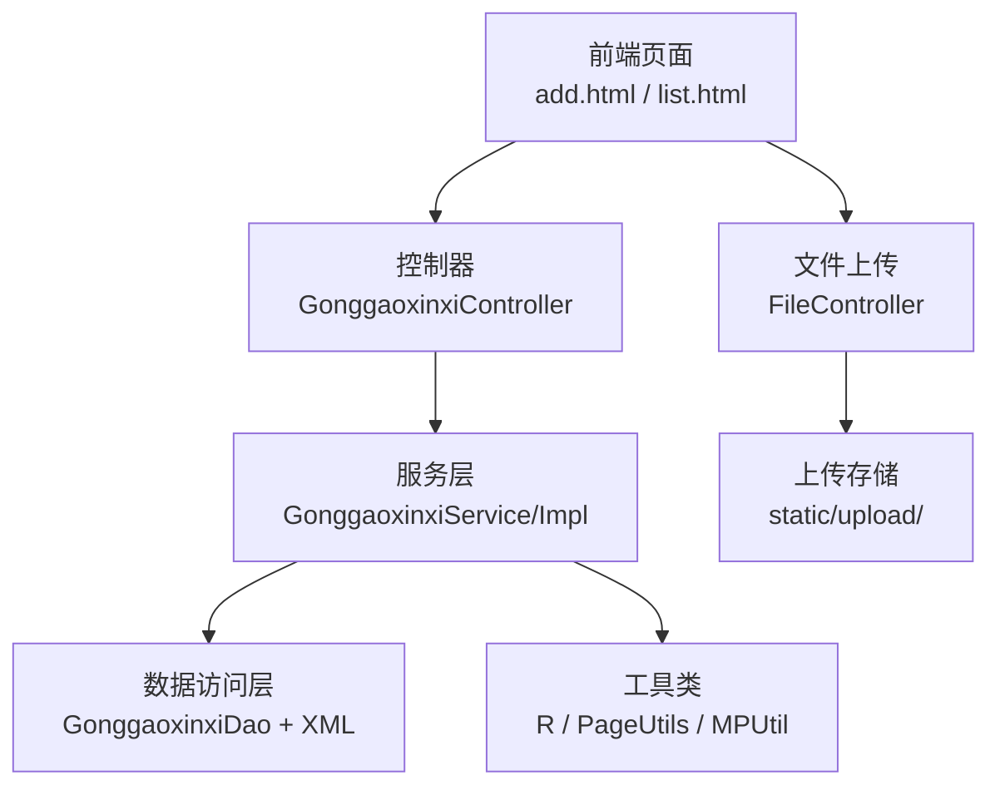
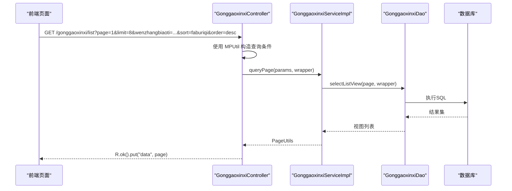
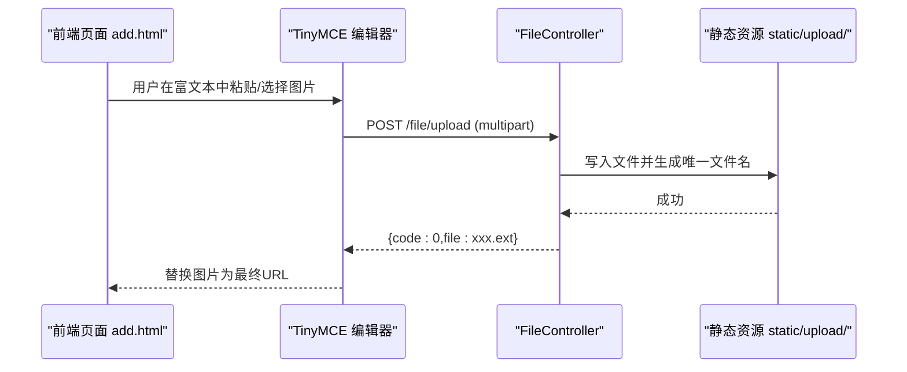
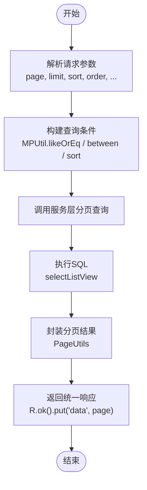
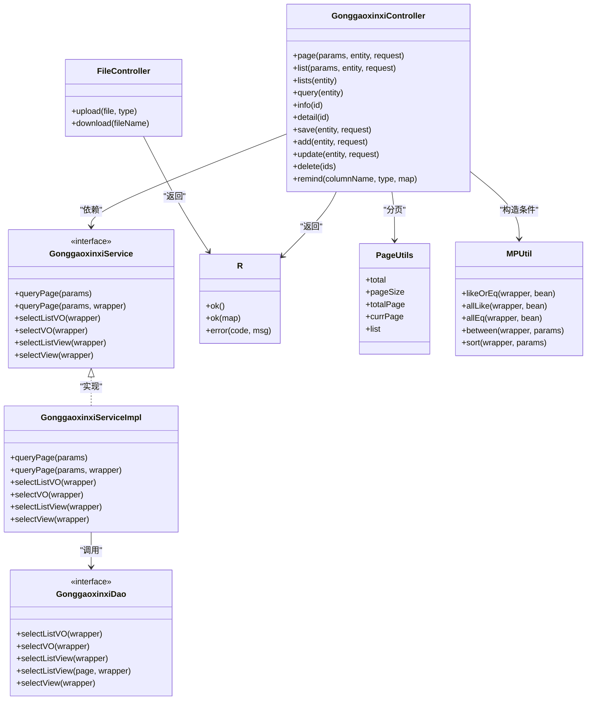

# 公告管理接口

<cite>
**本文引用的文件**
- [GonggaoxinxiController.java](file://src/main/java/com/controller/GonggaoxinxiController.java)
- [GonggaoxinxiService.java](file://src/main/java/com/service/GonggaoxinxiService.java)
- [GonggaoxinxiServiceImpl.java](file://src/main/java/com/service/impl/GonggaoxinxiServiceImpl.java)
- [GonggaoxinxiEntity.java](file://src/main/java/com/entity/GonggaoxinxiEntity.java)
- [GonggaoxinxiDao.java](file://src/main/java/com/dao/GonggaoxinxiDao.java)
- [GonggaoxinxiDao.xml](file://src/main/resources/mapper/GonggaoxinxiDao.xml)
- [R.java](file://src/main/java/com/utils/R.java)
- [PageUtils.java](file://src/main/java/com/utils/PageUtils.java)
- [MPUtil.java](file://src/main/java/com/utils/MPUtil.java)
- [FileController.java](file://src/main/java/com/controller/FileController.java)
- [add.html](file://src/main/resources/front/front/pages/gonggaoxinxi/add.html)
- [list.html](file://src/main/resources/front/front/pages/gonggaoxinxi/list.html)
- [pom.xml](file://pom.xml)
</cite>

## 目录
1. [简介](#简介)
2. [项目结构](#项目结构)
3. [核心组件](#核心组件)
4. [架构总览](#架构总览)
5. [详细组件分析](#详细组件分析)
6. [依赖关系分析](#依赖关系分析)
7. [性能考虑](#性能考虑)
8. [故障排查指南](#故障排查指南)
9. [结论](#结论)
10. [附录](#附录)

## 简介
本文件为“公告管理”模块的API文档，覆盖后端控制器暴露的REST接口以及前端页面调用方式，重点说明以下能力：
- 公告发布、编辑、删除、查询
- 列表分页、详情查看、模糊搜索
- 富文本内容处理、图片上传与访问
- 字段规范与返回结构
- 权限控制与审核流程建议

该系统采用Spring Boot + MyBatis-Plus实现，数据库表为 gonggaoxinxi，字段包括：文章标题、图片、文章内容、发布日期等。

## 项目结构
围绕公告管理的核心文件组织如下：
- 控制器层：GonggaoxinxiController 提供 /gonggaoxinxi 前缀的REST接口
- 服务层：GonggaoxinxiService 定义业务接口；GonggaoxinxiServiceImpl 实现分页、列表视图等
- 数据访问层：GonggaoxinxiDao + GonggaoxinxiDao.xml 映射SQL
- 实体模型：GonggaoxinxiEntity 对应数据库表字段
- 工具类：R 统一响应结构；PageUtils 分页封装；MPUtil 构造查询条件
- 文件上传：FileController 提供 /file/upload 接口用于图片与富文本图片上传
- 前端页面：add.html、list.html 展示并演示调用公告接口

图表来源
- [GonggaoxinxiController.java:48-207](file://src/main/java/com/controller/GonggaoxinxiController.java#L48-L207)
- [GonggaoxinxiServiceImpl.java:22-62](file://src/main/java/com/service/impl/GonggaoxinxiServiceImpl.java#L22-L62)
- [GonggaoxinxiDao.java:21-33](file://src/main/java/com/dao/GonggaoxinxiDao.java#L21-L33)
- [GonggaoxinxiDao.xml:4-37](file://src/main/resources/mapper/GonggaoxinxiDao.xml#L4-L37)
- [FileController.java:48-77](file://src/main/java/com/controller/FileController.java#L48-L77)

章节来源
- [GonggaoxinxiController.java:48-207](file://src/main/java/com/controller/GonggaoxinxiController.java#L48-L207)
- [GonggaoxinxiService.java:21-35](file://src/main/java/com/service/GonggaoxinxiService.java#L21-L35)
- [GonggaoxinxiServiceImpl.java:22-62](file://src/main/java/com/service/impl/GonggaoxinxiServiceImpl.java#L22-L62)
- [GonggaoxinxiEntity.java:31-148](file://src/main/java/com/entity/GonggaoxinxiEntity.java#L31-L148)
- [GonggaoxinxiDao.java:21-33](file://src/main/java/com/dao/GonggaoxinxiDao.java#L21-L33)
- [GonggaoxinxiDao.xml:4-37](file://src/main/resources/mapper/GonggaoxinxiDao.xml#L4-L37)
- [FileController.java:48-77](file://src/main/java/com/controller/FileController.java#L48-L77)
- [add.html:269-345](file://src/main/resources/front/front/pages/gonggaoxinxi/add.html#L269-L345)
- [list.html:395-417](file://src/main/resources/front/front/pages/gonggaoxinxi/list.html#L395-L417)

## 核心组件
- 控制器接口
  - 后端列表：GET /gonggaoxinxi/page
  - 前端列表：GET /gonggaoxinxi/list
  - 列表查询：GET /gonggaoxinxi/lists
  - 查询详情：GET /gonggaoxinxi/query
  - 后端详情：GET /gonggaoxinxi/info/{id}
  - 前端详情：GET /gonggaoxinxi/detail/{id}
  - 新增公告：POST /gonggaoxinxi/save 或 /gonggaoxinxi/add
  - 更新公告：POST /gonggaoxinxi/update
  - 删除公告：POST /gonggaoxinxi/delete
  - 提醒统计：GET /gonggaoxinxi/remind/{columnName}/{type}

- 服务层接口
  - 分页查询：queryPage(params)、queryPage(params, wrapper)
  - 列表视图：selectListView(wrapper)
  - 视图详情：selectView(wrapper)
  - VO查询：selectListVO/selectVO

- 实体与映射
  - 实体字段：id、wenzhangbiaoti、tupian、wenzhangneirong、faburiqi、addtime
  - XML映射：gonggaoxinxi.* 字段映射

- 工具类
  - R：统一响应结构 {code,msg,data,...}
  - PageUtils：分页结果封装
  - MPUtil：参数转SQL条件（like/eq/between/sort）

章节来源
- [GonggaoxinxiController.java:57-203](file://src/main/java/com/controller/GonggaoxinxiController.java#L57-L203)
- [GonggaoxinxiService.java:21-35](file://src/main/java/com/service/GonggaoxinxiService.java#L21-L35)
- [GonggaoxinxiServiceImpl.java:25-60](file://src/main/java/com/service/impl/GonggaoxinxiServiceImpl.java#L25-L60)
- [GonggaoxinxiEntity.java:52-146](file://src/main/java/com/entity/GonggaoxinxiEntity.java#L52-L146)
- [GonggaoxinxiDao.xml:7-12](file://src/main/resources/mapper/GonggaoxinxiDao.xml#L7-L12)
- [R.java:9-51](file://src/main/java/com/utils/R.java#L9-L51)
- [PageUtils.java:13-101](file://src/main/java/com/utils/PageUtils.java#L13-L101)
- [MPUtil.java:46-134](file://src/main/java/com/utils/MPUtil.java#L46-L134)

## 架构总览
公告管理接口遵循经典的三层架构：
- 表现层：前端页面通过HTTP请求调用后端接口
- 控制器层：接收请求、构造查询条件、调用服务层
- 服务层：处理分页、条件组装、视图查询
- 数据访问层：MyBatis-Plus执行SQL，返回实体或视图

图表来源
- [GonggaoxinxiController.java:57-75](file://src/main/java/com/controller/GonggaoxinxiController.java#L57-L75)
- [GonggaoxinxiServiceImpl.java:34-40](file://src/main/java/com/service/impl/GonggaoxinxiServiceImpl.java#L34-L40)
- [GonggaoxinxiDao.xml:26-31](file://src/main/resources/mapper/GonggaoxinxiDao.xml#L26-L31)
- [MPUtil.java:102-134](file://src/main/java/com/utils/MPUtil.java#L102-L134)

## 详细组件分析

### 接口清单与规范

- 列表查询（后端）
  - 方法：GET
  - 路径：/gonggaoxinxi/page
  - 参数：page、limit、排序字段sort、排序方向order、模糊/精确字段如 wenzhangbiaoti 等
  - 返回：R.ok().put("data", PageUtils)
  - 处理逻辑：使用 MPUtil.between/likeOrEq 组装条件，分页查询

- 列表查询（前端）
  - 方法：GET
  - 路径：/gonggaoxinxi/list
  - 参数：同上
  - 返回：R.ok().put("data", PageUtils)

- 列表查询（简化）
  - 方法：GET
  - 路径：/gonggaoxinxi/lists
  - 参数：以实体字段作为查询条件
  - 返回：R.ok().put("data", List<视图>)

- 查询详情
  - 方法：GET
  - 路径：/gonggaoxinxi/query
  - 参数：实体字段
  - 返回：R.ok("查询公告信息成功").put("data", 视图)

- 后端详情
  - 方法：GET
  - 路径：/gonggaoxinxi/info/{id}
  - 返回：R.ok().put("data", 实体)

- 前端详情
  - 方法：GET
  - 路径：/gonggaoxinxi/detail/{id}
  - 返回：R.ok().put("data", 实体)

- 新增公告
  - 方法：POST
  - 路径：/gonggaoxinxi/save 或 /gonggaoxinxi/add
  - 请求体：实体字段（含富文本内容、图片URL）
  - 返回：R.ok()

- 更新公告
  - 方法：POST
  - 路径：/gonggaoxinxi/update
  - 请求体：实体字段（含主键id）
  - 返回：R.ok()

- 删除公告
  - 方法：POST
  - 路径：/gonggaoxinxi/delete
  - 请求体：数组 ids
  - 返回：R.ok()

- 提醒统计
  - 方法：GET
  - 路径：/gonggaoxinxi/remind/{columnName}/{type}
  - 参数：remindstart、remindend（当type=2时按天偏移）
  - 返回：R.ok().put("count", int)

章节来源
- [GonggaoxinxiController.java:57-203](file://src/main/java/com/controller/GonggaoxinxiController.java#L57-L203)
- [GonggaoxinxiServiceImpl.java:25-60](file://src/main/java/com/service/impl/GonggaoxinxiServiceImpl.java#L25-L60)
- [GonggaoxinxiDao.xml:14-36](file://src/main/resources/mapper/GonggaoxinxiDao.xml#L14-L36)
- [MPUtil.java:102-134](file://src/main/java/com/utils/MPUtil.java#L102-L134)

### 字段规范与数据模型

- 实体字段
  - id：主键（Long）
  - wenzhangbiaoti：文章标题（String）
  - tupian：图片（String，支持多图逗号分隔）
  - wenzhangneirong：文章内容（String，富文本HTML）
  - faburiqi：发布日期（Date，yyyy-MM-dd）
  - addtime：创建时间（Date，yyyy-MM-dd HH:mm:ss）

- 返回结构
  - 统一响应：R，包含 code、msg、data 等
  - 分页：PageUtils，包含 total、pageSize、totalPage、currPage、list

- 查询条件
  - 支持模糊匹配（like）、精确匹配（eq）、范围匹配（ge、le）
  - 支持排序（asc/desc）与多字段组合

章节来源
- [GonggaoxinxiEntity.java:52-146](file://src/main/java/com/entity/GonggaoxinxiEntity.java#L52-L146)
- [R.java:9-51](file://src/main/java/com/utils/R.java#L9-L51)
- [PageUtils.java:13-101](file://src/main/java/com/utils/PageUtils.java#L13-L101)
- [MPUtil.java:46-134](file://src/main/java/com/utils/MPUtil.java#L46-L134)

### 富文本与图片上传

- 富文本编辑器
  - 前端使用 TinyMCE 编辑器，支持图片上传
  - 图片上传处理器：TinyMCE images_upload_handler 调用 /file/upload

- 文件上传接口
  - 方法：POST
  - 路径：/file/upload
  - 参数：multipart/form-data，字段 file
  - 返回：R.ok().put("file", fileName)
  - 存储位置：static/upload/，访问路径为 /upload/{fileName}

- 前端集成
  - add.html 中通过 Tinymce 的 images_upload_handler 将图片上传到 /file/upload，并将返回的URL写入富文本
  - add.html 中提供独立图片上传入口，上传后回填图片URL到实体字段

图表来源
- [add.html:316-345](file://src/main/resources/front/front/pages/gonggaoxinxi/add.html#L316-L345)
- [FileController.java:48-77](file://src/main/java/com/controller/FileController.java#L48-L77)

章节来源
- [add.html:269-345](file://src/main/resources/front/front/pages/gonggaoxinxi/add.html#L269-L345)
- [FileController.java:48-77](file://src/main/java/com/controller/FileController.java#L48-L77)

### 权限控制与审核流程

- 权限注解
  - 控制器中使用 @IgnoreAuth 注解标注对外开放的接口（如前端列表、详情）
  - 其余接口未标注，默认需鉴权（结合项目拦截器与登录态）

- 审核流程建议
  - 当前接口未内置审核字段或状态字段，可在实体中扩展字段（如 status、review_status）并在控制器/服务层增加审核相关接口
  - 建议在 FileController 增加上传白名单与大小限制，避免恶意文件

章节来源
- [GonggaoxinxiController.java:69-75](file://src/main/java/com/controller/GonggaoxinxiController.java#L69-L75)
- [FileController.java:48-77](file://src/main/java/com/controller/FileController.java#L48-L77)

### 关键流程图

#### 列表分页查询流程

图表来源
- [GonggaoxinxiController.java:57-75](file://src/main/java/com/controller/GonggaoxinxiController.java#L57-L75)
- [GonggaoxinxiServiceImpl.java:34-40](file://src/main/java/com/service/impl/GonggaoxinxiServiceImpl.java#L34-L40)
- [GonggaoxinxiDao.xml:26-31](file://src/main/resources/mapper/GonggaoxinxiDao.xml#L26-L31)
- [MPUtil.java:102-134](file://src/main/java/com/utils/MPUtil.java#L102-L134)

## 依赖关系分析

图表来源
- [GonggaoxinxiController.java:48-207](file://src/main/java/com/controller/GonggaoxinxiController.java#L48-L207)
- [GonggaoxinxiService.java:21-35](file://src/main/java/com/service/GonggaoxinxiService.java#L21-L35)
- [GonggaoxinxiServiceImpl.java:22-62](file://src/main/java/com/service/impl/GonggaoxinxiServiceImpl.java#L22-L62)
- [GonggaoxinxiDao.java:21-33](file://src/main/java/com/dao/GonggaoxinxiDao.java#L21-L33)
- [R.java:9-51](file://src/main/java/com/utils/R.java#L9-L51)
- [PageUtils.java:13-101](file://src/main/java/com/utils/PageUtils.java#L13-L101)
- [MPUtil.java:46-134](file://src/main/java/com/utils/MPUtil.java#L46-L134)
- [FileController.java:48-77](file://src/main/java/com/controller/FileController.java#L48-L77)

章节来源
- [GonggaoxinxiController.java:48-207](file://src/main/java/com/controller/GonggaoxinxiController.java#L48-L207)
- [GonggaoxinxiService.java:21-35](file://src/main/java/com/service/GonggaoxinxiService.java#L21-L35)
- [GonggaoxinxiServiceImpl.java:22-62](file://src/main/java/com/service/impl/GonggaoxinxiServiceImpl.java#L22-L62)
- [GonggaoxinxiDao.java:21-33](file://src/main/java/com/dao/GonggaoxinxiDao.java#L21-L33)
- [R.java:9-51](file://src/main/java/com/utils/R.java#L9-L51)
- [PageUtils.java:13-101](file://src/main/java/com/utils/PageUtils.java#L13-L101)
- [MPUtil.java:46-134](file://src/main/java/com/utils/MPUtil.java#L46-L134)
- [FileController.java:48-77](file://src/main/java/com/controller/FileController.java#L48-L77)

## 性能考虑
- 分页查询：使用 PageUtils 与 MyBatis-Plus 分页，避免一次性加载全量数据
- 条件查询：通过 MPUtil 构造 like/eq/between/sort，减少手写SQL复杂度
- 图片与富文本：建议对大图进行压缩与CDN加速；富文本内容建议做XSS过滤
- 接口幂等：新增/更新接口建议结合主键与版本号，避免重复提交

## 故障排查指南
- 统一响应结构
  - 正常：code=0，msg为提示信息，data为实际数据
  - 异常：code非0，msg为错误信息
- 常见问题
  - 上传失败：检查 /file/upload 是否有权限写入 static/upload/，确认文件类型与大小限制
  - 列表为空：确认查询参数是否正确，特别是模糊查询的通配符
  - 时间格式：发布日期与创建时间采用 yyyy-MM-dd 与 yyyy-MM-dd HH:mm:ss，确保前后端一致
  - 分页异常：确认 page、limit、sort、order 参数是否传入

章节来源
- [R.java:9-51](file://src/main/java/com/utils/R.java#L9-L51)
- [FileController.java:48-77](file://src/main/java/com/controller/FileController.java#L48-L77)
- [GonggaoxinxiEntity.java:75-83](file://src/main/java/com/entity/GonggaoxinxiEntity.java#L75-L83)

## 结论
本公告管理接口提供了完整的增删改查能力，配合富文本与图片上传，满足日常公告发布场景。建议后续增强：
- 增加状态字段与审核流程
- 增强文件安全策略与大小限制
- 增加权限细化与审计日志

## 附录

### 接口调用示例（示意）
- 获取公告列表
  - GET /gonggaoxinxi/list?page=1&limit=8&wenzhangbiaoti=示例&sort=faburiqi&order=desc
- 新增公告
  - POST /gonggaoxinxi/save
  - Body：{wenzhangbiaoti:"标题", tupian:"/upload/xxx.jpg", wenzhangneirong:"
内容
", faburiqi:"2025-01-01"}
- 更新公告
  - POST /gonggaoxinxi/update
  - Body：{id:1, wenzhangbiaoti:"新标题", ...}
- 删除公告
  - POST /gonggaoxinxi/delete
  - Body：{ids:[1,2,3]}
- 上传图片
  - POST /file/upload
  - Form-Data：file=file

章节来源
- [GonggaoxinxiController.java:57-160](file://src/main/java/com/controller/GonggaoxinxiController.java#L57-L160)
- [FileController.java:48-77](file://src/main/java/com/controller/FileController.java#L48-L77)
- [add.html:388-418](file://src/main/resources/front/front/pages/gonggaoxinxi/add.html#L388-L418)