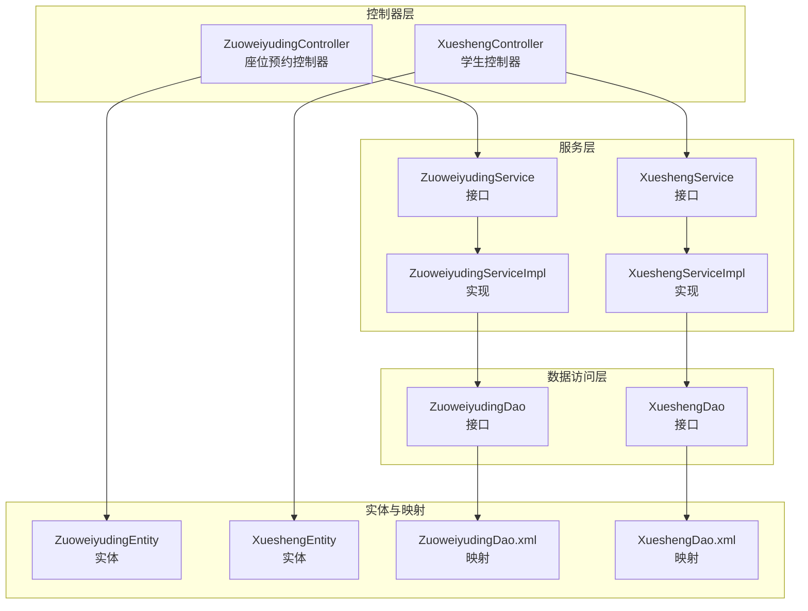
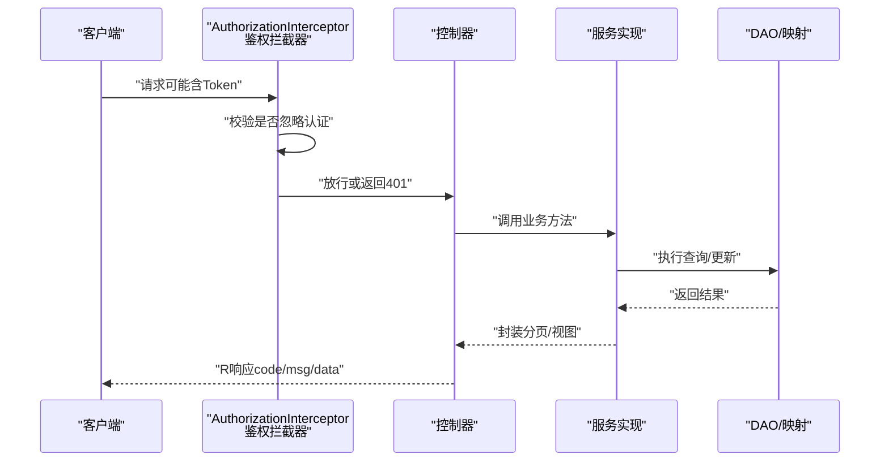
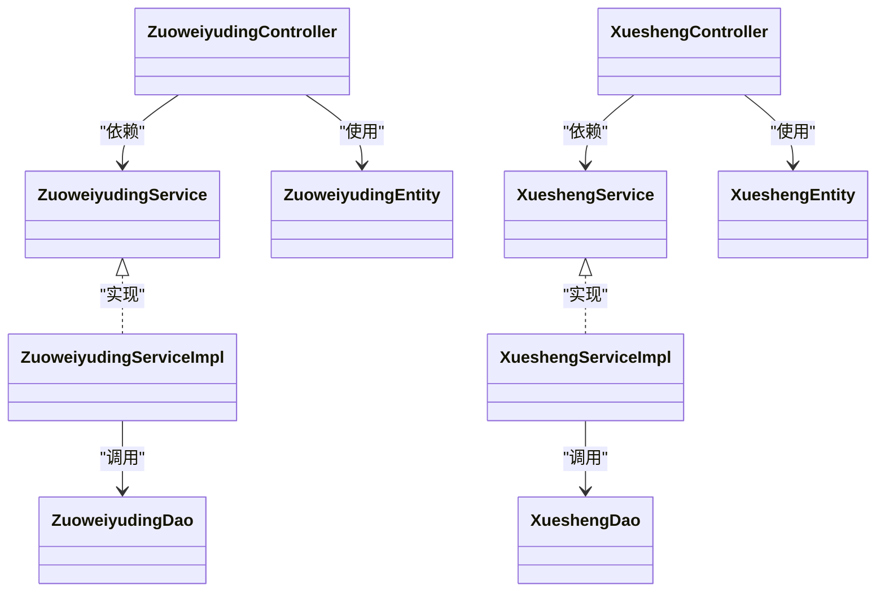
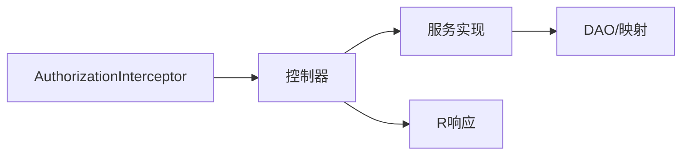

# 座位预约接口

<cite>
**本文引用的文件**
- [ZuoweiyudingController.java](file://src/main/java/com/controller/ZuoweiyudingController.java)
- [XueshengController.java](file://src/main/java/com/controller/XueshengController.java)
- [ZuoweiyudingEntity.java](file://src/main/java/com/entity/ZuoweiyudingEntity.java)
- [XueshengEntity.java](file://src/main/java/com/entity/XueshengEntity.java)
- [ZuoweiyudingService.java](file://src/main/java/com/service/ZuoweiyudingService.java)
- [XueshengService.java](file://src/main/java/com/service/XueshengService.java)
- [ZuoweiyudingServiceImpl.java](file://src/main/java/com/service/impl/ZuoweiyudingServiceImpl.java)
- [XueshengServiceImpl.java](file://src/main/java/com/service/impl/XueshengServiceImpl.java)
- [ZuoweiyudingDao.java](file://src/main/java/com/dao/ZuoweiyudingDao.java)
- [XueshengDao.java](file://src/main/java/com/dao/XueshengDao.java)
- [ZuoweiyudingDao.xml](file://src/main/resources/mapper/ZuoweiyudingDao.xml)
- [XueshengDao.xml](file://src/main/resources/mapper/XueshengDao.xml)
- [R.java](file://src/main/java/com/utils/R.java)
- [AuthorizationInterceptor.java](file://src/main/java/com/interceptor/AuthorizationInterceptor.java)
- [IgnoreAuth.java](file://src/main/java/com/annotation/IgnoreAuth.java)
- [LoginUser.java](file://src/main/java/com/annotation/LoginUser.java)
</cite>

## 目录
1. [简介](#简介)
2. [项目结构](#项目结构)
3. [核心组件](#核心组件)
4. [架构总览](#架构总览)
5. [详细组件分析](#详细组件分析)
6. [依赖关系分析](#依赖关系分析)
7. [性能与扩展性](#性能与扩展性)
8. [故障排查指南](#故障排查指南)
9. [结论](#结论)
10. [附录：接口清单与示例](#附录接口清单与示例)

## 简介
本文件为“座位预约系统”的完整API文档，覆盖以下两条REST API路径：
- 座位预约接口：/zuoweiyuding/*
- 学生管理接口：/xuesheng/*

内容包括：
- 接口定义（HTTP方法、URL、请求参数、响应格式）
- 核心业务流程（座位查询、预约创建、状态更新、取消预约）
- 座位状态管理、预约冲突检测与时间冲突处理机制
- 学生个人信息管理、预约历史查询与座位使用统计相关接口
- 权限控制与数据验证规则
- 完整的接口调用示例与错误处理方案

## 项目结构
后端采用Spring Boot + MyBatis-Plus架构，按“控制器-服务-持久层”分层组织；座位与学生模块分别对应控制器、服务、DAO与XML映射。

图表来源
- [ZuoweiyudingController.java:32-224](file://src/main/java/com/controller/ZuoweiyudingController.java#L32-L224)
- [XueshengController.java:46-284](file://src/main/java/com/controller/XueshengController.java#L46-L284)
- [ZuoweiyudingService.java:21-35](file://src/main/java/com/service/ZuoweiyudingService.java#L21-L35)
- [XueshengService.java:21-35](file://src/main/java/com/service/XueshengService.java#L21-L35)
- [ZuoweiyudingServiceImpl.java:22-62](file://src/main/java/com/service/impl/ZuoweiyudingServiceImpl.java#L22-L62)
- [XueshengServiceImpl.java:22-62](file://src/main/java/com/service/impl/XueshengServiceImpl.java#L22-L62)
- [ZuoweiyudingDao.java:21-33](file://src/main/java/com/dao/ZuoweiyudingDao.java#L21-L33)
- [XueshengDao.java:21-33](file://src/main/java/com/dao/XueshengDao.java#L21-L33)
- [ZuoweiyudingDao.xml:4-42](file://src/main/resources/mapper/ZuoweiyudingDao.xml#L4-L42)
- [XueshengDao.xml:4-41](file://src/main/resources/mapper/XueshengDao.xml#L4-L41)

章节来源
- [ZuoweiyudingController.java:32-224](file://src/main/java/com/controller/ZuoweiyudingController.java#L32-L224)
- [XueshengController.java:46-284](file://src/main/java/com/controller/XueshengController.java#L46-L284)

## 核心组件
- 控制器
  - 座位预约控制器：负责座位列表、详情、保存、更新、删除、提醒等接口
  - 学生控制器：负责登录、注册、退出、个人信息、列表、详情、保存、更新、删除、提醒等接口
- 实体
  - 座位预约实体：包含学生号、姓名、名称、座位号、预约时间、使用时长、审核状态、审核回复等字段
  - 学生实体：包含学号、密码、姓名、头像、性别、手机号、邮箱等字段
- 服务与实现
  - 服务接口定义了分页查询、视图查询、列表查询等能力
  - 实现类基于MyBatis-Plus Page进行分页，并通过DAO执行SQL
- DAO与XML映射
  - DAO定义了通用查询方法
  - XML映射提供SQL语句与结果映射

章节来源
- [ZuoweiyudingEntity.java:21-212](file://src/main/java/com/entity/ZuoweiyudingEntity.java#L21-L212)
- [XueshengEntity.java:31-201](file://src/main/java/com/entity/XueshengEntity.java#L31-L201)
- [ZuoweiyudingService.java:21-35](file://src/main/java/com/service/ZuoweiyudingService.java#L21-L35)
- [XueshengService.java:21-35](file://src/main/java/com/service/XueshengService.java#L21-L35)
- [ZuoweiyudingServiceImpl.java:22-62](file://src/main/java/com/service/impl/ZuoweiyudingServiceImpl.java#L22-L62)
- [XueshengServiceImpl.java:22-62](file://src/main/java/com/service/impl/XueshengServiceImpl.java#L22-L62)
- [ZuoweiyudingDao.java:21-33](file://src/main/java/com/dao/ZuoweiyudingDao.java#L21-L33)
- [XueshengDao.java:21-33](file://src/main/java/com/dao/XueshengDao.java#L21-L33)
- [ZuoweiyudingDao.xml:4-42](file://src/main/resources/mapper/ZuoweiyudingDao.xml#L4-L42)
- [XueshengDao.xml:4-41](file://src/main/resources/mapper/XueshengDao.xml#L4-L41)

## 架构总览
系统通过拦截器统一鉴权，未标注忽略认证的接口均需携带Token；控制器接收请求，调用服务层完成业务逻辑，服务层再委托DAO执行数据库操作。

图表来源
- [AuthorizationInterceptor.java:36-94](file://src/main/java/com/interceptor/AuthorizationInterceptor.java#L36-L94)
- [R.java:9-51](file://src/main/java/com/utils/R.java#L9-L51)
- [ZuoweiyudingController.java:47-61](file://src/main/java/com/controller/ZuoweiyudingController.java#L47-L61)
- [XueshengController.java:125-132](file://src/main/java/com/controller/XueshengController.java#L125-L132)

章节来源
- [AuthorizationInterceptor.java:36-94](file://src/main/java/com/interceptor/AuthorizationInterceptor.java#L36-L94)
- [R.java:9-51](file://src/main/java/com/utils/R.java#L9-L51)

## 详细组件分析

### 座位预约控制器（/zuoweiyuding/*）
- 列表与分页
  - 后端列表：GET /zuoweiyuding/page
  - 前端列表：GET /zuoweiyuding/list
  - 列表（条件查询）：GET /zuoweiyuding/lists
  - 查询（视图）：GET /zuoweiyuding/query
  - 详情（后端）：GET /zuoweiyuding/info/{id}
  - 详情（前端）：GET /zuoweiyuding/detail/{id}
- 新增与保存
  - 后端保存：POST /zuoweiyuding/save
  - 前端保存（带座位选择更新）：POST /zuoweiyuding/add
- 更新与删除
  - 更新：POST /zuoweiyuding/update
  - 批量删除：POST /zuoweiyuding/delete
- 提醒接口
  - GET /zuoweiyuding/remind/{columnName}/{type}?remindstart=&remindend=

请求参数与响应
- 分页与列表：支持按实体字段模糊匹配与范围过滤，返回分页对象（包含记录与总数）
- 详情与查询：返回实体视图对象
- 新增/保存：无特殊参数，返回统一响应
- 提醒：按日期区间统计满足条件的记录数

章节来源
- [ZuoweiyudingController.java:47-219](file://src/main/java/com/controller/ZuoweiyudingController.java#L47-L219)
- [ZuoweiyudingDao.xml:18-40](file://src/main/resources/mapper/ZuoweiyudingDao.xml#L18-L40)

### 学生控制器（/xuesheng/*）
- 登录与注册
  - 登录：POST /xuesheng/login
  - 注册：POST /xuesheng/register
  - 退出：POST /xuesheng/logout
  - 获取当前用户：GET /xuesheng/session
  - 密码重置：POST /xuesheng/resetPass
- 列表与分页
  - 后端列表：GET /xuesheng/page
  - 前端列表：GET /xuesheng/list
  - 列表（条件查询）：GET /xuesheng/lists
  - 查询（视图）：GET /xuesheng/query
  - 详情（后端）：GET /xuesheng/info/{id}
  - 详情（前端）：GET /xuesheng/detail/{id}
- 新增与保存
  - 后端保存：POST /xuesheng/save
  - 前端保存：POST /xuesheng/add
- 更新与删除
  - 更新：POST /xuesheng/update
  - 批量删除：POST /xuesheng/delete
- 提醒接口
  - GET /xuesheng/remind/{columnName}/{type}?remindstart=&remindend=

请求参数与响应
- 登录：用户名、密码、验证码（忽略），返回Token
- 注册：提交学生实体，若学号重复则报错
- 会话：返回当前登录学生信息
- 列表/详情/保存/更新/删除：与座位模块一致

章节来源
- [XueshengController.java:58-279](file://src/main/java/com/controller/XueshengController.java#L58-L279)
- [XueshengDao.xml:17-39](file://src/main/resources/mapper/XueshengDao.xml#L17-L39)

### 数据模型与复杂度
- 实体字段
  - 座位预约：主键、学号、姓名、名称、座位号、预约时间、使用时长、审核状态、审核回复、创建时间
  - 学生：主键、学号、密码、姓名、头像、性别、手机号、邮箱、创建时间
- 复杂度分析
  - 列表/分页查询：基于MyBatis-Plus Page，时间复杂度O(n)，n为记录数
  - 视图查询：通过XML映射返回视图对象，SQL复杂度取决于条件
  - 冲突检测：未在代码中显式实现座位/时间冲突检测，建议在服务层增加约束

章节来源
- [ZuoweiyudingEntity.java:42-98](file://src/main/java/com/entity/ZuoweiyudingEntity.java#L42-L98)
- [XueshengEntity.java:52-99](file://src/main/java/com/entity/XueshengEntity.java#L52-L99)
- [ZuoweiyudingServiceImpl.java:25-40](file://src/main/java/com/service/impl/ZuoweiyudingServiceImpl.java#L25-L40)
- [XueshengServiceImpl.java:25-40](file://src/main/java/com/service/impl/XueshengServiceImpl.java#L25-L40)

### 类关系图

图表来源
- [ZuoweiyudingController.java:34-43](file://src/main/java/com/controller/ZuoweiyudingController.java#L34-L43)
- [XueshengController.java:48-53](file://src/main/java/com/controller/XueshengController.java#L48-L53)
- [ZuoweiyudingService.java:21-35](file://src/main/java/com/service/ZuoweiyudingService.java#L21-L35)
- [XueshengService.java:21-35](file://src/main/java/com/service/XueshengService.java#L21-L35)
- [ZuoweiyudingServiceImpl.java:22-62](file://src/main/java/com/service/impl/ZuoweiyudingServiceImpl.java#L22-L62)
- [XueshengServiceImpl.java:22-62](file://src/main/java/com/service/impl/XueshengServiceImpl.java#L22-L62)
- [ZuoweiyudingDao.java:21-33](file://src/main/java/com/dao/ZuoweiyudingDao.java#L21-L33)
- [XueshengDao.java:21-33](file://src/main/java/com/dao/XueshengDao.java#L21-L33)
- [ZuoweiyudingEntity.java:21-212](file://src/main/java/com/entity/ZuoweiyudingEntity.java#L21-L212)
- [XueshengEntity.java:31-201](file://src/main/java/com/entity/XueshengEntity.java#L31-L201)

## 依赖关系分析
- 控制器到服务：通过@Autowired注入，解耦接口与实现
- 服务到DAO：通过BaseMapper与自定义XML映射执行SQL
- 拦截器到Token：统一鉴权，非忽略接口必须携带Token
- 统一响应：所有接口返回R对象，包含code、msg、data等字段

图表来源
- [AuthorizationInterceptor.java:36-94](file://src/main/java/com/interceptor/AuthorizationInterceptor.java#L36-L94)
- [R.java:9-51](file://src/main/java/com/utils/R.java#L9-L51)

章节来源
- [AuthorizationInterceptor.java:36-94](file://src/main/java/com/interceptor/AuthorizationInterceptor.java#L36-L94)
- [R.java:9-51](file://src/main/java/com/utils/R.java#L9-L51)

## 性能与扩展性
- 分页查询：使用MyBatis-Plus Page，建议对高频查询建立索引（如学号、座位号、预约时间）
- 视图查询：XML映射直接SELECT *，注意避免N+1问题；可按需裁剪字段
- 冲突检测：当前未实现座位/时间冲突检测，建议在服务层增加唯一性约束与并发控制
- 缓存策略：可引入Redis缓存热点数据（如座位状态）

[本节为通用建议，无需特定文件来源]

## 故障排查指南
- 401未授权
  - 现象：返回统一错误响应
  - 原因：缺少Token或Token无效
  - 处理：先登录获取Token并设置请求头
- 用户名重复
  - 现象：注册失败
  - 原因：学号已存在
  - 处理：更换学号或联系管理员
- 参数校验
  - 现象：部分接口注释了校验调用
  - 建议：开启校验以提升健壮性

章节来源
- [AuthorizationInterceptor.java:81-93](file://src/main/java/com/interceptor/AuthorizationInterceptor.java#L81-L93)
- [XueshengController.java:74-85](file://src/main/java/com/controller/XueshengController.java#L74-L85)
- [ZuoweiyudingController.java:118-124](file://src/main/java/com/controller/ZuoweiyudingController.java#L118-L124)

## 结论
本系统提供了完整的座位预约与学生管理REST API，具备基础的列表、详情、新增、更新、删除与提醒功能。建议后续增强：
- 明确座位/时间冲突检测与审核流程
- 补充参数校验与更细粒度的权限控制
- 引入缓存与索引优化查询性能

[本节为总结，无需特定文件来源]

## 附录：接口清单与示例

### 座位预约接口（/zuoweiyuding/*）
- 列表与分页
  - GET /zuoweiyuding/page
    - 请求参数：分页参数与实体字段（模糊/范围）
    - 响应：分页对象（data包含记录列表与总数）
  - GET /zuoweiyuding/list
    - 请求参数：分页参数与实体字段
    - 响应：分页对象
  - GET /zuoweiyuding/lists
    - 请求参数：实体字段（全等条件）
    - 响应：列表视图
  - GET /zuoweiyuding/query
    - 请求参数：实体字段（全等条件）
    - 响应：视图对象
  - GET /zuoweiyuding/info/{id}
    - 路径参数：id
    - 响应：实体详情
  - GET /zuoweiyuding/detail/{id}
    - 路径参数：id
    - 响应：实体详情
- 新增与保存
  - POST /zuoweiyuding/save
    - 请求体：座位预约实体
    - 响应：统一成功
  - POST /zuoweiyuding/add
    - 请求体：座位预约实体（包含zixishiId）
    - 响应：统一成功（同时更新座位选择集合）
- 更新与删除
  - POST /zuoweiyuding/update
    - 请求体：座位预约实体
    - 响应：统一成功
  - POST /zuoweiyuding/delete
    - 请求体：id数组
    - 响应：统一成功
- 提醒接口
  - GET /zuoweiyuding/remind/{columnName}/{type}?remindstart=&remindend=
    - 路径参数：列名、类型（支持日期区间）
    - 响应：数量统计

章节来源
- [ZuoweiyudingController.java:47-219](file://src/main/java/com/controller/ZuoweiyudingController.java#L47-L219)
- [ZuoweiyudingDao.xml:18-40](file://src/main/resources/mapper/ZuoweiyudingDao.xml#L18-L40)

### 学生管理接口（/xuesheng/*）
- 登录与注册
  - POST /xuesheng/login
    - 请求参数：username、password、captcha
    - 响应：Token
  - POST /xuesheng/register
    - 请求体：学生实体
    - 响应：统一成功（若学号重复则失败）
  - POST /xuesheng/logout
    - 响应：统一成功
  - GET /xuesheng/session
    - 响应：当前用户信息
  - POST /xuesheng/resetPass
    - 请求参数：username
    - 响应：统一成功（密码重置为默认值）
- 列表与分页
  - GET /xuesheng/page
    - 请求参数：分页参数与实体字段
    - 响应：分页对象
  - GET /xuesheng/list
    - 请求参数：分页参数与实体字段
    - 响应：分页对象
  - GET /xuesheng/lists
    - 请求参数：实体字段（全等条件）
    - 响应：列表视图
  - GET /xuesheng/query
    - 请求参数：实体字段（全等条件）
    - 响应：视图对象
  - GET /xuesheng/info/{id}
    - 路径参数：id
    - 响应：实体详情
  - GET /xuesheng/detail/{id}
    - 路径参数：id
    - 响应：实体详情
- 新增与保存
  - POST /xuesheng/save
    - 请求体：学生实体
    - 响应：统一成功（若学号重复则失败）
  - POST /xuesheng/add
    - 请求体：学生实体
    - 响应：统一成功（若学号重复则失败）
- 更新与删除
  - POST /xuesheng/update
    - 请求体：学生实体
    - 响应：统一成功
  - POST /xuesheng/delete
    - 请求体：id数组
    - 响应：统一成功
- 提醒接口
  - GET /xuesheng/remind/{columnName}/{type}?remindstart=&remindend=
    - 路径参数：列名、类型（支持日期区间）
    - 响应：数量统计

章节来源
- [XueshengController.java:58-279](file://src/main/java/com/controller/XueshengController.java#L58-L279)
- [XueshengDao.xml:17-39](file://src/main/resources/mapper/XueshengDao.xml#L17-L39)

### 统一响应格式（R）
- 成功：code=0，msg为提示信息，data为具体数据
- 失败：code为错误码，msg为错误信息
- 示例
  - 成功：{"code":0,"msg":"操作成功","data":{}}
  - 失败：{"code":500,"msg":"未知异常，请联系管理员"}

章节来源
- [R.java:9-51](file://src/main/java/com/utils/R.java#L9-L51)

### 权限控制与数据验证
- 权限控制
  - 未标注忽略认证的接口均需携带Token（请求头名为Token）
  - 登录接口允许忽略认证
- 数据验证
  - 部分接口注释了校验调用，建议启用以保证数据一致性

章节来源
- [AuthorizationInterceptor.java:58-79](file://src/main/java/com/interceptor/AuthorizationInterceptor.java#L58-L79)
- [IgnoreAuth.java:8-13](file://src/main/java/com/annotation/IgnoreAuth.java#L8-L13)
- [LoginUser.java:11-15](file://src/main/java/com/annotation/LoginUser.java#L11-L15)

### 座位状态管理与冲突处理机制
- 状态字段
  - 审核状态：sfsh（例如“是/否”）
  - 审核回复：shhf
- 冲突检测
  - 当前代码未实现座位/时间冲突检测
  - 建议在服务层增加唯一性约束与并发控制，防止同一座位在同一时间段被重复预约
- 时间冲突处理
  - 建议在新增/更新时校验预约开始时间与结束时间，确保不与其他记录重叠

[本节为机制说明，无需特定文件来源]