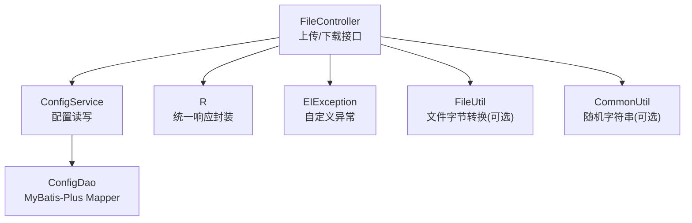
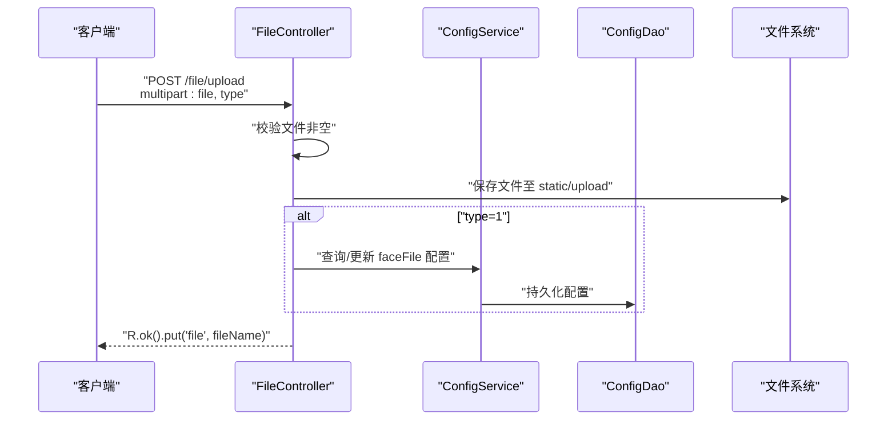
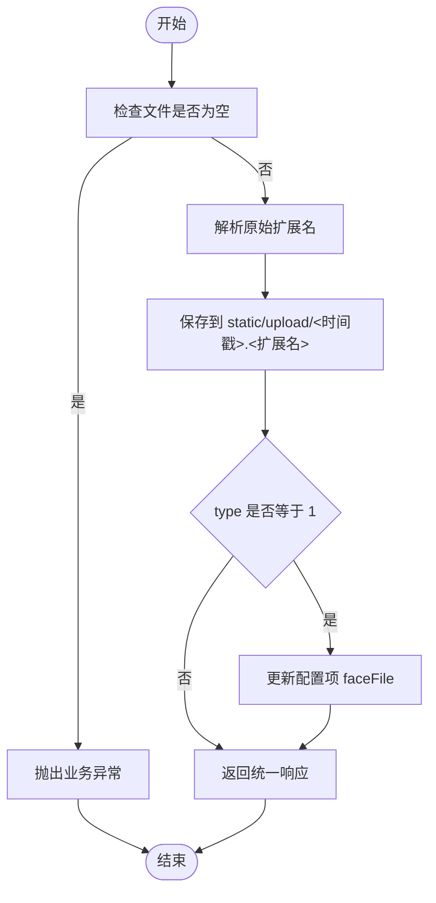
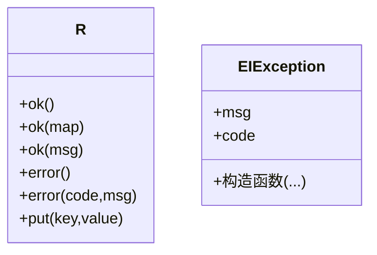
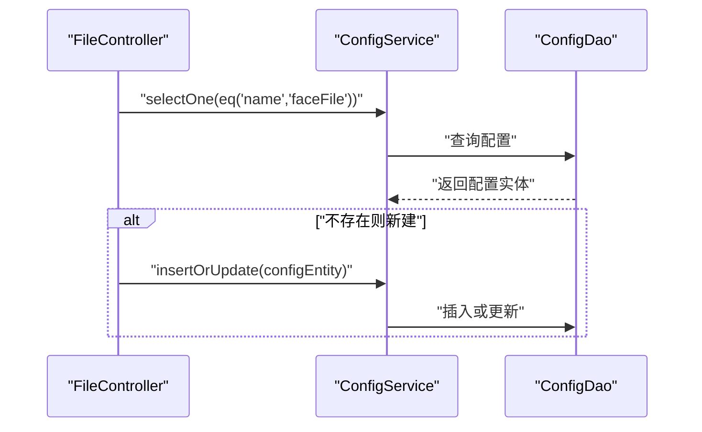
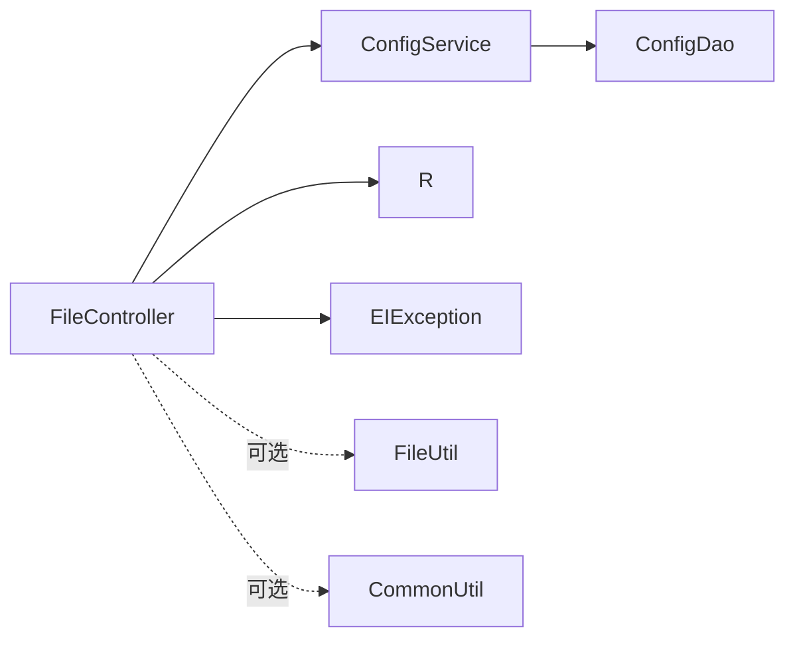

# 文件上传接口

<cite>
**本文引用的文件**
- [FileController.java](file://src/main/java/com/controller/FileController.java)
- [R.java](file://src/main/java/com/utils/R.java)
- [EIException.java](file://src/main/java/com/entity/EIException.java)
- [ConfigService.java](file://src/main/java/com/service/ConfigService.java)
- [ConfigDao.java](file://src/main/java/com/dao/ConfigDao.java)
- [CommonController.java](file://src/main/java/com/controller/CommonController.java)
- [CommonUtil.java](file://src/main/java/com/utils/CommonUtil.java)
- [FileUtil.java](file://src/main/java/com/utils/FileUtil.java)
</cite>

## 目录
1. [简介](#简介)
2. [项目结构](#项目结构)
3. [核心组件](#核心组件)
4. [架构总览](#架构总览)
5. [详细组件分析](#详细组件分析)
6. [依赖分析](#依赖分析)
7. [性能考虑](#性能考虑)
8. [故障排查指南](#故障排查指南)
9. [结论](#结论)
10. [附录](#附录)

## 简介
本文件上传系统提供基础的文件上传、下载能力，并支持将特定文件（如头像）标记为系统配置项。系统采用Spring Boot实现，使用统一响应包装类与自定义异常类进行错误处理。当前仓库中未发现多文件上传、文件删除、文件列表查询、批量操作等扩展接口；安全校验、病毒扫描与内容检测机制也未在现有代码中体现。

## 项目结构
与文件上传相关的核心模块如下：
- 控制器：FileController 提供上传与下载接口
- 工具类：R 统一响应封装；EIException 自定义异常；CommonUtil 随机字符串工具；FileUtil 文件字节转换工具
- 配置服务与持久层：ConfigService/ConfigDao 支持将上传文件名写入系统配置表

图表来源
- [FileController.java:42-111](file://src/main/java/com/controller/FileController.java#L42-L111)
- [ConfigService.java:14-16](file://src/main/java/com/service/ConfigService.java#L14-L16)
- [ConfigDao.java:10-12](file://src/main/java/com/dao/ConfigDao.java#L10-L12)
- [R.java:9-51](file://src/main/java/com/utils/R.java#L9-L51)
- [EIException.java:7-52](file://src/main/java/com/entity/EIException.java#L7-L52)
- [FileUtil.java:13-27](file://src/main/java/com/utils/FileUtil.java#L13-L27)
- [CommonUtil.java:5-22](file://src/main/java/com/utils/CommonUtil.java#L5-L22)

章节来源
- [FileController.java:42-111](file://src/main/java/com/controller/FileController.java#L42-L111)
- [R.java:9-51](file://src/main/java/com/utils/R.java#L9-L51)
- [EIException.java:7-52](file://src/main/java/com/entity/EIException.java#L7-L52)
- [ConfigService.java:14-16](file://src/main/java/com/service/ConfigService.java#L14-L16)
- [ConfigDao.java:10-12](file://src/main/java/com/dao/ConfigDao.java#L10-L12)
- [FileUtil.java:13-27](file://src/main/java/com/utils/FileUtil.java#L13-L27)
- [CommonUtil.java:5-22](file://src/main/java/com/utils/CommonUtil.java#L5-L22)

## 核心组件
- FileController：提供 /file/upload 单文件上传与 /file/download 文件下载接口
- R：统一返回体，包含 code、msg 与业务数据
- EIException：自定义异常，用于抛出业务错误
- ConfigService/ConfigDao：配置读写，支持将上传文件名写入系统配置表
- FileUtil：文件转字节工具（可选）
- CommonUtil：生成随机字符串（可选）

章节来源
- [FileController.java:42-111](file://src/main/java/com/controller/FileController.java#L42-L111)
- [R.java:9-51](file://src/main/java/com/utils/R.java#L9-L51)
- [EIException.java:7-52](file://src/main/java/com/entity/EIException.java#L7-L52)
- [ConfigService.java:14-16](file://src/main/java/com/service/ConfigService.java#L14-L16)
- [ConfigDao.java:10-12](file://src/main/java/com/dao/ConfigDao.java#L10-L12)
- [FileUtil.java:13-27](file://src/main/java/com/utils/FileUtil.java#L13-L27)
- [CommonUtil.java:5-22](file://src/main/java/com/utils/CommonUtil.java#L5-L22)

## 架构总览
文件上传流程概览：
- 客户端通过 multipart/form-data 提交文件
- 控制器解析请求参数与文件
- 校验文件非空后保存到 classpath:static/upload 目录
- 若 type=1，则将文件名写入系统配置表
- 返回统一响应对象

图表来源
- [FileController.java:48-77](file://src/main/java/com/controller/FileController.java#L48-L77)
- [ConfigService.java:14-16](file://src/main/java/com/service/ConfigService.java#L14-L16)
- [ConfigDao.java:10-12](file://src/main/java/com/dao/ConfigDao.java#L10-L12)

## 详细组件分析

### 接口定义与行为
- 接口路径：/file/upload
  - 方法：POST
  - 参数：
    - file：必填，MultipartFile
    - type：可选，字符串
  - 行为：
    - 校验文件非空
    - 解析原始扩展名
    - 保存到 classpath:static/upload 目录，文件名为时间戳+原扩展名
    - 若 type=1，将文件名写入系统配置项 faceFile
  - 响应：统一响应对象，包含 file 字段

- 接口路径：/file/download
  - 方法：GET
  - 参数：
    - fileName：必填，字符串
  - 行为：
    - 从 classpath:static/upload 目录读取文件
    - 设置下载响应头并返回文件字节流
  - 响应：HTTP 201 或 500

章节来源
- [FileController.java:48-77](file://src/main/java/com/controller/FileController.java#L48-L77)
- [FileController.java:82-108](file://src/main/java/com/controller/FileController.java#L82-L108)

### 数据模型与存储
- 存储位置：classpath:static/upload
- 文件命名规则：时间戳毫秒数 + 原扩展名
- 配置项：当 type=1 时，将上传文件名写入系统配置表的 faceFile 键

图表来源
- [FileController.java:49-76](file://src/main/java/com/controller/FileController.java#L49-L76)
- [ConfigService.java:14-16](file://src/main/java/com/service/ConfigService.java#L14-L16)
- [ConfigDao.java:10-12](file://src/main/java/com/dao/ConfigDao.java#L10-L12)

### 统一响应与异常处理
- 统一响应类 R 提供 ok/error 多种静态方法，返回包含 code、msg 的Map包装
- 自定义异常类 EIException 支持携带消息与状态码

图表来源
- [R.java:9-51](file://src/main/java/com/utils/R.java#L9-L51)
- [EIException.java:7-52](file://src/main/java/com/entity/EIException.java#L7-L52)

章节来源
- [R.java:9-51](file://src/main/java/com/utils/R.java#L9-L51)
- [EIException.java:7-52](file://src/main/java/com/entity/EIException.java#L7-L52)

### 配置读写流程
- 查询/更新系统配置项 faceFile，使用 MyBatis-Plus 的通用 Service 与 Mapper

图表来源
- [FileController.java:65-75](file://src/main/java/com/controller/FileController.java#L65-L75)
- [ConfigService.java:14-16](file://src/main/java/com/service/ConfigService.java#L14-L16)
- [ConfigDao.java:10-12](file://src/main/java/com/dao/ConfigDao.java#L10-L12)

章节来源
- [FileController.java:65-75](file://src/main/java/com/controller/FileController.java#L65-L75)
- [ConfigService.java:14-16](file://src/main/java/com/service/ConfigService.java#L14-L16)
- [ConfigDao.java:10-12](file://src/main/java/com/dao/ConfigDao.java#L10-L12)

### 辅助功能与扩展点
- 文件字节转换：FileUtil 提供文件转字节数组的能力，可用于后续内容检测或二次处理
- 随机字符串：CommonUtil 提供随机字符串生成，可用于生成更复杂的文件名或令牌

章节来源
- [FileUtil.java:13-27](file://src/main/java/com/utils/FileUtil.java#L13-L27)
- [CommonUtil.java:5-22](file://src/main/java/com/utils/CommonUtil.java#L5-L22)

## 依赖分析
- FileController 依赖：
  - ConfigService：用于读写系统配置
  - R：统一响应封装
  - EIException：业务异常抛出
- ConfigService/ConfigDao：基于 MyBatis-Plus 的通用接口与 Mapper
- 工具类：FileUtil、CommonUtil 作为可选扩展

图表来源
- [FileController.java:43-44](file://src/main/java/com/controller/FileController.java#L43-L44)
- [ConfigService.java:14-16](file://src/main/java/com/service/ConfigService.java#L14-L16)
- [ConfigDao.java:10-12](file://src/main/java/com/dao/ConfigDao.java#L10-L12)
- [R.java:9-51](file://src/main/java/com/utils/R.java#L9-L51)
- [EIException.java:7-52](file://src/main/java/com/entity/EIException.java#L7-L52)
- [FileUtil.java:13-27](file://src/main/java/com/utils/FileUtil.java#L13-L27)
- [CommonUtil.java:5-22](file://src/main/java/com/utils/CommonUtil.java#L5-L22)

章节来源
- [FileController.java:43-44](file://src/main/java/com/controller/FileController.java#L43-L44)
- [ConfigService.java:14-16](file://src/main/java/com/service/ConfigService.java#L14-L16)
- [ConfigDao.java:10-12](file://src/main/java/com/dao/ConfigDao.java#L10-L12)
- [R.java:9-51](file://src/main/java/com/utils/R.java#L9-L51)
- [EIException.java:7-52](file://src/main/java/com/entity/EIException.java#L7-L52)
- [FileUtil.java:13-27](file://src/main/java/com/utils/FileUtil.java#L13-L27)
- [CommonUtil.java:5-22](file://src/main/java/com/utils/CommonUtil.java#L5-L22)

## 性能考虑
- 文件存储：当前使用本地 classpath:static/upload 目录，适合开发与小规模场景；生产环境建议迁移到独立存储（如对象存储）并结合 CDN 加速
- 并发与线程：上传接口未显式加锁，需确保文件系统并发安全与磁盘空间监控
- 响应头：下载接口设置为附件形式，便于浏览器触发下载
- 扩展建议：
  - 引入异步处理与队列，避免阻塞IO
  - 对大文件分片上传与断点续传
  - 使用压缩与缓存策略减少带宽占用

## 故障排查指南
- 上传失败
  - 检查文件是否为空
  - 确认 static/upload 目录存在且具备写权限
  - 查看自定义异常信息与统一响应中的错误码
- 下载失败
  - 确认文件名正确且文件存在于 static/upload 目录
  - 检查文件系统权限与路径拼接
- 配置写入失败
  - 确认数据库连接正常，ConfigDao 可访问
  - 检查 MyBatis-Plus 配置与实体映射

章节来源
- [FileController.java:50-52](file://src/main/java/com/controller/FileController.java#L50-L52)
- [FileController.java:84-107](file://src/main/java/com/controller/FileController.java#L84-L107)
- [EIException.java:7-52](file://src/main/java/com/entity/EIException.java#L7-L52)
- [R.java:24-29](file://src/main/java/com/utils/R.java#L24-L29)

## 结论
该文件上传系统提供了最小可用集：单文件上传与下载，并支持将特定文件写入系统配置。当前未包含多文件上传、删除、列表查询、批量操作、类型/大小限制、安全校验、病毒扫描与内容检测等高级能力。建议在生产环境中引入对象存储、CDN、缓存与安全防护机制，并扩展接口以满足业务需求。

## 附录

### 接口调用示例（路径与参数）
- 单文件上传
  - 路径：/file/upload
  - 方法：POST
  - 内容类型：multipart/form-data
  - 参数：
    - file：必填，文件字段
    - type：可选，字符串（当值为 1 时，将文件名写入配置项）
  - 成功响应：包含 file 字段的统一响应对象
- 文件下载
  - 路径：/file/download
  - 方法：GET
  - 参数：
    - fileName：必填，字符串
  - 成功响应：HTTP 201 附带文件字节流与下载响应头

章节来源
- [FileController.java:48-77](file://src/main/java/com/controller/FileController.java#L48-L77)
- [FileController.java:82-108](file://src/main/java/com/controller/FileController.java#L82-L108)

### 安全与合规建议
- 文件类型限制：建议在控制器中增加 MIME 类型与扩展名校验
- 文件大小限制：建议在 Web 容器或框架层面配置最大文件尺寸
- 访问控制：当前下载接口未做鉴权，建议结合登录态或权限注解
- 病毒扫描与内容检测：可在保存后异步执行扫描与内容审核
- 日志审计：记录上传/下载事件与异常，便于追踪与审计

### 存储策略与CDN集成
- 本地开发：classpath:static/upload
- 生产部署：对象存储（如 OSS/COS/S3）+ CDN 分发
- 缓存机制：对热点资源启用 CDN 缓存，对动态资源设置合理缓存策略