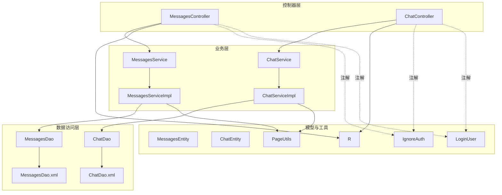
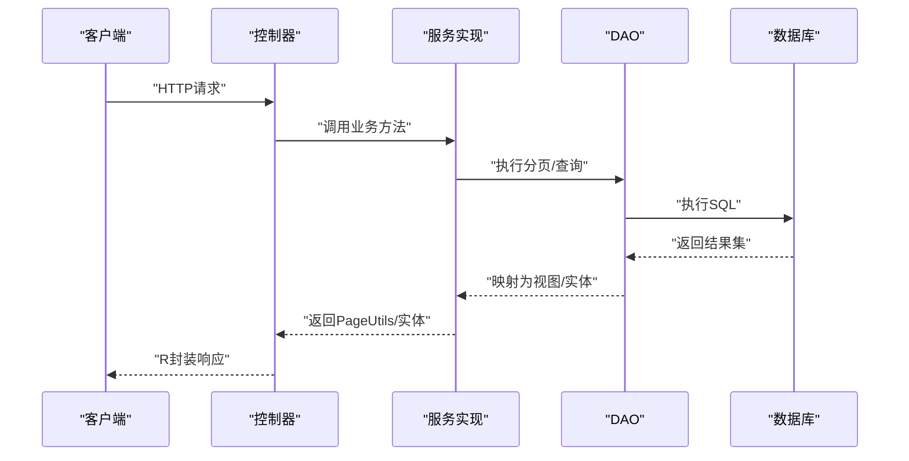
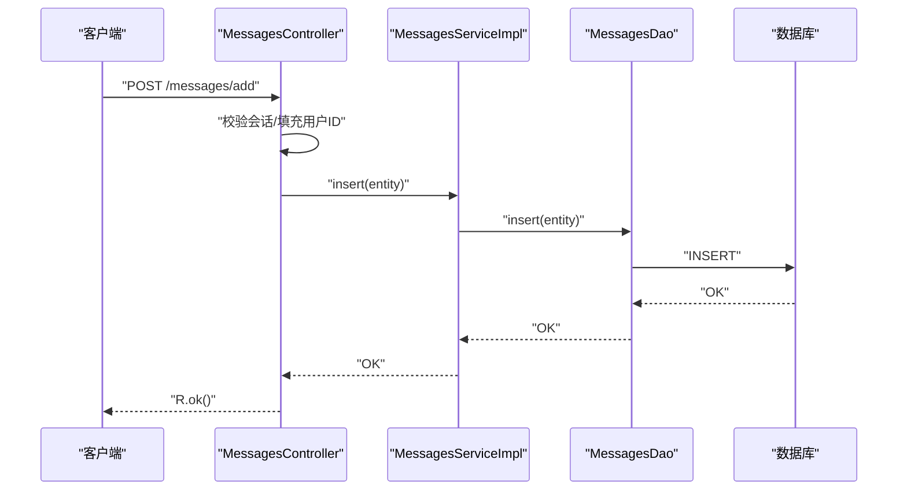
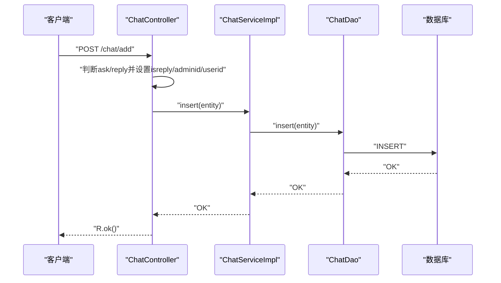
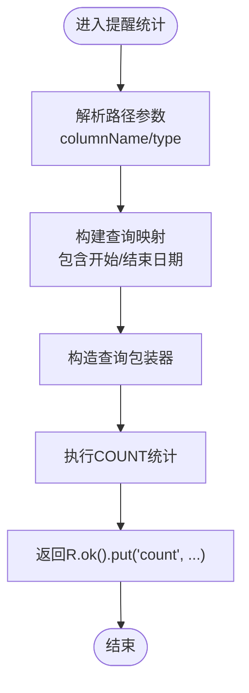
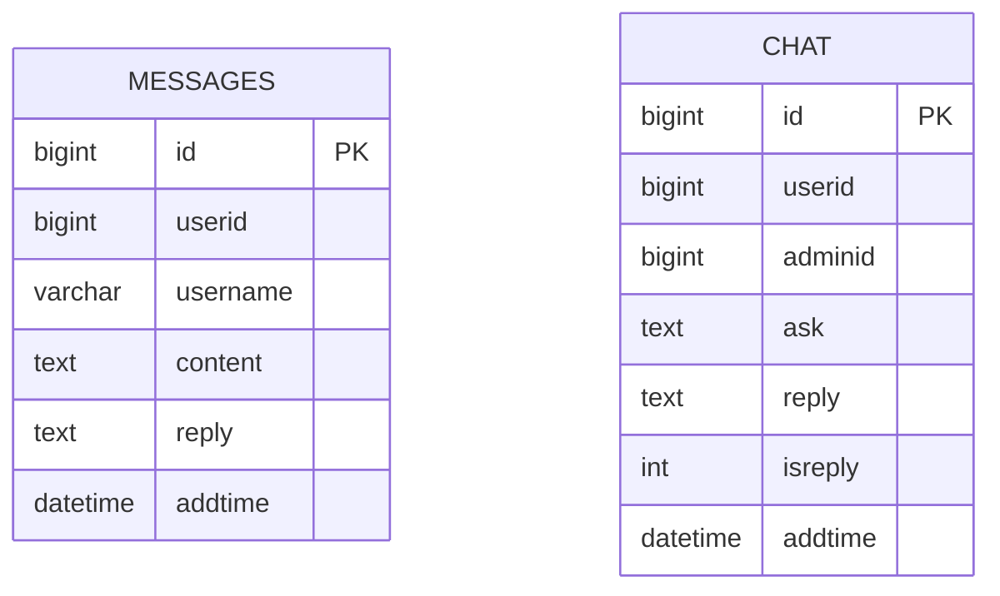
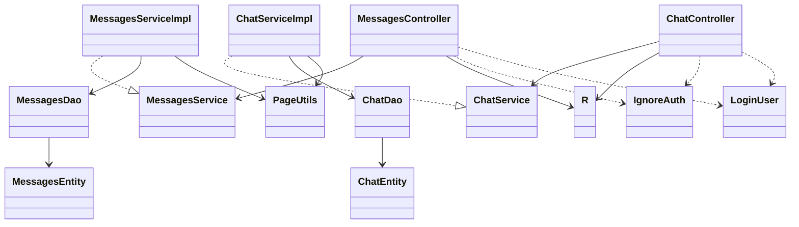

# 消息聊天接口

<cite>
**本文引用的文件**
- [MessagesController.java](file://src/main/java/com/controller/MessagesController.java)
- [ChatController.java](file://src/main/java/com/controller/ChatController.java)
- [MessagesService.java](file://src/main/java/com/service/MessagesService.java)
- [ChatService.java](file://src/main/java/com/service/ChatService.java)
- [MessagesServiceImpl.java](file://src/main/java/com/service/impl/MessagesServiceImpl.java)
- [ChatServiceImpl.java](file://src/main/java/com/service/impl/ChatServiceImpl.java)
- [MessagesDao.java](file://src/main/java/com/dao/MessagesDao.java)
- [ChatDao.java](file://src/main/java/com/dao/ChatDao.java)
- [MessagesDao.xml](file://src/main/resources/mapper/MessagesDao.xml)
- [ChatDao.xml](file://src/main/resources/mapper/ChatDao.xml)
- [MessagesEntity.java](file://src/main/java/com/entity/MessagesEntity.java)
- [ChatEntity.java](file://src/main/java/com/entity/ChatEntity.java)
- [R.java](file://src/main/java/com/utils/R.java)
- [PageUtils.java](file://src/main/java/com/utils/PageUtils.java)
- [LoginUser.java](file://src/main/java/com/annotation/LoginUser.java)
- [IgnoreAuth.java](file://src/main/java/com/annotation/IgnoreAuth.java)
</cite>

## 目录
1. [简介](#简介)
2. [项目结构](#项目结构)
3. [核心组件](#核心组件)
4. [架构总览](#架构总览)
5. [详细组件分析](#详细组件分析)
6. [依赖分析](#依赖分析)
7. [性能考虑](#性能考虑)
8. [故障排查指南](#故障排查指南)
9. [结论](#结论)
10. [附录](#附录)

## 简介
本文件为“消息与聊天系统”的API文档，覆盖以下接口范围：
- 消息接口：/messages/*
- 聊天接口：/chat/*

内容包括：
- 站内信发送、接收、删除等消息管理功能
- 聊天记录查询、消息状态更新、未读消息统计等接口规范
- 消息的分类管理、优先级设置与批量操作能力说明
- 消息模板、消息推送与通知提醒相关接口说明
- 完整的接口调用示例与实时通信机制建议
- 消息安全传输、隐私保护与权限控制策略
- 扩展接口与集成方案

## 项目结构
后端采用Spring Boot + MyBatis-Plus标准分层架构：
- 控制器层：MessagesController、ChatController
- 业务逻辑层：MessagesService、ChatService及其实现类
- 数据访问层：MessagesDao、ChatDao及对应的XML映射
- 实体模型：MessagesEntity、ChatEntity
- 工具与响应封装：R、PageUtils
- 注解：LoginUser、IgnoreAuth

图表来源
- [MessagesController.java:46-213](file://src/main/java/com/controller/MessagesController.java#L46-L213)
- [ChatController.java:46-231](file://src/main/java/com/controller/ChatController.java#L46-L231)
- [MessagesService.java:21-35](file://src/main/java/com/service/MessagesService.java#L21-L35)
- [ChatService.java:21-35](file://src/main/java/com/service/ChatService.java#L21-L35)
- [MessagesServiceImpl.java:22-62](file://src/main/java/com/service/impl/MessagesServiceImpl.java#L22-L62)
- [ChatServiceImpl.java:22-62](file://src/main/java/com/service/impl/ChatServiceImpl.java#L22-L62)
- [MessagesDao.java:21-33](file://src/main/java/com/dao/MessagesDao.java#L21-L33)
- [ChatDao.java:21-33](file://src/main/java/com/dao/ChatDao.java#L21-L33)
- [MessagesDao.xml:4-38](file://src/main/resources/mapper/MessagesDao.xml#L4-L38)
- [ChatDao.xml:4-39](file://src/main/resources/mapper/ChatDao.xml#L4-L39)
- [MessagesEntity.java:31-147](file://src/main/java/com/entity/MessagesEntity.java#L31-L147)
- [ChatEntity.java:31-165](file://src/main/java/com/entity/ChatEntity.java#L31-L165)
- [R.java:9-51](file://src/main/java/com/utils/R.java#L9-L51)
- [PageUtils.java:13-101](file://src/main/java/com/utils/PageUtils.java#L13-L101)
- [IgnoreAuth.java:8-13](file://src/main/java/com/annotation/IgnoreAuth.java#L8-L13)
- [LoginUser.java:11-15](file://src/main/java/com/annotation/LoginUser.java#L11-L15)

章节来源
- [MessagesController.java:46-213](file://src/main/java/com/controller/MessagesController.java#L46-L213)
- [ChatController.java:46-231](file://src/main/java/com/controller/ChatController.java#L46-L231)

## 核心组件
- 控制器
  - MessagesController：提供消息列表、详情、新增、修改、删除、分页、提醒统计等接口
  - ChatController：提供聊天列表、详情、新增、修改、删除、分页、提醒统计等接口
- 服务接口与实现
  - MessagesService/ChatService：定义分页查询、视图查询、列表查询等方法
  - MessagesServiceImpl/ChatServiceImpl：基于MyBatis-Plus实现分页与视图查询
- 数据访问层
  - MessagesDao/ChatDao：继承BaseMapper，提供VO/View查询方法
  - XML映射：定义SQL查询与结果映射
- 实体模型
  - MessagesEntity：消息实体，含用户标识、内容、回复、时间戳等字段
  - ChatEntity：聊天实体，含用户/管理员标识、提问、回复、是否回复标记等字段
- 工具与响应
  - R：统一响应封装，包含code/msg/data等
  - PageUtils：分页工具类，封装总条数、页码、每页数量等

章节来源
- [MessagesService.java:21-35](file://src/main/java/com/service/MessagesService.java#L21-L35)
- [ChatService.java:21-35](file://src/main/java/com/service/ChatService.java#L21-L35)
- [MessagesServiceImpl.java:22-62](file://src/main/java/com/service/impl/MessagesServiceImpl.java#L22-L62)
- [ChatServiceImpl.java:22-62](file://src/main/java/com/service/impl/ChatServiceImpl.java#L22-L62)
- [MessagesDao.java:21-33](file://src/main/java/com/dao/MessagesDao.java#L21-L33)
- [ChatDao.java:21-33](file://src/main/java/com/dao/ChatDao.java#L21-L33)
- [MessagesDao.xml:4-38](file://src/main/resources/mapper/MessagesDao.xml#L4-L38)
- [ChatDao.xml:4-39](file://src/main/resources/mapper/ChatDao.xml#L4-L39)
- [MessagesEntity.java:31-147](file://src/main/java/com/entity/MessagesEntity.java#L31-L147)
- [ChatEntity.java:31-165](file://src/main/java/com/entity/ChatEntity.java#L31-L165)
- [R.java:9-51](file://src/main/java/com/utils/R.java#L9-L51)
- [PageUtils.java:13-101](file://src/main/java/com/utils/PageUtils.java#L13-L101)

## 架构总览
消息与聊天模块遵循MVC与分层架构，控制器负责参数解析与权限校验，服务层负责业务编排与分页查询，DAO层通过XML映射执行SQL。

图表来源
- [MessagesController.java:57-80](file://src/main/java/com/controller/MessagesController.java#L57-L80)
- [ChatController.java:57-80](file://src/main/java/com/controller/ChatController.java#L57-L80)
- [MessagesServiceImpl.java:34-40](file://src/main/java/com/service/impl/MessagesServiceImpl.java#L34-L40)
- [ChatServiceImpl.java:34-40](file://src/main/java/com/service/impl/ChatServiceImpl.java#L34-L40)
- [MessagesDao.xml:26-31](file://src/main/resources/mapper/MessagesDao.xml#L26-L31)
- [ChatDao.xml:27-32](file://src/main/resources/mapper/ChatDao.xml#L27-L32)
- [R.java:9-51](file://src/main/java/com/utils/R.java#L9-L51)

## 详细组件分析

### 消息接口（/messages/*）
- 接口概览
  - 列表/分页：支持后端列表与前端列表，支持按条件过滤与排序
  - 详情：按ID查询消息详情
  - 新增：后端保存与前端添加（前端需登录态）
  - 更新：修改消息
  - 删除：批量删除
  - 提醒统计：按列与类型进行提醒计数（支持区间）

- 权限与会话
  - 非管理员用户仅能查看/操作自身相关数据
  - 前端新增时自动填充用户ID

- 关键流程（新增消息）

图表来源
- [MessagesController.java:138-145](file://src/main/java/com/controller/MessagesController.java#L138-L145)
- [MessagesServiceImpl.java:22-22](file://src/main/java/com/service/impl/MessagesServiceImpl.java#L22-L22)
- [MessagesDao.xml:14-18](file://src/main/resources/mapper/MessagesDao.xml#L14-L18)

- 关键流程（提醒统计）

图表来源
- [MessagesController.java:170-208](file://src/main/java/com/controller/MessagesController.java#L170-L208)

章节来源
- [MessagesController.java:57-208](file://src/main/java/com/controller/MessagesController.java#L57-L208)
- [MessagesService.java:21-35](file://src/main/java/com/service/MessagesService.java#L21-L35)
- [MessagesServiceImpl.java:22-62](file://src/main/java/com/service/impl/MessagesServiceImpl.java#L22-L62)
- [MessagesDao.java:21-33](file://src/main/java/com/dao/MessagesDao.java#L21-L33)
- [MessagesDao.xml:4-38](file://src/main/resources/mapper/MessagesDao.xml#L4-L38)
- [MessagesEntity.java:31-147](file://src/main/java/com/entity/MessagesEntity.java#L31-L147)

### 聊天接口（/chat/*）
- 接口概览
  - 列表/分页：支持后端列表与前端列表，支持按条件过滤与排序
  - 详情：按ID查询聊天详情
  - 新增：后端保存与前端添加（区分提问/回复场景，自动更新“是否回复”标记）
  - 更新：修改聊天
  - 删除：批量删除
  - 提醒统计：按列与类型进行提醒计数（支持区间）

- 关键流程（新增聊天）

图表来源
- [ChatController.java:147-163](file://src/main/java/com/controller/ChatController.java#L147-L163)
- [ChatServiceImpl.java:22-22](file://src/main/java/com/service/impl/ChatServiceImpl.java#L22-L22)
- [ChatDao.xml:15-19](file://src/main/resources/mapper/ChatDao.xml#L15-L19)

- 关键流程（提醒统计）

图表来源
- [ChatController.java:188-226](file://src/main/java/com/controller/ChatController.java#L188-L226)

章节来源
- [ChatController.java:57-226](file://src/main/java/com/controller/ChatController.java#L57-L226)
- [ChatService.java:21-35](file://src/main/java/com/service/ChatService.java#L21-L35)
- [ChatServiceImpl.java:22-62](file://src/main/java/com/service/impl/ChatServiceImpl.java#L22-L62)
- [ChatDao.java:21-33](file://src/main/java/com/dao/ChatDao.java#L21-L33)
- [ChatDao.xml:4-39](file://src/main/resources/mapper/ChatDao.xml#L4-L39)
- [ChatEntity.java:31-165](file://src/main/java/com/entity/ChatEntity.java#L31-L165)

### 数据模型
- 消息模型（MessagesEntity）
  - 字段：主键、用户ID、用户名、内容、回复、时间戳
  - 用途：站内信/留言管理
- 聊天模型（ChatEntity）
  - 字段：主键、用户ID、管理员ID、提问、回复、是否回复标记、时间戳
  - 用途：客服聊天记录与状态管理

图表来源
- [MessagesEntity.java:31-147](file://src/main/java/com/entity/MessagesEntity.java#L31-L147)
- [ChatEntity.java:31-165](file://src/main/java/com/entity/ChatEntity.java#L31-L165)

章节来源
- [MessagesEntity.java:31-147](file://src/main/java/com/entity/MessagesEntity.java#L31-L147)
- [ChatEntity.java:31-165](file://src/main/java/com/entity/ChatEntity.java#L31-L165)

### 统一响应与分页
- 统一响应（R）
  - 结构：code、msg、data
  - 用法：成功/失败封装、携带数据
- 分页（PageUtils）
  - 结构：total、pageSize、totalPage、currPage、list
  - 用法：控制器返回分页数据

章节来源
- [R.java:9-51](file://src/main/java/com/utils/R.java#L9-L51)
- [PageUtils.java:13-101](file://src/main/java/com/utils/PageUtils.java#L13-L101)

## 依赖分析
- 控制器到服务：控制器依赖服务接口，实现松耦合
- 服务到DAO：服务实现依赖DAO接口，DAO依赖XML映射
- 实体到映射：实体与XML映射一一对应，字段一致
- 注解：IgnoreAuth用于忽略认证；LoginUser用于注入登录用户信息（控制器中存在该注解但未在消息/聊天控制器中直接使用）

图表来源
- [MessagesController.java:46-213](file://src/main/java/com/controller/MessagesController.java#L46-L213)
- [ChatController.java:46-231](file://src/main/java/com/controller/ChatController.java#L46-L231)
- [MessagesService.java:21-35](file://src/main/java/com/service/MessagesService.java#L21-L35)
- [ChatService.java:21-35](file://src/main/java/com/service/ChatService.java#L21-L35)
- [MessagesServiceImpl.java:22-62](file://src/main/java/com/service/impl/MessagesServiceImpl.java#L22-L62)
- [ChatServiceImpl.java:22-62](file://src/main/java/com/service/impl/ChatServiceImpl.java#L22-L62)
- [MessagesDao.java:21-33](file://src/main/java/com/dao/MessagesDao.java#L21-L33)
- [ChatDao.java:21-33](file://src/main/java/com/dao/ChatDao.java#L21-L33)
- [MessagesEntity.java:31-147](file://src/main/java/com/entity/MessagesEntity.java#L31-L147)
- [ChatEntity.java:31-165](file://src/main/java/com/entity/ChatEntity.java#L31-L165)
- [R.java:9-51](file://src/main/java/com/utils/R.java#L9-L51)
- [PageUtils.java:13-101](file://src/main/java/com/utils/PageUtils.java#L13-L101)
- [IgnoreAuth.java:8-13](file://src/main/java/com/annotation/IgnoreAuth.java#L8-L13)
- [LoginUser.java:11-15](file://src/main/java/com/annotation/LoginUser.java#L11-L15)

章节来源
- [MessagesController.java:46-213](file://src/main/java/com/controller/MessagesController.java#L46-L213)
- [ChatController.java:46-231](file://src/main/java/com/controller/ChatController.java#L46-L231)

## 性能考虑
- 分页查询：使用PageUtils与MyBatis-Plus分页插件，避免一次性加载大量数据
- SQL映射：XML中使用动态where片段，减少拼接复杂度
- 视图查询：通过selectListView/selectView返回视图对象，减少不必要的字段传输
- 批量删除：使用批量ID删除，降低网络往返次数

[本节为通用性能建议，不涉及具体文件分析]

## 故障排查指南
- 统一响应错误
  - 使用R.error()返回错误信息，检查code与msg字段
- 分页异常
  - 确认PageUtils构造参数与MyBatis-Plus分页插件配置一致
- 权限问题
  - 非管理员用户仅能操作自身数据，检查会话中的角色与用户ID
- 提醒统计异常
  - 检查提醒参数（remindstart/remindend）与类型（type），确保日期格式正确

章节来源
- [R.java:16-29](file://src/main/java/com/utils/R.java#L16-L29)
- [PageUtils.java:44-58](file://src/main/java/com/utils/PageUtils.java#L44-L58)
- [MessagesController.java:60-62](file://src/main/java/com/controller/MessagesController.java#L60-L62)
- [ChatController.java:60-62](file://src/main/java/com/controller/ChatController.java#L60-L62)

## 结论
消息与聊天模块提供了完整的消息管理与客服聊天能力，具备良好的分层设计与可扩展性。通过统一响应与分页工具，保证了接口的一致性与性能。后续可在以下方面增强：
- 引入消息模板与推送通知机制
- 增加消息优先级与分类字段
- 支持批量操作与异步处理
- 加强实时通信能力（WebSocket/长轮询）

[本节为总结性内容，不涉及具体文件分析]

## 附录

### 接口清单与调用示例（路径与方法）
- 消息接口（/messages/*）
  - GET /messages/page：分页列表（支持过滤与排序）
  - GET /messages/list：前端列表（支持过滤）
  - GET /messages/lists：列表查询（全字段等值）
  - GET /messages/query：查询（视图）
  - GET /messages/info/{id}：后端详情
  - GET /messages/detail/{id}：前端详情
  - POST /messages/save：后端保存
  - POST /messages/add：前端添加（自动填充用户ID）
  - POST /messages/update：修改
  - POST /messages/delete：批量删除
  - GET /messages/remind/{columnName}/{type}：提醒统计（支持日期区间）
- 聊天接口（/chat/*）
  - GET /chat/page：分页列表（支持过滤与排序）
  - GET /chat/list：前端列表（支持过滤）
  - GET /chat/lists：列表查询（全字段等值）
  - GET /chat/query：查询（视图）
  - GET /chat/info/{id}：后端详情
  - GET /chat/detail/{id}：前端详情
  - POST /chat/save：后端保存（自动更新isreply）
  - POST /chat/add：前端添加（自动更新isreply）
  - POST /chat/update：修改
  - POST /chat/delete：批量删除
  - GET /chat/remind/{columnName}/{type}：提醒统计（支持日期区间）

[本节为接口清单汇总，不包含代码示例内容]

### 实时通信机制建议
- WebSocket：建立持久连接，实现实时消息推送
- 长轮询：在不支持WebSocket的环境下，采用定时轮询拉取最新消息
- 事件驱动：结合消息状态变更触发通知推送

[本节为概念性建议，不涉及具体文件分析]

### 安全传输、隐私保护与权限控制
- 认证与授权
  - 使用会话或Token进行身份识别
  - 非管理员用户仅能操作自身数据
- 数据脱敏
  - 在返回视图中避免敏感字段
- 输入校验
  - 对关键字段进行长度、格式校验
- 日志审计
  - 记录敏感操作日志，便于追踪

[本节为通用安全建议，不涉及具体文件分析]

### 扩展接口与集成方案
- 模板化消息
  - 引入消息模板表，支持变量替换与多语言
- 推送与通知
  - 集成第三方推送服务（短信、邮件、站内信）
- 批量操作
  - 扩展批量导入、导出与状态批量更新
- 分类与优先级
  - 新增分类字段与优先级字段，支持筛选与排序

[本节为扩展性建议，不涉及具体文件分析]