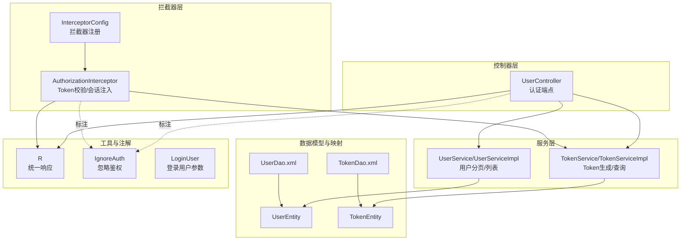
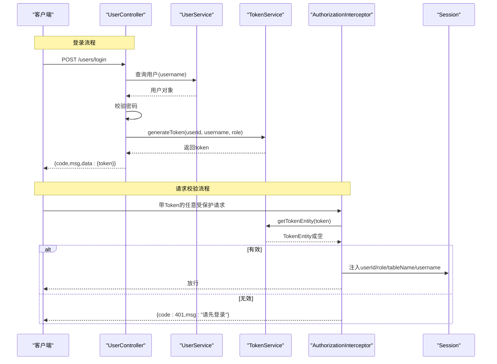
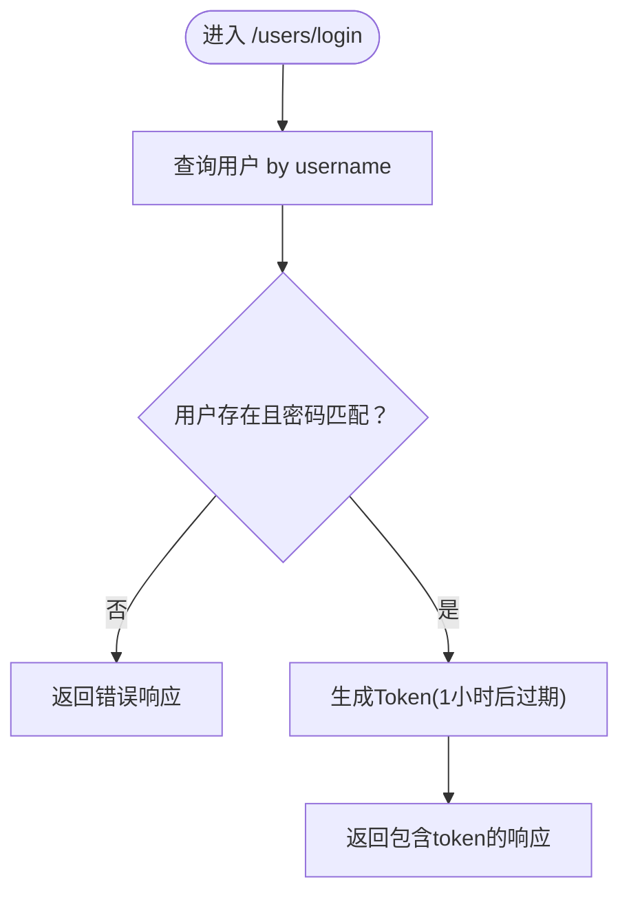
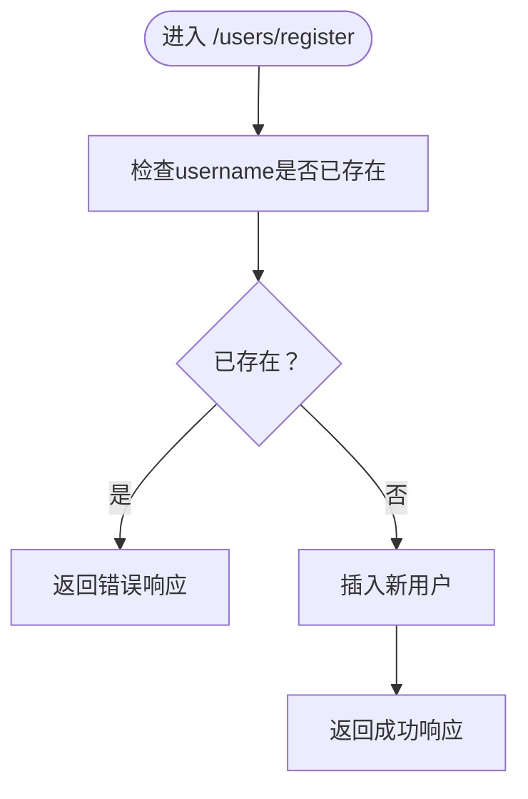
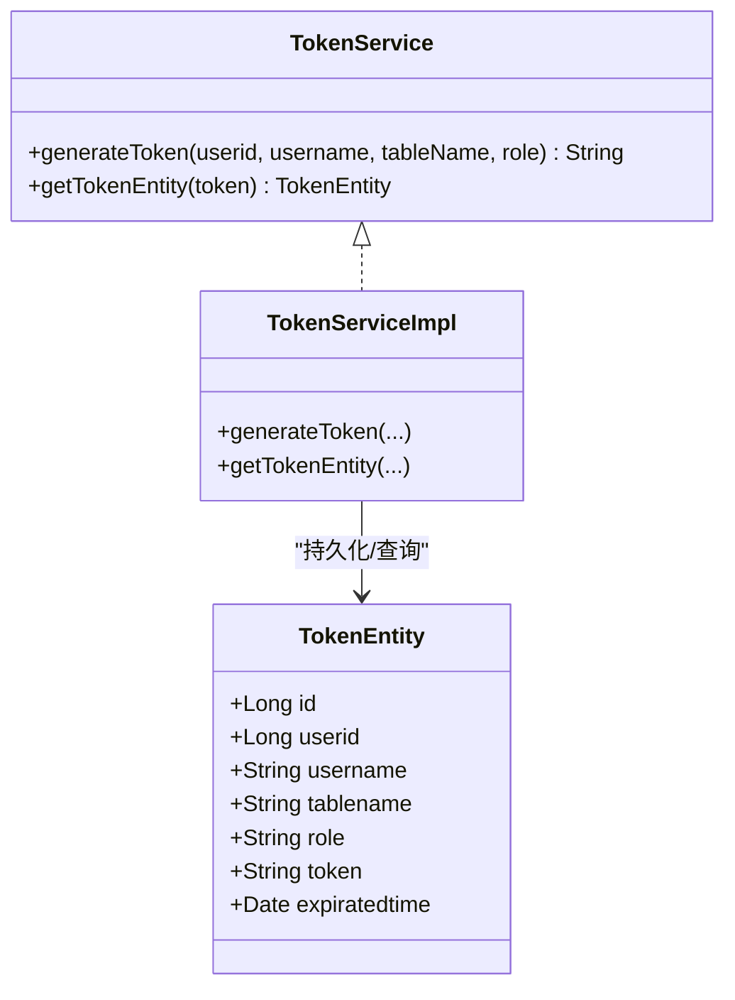
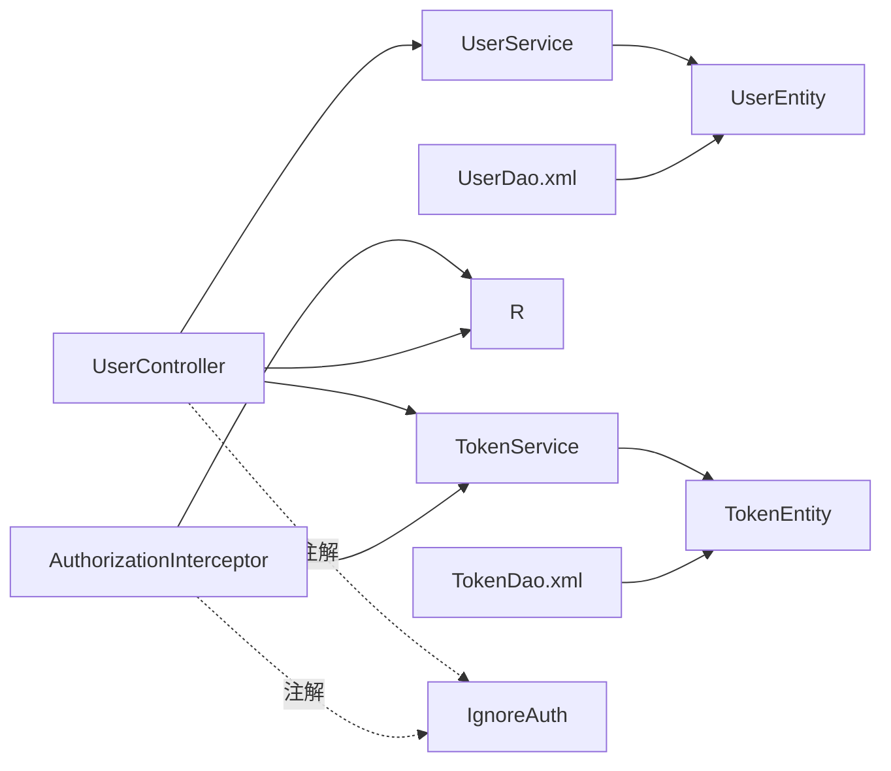

# 用户认证接口

<cite>
**本文引用的文件**
- [UserController.java](file://src/main/java/com/controller/UserController.java)
- [TokenService.java](file://src/main/java/com/service/TokenService.java)
- [TokenServiceImpl.java](file://src/main/java/com/service/impl/TokenServiceImpl.java)
- [AuthorizationInterceptor.java](file://src/main/java/com/interceptor/AuthorizationInterceptor.java)
- [InterceptorConfig.java](file://src/main/java/com/config/InterceptorConfig.java)
- [R.java](file://src/main/java/com/utils/R.java)
- [UserEntity.java](file://src/main/java/com/entity/UserEntity.java)
- [TokenEntity.java](file://src/main/java/com/entity/TokenEntity.java)
- [IgnoreAuth.java](file://src/main/java/com/annotation/IgnoreAuth.java)
- [LoginUser.java](file://src/main/java/com/annotation/LoginUser.java)
- [UserDao.xml](file://src/main/resources/mapper/UserDao.xml)
- [TokenDao.xml](file://src/main/resources/mapper/TokenDao.xml)
</cite>

## 目录
1. [简介](#简介)
2. [项目结构](#项目结构)
3. [核心组件](#核心组件)
4. [架构总览](#架构总览)
5. [详细组件分析](#详细组件分析)
6. [依赖关系分析](#依赖关系分析)
7. [性能与安全考量](#性能与安全考量)
8. [故障排查指南](#故障排查指南)
9. [结论](#结论)
10. [附录：接口定义与示例](#附录接口定义与示例)

## 简介
本文件面向“用户认证接口”的使用与集成，聚焦以下核心能力：
- 登录接口（/users/login）
- 注册接口（/users/register）
- 退出接口（/users/logout）
- 密码重置接口（/users/resetPass）

文档将说明各接口的HTTP方法、请求参数、响应格式、错误码；深入解析登录时的用户名/密码验证流程、Token生成与过期机制、会话管理；阐述注册时的用户信息校验与重复用户检查逻辑；并提供成功与失败场景的调用示例。同时给出安全建议、Token有效期管理与权限控制机制。

## 项目结构
围绕认证的关键模块如下：
- 控制层：UserController 提供认证相关REST端点
- 拦截器：AuthorizationInterceptor 统一进行Token校验与会话注入
- 配置：InterceptorConfig 将拦截器应用到全局路径
- 服务层：TokenService/TokenServiceImpl 实现Token生成与查询
- 实体与映射：UserEntity、TokenEntity 及其MyBatis映射XML
- 工具与注解：R统一响应、IgnoreAuth忽略鉴权、LoginUser参数标注等

图表来源
- [UserController.java:38-175](file://src/main/java/com/controller/UserController.java#L38-L175)
- [AuthorizationInterceptor.java:28-96](file://src/main/java/com/interceptor/AuthorizationInterceptor.java#L28-L96)
- [InterceptorConfig.java:11-39](file://src/main/java/com/config/InterceptorConfig.java#L11-L39)
- [TokenService.java:13-27](file://src/main/java/com/service/TokenService.java#L13-L27)
- [TokenServiceImpl.java:28-80](file://src/main/java/com/service/impl/TokenServiceImpl.java#L28-L80)
- [UserEntity.java:10-78](file://src/main/java/com/entity/UserEntity.java#L10-L78)
- [TokenEntity.java:10-133](file://src/main/java/com/entity/TokenEntity.java#L10-L133)
- [UserDao.xml:4-13](file://src/main/resources/mapper/UserDao.xml#L4-L13)
- [TokenDao.xml:4-13](file://src/main/resources/mapper/TokenDao.xml#L4-L13)
- [R.java:9-52](file://src/main/java/com/utils/R.java#L9-L52)
- [IgnoreAuth.java:5-14](file://src/main/java/com/annotation/IgnoreAuth.java#L5-L14)
- [LoginUser.java:8-16](file://src/main/java/com/annotation/LoginUser.java#L8-L16)

章节来源
- [UserController.java:38-175](file://src/main/java/com/controller/UserController.java#L38-L175)
- [AuthorizationInterceptor.java:28-96](file://src/main/java/com/interceptor/AuthorizationInterceptor.java#L28-L96)
- [InterceptorConfig.java:11-39](file://src/main/java/com/config/InterceptorConfig.java#L11-L39)

## 核心组件
- 认证控制器（UserController）：提供登录、注册、退出、密码重置等端点，均位于/users路径下
- Token服务（TokenService/TokenServiceImpl）：负责生成随机Token并设置1小时有效期，以及按Token查询有效记录
- 全局拦截器（AuthorizationInterceptor）：从请求头读取Token，校验有效性，注入会话信息（userId、role、tableName、username），未通过则返回401
- 统一响应（R）：所有接口返回统一结构，包含code、msg及业务数据
- 实体与映射：UserEntity、TokenEntity及其MyBatis XML映射

章节来源
- [UserController.java:48-98](file://src/main/java/com/controller/UserController.java#L48-L98)
- [TokenService.java:16-26](file://src/main/java/com/service/TokenService.java#L16-L26)
- [TokenServiceImpl.java:54-78](file://src/main/java/com/service/impl/TokenServiceImpl.java#L54-L78)
- [AuthorizationInterceptor.java:36-94](file://src/main/java/com/interceptor/AuthorizationInterceptor.java#L36-L94)
- [R.java:9-52](file://src/main/java/com/utils/R.java#L9-L52)

## 架构总览
认证流程概览：
- 登录：提交用户名/密码，后端校验用户存在且密码匹配，生成Token并返回
- 请求：携带Token在请求头（Header）中以“Token”键传递
- 校验：拦截器读取Token，查询Token是否有效（未过期），有效则注入会话信息放行
- 退出：销毁当前会话，返回成功
- 密码重置：根据用户名重置为固定值（演示用途）

图表来源
- [UserController.java:51-60](file://src/main/java/com/controller/UserController.java#L51-L60)
- [TokenServiceImpl.java:54-69](file://src/main/java/com/service/impl/TokenServiceImpl.java#L54-L69)
- [AuthorizationInterceptor.java:58-79](file://src/main/java/com/interceptor/AuthorizationInterceptor.java#L58-L79)

## 详细组件分析

### 登录接口（/users/login）
- 方法与路径：POST /users/login
- 请求参数（表单字段）：username、password、captcha（当前实现未使用验证码校验）
- 处理流程：
  - 根据username查询用户
  - 校验用户是否存在且密码匹配
  - 若通过，调用TokenService生成Token（1小时有效期）
  - 返回统一响应，包含token
- 响应结构：统一由R封装，包含code、msg、data（含token）
- 错误码：当账号或密码不正确时返回错误响应
- 安全提示：当前密码比较为明文对比，建议改为加密存储与比对

图表来源
- [UserController.java:51-60](file://src/main/java/com/controller/UserController.java#L51-L60)
- [TokenServiceImpl.java:54-69](file://src/main/java/com/service/impl/TokenServiceImpl.java#L54-L69)

章节来源
- [UserController.java:51-60](file://src/main/java/com/controller/UserController.java#L51-L60)
- [TokenServiceImpl.java:54-69](file://src/main/java/com/service/impl/TokenServiceImpl.java#L54-L69)

### 注册接口（/users/register）
- 方法与路径：POST /users/register
- 请求体：JSON对象，对应UserEntity（username、password、role等）
- 处理流程：
  - 校验username是否已存在
  - 若不存在则插入新用户
  - 返回统一响应
- 响应结构：统一由R封装，包含code、msg
- 错误码：当用户名已存在时返回错误响应
- 数据模型：UserEntity映射至users表

图表来源
- [UserController.java:65-74](file://src/main/java/com/controller/UserController.java#L65-L74)
- [UserEntity.java:14-78](file://src/main/java/com/entity/UserEntity.java#L14-L78)

章节来源
- [UserController.java:65-74](file://src/main/java/com/controller/UserController.java#L65-L74)
- [UserEntity.java:14-78](file://src/main/java/com/entity/UserEntity.java#L14-L78)

### 退出接口（/users/logout）
- 方法与路径：GET /users/logout
- 请求参数：无
- 处理流程：使当前会话失效并返回成功消息
- 响应结构：统一由R封装，包含code、msg

章节来源
- [UserController.java:79-83](file://src/main/java/com/controller/UserController.java#L79-L83)

### 密码重置接口（/users/resetPass）
- 方法与路径：GET /users/resetPass
- 请求参数：username
- 处理流程：
  - 根据username查询用户
  - 若不存在返回错误
  - 将用户密码更新为固定值（演示用途）
  - 返回成功消息
- 响应结构：统一由R封装，包含code、msg

章节来源
- [UserController.java:88-98](file://src/main/java/com/controller/UserController.java#L88-L98)

### Token生成与校验机制
- 生成策略：
  - TokenService.generateToken接收userid、username、表名、角色
  - 生成32位随机字符串作为token
  - 设置过期时间为当前时间+1小时
  - 若同用户同角色已有记录则更新token与过期时间，否则新增
- 校验策略：
  - 拦截器从请求头读取“Token”
  - 调用TokenService.getTokenEntity(token)
  - 若为空或已过期则判定无效
  - 有效则将用户信息注入Session（userId、role、tableName、username），放行

图表来源
- [TokenService.java:16-26](file://src/main/java/com/service/TokenService.java#L16-L26)
- [TokenServiceImpl.java:28-80](file://src/main/java/com/service/impl/TokenServiceImpl.java#L28-L80)
- [TokenEntity.java:14-133](file://src/main/java/com/entity/TokenEntity.java#L14-L133)

章节来源
- [TokenService.java:23-25](file://src/main/java/com/service/TokenService.java#L23-L25)
- [TokenServiceImpl.java:54-78](file://src/main/java/com/service/impl/TokenServiceImpl.java#L54-L78)
- [AuthorizationInterceptor.java:58-79](file://src/main/java/com/interceptor/AuthorizationInterceptor.java#L58-L79)

### 权限控制与会话管理
- 拦截器注册：全局路径拦截，排除静态资源
- 忽略鉴权：带@IgnoreAuth注解的方法跳过Token校验
- 会话注入：校验通过后将用户关键信息写入Session，便于后续业务使用
- 跨域支持：拦截器设置必要的CORS头，处理预检请求

章节来源
- [InterceptorConfig.java:19-23](file://src/main/java/com/config/InterceptorConfig.java#L19-L23)
- [AuthorizationInterceptor.java:36-94](file://src/main/java/com/interceptor/AuthorizationInterceptor.java#L36-L94)
- [IgnoreAuth.java:5-14](file://src/main/java/com/annotation/IgnoreAuth.java#L5-L14)

## 依赖关系分析
- 控制器依赖服务层与工具类，服务层依赖DAO与实体
- 拦截器依赖TokenService与统一响应
- 注解用于声明式忽略鉴权
- MyBatis XML映射提供列表查询SQL

图表来源
- [UserController.java:42-46](file://src/main/java/com/controller/UserController.java#L42-L46)
- [AuthorizationInterceptor.java:33-34](file://src/main/java/com/interceptor/AuthorizationInterceptor.java#L33-L34)
- [UserDao.xml:4-13](file://src/main/resources/mapper/UserDao.xml#L4-L13)
- [TokenDao.xml:4-13](file://src/main/resources/mapper/TokenDao.xml#L4-L13)
- [IgnoreAuth.java:5-14](file://src/main/java/com/annotation/IgnoreAuth.java#L5-L14)

章节来源
- [UserController.java:42-46](file://src/main/java/com/controller/UserController.java#L42-L46)
- [AuthorizationInterceptor.java:33-34](file://src/main/java/com/interceptor/AuthorizationInterceptor.java#L33-L34)

## 性能与安全考量
- 性能
  - Token查询为单条记录按token查询，建议在token列建立索引
  - 登录与注册涉及数据库写入，建议结合连接池与慢查询监控
- 安全
  - 密码明文存储与比对存在风险，建议迁移为安全哈希（如BCrypt）与盐值
  - Token有效期为1小时，建议结合刷新Token策略与滑动过期
  - 当前拦截器未限制IP/频率，建议增加防刷与黑名单机制
  - 建议启用HTTPS、CSRF防护与CORS白名单
- 会话与权限
  - 拦截器将用户信息注入Session，注意Session共享与集群部署下的会话同步问题
  - 对于多角色系统，建议完善权限矩阵与细粒度授权

[本节为通用指导，无需特定文件引用]

## 故障排查指南
- 401 未登录
  - 现象：返回“请先登录”
  - 排查：确认请求头是否包含“Token”，Token是否有效且未过期
- 账号或密码不正确
  - 现象：登录失败
  - 排查：确认用户名存在、密码匹配（当前为明文比对）
- 用户已存在
  - 现象：注册失败
  - 排查：检查username是否重复
- Token无效或过期
  - 现象：拦截器拒绝请求
  - 排查：重新登录获取新Token，或检查服务器时间与时区

章节来源
- [AuthorizationInterceptor.java:81-93](file://src/main/java/com/interceptor/AuthorizationInterceptor.java#L81-L93)
- [UserController.java:55-57](file://src/main/java/com/controller/UserController.java#L55-L57)
- [UserController.java:69-71](file://src/main/java/com/controller/UserController.java#L69-L71)
- [TokenServiceImpl.java:72-78](file://src/main/java/com/service/impl/TokenServiceImpl.java#L72-L78)

## 结论
该认证体系通过简单的Token机制实现了基本的登录、注册、退出与密码重置能力。拦截器提供了统一的权限校验入口，配合Session注入简化了后续业务开发。建议优先完成密码安全加固、Token有效期与刷新策略优化，并完善跨域、防刷与权限控制，以满足生产环境的安全与稳定性要求。

[本节为总结性内容，无需特定文件引用]

## 附录：接口定义与示例

### 统一响应结构
- 字段
  - code：整数，0表示成功，非0为错误码
  - msg：字符串，操作结果描述
  - data：对象，承载具体业务数据（如token）

章节来源
- [R.java:9-52](file://src/main/java/com/utils/R.java#L9-L52)

### 登录接口（/users/login）
- 方法：POST
- 路径：/users/login
- 请求参数
  - username：字符串
  - password：字符串
  - captcha：字符串（当前未使用）
- 成功响应示例
  - code：0
  - msg：成功消息
  - data：{ token："..." }
- 失败响应示例
  - code：非0
  - msg："账号或密码不正确"

章节来源
- [UserController.java:51-60](file://src/main/java/com/controller/UserController.java#L51-L60)
- [R.java:31-45](file://src/main/java/com/utils/R.java#L31-L45)

### 注册接口（/users/register）
- 方法：POST
- 路径：/users/register
- 请求体
  - username：字符串
  - password：字符串
  - role：字符串
- 成功响应示例
  - code：0
  - msg：成功消息
- 失败响应示例
  - code：非0
  - msg："用户已存在"

章节来源
- [UserController.java:65-74](file://src/main/java/com/controller/UserController.java#L65-L74)
- [UserEntity.java:14-78](file://src/main/java/com/entity/UserEntity.java#L14-L78)

### 退出接口（/users/logout）
- 方法：GET
- 路径：/users/logout
- 成功响应示例
  - code：0
  - msg："退出成功"

章节来源
- [UserController.java:79-83](file://src/main/java/com/controller/UserController.java#L79-L83)

### 密码重置接口（/users/resetPass）
- 方法：GET
- 路径：/users/resetPass
- 请求参数
  - username：字符串
- 成功响应示例
  - code：0
  - msg："密码已重置为：123456"
- 失败响应示例
  - code：非0
  - msg："账号不存在"

章节来源
- [UserController.java:88-98](file://src/main/java/com/controller/UserController.java#L88-L98)

### 请求头与会话
- 请求头
  - Token：登录成功后返回的字符串
- 会话注入（校验通过后）
  - userId：Long
  - role：字符串
  - tableName：字符串
  - username：字符串

章节来源
- [AuthorizationInterceptor.java:58-79](file://src/main/java/com/interceptor/AuthorizationInterceptor.java#L58-L79)