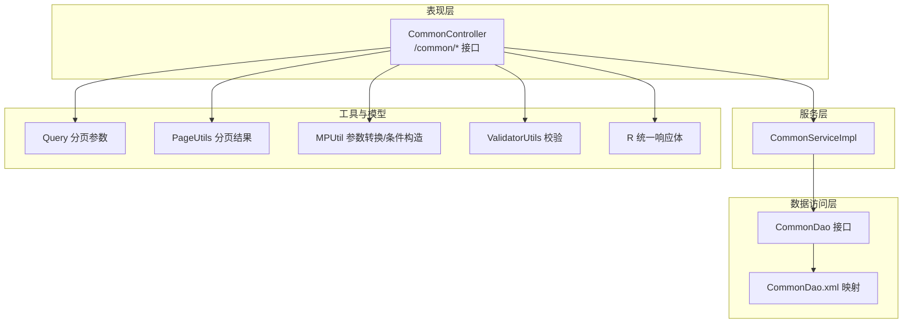
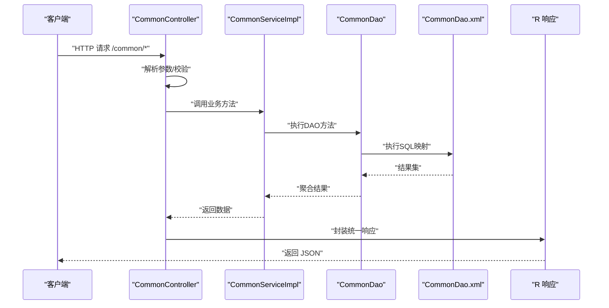
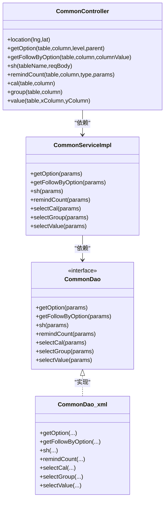

# 通用查询接口

<cite>
**本文引用的文件**
- [CommonController.java](file://src/main/java/com/controller/CommonController.java)
- [CommonServiceImpl.java](file://src/main/java/com/service/impl/CommonServiceImpl.java)
- [CommonDao.java](file://src/main/java/com/dao/CommonDao.java)
- [CommonDao.xml](file://src/main/resources/mapper/CommonDao.xml)
- [R.java](file://src/main/java/com/utils/R.java)
- [PageUtils.java](file://src/main/java/com/utils/PageUtils.java)
- [Query.java](file://src/main/java/com/utils/Query.java)
- [MPUtil.java](file://src/main/java/com/utils/MPUtil.java)
- [ValidatorUtils.java](file://src/main/java/com/utils/ValidatorUtils.java)
</cite>

## 目录
1. [简介](#简介)
2. [项目结构](#项目结构)
3. [核心组件](#核心组件)
4. [架构总览](#架构总览)
5. [详细组件分析](#详细组件分析)
6. [依赖关系分析](#依赖关系分析)
7. [性能与缓存策略](#性能与缓存策略)
8. [故障排查指南](#故障排查指南)
9. [结论](#结论)
10. [附录：接口清单与示例](#附录接口清单与示例)

## 简介
本文件面向“通用查询接口”（/common/*）的RESTful API，系统性梳理以下能力：
- 分页查询：统一分页参数、排序规则、安全过滤
- 条件查询：多字段模糊/精确匹配、范围筛选、排序组合
- 数据统计：单列求和、分组统计、按值统计
- 辅助功能：数据字典联动、地区定位、文件上传、审核状态更新、提醒计数
- 统一响应与异常：标准返回体、错误码与状态说明
- 最佳实践：参数标准化、SQL注入防护、性能优化与缓存建议

## 项目结构
通用查询接口位于控制器层，配合服务层、DAO层与MyBatis映射文件，形成清晰的分层职责：
- 控制器层：接收HTTP请求，解析参数，调用服务层，封装统一响应
- 服务层：编排业务逻辑，调用DAO执行数据库操作
- DAO层：定义通用方法契约
- XML映射：实现动态SQL（参数化查询、分组统计、范围筛选）
- 工具类：分页参数、驼峰转下划线、校验、统一响应体

图表来源
- [CommonController.java:1-249](file://src/main/java/com/controller/CommonController.java#L1-L249)
- [CommonServiceImpl.java:1-60](file://src/main/java/com/service/impl/CommonServiceImpl.java#L1-L60)
- [CommonDao.java:1-27](file://src/main/java/com/dao/CommonDao.java#L1-L27)
- [CommonDao.xml:1-57](file://src/main/resources/mapper/CommonDao.xml#L1-L57)
- [Query.java:1-99](file://src/main/java/com/utils/Query.java#L1-L99)
- [PageUtils.java:1-102](file://src/main/java/com/utils/PageUtils.java#L1-L102)
- [MPUtil.java:1-185](file://src/main/java/com/utils/MPUtil.java#L1-L185)
- [ValidatorUtils.java:1-40](file://src/main/java/com/utils/ValidatorUtils.java#L1-L40)
- [R.java:1-52](file://src/main/java/com/utils/R.java#L1-L52)

章节来源
- [CommonController.java:1-249](file://src/main/java/com/controller/CommonController.java#L1-L249)
- [CommonServiceImpl.java:1-60](file://src/main/java/com/service/impl/CommonServiceImpl.java#L1-L60)
- [CommonDao.java:1-27](file://src/main/java/com/dao/CommonDao.java#L1-L27)
- [CommonDao.xml:1-57](file://src/main/resources/mapper/CommonDao.xml#L1-L57)
- [Query.java:1-99](file://src/main/java/com/utils/Query.java#L1-L99)
- [PageUtils.java:1-102](file://src/main/java/com/utils/PageUtils.java#L1-L102)
- [MPUtil.java:1-185](file://src/main/java/com/utils/MPUtil.java#L1-L185)
- [ValidatorUtils.java:1-40](file://src/main/java/com/utils/ValidatorUtils.java#L1-L40)
- [R.java:1-52](file://src/main/java/com/utils/R.java#L1-L52)

## 核心组件
- 统一响应体 R：所有接口返回统一结构，包含状态码、消息与数据载荷
- 分页参数 Query：支持 page/limit/sidx/order/sort/order 组合，内置SQL注入防护
- 分页结果 PageUtils：封装总记录、页码、每页条数、总页数与列表
- 条件构造 MPUtil：驼峰转下划线、allEQ/allLike/between/sort/likeOrEq
- 通用DAO接口与XML映射：提供联动、审核、提醒、统计等通用SQL

章节来源
- [R.java:1-52](file://src/main/java/com/utils/R.java#L1-L52)
- [Query.java:1-99](file://src/main/java/com/utils/Query.java#L1-L99)
- [PageUtils.java:1-102](file://src/main/java/com/utils/PageUtils.java#L1-L102)
- [MPUtil.java:1-185](file://src/main/java/com/utils/MPUtil.java#L1-L185)
- [CommonDao.java:1-27](file://src/main/java/com/dao/CommonDao.java#L1-L27)
- [CommonDao.xml:1-57](file://src/main/resources/mapper/CommonDao.xml#L1-L57)

## 架构总览
通用查询接口采用“控制器-服务-DAO-XML”的经典分层，结合工具类完成参数标准化与安全防护。

图表来源
- [CommonController.java:1-249](file://src/main/java/com/controller/CommonController.java#L1-L249)
- [CommonServiceImpl.java:1-60](file://src/main/java/com/service/impl/CommonServiceImpl.java#L1-L60)
- [CommonDao.java:1-27](file://src/main/java/com/dao/CommonDao.java#L1-L27)
- [CommonDao.xml:1-57](file://src/main/resources/mapper/CommonDao.xml#L1-L57)
- [R.java:1-52](file://src/main/java/com/utils/R.java#L1-L52)

## 详细组件分析

### 1) 统一响应体与错误码
- 成功响应：默认 code=0；可携带 msg 与 data 字段
- 失败响应：自定义 code 与 msg；错误信息由工具类或业务抛出
- 典型使用：接口末尾通过 R.ok()/R.error() 组装响应

章节来源
- [R.java:1-52](file://src/main/java/com/utils/R.java#L1-L52)

### 2) 分页查询与排序规则
- 分页参数
  - page：当前页（默认1）
  - limit：每页条数（默认10）
  - offset：内部计算（(page-1)*limit），用于原生SQL
  - sidx：排序字段（经SQLFilter防注入处理）
  - order：排序方向（ASC/DESC），影响mybatis-plus排序
- 排序规则
  - 若同时提供 sidx 与 order，设置 mybatis-plus 的排序字段与方向
  - 支持 sort/order 组合（sort为排序字段，order为方向）
- 安全性
  - 所有排序字段均经过 SQLFilter.sqlInject 过滤，避免注入风险

章节来源
- [Query.java:1-99](file://src/main/java/com/utils/Query.java#L1-L99)
- [PageUtils.java:1-102](file://src/main/java/com/utils/PageUtils.java#L1-L102)

### 3) 条件查询与参数标准化
- allEQ：将Bean属性转为下划线键值，生成等值条件
- allLike：将Bean属性转为下划线键值，生成模糊条件
- likeOrEq：若值包含通配符则模糊匹配，否则精确匹配
- between：根据键名后缀 _start/_end 自动构建区间条件
- sort：根据 sort/order 动态设置升/降序
- 驼峰转下划线：camelToUnderline/camelToUnderlineMap

章节来源
- [MPUtil.java:1-185](file://src/main/java/com/utils/MPUtil.java#L1-L185)

### 4) 数据统计与聚合
- 单列求和：sum/max/min/avg
- 分组统计：按指定列分组计数
- 按值统计：按x列分组对y列求和

章节来源
- [CommonDao.java:1-27](file://src/main/java/com/dao/CommonDao.java#L1-L27)
- [CommonDao.xml:45-55](file://src/main/resources/mapper/CommonDao.xml#L45-L55)

### 5) 数据字典与地区联动
- 联动选项：/common/option/{tableName}/{columnName}?level=&parent=
  - level：层级过滤
  - parent：父级过滤
- 跟随查询：/common/follow/{tableName}/{columnName}?columnValue=
  - 根据指定列值返回整行记录

章节来源
- [CommonController.java:113-144](file://src/main/java/com/controller/CommonController.java#L113-L144)
- [CommonDao.xml:5-18](file://src/main/resources/mapper/CommonDao.xml#L5-L18)

### 6) 审核状态与提醒计数
- 更新审核状态：/common/sh/{tableName}（POST，JSON）
  - body需包含 table、id、sfsh 等字段
- 提醒计数：/common/remind/{tableName}/{columnName}/{type}
  - type=1 数值区间；type=2 日期区间
  - 支持 remindstart/remindend 参数（数值或日期偏移）

章节来源
- [CommonController.java:152-198](file://src/main/java/com/controller/CommonController.java#L152-L198)
- [CommonDao.xml:24-43](file://src/main/resources/mapper/CommonDao.xml#L24-L43)

### 7) 地区定位与文件上传辅助
- 地区定位：/common/location?lng=&lat=
  - 依赖百度地图AK，从配置表读取
- 人脸比对：/common/matchFace?face1=&face2=
  - 读取静态上传目录下的图片进行比对
- 文件上传：/common/file/upload（建议配合FileController使用）
  - 上传目录：static/upload

章节来源
- [CommonController.java:52-105](file://src/main/java/com/controller/CommonController.java#L52-L105)

### 8) 统一参数解析与校验
- 参数解析：Query/MPUtil/SQLFilter
- 实体校验：ValidatorUtils.validateEntity（抛出自定义异常）
- 异常处理：统一由上层拦截器或全局异常捕获，最终以R.error输出

章节来源
- [Query.java:1-99](file://src/main/java/com/utils/Query.java#L1-L99)
- [MPUtil.java:1-185](file://src/main/java/com/utils/MPUtil.java#L1-L185)
- [ValidatorUtils.java:1-40](file://src/main/java/com/utils/ValidatorUtils.java#L1-L40)

## 依赖关系分析

图表来源
- [CommonController.java:1-249](file://src/main/java/com/controller/CommonController.java#L1-L249)
- [CommonServiceImpl.java:1-60](file://src/main/java/com/service/impl/CommonServiceImpl.java#L1-L60)
- [CommonDao.java:1-27](file://src/main/java/com/dao/CommonDao.java#L1-L27)
- [CommonDao.xml:1-57](file://src/main/resources/mapper/CommonDao.xml#L1-L57)

章节来源
- [CommonController.java:1-249](file://src/main/java/com/controller/CommonController.java#L1-L249)
- [CommonServiceImpl.java:1-60](file://src/main/java/com/service/impl/CommonServiceImpl.java#L1-L60)
- [CommonDao.java:1-27](file://src/main/java/com/dao/CommonDao.java#L1-L27)
- [CommonDao.xml:1-57](file://src/main/resources/mapper/CommonDao.xml#L1-L57)

## 性能与缓存策略
- SQL层面
  - 使用参数化查询（${table}/${column} 等动态表名/列名需严格白名单控制）
  - 分组统计与求和尽量配合索引列，避免全表扫描
  - 区间查询（between）建议在对应列建立索引
- 分页与排序
  - 尽量提供排序字段索引，避免大结果集排序
  - 合理限制每页最大条数，防止超大数据集
- 缓存建议
  - 对高频联动选项（/common/option）可引入Redis缓存
  - 对热点统计接口（/common/cal/group/value）可做结果缓存
  - 注意缓存失效策略与脏读控制
- IO与文件
  - 人脸比对与文件上传建议异步处理，避免阻塞请求线程
  - 上传目录权限与容量监控，定期清理过期文件

[本节为通用指导，无需具体文件分析]

## 故障排查指南
- 统一响应结构
  - 成功：code=0，msg为成功提示，data为返回数据
  - 失败：code为非0错误码，msg为错误信息
- 常见问题
  - 参数缺失：检查必填参数（如table、column、columnValue、id、sfsh）
  - SQL注入防护：确保排序字段来自受控列表，不要直接拼接不可信输入
  - 百度AK配置：地区定位失败时检查配置项 baidu_ditu_ak 是否正确
  - 文件不存在：人脸比对时确认上传文件存在且路径正确
- 日志与追踪
  - 在控制器与服务层添加必要日志，便于定位参数与异常
  - 对异常进行统一捕获并返回 R.error，避免泄露内部细节

章节来源
- [R.java:1-52](file://src/main/java/com/utils/R.java#L1-L52)
- [CommonController.java:52-105](file://src/main/java/com/controller/CommonController.java#L52-L105)

## 结论
通用查询接口通过统一的参数解析、条件构造与响应封装，提供了稳定、可扩展的查询与统计能力。结合分页与安全过滤，满足大多数后台管理场景的需求。建议在生产环境中强化参数白名单、索引优化与缓存策略，并完善异常与日志体系。

[本节为总结性内容，无需具体文件分析]

## 附录：接口清单与示例

### 1) 分页查询与排序
- 接口：GET /common/option/{tableName}/{columnName}
- 参数：
  - path：tableName、columnName
  - query：level、parent
- 示例：GET /common/option/users/province?level=2&parent=110000
- 返回：R.ok().put("data", 列表)

章节来源
- [CommonController.java:113-127](file://src/main/java/com/controller/CommonController.java#L113-L127)

### 2) 条件跟随查询
- 接口：GET /common/follow/{tableName}/{columnName}
- 参数：
  - path：tableName、columnName
  - query：columnValue
- 示例：GET /common/follow/goods/category?columnValue=1001
- 返回：R.ok().put("data", 记录详情)

章节来源
- [CommonController.java:136-144](file://src/main/java/com/controller/CommonController.java#L136-L144)

### 3) 审核状态更新
- 接口：POST /common/sh/{tableName}
- 参数：
  - path：tableName
  - body：table、id、sfsh 等
- 示例：POST /common/sh/orders {"table":"orders","id":123,"sfsh":"1"}
- 返回：R.ok()

章节来源
- [CommonController.java:152-157](file://src/main/java/com/controller/CommonController.java#L152-L157)

### 4) 提醒计数
- 接口：GET /common/remind/{tableName}/{columnName}/{type}
- 参数：
  - path：tableName、columnName、type(1/2)
  - query：remindstart、remindend
- 示例：GET /common/remind/orders/payTime/2?remindstart=-7&remindend=0
- 返回：R.ok().put("count", 数量)

章节来源
- [CommonController.java:168-198](file://src/main/java/com/controller/CommonController.java#L168-L198)

### 5) 单列统计
- 接口：GET /common/cal/{tableName}/{columnName}
- 参数：
  - path：tableName、columnName
- 示例：GET /common/cal/orders/amount
- 返回：R.ok().put("data", {sum,max,min,avg})

章节来源
- [CommonController.java:204-211](file://src/main/java/com/controller/CommonController.java#L204-L211)

### 6) 分组统计
- 接口：GET /common/group/{tableName}/{columnName}
- 参数：
  - path：tableName、columnName
- 示例：GET /common/group/users/province
- 返回：R.ok().put("data", [{column,total},...])

章节来源
- [CommonController.java:217-224](file://src/main/java/com/controller/CommonController.java#L217-L224)

### 7) 按值统计
- 接口：GET /common/value/{tableName}/{xColumnName}/{yColumnName}
- 参数：
  - path：tableName、xColumnName、yColumnName
- 示例：GET /common/value/orders/month/amount
- 返回：R.ok().put("data", [{x,total},...])

章节来源
- [CommonController.java:230-246](file://src/main/java/com/controller/CommonController.java#L230-L246)

### 8) 地区定位
- 接口：GET /common/location
- 参数：lng、lat
- 示例：GET /common/location?lng=116.4074&lat=39.9042
- 返回：R.ok().put("data", {省,市,区县,...})

章节来源
- [CommonController.java:52-62](file://src/main/java/com/controller/CommonController.java#L52-L62)

### 9) 人脸比对
- 接口：GET /common/matchFace
- 参数：face1、face2（上传后的文件名）
- 示例：GET /common/matchFace?face1=a.jpg&face2=b.jpg
- 返回：R.ok().put("data", {相似度等结果})

章节来源
- [CommonController.java:71-105](file://src/main/java/com/controller/CommonController.java#L71-L105)

### 10) 统一响应与错误码
- 成功：code=0，msg="success"，data=业务数据
- 失败：code≠0，msg=错误信息
- 示例：R.error(500, "参数错误")

章节来源
- [R.java:1-52](file://src/main/java/com/utils/R.java#L1-L52)

### 11) 参数标准化与安全
- 分页：page、limit、sidx、order、sort、offset
- 条件：allEQ/allLike/likeOrEq/between/sort
- 安全：SQLFilter防注入、驼峰转下划线、参数校验

章节来源
- [Query.java:1-99](file://src/main/java/com/utils/Query.java#L1-L99)
- [MPUtil.java:1-185](file://src/main/java/com/utils/MPUtil.java#L1-L185)