# Layui组件库使用

<cite>
**本文档引用的文件**
- [index.html](file://src/main/resources/front/front/index.html)
- [config.js](file://src/main/resources/front/front/js/config.js)
- [utils.js](file://src/main/resources/front/front/js/utils.js)
- [config.js（模块配置）](file://src/main/resources/front/front/modules/config.js)
- [users/list.html](file://src/main/resources/front/front/pages/users/list.html)
- [xuesheng/list.html](file://src/main/resources/front/front/pages/xuesheng/list.html)
- [config/list.html](file://src/main/resources/front/front/pages/config/list.html)
- [gonggaoxinxi/list.html](file://src/main/resources/front/front/pages/gonggaoxinxi/list.html)
- [zixishi/list.html](file://src/main/resources/front/front/pages/zixishi/list.html)
- [gonggaoxinxi/add.html](file://src/main/resources/front/front/pages/gonggaoxinxi/add.html)
- [login/login.html](file://src/main/resources/front/front/pages/login/login.html)
- [README.md](file://README.md)
</cite>

## 目录
1. [简介](#简介)
2. [项目结构](#项目结构)
3. [核心组件](#核心组件)
4. [架构总览](#架构总览)
5. [详细组件分析](#详细组件分析)
6. [依赖关系分析](#依赖关系分析)
7. [性能考虑](#性能考虑)
8. [故障排除指南](#故障排除指南)
9. [结论](#结论)
10. [附录](#附录)

## 简介
本文件面向自习室管理系统前端，系统性梳理Layui UI框架在项目中的组件应用与定制开发实践，重点覆盖以下方面：
- 表格组件、表单控件、弹窗组件与导航菜单的使用方法
- 日期选择器、分页组件、上传组件等常用功能的配置与事件处理
- 主题定制、CSS样式覆盖与响应式布局实现
- 组件初始化方式、数据绑定与动态更新机制
- 事件监听、回调函数与异步操作处理
- 组件开发规范、样式定制指南与兼容性注意事项
- 与Element UI的对比与选型策略

## 项目结构
项目采用前后端分离的静态前端页面，Layui作为主要UI框架，结合Vue进行数据绑定与交互控制。页面通过iframe嵌套加载各业务模块，统一入口为首页。

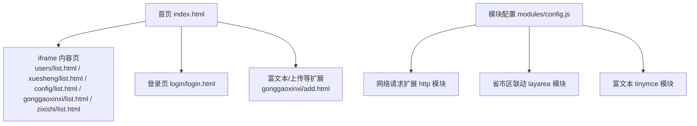

**图表来源**
- [index.html:1-304](file://src/main/resources/front/front/index.html#L1-L304)
- [users/list.html:1-427](file://src/main/resources/front/front/pages/users/list.html#L1-L427)
- [xuesheng/list.html:1-434](file://src/main/resources/front/front/pages/xuesheng/list.html#L1-L434)
- [config/list.html:1-427](file://src/main/resources/front/front/pages/config/list.html#L1-L427)
- [gonggaoxinxi/list.html:1-429](file://src/main/resources/front/front/pages/gonggaoxinxi/list.html#L1-L429)
- [zixishi/list.html:1-429](file://src/main/resources/front/front/pages/zixishi/list.html#L1-L429)
- [gonggaoxinxi/add.html:1-424](file://src/main/resources/front/front/pages/gonggaoxinxi/add.html#L1-L424)
- [login/login.html:1-175](file://src/main/resources/front/front/pages/login/login.html#L1-L175)
- [config.js（模块配置）:1-14](file://src/main/resources/front/front/modules/config.js#L1-L14)

**章节来源**
- [index.html:1-304](file://src/main/resources/front/front/index.html#L1-L304)
- [README.md:1-64](file://README.md#L1-L64)

## 核心组件
- 导航菜单：首页顶部导航通过Vue渲染，Layui用于弹窗与表单基础样式
- 轮播图：Layui Carousel组件用于展示轮播图
- 表单控件：Layui Form组件用于登录、新增等页面的数据收集与校验
- 弹窗组件：Layui Layer用于消息提示、确认与复杂弹窗
- 分页组件：Layui Laypage用于列表分页
- 日期选择器：Layui Laydate用于日期输入
- 上传组件：Layui Upload用于图片上传
- 富文本编辑器：集成TinyMCE，通过Layui模块化加载

**章节来源**
- [users/list.html:326-416](file://src/main/resources/front/front/pages/users/list.html#L326-L416)
- [xuesheng/list.html:330-423](file://src/main/resources/front/front/pages/xuesheng/list.html#L330-L423)
- [config/list.html:326-416](file://src/main/resources/front/front/pages/config/list.html#L326-L416)
- [gonggaoxinxi/list.html:328-418](file://src/main/resources/front/front/pages/gonggaoxinxi/list.html#L328-L418)
- [zixishi/list.html:328-418](file://src/main/resources/front/front/pages/zixishi/list.html#L328-L418)
- [gonggaoxinxi/add.html:217-420](file://src/main/resources/front/front/pages/gonggaoxinxi/add.html#L217-L420)
- [login/login.html:121-163](file://src/main/resources/front/front/pages/login/login.html#L121-L163)

## 架构总览
系统采用“首页统一入口 + iframe内容页 + 模块化Layui”的架构。首页负责全局导航与iframe内容切换；各业务页面通过Layui模块化加载所需组件；模块配置文件集中管理扩展模块路径与版本。

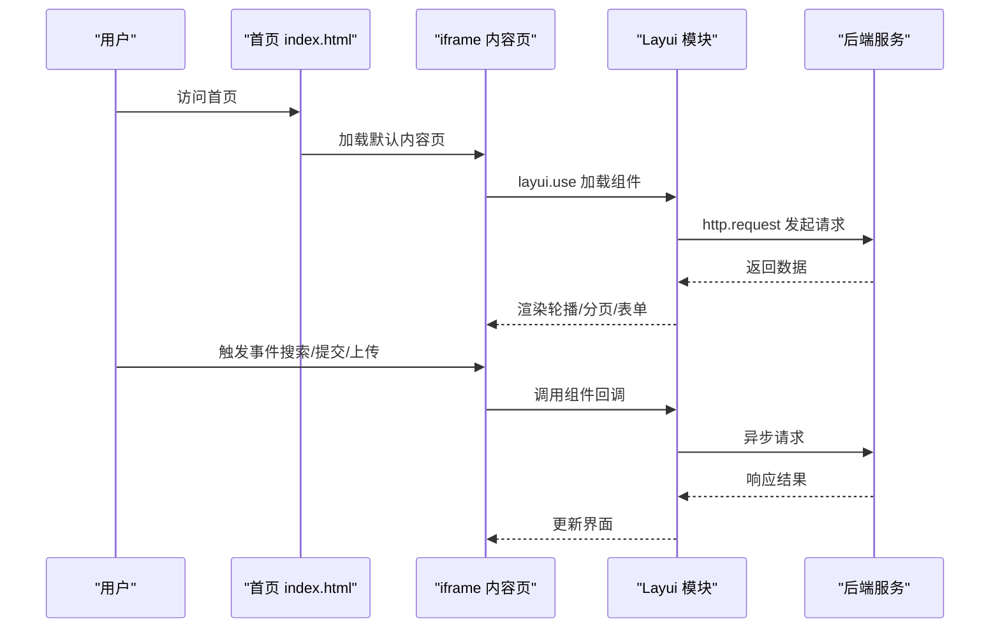

**图表来源**
- [index.html:227-230](file://src/main/resources/front/front/index.html#L227-L230)
- [users/list.html:326-416](file://src/main/resources/front/front/pages/users/list.html#L326-L416)
- [gonggaoxinxi/add.html:217-420](file://src/main/resources/front/front/pages/gonggaoxinxi/add.html#L217-L420)
- [config.js（模块配置）:7-14](file://src/main/resources/front/front/modules/config.js#L7-L14)

## 详细组件分析

### 导航菜单与iframe内容切换
- 首页顶部菜单通过Vue渲染，点击后通过JavaScript设置iframe的src并刷新高度
- 支持个人中心、后台管理、客服等入口跳转
- 菜单项高亮通过原生DOM操作实现

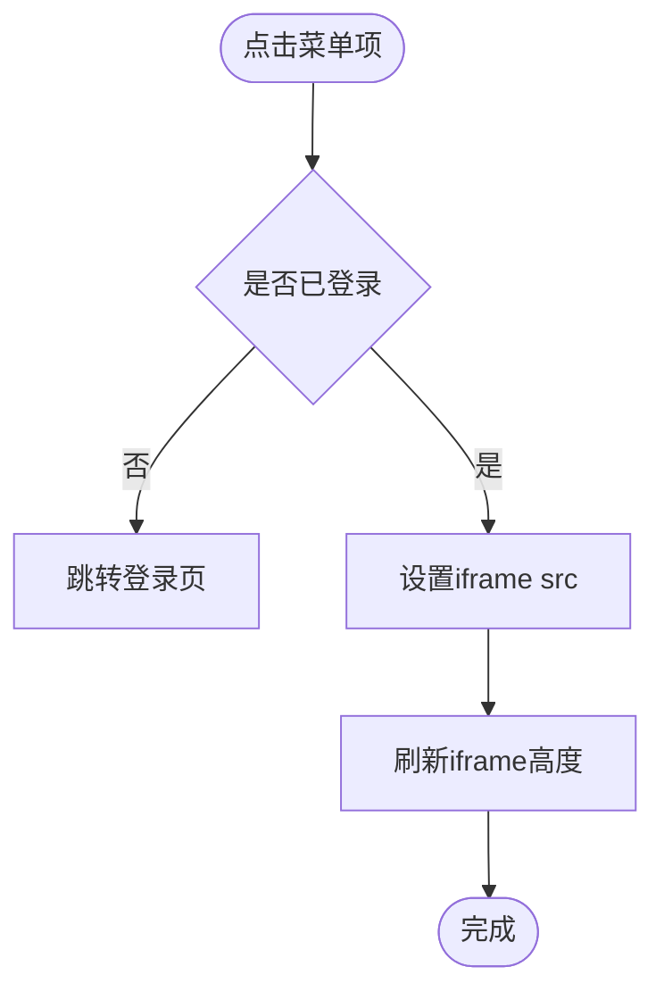

**图表来源**
- [index.html:246-261](file://src/main/resources/front/front/index.html#L246-L261)
- [index.html:273-282](file://src/main/resources/front/front/index.html#L273-L282)

**章节来源**
- [index.html:154-174](file://src/main/resources/front/front/index.html#L154-L174)
- [index.html:246-261](file://src/main/resources/front/front/index.html#L246-L261)
- [index.html:273-282](file://src/main/resources/front/front/index.html#L273-L282)

### 表单控件与数据绑定
- 登录页使用Layui Form进行表单渲染与校验，结合Vue进行角色选择
- 新增页使用Layui Form进行字段收集与校验，配合TinyMCE富文本编辑器
- 表单提交通过form.on监听提交事件，读取字段并发起异步请求

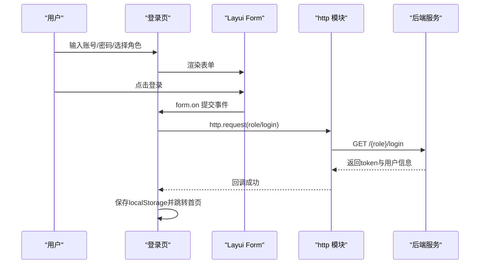

**图表来源**
- [login/login.html:121-163](file://src/main/resources/front/front/pages/login/login.html#L121-L163)

**章节来源**
- [login/login.html:121-163](file://src/main/resources/front/front/pages/login/login.html#L121-L163)

### 轮播图组件（Carousel）
- 各业务列表页均引入Layui Carousel组件展示轮播图
- 通过http模块请求配置数据，渲染轮播图后调用carousel.render初始化
- 支持箭头、动画、自动播放与指示器配置

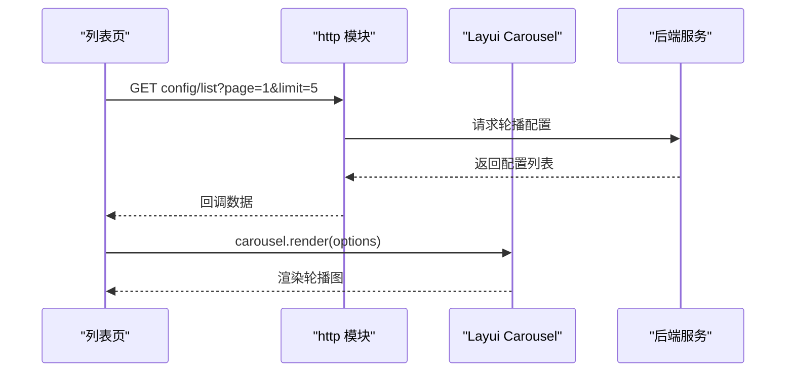

**图表来源**
- [users/list.html:336-369](file://src/main/resources/front/front/pages/users/list.html#L336-L369)
- [xuesheng/list.html:340-373](file://src/main/resources/front/front/pages/xuesheng/list.html#L340-L373)
- [config/list.html:337-369](file://src/main/resources/front/front/pages/config/list.html#L337-L369)
- [gonggaoxinxi/list.html:339-371](file://src/main/resources/front/front/pages/gonggaoxinxi/list.html#L339-L371)
- [zixishi/list.html:339-371](file://src/main/resources/front/front/pages/zixishi/list.html#L339-L371)

**章节来源**
- [users/list.html:336-369](file://src/main/resources/front/front/pages/users/list.html#L336-L369)
- [xuesheng/list.html:340-373](file://src/main/resources/front/front/pages/xuesheng/list.html#L340-L373)
- [config/list.html:337-369](file://src/main/resources/front/front/pages/config/list.html#L337-L369)
- [gonggaoxinxi/list.html:339-371](file://src/main/resources/front/front/pages/gonggaoxinxi/list.html#L339-L371)
- [zixishi/list.html:339-371](file://src/main/resources/front/front/pages/zixishi/list.html#L339-L371)

### 分页组件（Laypage）
- 使用laypage.render初始化分页，支持上一页、页码、下一页、跳转、总数等布局
- 通过jump回调实现分页切换并重新请求数据

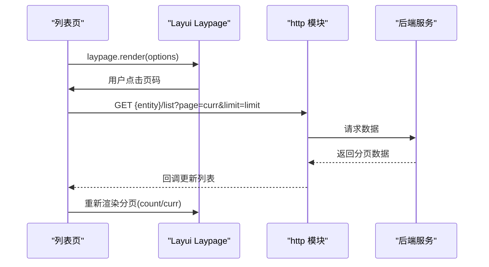

**图表来源**
- [users/list.html:397-415](file://src/main/resources/front/front/pages/users/list.html#L397-L415)
- [xuesheng/list.html:404-421](file://src/main/resources/front/front/pages/xuesheng/list.html#L404-L421)
- [config/list.html:397-415](file://src/main/resources/front/front/pages/config/list.html#L397-L415)
- [gonggaoxinxi/list.html:399-417](file://src/main/resources/front/front/pages/gonggaoxinxi/list.html#L399-L417)
- [zixishi/list.html:399-417](file://src/main/resources/front/front/pages/zixishi/list.html#L399-L417)

**章节来源**
- [users/list.html:397-415](file://src/main/resources/front/front/pages/users/list.html#L397-L415)
- [xuesheng/list.html:404-421](file://src/main/resources/front/front/pages/xuesheng/list.html#L404-L421)
- [config/list.html:397-415](file://src/main/resources/front/front/pages/config/list.html#L397-L415)
- [gonggaoxinxi/list.html:399-417](file://src/main/resources/front/front/pages/gonggaoxinxi/list.html#L399-L417)
- [zixishi/list.html:399-417](file://src/main/resources/front/front/pages/zixishi/list.html#L399-L417)

### 日期选择器（Laydate）
- 在新增页中对日期字段使用laydate.render初始化
- 与表单联动，确保日期正确传入后端

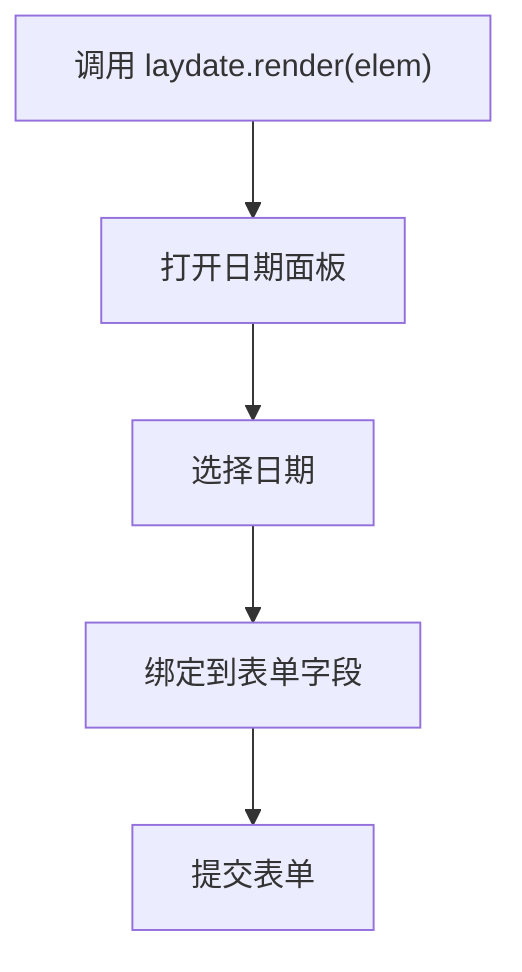

**图表来源**
- [gonggaoxinxi/add.html:346-348](file://src/main/resources/front/front/pages/gonggaoxinxi/add.html#L346-L348)

**章节来源**
- [gonggaoxinxi/add.html:346-348](file://src/main/resources/front/front/pages/gonggaoxinxi/add.html#L346-L348)

### 上传组件（Upload）
- 图片上传通过upload.render配置，支持图片类型、请求头、成功/失败回调
- 上传成功后更新隐藏域与预览图，同时写入Vue数据模型

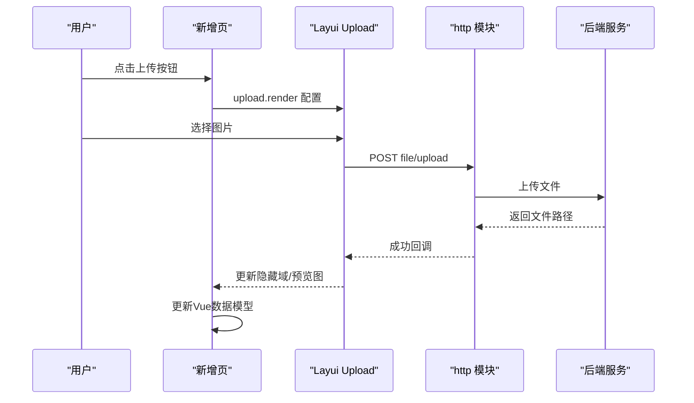

**图表来源**
- [gonggaoxinxi/add.html:269-315](file://src/main/resources/front/front/pages/gonggaoxinxi/add.html#L269-L315)

**章节来源**
- [gonggaoxinxi/add.html:269-315](file://src/main/resources/front/front/pages/gonggaoxinxi/add.html#L269-L315)

### 富文本编辑器（TinyMCE）
- 通过Layui模块化加载TinyMCE，支持图片上传处理器
- 新增页中将编辑器内容同步到表单字段再提交

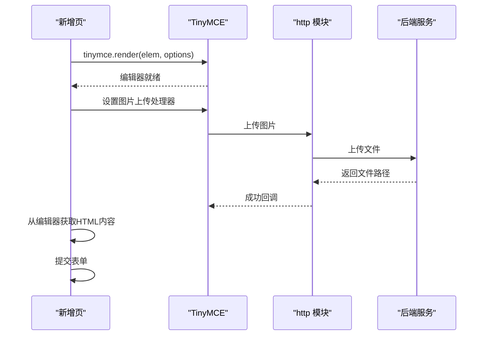

**图表来源**
- [gonggaoxinxi/add.html:316-345](file://src/main/resources/front/front/pages/gonggaoxinxi/add.html#L316-L345)

**章节来源**
- [gonggaoxinxi/add.html:316-345](file://src/main/resources/front/front/pages/gonggaoxinxi/add.html#L316-L345)

### 弹窗组件（Layer）
- 登录成功/失败、上传成功/失败等场景使用layer.msg提示
- 复杂弹窗可通过layer.open实现（如客服弹窗）

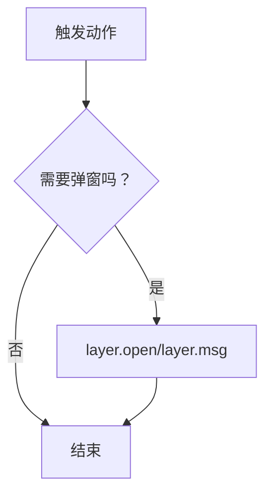

**图表来源**
- [index.html:235-244](file://src/main/resources/front/front/index.html#L235-L244)
- [gonggaoxinxi/add.html:283-314](file://src/main/resources/front/front/pages/gonggaoxinxi/add.html#L283-L314)

**章节来源**
- [index.html:235-244](file://src/main/resources/front/front/index.html#L235-L244)
- [gonggaoxinxi/add.html:283-314](file://src/main/resources/front/front/pages/gonggaoxinxi/add.html#L283-L314)

### 主题定制与样式覆盖
- 通过公共CSS与页面内联样式覆盖Layui默认样式
- 轮播图指示器、分页样式等均有针对性覆盖
- 建议统一维护主题变量，避免散落覆盖

**章节来源**
- [users/list.html:33-52](file://src/main/resources/front/front/pages/users/list.html#L33-L52)
- [users/list.html:238-243](file://src/main/resources/front/front/pages/users/list.html#L238-L243)
- [xuesheng/list.html:33-52](file://src/main/resources/front/front/pages/xuesheng/list.html#L33-L52)
- [xuesheng/list.html:238-243](file://src/main/resources/front/front/pages/xuesheng/list.html#L238-L243)
- [config/list.html:33-52](file://src/main/resources/front/front/pages/config/list.html#L33-L52)
- [config/list.html:238-243](file://src/main/resources/front/front/pages/config/list.html#L238-L243)
- [gonggaoxinxi/list.html:33-52](file://src/main/resources/front/front/pages/gonggaoxinxi/list.html#L33-L52)
- [gonggaoxinxi/list.html:238-243](file://src/main/resources/front/front/pages/gonggaoxinxi/list.html#L238-L243)
- [zixishi/list.html:33-52](file://src/main/resources/front/front/pages/zixishi/list.html#L33-L52)
- [zixishi/list.html:238-243](file://src/main/resources/front/front/pages/zixishi/list.html#L238-L243)

### 响应式布局实现
- 使用viewport meta标签适配移动端
- Flex布局与百分比宽度保证列表与轮播图自适应
- 建议进一步完善媒体查询以优化小屏体验

**章节来源**
- [users/list.html:10-10](file://src/main/resources/front/front/pages/users/list.html#L10-L10)
- [xuesheng/list.html:10-10](file://src/main/resources/front/front/pages/xuesheng/list.html#L10-L10)
- [config/list.html:10-10](file://src/main/resources/front/front/pages/config/list.html#L10-L10)
- [gonggaoxinxi/list.html:10-10](file://src/main/resources/front/front/pages/gonggaoxinxi/list.html#L10-L10)
- [zixishi/list.html:10-10](file://src/main/resources/front/front/pages/zixishi/list.html#L10-L10)

### 组件初始化、数据绑定与动态更新
- 通过Vue进行数据绑定与计算属性
- 使用layui.use按需加载模块，组件初始化在回调中进行
- 动态更新通过http.request获取数据，配合$nextTick确保DOM更新后再初始化组件

**章节来源**
- [users/list.html:296-324](file://src/main/resources/front/front/pages/users/list.html#L296-L324)
- [users/list.html:352-368](file://src/main/resources/front/front/pages/users/list.html#L352-L368)
- [xuesheng/list.html:299-327](file://src/main/resources/front/front/pages/xuesheng/list.html#L299-L327)
- [xuesheng/list.html:356-372](file://src/main/resources/front/front/pages/xuesheng/list.html#L356-L372)
- [config/list.html:296-324](file://src/main/resources/front/front/pages/config/list.html#L296-L324)
- [config/list.html:352-369](file://src/main/resources/front/front/pages/config/list.html#L352-L369)
- [gonggaoxinxi/list.html:298-326](file://src/main/resources/front/front/pages/gonggaoxinxi/list.html#L298-L326)
- [gonggaoxinxi/list.html:354-371](file://src/main/resources/front/front/pages/gonggaoxinxi/list.html#L354-L371)
- [zixishi/list.html:298-326](file://src/main/resources/front/front/pages/zixishi/list.html#L298-L326)
- [zixishi/list.html:354-371](file://src/main/resources/front/front/pages/zixishi/list.html#L354-L371)

### 事件监听、回调函数与异步操作
- 表单提交：form.on('submit')监听提交事件，读取字段并发起异步请求
- 分页跳转：laypage.jump回调中重新请求数据
- 上传完成：upload.done回调中处理返回结果并更新界面
- 登录成功：http回调中写入localStorage并跳转首页

**章节来源**
- [login/login.html:129-161](file://src/main/resources/front/front/pages/login/login.html#L129-L161)
- [users/list.html:376-378](file://src/main/resources/front/front/pages/users/list.html#L376-L378)
- [users/list.html:404-414](file://src/main/resources/front/front/pages/users/list.html#L404-L414)
- [gonggaoxinxi/add.html:287-315](file://src/main/resources/front/front/pages/gonggaoxinxi/add.html#L287-L315)
- [gonggaoxinxi/add.html:408-418](file://src/main/resources/front/front/pages/gonggaoxinxi/add.html#L408-L418)

### 组件开发规范与样式定制指南
- 统一使用layui.use按需加载模块，避免全局污染
- 表单字段命名与后端一致，便于http.request自动序列化
- 上传组件统一配置headers与accept类型，提升安全性与一致性
- 轮播图与分页样式覆盖集中在页面内联样式，便于维护
- 建议为常用组件封装统一样式类名，减少重复定义

**章节来源**
- [users/list.html:326-332](file://src/main/resources/front/front/pages/users/list.html#L326-L332)
- [gonggaoxinxi/add.html:274-280](file://src/main/resources/front/front/pages/gonggaoxinxi/add.html#L274-L280)
- [gonggaoxinxi/add.html:346-348](file://src/main/resources/front/front/pages/gonggaoxinxi/add.html#L346-L348)

### 兼容性注意事项
- 项目使用jQuery与Vue混合，注意版本兼容性
- Layui模块化加载需确保路径正确，模块配置文件集中管理扩展路径
- 移动端适配建议增加媒体查询与触摸事件优化
- TinyMCE上传处理器需与后端接口保持一致

**章节来源**
- [config.js（模块配置）:1-14](file://src/main/resources/front/front/modules/config.js#L1-L14)
- [gonggaoxinxi/add.html:174-177](file://src/main/resources/front/front/pages/gonggaoxinxi/add.html#L174-L177)

### 与Element UI的对比与选型策略
- Layui优势：轻量、模块化、与现有项目耦合度低，适合快速迭代
- Element UI优势：组件更丰富、生态更完善、文档更成熟
- 选型建议：若项目已深度使用Layui且满足需求，建议维持现状；若需更丰富的组件或更好的开发体验，可评估迁移至Element UI，但需充分评估迁移成本与风险

[本节为概念性内容，不直接分析具体文件]

## 依赖关系分析
Layui模块通过模块配置文件集中管理，统一扩展路径与版本控制。

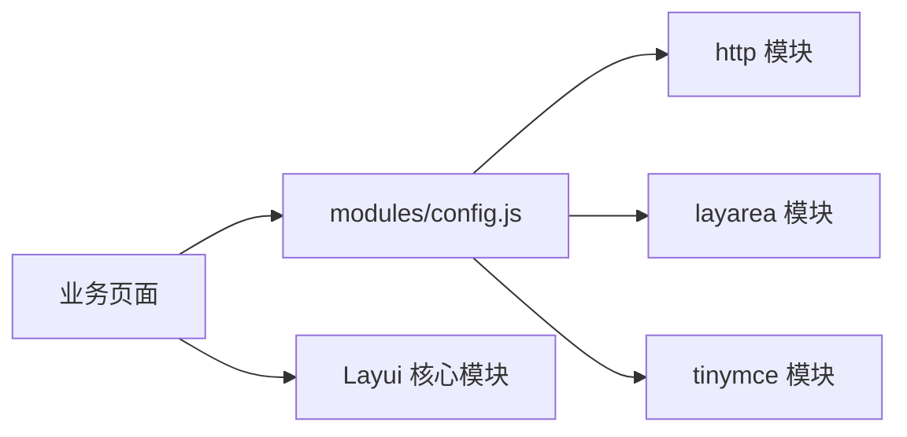

**图表来源**
- [config.js（模块配置）:7-14](file://src/main/resources/front/front/modules/config.js#L7-L14)

**章节来源**
- [config.js（模块配置）:1-14](file://src/main/resources/front/front/modules/config.js#L1-L14)

## 性能考虑
- 按需加载：仅在需要时调用layui.use，避免一次性加载所有模块
- DOM更新：使用$nextTick确保组件初始化在DOM更新之后
- 资源压缩：生产环境建议合并与压缩CSS/JS资源
- 缓存策略：合理利用浏览器缓存与服务端缓存

[本节提供一般性指导，不直接分析具体文件]

## 故障排除指南
- 登录失败：检查角色选择、后端接口返回与localStorage写入
- 上传失败：检查headers中的Token、accept类型与后端上传接口
- 分页不更新：确认laypage.jump回调中重新请求数据并更新count/curr
- 轮播图不显示：检查http请求返回数据与carousel.render参数

**章节来源**
- [login/login.html:139-159](file://src/main/resources/front/front/pages/login/login.html#L139-L159)
- [gonggaoxinxi/add.html:276-278](file://src/main/resources/front/front/pages/gonggaoxinxi/add.html#L276-L278)
- [users/list.html:404-414](file://src/main/resources/front/front/pages/users/list.html#L404-L414)
- [users/list.html:352-368](file://src/main/resources/front/front/pages/users/list.html#L352-L368)

## 结论
本项目在自习室管理系统中有效运用了Layui组件库，结合Vue实现了良好的数据绑定与交互体验。通过模块化加载与统一的样式覆盖策略，既保证了开发效率，又维持了界面的一致性。后续可在组件封装、移动端适配与迁移策略等方面持续优化。

[本节为总结性内容，不直接分析具体文件]

## 附录
- 页面跳转工具：jump函数统一处理路径转换与跳转逻辑
- 返回工具：back函数提供历史回退能力
- 订单号生成：genTradeNo函数提供唯一订单号生成

**章节来源**
- [utils.js:5-34](file://src/main/resources/front/front/js/utils.js#L5-L34)