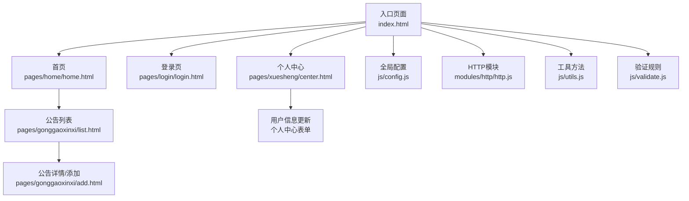
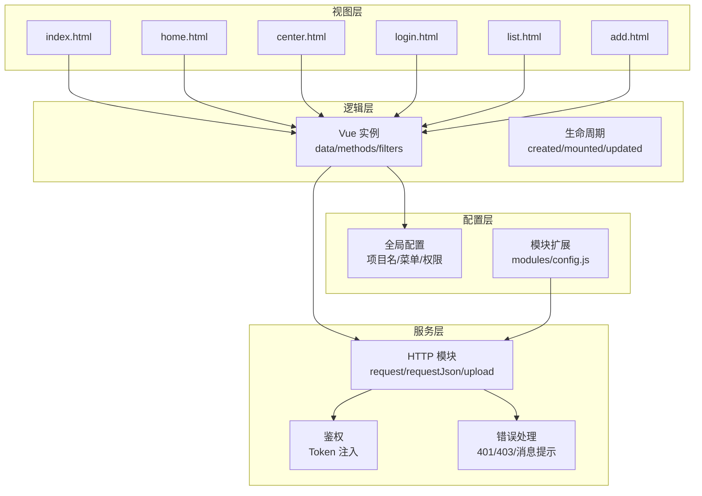
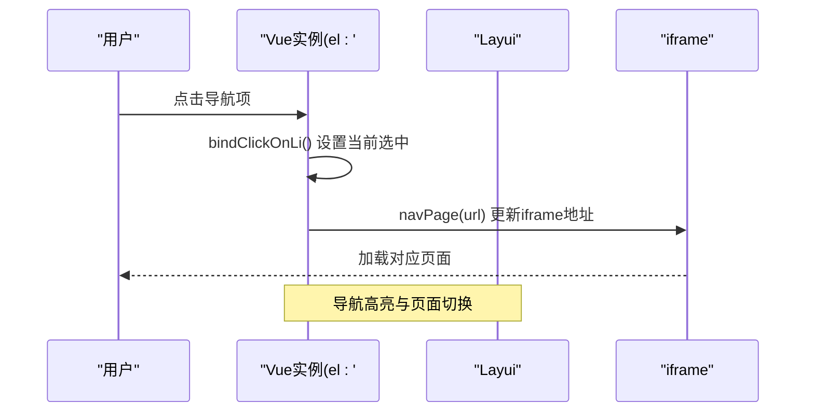
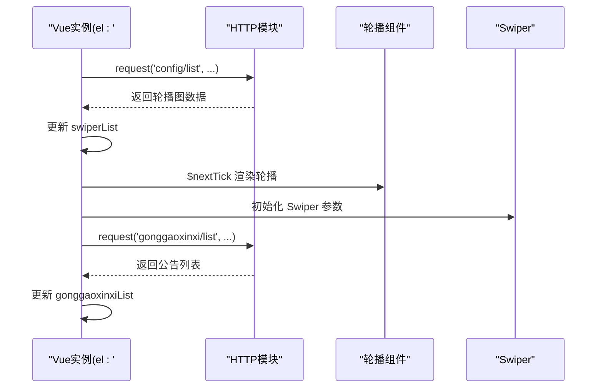
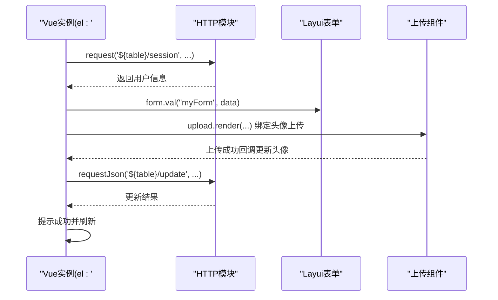
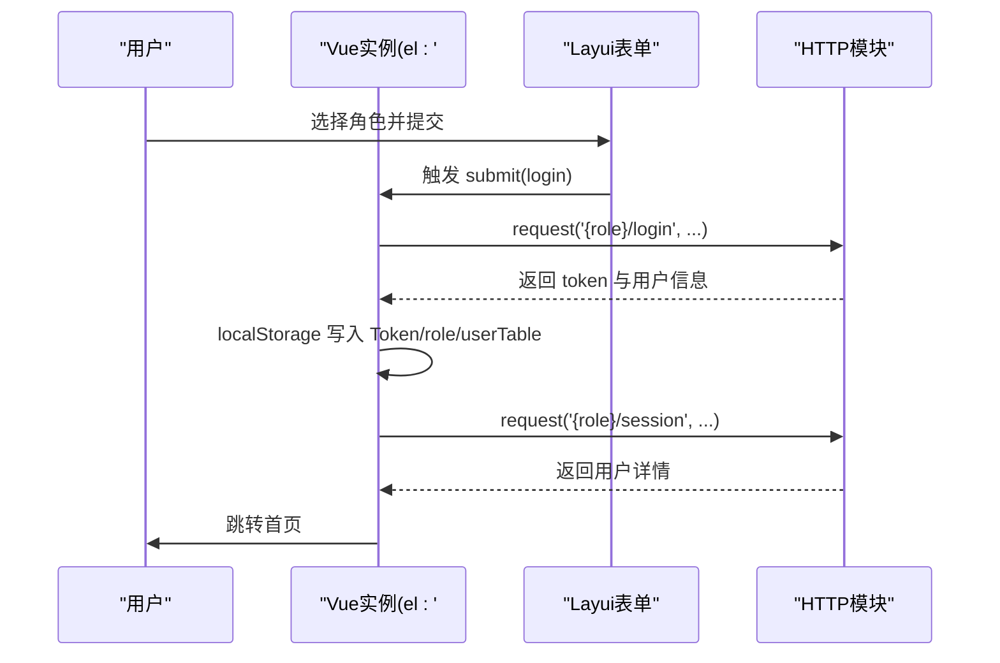
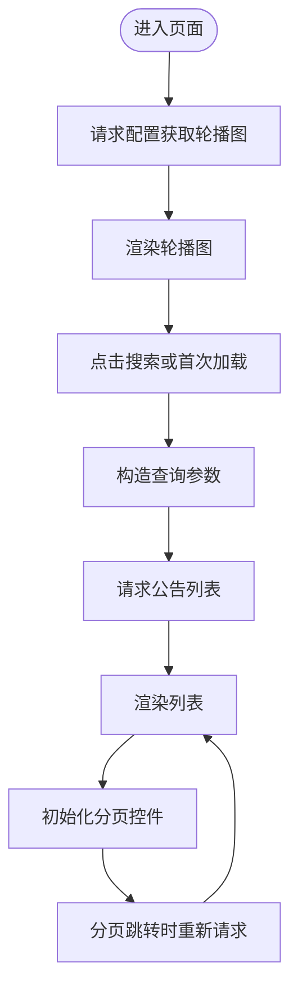
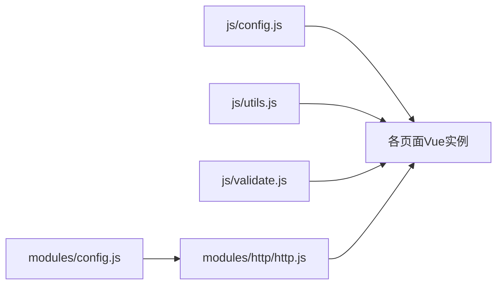

# Vue.js组件架构

<cite>
**本文档引用的文件**
- [index.html](file://src/main/resources/front/front/index.html)
- [home.html](file://src/main/resources/front/front/pages/home/home.html)
- [center.html](file://src/main/resources/front/front/pages/xuesheng/center.html)
- [login.html](file://src/main/resources/front/front/pages/login/login.html)
- [list.html](file://src/main/resources/front/front/pages/gonggaoxinxi/list.html)
- [add.html](file://src/main/resources/front/front/pages/gonggaoxinxi/add.html)
- [config.js](file://src/main/resources/front/front/js/config.js)
- [utils.js](file://src/main/resources/front/front/js/utils.js)
- [http.js](file://src/main/resources/front/front/modules/http/http.js)
- [validate.js](file://src/main/resources/front/front/js/validate.js)
- [config.js](file://src/main/resources/front/front/modules/config.js)
- [README.md](file://README.md)
</cite>

## 目录
1. [简介](#简介)
2. [项目结构](#项目结构)
3. [核心组件](#核心组件)
4. [架构总览](#架构总览)
5. [详细组件分析](#详细组件分析)
6. [依赖关系分析](#依赖关系分析)
7. [性能考虑](#性能考虑)
8. [故障排查指南](#故障排查指南)
9. [结论](#结论)
10. [附录](#附录)

## 简介
本项目为基于 Spring Boot 的自习室管理系统前端部分，采用 Vue.js + HTML + Layui 技术栈构建。系统包含管理员与学生两类角色，前端通过多个页面实现公告信息、自习室、座位预订、留言反馈等功能模块。Vue.js 在各页面中承担数据驱动与交互逻辑，结合 Layui 组件库与自定义 HTTP 模块完成与后端 API 的集成。

## 项目结构
前端资源位于 `src/main/resources/front/front` 目录，采用按页面维度的静态页面组织方式：
- 入口页面：index.html
- 功能页面：pages 下按业务模块划分（如 gonggaoxinxi、xuesheng、zixishi、zuoweiyuding 等）
- 资源文件：js、css、img、layui、modules 等
- 后端 API：通过 modules/http/http.js 封装统一请求

图表来源
- [index.html:1-304](file://src/main/resources/front/front/index.html#L1-L304)
- [home.html:1-617](file://src/main/resources/front/front/pages/home/home.html#L1-L617)
- [center.html:1-536](file://src/main/resources/front/front/pages/xuesheng/center.html#L1-L536)
- [login.html:1-175](file://src/main/resources/front/front/pages/login/login.html#L1-L175)
- [list.html:1-429](file://src/main/resources/front/front/pages/gonggaoxinxi/list.html#L1-L429)
- [add.html:1-424](file://src/main/resources/front/front/pages/gonggaoxinxi/add.html#L1-L424)
- [config.js:1-103](file://src/main/resources/front/front/js/config.js#L1-L103)
- [http.js:1-135](file://src/main/resources/front/front/modules/http/http.js#L1-L135)
- [utils.js:1-35](file://src/main/resources/front/front/js/utils.js#L1-L35)
- [validate.js:1-75](file://src/main/resources/front/front/js/validate.js#L1-L75)

章节来源
- [index.html:1-304](file://src/main/resources/front/front/index.html#L1-L304)
- [README.md:1-64](file://README.md#L1-L64)

## 核心组件
本项目未采用单文件组件（.vue），而是以“页面级组件”形式组织，每个 HTML 页面内嵌 Vue 实例，负责该页面的数据绑定、事件处理与与后端交互。核心职责包括：
- 数据绑定：通过 Vue 实例 data 属性驱动页面渲染
- 生命周期：利用 created/mounted/updated 等钩子初始化与更新
- 事件处理：通过 methods 定义交互行为，配合 Layui 表单/上传等组件
- API 集成：通过 http.js 模块封装请求，统一处理 Token 与错误提示

章节来源
- [home.html:468-499](file://src/main/resources/front/front/pages/home/home.html#L468-L499)
- [center.html:302-328](file://src/main/resources/front/front/pages/xuesheng/center.html#L302-L328)
- [login.html:109-119](file://src/main/resources/front/front/pages/login/login.html#L109-L119)
- [list.html:299-326](file://src/main/resources/front/front/pages/gonggaoxinxi/list.html#L299-L326)

## 架构总览
前端采用“页面 + Vue 实例 + 插件模块”的分层架构：
- 视图层：HTML + Layui 组件
- 逻辑层：Vue 实例（data/methods/filters/lifecycle）
- 服务层：modules/http/http.js（封装 AJAX、鉴权、错误处理）
- 配置层：js/config.js（全局常量、菜单、权限判断）

图表来源
- [index.html:194-225](file://src/main/resources/front/front/index.html#L194-L225)
- [home.html:468-499](file://src/main/resources/front/front/pages/home/home.html#L468-L499)
- [center.html:302-328](file://src/main/resources/front/front/pages/xuesheng/center.html#L302-L328)
- [login.html:109-119](file://src/main/resources/front/front/pages/login/login.html#L109-L119)
- [list.html:299-326](file://src/main/resources/front/front/pages/gonggaoxinxi/list.html#L299-L326)
- [http.js:20-101](file://src/main/resources/front/front/modules/http/http.js#L20-L101)
- [config.js:1-103](file://src/main/resources/front/front/js/config.js#L1-L103)
- [config.js:1-14](file://src/main/resources/front/front/modules/config.js#L1-L14)

## 详细组件分析

### 入口页面组件（index.html 中的 Vue 实例）
- 职责：主导导航栏渲染、图标排序、页面跳转、iframe 内容适配
- 关键点：
  - created 钩子对图标数组进行随机排序
  - mounted 钩子绑定导航点击高亮
  - methods 提供跳转与点击处理
  - 与全局配置（indexNav、adminurl、chatFlag 等）联动

图表来源
- [index.html:194-225](file://src/main/resources/front/front/index.html#L194-L225)
- [index.html:246-261](file://src/main/resources/front/front/index.html#L246-L261)

章节来源
- [index.html:194-225](file://src/main/resources/front/front/index.html#L194-L225)

### 首页组件（home.html 中的 Vue 实例）
- 职责：轮播图数据获取与渲染、公告列表展示、Swiper 初始化
- 关键点：
  - data 定义 swiperList、gonggaoxinxiList 等
  - filters 定义新闻描述过滤
  - methods 提供跳转
  - 使用 http.request 获取配置与公告数据，并在 $nextTick 中初始化轮播

图表来源
- [home.html:468-499](file://src/main/resources/front/front/pages/home/home.html#L468-L499)
- [home.html:508-604](file://src/main/resources/front/front/pages/home/home.html#L508-L604)

章节来源
- [home.html:468-499](file://src/main/resources/front/front/pages/home/home.html#L468-L499)

### 个人中心组件（center.html 中的 Vue 实例）
- 职责：用户信息展示与更新、头像上传、退出登录
- 关键点：
  - data 定义 swiperList、xingbie、centerMenu
  - updated 钩子触发表单渲染
  - methods 提供 logout 与跳转
  - 通过 http.request 获取用户会话信息并填充表单
  - 上传组件与富文本编辑器集成

图表来源
- [center.html:302-328](file://src/main/resources/front/front/pages/xuesheng/center.html#L302-L328)
- [center.html:381-420](file://src/main/resources/front/front/pages/xuesheng/center.html#L381-L420)
- [center.html:422-467](file://src/main/resources/front/front/pages/xuesheng/center.html#L422-L467)
- [center.html:490-530](file://src/main/resources/front/front/pages/xuesheng/center.html#L490-L530)

章节来源
- [center.html:302-328](file://src/main/resources/front/front/pages/xuesheng/center.html#L302-L328)

### 登录组件（login.html 中的 Vue 实例）
- 职责：角色选择、登录认证、存储 Token 与用户信息
- 关键点：
  - data 绑定 menu 用于角色选择
  - form.on('submit(login)') 处理登录
  - 成功后写入 localStorage 并跳转首页

图表来源
- [login.html:109-119](file://src/main/resources/front/front/pages/login/login.html#L109-L119)
- [login.html:129-161](file://src/main/resources/front/front/pages/login/login.html#L129-L161)

章节来源
- [login.html:109-119](file://src/main/resources/front/front/pages/login/login.html#L109-L119)

### 列表组件（gonggaoxinxi/list.html 中的 Vue 实例）
- 职责：公告列表展示、分页、搜索、权限控制
- 关键点：
  - data 定义 swiperList、dataList
  - filters 定义新闻描述截断
  - methods 提供 isAuth 权限判断与跳转
  - 使用 laypage 进行分页渲染与请求

图表来源
- [list.html:299-326](file://src/main/resources/front/front/pages/gonggaoxinxi/list.html#L299-L326)
- [list.html:374-417](file://src/main/resources/front/front/pages/gonggaoxinxi/list.html#L374-L417)

章节来源
- [list.html:299-326](file://src/main/resources/front/front/pages/gonggaoxinxi/list.html#L299-L326)

### 添加组件（gonggaoxinxi/add.html 中的 Vue 实例）
- 职责：公告信息录入、图片上传、富文本编辑、跨表字段回填
- 关键点：
  - data 定义 detail、ro（只读标记）、swiperList
  - updated 钩子渲染表单
  - 上传组件与富文本编辑器集成
  - 跨表字段从 localStorage 读取并设置只读

章节来源
- [add.html:182-214](file://src/main/resources/front/front/pages/gonggaoxinxi/add.html#L182-L214)
- [add.html:269-315](file://src/main/resources/front/front/pages/gonggaoxinxi/add.html#L269-L315)
- [add.html:316-345](file://src/main/resources/front/front/pages/gonggaoxinxi/add.html#L316-L345)
- [add.html:388-418](file://src/main/resources/front/front/pages/gonggaoxinxi/add.html#L388-L418)

## 依赖关系分析
- 模块扩展：modules/config.js 通过 layui.config.extend 引入 http、layarea、tinymce
- HTTP 模块：封装 request/requestJson/upload，统一注入 Token，处理 401/403 与错误提示
- 全局配置：config.js 提供项目名、导航菜单、权限判断函数
- 工具方法：utils.js 提供跳转、返回、订单号生成；validate.js 提供常用正则校验

图表来源
- [config.js:7-14](file://src/main/resources/front/front/modules/config.js#L7-L14)
- [http.js:2-135](file://src/main/resources/front/front/modules/http/http.js#L2-L135)
- [config.js:1-103](file://src/main/resources/front/front/js/config.js#L1-L103)
- [utils.js:1-35](file://src/main/resources/front/front/js/utils.js#L1-L35)
- [validate.js:1-75](file://src/main/resources/front/front/js/validate.js#L1-L75)

章节来源
- [config.js:1-14](file://src/main/resources/front/front/modules/config.js#L1-L14)
- [http.js:1-135](file://src/main/resources/front/front/modules/http/http.js#L1-L135)

## 性能考虑
- DOM 更新优化
  - 使用 $nextTick 确保 DOM 渲染后再初始化第三方组件（如轮播、Swiper），避免重复渲染与闪烁
- 请求节流
  - 在请求中附加时间戳参数，避免缓存导致的旧数据问题
- 资源加载
  - 将公共样式与脚本按需引入，减少首屏阻塞
- 事件处理
  - 在 created/mounted 中仅做必要初始化，避免在频繁触发的事件中执行重型操作

## 故障排查指南
- 登录鉴权失败
  - 现象：出现 401/403 或被重定向至登录页
  - 排查：确认 localStorage 中 Token 是否存在，HTTP 模块是否正确注入 Token
- 请求接口失败
  - 现象：弹出“请求接口失败”提示
  - 排查：检查网络状态、后端服务可用性、请求 URL 与参数
- 表单渲染异常
  - 现象：下拉框/选择器未显示或值未更新
  - 排查：确保在 updated 钩子中调用 form.render，或在数据变更后手动触发渲染
- 上传失败
  - 现象：上传组件报错或无响应
  - 排查：确认 Token 头部设置、文件类型与大小限制、后端上传接口可用性

章节来源
- [http.js:39-47](file://src/main/resources/front/front/modules/http/http.js#L39-L47)
- [http.js:92-99](file://src/main/resources/front/front/modules/http/http.js#L92-L99)
- [center.html:422-467](file://src/main/resources/front/front/pages/xuesheng/center.html#L422-L467)

## 结论
本项目通过“页面级 Vue 实例 + 插件模块”的架构，实现了自习室管理系统的前端交互与数据集成。尽管未采用标准的单文件组件与现代打包工具，但通过合理的生命周期管理、统一的 HTTP 模块与全局配置，仍能保证功能完整性与可维护性。后续可在保持现有功能的基础上，逐步引入组件化与构建优化策略，提升开发效率与用户体验。

## 附录
- 开发与运行环境要求见项目 README
- 页面与模块清单参见项目结构章节

章节来源
- [README.md:19-26](file://README.md#L19-L26)