# 交互页面实现

<cite>
**本文档引用的文件**
- [index.html](file://src/main/resources/front/front/index.html)
- [home.html](file://src/main/resources/front/front/pages/home/home.html)
- [login.html](file://src/main/resources/front/front/pages/login/login.html)
- [register.html](file://src/main/resources/front/front/pages/xuesheng/register.html)
- [center.html](file://src/main/resources/front/front/pages/xuesheng/center.html)
- [list.html](file://src/main/resources/front/front/pages/xuesheng/list.html)
- [zixishi_list.html](file://src/main/resources/front/front/pages/zixishi/list.html)
- [gonggaoxinxi_list.html](file://src/main/resources/front/front/pages/gonggaoxinxi/list.html)
- [messages_list.html](file://src/main/resources/front/front/pages/messages/list.html)
- [config.js](file://src/main/resources/front/front/js/config.js)
- [http.js](file://src/main/resources/front/front/modules/http/http.js)
- [utils.js](file://src/main/resources/front/front/js/utils.js)
- [validate.js](file://src/main/resources/front/front/js/validate.js)
</cite>

## 目录
1. [项目概述](#项目概述)
2. [项目结构](#项目结构)
3. [核心组件](#核心组件)
4. [架构概览](#架构概览)
5. [详细组件分析](#详细组件分析)
6. [依赖关系分析](#依赖关系分析)
7. [性能考虑](#性能考虑)
8. [故障排除指南](#故障排除指南)
9. [结论](#结论)

## 项目概述

自习室管理系统是一个基于Spring Boot后端和前端页面的完整Web应用，主要用于管理大学自习室的预订和相关信息。该系统采用前后端分离架构，前端使用Vue.js框架构建交互式页面，通过Layui组件库提供UI组件，实现了完整的用户认证、数据管理和业务流程处理。

系统主要功能包括：
- 用户登录注册和权限管理
- 自习室信息展示和预订管理
- 公告信息发布和管理
- 留言反馈系统
- 学生信息管理
- 座位预订管理

## 项目结构

系统采用模块化组织方式，前端资源主要位于`src/main/resources/front/front/`目录下：

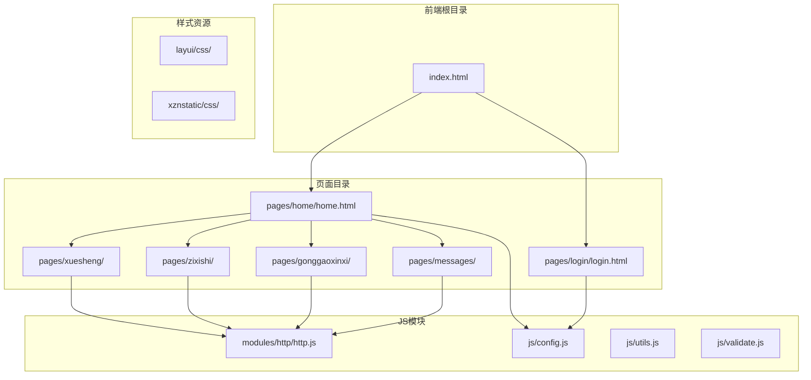

**图表来源**
- [index.html:1-304](file://src/main/resources/front/front/index.html#L1-L304)
- [config.js:1-103](file://src/main/resources/front/front/js/config.js#L1-L103)

**章节来源**
- [index.html:1-304](file://src/main/resources/front/front/index.html#L1-L304)
- [config.js:1-103](file://src/main/resources/front/front/js/config.js#L1-L103)

## 核心组件

### 主框架组件

系统的核心框架由主页面`index.html`提供，它包含了完整的导航结构和页面容器：

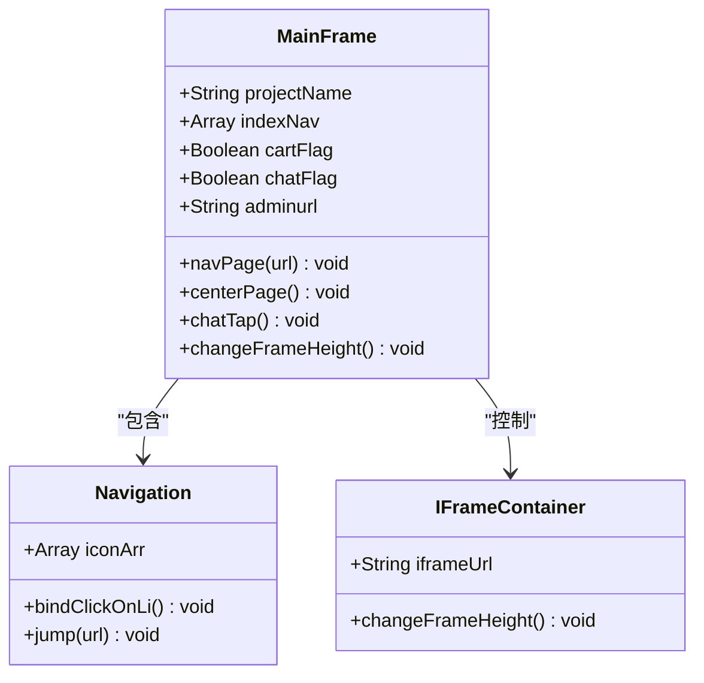

**图表来源**
- [index.html:194-225](file://src/main/resources/front/front/index.html#L194-L225)
- [index.html:246-264](file://src/main/resources/front/front/index.html#L246-L264)

### 页面导航系统

系统采用iframe嵌套的方式实现页面切换，通过JavaScript动态控制iframe的内容：

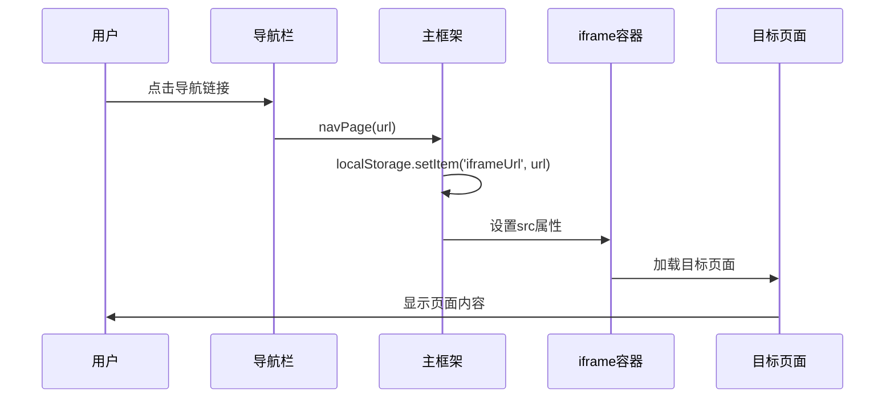

**图表来源**
- [index.html:246-264](file://src/main/resources/front/front/index.html#L246-L264)

**章节来源**
- [index.html:194-301](file://src/main/resources/front/front/index.html#L194-L301)

## 架构概览

系统采用分层架构设计，前端分为多个层次：

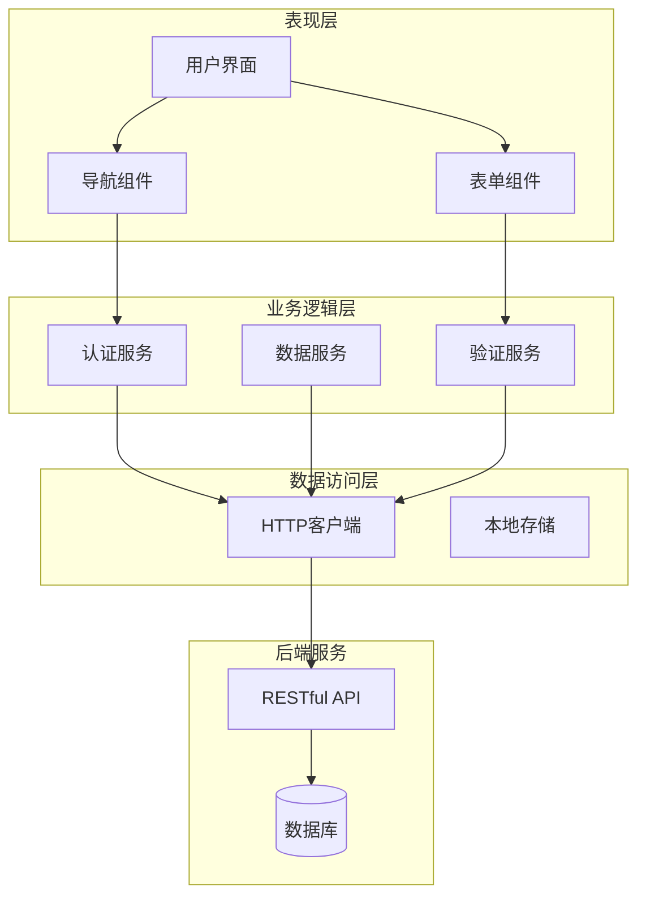

**图表来源**
- [http.js:7-131](file://src/main/resources/front/front/modules/http/http.js#L7-L131)
- [config.js:68-102](file://src/main/resources/front/front/js/config.js#L68-L102)

### 数据流架构

系统的数据流遵循统一的模式：

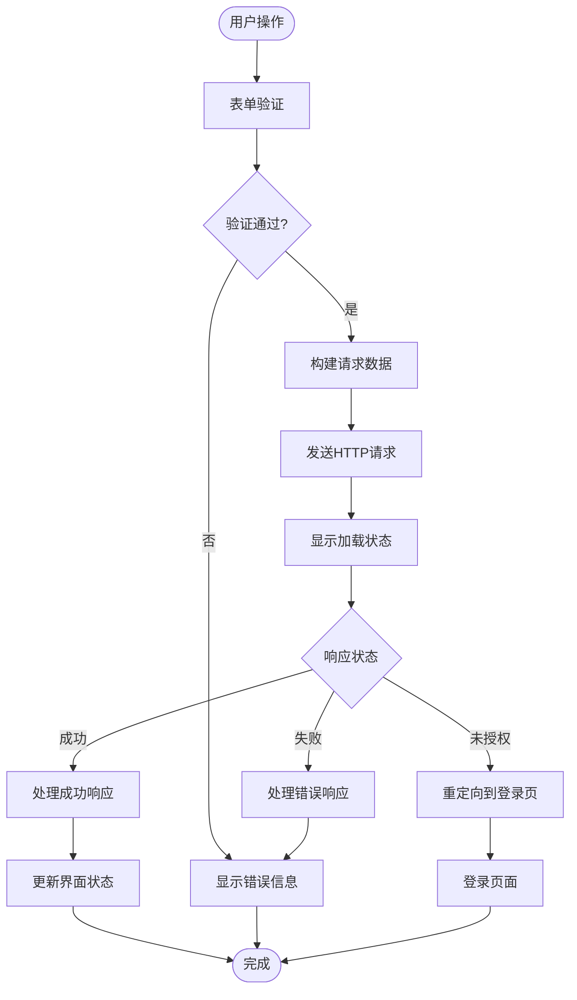

**图表来源**
- [http.js:20-101](file://src/main/resources/front/front/modules/http/http.js#L20-L101)

**章节来源**
- [http.js:1-135](file://src/main/resources/front/front/modules/http/http.js#L1-L135)

## 详细组件分析

### 首页展示页面

首页作为系统的入口页面，提供了丰富的信息展示和导航功能：

#### 轮播图组件

首页集成了多样的轮播图展示，使用Layui Carousel组件实现：

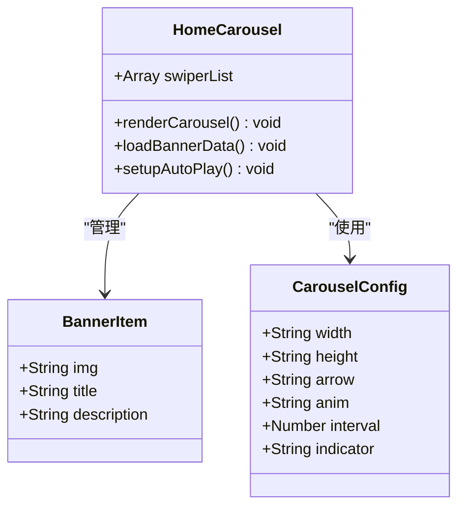

**图表来源**
- [home.html:508-543](file://src/main/resources/front/front/pages/home/home.html#L508-L543)
- [home.html:547-604](file://src/main/resources/front/front/pages/home/home.html#L547-L604)

#### 公告信息展示

首页通过Vue.js动态加载和展示公告信息：

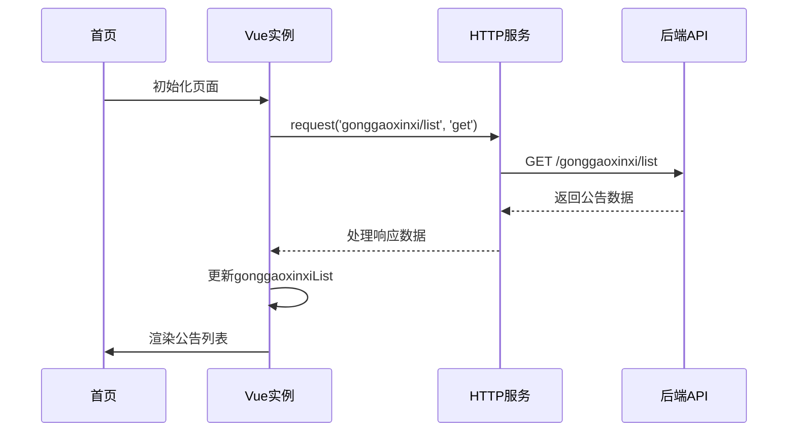

**图表来源**
- [home.html:547-551](file://src/main/resources/front/front/pages/home/home.html#L547-L551)

**章节来源**
- [home.html:1-617](file://src/main/resources/front/front/pages/home/home.html#L1-L617)

### 登录注册页面

登录页面实现了完整的用户认证流程：

#### 登录流程

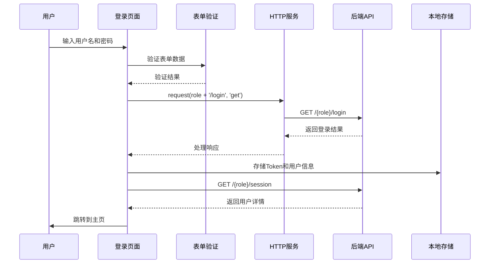

**图表来源**
- [login.html:139-159](file://src/main/resources/front/front/pages/login/login.html#L139-L159)

#### 注册流程

注册页面提供了学生注册功能，包含数据验证和提交：

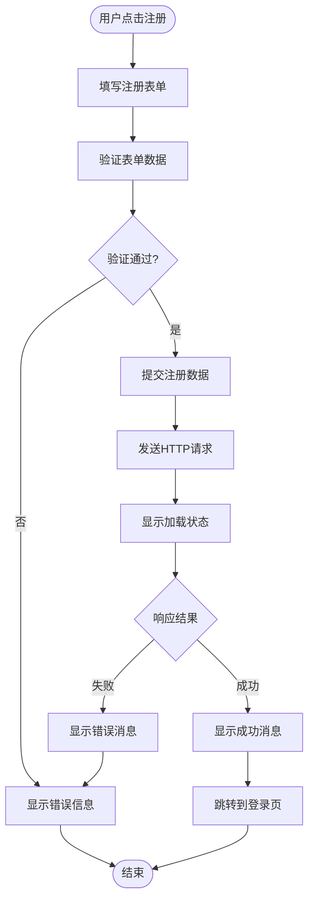

**图表来源**
- [register.html:151-159](file://src/main/resources/front/front/pages/xuesheng/register.html#L151-L159)

**章节来源**
- [login.html:1-175](file://src/main/resources/front/front/pages/login/login.html#L1-L175)
- [register.html:1-166](file://src/main/resources/front/front/pages/xuesheng/register.html#L1-L166)

### 学生信息管理页面

个人中心页面提供了学生信息的查看和编辑功能：

#### 个人信息管理

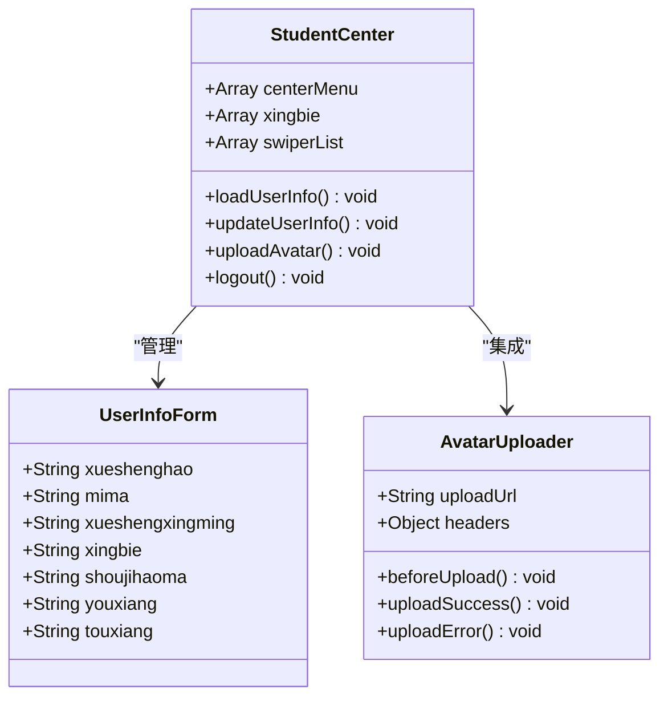

**图表来源**
- [center.html:302-328](file://src/main/resources/front/front/pages/xuesheng/center.html#L302-L328)
- [center.html:422-467](file://src/main/resources/front/front/pages/xuesheng/center.html#L422-L467)

#### 权限控制机制

系统通过`isAuth`函数实现前端权限控制：

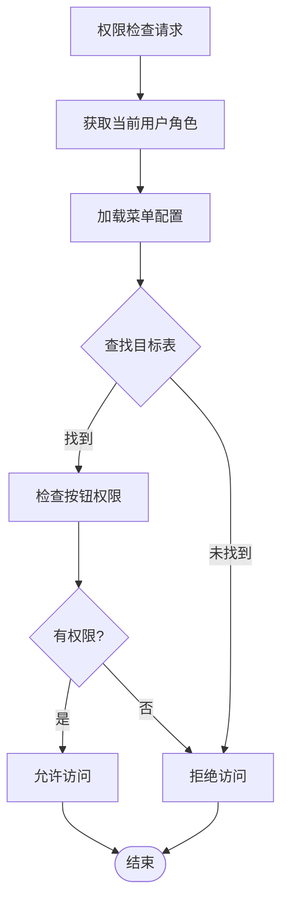

**图表来源**
- [config.js:68-84](file://src/main/resources/front/front/js/config.js#L68-L84)

**章节来源**
- [center.html:1-536](file://src/main/resources/front/front/pages/xuesheng/center.html#L1-L536)
- [config.js:68-102](file://src/main/resources/front/front/js/config.js#L68-L102)

### 列表页面组件

系统提供了多种列表页面，用于展示不同类型的实体数据：

#### 通用列表组件

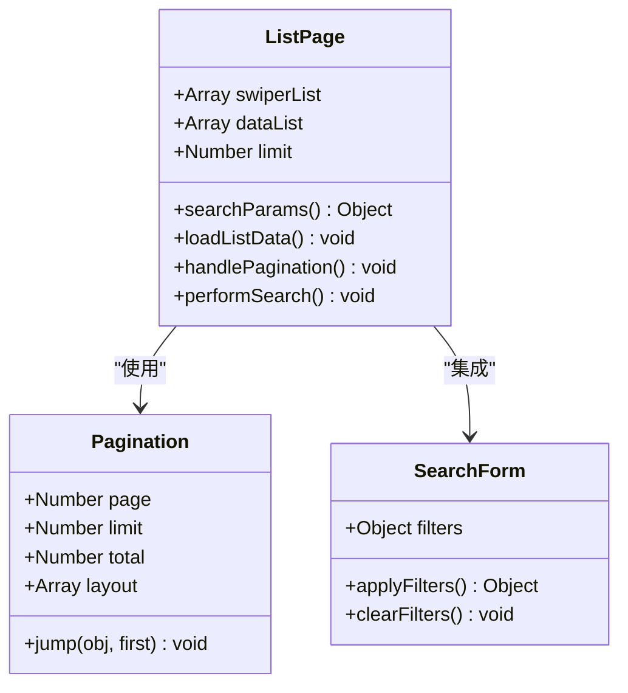

**图表来源**
- [list.html:301-328](file://src/main/resources/front/front/pages/xuesheng/list.html#L301-L328)
- [list.html:384-422](file://src/main/resources/front/front/pages/xuesheng/list.html#L384-L422)

#### 分页和搜索功能

列表页面实现了完整的分页和搜索功能：

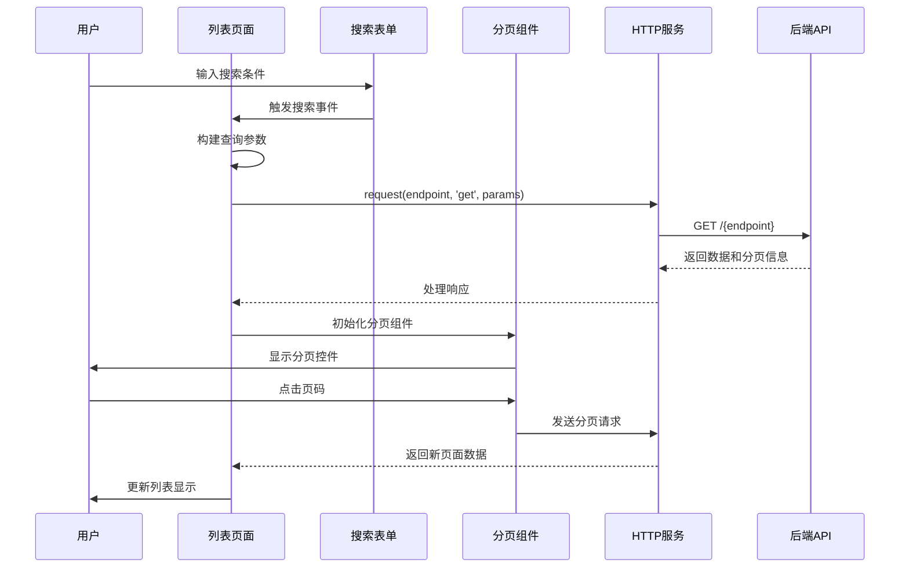

**图表来源**
- [list.html:384-422](file://src/main/resources/front/front/pages/xuesheng/list.html#L384-L422)

**章节来源**
- [list.html:1-434](file://src/main/resources/front/front/pages/xuesheng/list.html#L1-L434)
- [zixishi_list.html:1-429](file://src/main/resources/front/front/pages/zixishi/list.html#L1-L429)
- [gonggaoxinxi_list.html:1-429](file://src/main/resources/front/front/pages/gonggaoxinxi/list.html#L1-L429)

### 留言反馈页面

留言反馈页面实现了用户与管理员之间的双向沟通：

#### 留言系统架构

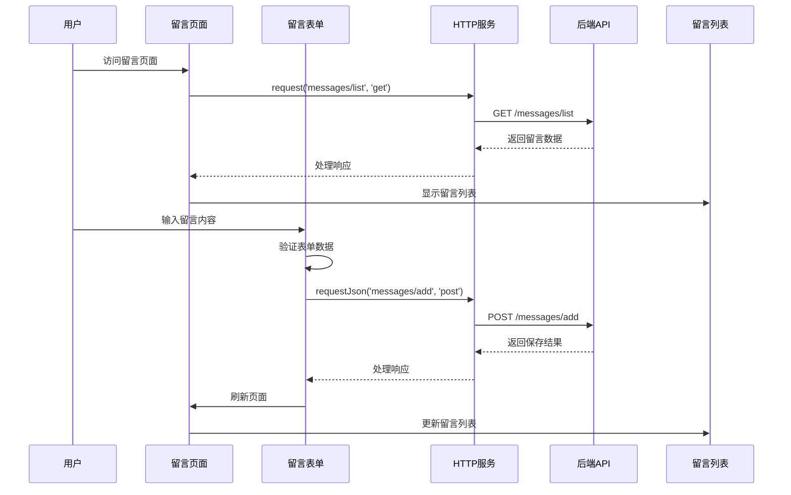

**图表来源**
- [messages_list.html:252-266](file://src/main/resources/front/front/pages/messages/list.html#L252-L266)

**章节来源**
- [messages_list.html:1-272](file://src/main/resources/front/front/pages/messages/list.html#L1-L272)

## 依赖关系分析

### 前端技术栈

系统采用现代化的前端技术栈：

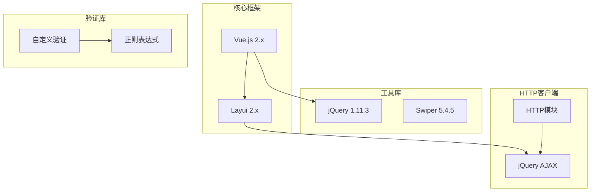

**图表来源**
- [home.html:13-18](file://src/main/resources/front/front/pages/home/home.html#L13-L18)
- [http.js:2-6](file://src/main/resources/front/front/modules/http/http.js#L2-L6)

### 模块依赖关系

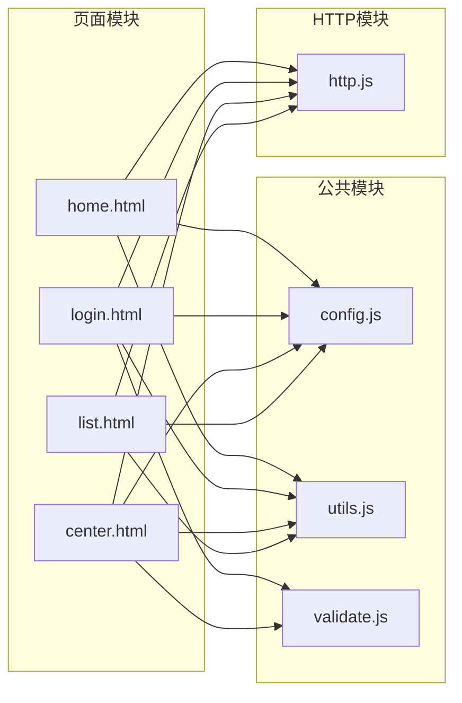

**图表来源**
- [config.js:1-103](file://src/main/resources/front/front/js/config.js#L1-L103)
- [utils.js:1-35](file://src/main/resources/front/front/js/utils.js#L1-L35)
- [http.js:1-135](file://src/main/resources/front/front/modules/http/http.js#L1-L135)

**章节来源**
- [config.js:1-103](file://src/main/resources/front/front/js/config.js#L1-L103)
- [utils.js:1-35](file://src/main/resources/front/front/js/utils.js#L1-L35)
- [http.js:1-135](file://src/main/resources/front/front/modules/http/http.js#L1-L135)

## 性能考虑

### 加载优化策略

系统采用了多种性能优化策略：

1. **懒加载机制**：页面内容通过iframe按需加载，减少初始加载时间
2. **缓存策略**：利用localStorage存储用户会话信息，避免重复登录
3. **图片优化**：使用object-fit属性确保图片适配，减少布局重排
4. **组件复用**：通过Vue组件实现代码复用，提高开发效率

### 响应式设计

系统支持多种设备的响应式显示：

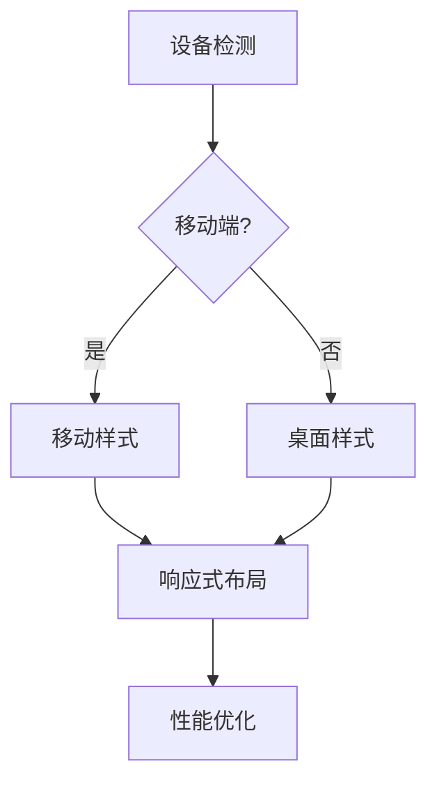

**章节来源**
- [home.html:10-18](file://src/main/resources/front/front/pages/home/home.html#L10-L18)
- [index.html:12-30](file://src/main/resources/front/front/index.html#L12-L30)

## 故障排除指南

### 常见问题及解决方案

#### 登录认证问题

**问题描述**：用户登录后无法访问受保护页面

**可能原因**：
1. Token过期或无效
2. 用户会话信息缺失
3. 权限配置错误

**解决步骤**：
1. 检查浏览器localStorage中的Token是否存在
2. 验证用户角色配置是否正确
3. 确认后端认证服务正常运行

#### 数据加载失败

**问题描述**：页面数据无法正常加载

**可能原因**：
1. 网络连接问题
2. API接口不可用
3. CORS跨域限制

**解决步骤**：
1. 检查网络连接状态
2. 验证API接口URL配置
3. 查看浏览器开发者工具中的网络请求

#### 表单验证错误

**问题描述**：表单提交时出现验证错误

**解决步骤**：
1. 检查表单字段的验证规则
2. 确认用户输入格式符合要求
3. 查看具体的错误提示信息

**章节来源**
- [http.js:39-46](file://src/main/resources/front/front/modules/http/http.js#L39-L46)
- [validate.js:1-75](file://src/main/resources/front/front/js/validate.js#L1-L75)

## 结论

自习室管理系统通过精心设计的前端交互架构，为用户提供了流畅、直观的操作体验。系统的主要特点包括：

### 技术优势

1. **模块化设计**：清晰的模块划分便于维护和扩展
2. **响应式布局**：支持多设备访问的自适应界面
3. **完善的权限控制**：基于角色的细粒度权限管理
4. **用户体验优化**：丰富的交互效果和友好的错误提示

### 功能完整性

系统涵盖了自习室管理的所有核心功能，从用户认证到数据管理，从信息展示到业务处理，形成了完整的业务闭环。

### 可扩展性

系统采用的技术栈和架构设计为未来的功能扩展奠定了良好的基础，可以根据需求添加新的页面和功能模块。

通过本文档的详细分析，开发者可以更好地理解系统的前端实现原理，为后续的维护和开发工作提供指导。