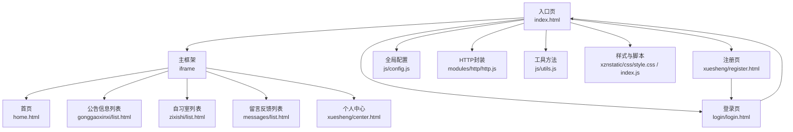
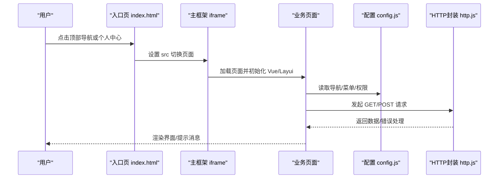
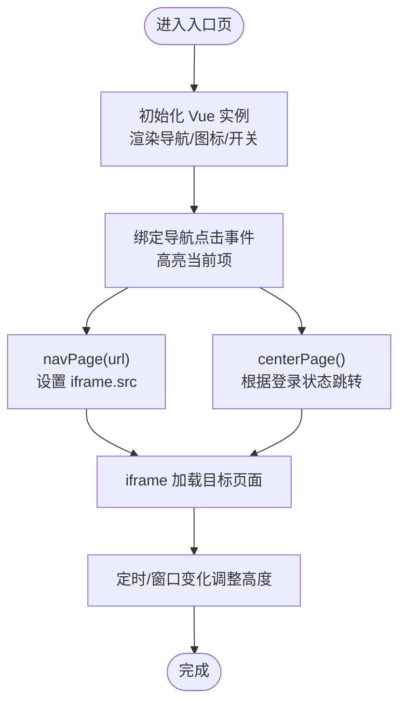
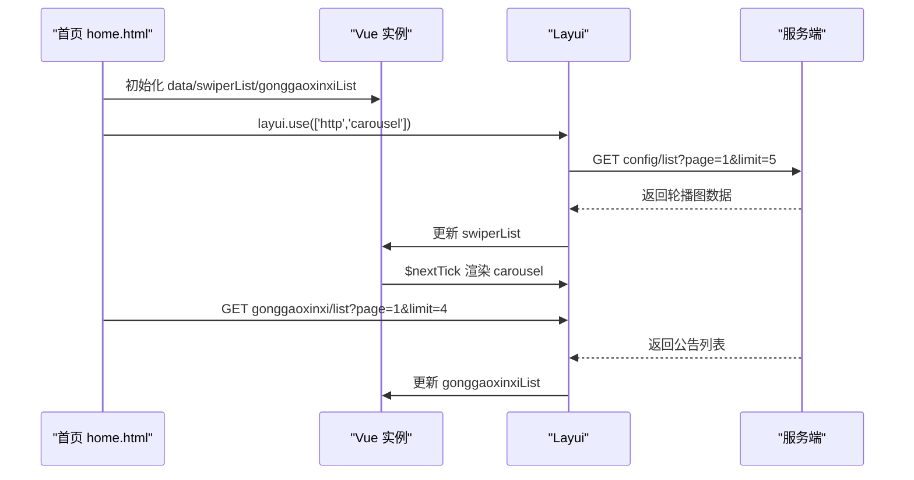
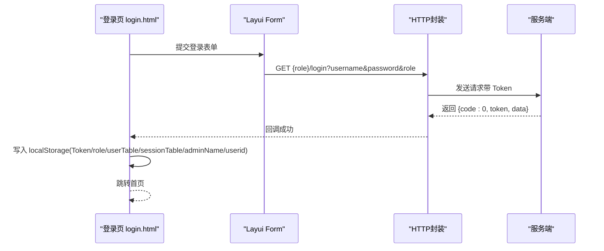
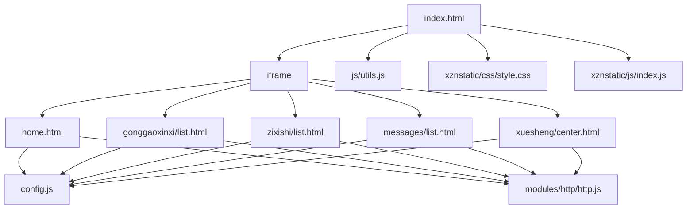

# 前端页面设计

<cite>
**本文引用的文件**
- [index.html](file://src/main/resources/front/front/index.html)
- [home.html](file://src/main/resources/front/front/pages/home/home.html)
- [login.html](file://src/main/resources/front/front/pages/login/login.html)
- [register.html](file://src/main/resources/front/front/pages/xuesheng/register.html)
- [center.html](file://src/main/resources/front/front/pages/xuesheng/center.html)
- [list.html（公告信息）](file://src/main/resources/front/front/pages/gonggaoxinxi/list.html)
- [list.html（自习室）](file://src/main/resources/front/front/pages/zixishi/list.html)
- [list.html（留言反馈）](file://src/main/resources/front/front/pages/messages/list.html)
- [config.js](file://src/main/resources/front/front/js/config.js)
- [utils.js](file://src/main/resources/front/front/js/utils.js)
- [http.js](file://src/main/resources/front/front/modules/http/http.js)
- [style.css](file://src/main/resources/front/front/xznstatic/css/style.css)
- [index.js](file://src/main/resources/front/front/xznstatic/js/index.js)
- [vue.js](file://src/main/resources/front/front/js/vue.js)
</cite>

## 目录
1. [引言](#引言)
2. [项目结构](#项目结构)
3. [核心组件](#核心组件)
4. [架构总览](#架构总览)
5. [详细组件分析](#详细组件分析)
6. [依赖分析](#依赖分析)
7. [性能考虑](#性能考虑)
8. [故障排查指南](#故障排查指南)
9. [结论](#结论)
10. [附录](#附录)

## 引言
本设计文档面向自习室管理系统前端页面，基于 Vue.js 与 Layui 组件库构建，采用 iframe 内嵌多页面的单页应用（SPA）风格布局。文档从页面布局、路由与导航、组件层次、生命周期与数据绑定、事件处理、Layui 使用与自定义样式、状态管理与数据传递、响应式与移动端适配、安全与表单验证、用户体验优化、开发规范与性能优化、调试与常见问题等方面进行全面阐述，帮助开发者快速理解并高效迭代前端页面。

## 项目结构
前端资源位于 src/main/resources/front/front 目录，采用“入口页 + 多页面内嵌”的模式：
- 入口页 index.html 负责顶部导航与主框架（iframe），通过 navPage/centerPage 等函数切换 iframe 内容。
- 各业务页面（如首页、登录、公告信息、自习室、留言反馈、个人中心等）独立 HTML 文件，按需加载。
- js/config.js 提供全局配置（导航菜单、权限判断、基础路径等）；modules/http/http.js 封装网络请求；utils.js 提供页面跳转、返回、订单号生成等工具。
- Layui 作为 UI 组件库，配合原生 jQuery 实现表单、分页、轮播、上传等功能；部分页面引入 Swiper 进行轮播图增强。

图表来源
- [index.html:1-304](file://src/main/resources/front/front/index.html#L1-L304)
- [home.html:1-617](file://src/main/resources/front/front/pages/home/home.html#L1-L617)
- [list.html（公告信息）:1-429](file://src/main/resources/front/front/pages/gonggaoxinxi/list.html#L1-L429)
- [list.html（自习室）:1-429](file://src/main/resources/front/front/pages/zixishi/list.html#L1-L429)
- [list.html（留言反馈）:1-272](file://src/main/resources/front/front/pages/messages/list.html#L1-L272)
- [center.html:1-536](file://src/main/resources/front/front/pages/xuesheng/center.html#L1-L536)
- [login.html:1-175](file://src/main/resources/front/front/pages/login/login.html#L1-L175)
- [register.html:1-166](file://src/main/resources/front/front/pages/xuesheng/register.html#L1-L166)
- [config.js:1-103](file://src/main/resources/front/front/js/config.js#L1-L103)
- [http.js:1-135](file://src/main/resources/front/front/modules/http/http.js#L1-L135)
- [utils.js:1-35](file://src/main/resources/front/front/js/utils.js#L1-L35)
- [style.css:1-499](file://src/main/resources/front/front/xznstatic/css/style.css#L1-L499)
- [index.js:1-8](file://src/main/resources/front/front/xznstatic/js/index.js#L1-L8)

章节来源
- [index.html:1-304](file://src/main/resources/front/front/index.html#L1-L304)
- [config.js:1-103](file://src/main/resources/front/front/js/config.js#L1-L103)

## 核心组件
- 入口页与导航组件
  - 顶部导航区：包含项目名、主导航菜单、个人中心、后台链接、购物车、客服等入口，使用 Vue 实例驱动菜单渲染与点击高亮。
  - 主框架 iframe：承载各业务页面，通过 navPage/centerPage 函数动态切换 src 并记录到 localStorage。
- 业务页面组件
  - 首页：轮播图、公告信息展示、样式化卡片列表。
  - 登录页：用户类型选择、表单校验、登录成功后写入 Token 与用户信息并跳转首页。
  - 注册页：字段校验（手机号）、注册成功后跳转登录。
  - 个人中心：轮播图、左侧菜单、表单渲染、头像上传、信息更新、退出登录。
  - 列表页（公告信息/自习室）：筛选条件、分页、权限控制按钮、跳转详情。
  - 留言反馈页：留言表单、分页展示、回复展示。
- 工具与配置
  - config.js：全局变量（项目名、导航、管理员地址、聊天开关、菜单与权限）、权限判断函数。
  - http.js：统一请求封装（GET/POST/JSON/上传），自动注入 Token，处理 401/403 重定向。
  - utils.js：页面跳转、返回、订单号生成。
  - style.css/index.js：通用样式与轮播初始化脚本。

章节来源
- [index.html:150-304](file://src/main/resources/front/front/index.html#L150-L304)
- [home.html:408-617](file://src/main/resources/front/front/pages/home/home.html#L408-L617)
- [login.html:78-175](file://src/main/resources/front/front/pages/login/login.html#L78-L175)
- [register.html:58-166](file://src/main/resources/front/front/pages/xuesheng/register.html#L58-L166)
- [center.html:170-536](file://src/main/resources/front/front/pages/xuesheng/center.html#L170-L536)
- [list.html（公告信息）:245-429](file://src/main/resources/front/front/pages/gonggaoxinxi/list.html#L245-L429)
- [list.html（自习室）:245-429](file://src/main/resources/front/front/pages/zixishi/list.html#L245-L429)
- [list.html（留言反馈）:58-272](file://src/main/resources/front/front/pages/messages/list.html#L58-L272)
- [config.js:1-103](file://src/main/resources/front/front/js/config.js#L1-L103)
- [http.js:1-135](file://src/main/resources/front/front/modules/http/http.js#L1-L135)
- [utils.js:1-35](file://src/main/resources/front/front/js/utils.js#L1-L35)
- [style.css:1-499](file://src/main/resources/front/front/xznstatic/css/style.css#L1-L499)
- [index.js:1-8](file://src/main/resources/front/front/xznstatic/js/index.js#L1-L8)

## 架构总览
整体采用“入口页 + 多页面内嵌”的 SPA 风格，入口页负责导航与主框架，业务页面各自维护 Vue 实例与 Layui 插件。数据流通过 http.js 统一请求，权限通过 config.js 的 isAuth/isFrontAuth 控制按钮与页面行为。

图表来源
- [index.html:246-265](file://src/main/resources/front/front/index.html#L246-L265)
- [config.js:38-103](file://src/main/resources/front/front/js/config.js#L38-L103)
- [http.js:20-101](file://src/main/resources/front/front/modules/http/http.js#L20-L101)

## 详细组件分析

### 入口页与导航组件（index.html）
- 功能要点
  - 顶部导航：使用 Vue 实例渲染 indexNav、图标数组、管理员地址、购物车与客服开关。
  - 主框架：iframe 容器，初始加载首页，支持 navPage/centerPage 动态切换。
  - 聊天弹窗：未登录时跳转登录，已登录则打开聊天页。
  - 自适应高度：定时调整 iframe 高度，窗口变化时重算高度。
- 生命周期与事件
  - created：打乱图标顺序。
  - mounted：为导航项绑定点击高亮。
  - 方法：jump、bindClickOnLi、navPage、centerPage、changeFrameHeight。
- 数据绑定
  - v-for/v-bind/v-if/v-show 控制菜单渲染与显示。
- 安全与状态
  - 通过 localStorage 存储 iframeUrl、用户表、Token 等，避免刷新丢失。

图表来源
- [index.html:194-225](file://src/main/resources/front/front/index.html#L194-L225)
- [index.html:246-265](file://src/main/resources/front/front/index.html#L246-L265)
- [index.html:273-282](file://src/main/resources/front/front/index.html#L273-L282)

章节来源
- [index.html:150-304](file://src/main/resources/front/front/index.html#L150-L304)

### 首页（home.html）
- 功能要点
  - 轮播图：通过 http.request('config/list') 获取图片列表，渲染 Layui 轮播。
  - 公告信息展示：拉取公告列表，渲染卡片列表，点击跳转详情。
  - 样式与交互：Flex 布局、Swiper 轮播（部分代码存在，实际以 Layui 轮播为主）。
- 生命周期与事件
  - Vue 实例：data（swiperList、gonggaoxinxiList）、filters（新闻摘要过滤）、methods（jump）。
  - Layui.use：初始化 carousel、form、http、jquery。
- 数据绑定
  - v-for 渲染轮播与公告卡片，点击事件触发跳转。

图表来源
- [home.html:468-507](file://src/main/resources/front/front/pages/home/home.html#L468-L507)
- [home.html:547-605](file://src/main/resources/front/front/pages/home/home.html#L547-L605)

章节来源
- [home.html:408-617](file://src/main/resources/front/front/pages/home/home.html#L408-L617)

### 登录页（login.html）
- 功能要点
  - 用户类型选择：根据 menu 渲染角色 radio。
  - 登录流程：form.on('submit(login)') 收集表单数据，调用 http.request(role + '/login')，成功后写入 Token、角色、用户表、会话信息，跳转首页。
  - 注册跳转：根据 menu 生成注册链接。
- 权限与安全
  - 401/403 自动跳转登录页。
  - Token 通过 http.js 注入请求头。

图表来源
- [login.html:121-163](file://src/main/resources/front/front/pages/login/login.html#L121-L163)
- [http.js:20-58](file://src/main/resources/front/front/modules/http/http.js#L20-L58)

章节来源
- [login.html:78-175](file://src/main/resources/front/front/pages/login/login.html#L78-L175)
- [config.js:65-103](file://src/main/resources/front/front/js/config.js#L65-L103)

### 注册页（xuesheng/register.html）
- 功能要点
  - 字段校验：学生号、密码、姓名、手机号（正则校验 isMobile）。
  - 注册提交：http.requestJson('xuesheng/register', 'post', data)。
  - 成功后提示并跳转登录。
- 与登录页协同
  - 登录成功后可进入个人中心。

章节来源
- [register.html:58-166](file://src/main/resources/front/front/pages/xuesheng/register.html#L58-L166)

### 个人中心（xuesheng/center.html）
- 功能要点
  - 菜单：根据 centerMenu 渲染左侧导航。
  - 表单：读取 session 接口回填表单，提交更新。
  - 上传：头像上传，http.js 上传接口自动携带 Token。
  - 退出：清理 localStorage 并跳转登录。
- 权限与安全
  - 若无 userTable，提示并跳转登录。
  - 所有请求自动注入 Token。

章节来源
- [center.html:170-536](file://src/main/resources/front/front/pages/xuesheng/center.html#L170-L536)

### 列表页（公告信息/自习室）
- 功能要点
  - 筛选：关键词输入框，点击搜索触发分页重新查询。
  - 分页：laypage.render，支持 prev/page/next/skip/count。
  - 权限：isAuth(tablename, button) 控制“新增”按钮显示。
  - 跳转：点击卡片跳转详情页。
- 数据绑定
  - v-for 渲染列表，点击事件触发 jump。

章节来源
- [list.html（公告信息）:245-429](file://src/main/resources/front/front/pages/gonggaoxinxi/list.html#L245-L429)
- [list.html（自习室）:245-429](file://src/main/resources/front/front/pages/zixishi/list.html#L245-L429)

### 留言反馈页（messages/list.html）
- 功能要点
  - 留言表单：lay-submit 提交，写入 userid 与 username。
  - 展示：分页列出留言与回复。
- 数据绑定
  - v-for 渲染留言列表。

章节来源
- [list.html（留言反馈）:58-272](file://src/main/resources/front/front/pages/messages/list.html#L58-L272)

### Layui 组件库与自定义样式
- 组件使用
  - layer：消息提示、弹窗（聊天、充值）。
  - form：表单校验、提交监听。
  - carousel：轮播图。
  - laypage：分页。
  - upload：文件上传（头像）。
- 自定义样式
  - style.css 提供通用布局与组件样式；index.js 初始化轮播脚本。
  - 页面内联样式通过 Vue 动态绑定，实现主题化与响应式。

章节来源
- [style.css:1-499](file://src/main/resources/front/front/xznstatic/css/style.css#L1-L499)
- [index.js:1-8](file://src/main/resources/front/front/xznstatic/js/index.js#L1-L8)

### 状态管理与数据传递
- 本地存储
  - Token、role、userTable、sessionTable、adminName、userid、iframeUrl 等通过 localStorage 维护。
- 跨页面传递
  - 通过 localStorage 与 URL 参数传递（如注册页的 tablename）。
- 权限控制
  - isAuth/isFrontAuth 根据当前角色菜单按钮集合判断是否显示/启用操作按钮。

章节来源
- [config.js:68-103](file://src/main/resources/front/front/js/config.js#L68-L103)
- [utils.js:1-35](file://src/main/resources/front/front/js/utils.js#L1-L35)

### 响应式设计与移动端适配
- viewport 配置：所有页面均设置 viewport，支持移动端缩放。
- Flex/Grid 布局：首页与列表页使用 Flex 布局，卡片自适应排列。
- 图片适配：object-fit: cover 保证图片在容器中等比填充。
- 轮播图：Layui carousel 与 Swiper（部分页面）适配不同屏幕尺寸。
- 字体与间距：通过内联样式与通用样式控制字号与间距，提升可读性。

章节来源
- [home.html:20-617](file://src/main/resources/front/front/pages/home/home.html#L20-L617)
- [list.html（公告信息）:17-429](file://src/main/resources/front/front/pages/gonggaoxinxi/list.html#L17-L429)
- [list.html（自习室）:17-429](file://src/main/resources/front/front/pages/zixishi/list.html#L17-L429)
- [style.css:1-499](file://src/main/resources/front/front/xznstatic/css/style.css#L1-L499)

### 安全措施、表单验证与用户体验
- 安全措施
  - Token 注入：http.js 在 beforeSend 中统一设置请求头。
  - 401/403 自动跳转登录。
  - 本地存储敏感信息（Token/role/userid），注意 XSS 防护与 HTTPS。
- 表单验证
  - 登录页：必填校验。
  - 注册页：字段非空与手机号格式校验。
  - 留言页：富文本区域必填校验。
- 用户体验
  - loading 层提示请求状态。
  - 成功/失败消息提示。
  - 轮播图与卡片 hover 效果提升交互感。

章节来源
- [http.js:20-101](file://src/main/resources/front/front/modules/http/http.js#L20-L101)
- [login.html:129-161](file://src/main/resources/front/front/pages/login/login.html#L129-L161)
- [register.html:120-161](file://src/main/resources/front/front/pages/xuesheng/register.html#L120-L161)
- [list.html（留言反馈）:251-266](file://src/main/resources/front/front/pages/messages/list.html#L251-L266)

## 依赖分析
- 组件耦合
  - index.html 与各业务页面通过 iframe 解耦，仅通过 localStorage 与跳转函数通信。
  - 业务页面共享 config.js 与 http.js，形成统一配置与网络层。
- 外部依赖
  - Vue.js：数据绑定与生命周期。
  - Layui：UI 组件与插件生态。
  - jQuery：AJAX、DOM 操作。
  - Swiper（可选）：增强轮播体验。

图表来源
- [index.html:1-304](file://src/main/resources/front/front/index.html#L1-L304)
- [home.html:1-617](file://src/main/resources/front/front/pages/home/home.html#L1-L617)
- [list.html（公告信息）:1-429](file://src/main/resources/front/front/pages/gonggaoxinxi/list.html#L1-L429)
- [list.html（自习室）:1-429](file://src/main/resources/front/front/pages/zixishi/list.html#L1-L429)
- [list.html（留言反馈）:1-272](file://src/main/resources/front/front/pages/messages/list.html#L1-L272)
- [center.html:1-536](file://src/main/resources/front/front/pages/xuesheng/center.html#L1-L536)
- [config.js:1-103](file://src/main/resources/front/front/js/config.js#L1-L103)
- [http.js:1-135](file://src/main/resources/front/front/modules/http/http.js#L1-L135)
- [utils.js:1-35](file://src/main/resources/front/front/js/utils.js#L1-L35)
- [style.css:1-499](file://src/main/resources/front/front/xznstatic/css/style.css#L1-L499)
- [index.js:1-8](file://src/main/resources/front/front/xznstatic/js/index.js#L1-L8)

章节来源
- [index.html:1-304](file://src/main/resources/front/front/index.html#L1-L304)
- [config.js:1-103](file://src/main/resources/front/front/js/config.js#L1-L103)
- [http.js:1-135](file://src/main/resources/front/front/modules/http/http.js#L1-L135)

## 性能考虑
- 资源加载
  - 合理拆分页面，避免单页过大；按需引入 Layui 插件。
  - 图片使用 object-fit 与合理尺寸，减少重排。
- 渲染优化
  - 使用 v-for 的 key 提升列表渲染稳定性。
  - $nextTick 确保 DOM 更新后再初始化轮播/分页。
- 网络优化
  - 统一注入 Token，减少重复鉴权开销。
  - 合理分页与懒加载（列表页已具备分页基础）。
- 移动端
  - 使用 viewport 与弹性布局，避免大图与复杂动画影响首屏。

## 故障排查指南
- 登录后无法进入个人中心
  - 检查 localStorage 是否写入 userTable 与 Token；确认 session 接口返回。
- 轮播图不显示
  - 检查 config/list 接口返回值与图片 URL；确认 Layui carousel 初始化时机（$nextTick）。
- 分页不生效
  - 检查 laypage.render 的 count 与 jump 回调是否正确设置。
- 上传失败
  - 检查 http.js 上传接口与 Token 头部；确认文件类型与大小限制。
- 401/403
  - 检查 Token 是否过期或被清除；确认 http.js 请求头注入。

章节来源
- [http.js:20-101](file://src/main/resources/front/front/modules/http/http.js#L20-L101)
- [center.html:470-488](file://src/main/resources/front/front/pages/xuesheng/center.html#L470-L488)

## 结论
该前端架构以入口页 + 多页面内嵌为核心，结合 Vue.js 与 Layui 实现了清晰的页面职责划分与良好的交互体验。通过统一的配置与网络层封装，实现了跨页面的状态共享与权限控制。建议后续在保持现有架构稳定的基础上，逐步引入更现代的前端框架（如 Vue 3 Composition API 或 React）与工程化工具链，进一步提升可维护性与性能。

## 附录
- 开发规范
  - 统一使用 config.js 管理全局常量与权限。
  - 所有网络请求通过 http.js 发起，避免直接使用 jQuery AJAX。
  - 页面跳转统一使用 utils.js 的 jump/back。
  - 样式优先使用通用样式与内联样式绑定，避免重复定义。
- 性能优化建议
  - 对长列表使用虚拟滚动或分页优化。
  - 图片懒加载与压缩。
  - 减少不必要的 DOM 更新，合理使用 v-show/v-if。
- 调试技巧
  - 使用浏览器开发者工具观察网络请求与 Token 注入。
  - 在关键节点打印日志（如请求成功/失败回调）。
  - 使用 Layui layer.msg 输出关键状态提示。