# 页面布局设计

<cite>
**本文档引用的文件**
- [index.html](file://src/main/resources/front/front/index.html)
- [home.html](file://src/main/resources/front/front/pages/home/home.html)
- [login.html](file://src/main/resources/front/front/pages/login/login.html)
- [bootstrap.min.css](file://src/main/resources/front/front/css/bootstrap.min.css)
- [style.css](file://src/main/resources/front/front/css/style.css)
- [common.css](file://src/main/resources/front/front/css/common.css)
- [theme.css](file://src/main/resources/front/front/css/theme.css)
- [public.css](file://src/main/resources/front/front/xznstatic/css/public.css)
- [style.css](file://src/main/resources/front/front/xznstatic/css/style.css)
- [common.css](file://src/main/resources/front/front/xznstatic/css/common.css)
- [config.js](file://src/main/resources/front/front/js/config.js)
- [config.js](file://src/main/resources/front/front/modules/config.js)
- [index.js](file://src/main/resources/front/front/xznstatic/js/index.js)
</cite>

## 目录
1. [项目概述](#项目概述)
2. [整体架构设计](#整体架构设计)
3. [Bootstrap框架集成](#bootstrap框架集成)
4. [响应式布局系统](#响应式布局系统)
5. [头部导航设计](#头部导航设计)
6. [主要内容区域](#主要内容区域)
7. [样式组织与主题定制](#样式组织与主题定制)
8. [颜色方案应用](#颜色方案应用)
9. [移动端适配与响应式设计](#移动端适配与响应式设计)
10. [页面性能优化](#页面性能优化)
11. [开发规范与最佳实践](#开发规范与最佳实践)
12. [故障排除指南](#故障排除指南)
13. [总结](#总结)

## 项目概述

自习室管理系统采用前后端分离架构，前端基于Vue.js框架构建，集成了Bootstrap响应式框架和Layui组件库。系统通过iframe技术实现页面间的无缝切换，提供完整的自习室预订、公告管理和用户交互功能。

该系统的核心特点包括：
- **模块化设计**：采用Vue.js组件化开发，便于维护和扩展
- **响应式布局**：支持多终端访问，适配桌面端和移动端设备
- **主题定制**：提供可定制的颜色方案和样式主题
- **组件化UI**：集成丰富的UI组件库，提升用户体验

## 整体架构设计

系统采用三层架构模式，通过iframe实现主页面与子页面的解耦设计。

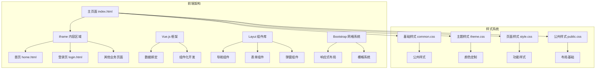

**图表来源**
- [index.html:1-304](file://src/main/resources/front/front/index.html#L1-L304)
- [home.html:1-617](file://src/main/resources/front/front/pages/home/home.html#L1-L617)

**章节来源**
- [index.html:1-304](file://src/main/resources/front/front/index.html#L1-L304)
- [config.js:1-103](file://src/main/resources/front/front/js/config.js#L1-L103)

## Bootstrap框架集成

系统集成了Bootstrap 4.3.1版本，充分利用其响应式网格系统和组件库。

### 网格系统特性

Bootstrap提供了强大的响应式网格系统，支持多种断点和布局选项：

```mermaid
flowchart TD
A[Bootstrap 网格系统] --> B[容器 Container]
B --> C[行 Row]
C --> D[列 Col]
D --> E[基础列 - col]
D --> F[响应式列 - col-{xs|sm|md|lg|xl}]
D --> G[偏移列 - offset-{xs|sm|md|lg|xl}]
D --> H[排序列 - order-{xs|sm|md|lg|xl}]
E --> I[自动宽度 - col-auto]
F --> J[固定宽度 - col-1 到 col-12]
G --> K[水平居中 - mx-auto]
H --> L[内容顺序调整]
```

**图表来源**
- [bootstrap.min.css:1-13](file://src/main/resources/front/front/css/bootstrap.min.css#L1-L13)

### 断点配置

系统支持以下断点配置：
- **xs**: ≤575.98px
- **sm**: ≥576px  
- **md**: ≥768px
- **lg**: ≥992px
- **xl**: ≥1200px

这些断点确保了在不同设备上的良好显示效果。

**章节来源**
- [bootstrap.min.css:1-13](file://src/main/resources/front/front/css/bootstrap.min.css#L1-L13)

## 响应式布局系统

系统采用混合响应式设计，结合Bootstrap网格系统和自定义样式规则。

### 主要布局组件

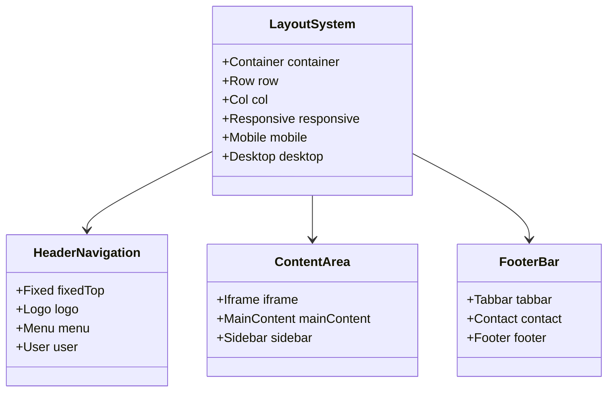

**图表来源**
- [index.html:152-301](file://src/main/resources/front/front/index.html#L152-L301)

### 布局适配策略

系统采用以下布局适配策略：

1. **头部固定定位**：使用`position: fixed`确保导航栏始终可见
2. **内容区域自适应**：通过CSS计算确保内容区域正确显示
3. **底部工具栏**：提供额外的功能按钮和信息展示

**章节来源**
- [index.html:21-151](file://src/main/resources/front/front/index.html#L21-L151)

## 头部导航设计

头部导航是系统的重要组成部分，采用了固定定位和响应式设计。

### 导航结构

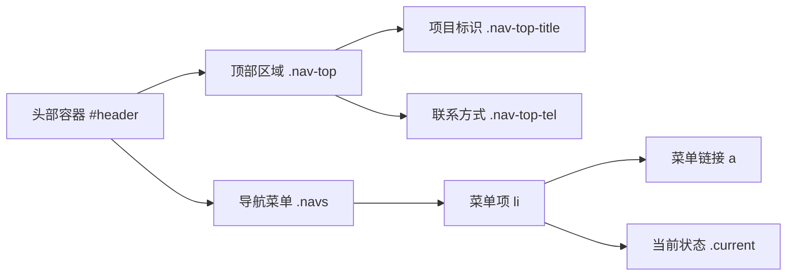

**图表来源**
- [index.html:154-174](file://src/main/resources/front/front/index.html#L154-L174)

### 样式特性

头部导航具有以下样式特性：
- **固定定位**：`position: fixed`确保导航栏始终位于页面顶部
- **阴影效果**：使用`box-shadow`创建层次感
- **颜色方案**：采用绿色主题(#2a8a15)作为主要标识色
- **响应式设计**：在不同屏幕尺寸下保持良好的可读性

**章节来源**
- [index.html:21-151](file://src/main/resources/front/front/index.html#L21-L151)

## 主要内容区域

主要内容区域通过iframe实现动态加载，支持多种业务页面的无缝切换。

### iframe架构设计

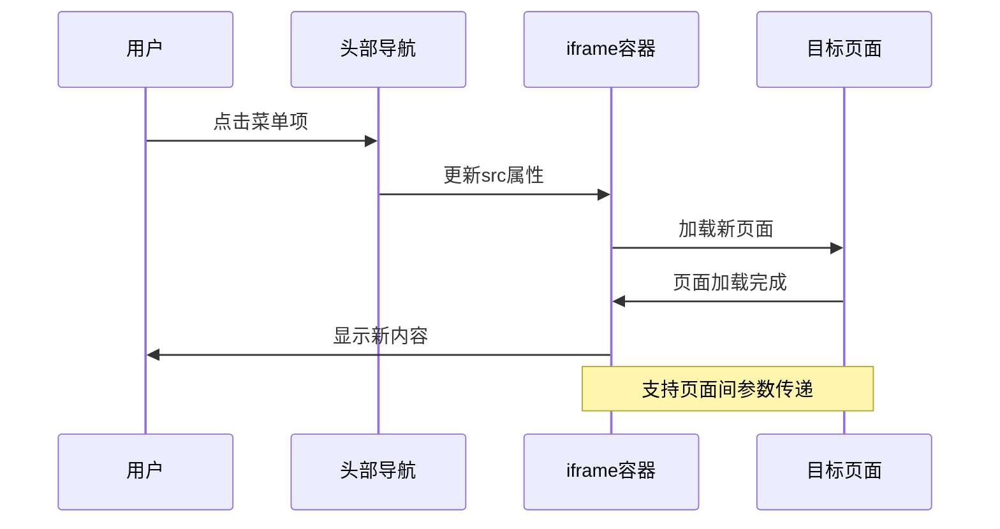

**图表来源**
- [index.html:246-264](file://src/main/resources/front/front/index.html#L246-L264)

### 动态高度调整

系统实现了智能的高度调整机制：

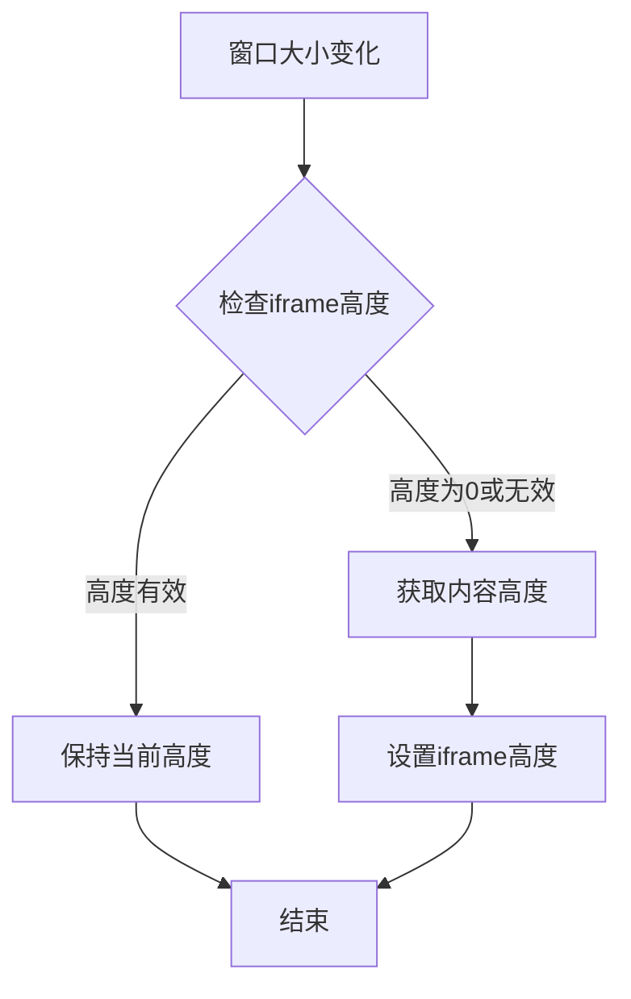

**图表来源**
- [index.html:273-282](file://src/main/resources/front/front/index.html#L273-L282)

**章节来源**
- [index.html:177-282](file://src/main/resources/front/front/index.html#L177-L282)

## 样式组织与主题定制

系统采用模块化的样式组织方式，通过多个CSS文件实现功能分离和主题定制。

### 样式文件结构

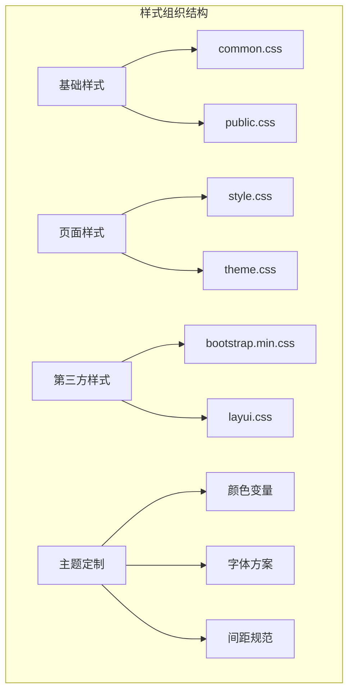

**图表来源**
- [common.css:1-22](file://src/main/resources/front/front/css/common.css#L1-L22)
- [public.css:1-498](file://src/main/resources/front/front/xznstatic/css/public.css#L1-L498)

### 样式继承关系

系统采用以下样式继承关系：
- **基础样式**：提供全局样式重置和基础元素样式
- **公共样式**：定义通用的布局和组件样式
- **页面样式**：针对特定页面的功能样式
- **主题样式**：提供颜色和外观的定制方案

**章节来源**
- [style.css:1-702](file://src/main/resources/front/front/css/style.css#L1-L702)
- [theme.css:1-265](file://src/main/resources/front/front/css/theme.css#L1-L265)

## 颜色方案应用

系统采用统一的颜色方案，以红色(#ce0b07)为主色调，营造专业和活力的品牌形象。

### 主要颜色应用

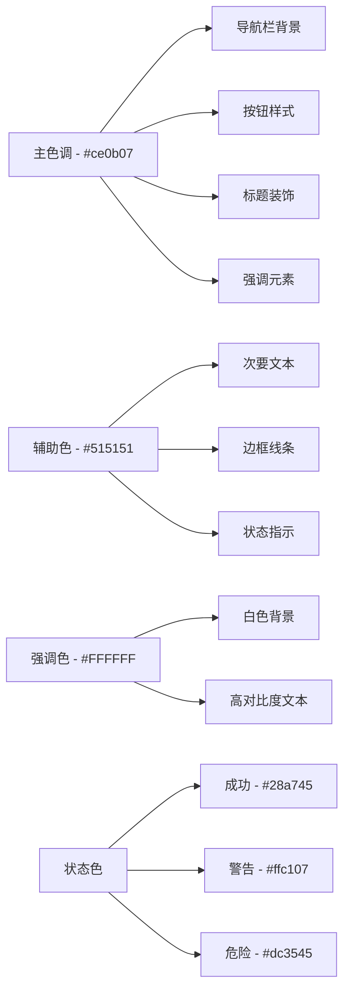

**图表来源**
- [theme.css:1-265](file://src/main/resources/front/front/css/theme.css#L1-L265)

### 颜色使用规范

系统遵循以下颜色使用规范：
- **主色调**：用于重要操作按钮和导航元素
- **辅助色**：用于次要信息和边框装饰
- **状态色**：用于反馈信息和状态指示
- **背景色**：保持简洁，避免过度装饰

**章节来源**
- [theme.css:1-265](file://src/main/resources/front/front/css/theme.css#L1-L265)

## 移动端适配与响应式设计

系统采用移动优先的设计理念，确保在各种设备上都能提供优秀的用户体验。

### 响应式断点

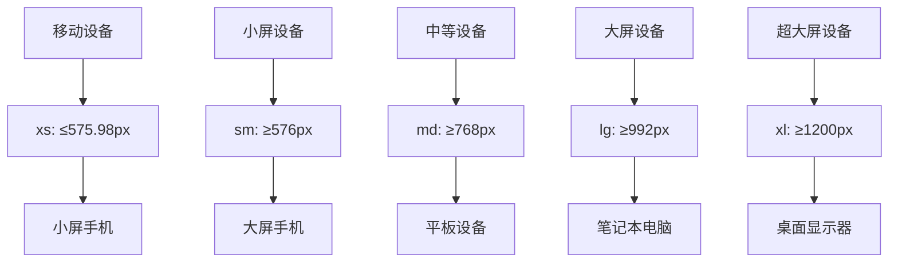

**图表来源**
- [bootstrap.min.css:1-13](file://src/main/resources/front/front/css/bootstrap.min.css#L1-L13)

### 移动端优化策略

系统采用以下移动端优化策略：

1. **视口配置**：使用`viewport`元标签确保正确的缩放行为
2. **触摸友好的交互**：按钮和链接具有足够的点击区域
3. **灵活的布局**：使用弹性布局和媒体查询适配不同屏幕
4. **性能优化**：减少不必要的重绘和回流

**章节来源**
- [home.html:12-12](file://src/main/resources/front/front/pages/home/home.html#L12-L12)

## 页面性能优化

系统在设计时充分考虑了性能优化，采用多种技术和策略提升页面加载速度和运行效率。

### 性能优化技术

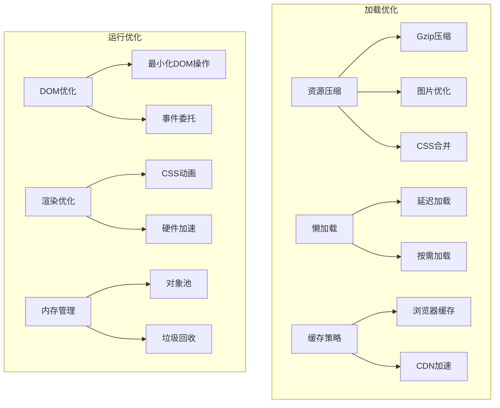

### 具体优化措施

1. **资源压缩**：CSS和JavaScript文件经过压缩处理
2. **图片优化**：使用适当的图片格式和尺寸
3. **懒加载**：非关键资源采用延迟加载策略
4. **缓存策略**：合理设置HTTP缓存头
5. **代码分割**：按需加载不同的功能模块

**章节来源**
- [index.html:186-189](file://src/main/resources/front/front/index.html#L186-L189)

## 开发规范与最佳实践

系统制定了详细的开发规范，确保代码质量和团队协作效率。

### 代码组织规范

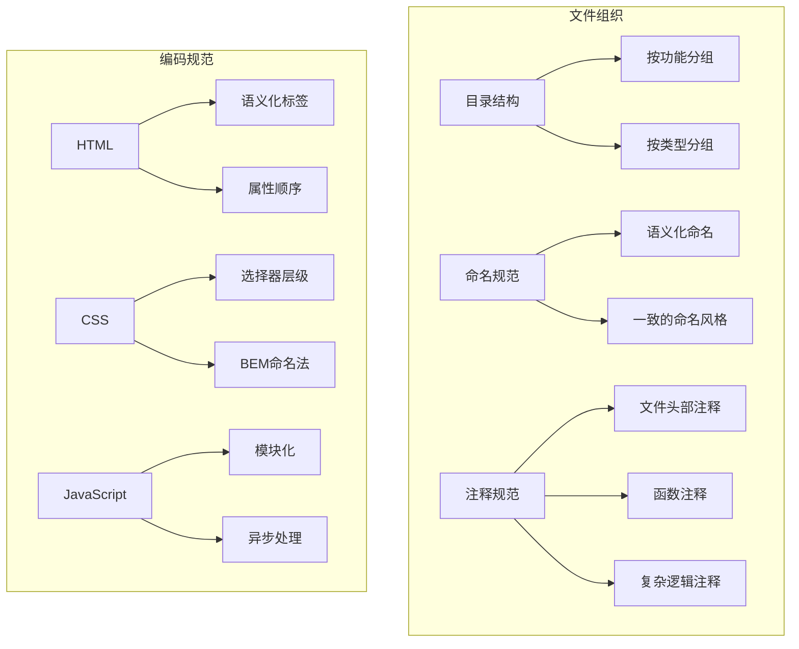

### 最佳实践指南

1. **模块化开发**：每个功能模块独立封装，便于维护和测试
2. **组件复用**：通用组件抽象成可复用的模块
3. **错误处理**：完善的异常捕获和错误提示机制
4. **安全性**：输入验证和XSS防护措施
5. **可访问性**：遵循WCAG标准，支持屏幕阅读器

**章节来源**
- [config.js:1-103](file://src/main/resources/front/front/js/config.js#L1-L103)

## 故障排除指南

系统提供了完善的故障排除指南，帮助开发者快速定位和解决问题。

### 常见问题诊断

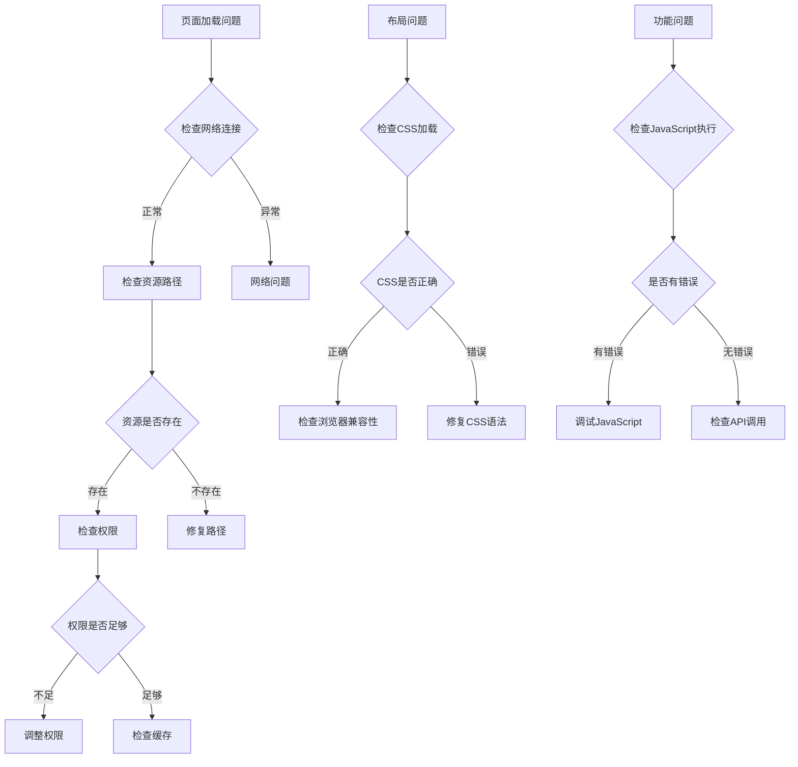

### 调试工具使用

1. **浏览器开发者工具**：检查网络请求、DOM结构和JavaScript执行
2. **控制台日志**：输出关键信息和错误堆栈
3. **性能分析**：监控页面加载时间和内存使用
4. **响应式调试**：模拟不同设备和屏幕尺寸

**章节来源**
- [index.js:1-8](file://src/main/resources/front/front/xznstatic/js/index.js#L1-L8)

## 总结

自习室管理系统采用现代化的前端技术栈，通过合理的架构设计和丰富的组件库，为用户提供了一个功能完整、界面美观、性能优异的自习室管理平台。

### 核心优势

1. **技术先进**：采用Vue.js、Bootstrap、Layui等主流技术
2. **用户体验**：响应式设计和流畅的交互体验
3. **可维护性**：模块化架构和清晰的代码组织
4. **可扩展性**：灵活的主题定制和组件化设计
5. **性能优化**：多项性能优化技术和最佳实践

### 发展方向

未来可以在以下方面进一步改进：
- **PWA支持**：添加离线访问和推送通知功能
- **国际化**：支持多语言界面
- **无障碍访问**：进一步提升可访问性
- **性能监控**：集成性能监控和分析工具
- **自动化测试**：建立完整的测试体系

这个系统为类似的企业管理平台提供了优秀的参考模板，展示了现代Web应用开发的最佳实践和技术整合能力。