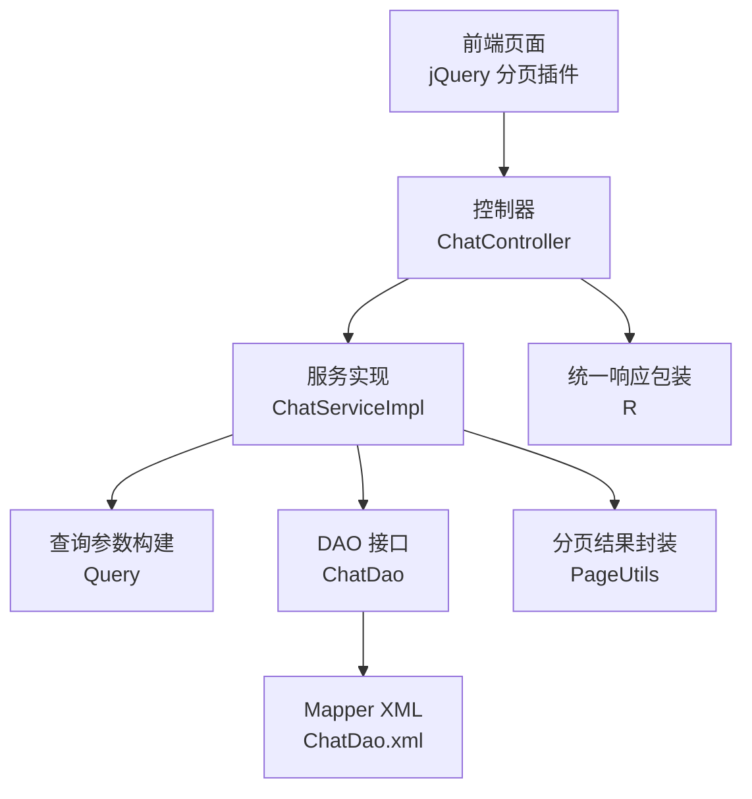
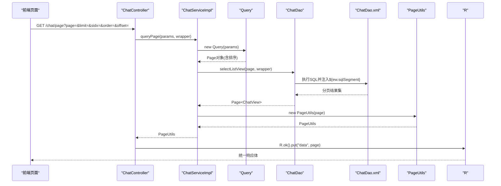
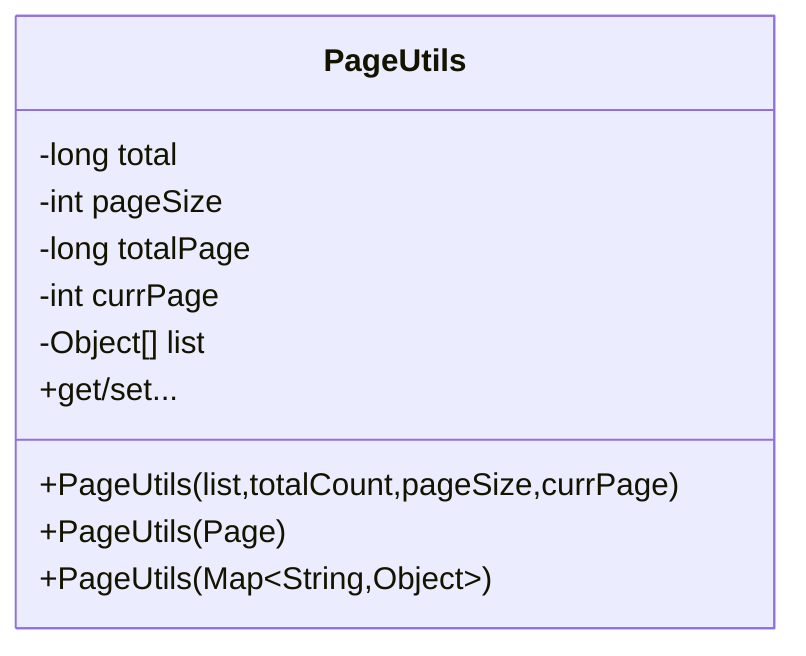
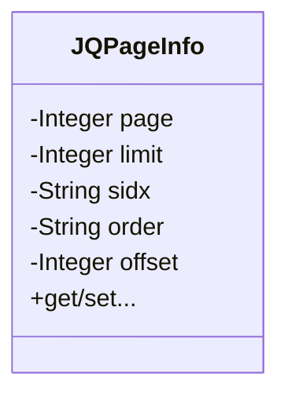
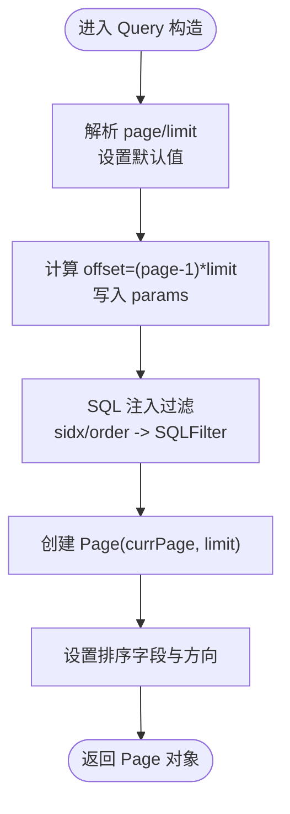
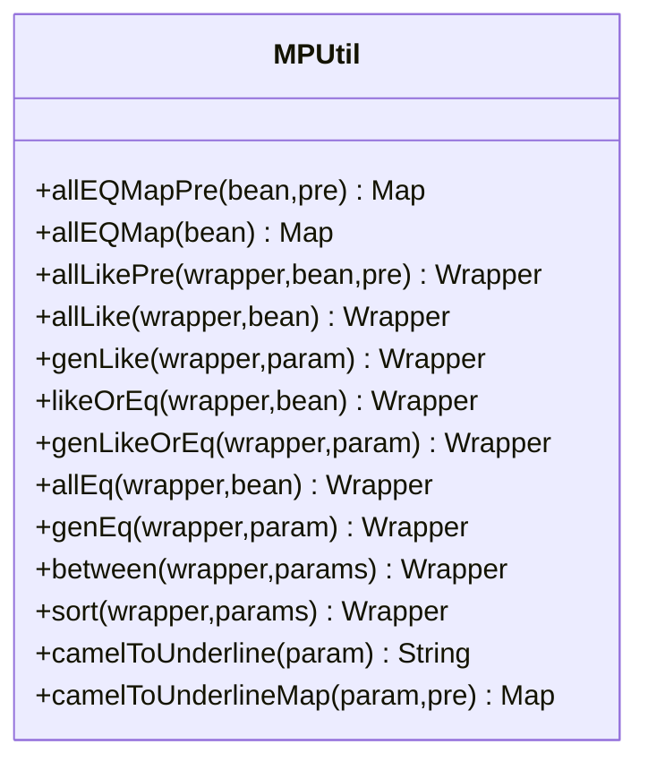
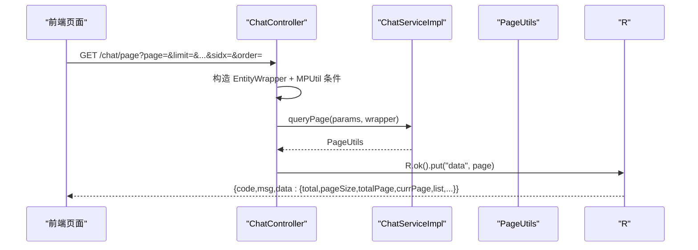
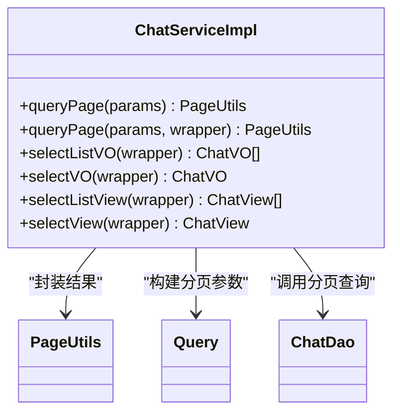
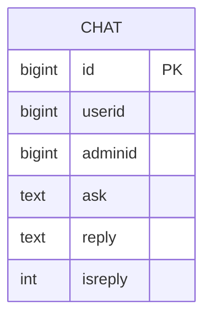
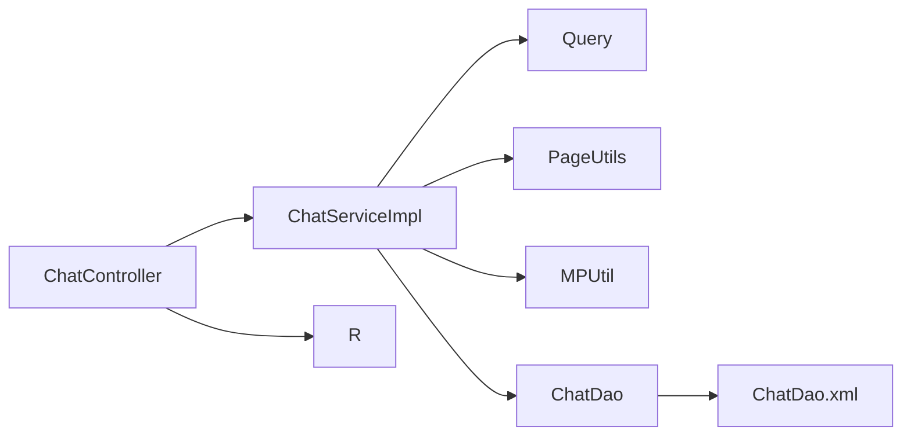

# 分页工具类

<cite>
**本文引用的文件**
- [PageUtils.java](file://src/main/java/com/utils/PageUtils.java)
- [JQPageInfo.java](file://src/main/java/com/utils/JQPageInfo.java)
- [Query.java](file://src/main/java/com/utils/Query.java)
- [MPUtil.java](file://src/main/java/com/utils/MPUtil.java)
- [R.java](file://src/main/java/com/utils/R.java)
- [ChatService.java](file://src/main/java/com/service/ChatService.java)
- [ChatServiceImpl.java](file://src/main/java/com/service/impl/ChatServiceImpl.java)
- [ChatController.java](file://src/main/java/com/controller/ChatController.java)
- [ChatDao.java](file://src/main/java/com/dao/ChatDao.java)
- [ChatDao.xml](file://src/main/resources/mapper/ChatDao.xml)
</cite>

## 目录
1. [简介](#简介)
2. [项目结构](#项目结构)
3. [核心组件](#核心组件)
4. [架构总览](#架构总览)
5. [详细组件分析](#详细组件分析)
6. [依赖关系分析](#依赖关系分析)
7. [性能考虑](#性能考虑)
8. [故障排查指南](#故障排查指南)
9. [结论](#结论)
10. [附录](#附录)

## 简介
本文件系统性梳理并解析了项目中的分页工具体系，重点覆盖以下内容：
- PageUtils 类的分页算法与参数处理机制
- JQPageInfo 类与前端 jQuery 分页插件的参数映射与集成方式
- 分页查询的实现原理：起始位置计算、每页数量控制、总记录数处理
- 分页参数的传递方式与安全校验规则
- 在 Service 层与 Controller 层集成分页功能的实践示例
- 分页性能优化策略与大数据量处理方案
- 分页组件的配置选项与可扩展点

## 项目结构
分页能力由“工具层 + 控制器 + 服务层 + DAO 层”协同完成，核心文件分布如下：
- 工具层：PageUtils、JQPageInfo、Query、MPUtil、R
- 控制器层：以 ChatController 为代表，统一接收前端分页参数并返回标准响应
- 服务层：ChatServiceImpl 实现分页查询逻辑，封装 MyBatis-Plus 的 Page 对象
- DAO 层：ChatDao 定义分页查询方法，ChatDao.xml 提供 SQL 片段拼接

图表来源
- [ChatController.java:57-80](file://src/main/java/com/controller/ChatController.java#L57-L80)
- [ChatServiceImpl.java:25-40](file://src/main/java/com/service/impl/ChatServiceImpl.java#L25-L40)
- [Query.java:29-52](file://src/main/java/com/utils/Query.java#L29-L52)
- [ChatDao.java:21-31](file://src/main/java/com/dao/ChatDao.java#L21-L31)
- [ChatDao.xml:15-37](file://src/main/resources/mapper/ChatDao.xml#L15-L37)
- [PageUtils.java:13-50](file://src/main/java/com/utils/PageUtils.java#L13-L50)
- [R.java:9-51](file://src/main/java/com/utils/R.java#L9-L51)

章节来源
- [ChatController.java:57-80](file://src/main/java/com/controller/ChatController.java#L57-L80)
- [ChatServiceImpl.java:25-40](file://src/main/java/com/service/impl/ChatServiceImpl.java#L25-L40)
- [Query.java:29-52](file://src/main/java/com/utils/Query.java#L29-L52)
- [ChatDao.java:21-31](file://src/main/java/com/dao/ChatDao.java#L21-L31)
- [ChatDao.xml:15-37](file://src/main/resources/mapper/ChatDao.xml#L15-L37)
- [PageUtils.java:13-50](file://src/main/java/com/utils/PageUtils.java#L13-L50)
- [R.java:9-51](file://src/main/java/com/utils/R.java#L9-L51)

## 核心组件
- PageUtils：封装分页结果，包含总记录数、每页大小、总页数、当前页、数据列表等字段，支持从 MyBatis-Plus Page 对象或原始参数构造
- JQPageInfo：前端 jQuery 分页插件的参数载体，包含 page、limit、sidx、order、offset 等字段，用于与后端 Query 组件对接
- Query：查询参数构建器，负责将前端传入的分页参数转换为 MyBatis-Plus 的 Page 对象，并进行排序字段的安全过滤
- MPUtil：MyBatis-Plus 辅助工具，提供条件组装（like/eq/between）、排序、驼峰转下划线等能力
- R：统一响应包装类，所有接口返回统一结构

章节来源
- [PageUtils.java:13-101](file://src/main/java/com/utils/PageUtils.java#L13-L101)
- [JQPageInfo.java:3-54](file://src/main/java/com/utils/JQPageInfo.java#L3-L54)
- [Query.java:14-98](file://src/main/java/com/utils/Query.java#L14-L98)
- [MPUtil.java:17-184](file://src/main/java/com/utils/MPUtil.java#L17-L184)
- [R.java:9-51](file://src/main/java/com/utils/R.java#L9-L51)

## 架构总览
分页请求从前端到后端的关键流转如下：
- 前端 jQuery 分页插件发送 page、limit、sidx、order、offset 等参数
- 控制器接收参数，构造查询条件，调用服务层分页查询
- 服务层基于 Query 构建 Page 对象，执行分页查询
- DAO 层通过 XML 中的 ${ew.sqlSegment} 注入动态条件
- 结果经 PageUtils 封装，再由 R 统一包装返回

图表来源
- [ChatController.java:57-67](file://src/main/java/com/controller/ChatController.java#L57-L67)
- [ChatServiceImpl.java:34-40](file://src/main/java/com/service/impl/ChatServiceImpl.java#L34-L40)
- [Query.java:29-52](file://src/main/java/com/utils/Query.java#L29-L52)
- [ChatDao.java](file://src/main/java/com/dao/ChatDao.java#L29)
- [ChatDao.xml:27-32](file://src/main/resources/mapper/ChatDao.xml#L27-L32)
- [PageUtils.java:44-50](file://src/main/java/com/utils/PageUtils.java#L44-L50)
- [R.java:43-50](file://src/main/java/com/utils/R.java#L43-L50)

## 详细组件分析

### PageUtils 分页结果封装
- 职责：将 MyBatis-Plus 的 Page 对象或原始分页参数封装为统一的分页结果模型
- 关键字段：total、pageSize、totalPage、currPage、list
- 构造方式：
  - 从 Page 对象直接构造：自动填充 records、total、size、current、pages
  - 从原始参数构造：需显式传入 list、total、pageSize、currPage，并手动计算 totalPage
- 使用场景：服务层返回给控制器；控制器统一放入 R.ok().put("data", ...) 中

图表来源
- [PageUtils.java:13-101](file://src/main/java/com/utils/PageUtils.java#L13-L101)

章节来源
- [PageUtils.java:13-101](file://src/main/java/com/utils/PageUtils.java#L13-L101)

### JQPageInfo 前端参数载体
- 字段含义：
  - page：当前页（从1开始）
  - limit：每页条数
  - sidx：排序字段
  - order：排序方向（ASC/DESC）
  - offset：偏移量（由 Query 内部计算并写入 params）
- 作用：作为前端 jQuery 分页插件与后端 Query 的桥接对象，确保参数命名一致

图表来源
- [JQPageInfo.java:3-54](file://src/main/java/com/utils/JQPageInfo.java#L3-L54)

章节来源
- [JQPageInfo.java:3-54](file://src/main/java/com/utils/JQPageInfo.java#L3-L54)

### Query 分页参数构建与安全过滤
- 功能要点：
  - 支持两种输入：JQPageInfo 或 Map<String, Object>
  - 解析 page、limit 并设置默认值（currPage 默认1，limit 默认10）
  - 计算 offset：offset = (currPage - 1) * limit，并写入 params
  - 排序字段安全过滤：对 sidx、order 进行 SQLFilter.sqlInject 处理
  - 构造 MyBatis-Plus Page 对象，并设置排序字段与方向
- 与 MPUtil 的配合：通过 MPUtil.sort、MPUtil.likeOrEq、MPUtil.between 等生成动态 where 条件

图表来源
- [Query.java:29-52](file://src/main/java/com/utils/Query.java#L29-L52)
- [Query.java:55-84](file://src/main/java/com/utils/Query.java#L55-L84)

章节来源
- [Query.java:14-98](file://src/main/java/com/utils/Query.java#L14-L98)

### MPUtil 条件与排序组装
- like/eq/allLike/allEq：将实体对象或 Map 转换为 MyBatis-Plus 条件，支持模糊匹配、精确匹配与组合条件
- between：支持字段区间查询（_start/_end）
- sort：根据 sort/order 参数设置升序/降序
- camelToUnderline/camelToUnderlineMap：驼峰字段名转下划线，适配数据库字段命名

图表来源
- [MPUtil.java:17-184](file://src/main/java/com/utils/MPUtil.java#L17-L184)

章节来源
- [MPUtil.java:17-184](file://src/main/java/com/utils/MPUtil.java#L17-L184)

### 控制器层集成示例（ChatController）
- 后端列表接口：/chat/page
  - 接收 Map<String, Object> 参数，构造 EntityWrapper 并应用 MPUtil.sort、MPUtil.between、MPUtil.likeOrEq 等
  - 调用 chatService.queryPage(params, wrapper)，返回 PageUtils
  - 使用 R.ok().put("data", page) 统一输出
- 前端列表接口：/chat/list
  - 逻辑与后端列表类似，但可能不带管理员权限限制

图表来源
- [ChatController.java:57-80](file://src/main/java/com/controller/ChatController.java#L57-L80)
- [ChatServiceImpl.java:34-40](file://src/main/java/com/service/impl/ChatServiceImpl.java#L34-L40)
- [PageUtils.java:44-50](file://src/main/java/com/utils/PageUtils.java#L44-L50)
- [R.java:43-50](file://src/main/java/com/utils/R.java#L43-L50)

章节来源
- [ChatController.java:57-80](file://src/main/java/com/controller/ChatController.java#L57-L80)

### 服务层实现（ChatServiceImpl）
- 重载 queryPage：
  - 无条件分页：new Query(params).getPage() 直接传入 selectPage
  - 带视图分页：先创建 Page，再通过 baseMapper.selectListView(page, wrapper) 设置 records，最后 new PageUtils(page)
- 返回 PageUtils，供控制器统一包装

图表来源
- [ChatServiceImpl.java:25-40](file://src/main/java/com/service/impl/ChatServiceImpl.java#L25-L40)
- [PageUtils.java:44-50](file://src/main/java/com/utils/PageUtils.java#L44-L50)
- [Query.java:87-89](file://src/main/java/com/utils/Query.java#L87-L89)
- [ChatDao.java](file://src/main/java/com/dao/ChatDao.java#L29)

章节来源
- [ChatServiceImpl.java:25-40](file://src/main/java/com/service/impl/ChatServiceImpl.java#L25-L40)

### DAO 层与 XML 映射
- ChatDao 定义 selectListView(Pagination page, @Param("ew") Wrapper<ChatEntity> wrapper)
- ChatDao.xml 通过 <where> 1=1 ${ew.sqlSegment} 注入动态条件，实现灵活的分页查询
- 注意：该实现依赖 ${ew.sqlSegment}，属于动态 SQL 片段拼接，需确保传入的 wrapper 是由 MPUtil 生成且已过滤

图表来源
- [ChatDao.xml:7-13](file://src/main/resources/mapper/ChatDao.xml#L7-L13)

章节来源
- [ChatDao.java](file://src/main/java/com/dao/ChatDao.java#L29)
- [ChatDao.xml:27-32](file://src/main/resources/mapper/ChatDao.xml#L27-L32)

## 依赖关系分析
- 控制器依赖服务层：ChatController 依赖 ChatServiceImpl
- 服务层依赖工具层：ChatServiceImpl 依赖 Query、PageUtils、MPUtil
- DAO 依赖 MyBatis-Plus：ChatDao 继承 BaseMapper，使用 Pagination 与 Wrapper
- 响应统一：控制器依赖 R 进行统一响应包装

图表来源
- [ChatController.java:57-67](file://src/main/java/com/controller/ChatController.java#L57-L67)
- [ChatServiceImpl.java:25-40](file://src/main/java/com/service/impl/ChatServiceImpl.java#L25-L40)
- [Query.java:87-89](file://src/main/java/com/utils/Query.java#L87-L89)
- [PageUtils.java:44-50](file://src/main/java/com/utils/PageUtils.java#L44-L50)
- [MPUtil.java:121-134](file://src/main/java/com/utils/MPUtil.java#L121-L134)
- [ChatDao.java](file://src/main/java/com/dao/ChatDao.java#L29)
- [ChatDao.xml:27-32](file://src/main/resources/mapper/ChatDao.xml#L27-L32)
- [R.java:43-50](file://src/main/java/com/utils/R.java#L43-L50)

章节来源
- [ChatController.java:57-67](file://src/main/java/com/controller/ChatController.java#L57-L67)
- [ChatServiceImpl.java:25-40](file://src/main/java/com/service/impl/ChatServiceImpl.java#L25-L40)
- [Query.java:87-89](file://src/main/java/com/utils/Query.java#L87-L89)
- [PageUtils.java:44-50](file://src/main/java/com/utils/PageUtils.java#L44-L50)
- [MPUtil.java:121-134](file://src/main/java/com/utils/MPUtil.java#L121-L134)
- [ChatDao.java](file://src/main/java/com/dao/ChatDao.java#L29)
- [ChatDao.xml:27-32](file://src/main/resources/mapper/ChatDao.xml#L27-L32)
- [R.java:43-50](file://src/main/java/com/utils/R.java#L43-L50)

## 性能考虑
- 分页算法复杂度
  - PageUtils 的计算仅涉及常数时间的除法与赋值，时间复杂度 O(1)
  - Query 的 offset 计算与排序设置为 O(1)
  - MPUtil 的条件组装为 O(n)（n 为条件项数），通常较小
- 数据库层面
  - 使用 MyBatis-Plus 的 Page 对象进行物理分页，避免一次性加载全量数据
  - SQL 中通过 ${ew.sqlSegment} 注入 where 条件，建议确保传入的 wrapper 已由 MPUtil 生成，减少不必要的全表扫描
- 参数与安全
  - Query 对排序字段进行 SQL 注入过滤，降低注入风险
  - 建议对 page、limit 进行边界校验（如最小值、最大值、合理范围），防止超大分页导致数据库压力过大
- 大数据量优化
  - 优先使用索引覆盖排序字段与过滤字段
  - 控制每页大小，避免 limit 过大
  - 对高频查询建立复合索引，减少排序成本
  - 使用缓存策略（如 Redis）缓存热门查询结果，降低数据库访问频率

## 故障排查指南
- 常见问题与定位
  - 分页结果为空或总数不正确：检查前端传入的 page、limit 是否为有效正整数；确认 Query 的默认值是否被覆盖
  - 排序无效或报错：确认 sidx 是否为允许的字段名，且未被 SQL 注入过滤器剔除；检查 order 是否为 ASC/DESC
  - 动态条件不生效：确认 wrapper 是由 MPUtil.sort、MPUtil.likeOrEq、MPUtil.between 等生成；检查字段命名是否符合驼峰转下划线规则
  - SQL 注入风险提示：若发现排序字段被过滤为空，检查前端传参是否包含非法字符
- 调试建议
  - 在 ChatServiceImpl.queryPage 中打印 params 与 wrapper 的最终形态，核对 offset、sort、order 是否正确
  - 在 ChatDao.xml 中临时开启 SQL 日志，观察最终生成的 SQL 片段
  - 使用 R.ok().put("data", page) 输出时，检查返回结构是否包含 total、pageSize、totalPage、currPage、list

章节来源
- [Query.java:29-52](file://src/main/java/com/utils/Query.java#L29-L52)
- [Query.java:55-84](file://src/main/java/com/utils/Query.java#L55-L84)
- [MPUtil.java:121-134](file://src/main/java/com/utils/MPUtil.java#L121-L134)
- [ChatDao.xml:27-32](file://src/main/resources/mapper/ChatDao.xml#L27-L32)
- [R.java:43-50](file://src/main/java/com/utils/R.java#L43-L50)

## 结论
本项目的分页体系以 Query 为核心参数构建器，结合 MPUtil 的条件与排序组装能力，通过 PageUtils 统一封装分页结果，并由 R 提供统一响应结构。整体设计清晰、职责明确，既满足前端 jQuery 分页插件的参数约定，又兼顾了安全性与可扩展性。在生产环境中，建议进一步完善参数校验、索引优化与缓存策略，以应对更大规模的数据与更高的并发需求。

## 附录
- 分页参数传递与验证要点
  - page：必须为正整数，默认1
  - limit：必须为正整数，默认10，建议限制最大值
  - sidx/order：排序字段与方向，需经过 SQL 注入过滤
  - offset：由 Query 自动计算并写入 params
- 在 Service 层与 Controller 层集成分页的参考路径
  - 控制器：ChatController 的 /chat/page 与 /chat/list
  - 服务层：ChatServiceImpl 的 queryPage 重载方法
  - 工具层：Query、PageUtils、MPUtil 的使用示例
- 自定义扩展建议
  - 新增分页参数校验：在 Query 构造前后增加边界检查
  - 增加分页统计：在 PageUtils 中扩展额外统计字段
  - 视图分页：沿用 ChatServiceImpl 的 Page<ChatView> 方案，统一返回结构