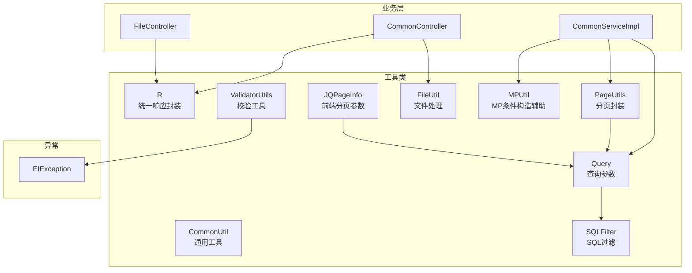
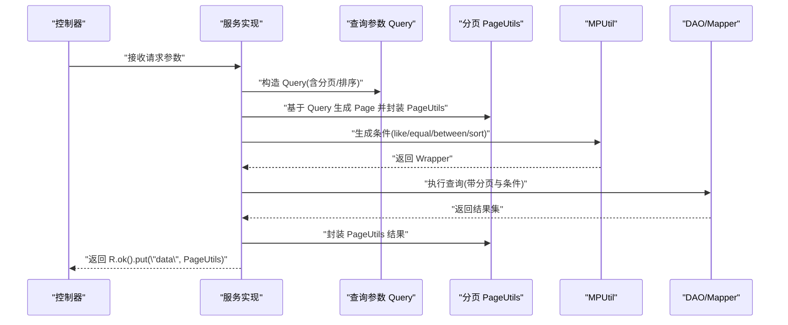
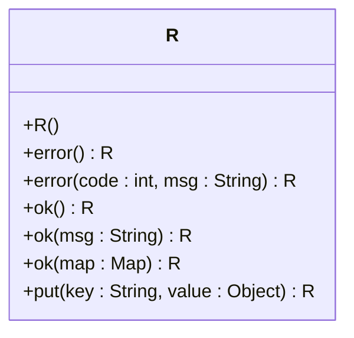
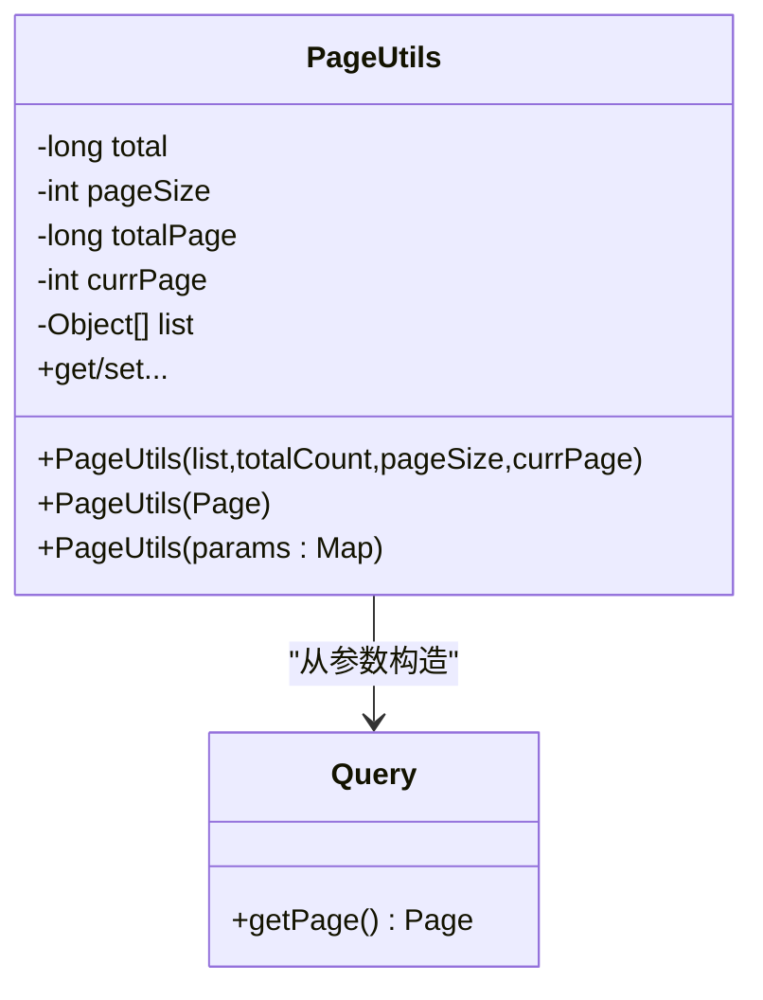
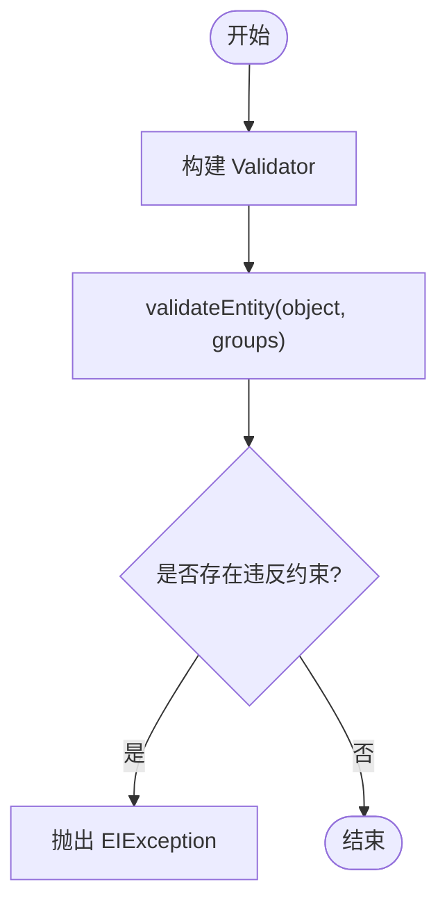
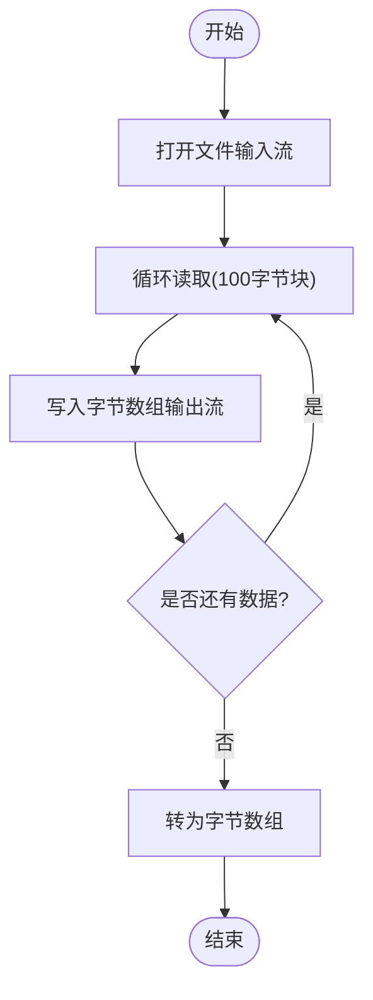
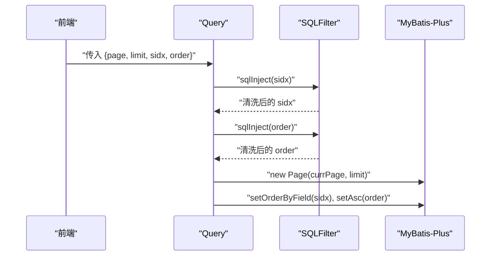
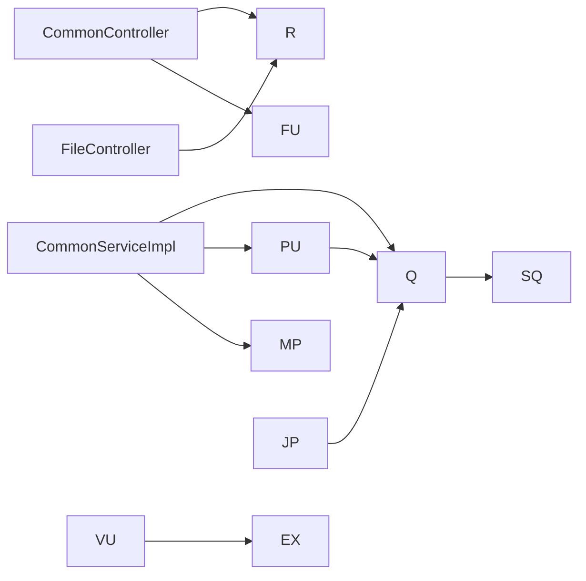

# 工具类库

<cite>
**本文引用的文件**
- [R.java](file://src/main/java/com/utils/R.java)
- [PageUtils.java](file://src/main/java/com/utils/PageUtils.java)
- [ValidatorUtils.java](file://src/main/java/com/utils/ValidatorUtils.java)
- [FileUtil.java](file://src/main/java/com/utils/FileUtil.java)
- [CommonUtil.java](file://src/main/java/com/utils/CommonUtil.java)
- [JQPageInfo.java](file://src/main/java/com/utils/JQPageInfo.java)
- [Query.java](file://src/main/java/com/utils/Query.java)
- [SQLFilter.java](file://src/main/java/com/utils/SQLFilter.java)
- [MPUtil.java](file://src/main/java/com/utils/MPUtil.java)
- [EIException.java](file://src/main/java/com/entity/EIException.java)
- [CommonController.java](file://src/main/java/com/controller/CommonController.java)
- [FileController.java](file://src/main/java/com/controller/FileController.java)
- [CommonServiceImpl.java](file://src/main/java/com/service/impl/CommonServiceImpl.java)
</cite>

## 目录
1. [引言](#引言)
2. [项目结构](#项目结构)
3. [核心组件](#核心组件)
4. [架构总览](#架构总览)
5. [详细组件分析](#详细组件分析)
6. [依赖关系分析](#依赖关系分析)
7. [性能考量](#性能考量)
8. [故障排查指南](#故障排查指南)
9. [结论](#结论)
10. [附录：使用示例与集成指南](#附录使用示例与集成指南)

## 引言
本文件系统性梳理自习室管理系统中的工具类库，重点覆盖统一响应封装类 R、分页工具 PageUtils、校验工具 ValidatorUtils、文件处理工具 FileUtil、通用工具 CommonUtil，以及与之配套的查询参数 Query、SQL 过滤器 SQLFilter、MyBatis-Plus 辅助 MPUtil、以及前端分页信息 JQPageInfo。文档从设计思想、实现原理、使用方式、扩展点到性能与安全进行全链路剖析，并给出与控制器、服务层的集成示例与最佳实践。

## 项目结构
工具类集中位于 com.utils 包，围绕“统一返回”“分页”“校验”“文件处理”“通用辅助”五大主题构建，配合实体异常 EIException、查询参数 Query、SQL 安全校验、MP 条件构造辅助等形成完整的后端支撑体系。

图表来源
- [R.java:1-52](file://src/main/java/com/utils/R.java#L1-L52)
- [PageUtils.java:1-102](file://src/main/java/com/utils/PageUtils.java#L1-L102)
- [ValidatorUtils.java:1-40](file://src/main/java/com/utils/ValidatorUtils.java#L1-L40)
- [FileUtil.java:1-28](file://src/main/java/com/utils/FileUtil.java#L1-L28)
- [CommonUtil.java:1-23](file://src/main/java/com/utils/CommonUtil.java#L1-L23)
- [Query.java:1-99](file://src/main/java/com/utils/Query.java#L1-L99)
- [SQLFilter.java:1-43](file://src/main/java/com/utils/SQLFilter.java#L1-L43)
- [MPUtil.java:1-185](file://src/main/java/com/utils/MPUtil.java#L1-L185)
- [JQPageInfo.java:1-55](file://src/main/java/com/utils/JQPageInfo.java#L1-L55)
- [CommonController.java:1-249](file://src/main/java/com/controller/CommonController.java#L1-L249)
- [FileController.java:1-111](file://src/main/java/com/controller/FileController.java#L1-L111)
- [CommonServiceImpl.java:1-60](file://src/main/java/com/service/impl/CommonServiceImpl.java#L1-L60)
- [EIException.java:1-53](file://src/main/java/com/entity/EIException.java#L1-L53)

章节来源
- [R.java:1-52](file://src/main/java/com/utils/R.java#L1-L52)
- [PageUtils.java:1-102](file://src/main/java/com/utils/PageUtils.java#L1-L102)
- [ValidatorUtils.java:1-40](file://src/main/java/com/utils/ValidatorUtils.java#L1-L40)
- [FileUtil.java:1-28](file://src/main/java/com/utils/FileUtil.java#L1-L28)
- [CommonUtil.java:1-23](file://src/main/java/com/utils/CommonUtil.java#L1-L23)
- [Query.java:1-99](file://src/main/java/com/utils/Query.java#L1-L99)
- [SQLFilter.java:1-43](file://src/main/java/com/utils/SQLFilter.java#L1-L43)
- [MPUtil.java:1-185](file://src/main/java/com/utils/MPUtil.java#L1-L185)
- [JQPageInfo.java:1-55](file://src/main/java/com/utils/JQPageInfo.java#L1-L55)
- [CommonController.java:1-249](file://src/main/java/com/controller/CommonController.java#L1-L249)
- [FileController.java:1-111](file://src/main/java/com/controller/FileController.java#L1-L111)
- [CommonServiceImpl.java:1-60](file://src/main/java/com/service/impl/CommonServiceImpl.java#L1-L60)
- [EIException.java:1-53](file://src/main/java/com/entity/EIException.java#L1-L53)

## 核心组件
- 统一响应封装 R：以键值对形式承载 code、msg、data 等字段，提供静态工厂方法快速构造成功/错误响应，便于前后端约定一致的返回结构。
- 分页工具 PageUtils：封装 MyBatis-Plus Page 的结果集与分页元信息，支持从列表、Page 对象、查询参数生成分页包装对象。
- 校验工具 ValidatorUtils：基于 Hibernate Validator 的静态校验入口，失败抛出自定义异常 EIException，便于在控制器层集中处理。
- 文件处理工具 FileUtil：提供文件转字节流能力，用于图片识别等场景的数据准备。
- 通用工具 CommonUtil：提供随机字符串生成等常用辅助方法。
- 查询参数 Query 与 SQLFilter：解析前端传入的分页与排序参数，同时进行 SQL 注入防护。
- MPUtil：提供驼峰到下划线字段映射、like/equal 组合条件、区间 between、排序等便捷方法，简化 MyBatis-Plus 条件构造。
- 前端分页参数 JQPageInfo：承载 page、limit、sidx、order、offset 等字段，作为 Query 的输入来源之一。

章节来源
- [R.java:6-51](file://src/main/java/com/utils/R.java#L6-L51)
- [PageUtils.java:10-101](file://src/main/java/com/utils/PageUtils.java#L10-L101)
- [ValidatorUtils.java:13-39](file://src/main/java/com/utils/ValidatorUtils.java#L13-L39)
- [FileUtil.java:9-27](file://src/main/java/com/utils/FileUtil.java#L9-L27)
- [CommonUtil.java:5-22](file://src/main/java/com/utils/CommonUtil.java#L5-L22)
- [Query.java:11-98](file://src/main/java/com/utils/Query.java#L11-L98)
- [SQLFilter.java:8-42](file://src/main/java/com/utils/SQLFilter.java#L8-L42)
- [MPUtil.java:14-184](file://src/main/java/com/utils/MPUtil.java#L14-L184)
- [JQPageInfo.java:3-54](file://src/main/java/com/utils/JQPageInfo.java#L3-L54)

## 架构总览
工具类在系统中承担“横切关注”的角色，贯穿控制器层的统一返回、服务层的分页与查询、DAO 层的条件构造，以及异常与安全控制。其设计遵循“低耦合、高内聚、可复用”的原则，既保证了代码一致性，也提升了可维护性与安全性。

图表来源
- [CommonController.java:113-144](file://src/main/java/com/controller/CommonController.java#L113-L144)
- [CommonServiceImpl.java:24-57](file://src/main/java/com/service/impl/CommonServiceImpl.java#L24-L57)
- [Query.java:29-84](file://src/main/java/com/utils/Query.java#L29-L84)
- [PageUtils.java:44-50](file://src/main/java/com/utils/PageUtils.java#L44-L50)
- [MPUtil.java:33-134](file://src/main/java/com/utils/MPUtil.java#L33-L134)

## 详细组件分析

### 统一响应封装类 R
- 设计理念
  - 以 HashMap 扩展，内置 code 默认值；提供 error()/ok() 多态工厂方法，统一返回结构，便于前端统一处理。
  - 支持 put(key, value) 链式调用，灵活扩展返回字段。
- 使用场景
  - 控制器层直接返回 R.ok()/R.error()，减少样板代码。
  - 与服务层协作时，通过 put("data", ...) 传递分页或业务数据。
- 最佳实践
  - 固定 code/msg 字段命名，避免随意变更。
  - 在全局异常处理器中统一拦截并转换为 R，保持一致性。

图表来源
- [R.java:6-51](file://src/main/java/com/utils/R.java#L6-L51)

章节来源
- [R.java:6-51](file://src/main/java/com/utils/R.java#L6-L51)
- [CommonController.java:52-62](file://src/main/java/com/controller/CommonController.java#L52-L62)
- [CommonController.java:113-144](file://src/main/java/com/controller/CommonController.java#L113-L144)

### 分页工具 PageUtils
- 实现原理
  - 接收列表数据、总数、每页大小、当前页，计算总页数；亦可直接由 MyBatis-Plus Page 构造。
  - 提供 getter/setter，便于序列化与前端渲染。
- 配置选项
  - total、pageSize、totalPage、currPage、list 字段对应分页核心元信息。
  - 支持从 Map 参数构造空分页（结合 Query）。
- 使用建议
  - 与 Query 和 MPUtil 协作，先解析分页/排序，再生成 PageUtils，最后返回给控制器。

图表来源
- [PageUtils.java:10-101](file://src/main/java/com/utils/PageUtils.java#L10-L101)
- [Query.java:87-89](file://src/main/java/com/utils/Query.java#L87-L89)

章节来源
- [PageUtils.java:10-101](file://src/main/java/com/utils/PageUtils.java#L10-L101)
- [Query.java:55-84](file://src/main/java/com/utils/Query.java#L55-L84)

### 校验工具 ValidatorUtils
- 验证规则
  - 基于 Hibernate Validator，对传入对象执行校验，若存在违反约束，抛出 EIException。
  - 支持指定校验组，便于按场景切换规则。
- 自定义扩展
  - 可在实体上添加 JSR-303 注解（如非空、长度、正则等），ValidatorUtils.validateEntity 即可自动生效。
  - 若需多组校验，传入不同 Class<?> 组即可。
- 错误处理
  - 建议在控制器层捕获 EIException，统一通过 R.error(...) 返回。

图表来源
- [ValidatorUtils.java:19-36](file://src/main/java/com/utils/ValidatorUtils.java#L19-L36)
- [EIException.java:7-52](file://src/main/java/com/entity/EIException.java#L7-L52)

章节来源
- [ValidatorUtils.java:13-39](file://src/main/java/com/utils/ValidatorUtils.java#L13-L39)
- [EIException.java:7-52](file://src/main/java/com/entity/EIException.java#L7-L52)

### 文件处理工具 FileUtil
- 操作方法
  - 提供 FileToByte(File) 将文件读取为字节数组，便于后续编码或网络传输。
- 安全考虑
  - 仅做基础 IO 转换，不包含路径校验与类型限制，应在上层控制器中完成文件合法性检查（如白名单、大小限制、类型校验）。
  - 注意大文件内存占用，必要时采用流式处理或临时文件策略。

图表来源
- [FileUtil.java:14-26](file://src/main/java/com/utils/FileUtil.java#L14-L26)

章节来源
- [FileUtil.java:9-27](file://src/main/java/com/utils/FileUtil.java#L9-L27)
- [CommonController.java:87-90](file://src/main/java/com/controller/CommonController.java#L87-L90)

### 通用工具 CommonUtil
- 功能概述
  - 提供随机字符串生成，适用于验证码、令牌等场景。
- 最佳实践
  - 指定合适长度，兼顾安全性与可用性。
  - 如需更高安全性，建议使用 SecureRandom 或专用加密库。

章节来源
- [CommonUtil.java:5-22](file://src/main/java/com/utils/CommonUtil.java#L5-L22)

### 查询参数与 SQL 安全
- Query
  - 解析 page/limit/sidx/order 等参数，构造 MyBatis-Plus Page，并设置排序字段与方向。
  - 对 sidx/order 进行 SQLFilter.sqlInject 防护，避免拼接 SQL 导致注入。
- SQLFilter
  - 移除危险字符，转为小写，匹配关键字黑名单，命中即抛出 EIException。

图表来源
- [Query.java:29-84](file://src/main/java/com/utils/Query.java#L29-L84)
- [SQLFilter.java:17-41](file://src/main/java/com/utils/SQLFilter.java#L17-L41)

章节来源
- [Query.java:11-98](file://src/main/java/com/utils/Query.java#L11-L98)
- [SQLFilter.java:8-42](file://src/main/java/com/utils/SQLFilter.java#L8-L42)

### MPUtil：MyBatis-Plus 条件构造辅助
- 功能要点
  - 驼峰到下划线字段名映射，支持带前缀的列名拼接。
  - 提供 allLike/allEq/likeOrEq/genLike/genEq/between/sort 等组合方法，简化复杂查询条件的构造。
- 使用建议
  - 优先使用 MPUtil 生成条件，避免手写字符串拼接，降低 SQL 注入风险。
  - 与 Query 的排序参数配合，提升查询灵活性。

章节来源
- [MPUtil.java:14-184](file://src/main/java/com/utils/MPUtil.java#L14-L184)
- [Query.java:79-83](file://src/main/java/com/utils/Query.java#L79-L83)

### 前端分页参数 JQPageInfo
- 字段说明
  - page、limit、sidx、order、offset，用于适配前端表格组件的分页与排序需求。
- 与 Query 的关系
  - Query 构造函数支持 JQPageInfo 输入，自动解析并设置分页与排序。

章节来源
- [JQPageInfo.java:3-54](file://src/main/java/com/utils/JQPageInfo.java#L3-L54)
- [Query.java:29-52](file://src/main/java/com/utils/Query.java#L29-L52)

## 依赖关系分析
- 控制器层依赖 R、FileUtil 等工具进行响应与文件处理。
- 服务层依赖 Query、PageUtils、MPUtil 进行分页与条件构造。
- 异常层统一通过 EIException 抛出，便于上层捕获并转换为 R。
- SQLFilter 与 Query 协作，确保排序字段的安全性。

图表来源
- [CommonController.java:34-35](file://src/main/java/com/controller/CommonController.java#L34-L35)
- [FileController.java:34](file://src/main/java/com/controller/FileController.java#L34)
- [CommonServiceImpl.java:11-22](file://src/main/java/com/service/impl/CommonServiceImpl.java#L11-L22)
- [Query.java:87-89](file://src/main/java/com/utils/Query.java#L87-L89)
- [PageUtils.java:44-50](file://src/main/java/com/utils/PageUtils.java#L44-L50)
- [MPUtil.java:33-134](file://src/main/java/com/utils/MPUtil.java#L33-L134)
- [SQLFilter.java:17-41](file://src/main/java/com/utils/SQLFilter.java#L17-L41)
- [ValidatorUtils.java:29-36](file://src/main/java/com/utils/ValidatorUtils.java#L29-L36)
- [JQPageInfo.java:14-52](file://src/main/java/com/utils/JQPageInfo.java#L14-L52)

章节来源
- [CommonController.java:1-249](file://src/main/java/com/controller/CommonController.java#L1-L249)
- [FileController.java:1-111](file://src/main/java/com/controller/FileController.java#L1-L111)
- [CommonServiceImpl.java:1-60](file://src/main/java/com/service/impl/CommonServiceImpl.java#L1-L60)
- [Query.java:1-99](file://src/main/java/com/utils/Query.java#L1-L99)
- [PageUtils.java:1-102](file://src/main/java/com/utils/PageUtils.java#L1-L102)
- [MPUtil.java:1-185](file://src/main/java/com/utils/MPUtil.java#L1-L185)
- [SQLFilter.java:1-43](file://src/main/java/com/utils/SQLFilter.java#L1-L43)
- [ValidatorUtils.java:1-40](file://src/main/java/com/utils/ValidatorUtils.java#L1-L40)
- [JQPageInfo.java:1-55](file://src/main/java/com/utils/JQPageInfo.java#L1-L55)

## 性能考量
- 分页与排序
  - Query 对排序字段进行清洗与安全校验，避免全表扫描与索引失效导致的性能问题。
  - 建议在高频查询列建立索引，并合理设置 limit，避免一次性拉取大量数据。
- 文件处理
  - FileUtil 将文件读入内存，大文件可能导致 OOM；建议在上层限制文件大小或采用流式处理。
- 校验开销
  - ValidatorUtils 基于注解的校验在对象较大时有一定开销，可在业务关键路径上按需启用。
- 条件构造
  - MPUtil 的批量 like/eq 组合会生成复杂 WHERE 子句，应避免过多动态条件叠加，必要时拆分查询或引入缓存。

## 故障排查指南
- 统一响应未生效
  - 检查控制器是否返回 R.ok()/R.error()，确认未被其他返回值覆盖。
- 分页数据为空但 total 不为 0
  - 核查 Query 的 page/limit 是否正确，以及 MPUtil 条件是否过于严格导致无匹配。
- 校验异常频繁
  - 查看实体注解配置与 ValidatorUtils.validateEntity 的调用位置，确认是否遗漏必填项或格式不符。
- 文件上传/下载失败
  - 确认上传目录权限与路径，检查 FileUtil 使用前的文件存在性与类型校验。
- SQL 注入告警
  - 确保排序字段经 SQLFilter 清洗，且未绕过 Query 的参数解析逻辑。

章节来源
- [R.java:16-45](file://src/main/java/com/utils/R.java#L16-L45)
- [Query.java:39-51](file://src/main/java/com/utils/Query.java#L39-L51)
- [SQLFilter.java:17-41](file://src/main/java/com/utils/SQLFilter.java#L17-L41)
- [FileController.java:48-77](file://src/main/java/com/controller/FileController.java#L48-L77)
- [CommonController.java:87-104](file://src/main/java/com/controller/CommonController.java#L87-L104)

## 结论
工具类库以“统一响应、安全分页、强校验、稳健文件处理、通用辅助”为核心，有效降低了重复代码、提升了开发效率与系统安全性。通过 Query+SQLFilter+MPUtil 的组合，实现了从参数解析到条件构造的闭环；配合 R 的统一返回，使前后端交互更加一致可靠。建议在新功能开发中优先复用现有工具类，并根据业务场景补充必要的扩展与校验规则。

## 附录：使用示例与集成指南
- 统一响应 R
  - 控制器返回：R.ok().put("data", PageUtils) 或 R.error("消息")
  - 参考路径：[CommonController.java:52-62](file://src/main/java/com/controller/CommonController.java#L52-L62)
- 分页 PageUtils
  - 服务层：Query 构造 Page，再用 PageUtils 封装；控制器返回 R.ok().put("data", PageUtils)
  - 参考路径：[CommonServiceImpl.java:24-57](file://src/main/java/com/service/impl/CommonServiceImpl.java#L24-L57)，[PageUtils.java:44-50](file://src/main/java/com/utils/PageUtils.java#L44-L50)
- 校验 ValidatorUtils
  - 控制器/服务层调用 validateEntity，捕获 EIException 后统一返回 R.error
  - 参考路径：[ValidatorUtils.java:29-36](file://src/main/java/com/utils/ValidatorUtils.java#L29-L36)，[EIException.java:13-33](file://src/main/java/com/entity/EIException.java#L13-L33)
- 文件处理 FileUtil
  - 上传后读取字节流，再进行识别或其他处理
  - 参考路径：[CommonController.java:87-90](file://src/main/java/com/controller/CommonController.java#L87-L90)，[FileUtil.java:14-26](file://src/main/java/com/utils/FileUtil.java#L14-L26)
- 通用工具 CommonUtil
  - 生成随机字符串用于验证码/令牌等
  - 参考路径：[CommonUtil.java:12-21](file://src/main/java/com/utils/CommonUtil.java#L12-L21)
- 查询与安全
  - Query 解析分页/排序并进行 SQL 过滤，MPUtil 生成条件
  - 参考路径：[Query.java:29-84](file://src/main/java/com/utils/Query.java#L29-L84)，[SQLFilter.java:17-41](file://src/main/java/com/utils/SQLFilter.java#L17-L41)，[MPUtil.java:102-134](file://src/main/java/com/utils/MPUtil.java#L102-L134)