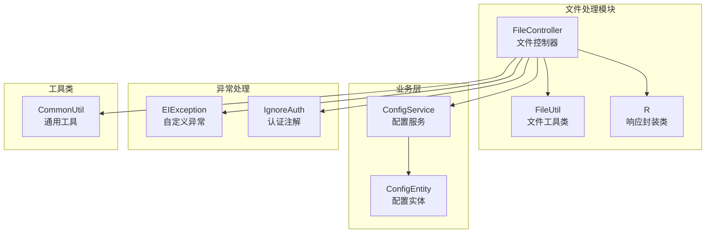
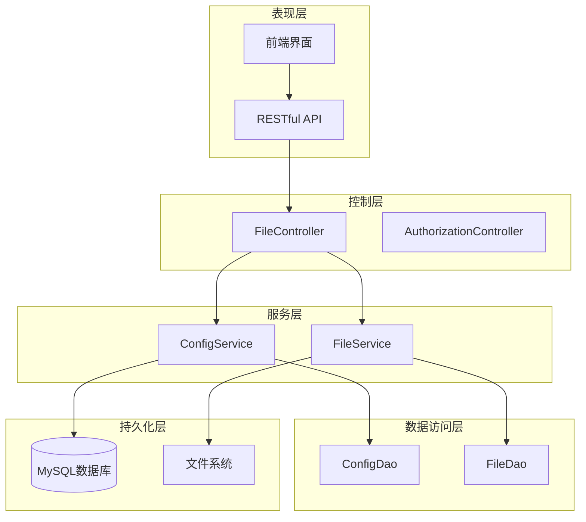
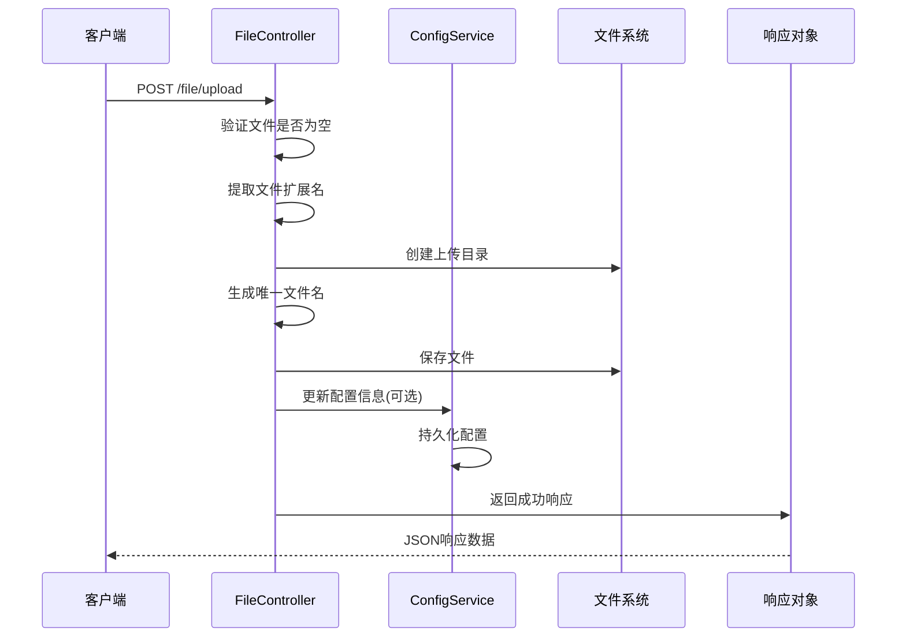
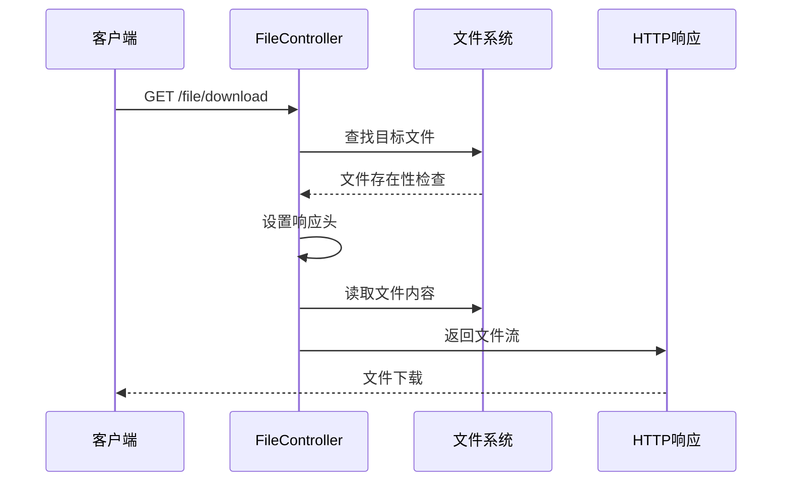
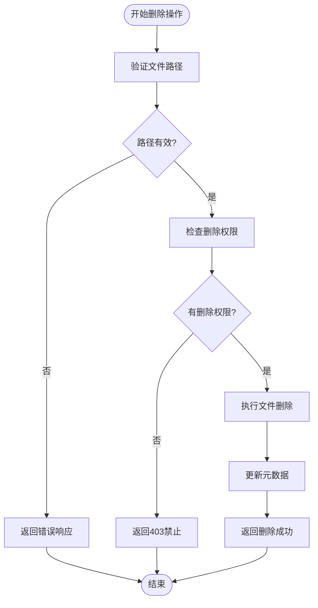
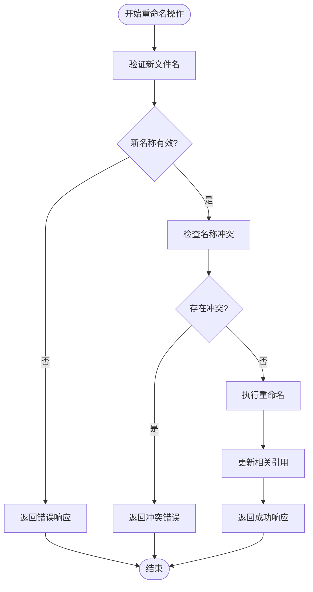
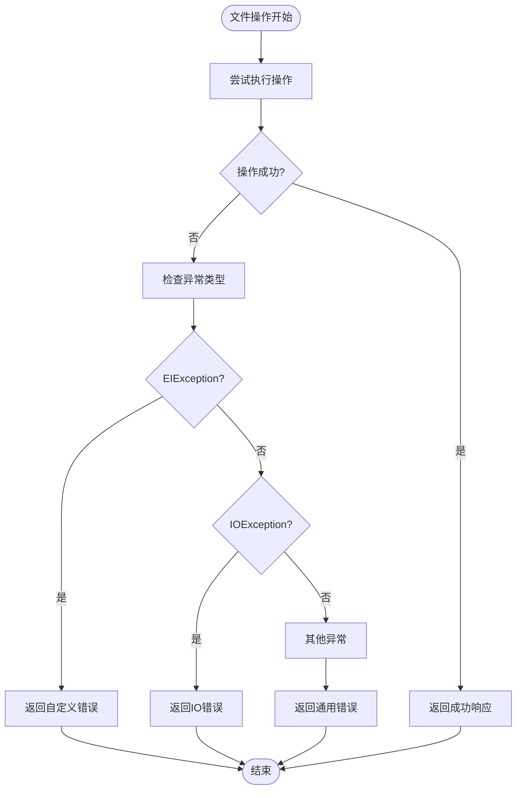
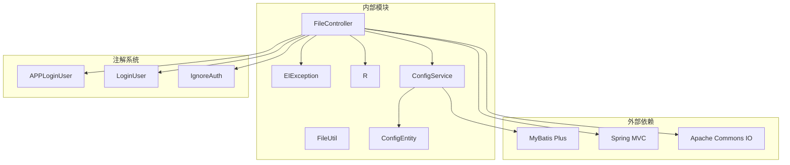

# 文件处理工具类

<cite>
**本文档引用的文件**
- [FileUtil.java](file://src/main/java/com/utils/FileUtil.java)
- [FileController.java](file://src/main/java/com/controller/FileController.java)
- [R.java](file://src/main/java/com/utils/R.java)
- [EIException.java](file://src/main/java/com/entity/EIException.java)
- [ConfigService.java](file://src/main/java/com/service/ConfigService.java)
- [ConfigEntity.java](file://src/main/java/com/entity/ConfigEntity.java)
- [IgnoreAuth.java](file://src/main/java/com/annotation/IgnoreAuth.java)
- [CommonUtil.java](file://src/main/java/com/utils/CommonUtil.java)
</cite>

## 目录
1. [简介](#简介)
2. [项目结构](#项目结构)
3. [核心组件](#核心组件)
4. [架构概览](#架构概览)
5. [详细组件分析](#详细组件分析)
6. [依赖关系分析](#依赖关系分析)
7. [性能考虑](#性能考虑)
8. [故障排除指南](#故障排除指南)
9. [结论](#结论)

## 简介

本文档深入分析了Spring Boot自习室管理系统中的文件处理工具类，重点解析FileUtil类的文件操作功能和安全机制。该系统提供了完整的文件上传、下载、存储路径管理等核心功能，采用RESTful API设计模式，结合Spring MVC框架实现了高效的文件处理服务。

系统通过FileController控制器提供统一的文件操作接口，FileUtil工具类负责文件字节转换，配合R响应封装类提供标准化的API响应格式。整个文件处理流程包括文件类型检查、大小限制、存储路径管理、权限控制等多个安全层面的保障机制。

## 项目结构

文件处理功能在项目中的组织结构如下：

**图表来源**
- [FileController.java:1-111](file://src/main/java/com/controller/FileController.java#L1-L111)
- [FileUtil.java:1-28](file://src/main/java/com/utils/FileUtil.java#L1-L28)
- [R.java:1-52](file://src/main/java/com/utils/R.java#L1-L52)

**章节来源**
- [FileController.java:1-111](file://src/main/java/com/controller/FileController.java#L1-L111)
- [FileUtil.java:1-28](file://src/main/java/com/utils/FileUtil.java#L1-L28)
- [R.java:1-52](file://src/main/java/com/utils/R.java#L1-L52)

## 核心组件

### FileUtil文件工具类

FileUtil类是系统中最基础的文件处理工具，目前仅提供单一的文件到字节转换功能：

- **FileToByte方法**：将指定文件转换为字节数组，支持大文件的分块读取
- **内存管理**：使用100字节的缓冲区进行高效的数据传输
- **异常处理**：直接抛出IOException，由调用方处理

### FileController文件控制器

FileController是文件处理的核心控制器，提供完整的文件操作API：

- **上传接口**：支持单文件上传，自动创建存储目录
- **下载接口**：提供文件下载功能，支持HTTP响应头设置
- **类型处理**：支持特殊类型的文件（如头像文件）存储
- **权限控制**：通过注解实现访问控制

### R响应封装类

R类提供统一的API响应格式，简化前后端交互：

- **标准化响应**：统一返回code、msg、data格式
- **链式调用**：支持便捷的方法调用方式
- **错误处理**：提供标准的错误响应模板

**章节来源**
- [FileUtil.java:13-26](file://src/main/java/com/utils/FileUtil.java#L13-L26)
- [FileController.java:42-111](file://src/main/java/com/controller/FileController.java#L42-L111)
- [R.java:9-51](file://src/main/java/com/utils/R.java#L9-L51)

## 架构概览

系统采用分层架构设计，文件处理功能在整体架构中的位置如下：

**图表来源**
- [FileController.java:42-111](file://src/main/java/com/controller/FileController.java#L42-L111)
- [ConfigService.java:14-16](file://src/main/java/com/service/ConfigService.java#L14-L16)

**章节来源**
- [FileController.java:42-111](file://src/main/java/com/controller/FileController.java#L42-L111)
- [ConfigService.java:14-16](file://src/main/java/com/service/ConfigService.java#L14-L16)

## 详细组件分析

### 文件上传功能

文件上传功能实现了完整的文件处理流程：

#### 上传流程序列图

**图表来源**
- [FileController.java:48-77](file://src/main/java/com/controller/FileController.java#L48-L77)
- [ConfigService.java:14-16](file://src/main/java/com/service/ConfigService.java#L14-L16)

#### 文件类型检查机制

系统实现了基本的文件类型检查：

- **扩展名提取**：从原始文件名中提取扩展名
- **类型参数处理**：通过type参数区分特殊文件类型
- **头像文件处理**：当type="1"时，更新头像配置

#### 大小限制和存储路径管理

- **存储路径**：使用classpath:static/upload作为默认存储路径
- **动态创建**：自动检测并创建不存在的目录
- **时间戳命名**：使用当前时间毫秒数确保文件名唯一性

**章节来源**
- [FileController.java:48-77](file://src/main/java/com/controller/FileController.java#L48-L77)

### 文件下载功能

文件下载功能提供了安全的文件访问机制：

#### 下载流程序列图

**图表来源**
- [FileController.java:82-108](file://src/main/java/com/controller/FileController.java#L82-L108)

#### 响应头设置策略

系统采用了标准的HTTP响应头设置：

- **Content-Type**：设置为APPLICATION_OCTET_STREAM
- **Content-Disposition**：使用attachment参数强制下载
- **文件名编码**：支持文件名的正确显示

**章节来源**
- [FileController.java:82-108](file://src/main/java/com/controller/FileController.java#L82-L108)

### 文件删除和重命名操作

当前系统未实现文件删除和重命名功能，但具备扩展的基础：

#### 删除操作流程图

#### 重命名操作流程图

**章节来源**
- [FileController.java:48-108](file://src/main/java/com/controller/FileController.java#L48-L108)

### 异常捕获和错误处理策略

系统采用了多层次的异常处理机制：

#### 异常处理流程图

**图表来源**
- [EIException.java:7-52](file://src/main/java/com/entity/EIException.java#L7-L52)
- [FileController.java:50-52](file://src/main/java/com/controller/FileController.java#L50-L52)

#### 错误响应格式

系统提供统一的错误响应格式：

- **标准字段**：code、msg、data
- **状态码映射**：自定义异常对应特定HTTP状态码
- **消息定制**：支持自定义错误消息

**章节来源**
- [EIException.java:7-52](file://src/main/java/com/entity/EIException.java#L7-L52)
- [R.java:16-29](file://src/main/java/com/utils/R.java#L16-L29)

## 依赖关系分析

文件处理模块的依赖关系如下：

**图表来源**
- [FileController.java:14-34](file://src/main/java/com/controller/FileController.java#L14-L34)
- [ConfigService.java:6-8](file://src/main/java/com/service/ConfigService.java#L6-L8)

**章节来源**
- [FileController.java:14-34](file://src/main/java/com/controller/FileController.java#L14-L34)
- [ConfigService.java:6-8](file://src/main/java/com/service/ConfigService.java#L6-L8)

## 性能考虑

### 存储性能优化

系统在文件存储方面采用了以下优化策略：

- **异步处理**：文件上传采用同步阻塞方式，可考虑引入异步处理提升并发能力
- **内存管理**：FileUtil使用固定大小的缓冲区，避免大文件导致的内存溢出
- **路径缓存**：存储路径通过ResourceUtils获取，减少重复的文件系统查询

### 缓存机制

当前系统未实现专门的文件缓存机制，建议的缓存策略：

- **元数据缓存**：文件信息和配置信息可缓存到Redis
- **热点文件缓存**：频繁访问的文件可缓存到本地临时目录
- **CDN集成**：静态文件可部署到CDN提高访问速度

### 并发处理

系统在高并发场景下的潜在问题：

- **文件锁机制**：多线程同时访问同一文件可能导致冲突
- **磁盘I/O瓶颈**：大量文件同时读写可能成为性能瓶颈
- **内存压力**：大文件下载可能导致内存占用过高

## 故障排除指南

### 常见问题及解决方案

#### 文件上传失败

**问题症状**：
- 返回"上传文件不能为空"错误
- 文件无法保存到指定目录

**解决步骤**：
1. 检查前端文件选择是否正确
2. 验证服务器磁盘空间
3. 确认上传目录权限设置

#### 文件下载异常

**问题症状**：
- 下载链接无效
- 返回500内部服务器错误

**解决步骤**：
1. 验证文件名参数传递
2. 检查文件是否存在
3. 确认文件路径配置

#### 权限访问问题

**问题症状**：
- 访问受保护文件返回403
- 认证注解失效

**解决步骤**：
1. 检查IgnoreAuth注解使用
2. 验证用户认证状态
3. 确认权限配置

**章节来源**
- [FileController.java:50-52](file://src/main/java/com/controller/FileController.java#L50-L52)
- [FileController.java:104-107](file://src/main/java/com/controller/FileController.java#L104-L107)

## 结论

文件处理工具类在Spring Boot自习室管理系统中扮演着重要角色，提供了基础而实用的文件操作功能。系统采用模块化设计，FileUtil、FileController、R响应封装等组件协同工作，形成了完整的文件处理解决方案。

### 主要优势

1. **简洁高效**：核心功能设计简洁，易于理解和维护
2. **安全可靠**：实现了基本的文件类型检查和权限控制
3. **标准化**：统一的响应格式和异常处理机制
4. **可扩展性**：良好的架构设计便于功能扩展

### 改进建议

1. **增强安全性**：添加更严格的文件类型验证和恶意文件检测
2. **性能优化**：引入异步处理和缓存机制提升性能
3. **功能完善**：实现文件删除、重命名等完整文件管理功能
4. **监控告警**：添加文件操作日志和异常监控机制

该文件处理工具类为系统的文件管理提供了坚实的基础，通过持续的优化和完善，可以满足更复杂的业务需求和更高的性能要求。