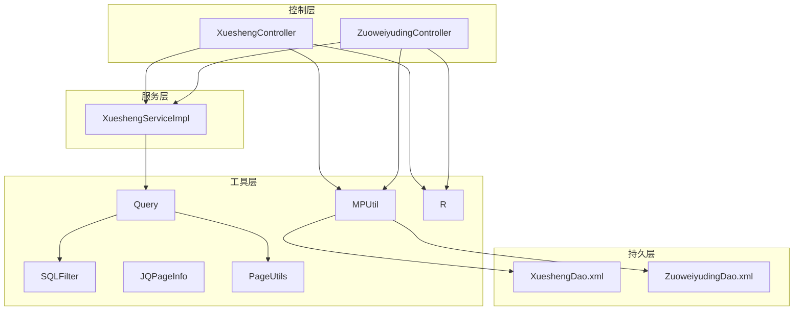
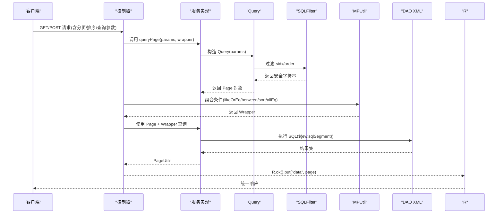
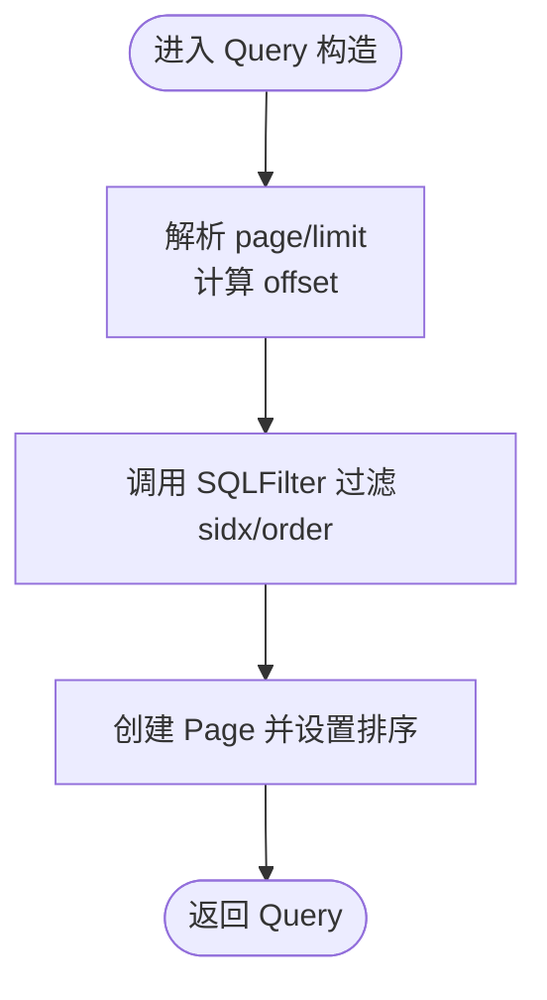
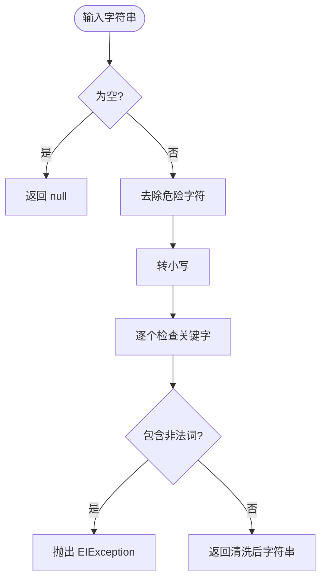
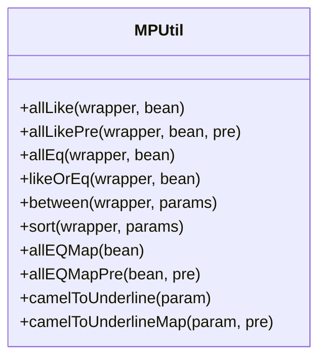
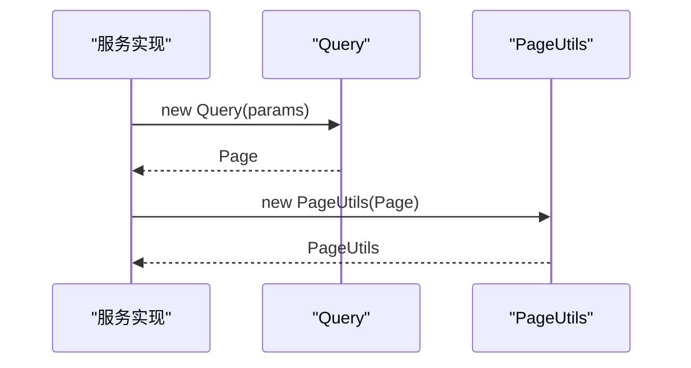
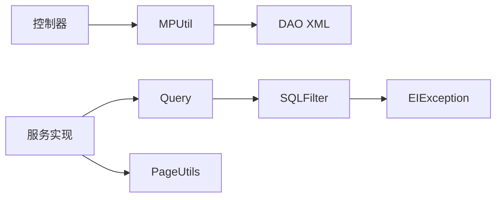

# 查询过滤工具

<cite>
**本文引用的文件**
- [Query.java](file://src/main/java/com/utils/Query.java)
- [SQLFilter.java](file://src/main/java/com/utils/SQLFilter.java)
- [MPUtil.java](file://src/main/java/com/utils/MPUtil.java)
- [JQPageInfo.java](file://src/main/java/com/utils/JQPageInfo.java)
- [PageUtils.java](file://src/main/java/com/utils/PageUtils.java)
- [R.java](file://src/main/java/com/utils/R.java)
- [EIException.java](file://src/main/java/com/entity/EIException.java)
- [XueshengController.java](file://src/main/java/com/controller/XueshengController.java)
- [ZuoweiyudingController.java](file://src/main/java/com/controller/ZuoweiyudingController.java)
- [XueshengServiceImpl.java](file://src/main/java/com/service/impl/XueshengServiceImpl.java)
- [XueshengDao.xml](file://src/main/resources/mapper/XueshengDao.xml)
- [ZuoweiyudingDao.xml](file://src/main/resources/mapper/ZuoweiyudingDao.xml)
</cite>

## 目录
1. [简介](#简介)
2. [项目结构](#项目结构)
3. [核心组件](#核心组件)
4. [架构总览](#架构总览)
5. [组件详解](#组件详解)
6. [依赖关系分析](#依赖关系分析)
7. [性能考量](#性能考量)
8. [故障排查指南](#故障排查指南)
9. [结论](#结论)
10. [附录](#附录)

## 简介
本文件围绕查询过滤工具链展开，系统性解析以下关键能力：
- Query 类对查询参数的封装与分页、排序处理机制
- SQLFilter 类的 SQL 注入防护与安全过滤策略
- 动态查询条件的构建方式与参数绑定策略
- 查询结果的排序、分组与聚合处理方法
- 复杂查询场景的实现示例与性能优化技巧
- 查询安全的重要性及防护措施
- 查询工具类在不同业务场景中的应用案例

## 项目结构
查询过滤工具位于通用工具层，配合 MyBatis-Plus 的 Wrapper 构建器与 XML 映射文件，形成“请求参数 → 工具类 → 条件构造 → DAO 执行”的完整链路。

**图示来源**
- [XueshengController.java:125-141](file://src/main/java/com/controller/XueshengController.java#L125-L141)
- [ZuoweiyudingController.java:50-71](file://src/main/java/com/controller/ZuoweiyudingController.java#L50-L71)
- [XueshengServiceImpl.java:25-40](file://src/main/java/com/service/impl/XueshengServiceImpl.java#L25-L40)
- [Query.java:29-52](file://src/main/java/com/utils/Query.java#L29-L52)
- [SQLFilter.java:17-41](file://src/main/java/com/utils/SQLFilter.java#L17-L41)
- [MPUtil.java:46-134](file://src/main/java/com/utils/MPUtil.java#L46-L134)
- [XueshengDao.xml:17-39](file://src/main/resources/mapper/XueshengDao.xml#L17-L39)
- [ZuoweiyudingDao.xml:18-41](file://src/main/resources/mapper/ZuoweiyudingDao.xml#L18-L41)

**章节来源**
- [XueshengController.java:125-141](file://src/main/java/com/controller/XueshengController.java#L125-L141)
- [ZuoweiyudingController.java:50-71](file://src/main/java/com/controller/ZuoweiyudingController.java#L50-L71)
- [XueshengServiceImpl.java:25-40](file://src/main/java/com/service/impl/XueshengServiceImpl.java#L25-L40)
- [Query.java:14-52](file://src/main/java/com/utils/Query.java#L14-L52)
- [MPUtil.java:46-134](file://src/main/java/com/utils/MPUtil.java#L46-L134)
- [XueshengDao.xml:17-39](file://src/main/resources/mapper/XueshengDao.xml#L17-L39)
- [ZuoweiyudingDao.xml:18-41](file://src/main/resources/mapper/ZuoweiyudingDao.xml#L18-L41)

## 核心组件
- Query：封装分页与排序参数，结合 SQLFilter 进行安全过滤，并生成 MyBatis-Plus 的 Page 对象
- SQLFilter：对输入字符串执行移除危险字符、转小写、关键字检测等操作，发现非法字符时抛出自定义异常
- MPUtil：提供 allEq/allLike/likeOrEq/between/sort 等条件构建与驼峰到下划线字段名转换，支持链式组合
- JQPageInfo：前端分页与排序参数载体（page、limit、sidx、order）
- PageUtils：分页结果封装，兼容 Page 与空数据场景
- R：统一响应包装
- DAO XML：通过 ${ew.sqlSegment} 安全地拼接条件片段

**章节来源**
- [Query.java:14-98](file://src/main/java/com/utils/Query.java#L14-L98)
- [SQLFilter.java:11-42](file://src/main/java/com/utils/SQLFilter.java#L11-L42)
- [MPUtil.java:17-184](file://src/main/java/com/utils/MPUtil.java#L17-L184)
- [JQPageInfo.java:3-54](file://src/main/java/com/utils/JQPageInfo.java#L3-L54)
- [PageUtils.java:13-101](file://src/main/java/com/utils/PageUtils.java#L13-L101)
- [R.java:9-51](file://src/main/java/com/utils/R.java#L9-L51)
- [XueshengDao.xml:17-39](file://src/main/resources/mapper/XueshengDao.xml#L17-L39)
- [ZuoweiyudingDao.xml:18-41](file://src/main/resources/mapper/ZuoweiyudingDao.xml#L18-L41)

## 架构总览
查询过滤工具的整体调用链如下：

**图示来源**
- [XueshengController.java:125-141](file://src/main/java/com/controller/XueshengController.java#L125-L141)
- [XueshengServiceImpl.java:25-40](file://src/main/java/com/service/impl/XueshengServiceImpl.java#L25-L40)
- [Query.java:29-52](file://src/main/java/com/utils/Query.java#L29-L52)
- [SQLFilter.java:17-41](file://src/main/java/com/utils/SQLFilter.java#L17-L41)
- [MPUtil.java:46-134](file://src/main/java/com/utils/MPUtil.java#L46-L134)
- [XueshengDao.xml:17-39](file://src/main/resources/mapper/XueshengDao.xml#L17-L39)
- [R.java:37-45](file://src/main/java/com/utils/R.java#L37-L45)

## 组件详解

### Query 类：查询参数封装与处理
- 分页参数来源
  - 支持从 Map 或 JQPageInfo 构造
  - 解析 page、limit 并计算 offset
- 排序参数来源
  - 从 sidx、order 获取排序字段与方向
  - 通过 SQLFilter 对 sidx、order 进行安全过滤
- MyBatis-Plus 集成
  - 生成 Page 并设置排序字段与方向
- 关键点
  - sidx/order 用于动态排序，必须经 SQLFilter 过滤以避免拼接型 SQL 注入
  - Page 对象可直接传入 Service 层的 selectPage 或自定义分页查询

**图示来源**
- [Query.java:29-52](file://src/main/java/com/utils/Query.java#L29-L52)
- [SQLFilter.java:17-41](file://src/main/java/com/utils/SQLFilter.java#L17-L41)

**章节来源**
- [Query.java:29-52](file://src/main/java/com/utils/Query.java#L29-L52)
- [JQPageInfo.java:3-54](file://src/main/java/com/utils/JQPageInfo.java#L3-L54)

### SQLFilter 类：SQL 注入防护与安全过滤
- 过滤步骤
  - 去除单引号、双引号、分号、反斜杠等特殊字符
  - 转换为小写
  - 检测关键字：如 master、truncate、insert、select、delete、update、declare、alter、drop
- 异常处理
  - 发现非法字符时抛出 EIException，由上层统一捕获
- 适用范围
  - 主要用于排序字段与排序方向的安全校验，避免动态拼接 SQL 的注入风险

**图示来源**
- [SQLFilter.java:17-41](file://src/main/java/com/utils/SQLFilter.java#L17-L41)
- [EIException.java:7-52](file://src/main/java/com/entity/EIException.java#L7-L52)

**章节来源**
- [SQLFilter.java:17-41](file://src/main/java/com/utils/SQLFilter.java#L17-L41)
- [EIException.java:7-52](file://src/main/java/com/entity/EIException.java#L7-L52)

### MPUtil：动态查询条件构建与参数绑定策略
- 条件构建
  - allLike/allLikePre：将对象属性映射为模糊查询条件，支持带前缀的多表关联
  - allEq/allEQMap/allEQMapPre：将对象属性映射为等值条件
  - likeOrEq：若值包含通配符则模糊匹配，否则等值匹配
  - between：基于键名后缀 _start/_end 生成区间条件
  - sort：根据 sort/order 参数生成升/降序排序
- 字段命名转换
  - camelToUnderline/camelToUnderlineMap：驼峰字段名转下划线，适配数据库列名
- 参数绑定策略
  - 通过 MyBatis-Plus Wrapper 的 eq/like/ge/le/orderAsc/orderDesc 等方法进行参数化绑定
  - 最终由 DAO XML 中的 ${ew.sqlSegment} 安全拼接条件片段

**图示来源**
- [MPUtil.java:21-183](file://src/main/java/com/utils/MPUtil.java#L21-L183)

**章节来源**
- [MPUtil.java:21-183](file://src/main/java/com/utils/MPUtil.java#L21-L183)

### 分页与排序：Query 与 PageUtils 的协作
- Query 负责：
  - 解析分页参数并生成 Page
  - 安全过滤排序字段与方向
- PageUtils 负责：
  - 将 Page 封装为统一的分页响应结构
  - 提供空数据分页构造器（基于 Query）

**图示来源**
- [XueshengServiceImpl.java:25-40](file://src/main/java/com/service/impl/XueshengServiceImpl.java#L25-L40)
- [Query.java:87-98](file://src/main/java/com/utils/Query.java#L87-L98)
- [PageUtils.java:44-50](file://src/main/java/com/utils/PageUtils.java#L44-L50)

**章节来源**
- [XueshengServiceImpl.java:25-40](file://src/main/java/com/service/impl/XueshengServiceImpl.java#L25-L40)
- [PageUtils.java:44-58](file://src/main/java/com/utils/PageUtils.java#L44-L58)

### 查询结果的排序、分组与聚合
- 排序
  - 通过 MPUtil.sort 或 Query 内部排序设置实现
- 分组与聚合
  - 当前工具链未提供专门的 groupBy/aggregate 方法
  - 如需分组与聚合，可在 DAO XML 中编写原生 SQL，并通过 Wrapper 的 where 片段拼接条件

**章节来源**
- [MPUtil.java:121-134](file://src/main/java/com/utils/MPUtil.java#L121-L134)
- [XueshengDao.xml:17-39](file://src/main/resources/mapper/XueshengDao.xml#L17-L39)
- [ZuoweiyudingDao.xml:18-41](file://src/main/resources/mapper/ZuoweiyudingDao.xml#L18-L41)

### 复杂查询场景示例与实现路径
- 场景一：列表分页 + 模糊搜索 + 区间筛选 + 排序
  - 控制器：接收 params 与实体对象
  - 服务：使用 Query 构造分页与排序；使用 MPUtil.likeOrEq/between/sort 组合条件
  - DAO：通过 ${ew.sqlSegment} 拼接条件
  - 示例路径参考：
    - [XueshengController.java:125-141](file://src/main/java/com/controller/XueshengController.java#L125-L141)
    - [ZuoweiyudingController.java:50-71](file://src/main/java/com/controller/ZuoweiyudingController.java#L50-L71)
    - [XueshengServiceImpl.java:34-40](file://src/main/java/com/service/impl/XueshengServiceImpl.java#L34-L40)
    - [MPUtil.java:46-134](file://src/main/java/com/utils/MPUtil.java#L46-L134)
    - [XueshengDao.xml:17-39](file://src/main/resources/mapper/XueshengDao.xml#L17-L39)
- 场景二：等值精确匹配（allEq）+ 视图查询
  - 控制器：使用 allEQMapPre 构造条件
  - 服务：selectListView/selectView 返回视图结果
  - 示例路径参考：
    - [XueshengController.java:147-152](file://src/main/java/com/controller/XueshengController.java#L147-L152)
    - [XueshengDao.xml:29-39](file://src/main/resources/mapper/XueshengDao.xml#L29-L39)

**章节来源**
- [XueshengController.java:125-152](file://src/main/java/com/controller/XueshengController.java#L125-L152)
- [ZuoweiyudingController.java:50-81](file://src/main/java/com/controller/ZuoweiyudingController.java#L50-L81)
- [XueshengServiceImpl.java:34-60](file://src/main/java/com/service/impl/XueshengServiceImpl.java#L34-L60)
- [MPUtil.java:82-134](file://src/main/java/com/utils/MPUtil.java#L82-L134)
- [XueshengDao.xml:17-39](file://src/main/resources/mapper/XueshengDao.xml#L17-L39)

## 依赖关系分析
- Query 依赖 SQLFilter 进行排序参数安全过滤
- 控制器通过 MPUtil 组合条件，最终由 DAO XML 的 ${ew.sqlSegment} 拼接
- 服务层使用 Query/PageUtils 完成分页与结果封装
- 异常统一由 EIException 抛出，便于上层拦截

**图示来源**
- [Query.java:40-51](file://src/main/java/com/utils/Query.java#L40-L51)
- [SQLFilter.java:17-41](file://src/main/java/com/utils/SQLFilter.java#L17-L41)
- [MPUtil.java:46-134](file://src/main/java/com/utils/MPUtil.java#L46-L134)
- [XueshengDao.xml:17-39](file://src/main/resources/mapper/XueshengDao.xml#L17-L39)
- [PageUtils.java:44-50](file://src/main/java/com/utils/PageUtils.java#L44-L50)
- [EIException.java:7-52](file://src/main/java/com/entity/EIException.java#L7-L52)

**章节来源**
- [Query.java:40-51](file://src/main/java/com/utils/Query.java#L40-L51)
- [SQLFilter.java:17-41](file://src/main/java/com/utils/SQLFilter.java#L17-L41)
- [MPUtil.java:46-134](file://src/main/java/com/utils/MPUtil.java#L46-L134)
- [XueshengDao.xml:17-39](file://src/main/resources/mapper/XueshengDao.xml#L17-L39)
- [PageUtils.java:44-50](file://src/main/java/com/utils/PageUtils.java#L44-L50)
- [EIException.java:7-52](file://src/main/java/com/entity/EIException.java#L7-L52)

## 性能考量
- 参数化绑定优先：所有条件均通过 Wrapper 方法进行参数化，避免拼接 SQL，降低注入风险并提升缓存命中率
- 字段名转换开销：camelToUnderline/camelToUnderlineMap 为 O(n) 字符串处理，建议在批量构建时复用结果
- 排序字段白名单：建议在业务层对 sidx 进行白名单校验，进一步减少非法排序带来的扫描成本
- 分页限制：合理设置 limit 上限，防止超大分页导致数据库压力过大
- 条件组合顺序：先做 between 区间过滤，再做 like 模糊匹配，有助于索引利用

## 故障排查指南
- SQL 注入异常
  - 现象：抛出包含非法字符的异常
  - 排查：确认 sidx/order 是否被 SQLFilter 过滤；检查是否存在未过滤的用户输入
  - 参考：
    - [SQLFilter.java:34-38](file://src/main/java/com/utils/SQLFilter.java#L34-L38)
    - [EIException.java:7-52](file://src/main/java/com/entity/EIException.java#L7-L52)
- 排序无效或报错
  - 现象：排序字段不生效或出现语法错误
  - 排查：确认 sidx 是否为合法数据库列名；确保 SQLFilter 过滤后仍为有效标识符
  - 参考：
    - [Query.java:48-51](file://src/main/java/com/utils/Query.java#L48-L51)
- 模糊匹配不符合预期
  - 现象：likeOrEq 未按预期走模糊或等值
  - 排查：确认传入值是否包含通配符；检查 MPUtil 的逻辑分支
  - 参考：
    - [MPUtil.java:65-80](file://src/main/java/com/utils/MPUtil.java#L65-L80)
- 分页结果为空但 total 不为 0
  - 现象：页面显示总数与列表不符
  - 排查：确认 PageUtils 构造是否基于正确的 Page；检查 DAO XML 的 where 片段拼接
  - 参考：
    - [PageUtils.java:44-50](file://src/main/java/com/utils/PageUtils.java#L44-L50)
    - [XueshengDao.xml:17-39](file://src/main/resources/mapper/XueshengDao.xml#L17-L39)

**章节来源**
- [SQLFilter.java:34-38](file://src/main/java/com/utils/SQLFilter.java#L34-L38)
- [EIException.java:7-52](file://src/main/java/com/entity/EIException.java#L7-L52)
- [Query.java:48-51](file://src/main/java/com/utils/Query.java#L48-L51)
- [MPUtil.java:65-80](file://src/main/java/com/utils/MPUtil.java#L65-L80)
- [PageUtils.java:44-50](file://src/main/java/com/utils/PageUtils.java#L44-L50)
- [XueshengDao.xml:17-39](file://src/main/resources/mapper/XueshengDao.xml#L17-L39)

## 结论
该查询过滤工具链通过 Query + SQLFilter + MPUtil + DAO XML 的协同，实现了：
- 安全可控的分页与排序
- 动态灵活的条件构建与参数绑定
- 统一的响应封装与异常处理
在实际业务中，建议：
- 对排序字段进行白名单校验
- 合理设置分页上限
- 在 DAO 层严格使用 ${ew.sqlSegment} 拼接条件，避免手写 SQL 拼接
- 对复杂统计需求采用原生 SQL 并结合参数化查询

## 附录
- 统一响应 R 的使用
  - 参考：[R.java:9-51](file://src/main/java/com/utils/R.java#L9-L51)
- DAO XML 中的条件拼接
  - 参考：
    - [XueshengDao.xml:17-39](file://src/main/resources/mapper/XueshengDao.xml#L17-L39)
    - [ZuoweiyudingDao.xml:18-41](file://src/main/resources/mapper/ZuoweiyudingDao.xml#L18-L41)