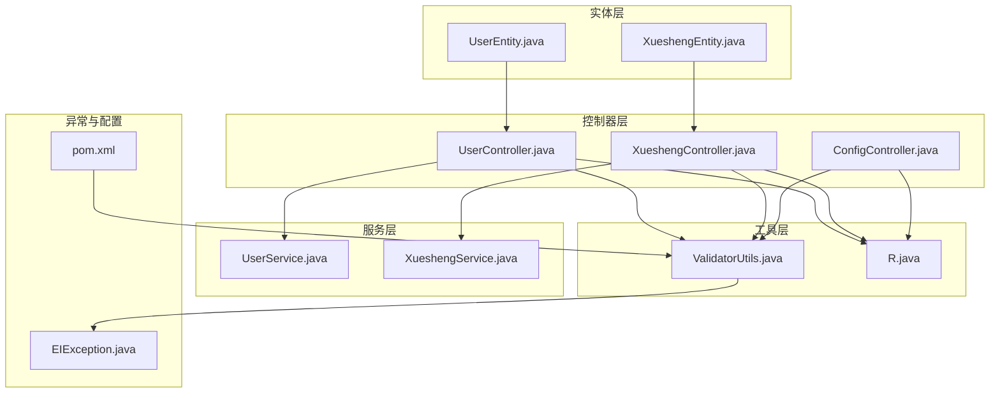
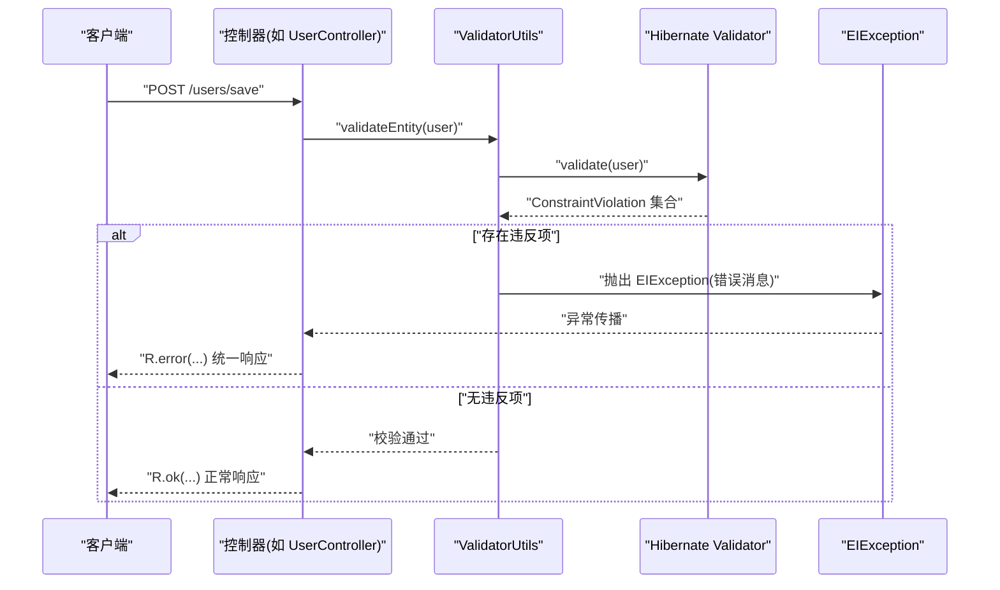
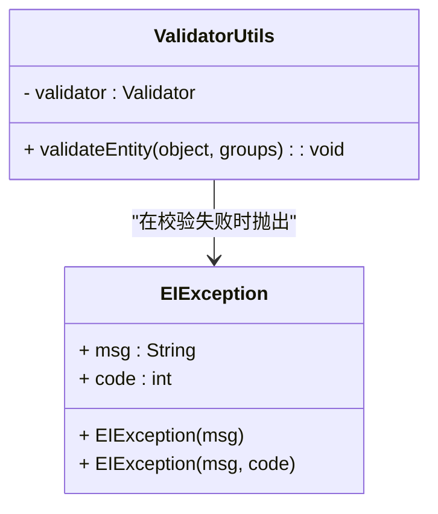
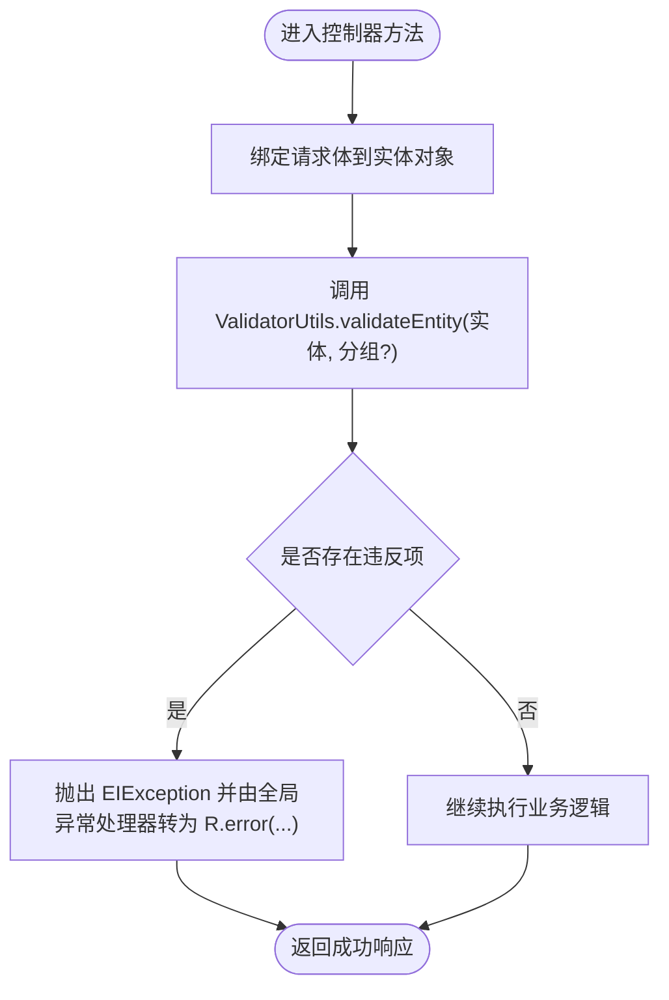
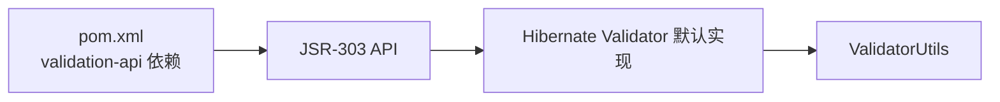

# 校验工具类

<cite>
**本文引用的文件**
- [ValidatorUtils.java](file://src/main/java/com/utils/ValidatorUtils.java)
- [EIException.java](file://src/main/java/com/entity/EIException.java)
- [UserController.java](file://src/main/java/com/controller/UserController.java)
- [XueshengController.java](file://src/main/java/com/controller/XueshengController.java)
- [ConfigController.java](file://src/main/java/com/controller/ConfigController.java)
- [UserEntity.java](file://src/main/java/com/entity/UserEntity.java)
- [XueshengEntity.java](file://src/main/java/com/entity/XueshengEntity.java)
- [R.java](file://src/main/java/com/utils/R.java)
- [CommonUtil.java](file://src/main/java/com/utils/CommonUtil.java)
- [pom.xml](file://pom.xml)
</cite>

## 目录
1. [简介](#简介)
2. [项目结构](#项目结构)
3. [核心组件](#核心组件)
4. [架构总览](#架构总览)
5. [详细组件分析](#详细组件分析)
6. [依赖分析](#依赖分析)
7. [性能考虑](#性能考虑)
8. [故障排查指南](#故障排查指南)
9. [结论](#结论)
10. [附录](#附录)

## 简介
本文件围绕校验工具类 ValidatorUtils 展开，系统性解析其基于 Hibernate Validator 的校验机制与规则实现，覆盖以下主题：
- 校验对象的静态入口与异常抛出策略
- 实体类上的注解式约束（如必填、非空、非空集合）如何驱动校验
- 在 Controller 层与 Service 层的实践用法与注意事项
- 自定义校验规则的扩展思路与分组校验的使用方式
- 校验异常的处理流程与统一返回结构
- 性能优化与批量校验策略建议
- 常见校验场景的最佳实践与示例路径

## 项目结构
该项目采用典型的 Spring Boot 分层架构，校验工具位于工具层，被控制器层调用以保证输入数据的合法性。

图表来源
- [ValidatorUtils.java:1-40](file://src/main/java/com/utils/ValidatorUtils.java#L1-L40)
- [UserController.java:1-175](file://src/main/java/com/controller/UserController.java#L1-L175)
- [XueshengController.java:1-284](file://src/main/java/com/controller/XueshengController.java#L1-L284)
- [ConfigController.java:85-111](file://src/main/java/com/controller/ConfigController.java#L85-L111)
- [UserEntity.java:1-78](file://src/main/java/com/entity/UserEntity.java#L1-L78)
- [XueshengEntity.java:1-201](file://src/main/java/com/entity/XueshengEntity.java#L1-L201)
- [R.java:1-52](file://src/main/java/com/utils/R.java#L1-L52)
- [EIException.java:1-53](file://src/main/java/com/entity/EIException.java#L1-L53)
- [pom.xml:72-76](file://pom.xml#L72-L76)

章节来源
- [ValidatorUtils.java:1-40](file://src/main/java/com/utils/ValidatorUtils.java#L1-L40)
- [pom.xml:72-76](file://pom.xml#L72-L76)

## 核心组件
- ValidatorUtils：封装 Hibernate Validator 的静态校验入口，负责对传入对象执行 JSR-303 约束校验，并在失败时抛出自定义异常。
- EIException：自定义运行时异常，承载错误消息与可选状态码，用于统一异常处理。
- 控制器层：在请求入口处调用 ValidatorUtils.validateEntity 对请求体对象进行校验，确保后续业务逻辑的数据质量。
- 实体层：通过注解（如 NotBlank、NotEmpty、NotNull）声明约束，驱动 ValidatorUtils 的校验行为。
- R：统一响应结构，便于在控制器中返回标准的错误/成功结果。

章节来源
- [ValidatorUtils.java:13-39](file://src/main/java/com/utils/ValidatorUtils.java#L13-L39)
- [EIException.java:4-52](file://src/main/java/com/entity/EIException.java#L4-L52)
- [R.java:9-51](file://src/main/java/com/utils/R.java#L9-L51)

## 架构总览
ValidatorUtils 作为横切关注点，贯穿于控制器层与实体层之间，形成“输入即校验”的防御式编程模式。

图表来源
- [ValidatorUtils.java:23-36](file://src/main/java/com/utils/ValidatorUtils.java#L23-L36)
- [UserController.java:142-150](file://src/main/java/com/controller/UserController.java#L142-L150)
- [R.java:16-29](file://src/main/java/com/utils/R.java#L16-L29)
- [EIException.java:13-33](file://src/main/java/com/entity/EIException.java#L13-L33)

## 详细组件分析

### ValidatorUtils 类分析
- 设计要点
  - 使用静态初始化块构建默认 Validator 工厂，避免重复创建实例，降低开销。
  - validateEntity 方法接收任意对象与可选分组 Class<?>...，返回 JSR-303 违反集合；若集合非空，取首个违反项并抛出 EIException。
- 数据结构与复杂度
  - validateEntity 内部使用 Set<ConstraintViolation<Object>> 存储违反项，遍历首个元素的时间复杂度为 O(1)，整体校验复杂度取决于实体属性数量与注解数量。
- 错误处理
  - 将第一个违反项的消息直接抛出，未聚合多条错误信息；如需多错误聚合，可在工具层扩展。
- 可扩展性
  - 支持分组校验（groups 参数），可用于区分新增、编辑等不同场景的约束集。
  - 可在工具层增加批量校验方法，收集所有违反项后统一返回。

图表来源
- [ValidatorUtils.java:16-36](file://src/main/java/com/utils/ValidatorUtils.java#L16-L36)
- [EIException.java:7-52](file://src/main/java/com/entity/EIException.java#L7-L52)

章节来源
- [ValidatorUtils.java:19-36](file://src/main/java/com/utils/ValidatorUtils.java#L19-L36)

### 实体类注解与验证规则
- UserEntity
  - 字段：username、password、role 等，未在当前文件中展示注解式约束。
- XueshengEntity
  - 引入 javax.validation 注解（NotBlank、NotEmpty、NotNull）用于声明必填与非空约束，驱动 ValidatorUtils 校验。
- 典型规则
  - 必填字段：@NotBlank 或 @NotNull（根据字段类型选择）
  - 集合/数组非空：@NotEmpty
  - 分组校验：结合 Controller 调用 validateEntity 的 groups 参数，按场景启用不同约束

章节来源
- [UserEntity.java:14-77](file://src/main/java/com/entity/UserEntity.java#L14-L77)
- [XueshengEntity.java:5-8](file://src/main/java/com/entity/XueshengEntity.java#L5-L8)

### 控制器层实践
- UserController
  - 在 /users/save、/users/update 等接口中，注释展示了对 UserEntity 进行校验的调用位置，实际代码中这些调用被注释掉，属于可选增强点。
- XueshengController
  - 在 /xuesheng/save、/xuesheng/add、/xuesheng/update 等接口中，同样注释了对 XueshengEntity 的校验调用，可按需启用。
- ConfigController
  - 在 /config/save、/config/update 接口注释中也预留了校验调用位置。

图表来源
- [UserController.java:142-150](file://src/main/java/com/controller/UserController.java#L142-L150)
- [XueshengController.java:189-200](file://src/main/java/com/controller/XueshengController.java#L189-L200)
- [ConfigController.java:87-91](file://src/main/java/com/controller/ConfigController.java#L87-L91)
- [ValidatorUtils.java:29-36](file://src/main/java/com/utils/ValidatorUtils.java#L29-L36)
- [R.java:16-29](file://src/main/java/com/utils/R.java#L16-L29)

章节来源
- [UserController.java:67-74](file://src/main/java/com/controller/UserController.java#L67-L74)
- [XueshengController.java:75-85](file://src/main/java/com/controller/XueshengController.java#L75-L85)
- [ConfigController.java:87-100](file://src/main/java/com/controller/ConfigController.java#L87-L100)

### Service 层的校验策略
- 建议在 Service 层补充二次校验，例如：
  - 业务唯一性校验（如用户名重复）
  - 业务规则校验（如金额范围、日期区间）
- 若 Service 层发现业务异常，可抛出自定义异常或返回 R.error(...)，保持与控制器一致的错误响应风格。

章节来源
- [UserController.java:144-149](file://src/main/java/com/controller/UserController.java#L144-L149)
- [XueshengController.java:192-199](file://src/main/java/com/controller/XueshengController.java#L192-L199)

### 自定义校验规则与扩展
- 分组校验
  - 在 validateEntity 中传入 groups 参数，结合 @GroupSequence 或 @Validated 的分组注解，实现不同场景下的约束集切换。
- 批量校验
  - 当需要收集多个实体的全部违反项时，可在工具层扩展方法，遍历所有对象并聚合 ConstraintViolation，最终统一抛出或返回。
- 国际化错误信息
  - 当前工具类直接使用约束违反的默认消息；若需国际化，可在应用层配置消息源，并在控制器或全局异常处理器中将 EIException 的消息映射为本地化文本。

章节来源
- [ValidatorUtils.java:29](file://src/main/java/com/utils/ValidatorUtils.java#L29)

## 依赖分析
- JSR-303 API 依赖
  - 项目引入 javax.validation:validation-api，为 ValidatorUtils 提供注解式校验能力。
- Hibernate Validator
  - 通过 Validation.buildDefaultValidatorFactory() 获取 Validator，默认实现来自运行时类路径中的实现（通常为 Hibernate Validator）。
- Spring MVC
  - 控制器层使用 @RequestBody 绑定请求体，ValidatorUtils 作用于已绑定的实体对象。

图表来源
- [pom.xml:72-76](file://pom.xml#L72-L76)
- [ValidatorUtils.java:8-21](file://src/main/java/com/utils/ValidatorUtils.java#L8-L21)

章节来源
- [pom.xml:72-76](file://pom.xml#L72-L76)
- [ValidatorUtils.java:8-21](file://src/main/java/com/utils/ValidatorUtils.java#L8-L21)

## 性能考虑
- 单次校验开销
  - ValidatorUtils.validateEntity 仅做一次 validate 调用，复杂度与实体属性数线性相关；对于大型对象，建议拆分请求体或延迟到 Service 层进行更细粒度的校验。
- 缓存与复用
  - Validator 实例在静态块中初始化并复用，避免重复创建，降低启动后抖动。
- 批量校验策略
  - 对于批量提交，建议在工具层聚合所有违反项，减少多次往返与异常抛出的开销，最后一次性返回汇总结果。
- I/O 与网络
  - 控制器层的 @RequestBody 绑定与 Jackson 序列化可能成为瓶颈，建议在网关或控制器前进行必要的限流与压缩。

[本节为通用性能讨论，无需特定文件引用]

## 故障排查指南
- 常见问题
  - 未触发校验：检查控制器是否调用了 ValidatorUtils.validateEntity，或注释掉了调用。
  - 未显示具体字段错误：当前工具类仅返回第一条违反消息；如需多错误，可在工具层扩展。
  - 异常未被统一处理：确认控制器或全局异常处理器将 EIException 映射为 R.error(...)。
- 定位步骤
  - 在控制器对应接口处断点，确认 validateEntity 是否被调用。
  - 检查实体类注解是否正确标注，确保 Hibernate Validator 能识别。
  - 查看 R.error(...) 的返回结构，确认前端收到的错误字段与消息。

章节来源
- [UserController.java:142-150](file://src/main/java/com/controller/UserController.java#L142-L150)
- [XueshengController.java:189-200](file://src/main/java/com/controller/XueshengController.java#L189-L200)
- [R.java:16-29](file://src/main/java/com/utils/R.java#L16-L29)

## 结论
ValidatorUtils 以最小实现提供了可靠的注解式校验能力，配合实体层注解与控制器层调用，能够有效提升系统的输入质量与健壮性。建议在现有基础上：
- 启用控制器层的校验调用，确保关键接口均进行输入校验
- 在 Service 层补充业务规则校验，形成“输入校验 + 业务校验”的双保险
- 扩展工具层以支持分组校验与批量校验，满足复杂场景需求
- 在应用层完善异常处理与国际化消息映射，提升用户体验

[本节为总结性内容，无需特定文件引用]

## 附录

### 常见校验场景与最佳实践
- 必填字段校验
  - 使用 @NotBlank（字符串）、@NotNull（对象/数值）标注必填字段，结合 validateEntity(groups) 实现新增/编辑场景的差异化约束。
- 长度限制与格式验证
  - 在实体字段上添加长度、正则等约束注解，确保前端/后端一致的校验行为。
- 唯一性与业务规则
  - 在 Service 层进行数据库唯一性检查与业务规则校验，失败时返回 R.error(...)。
- 分组校验
  - 通过 groups 参数区分新增、编辑等场景，避免不必要的约束干扰。
- 批量校验
  - 对批量提交的实体集合进行聚合校验，收集全部违反项后统一返回，减少交互次数。

章节来源
- [XueshengEntity.java:5-8](file://src/main/java/com/entity/XueshengEntity.java#L5-L8)
- [UserController.java:142-150](file://src/main/java/com/controller/UserController.java#L142-L150)
- [XueshengController.java:189-200](file://src/main/java/com/controller/XueshengController.java#L189-L200)
- [R.java:16-29](file://src/main/java/com/utils/R.java#L16-L29)