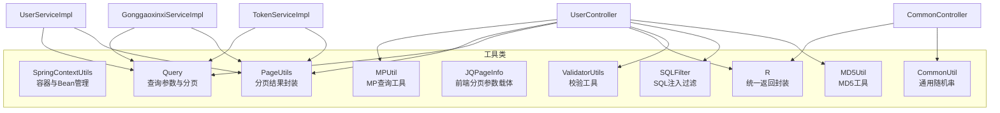
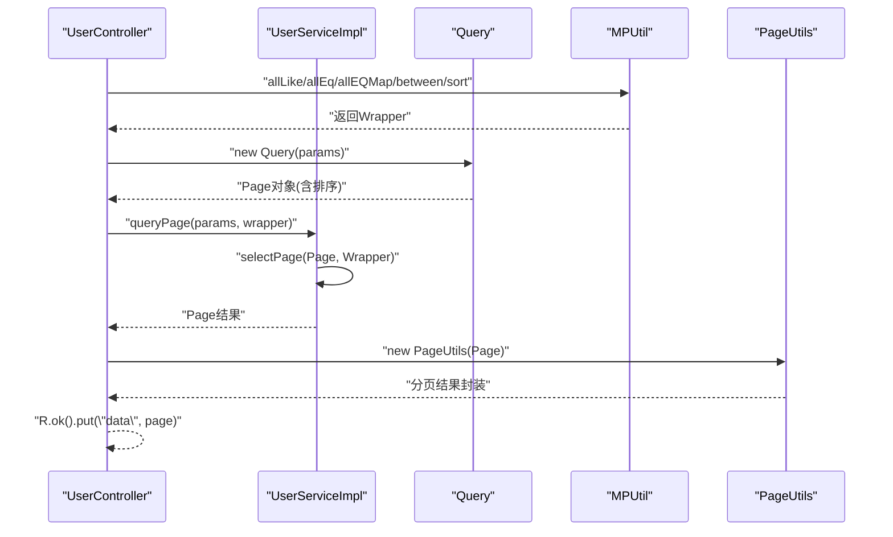
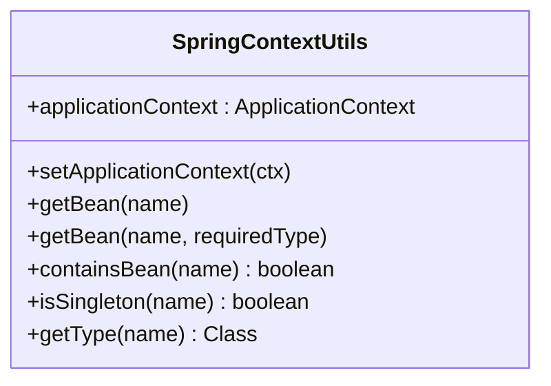
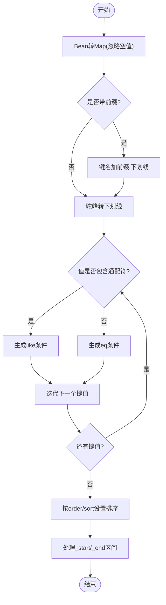
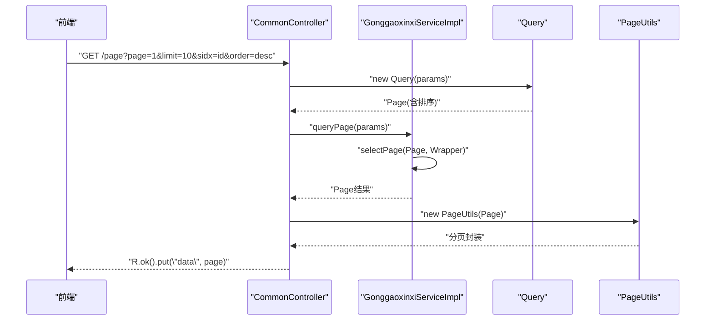
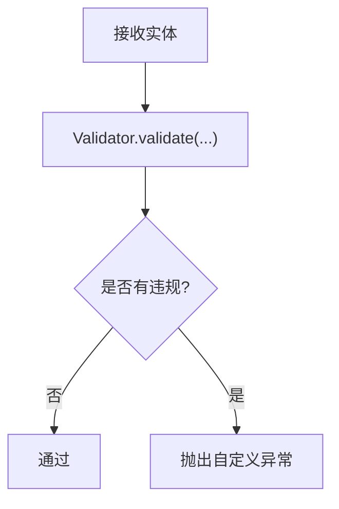
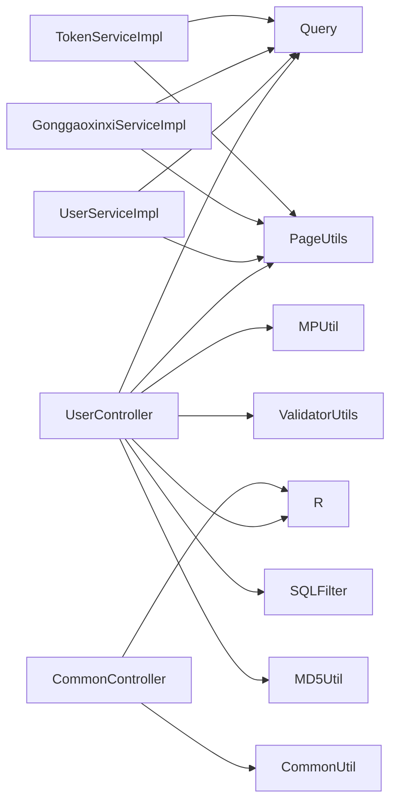

# 系统工具类

<cite>
**本文引用的文件**
- [SpringContextUtils.java](file://src/main/java/com/utils/SpringContextUtils.java)
- [MPUtil.java](file://src/main/java/com/utils/MPUtil.java)
- [CommonUtil.java](file://src/main/java/com/utils/CommonUtil.java)
- [PageUtils.java](file://src/main/java/com/utils/PageUtils.java)
- [R.java](file://src/main/java/com/utils/R.java)
- [JQPageInfo.java](file://src/main/java/com/utils/JQPageInfo.java)
- [Query.java](file://src/main/java/com/utils/Query.java)
- [ValidatorUtils.java](file://src/main/java/com/utils/ValidatorUtils.java)
- [SQLFilter.java](file://src/main/java/com/utils/SQLFilter.java)
- [MD5Util.java](file://src/main/java/com/utils/MD5Util.java)
- [UserController.java](file://src/main/java/com/controller/UserController.java)
- [CommonController.java](file://src/main/java/com/controller/CommonController.java)
- [UserServiceImpl.java](file://src/main/java/com/service/impl/UserServiceImpl.java)
- [GonggaoxinxiServiceImpl.java](file://src/main/java/com/service/impl/GonggaoxinxiServiceImpl.java)
- [TokenServiceImpl.java](file://src/main/java/com/service/impl/TokenServiceImpl.java)
</cite>

## 目录
1. [简介](#简介)
2. [项目结构](#项目结构)
3. [核心组件](#核心组件)
4. [架构总览](#架构总览)
5. [详细组件分析](#详细组件分析)
6. [依赖分析](#依赖分析)
7. [性能考量](#性能考量)
8. [故障排查指南](#故障排查指南)
9. [结论](#结论)
10. [附录](#附录)

## 简介
本文件聚焦于系统工具类，重点解析以下两类工具：
- Spring 上下文与 Bean 管理：SpringContextUtils 提供静态入口从 Spring 容器获取 Bean、判断 Bean 生命周期与类型等能力，便于在非 Spring 管理的静态场景中访问容器资源。
- MyBatis-Plus 实用工具：MPUtil 提供查询条件构造、驼峰到下划线字段映射、模糊/相等混合匹配、区间筛选、排序等便捷方法，显著简化分页查询与动态查询的构建。

同时，文档阐述这些工具类在依赖注入与 Spring 容器管理中的角色、线程安全性与并发处理能力、集成使用方法与最佳实践，并给出设计原则、扩展性考虑、测试与调试建议。

## 项目结构
系统工具类集中位于 com.utils 包内，围绕“返回封装、分页与查询参数、校验、SQL 过滤、MD5、通用随机串、MP 工具、Spring 上下文”等职责划分模块化组织。控制器与服务层通过这些工具类完成常见业务流程的快速实现。

图表来源
- [SpringContextUtils.java:1-43](file://src/main/java/com/utils/SpringContextUtils.java#L1-L43)
- [MPUtil.java:1-185](file://src/main/java/com/utils/MPUtil.java#L1-L185)
- [PageUtils.java:1-102](file://src/main/java/com/utils/PageUtils.java#L1-L102)
- [Query.java:1-99](file://src/main/java/com/utils/Query.java#L1-L99)
- [JQPageInfo.java:1-55](file://src/main/java/com/utils/JQPageInfo.java#L1-L55)
- [ValidatorUtils.java:1-40](file://src/main/java/com/utils/ValidatorUtils.java#L1-L40)
- [SQLFilter.java:1-43](file://src/main/java/com/utils/SQLFilter.java#L1-L43)
- [R.java:1-52](file://src/main/java/com/utils/R.java#L1-L52)
- [CommonUtil.java:1-23](file://src/main/java/com/utils/CommonUtil.java#L1-L23)
- [MD5Util.java:1-20](file://src/main/java/com/utils/MD5Util.java#L1-L20)
- [UserController.java:1-175](file://src/main/java/com/controller/UserController.java#L1-L175)
- [CommonController.java:1-249](file://src/main/java/com/controller/CommonController.java#L1-L249)
- [UserServiceImpl.java:1-49](file://src/main/java/com/service/impl/UserServiceImpl.java#L1-L49)
- [GonggaoxinxiServiceImpl.java:1-39](file://src/main/java/com/service/impl/GonggaoxinxiServiceImpl.java#L1-L39)
- [TokenServiceImpl.java:1-48](file://src/main/java/com/service/impl/TokenServiceImpl.java#L1-L48)

章节来源
- [SpringContextUtils.java:1-43](file://src/main/java/com/utils/SpringContextUtils.java#L1-L43)
- [MPUtil.java:1-185](file://src/main/java/com/utils/MPUtil.java#L1-L185)
- [PageUtils.java:1-102](file://src/main/java/com/utils/PageUtils.java#L1-L102)
- [Query.java:1-99](file://src/main/java/com/utils/Query.java#L1-L99)
- [JQPageInfo.java:1-55](file://src/main/java/com/utils/JQPageInfo.java#L1-L55)
- [ValidatorUtils.java:1-40](file://src/main/java/com/utils/ValidatorUtils.java#L1-L40)
- [SQLFilter.java:1-43](file://src/main/java/com/utils/SQLFilter.java#L1-L43)
- [R.java:1-52](file://src/main/java/com/utils/R.java#L1-L52)
- [CommonUtil.java:1-23](file://src/main/java/com/utils/CommonUtil.java#L1-L23)
- [MD5Util.java:1-20](file://src/main/java/com/utils/MD5Util.java#L1-L20)

## 核心组件
- SpringContextUtils：实现 ApplicationContextAware，持有静态 ApplicationContext 引用，提供 getBean、containsBean、isSingleton、getType 等静态方法，用于在静态上下文中获取 Bean 或查询 Bean 元信息。
- MPUtil：提供将 Java 驼峰属性映射为数据库下划线字段、批量 LIKE/ALL EQ/LIKE OR EQ、区间筛选 between、排序 sort、以及便捷的 allLike/allEq/allEQMap 等方法，简化 MyBatis-Plus Wrapper 构造。
- PageUtils：封装 MyBatis-Plus Page 结果，提供 total、pageSize、totalPage、currPage、list 等字段，支持从 Page 对象或 Map 参数构造分页结果。
- Query：将前端传入的分页参数（page/limit/sidx/order）转换为 MyBatis-Plus Page 并设置排序；内置 SQLFilter 防注入。
- JQPageInfo：前端表格分页参数载体（page/limit/sidx/order/offset），用于 Query 的输入。
- ValidatorUtils：基于 Hibernate Validator 的实体校验工具，校验失败抛出自定义异常。
- SQLFilter：对排序字段与关键字进行白名单过滤，防止 SQL 注入。
- R：统一响应封装，提供 ok/error 多种工厂方法，便于前后端一致的返回结构。
- CommonUtil：生成指定长度的随机字符串，常用于验证码、临时标识等。
- MD5Util：提供带密钥/不带密钥的摘要计算，便于密码存储与签名。

章节来源
- [SpringContextUtils.java:10-43](file://src/main/java/com/utils/SpringContextUtils.java#L10-L43)
- [MPUtil.java:14-185](file://src/main/java/com/utils/MPUtil.java#L14-L185)
- [PageUtils.java:10-102](file://src/main/java/com/utils/PageUtils.java#L10-L102)
- [Query.java:11-99](file://src/main/java/com/utils/Query.java#L11-L99)
- [JQPageInfo.java:3-55](file://src/main/java/com/utils/JQPageInfo.java#L3-L55)
- [ValidatorUtils.java:13-40](file://src/main/java/com/utils/ValidatorUtils.java#L13-L40)
- [SQLFilter.java:8-43](file://src/main/java/com/utils/SQLFilter.java#L8-L43)
- [R.java:6-52](file://src/main/java/com/utils/R.java#L6-L52)
- [CommonUtil.java:5-23](file://src/main/java/com/utils/CommonUtil.java#L5-L23)
- [MD5Util.java:5-20](file://src/main/java/com/utils/MD5Util.java#L5-L20)

## 架构总览
系统工具类在控制器与服务层之间起到“基础设施”的作用：控制器负责接收请求、调用工具类进行参数与查询封装、调用服务层执行业务逻辑；服务层使用 Query/MPUtil/PageUtils 构建复杂查询与分页；工具类之间通过明确职责边界协作，避免重复代码与分散逻辑。

图表来源
- [UserController.java:103-108](file://src/main/java/com/controller/UserController.java#L103-L108)
- [UserServiceImpl.java:27-34](file://src/main/java/com/service/impl/UserServiceImpl.java#L27-L34)
- [Query.java:55-98](file://src/main/java/com/utils/Query.java#L55-L98)
- [MPUtil.java:33-134](file://src/main/java/com/utils/MPUtil.java#L33-L134)
- [PageUtils.java:44-50](file://src/main/java/com/utils/PageUtils.java#L44-L50)
- [R.java:31-45](file://src/main/java/com/utils/R.java#L31-L45)

## 详细组件分析

### SpringContextUtils 组件分析
- 设计要点
  - 实现 ApplicationContextAware，在容器初始化时注入静态 ApplicationContext。
  - 提供 getBean(name)、getBean(name, type)、containsBean、isSingleton、getType 等静态方法，满足静态上下文访问 Bean 的需求。
- 使用场景
  - 在工具类、拦截器、监听器等非 Spring 管理的静态环境中获取 Bean。
  - 在需要根据名称或类型动态获取 Bean 的场景中减少样板代码。
- 线程安全与并发
  - 静态字段仅保存 ApplicationContext 引用，容器启动后不可变，读取安全。
  - getBean 等方法内部使用容器实例，容器本身保证并发安全。
- 注意事项
  - 避免在静态块中过早访问 Bean（需等待容器初始化完成）。
  - 不建议滥用静态 Bean 访问，优先通过依赖注入。

图表来源
- [SpringContextUtils.java:14-41](file://src/main/java/com/utils/SpringContextUtils.java#L14-L41)

章节来源
- [SpringContextUtils.java:10-43](file://src/main/java/com/utils/SpringContextUtils.java#L10-L43)

### MPUtil 组件分析
- 设计要点
  - 字段映射：camelToUnderline/camelToUnderlineMap 将 Java 驼峰属性名映射为数据库下划线字段名，支持带前缀的嵌套字段。
  - 查询构造：allLike/allLikePre、genLike、likeOrEq/genLikeOrEq、allEq/genEq、between、sort 提供链式组合能力。
  - 与 MP 集成：直接返回 MyBatis-Plus Wrapper，便于 EntityWrapper/QueryWrapper 场景复用。
- 使用场景
  - 动态搜索、多字段模糊匹配、范围查询、排序控制。
  - 与 Query/EntityWrapper 组合，构建复杂查询条件。
- 线程安全与并发
  - 方法均为纯函数式工具方法，无共享可变状态，天然线程安全。
- 扩展性
  - 可新增更多条件构造方法（如 in/notIn、isNull/isNotNull 等）。
  - 可引入表达式解析器，支持更复杂的动态条件。

图表来源
- [MPUtil.java:22-80](file://src/main/java/com/utils/MPUtil.java#L22-L80)
- [MPUtil.java:102-134](file://src/main/java/com/utils/MPUtil.java#L102-L134)
- [MPUtil.java:165-183](file://src/main/java/com/utils/MPUtil.java#L165-L183)

章节来源
- [MPUtil.java:14-185](file://src/main/java/com/utils/MPUtil.java#L14-L185)

### 分页与查询参数组件分析
- Query
  - 接收前端分页参数（page/limit/sidx/order），构造 MyBatis-Plus Page 并设置排序。
  - 内置 SQLFilter 防注入，确保排序字段安全。
- PageUtils
  - 支持从 Page 对象或 Map 参数构造分页结果，封装 total、pageSize、totalPage、currPage、list。
- JQPageInfo
  - 前端表格分页参数载体，包含 page、limit、sidx、order、offset。

图表来源
- [CommonController.java:26-32](file://src/main/java/com/controller/CommonController.java#L26-L32)
- [GonggaoxinxiServiceImpl.java:25-32](file://src/main/java/com/service/impl/GonggaoxinxiServiceImpl.java#L25-L32)
- [Query.java:55-98](file://src/main/java/com/utils/Query.java#L55-L98)
- [PageUtils.java:44-50](file://src/main/java/com/utils/PageUtils.java#L44-L50)

章节来源
- [Query.java:11-99](file://src/main/java/com/utils/Query.java#L11-L99)
- [PageUtils.java:10-102](file://src/main/java/com/utils/PageUtils.java#L10-L102)
- [JQPageInfo.java:3-55](file://src/main/java/com/utils/JQPageInfo.java#L3-L55)

### 校验与安全组件分析
- ValidatorUtils
  - 基于 Hibernate Validator，校验失败抛出自定义异常，便于统一处理。
- SQLFilter
  - 对排序字段与关键字进行白名单过滤，防止 SQL 注入。

图表来源
- [ValidatorUtils.java:29-36](file://src/main/java/com/utils/ValidatorUtils.java#L29-L36)
- [SQLFilter.java:17-41](file://src/main/java/com/utils/SQLFilter.java#L17-L41)

章节来源
- [ValidatorUtils.java:13-40](file://src/main/java/com/utils/ValidatorUtils.java#L13-L40)
- [SQLFilter.java:8-43](file://src/main/java/com/utils/SQLFilter.java#L8-L43)

### 统一返回与通用工具
- R
  - 统一响应结构，提供 ok/error 工厂方法，便于前后端约定。
- CommonUtil
  - 生成指定长度的随机字符串，适用于验证码等场景。
- MD5Util
  - 提供 MD5 摘要计算，便于密码存储与签名。

章节来源
- [R.java:6-52](file://src/main/java/com/utils/R.java#L6-L52)
- [CommonUtil.java:5-23](file://src/main/java/com/utils/CommonUtil.java#L5-L23)
- [MD5Util.java:5-20](file://src/main/java/com/utils/MD5Util.java#L5-L20)

## 依赖分析
- 控制器依赖
  - UserController 依赖 MPUtil、PageUtils、Query、R、ValidatorUtils、SQLFilter、MD5Util。
  - CommonController 依赖 R、CommonUtil。
- 服务层依赖
  - UserServiceImpl、GonggaoxinxiServiceImpl、TokenServiceImpl 依赖 Query、PageUtils。
- 工具类内部依赖
  - MPUtil 依赖 Hutool BeanUtil、MyBatis-Plus Wrapper。
  - Query 依赖 MyBatis-Plus Page、SQLFilter。
  - ValidatorUtils 依赖 Hibernate Validator、自定义异常类型。

图表来源
- [UserController.java:30-33](file://src/main/java/com/controller/UserController.java#L30-L33)
- [CommonController.java:35-35](file://src/main/java/com/controller/CommonController.java#L35-L35)
- [UserServiceImpl.java:17-18](file://src/main/java/com/service/impl/UserServiceImpl.java#L17-L18)
- [GonggaoxinxiServiceImpl.java:11-12](file://src/main/java/com/service/impl/GonggaoxinxiServiceImpl.java#L11-L12)
- [TokenServiceImpl.java:22-22](file://src/main/java/com/service/impl/TokenServiceImpl.java#L22-L22)

章节来源
- [UserController.java:30-33](file://src/main/java/com/controller/UserController.java#L30-L33)
- [CommonController.java:35-35](file://src/main/java/com/controller/CommonController.java#L35-L35)
- [UserServiceImpl.java:17-18](file://src/main/java/com/service/impl/UserServiceImpl.java#L17-L18)
- [GonggaoxinxiServiceImpl.java:11-12](file://src/main/java/com/service/impl/GonggaoxinxiServiceImpl.java#L11-L12)
- [TokenServiceImpl.java:22-22](file://src/main/java/com/service/impl/TokenServiceImpl.java#L22-L22)

## 性能考量
- MPUtil
  - 字符串转换与 Map 迭代为 O(n) 操作，n 为属性数量；整体开销较小。
  - 链式条件构造避免多次包装，减少中间对象创建。
- Query/SQLFilter
  - 排序字段白名单过滤与字符串替换为常量时间操作，对性能影响可忽略。
- PageUtils
  - 仅封装 Page 数据，无额外计算，性能开销极低。
- SpringContextUtils
  - 仅读取容器引用，无锁竞争，性能稳定。

## 故障排查指南
- SQL 注入防护
  - 若出现排序异常或非法关键字错误，检查 sidx/order 是否被 SQLFilter 正确过滤。
- 分页参数
  - 若排序无效，确认前端传入的 sidx/order 与后端字段一致，且未被过滤。
- MPUtil 条件构造
  - 若 LIKE/ALL EQ 不生效，检查字段映射是否正确（驼峰/下划线），以及前缀是否正确。
- Bean 获取
  - 若 SpringContextUtils.getBean 抛出异常，确认容器已初始化且 Bean 名称正确。
- 校验异常
  - 若 ValidatorUtils 抛出自定义异常，检查实体注解与提示信息。

章节来源
- [SQLFilter.java:17-41](file://src/main/java/com/utils/SQLFilter.java#L17-L41)
- [Query.java:48-51](file://src/main/java/com/utils/Query.java#L48-L51)
- [MPUtil.java:165-183](file://src/main/java/com/utils/MPUtil.java#L165-L183)
- [SpringContextUtils.java:23-29](file://src/main/java/com/utils/SpringContextUtils.java#L23-L29)
- [ValidatorUtils.java:29-36](file://src/main/java/com/utils/ValidatorUtils.java#L29-L36)

## 结论
系统工具类通过清晰的职责划分与稳定的 API 设计，有效降低了控制器与服务层的重复代码，提升了开发效率与一致性。SpringContextUtils 提供了在静态上下文中的容器访问能力；MPUtil 则大幅简化了 MyBatis-Plus 查询条件的构建。配合 Query/SQLFilter、R、PageUtils 等工具，形成了一套完整的“查询-分页-返回”闭环。建议在保持现有设计原则的基础上，持续完善扩展点（如更多条件构造、表达式解析）与测试覆盖，以增强可维护性与可靠性。

## 附录
- 集成使用方法与最佳实践
  - 控制器中优先使用 MPUtil 构造 Wrapper，结合 Query 设置分页与排序，最后通过 PageUtils 封装返回。
  - 使用 R 统一封装响应，前后端约定统一字段。
  - 对外部输入使用 SQLFilter 与 ValidatorUtils 进行安全与校验。
  - 在静态场景中使用 SpringContextUtils 获取 Bean，但尽量通过依赖注入替代。
- 测试方法与调试技巧
  - 单元测试：针对 MPUtil 的字段映射与条件构造方法编写参数化测试，覆盖空值、通配符、前缀等场景。
  - 集成测试：模拟控制器请求，验证分页、排序、条件过滤的正确性。
  - 调试技巧：在 Query 中断点观察 page/limit/sidx/order 的转换过程；在 MPUtil 中断点观察 Map 转换与链式条件拼接。