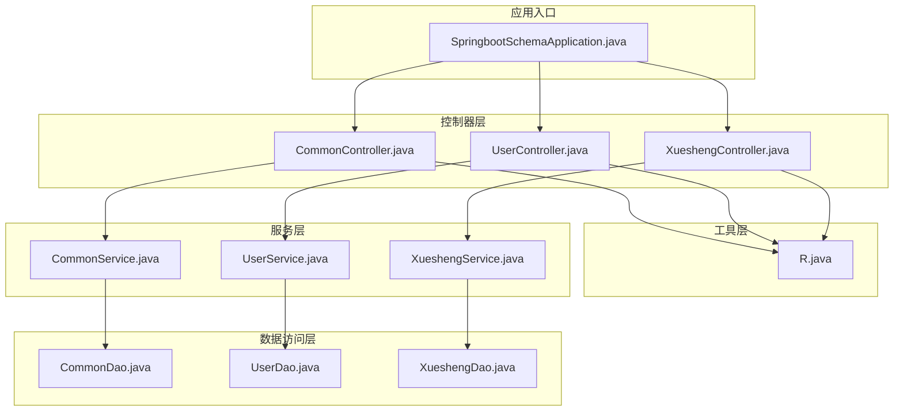
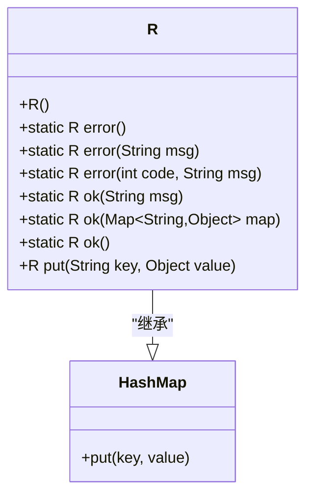
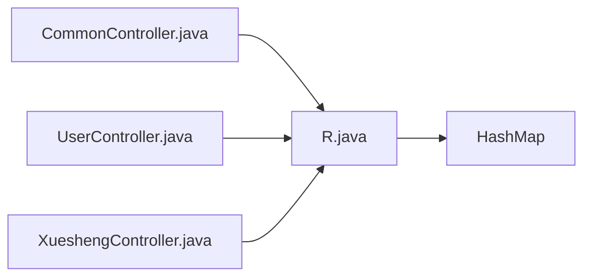

# 统一响应封装类

<cite>
**本文引用的文件**
- [R.java](file://src/main/java/com/utils/R.java)
- [CommonController.java](file://src/main/java/com/controller/CommonController.java)
- [UserController.java](file://src/main/java/com/controller/UserController.java)
- [XueshengController.java](file://src/main/java/com/controller/XueshengController.java)
- [SpringbootSchemaApplication.java](file://src/main/java/com/SpringbootSchemaApplication.java)
- [README.md](file://README.md)
</cite>

## 目录
1. [简介](#简介)
2. [项目结构](#项目结构)
3. [核心组件](#核心组件)
4. [架构总览](#架构总览)
5. [详细组件分析](#详细组件分析)
6. [依赖关系分析](#依赖关系分析)
7. [性能考量](#性能考量)
8. [故障排查指南](#故障排查指南)
9. [结论](#结论)
10. [附录](#附录)

## 简介
本文件围绕统一响应封装类R进行系统化文档化，重点阐释：
- 设计理念与继承HashMap的架构优势
- 错误响应方法error()的多种重载形式及参数语义
- 成功响应方法ok()的不同实现与适用场景
- 链式调用put()方法的设计模式与返回值处理
- 在控制器中使用R类的最佳实践与示例路径
- 统一响应格式对前后端交互的标准化意义
- 错误码约定、消息格式与响应结构说明

## 项目结构
该项目采用Spring Boot + MyBatis的分层架构，控制器层通过R类统一输出JSON响应，工具层提供通用工具类，服务层负责业务逻辑，DAO层负责数据访问。

图表来源
- [CommonController.java:52-62](file://src/main/java/com/controller/CommonController.java#L52-L62)
- [UserController.java:52-60](file://src/main/java/com/controller/UserController.java#L52-L60)
- [XueshengController.java:58-68](file://src/main/java/com/controller/XueshengController.java#L58-L68)
- [R.java:9-51](file://src/main/java/com/utils/R.java#L9-L51)
- [SpringbootSchemaApplication.java:9-21](file://src/main/java/com/SpringbootSchemaApplication.java#L9-L21)

章节来源
- [README.md:1-64](file://README.md#L1-L64)
- [SpringbootSchemaApplication.java:9-21](file://src/main/java/com/SpringbootSchemaApplication.java#L9-L21)

## 核心组件
- 统一响应封装类R：继承HashMap，提供静态工厂方法与实例链式扩展方法，确保所有HTTP响应具备一致的结构字段。
- 控制器层：各业务控制器在方法末尾直接返回R对象，简化响应构造与前后端契约。

章节来源
- [R.java:9-51](file://src/main/java/com/utils/R.java#L9-L51)

## 架构总览
R类作为“响应体生成器”，在控制器层集中使用，形成统一的响应协议。其继承HashMap使得：
- 结构灵活：可动态添加任意键值对
- 兼容性好：可直接被序列化为JSON
- 使用便捷：支持链式调用put()

图表来源
- [R.java:9-51](file://src/main/java/com/utils/R.java#L9-L51)

## 详细组件分析

### R类设计与继承HashMap的优势
- 初始化默认字段：构造函数设置默认code为0，便于区分成功与失败场景。
- 静态工厂方法：提供error()与ok()的多重重载，快速构建标准响应。
- 实例链式扩展：重写put()返回this，支持连续追加数据字段，提升可读性与可维护性。
- 与Spring MVC集成：返回R对象时，Spring会自动将其序列化为JSON，字段名与值由HashMap内容决定。

章节来源
- [R.java:12-14](file://src/main/java/com/utils/R.java#L12-L14)
- [R.java:16-29](file://src/main/java/com/utils/R.java#L16-L29)
- [R.java:31-45](file://src/main/java/com/utils/R.java#L31-L45)
- [R.java:47-50](file://src/main/java/com/utils/R.java#L47-L50)

### 错误响应方法error()的重载与参数语义
- error()：默认错误码500与默认提示信息，适用于未明确指定错误码的通用异常场景。
- error(String msg)：固定错误码500，自定义错误消息，用于业务校验失败或资源不可用等场景。
- error(int code, String msg)：自定义错误码与消息，用于精细化错误分类与国际化。

建议：
- 前端根据code判断错误类型，msg用于展示给用户或日志记录。
- 对于可预期的业务错误（如参数校验失败），建议使用明确的code与清晰的msg，便于前端分支处理。

章节来源
- [R.java:16-29](file://src/main/java/com/utils/R.java#L16-L29)

### 成功响应方法ok()的实现与使用场景
- ok()：仅返回默认code=0与空数据，适用于简单操作完成或无额外数据返回的场景。
- ok(String msg)：返回默认code=0与自定义消息，常用于操作成功提示。
- ok(Map<String,Object> map)：将传入Map的所有键值合并到响应中，适合批量数据或复杂结果集。

使用建议：
- 当需要返回业务数据时，优先使用链式put()或ok(map)追加data字段，保持响应结构一致性。
- 对于分页数据，通常将Page对象或List放入data字段，便于前端统一处理。

章节来源
- [R.java:31-45](file://src/main/java/com/utils/R.java#L31-L45)

### 链式调用put()的设计模式与返回值处理
- 设计模式：Fluent API（流式接口）。通过返回this，允许连续调用put()，最终得到完整响应对象。
- 返回值处理：控制器直接返回R对象，Spring MVC负责序列化；链式调用不会改变返回类型，仍为R。
- 最佳实践：在成功响应中使用R.ok().put("key", value)，在错误响应中使用R.error(code, msg)，保证前后端契约稳定。

章节来源
- [R.java:47-50](file://src/main/java/com/utils/R.java#L47-L50)

### 控制器中使用R类的最佳实践与示例路径
- 登录/注册/退出：在登录成功时返回token；注册/退出成功时返回默认成功响应或带消息的成功响应。
- 列表/详情/分页：统一使用R.ok().put("data", ...)返回业务数据。
- 提醒/统计：返回R.ok().put("count", ...)或R.ok().put("data", ...)。
- 异常处理：捕获异常后返回R.error(...)，并记录日志以便排查。

示例路径（不含具体代码内容）：
- 登录成功携带token：[UserController.java:58-59](file://src/main/java/com/controller/UserController.java#L58-L59)
- 注册成功：[UserController.java](file://src/main/java/com/controller/UserController.java#L73)
- 退出成功：[UserController.java](file://src/main/java/com/controller/UserController.java#L82)
- 列表/分页数据：[UserController.java](file://src/main/java/com/controller/UserController.java#L107)
- 详情数据：[UserController.java](file://src/main/java/com/controller/UserController.java#L126)
- 登录成功携带token（学生）：[XueshengController.java:66-67](file://src/main/java/com/controller/XueshengController.java#L66-L67)
- 注册成功（学生）：[XueshengController.java](file://src/main/java/com/controller/XueshengController.java#L84)
- 退出成功（学生）：[XueshengController.java](file://src/main/java/com/controller/XueshengController.java#L93)
- 列表/分页数据（学生）：[XueshengController.java](file://src/main/java/com/controller/XueshengController.java#L131)
- 详情数据（学生）：[XueshengController.java](file://src/main/java/com/controller/XueshengController.java#L170)
- 通用位置服务：[CommonController.java:52-62](file://src/main/java/com/controller/CommonController.java#L52-L62)
- 人脸比对：[CommonController.java:71-105](file://src/main/java/com/controller/CommonController.java#L71-L105)
- 下拉选项联动：[CommonController.java:114-127](file://src/main/java/com/controller/CommonController.java#L114-L127)
- 审核状态变更：[CommonController.java:152-157](file://src/main/java/com/controller/CommonController.java#L152-L157)
- 提醒数量统计：[CommonController.java:168-198](file://src/main/java/com/controller/CommonController.java#L168-L198)
- 单列求和：[CommonController.java:204-211](file://src/main/java/com/controller/CommonController.java#L204-L211)
- 分组统计：[CommonController.java:217-224](file://src/main/java/com/controller/CommonController.java#L217-L224)
- 按值统计：[CommonController.java:230-246](file://src/main/java/com/controller/CommonController.java#L230-L246)

章节来源
- [UserController.java:52-174](file://src/main/java/com/controller/UserController.java#L52-L174)
- [XueshengController.java:58-283](file://src/main/java/com/controller/XueshengController.java#L58-L283)
- [CommonController.java:52-248](file://src/main/java/com/controller/CommonController.java#L52-L248)

### 统一响应格式对前后端交互的重要性与标准化意义
- 前后端契约：统一的响应结构（如code、msg、data等字段）使前端无需针对每个接口做特殊适配，降低对接成本。
- 错误处理一致性：通过code字段区分成功与失败，msg提供人类可读的提示，便于前端统一弹窗或路由跳转。
- 扩展性：通过put()方法动态扩展响应字段，满足不同接口的数据需求，同时保持结构一致。
- 可测试性：统一格式便于前端Mock数据与后端单元测试断言。

章节来源
- [R.java:9-51](file://src/main/java/com/utils/R.java#L9-L51)

### 错误码定义、消息格式与响应结构说明
- 默认成功：code=0，表示操作成功；可选msg描述成功信息；data为空或包含业务数据。
- 默认错误：code=500，msg为默认错误提示；用于未明确分类的异常或未知错误。
- 自定义错误：code为业务定义的错误码，msg为具体的错误描述；建议覆盖常见错误场景（如账号不存在、参数缺失、权限不足等）。
- 响应结构建议：
  - code：整型错误码，0表示成功，非0表示失败
  - msg：字符串错误信息，用于前端展示
  - data：对象或数组，承载业务数据
  - 其他字段：如count、token等，按需扩展

章节来源
- [R.java:12-14](file://src/main/java/com/utils/R.java#L12-L14)
- [R.java:16-29](file://src/main/java/com/utils/R.java#L16-L29)
- [R.java:31-45](file://src/main/java/com/utils/R.java#L31-L45)

## 依赖关系分析
R类在控制器层被广泛使用，形成“控制器 -> R”的单向依赖；R本身不依赖外部服务，仅依赖Java标准库HashMap。

图表来源
- [CommonController.java](file://src/main/java/com/controller/CommonController.java#L35)
- [UserController.java](file://src/main/java/com/controller/UserController.java#L32)
- [XueshengController.java](file://src/main/java/com/controller/XueshengController.java#L33)
- [R.java:3-4](file://src/main/java/com/utils/R.java#L3-L4)

章节来源
- [CommonController.java](file://src/main/java/com/controller/CommonController.java#L35)
- [UserController.java](file://src/main/java/com/controller/UserController.java#L32)
- [XueshengController.java](file://src/main/java/com/controller/XueshengController.java#L33)
- [R.java:3-4](file://src/main/java/com/utils/R.java#L3-L4)

## 性能考量
- 序列化开销：R继承HashMap，序列化为JSON时性能稳定；建议避免在高频接口中返回超大对象，必要时分页或裁剪字段。
- 内存占用：链式put()会逐步向HashMap添加键值，注意控制响应体大小，避免不必要的冗余字段。
- 并发安全：HashMap非线程安全，但R对象在单次请求上下文中使用，无需额外同步。

## 故障排查指南
- 响应结构异常：检查是否遗漏了R.ok()或R.error()的调用，确认是否正确使用了链式put()。
- 错误码不一致：统一使用error(code, msg)或error(msg)，避免混用导致前端分支复杂。
- 数据丢失：确认是否将业务数据放入data字段，或使用ok(map)一次性合并。
- 日志定位：在捕获异常后返回R.error(...)，并在服务层或拦截器中记录异常堆栈，便于定位问题。

章节来源
- [CommonController.java:98-104](file://src/main/java/com/controller/CommonController.java#L98-L104)
- [UserController.java](file://src/main/java/com/controller/UserController.java#L56)
- [XueshengController.java](file://src/main/java/com/controller/XueshengController.java#L79)

## 结论
R类通过继承HashMap实现了简洁、灵活且统一的响应封装，配合静态工厂方法与链式put()，显著降低了控制器层的重复代码，提升了前后端交互的一致性与可维护性。建议在后续迭代中：
- 明确错误码范围与命名规范，增强可读性与可扩展性
- 在文档中补充统一响应结构的字段说明与示例
- 在全局异常处理器中统一使用R.error()，减少重复逻辑

## 附录
- 项目技术栈：Spring Boot、MyBatis、Vue、MySQL
- 运行方式：Spring Boot内嵌容器启动，无需额外部署Tomcat

章节来源
- [README.md:13-26](file://README.md#L13-L26)
- [SpringbootSchemaApplication.java:13-15](file://src/main/java/com/SpringbootSchemaApplication.java#L13-L15)