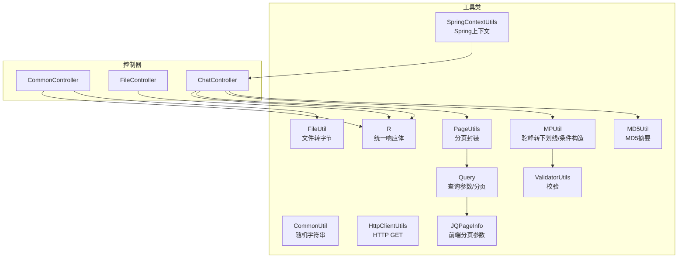
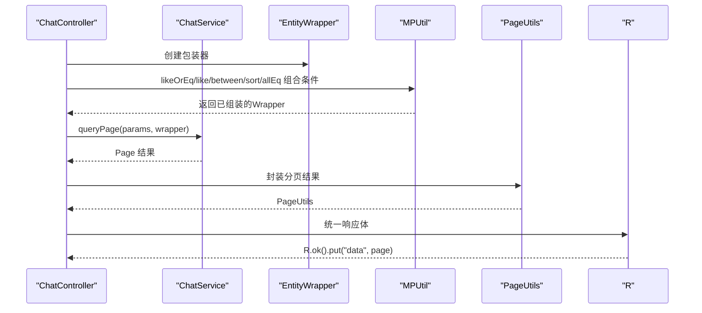
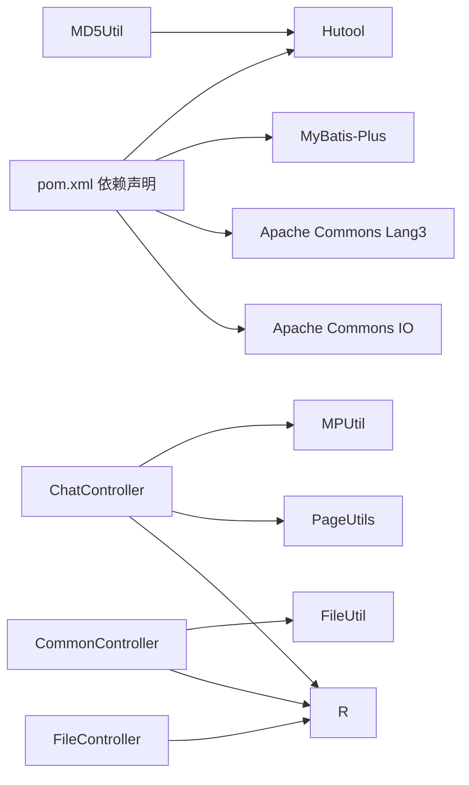

# 通用工具类

<cite>
**本文引用的文件**
- [CommonUtil.java](file://src/main/java/com/utils/CommonUtil.java)
- [MD5Util.java](file://src/main/java/com/utils/MD5Util.java)
- [HttpClientUtils.java](file://src/main/java/com/utils/HttpClientUtils.java)
- [FileUtil.java](file://src/main/java/com/utils/FileUtil.java)
- [PageUtils.java](file://src/main/java/com/utils/PageUtils.java)
- [R.java](file://src/main/java/com/utils/R.java)
- [MPUtil.java](file://src/main/java/com/utils/MPUtil.java)
- [JQPageInfo.java](file://src/main/java/com/utils/JQPageInfo.java)
- [Query.java](file://src/main/java/com/utils/Query.java)
- [ValidatorUtils.java](file://src/main/java/com/utils/ValidatorUtils.java)
- [SpringContextUtils.java](file://src/main/java/com/utils/SpringContextUtils.java)
- [ChatController.java](file://src/main/java/com/controller/ChatController.java)
- [CommonController.java](file://src/main/java/com/controller/CommonController.java)
- [FileController.java](file://src/main/java/com/controller/FileController.java)
- [pom.xml](file://pom.xml)
</cite>

## 目录
1. [简介](#简介)
2. [项目结构](#项目结构)
3. [核心组件](#核心组件)
4. [架构概览](#架构概览)
5. [详细组件分析](#详细组件分析)
6. [依赖分析](#依赖分析)
7. [性能考虑](#性能考虑)
8. [故障排查指南](#故障排查指南)
9. [结论](#结论)
10. [附录：集成与扩展指南](#附录：集成与扩展指南)

## 简介
本文件系统性梳理并解析项目中的通用工具类，重点覆盖以下方面：
- CommonUtil：提供随机字符串生成等基础能力
- MD5Util：基于Hutool的MD5摘要工具
- HttpClientUtils：基于JDK原生HttpURLConnection的HTTP GET工具
- 其他常用工具：分页封装、统一响应体、MyBatis-Plus条件构造辅助、文件读取、参数查询与校验、Spring上下文访问等
- 实战集成：结合控制器使用示例，给出调用路径与最佳实践
- 性能与扩展：分析性能特性、内存优化策略与扩展建议

## 项目结构
通用工具类集中位于 com.utils 包中，围绕“通用能力 + 数据传输 + ORM辅助 + 分页查询 + 校验 + 上下文”六大维度组织，服务于各业务控制器。

图示来源
- [CommonUtil.java:1-23](file://src/main/java/com/utils/CommonUtil.java#L1-L23)
- [MD5Util.java:1-20](file://src/main/java/com/utils/MD5Util.java#L1-L20)
- [HttpClientUtils.java:1-43](file://src/main/java/com/utils/HttpClientUtils.java#L1-L43)
- [FileUtil.java:1-28](file://src/main/java/com/utils/FileUtil.java#L1-L28)
- [PageUtils.java:1-102](file://src/main/java/com/utils/PageUtils.java#L1-L102)
- [R.java:1-52](file://src/main/java/com/utils/R.java#L1-L52)
- [MPUtil.java:1-185](file://src/main/java/com/utils/MPUtil.java#L1-L185)
- [Query.java:1-99](file://src/main/java/com/utils/Query.java#L1-L99)
- [JQPageInfo.java:1-55](file://src/main/java/com/utils/JQPageInfo.java#L1-L55)
- [ValidatorUtils.java:1-40](file://src/main/java/com/utils/ValidatorUtils.java#L1-L40)
- [SpringContextUtils.java:1-43](file://src/main/java/com/utils/SpringContextUtils.java#L1-L43)
- [CommonController.java:1-45](file://src/main/java/com/controller/CommonController.java#L1-L45)
- [FileController.java:1-42](file://src/main/java/com/controller/FileController.java#L1-L42)
- [ChatController.java:30-229](file://src/main/java/com/controller/ChatController.java#L30-L229)

章节来源
- [pom.xml:86-89](file://pom.xml#L86-L89)
- [CommonUtil.java:1-23](file://src/main/java/com/utils/CommonUtil.java#L1-L23)
- [MD5Util.java:1-20](file://src/main/java/com/utils/MD5Util.java#L1-L20)
- [HttpClientUtils.java:1-43](file://src/main/java/com/utils/HttpClientUtils.java#L1-L43)
- [FileUtil.java:1-28](file://src/main/java/com/utils/FileUtil.java#L1-L28)
- [PageUtils.java:1-102](file://src/main/java/com/utils/PageUtils.java#L1-L102)
- [R.java:1-52](file://src/main/java/com/utils/R.java#L1-L52)
- [MPUtil.java:1-185](file://src/main/java/com/utils/MPUtil.java#L1-L185)
- [Query.java:1-99](file://src/main/java/com/utils/Query.java#L1-L99)
- [JQPageInfo.java:1-55](file://src/main/java/com/utils/JQPageInfo.java#L1-L55)
- [ValidatorUtils.java:1-40](file://src/main/java/com/utils/ValidatorUtils.java#L1-L40)
- [SpringContextUtils.java:1-43](file://src/main/java/com/utils/SpringContextUtils.java#L1-L43)
- [CommonController.java:1-45](file://src/main/java/com/controller/CommonController.java#L1-L45)
- [FileController.java:1-42](file://src/main/java/com/controller/FileController.java#L1-L42)
- [ChatController.java:30-229](file://src/main/java/com/controller/ChatController.java#L30-L229)

## 核心组件
- CommonUtil：提供随机字符串生成，适用于验证码、会话标识等场景
- MD5Util：提供MD5摘要计算，便于密码摘要或数据一致性校验
- HttpClientUtils：提供HTTP GET请求能力，返回响应文本，适合简单外部接口拉取
- FileUtil：提供文件到字节数组的转换，便于存储或网络传输
- PageUtils：封装分页结果，简化控制器返回结构
- R：统一响应体，标准化接口返回字段
- MPUtil：ORM条件构造辅助，支持驼峰字段转下划线、模糊/精确/范围/排序组合
- Query/JQPageInfo：接收前端分页与排序参数，构建安全的分页对象
- ValidatorUtils：基于Hibernate Validator的实体校验工具
- SpringContextUtils：提供静态获取Bean的能力，便于工具类内使用Spring容器

章节来源
- [CommonUtil.java:12-21](file://src/main/java/com/utils/CommonUtil.java#L12-L21)
- [MD5Util.java:13-17](file://src/main/java/com/utils/MD5Util.java#L13-L17)
- [HttpClientUtils.java:20-39](file://src/main/java/com/utils/HttpClientUtils.java#L20-L39)
- [FileUtil.java:14-26](file://src/main/java/com/utils/FileUtil.java#L14-L26)
- [PageUtils.java:33-50](file://src/main/java/com/utils/PageUtils.java#L33-L50)
- [R.java:12-45](file://src/main/java/com/utils/R.java#L12-L45)
- [MPUtil.java:22-99](file://src/main/java/com/utils/MPUtil.java#L22-L99)
- [Query.java:29-52](file://src/main/java/com/utils/Query.java#L29-L52)
- [JQPageInfo.java:4-12](file://src/main/java/com/utils/JQPageInfo.java#L4-L12)
- [ValidatorUtils.java:29-36](file://src/main/java/com/utils/ValidatorUtils.java#L29-L36)
- [SpringContextUtils.java:23-29](file://src/main/java/com/utils/SpringContextUtils.java#L23-L29)

## 架构概览
通用工具类在控制器层被广泛复用，形成“控制器 -> 服务层 -> 工具类”的清晰调用链。分页与响应体统一由工具类负责，ORM条件构造通过MPUtil解耦复杂查询逻辑。

图示来源
- [ChatController.java:58-67](file://src/main/java/com/controller/ChatController.java#L58-L67)
- [MPUtil.java:60-99](file://src/main/java/com/utils/MPUtil.java#L60-L99)
- [PageUtils.java:44-50](file://src/main/java/com/utils/PageUtils.java#L44-L50)
- [R.java:37-45](file://src/main/java/com/utils/R.java#L37-L45)

## 详细组件分析

### CommonUtil：随机字符串生成
- 功能要点
  - 输入长度参数，输出指定长度的字母+数字组合
  - 使用固定字符集与随机索引拼接
- 复杂度与性能
  - 时间复杂度 O(n)，空间复杂度 O(n)
  - 字符串拼接使用可变缓冲区，避免频繁扩容
- 应用场景
  - 验证码生成、临时会话ID、令牌标识等
- 注意事项
  - 若需更高安全性，建议引入加密安全随机源

章节来源
- [CommonUtil.java:12-21](file://src/main/java/com/utils/CommonUtil.java#L12-L21)

### MD5Util：MD5摘要工具
- 功能要点
  - 提供带密钥/不带密钥的摘要方法（当前实现为不带密钥）
  - 基于Hutool的MD5Hex实现
- 算法与安全
  - MD5为单向散列函数，适合数据一致性校验与轻量级摘要
  - 不推荐用于密码存储；如需密码摘要，建议使用加盐哈希（例如SHA-256/BCrypt）
- 应用场景
  - 文件完整性校验、缓存键生成、签名摘要等
- 扩展建议
  - 可增加带密钥的摘要方法，以满足消息认证需求

章节来源
- [MD5Util.java:13-17](file://src/main/java/com/utils/MD5Util.java#L13-L17)
- [pom.xml:86-89](file://pom.xml#L86-L89)

### HttpClientUtils：HTTP GET请求
- 功能要点
  - 接收URL，发起GET请求，按UTF-8读取响应文本
  - 异常时打印堆栈并返回空结果
- 复杂度与性能
  - IO密集型，时间复杂度取决于网络与目标服务
  - 单次读取采用缓冲流，减少IO次数
- 配置与限制
  - 仅支持GET
  - 默认字符集为UTF-8
  - 未设置超时、重试、连接池等高级选项
- 改进建议
  - 增加超时配置、连接池、重试机制
  - 支持更多HTTP方法与头部设置
  - 返回更丰富的状态信息（状态码、响应头）

章节来源
- [HttpClientUtils.java:20-39](file://src/main/java/com/utils/HttpClientUtils.java#L20-L39)

### FileUtil：文件转字节数组
- 功能要点
  - 将文件输入流转为字节数组，便于存储或网络传输
  - 使用固定大小缓冲区循环读取
- 复杂度与性能
  - 时间复杂度 O(n)，空间复杂度 O(n)
  - 缓冲区大小适中，兼顾内存占用与IO效率
- 使用建议
  - 对大文件建议分块处理或流式传输
  - 注意关闭流与异常处理

章节来源
- [FileUtil.java:14-26](file://src/main/java/com/utils/FileUtil.java#L14-L26)

### PageUtils：分页结果封装
- 功能要点
  - 支持直接传入列表与总数，或传入MyBatis-Plus Page对象
  - 计算总页数、当前页、每页条数等
- 复杂度与性能
  - 封装类，O(1)操作
- 使用建议
  - 与Query配合，确保排序与范围参数安全

章节来源
- [PageUtils.java:33-50](file://src/main/java/com/utils/PageUtils.java#L33-L50)

### R：统一响应体
- 功能要点
  - 继承Map，默认包含code字段
  - 提供错误/成功便捷方法，支持链式put
- 使用建议
  - 控制器统一返回R.ok()/R.error()，保证前后端契约一致

章节来源
- [R.java:12-45](file://src/main/java/com/utils/R.java#L12-L45)

### MPUtil：ORM条件构造辅助
- 功能要点
  - 驼峰字段转下划线，支持带前缀的列名映射
  - 组合like/eq/between/sort等条件，支持链式and
- 复杂度与性能
  - 条件组装为O(n)遍历，n为参数数量
- 安全性
  - 与Query配合，对排序字段进行SQL注入过滤
- 使用建议
  - 优先使用MPUtil生成条件，避免手写SQL拼接

章节来源
- [MPUtil.java:165-183](file://src/main/java/com/utils/MPUtil.java#L165-L183)
- [MPUtil.java:46-58](file://src/main/java/com/utils/MPUtil.java#L46-L58)
- [MPUtil.java:88-99](file://src/main/java/com/utils/MPUtil.java#L88-L99)
- [MPUtil.java:102-119](file://src/main/java/com/utils/MPUtil.java#L102-L119)
- [MPUtil.java:121-134](file://src/main/java/com/utils/MPUtil.java#L121-L134)

### Query/JQPageInfo：查询参数与分页
- 功能要点
  - 接收前端分页与排序参数，构建Page对象
  - 对排序字段进行SQL注入过滤
- 复杂度与性能
  - 参数解析与Page对象创建为O(1)
- 使用建议
  - 前端传递page/limit/sidx/order，后端直接构造Query

章节来源
- [Query.java:29-52](file://src/main/java/com/utils/Query.java#L29-L52)
- [Query.java:55-84](file://src/main/java/com/utils/Query.java#L55-L84)
- [JQPageInfo.java:4-12](file://src/main/java/com/utils/JQPageInfo.java#L4-L12)

### ValidatorUtils：实体校验
- 功能要点
  - 基于Hibernate Validator，校验失败抛出自定义异常
- 使用建议
  - 在控制器或服务层对入参进行前置校验

章节来源
- [ValidatorUtils.java:29-36](file://src/main/java/com/utils/ValidatorUtils.java#L29-L36)

### SpringContextUtils：Spring上下文访问
- 功能要点
  - 提供静态获取Bean的方法，便于工具类内使用Spring容器
- 使用建议
  - 仅在工具类中使用，避免在业务层滥用

章节来源
- [SpringContextUtils.java:23-29](file://src/main/java/com/utils/SpringContextUtils.java#L23-L29)

## 依赖分析
- 外部库
  - Hutool：提供MD5摘要等加密工具
  - MyBatis-Plus：提供Page与Wrapper等ORM能力
  - Apache Commons Lang3/IO：提供字符串处理与IO工具
- 内部依赖
  - 控制器广泛依赖工具类，形成清晰的横切关注点
  - MPUtil与Query共同承担ORM条件构造与分页职责

图示来源
- [pom.xml:86-89](file://pom.xml#L86-L89)
- [MD5Util.java:3-3](file://src/main/java/com/utils/MD5Util.java#L3-L3)
- [ChatController.java:34-36](file://src/main/java/com/controller/ChatController.java#L34-L36)
- [CommonController.java:34-34](file://src/main/java/com/controller/CommonController.java#L34-L34)
- [FileController.java:34-34](file://src/main/java/com/controller/FileController.java#L34-L34)

章节来源
- [pom.xml:24-128](file://pom.xml#L24-L128)

## 性能考虑
- I/O与内存
  - FileUtil与HttpClientUtils均为IO密集型，注意缓冲区大小与流关闭
  - PageUtils与R为纯内存对象，开销极低
- CPU与算法
  - CommonUtil与MD5Util均为线性复杂度，适合高频调用
  - MPUtil的条件组装为线性遍历，参数较多时应控制入参规模
- 并发与线程安全
  - 工具类多为静态方法，注意避免共享可变状态
  - HttpClientUtils未做线程安全封装，建议在高并发场景引入连接池
- 资源管理
  - IO相关工具需确保资源释放，避免内存泄漏

## 故障排查指南
- MD5摘要结果不符合预期
  - 确认输入文本编码与Hutool默认行为一致
  - 如需加盐或不同算法，扩展工具类方法
- HTTP请求失败
  - 检查URL合法性与网络连通性
  - 增加超时与异常日志，定位问题
- 分页排序异常
  - 确认前端传递的排序字段与后端允许字段一致
  - 检查Query对排序字段的过滤是否生效
- 文件读取异常
  - 检查文件路径与权限
  - 大文件建议分块处理或改用流式传输

章节来源
- [MD5Util.java:13-17](file://src/main/java/com/utils/MD5Util.java#L13-L17)
- [HttpClientUtils.java:20-39](file://src/main/java/com/utils/HttpClientUtils.java#L20-L39)
- [Query.java:40-41](file://src/main/java/com/utils/Query.java#L40-L41)
- [FileUtil.java:14-26](file://src/main/java/com/utils/FileUtil.java#L14-L26)

## 结论
本项目通用工具类以简洁、实用为核心，覆盖了随机字符串、摘要、HTTP请求、文件处理、分页、响应体、ORM条件构造、参数校验与Spring上下文访问等关键能力。通过在控制器层的统一使用，提升了代码复用性与一致性。建议在高并发与安全性要求更高的场景下，进一步完善HTTP客户端、加密算法与资源管理策略。

## 附录：集成与扩展指南

### 集成使用示例（路径指引）
- 控制器中使用分页与条件构造
  - 示例路径：[ChatController.java:58-67](file://src/main/java/com/controller/ChatController.java#L58-L67)
  - 关键调用：MPUtil.likeOrEq/MPUtil.between/MPUtil.sort 与 PageUtils 构造
- 统一响应体返回
  - 示例路径：[ChatController.java:64-66](file://src/main/java/com/controller/ChatController.java#L64-L66)
  - 关键调用：R.ok().put("data", page)
- 文件上传与字节转换
  - 示例路径：[FileController.java:34-34](file://src/main/java/com/controller/FileController.java#L34-L34)
  - 关键调用：R.ok() 返回统一结构
- 文件读取
  - 示例路径：[CommonController.java:34-34](file://src/main/java/com/controller/CommonController.java#L34-L34)
  - 关键调用：FileUtil.FileToByte(file)
- MD5摘要
  - 示例路径：[ChatController.java:34-34](file://src/main/java/com/controller/ChatController.java#L34-L34)
  - 关键调用：MD5Util.md5(text)

章节来源
- [ChatController.java:58-67](file://src/main/java/com/controller/ChatController.java#L58-L67)
- [FileController.java:34-34](file://src/main/java/com/controller/FileController.java#L34-L34)
- [CommonController.java:34-34](file://src/main/java/com/controller/CommonController.java#L34-L34)

### 扩展方法与自定义功能
- HTTP客户端增强
  - 新增超时配置、连接池、重试与头部设置
  - 支持更多HTTP方法（POST/PUT/DELETE）与JSON请求体
- MD5工具扩展
  - 增加带密钥摘要方法
  - 提供多种摘要算法选择（SHA-256/BCrypt等）
- 分页与排序安全
  - 前端允许的排序字段白名单
  - 对非法字段直接拒绝或降级为默认排序
- 资源与异常处理
  - 统一封装IO异常与超时异常
  - 提供资源自动回收与断言检查