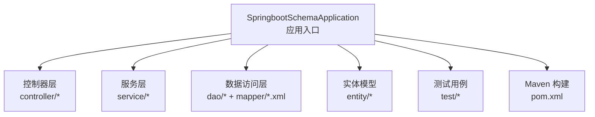
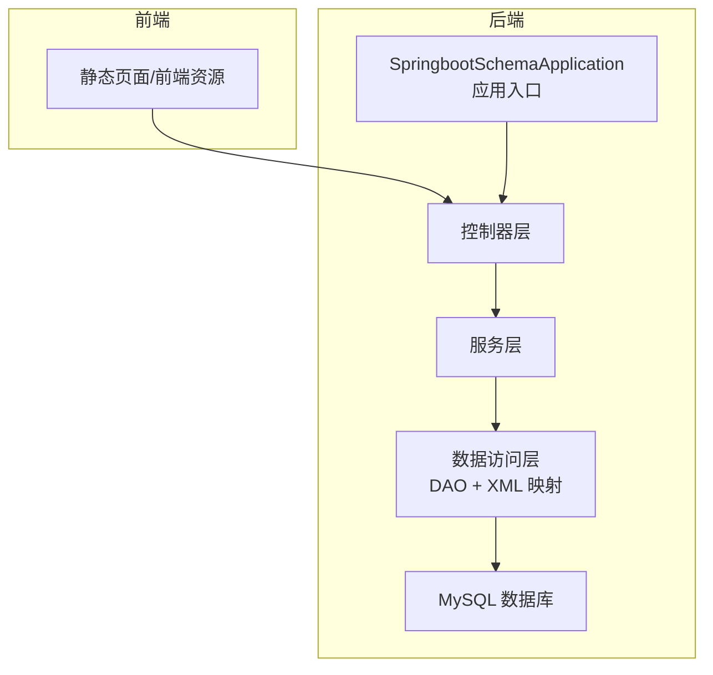
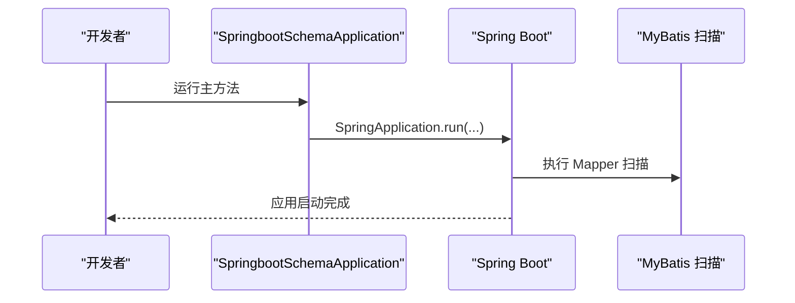
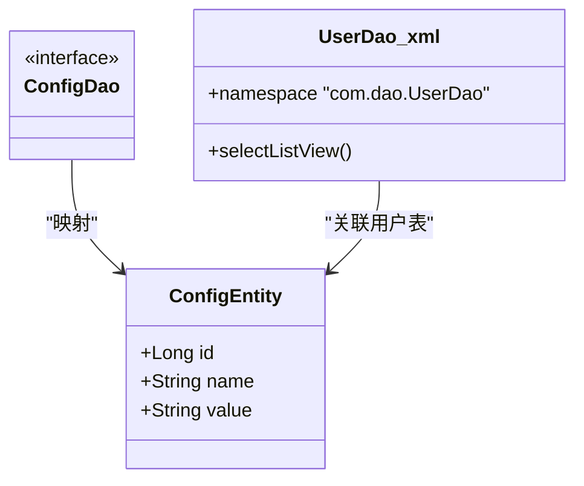
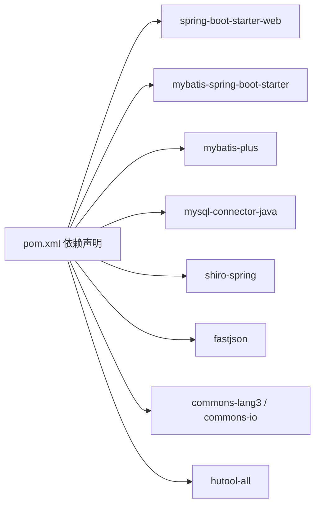

# 快速开始

<cite>
**本文引用的文件**
- [pom.xml](file://pom.xml)
- [SpringbootSchemaApplication.java](file://src/main/java/com/SpringbootSchemaApplication.java)
- [README.md](file://README.md)
- [UserDao.xml](file://src/main/resources/mapper/UserDao.xml)
- [ConfigDao.java](file://src/main/java/com/dao/ConfigDao.java)
- [ConfigEntity.java](file://src/main/java/com/entity/ConfigEntity.java)
- [SpringbootSchemaApplicationTests.java](file://src/test/java/com/SpringbootSchemaApplicationTests.java)
</cite>

## 目录
1. [简介](#简介)
2. [项目结构](#项目结构)
3. [核心组件](#核心组件)
4. [架构总览](#架构总览)
5. [详细组件分析](#详细组件分析)
6. [依赖分析](#依赖分析)
7. [性能考虑](#性能考虑)
8. [故障排除指南](#故障排除指南)
9. [结论](#结论)
10. [附录](#附录)

## 简介
本指南面向首次接触自习室管理系统的开发者，帮助你在30分钟内完成从环境准备到系统启动的全流程。你将学会：
- 安装并验证 JDK 1.8、IDE（如 IDEA/Eclipse）、MySQL（5.7/8.x）、Maven 环境
- 克隆项目、初始化数据库、安装依赖
- 配置关键参数（数据库连接、端口等）
- 启动应用并访问前端页面
- 排查常见问题与验证环境

## 项目结构
该项目为基于 Spring Boot 的后端服务，采用 Maven 构建，使用 MyBatis/MyBatis-Plus 进行数据访问层开发。主要结构包括：
- 后端入口类与扫描配置
- 控制器、服务、DAO、实体与 XML 映射
- 测试用例
- Maven 依赖与构建配置

图表来源
- [SpringbootSchemaApplication.java:1-22](file://src/main/java/com/SpringbootSchemaApplication.java#L1-L22)
- [pom.xml:1-140](file://pom.xml#L1-L140)

章节来源
- [SpringbootSchemaApplication.java:1-22](file://src/main/java/com/SpringbootSchemaApplication.java#L1-L22)
- [pom.xml:1-140](file://pom.xml#L1-L140)

## 核心组件
- 应用入口与扫描配置
  - 使用注解扫描 DAO 包，启用 Spring Boot 自动装配
  - 提供 Servlet 初始化支持
- 数据访问层
  - 使用 MyBatis/MyBatis-Plus，DAO 接口继承基础映射接口
  - XML 映射文件定义 SQL 语句与结果映射
- 测试
  - 提供基础上下文加载测试用例

章节来源
- [SpringbootSchemaApplication.java:1-22](file://src/main/java/com/SpringbootSchemaApplication.java#L1-L22)
- [ConfigDao.java:1-12](file://src/main/java/com/dao/ConfigDao.java#L1-L12)
- [ConfigEntity.java:1-53](file://src/main/java/com/entity/ConfigEntity.java#L1-L53)
- [UserDao.xml:1-13](file://src/main/resources/mapper/UserDao.xml#L1-L13)
- [SpringbootSchemaApplicationTests.java:1-13](file://src/test/java/com/SpringbootSchemaApplicationTests.java#L1-L13)

## 架构总览
系统采用前后端分离架构：后端提供 REST 接口，前端通过静态页面或打包后的资源进行交互。后端通过 Spring Boot 启动，MyBatis 负责数据库访问。

图表来源
- [SpringbootSchemaApplication.java:1-22](file://src/main/java/com/SpringbootSchemaApplication.java#L1-L22)
- [UserDao.xml:1-13](file://src/main/resources/mapper/UserDao.xml#L1-L13)

## 详细组件分析

### 应用入口与启动流程
- 应用入口类负责启动 Spring Boot 并启用 MyBatis Mapper 扫描
- 通过主方法直接运行，无需额外容器配置

图表来源
- [SpringbootSchemaApplication.java:13-20](file://src/main/java/com/SpringbootSchemaApplication.java#L13-L20)

章节来源
- [SpringbootSchemaApplication.java:1-22](file://src/main/java/com/SpringbootSchemaApplication.java#L1-L22)

### 数据访问层（DAO + XML）
- DAO 接口继承 MyBatis-Plus 基础映射接口，提供通用 CRUD 能力
- XML 映射文件定义命名空间与 SQL 片段，结合条件构造器实现动态查询

图表来源
- [ConfigDao.java:1-12](file://src/main/java/com/dao/ConfigDao.java#L1-L12)
- [ConfigEntity.java:1-53](file://src/main/java/com/entity/ConfigEntity.java#L1-L53)
- [UserDao.xml:1-13](file://src/main/resources/mapper/UserDao.xml#L1-L13)

章节来源
- [ConfigDao.java:1-12](file://src/main/java/com/dao/ConfigDao.java#L1-L12)
- [ConfigEntity.java:1-53](file://src/main/java/com/entity/ConfigEntity.java#L1-L53)
- [UserDao.xml:1-13](file://src/main/resources/mapper/UserDao.xml#L1-L13)

### 测试组件
- 提供基础的上下文加载测试，用于验证应用上下文是否能正确启动

章节来源
- [SpringbootSchemaApplicationTests.java:1-13](file://src/test/java/com/SpringbootSchemaApplicationTests.java#L1-L13)

## 依赖分析
项目使用 Maven 构建，核心依赖包括：
- Spring Boot Web：提供 Web 开发能力
- MyBatis/MyBatis-Plus：持久层框架与增强工具
- MySQL Connector/J：数据库驱动
- Shiro：安全框架
- FastJSON：JSON 处理
- 其他工具库：Apache Commons Lang、Hutool、Protobuf 等

图表来源
- [pom.xml:24-128](file://pom.xml#L24-L128)

章节来源
- [pom.xml:1-140](file://pom.xml#L1-L140)

## 性能考虑
- 使用 MyBatis-Plus 可减少重复 SQL 编写，提升开发效率
- 合理分页与条件查询可降低数据库压力
- 前端静态资源建议开启缓存与压缩以优化加载速度

## 故障排除指南
- 启动失败（端口占用）
  - 检查应用端口是否被占用，必要时修改端口配置
- 数据库连接异常
  - 确认数据库已安装并启动，账号密码与主机地址正确
- MyBatis 映射错误
  - 检查 XML 命名空间与 SQL 片段是否匹配实体字段
- 依赖下载失败
  - 检查网络与 Maven 仓库配置，必要时更换镜像源
- 前端页面无法访问
  - 确认后端已启动且静态资源路径正确

## 结论
通过本指南，你可以在短时间内完成环境准备、项目初始化与系统启动。建议在本地先完成数据库与依赖配置，再逐步验证各模块功能，最后部署至生产环境。

## 附录

### 开发环境配置清单
- JDK 1.8：确保 JAVA_HOME 与 PATH 正确配置
- IDE：推荐 IDEA 或 Eclipse，导入 Maven 项目
- MySQL：安装 5.7 或 8.x，创建数据库与用户
- Maven：安装并配置本地仓库与镜像源
- Git：用于克隆项目

章节来源
- [README.md:19-26](file://README.md#L19-L26)

### 项目克隆与数据库初始化
- 克隆项目
  - 使用 Git 工具克隆仓库到本地
- 初始化数据库
  - 创建数据库与用户
  - 执行提供的 SQL 脚本初始化表结构与基础数据
- 安装依赖
  - 在项目根目录执行 Maven 命令安装依赖

章节来源
- [README.md:28-31](file://README.md#L28-L31)

### 关键配置项说明（以 Maven 属性为主）
- Java 版本
  - 保持 JDK 1.8，避免兼容性问题
- 依赖版本
  - MyBatis/MyBatis-Plus、MySQL 驱动、Shiro 等版本需与 Spring Boot 版本匹配
- 插件配置
  - Spring Boot Maven 插件用于打包与运行

章节来源
- [pom.xml:18-22](file://pom.xml#L18-L22)
- [pom.xml:130-137](file://pom.xml#L130-L137)

### 项目启动步骤与访问方式
- 启动应用
  - 在项目根目录执行 Maven 命令启动 Spring Boot 应用
- 访问前端页面
  - 通过浏览器访问后端提供的静态页面或前端资源
- 初始登录凭证
  - 默认管理员账户与密码请参考项目文档或数据库初始化脚本

章节来源
- [SpringbootSchemaApplication.java:13-15](file://src/main/java/com/SpringbootSchemaApplication.java#L13-L15)
- [README.md:34-58](file://README.md#L34-L58)

### 环境验证方法
- 启动日志
  - 观察控制台输出，确认应用启动成功
- 数据库连通性
  - 使用数据库客户端连接并执行简单查询
- 接口可用性
  - 使用浏览器或接口调试工具访问常用接口，验证返回状态

章节来源
- [SpringbootSchemaApplicationTests.java:9-11](file://src/test/java/com/SpringbootSchemaApplicationTests.java#L9-L11)