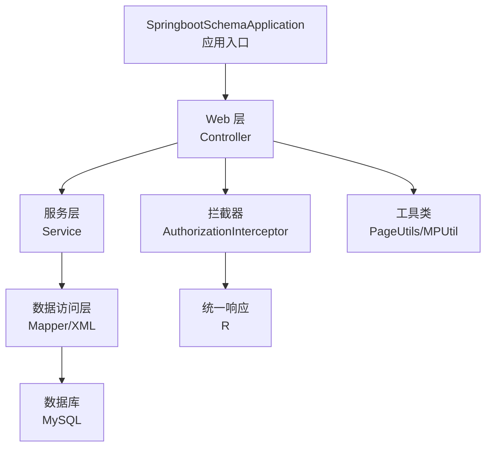
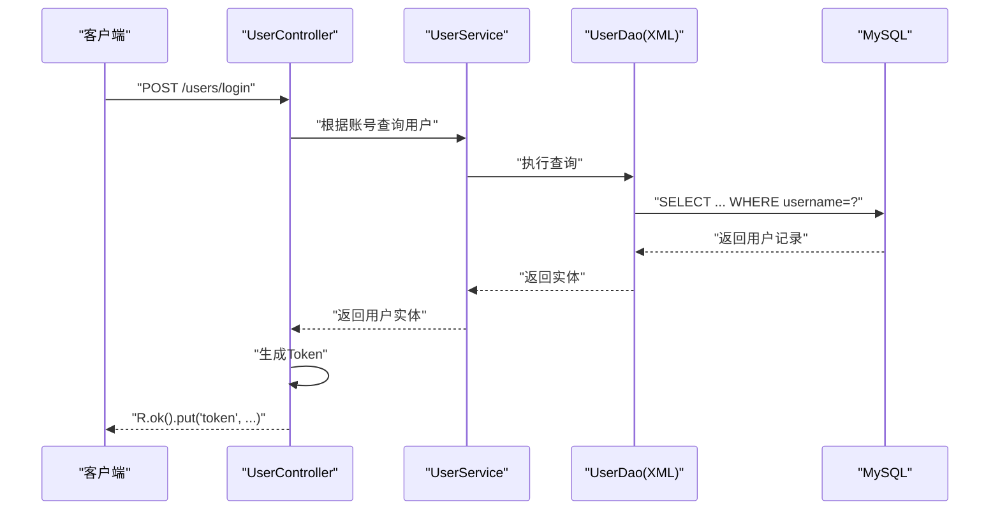
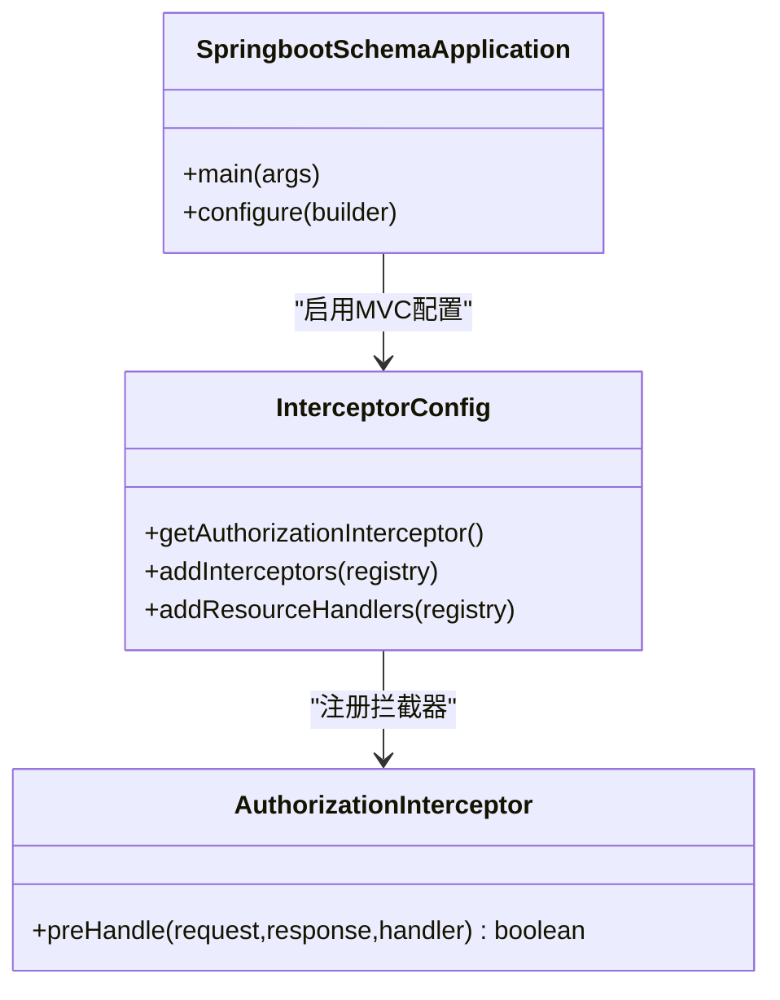
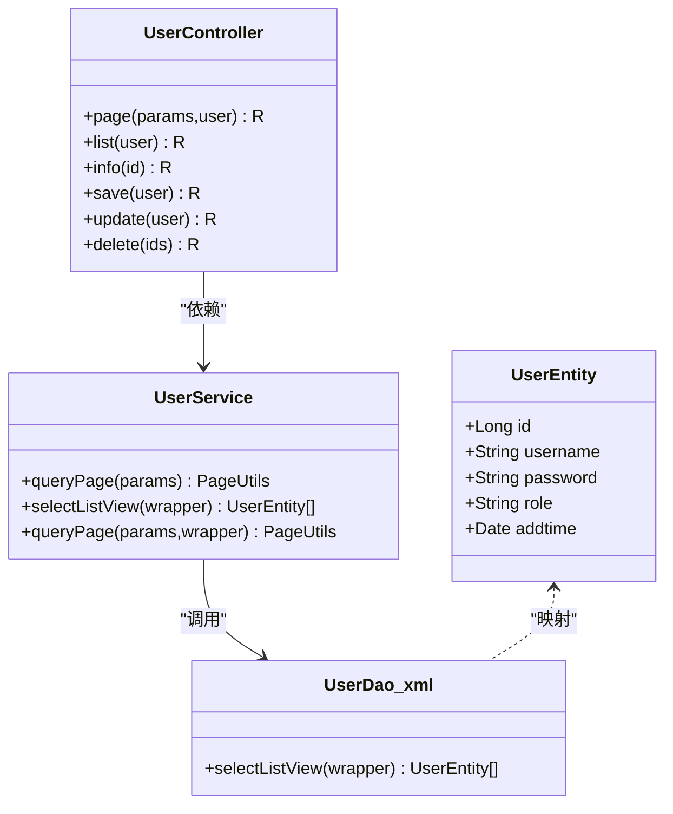
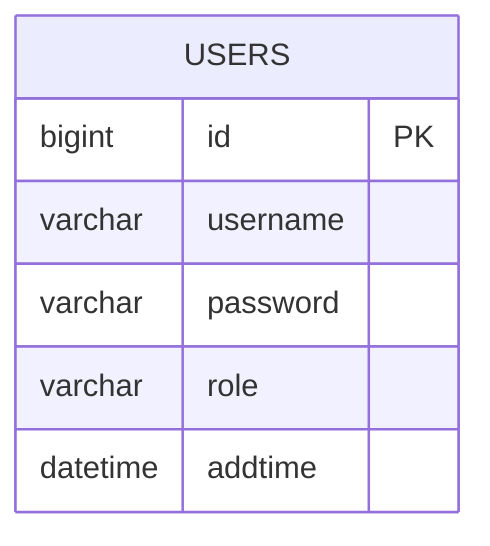
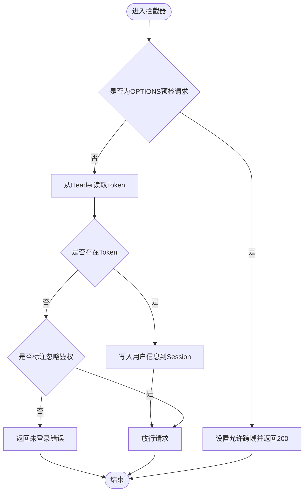
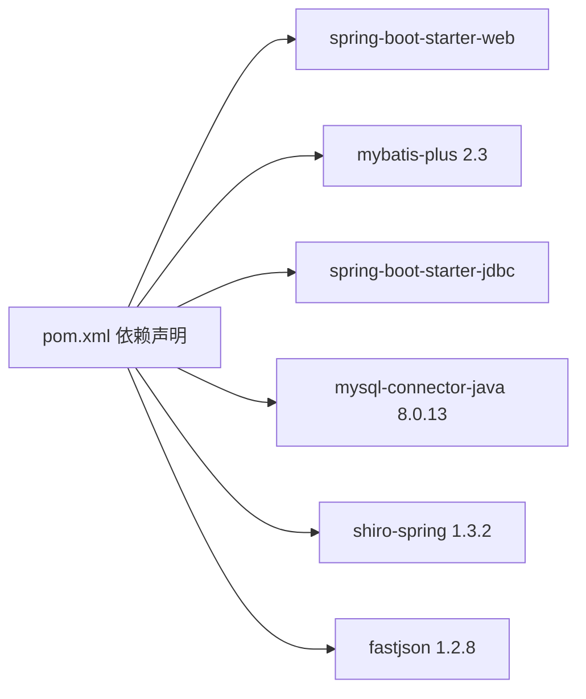

# 技术栈详解

<cite>
**本文引用的文件**   
- [SpringbootSchemaApplication.java](file://src/main/java/com/SpringbootSchemaApplication.java)
- [pom.xml](file://pom.xml)
- [README.md](file://README.md)
- [MybatisPlusConfig.java](file://src/main/java/com/config/MybatisPlusConfig.java)
- [InterceptorConfig.java](file://src/main/java/com/config/InterceptorConfig.java)
- [AuthorizationInterceptor.java](file://src/main/java/com/interceptor/AuthorizationInterceptor.java)
- [LoginUser.java](file://src/main/java/com/annotation/LoginUser.java)
- [APPLoginUser.java](file://src/main/java/com/annotation/APPLoginUser.java)
- [IgnoreAuth.java](file://src/main/java/com/annotation/IgnoreAuth.java)
- [UserEntity.java](file://src/main/java/com/entity/UserEntity.java)
- [UserService.java](file://src/main/java/com/service/UserService.java)
- [UserController.java](file://src/main/java/com/controller/UserController.java)
- [R.java](file://src/main/java/com/utils/R.java)
- [PageUtils.java](file://src/main/java/com/utils/PageUtils.java)
- [UserDao.xml](file://src/main/resources/mapper/UserDao.xml)
</cite>

## 目录
1. [简介](#简介)
2. [项目结构](#项目结构)
3. [核心组件](#核心组件)
4. [架构总览](#架构总览)
5. [详细组件分析](#详细组件分析)
6. [依赖分析](#依赖分析)
7. [性能考虑](#性能考虑)
8. [故障排查指南](#故障排查指南)
9. [结论](#结论)
10. [附录](#附录)

## 简介
本项目是一个基于 Spring Boot 的自习室管理系统，采用前后端分离架构：后端使用 Spring Boot + MyBatis-Plus 提供 REST 接口与业务逻辑；前端采用 Vue.js 与 HTML 构建页面，通过统一返回体与拦截器实现鉴权与跨域处理。系统支持管理员与学生两类角色，涵盖用户管理、座位预约、公告管理等功能。

## 项目结构
项目采用标准 Maven 多模块布局，核心目录与职责如下：
- src/main/java：后端 Java 源码
  - com.annotation：自定义注解（如登录用户注入、忽略鉴权）
  - com.config：Spring 配置（拦截器、MyBatis-Plus 分页）
  - com.controller：REST 控制器层
  - com.dao：Mapper 接口
  - com.entity：实体模型、视图对象、值对象
  - com.interceptor：全局拦截器
  - com.service：服务层接口与实现
  - com.utils：工具类（统一响应、分页、校验等）
  - com/SpringbootSchemaApplication.java：应用入口
- src/main/resources：资源文件
  - mapper：MyBatis XML 映射
  - front/front：前端静态资源（HTML、CSS、JS、第三方库）
- pom.xml：Maven 依赖与构建配置
- README.md：项目说明与功能截图

**图表来源**
- [SpringbootSchemaApplication.java:1-22](file://src/main/java/com/SpringbootSchemaApplication.java#L1-L22)
- [AuthorizationInterceptor.java:1-96](file://src/main/java/com/interceptor/AuthorizationInterceptor.java#L1-L96)
- [R.java:1-52](file://src/main/java/com/utils/R.java#L1-L52)
- [PageUtils.java:1-102](file://src/main/java/com/utils/PageUtils.java#L1-L102)

**章节来源**
- [SpringbootSchemaApplication.java:1-22](file://src/main/java/com/SpringbootSchemaApplication.java#L1-L22)
- [pom.xml:1-140](file://pom.xml#L1-L140)
- [README.md:1-64](file://README.md#L1-L64)

## 核心组件
- 应用入口与扫描
  - 使用注解启用 Spring Boot 自动装配与 Mapper 扫描，指定扫描包路径为 com.dao。
- 拦截器与鉴权
  - 全局拦截所有请求，支持跨域预检放行，读取请求头中的 Token 并写入 Session，对标注忽略鉴权的接口放行。
- 统一响应体
  - R 类封装通用响应结构，便于前端统一处理。
- 分页工具
  - PageUtils 封装 MyBatis-Plus 分页结果，提供总条数、页码、列表等字段。
- 控制器示例
  - UserController 提供登录、注册、列表、详情、保存、修改、删除等接口，并结合工具类与服务层完成业务流程。

**章节来源**
- [SpringbootSchemaApplication.java:9-11](file://src/main/java/com/SpringbootSchemaApplication.java#L9-L11)
- [InterceptorConfig.java:1-39](file://src/main/java/com/config/InterceptorConfig.java#L1-L39)
- [AuthorizationInterceptor.java:36-94](file://src/main/java/com/interceptor/AuthorizationInterceptor.java#L36-L94)
- [R.java:9-51](file://src/main/java/com/utils/R.java#L9-L51)
- [PageUtils.java:13-101](file://src/main/java/com/utils/PageUtils.java#L13-L101)
- [UserController.java:38-175](file://src/main/java/com/controller/UserController.java#L38-L175)

## 架构总览
系统采用经典的三层架构与 MVC 模式：
- 表现层（Controller）：接收请求、参数校验、调用服务、返回统一响应
- 业务层（Service）：组合 DAO 与工具类，执行领域逻辑
- 数据访问层（DAO/MyBatis）：SQL 映射与分页插件
- 安全层（拦截器）：统一鉴权、跨域处理、会话注入

**图表来源**
- [UserController.java:51-60](file://src/main/java/com/controller/UserController.java#L51-L60)
- [UserService.java:18-25](file://src/main/java/com/service/UserService.java#L18-L25)
- [UserDao.xml:6-11](file://src/main/resources/mapper/UserDao.xml#L6-L11)

## 详细组件分析

### Spring Boot 核心配置与特性
- 自动配置
  - 应用入口启用自动装配，配合 Starter 依赖简化配置。
- 依赖注入
  - 控制器、服务、拦截器均通过注解进行依赖注入，遵循 Spring IoC 容器管理。
- Web MVC
  - 通过 WebMvcConfigurationSupport 注册拦截器与静态资源处理器，确保静态资源可访问且拦截规则生效。

**图表来源**
- [SpringbootSchemaApplication.java:9-20](file://src/main/java/com/SpringbootSchemaApplication.java#L9-L20)
- [InterceptorConfig.java:12-38](file://src/main/java/com/config/InterceptorConfig.java#L12-L38)
- [AuthorizationInterceptor.java:29-94](file://src/main/java/com/interceptor/AuthorizationInterceptor.java#L29-L94)

**章节来源**
- [SpringbootSchemaApplication.java:9-20](file://src/main/java/com/SpringbootSchemaApplication.java#L9-L20)
- [InterceptorConfig.java:12-38](file://src/main/java/com/config/InterceptorConfig.java#L12-L38)

### MyBatis-Plus ORM 配置与使用
- 配置
  - 在配置类中注册分页插件，实现自动分页增强。
- 实体映射
  - 实体类使用注解标识表名与主键策略。
- CRUD 与分页
  - 控制器通过服务层调用分页查询与列表查询，工具类封装分页结果。

**图表来源**
- [UserEntity.java:13-77](file://src/main/java/com/entity/UserEntity.java#L13-L77)
- [UserService.java:18-25](file://src/main/java/com/service/UserService.java#L18-L25)
- [UserController.java:103-173](file://src/main/java/com/controller/UserController.java#L103-L173)
- [UserDao.xml:6-11](file://src/main/resources/mapper/UserDao.xml#L6-L11)

**章节来源**
- [MybatisPlusConfig.java:14-24](file://src/main/java/com/config/MybatisPlusConfig.java#L14-L24)
- [UserEntity.java:13-77](file://src/main/java/com/entity/UserEntity.java#L13-L77)
- [UserService.java:18-25](file://src/main/java/com/service/UserService.java#L18-L25)
- [UserController.java:103-173](file://src/main/java/com/controller/UserController.java#L103-L173)
- [UserDao.xml:6-11](file://src/main/resources/mapper/UserDao.xml#L6-L11)

### Vue.js 前端集成与组件化
- 集成方式
  - 前端静态资源位于 resources/front/front，包含 HTML 页面、CSS、JS 与第三方库（如 ElementUI、Layui、TinyMCE、Vue 等），通过 HTTP 模块与后端交互。
- 组件化开发
  - 页面以模块化 HTML 为主，结合 JS 工具函数与第三方组件库实现交互与展示；与后端通过统一响应体 R 进行数据交换。

**章节来源**
- [README.md:13-17](file://README.md#L13-L17)

### 数据库设计与表关系
- 用户表（users）
  - 字段包含主键、账号、密码、角色、创建时间等，用于登录与权限控制。
- 其他实体（如公告、座位预约、消息等）
  - 对应实体类与 Mapper/XML 文件，遵循统一命名规范与分页查询模式。

**图表来源**
- [UserEntity.java:17-35](file://src/main/java/com/entity/UserEntity.java#L17-L35)

**章节来源**
- [UserEntity.java:13-77](file://src/main/java/com/entity/UserEntity.java#L13-L77)

### 拦截器、注解与工具类
- 拦截器
  - AuthorizationInterceptor 支持跨域、读取 Token、写入 Session、对标注忽略鉴权的接口放行。
- 注解
  - IgnoreAuth：用于跳过鉴权
  - LoginUser：用于参数注入登录用户信息（注解定义，具体解析在控制器或拦截器中）
  - APPLoginUser：用于移动端或 APP 场景的用户注入（注解定义）
- 工具类
  - R：统一响应体，包含 code、msg、数据字段
  - PageUtils：封装分页结果，包含总记录数、页大小、总页数、当前页、列表

**图表来源**
- [AuthorizationInterceptor.java:36-94](file://src/main/java/com/interceptor/AuthorizationInterceptor.java#L36-L94)

**章节来源**
- [AuthorizationInterceptor.java:29-94](file://src/main/java/com/interceptor/AuthorizationInterceptor.java#L29-L94)
- [IgnoreAuth.java](file://src/main/java/com/annotation/IgnoreAuth.java)
- [LoginUser.java:11-15](file://src/main/java/com/annotation/LoginUser.java#L11-L15)
- [APPLoginUser.java](file://src/main/java/com/annotation/APPLoginUser.java)
- [R.java:9-51](file://src/main/java/com/utils/R.java#L9-L51)
- [PageUtils.java:13-101](file://src/main/java/com/utils/PageUtils.java#L13-L101)

## 依赖分析
- 后端依赖
  - Spring Boot Starter Web：提供 Web 开发能力
  - MyBatis-Plus：ORM 与分页增强
  - MySQL Connector/J：数据库驱动
  - Shiro：安全框架（注：项目中引入但未见显式配置类）
  - FastJSON：序列化工具
- 前端资源
  - Vue.js、ElementUI、Layui、TinyMCE 等静态资源位于 resources/front/front

**图表来源**
- [pom.xml:24-128](file://pom.xml#L24-L128)

**章节来源**
- [pom.xml:18-128](file://pom.xml#L18-L128)

## 性能考虑
- 分页优化
  - 使用 MyBatis-Plus 分页插件，避免一次性加载大量数据；合理设置页大小与索引。
- 查询优化
  - 在 XML 中使用条件拼接与 where 片段，注意 SQL 安全（参考 SQLFilter 工具类思路）。
- 缓存与会话
  - 拦截器将用户信息写入 Session，减少重复鉴权开销；建议结合 Redis 实现分布式会话。
- 跨域与静态资源
  - 明确跨域头与静态资源映射，避免不必要的请求往返。

[本节为通用指导，不直接分析具体文件]

## 故障排查指南
- 登录失败
  - 检查账号密码是否匹配，确认数据库中用户是否存在。
- 未登录访问受限
  - 确认请求头是否携带 Token，拦截器是否正确写入 Session。
- 分页数据异常
  - 检查分页参数与 SQL 条件，确保分页插件生效。
- 统一响应体
  - 使用 R 类返回统一结构，前端按 code 与 msg 判断结果。

**章节来源**
- [UserController.java:51-60](file://src/main/java/com/controller/UserController.java#L51-L60)
- [AuthorizationInterceptor.java:68-94](file://src/main/java/com/interceptor/AuthorizationInterceptor.java#L68-L94)
- [R.java:16-29](file://src/main/java/com/utils/R.java#L16-L29)

## 结论
本项目以 Spring Boot 为核心，结合 MyBatis-Plus 实现高效的数据访问与分页能力；通过拦截器实现统一鉴权与跨域处理；前端采用 Vue.js 与多种 UI 组件库构建页面。整体架构清晰、职责分明，具备良好的扩展性与维护性。

## 附录
- 版本兼容性
  - Spring Boot：2.2.2.RELEASE
  - MyBatis-Plus：2.3
  - MySQL Connector/J：8.0.13
  - JDK：1.8
- 升级建议
  - Spring Boot：建议升级至 LTS 版本（如 2.7.x 或 3.x），注意 WebMvcConfigurationSupport 的替代方案与自动配置变更。
  - MyBatis-Plus：优先升级至 3.x，适配新版本分页与元对象处理器。
  - 前端：保持 Vue.js 与第三方库同步更新，关注浏览器兼容性与安全补丁。

**章节来源**
- [README.md:19-26](file://README.md#L19-L26)
- [pom.xml:7-59](file://pom.xml#L7-L59)