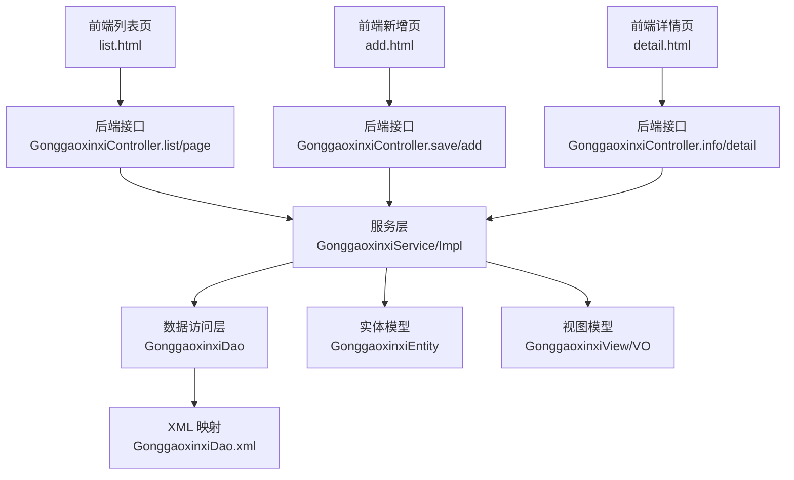
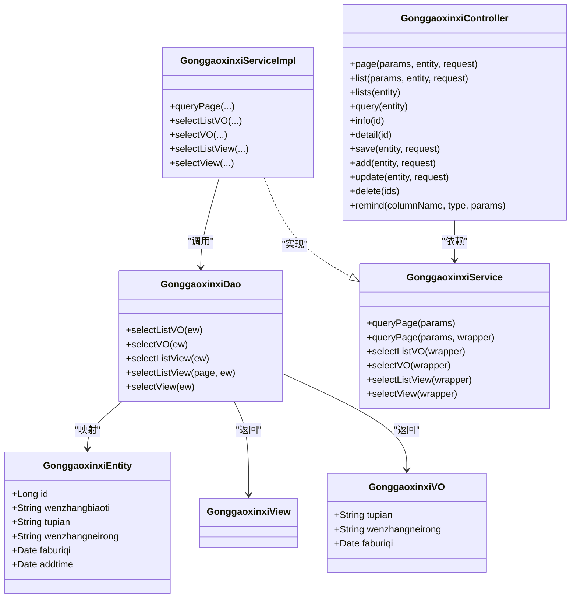
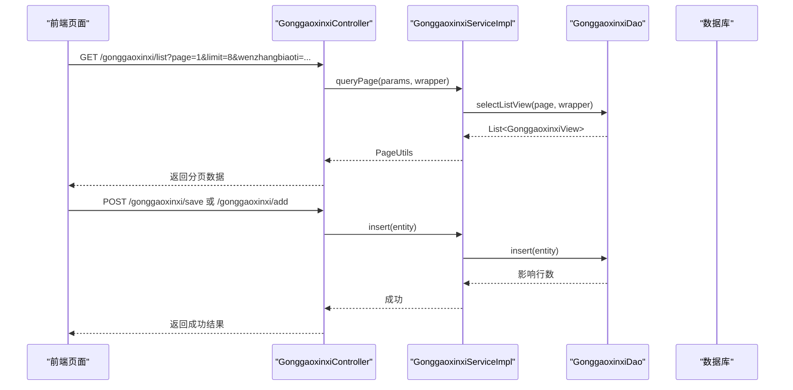
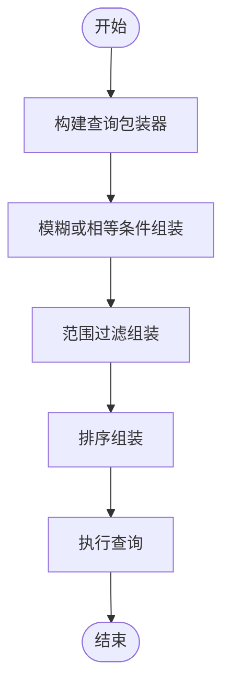
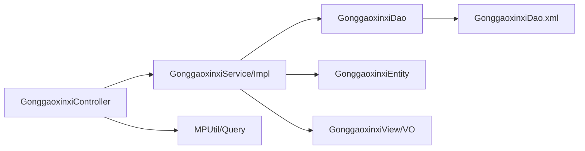

# 公告实体模型

<cite>
**本文引用的文件**
- [GonggaoxinxiEntity.java](file://src/main/java/com/entity/GonggaoxinxiEntity.java)
- [GonggaoxinxiService.java](file://src/main/java/com/service/GonggaoxinxiService.java)
- [GonggaoxinxiServiceImpl.java](file://src/main/java/com/service/impl/GonggaoxinxiServiceImpl.java)
- [GonggaoxinxiController.java](file://src/main/java/com/controller/GonggaoxinxiController.java)
- [GonggaoxinxiDao.java](file://src/main/java/com/dao/GonggaoxinxiDao.java)
- [GonggaoxinxiDao.xml](file://src/main/resources/mapper/GonggaoxinxiDao.xml)
- [GonggaoxinxiView.java](file://src/main/java/com/entity/view/GonggaoxinxiView.java)
- [GonggaoxinxiVO.java](file://src/main/java/com/entity/vo/GonggaoxinxiVO.java)
- [MPUtil.java](file://src/main/java/com/utils/MPUtil.java)
- [Query.java](file://src/main/java/com/utils/Query.java)
- [list.html](file://src/main/resources/front/front/pages/gonggaoxinxi/list.html)
- [add.html](file://src/main/resources/front/front/pages/gonggaoxinxi/add.html)
- [detail.html](file://src/main/resources/front/front/pages/gonggaoxinxi/detail.html)
</cite>

## 目录
1. [简介](#简介)
2. [项目结构](#项目结构)
3. [核心组件](#核心组件)
4. [架构总览](#架构总览)
5. [详细组件分析](#详细组件分析)
6. [依赖关系分析](#依赖关系分析)
7. [性能考虑](#性能考虑)
8. [故障排查指南](#故障排查指南)
9. [结论](#结论)
10. [附录](#附录)

## 简介
本文件围绕公告实体模型进行系统化文档化，重点解析 GonggaoxinxiEntity 类的字段设计与业务含义，梳理公告管理的发布流程、权限控制与显示策略，覆盖分类管理、搜索过滤与推送机制，并提供增删改查操作示例与用户体验优化建议。同时分析数据同步、缓存策略与性能监控措施，帮助开发者与产品人员全面理解公告子系统的实现与扩展点。

## 项目结构
公告模块采用经典的前后端分离架构，后端基于 Spring Boot + MyBatis-Plus，前端采用 Vue + Layui 的静态页面，通过统一的 REST 接口进行交互。数据库表映射由实体类与 XML 映射文件完成，服务层封装了分页、条件查询与视图转换逻辑。

图表来源
- [GonggaoxinxiController.java:57-75](file://src/main/java/com/controller/GonggaoxinxiController.java#L57-L75)
- [GonggaoxinxiServiceImpl.java:22-62](file://src/main/java/com/service/impl/GonggaoxinxiServiceImpl.java#L22-L62)
- [GonggaoxinxiDao.java:21-33](file://src/main/java/com/dao/GonggaoxinxiDao.java#L21-L33)
- [GonggaoxinxiDao.xml:4-38](file://src/main/resources/mapper/GonggaoxinxiDao.xml#L4-L38)
- [GonggaoxinxiEntity.java:32-148](file://src/main/java/com/entity/GonggaoxinxiEntity.java#L32-L148)
- [GonggaoxinxiView.java:21-36](file://src/main/java/com/entity/view/GonggaoxinxiView.java#L21-L36)
- [GonggaoxinxiVO.java:21-94](file://src/main/java/com/entity/vo/GonggaoxinxiVO.java#L21-L94)

章节来源
- [GonggaoxinxiController.java:46-208](file://src/main/java/com/controller/GonggaoxinxiController.java#L46-L208)
- [GonggaoxinxiServiceImpl.java:22-62](file://src/main/java/com/service/impl/GonggaoxinxiServiceImpl.java#L22-L62)
- [GonggaoxinxiDao.java:21-33](file://src/main/java/com/dao/GonggaoxinxiDao.java#L21-L33)
- [GonggaoxinxiDao.xml:4-38](file://src/main/resources/mapper/GonggaoxinxiDao.xml#L4-L38)

## 核心组件
- 实体模型：GonggaoxinxiEntity 定义公告的核心字段与时间格式化策略，支持主键、标题、图片、内容与发布日期等属性。
- 视图与值对象：GonggaoxinxiView 用于后端返回的组合视图；GonggaoxinxiVO 用于移动端接口返回的简化实体。
- 数据访问层：GonggaoxinxiDao 定义查询列表、视图与统计的方法签名，配合 XML 映射实现 SQL 构造。
- 服务层：GonggaoxinxiService/Impl 提供分页查询、条件筛选、排序与视图转换能力。
- 控制器：GonggaoxinxiController 对外暴露列表、详情、保存、更新、删除与提醒接口，统一处理请求参数与响应封装。
- 工具类：MPUtil 提供条件构造、模糊匹配、范围过滤与排序；Query 封装分页与排序参数。

章节来源
- [GonggaoxinxiEntity.java:32-148](file://src/main/java/com/entity/GonggaoxinxiEntity.java#L32-L148)
- [GonggaoxinxiView.java:21-36](file://src/main/java/com/entity/view/GonggaoxinxiView.java#L21-L36)
- [GonggaoxinxiVO.java:21-94](file://src/main/java/com/entity/vo/GonggaoxinxiVO.java#L21-L94)
- [GonggaoxinxiDao.java:21-33](file://src/main/java/com/dao/GonggaoxinxiDao.java#L21-L33)
- [GonggaoxinxiDao.xml:4-38](file://src/main/resources/mapper/GonggaoxinxiDao.xml#L4-L38)
- [GonggaoxinxiService.java:21-35](file://src/main/java/com/service/GonggaoxinxiService.java#L21-L35)
- [GonggaoxinxiServiceImpl.java:22-62](file://src/main/java/com/service/impl/GonggaoxinxiServiceImpl.java#L22-L62)
- [GonggaoxinxiController.java:46-208](file://src/main/java/com/controller/GonggaoxinxiController.java#L46-L208)
- [MPUtil.java:17-185](file://src/main/java/com/utils/MPUtil.java#L17-L185)
- [Query.java:14-98](file://src/main/java/com/utils/Query.java#L14-L98)

## 架构总览
公告模块遵循 MVC 分层与 DAO/Service/Controller 的职责划分，控制器负责参数接收与响应封装，服务层负责业务编排与数据转换，DAO 层负责 SQL 执行，实体与视图模型承担数据承载与序列化。

图表来源
- [GonggaoxinxiEntity.java:32-148](file://src/main/java/com/entity/GonggaoxinxiEntity.java#L32-L148)
- [GonggaoxinxiVO.java:21-94](file://src/main/java/com/entity/vo/GonggaoxinxiVO.java#L21-L94)
- [GonggaoxinxiView.java:21-36](file://src/main/java/com/entity/view/GonggaoxinxiView.java#L21-L36)
- [GonggaoxinxiDao.java:21-33](file://src/main/java/com/dao/GonggaoxinxiDao.java#L21-L33)
- [GonggaoxinxiService.java:21-35](file://src/main/java/com/service/GonggaoxinxiService.java#L21-L35)
- [GonggaoxinxiServiceImpl.java:22-62](file://src/main/java/com/service/impl/GonggaoxinxiServiceImpl.java#L22-L62)
- [GonggaoxinxiController.java:46-208](file://src/main/java/com/controller/GonggaoxinxiController.java#L46-L208)

## 详细组件分析

### GonggaoxinxiEntity 字段设计与业务语义
- 主键 id：唯一标识公告记录，用于详情查询与更新删除。
- 文章标题 wenzhangbiaoti：公告的标题字段，前端列表页提供按标题模糊检索。
- 图片 tupian：支持多张图片以逗号分隔存储，前端列表展示首图，详情页轮播展示。
- 文章内容 wenzhangneirong：富文本内容，前端使用编辑器渲染。
- 发布日期 faburiqi：公告发布时间，用于排序与筛选。
- 创建时间 addtime：实体内置字段，便于审计与排序。

字段设计要点
- 时间字段使用注解进行本地化格式化，确保前后端一致的时间展示。
- 图片字段采用逗号分隔存储多图，前端解析首图用于列表缩略展示。
- 实体支持泛型构造，便于从其他对象复制属性，提升复用性。

章节来源
- [GonggaoxinxiEntity.java:32-148](file://src/main/java/com/entity/GonggaoxinxiEntity.java#L32-L148)

### 公告管理功能与接口流程
- 列表与分页：后端提供“后端列表”和“前端列表”两个入口，均通过服务层分页查询与条件组装，返回 PageUtils 结果集。
- 详情：分别提供后端详情与前端详情，后端详情用于后台管理，前端详情用于用户浏览。
- 新增与保存：后端保存与前端保存接口均生成唯一 id 并插入数据库。
- 更新与删除：支持单条与批量删除，更新接口对整条记录进行覆盖更新。
- 提醒接口：支持按列名与起止时间范围统计提醒数量，用于运营侧的周期性提醒。

图表来源
- [GonggaoxinxiController.java:57-75](file://src/main/java/com/controller/GonggaoxinxiController.java#L57-L75)
- [GonggaoxinxiServiceImpl.java:34-60](file://src/main/java/com/service/impl/GonggaoxinxiServiceImpl.java#L34-L60)
- [GonggaoxinxiDao.xml:26-31](file://src/main/resources/mapper/GonggaoxinxiDao.xml#L26-L31)

章节来源
- [GonggaoxinxiController.java:57-203](file://src/main/java/com/controller/GonggaoxinxiController.java#L57-L203)
- [GonggaoxinxiServiceImpl.java:22-62](file://src/main/java/com/service/impl/GonggaoxinxiServiceImpl.java#L22-L62)

### 权限控制与显示策略
- 权限注解：前端列表接口标注忽略认证注解，便于用户直接浏览公告；后端列表与详情接口默认受控，需结合系统登录态或权限拦截器使用。
- 按钮可见性：前端页面根据 isAuth 动态判断“新增”按钮是否显示，体现细粒度权限控制。
- 显示策略：列表页支持按标题模糊搜索与分页；详情页展示图片轮播与富文本内容，增强可读性。

章节来源
- [GonggaoxinxiController.java:69-75](file://src/main/java/com/controller/GonggaoxinxiController.java#L69-L75)
- [list.html:319-321](file://src/main/resources/front/front/pages/gonggaoxinxi/list.html#L319-L321)

### 分类管理、搜索过滤与推送机制
- 分类管理：当前实体未见专门的分类字段，可通过在实体中增加分类字段并在控制器与前端页面扩展实现分类筛选。
- 搜索过滤：前端列表页提供标题输入框，后端通过工具类将实体属性转换为 SQL 条件，支持模糊匹配与范围过滤。
- 推送机制：系统提供提醒接口，可按指定列与时间范围统计提醒数量，便于运营侧进行周期性推送或预警。

图表来源
- [MPUtil.java:60-80](file://src/main/java/com/utils/MPUtil.java#L60-L80)
- [MPUtil.java:102-119](file://src/main/java/com/utils/MPUtil.java#L102-L119)
- [MPUtil.java:121-134](file://src/main/java/com/utils/MPUtil.java#L121-L134)

章节来源
- [MPUtil.java:17-185](file://src/main/java/com/utils/MPUtil.java#L17-L185)

### 增删改查操作示例与用户体验优化
- 新增/保存
  - 前端：add.html 使用表单收集标题、图片、发布日期与内容，提交至后端保存接口。
  - 后端：生成唯一 id 并插入数据库，返回成功状态。
- 列表/分页
  - 前端：list.html 支持按标题搜索与分页导航，提升浏览效率。
- 详情
  - 前端：detail.html 展示图片轮播与富文本内容，增强阅读体验。
- 用户体验优化建议
  - 图片上传：支持多图上传与预览，列表页仅展示首图，详情页轮播展示所有图片。
  - 富文本编辑：集成富文本编辑器，支持图片上传与内容格式化。
  - 搜索优化：支持拼音首字母检索与标签筛选，提升查找效率。
  - 分页与懒加载：大数据量场景下启用无限滚动或懒加载，减少一次性渲染压力。

章节来源
- [add.html:121-151](file://src/main/resources/front/front/pages/gonggaoxinxi/add.html#L121-L151)
- [list.html:388-417](file://src/main/resources/front/front/pages/gonggaoxinxi/list.html#L388-L417)
- [detail.html:329-368](file://src/main/resources/front/front/pages/gonggaoxinxi/detail.html#L329-L368)

### 数据同步、缓存策略与性能监控
- 数据同步
  - 建议在高并发场景下引入分布式锁或消息队列，保证公告变更的一致性与顺序性。
- 缓存策略
  - 列表页与详情页可引入 Redis 缓存，热点数据设置合理过期时间，降低数据库压力。
  - 图片资源可使用 CDN 缓存，提升加载速度。
- 性能监控
  - 对分页查询、条件组装与 SQL 执行进行埋点监控，识别慢查询并优化索引。
  - 前端对图片懒加载与骨架屏进行优化，改善首屏渲染性能。

## 依赖关系分析
公告模块的依赖关系清晰，控制器依赖服务层，服务层依赖数据访问层，DAO 依赖 XML 映射文件与实体模型。工具类与分页类贯穿于查询与条件构造环节。

图表来源
- [GonggaoxinxiController.java:46-208](file://src/main/java/com/controller/GonggaoxinxiController.java#L46-L208)
- [GonggaoxinxiServiceImpl.java:22-62](file://src/main/java/com/service/impl/GonggaoxinxiServiceImpl.java#L22-L62)
- [GonggaoxinxiDao.java:21-33](file://src/main/java/com/dao/GonggaoxinxiDao.java#L21-L33)
- [GonggaoxinxiDao.xml:4-38](file://src/main/resources/mapper/GonggaoxinxiDao.xml#L4-L38)
- [MPUtil.java:17-185](file://src/main/java/com/utils/MPUtil.java#L17-L185)
- [Query.java:14-98](file://src/main/java/com/utils/Query.java#L14-L98)

章节来源
- [GonggaoxinxiController.java:46-208](file://src/main/java/com/controller/GonggaoxinxiController.java#L46-L208)
- [GonggaoxinxiServiceImpl.java:22-62](file://src/main/java/com/service/impl/GonggaoxinxiServiceImpl.java#L22-L62)
- [GonggaoxinxiDao.java:21-33](file://src/main/java/com/dao/GonggaoxinxiDao.java#L21-L33)
- [GonggaoxinxiDao.xml:4-38](file://src/main/resources/mapper/GonggaoxinxiDao.xml#L4-L38)
- [MPUtil.java:17-185](file://src/main/java/com/utils/MPUtil.java#L17-L185)
- [Query.java:14-98](file://src/main/java/com/utils/Query.java#L14-L98)

## 性能考虑
- SQL 优化：为常用查询字段建立索引，避免全表扫描；对 LIKE 查询尽量避免前缀通配符。
- 分页与排序：合理设置每页大小，避免超大偏移；对排序字段建立复合索引。
- 缓存命中：热点公告列表与详情页开启缓存，设置合理的失效时间与更新策略。
- 前端渲染：图片懒加载与骨架屏，减少首屏阻塞；富文本内容分块加载，避免一次性渲染过大 DOM。

## 故障排查指南
- 参数校验：控制器中部分保存接口注释了参数校验，如需启用可在相应位置取消注释。
- 条件构造：若查询结果为空，检查前端传参与工具类条件组装逻辑，确认字段名与大小写是否正确。
- 时间格式：确保前端传递的时间格式与后端注解格式一致，避免解析失败。
- 权限问题：若前端按钮不可见，请检查 isAuth 方法与权限配置，确认当前用户角色具备相应权限。

章节来源
- [GonggaoxinxiController.java:124-139](file://src/main/java/com/controller/GonggaoxinxiController.java#L124-L139)
- [MPUtil.java:60-80](file://src/main/java/com/utils/MPUtil.java#L60-L80)

## 结论
公告实体模型在字段设计上简洁明确，配合服务层与控制器实现了完整的增删改查与分页查询能力。通过前端页面与工具类的协同，系统具备良好的可扩展性与用户体验。建议后续在分类管理、搜索优化与缓存策略方面进一步完善，以满足更高并发与更复杂业务场景的需求。

## 附录
- 实体字段一览
  - id：主键
  - wenzhangbiaoti：文章标题
  - tupian：图片（支持多图逗号分隔）
  - wenzhangneirong：文章内容
  - faburiqi：发布日期
  - addtime：创建时间
- 关键接口
  - 列表与分页：GET /gonggaoxinxi/page、GET /gonggaoxinxi/list
  - 详情：GET /gonggaoxinxi/info/{id}、GET /gonggaoxinxi/detail/{id}
  - 新增/保存：POST /gonggaoxinxi/save、POST /gonggaoxinxi/add
  - 更新：POST /gonggaoxinxi/update
  - 删除：DELETE /gonggaoxinxi/delete
  - 提醒：GET /gonggaoxinxi/remind/{columnName}/{type}