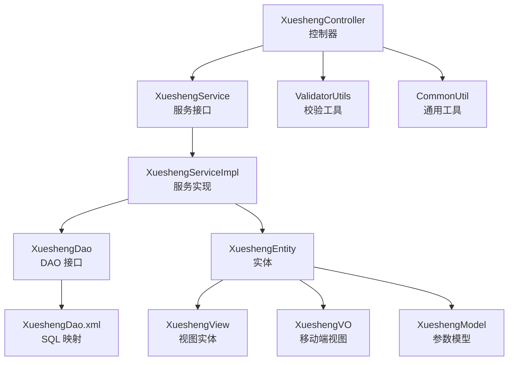
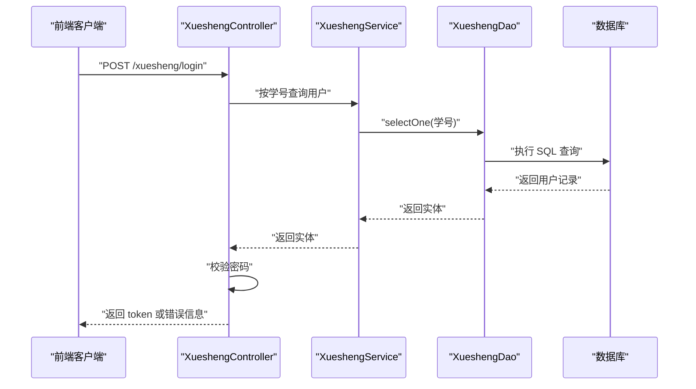
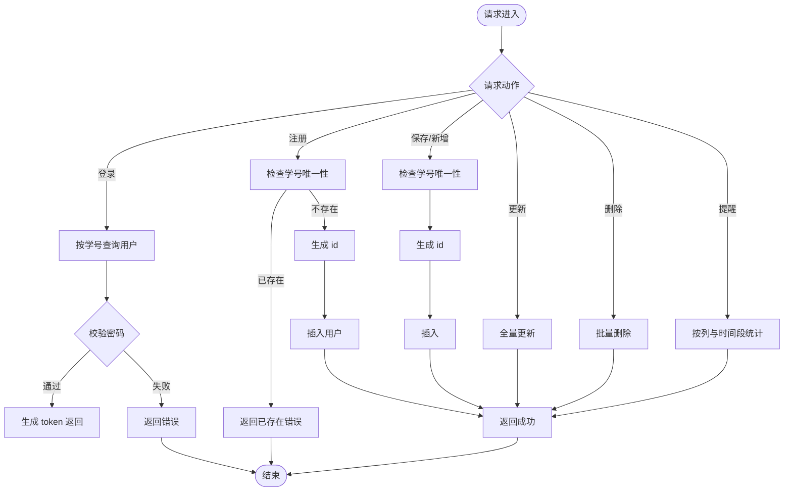
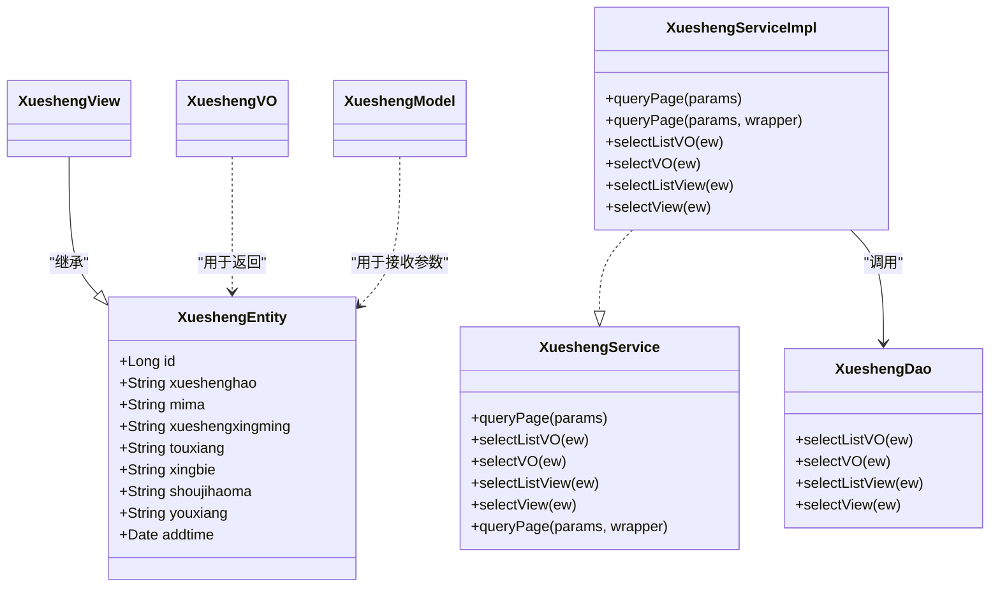
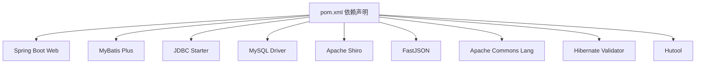

# 学生实体模型

<cite>
**本文引用的文件**
- [XueshengEntity.java](file://src/main/java/com/entity/XueshengEntity.java)
- [XueshengController.java](file://src/main/java/com/controller/XueshengController.java)
- [XueshengService.java](file://src/main/java/com/service/XueshengService.java)
- [XueshengServiceImpl.java](file://src/main/java/com/service/impl/XueshengServiceImpl.java)
- [XueshengDao.java](file://src/main/java/com/dao/XueshengDao.java)
- [XueshengView.java](file://src/main/java/com/entity/view/XueshengView.java)
- [XueshengModel.java](file://src/main/java/com/entity/model/XueshengModel.java)
- [XueshengVO.java](file://src/main/java/com/entity/vo/XueshengVO.java)
- [XueshengDao.xml](file://src/main/resources/mapper/XueshengDao.xml)
- [ValidatorUtils.java](file://src/main/java/com/utils/ValidatorUtils.java)
- [CommonUtil.java](file://src/main/java/com/utils/CommonUtil.java)
- [UserEntity.java](file://src/main/java/com/entity/UserEntity.java)
- [pom.xml](file://pom.xml)
</cite>

## 目录
1. [引言](#引言)
2. [项目结构](#项目结构)
3. [核心组件](#核心组件)
4. [架构总览](#架构总览)
5. [详细组件分析](#详细组件分析)
6. [依赖分析](#依赖分析)
7. [性能考量](#性能考量)
8. [故障排查指南](#故障排查指南)
9. [结论](#结论)
10. [附录](#附录)

## 引言
本文件围绕“学生实体模型”展开，重点解析 XueshengEntity 类的字段设计、业务含义与数据管理能力，并结合控制器、服务层、DAO 层及视图/模型类，系统阐述学生信息在系统中的存储、查询、更新、删除与展示流程。同时，补充完整性与准确性校验规则、导入导出与批量操作建议、数据迁移方案以及数据安全、隐私保护与合规性考虑，帮助读者从代码到实践全面掌握该模块。

## 项目结构
学生模块采用典型的分层架构：
- 控制器层：处理 HTTP 请求，负责登录、注册、列表、详情、保存、更新、删除、提醒等接口
- 服务层：封装业务逻辑，提供分页查询、视图/VO 转换、复杂查询等
- DAO 层：MyBatis 映射，提供基础 CRUD 与视图查询
- 实体与视图：XueshengEntity 为核心实体；XueshengView 用于后端返回视图；XueshengVO 用于移动端返回；XueshengModel 用于接收参数
- 工具类：ValidatorUtils 提供 Hibernate 校验；CommonUtil 提供随机字符串生成；MD5Util 用于密码处理（在控制器中调用）

图表来源
- [XueshengController.java:46-284](file://src/main/java/com/controller/XueshengController.java#L46-L284)
- [XueshengService.java:21-35](file://src/main/java/com/service/XueshengService.java#L21-L35)
- [XueshengServiceImpl.java:22-62](file://src/main/java/com/service/impl/XueshengServiceImpl.java#L22-L62)
- [XueshengDao.java:21-33](file://src/main/java/com/dao/XueshengDao.java#L21-L33)
- [XueshengDao.xml:4-41](file://src/main/resources/mapper/XueshengDao.xml#L4-L41)
- [XueshengEntity.java:31-201](file://src/main/java/com/entity/XueshengEntity.java#L31-L201)
- [XueshengView.java:20-37](file://src/main/java/com/entity/view/XueshengView.java#L20-L37)
- [XueshengVO.java:20-158](file://src/main/java/com/entity/vo/XueshengVO.java#L20-L158)
- [XueshengModel.java:21-159](file://src/main/java/com/entity/model/XueshengModel.java#L21-L159)
- [ValidatorUtils.java:16-39](file://src/main/java/com/utils/ValidatorUtils.java#L16-L39)
- [CommonUtil.java:5-22](file://src/main/java/com/utils/CommonUtil.java#L5-L22)

章节来源
- [XueshengController.java:46-284](file://src/main/java/com/controller/XueshengController.java#L46-L284)
- [XueshengService.java:21-35](file://src/main/java/com/service/XueshengService.java#L21-L35)
- [XueshengServiceImpl.java:22-62](file://src/main/java/com/service/impl/XueshengServiceImpl.java#L22-L62)
- [XueshengDao.java:21-33](file://src/main/java/com/dao/XueshengDao.java#L21-L33)
- [XueshengDao.xml:4-41](file://src/main/resources/mapper/XueshengDao.xml#L4-L41)
- [XueshengEntity.java:31-201](file://src/main/java/com/entity/XueshengEntity.java#L31-L201)
- [XueshengView.java:20-37](file://src/main/java/com/entity/view/XueshengView.java#L20-L37)
- [XueshengVO.java:20-158](file://src/main/java/com/entity/vo/XueshengVO.java#L20-L158)
- [XueshengModel.java:21-159](file://src/main/java/com/entity/model/XueshengModel.java#L21-L159)
- [ValidatorUtils.java:16-39](file://src/main/java/com/utils/ValidatorUtils.java#L16-L39)
- [CommonUtil.java:5-22](file://src/main/java/com/utils/CommonUtil.java#L5-L22)

## 核心组件
- 实体类 XueshengEntity：承载数据库表 xuesheng 的字段，包括主键 id、学号 xueshenghao、密码 mima、姓名 xueshengxingming、头像 touxiang、性别 xingbie、手机号 shoujihaoma、邮箱 youxiang、创建时间 addtime 等
- 控制器 XueshengController：提供登录、注册、列表、详情、保存、更新、删除、提醒等接口，处理请求参数并调用服务层
- 服务层 XueshengService/Impl：封装分页查询、视图转换、复杂条件查询等
- DAO 层 XueshengDao + XueshengDao.xml：定义查询方法并映射 SQL
- 视图与模型：XueshengView 用于后端返回视图；XueshengVO 用于移动端返回；XueshengModel 用于接收参数
- 工具类：ValidatorUtils 提供校验；CommonUtil 提供随机字符串；MD5Util 在控制器中用于密码处理

章节来源
- [XueshengEntity.java:31-201](file://src/main/java/com/entity/XueshengEntity.java#L31-L201)
- [XueshengController.java:46-284](file://src/main/java/com/controller/XueshengController.java#L46-L284)
- [XueshengService.java:21-35](file://src/main/java/com/service/XueshengService.java#L21-L35)
- [XueshengServiceImpl.java:22-62](file://src/main/java/com/service/impl/XueshengServiceImpl.java#L22-L62)
- [XueshengDao.java:21-33](file://src/main/java/com/dao/XueshengDao.java#L21-L33)
- [XueshengDao.xml:4-41](file://src/main/resources/mapper/XueshengDao.xml#L4-L41)
- [XueshengView.java:20-37](file://src/main/java/com/entity/view/XueshengView.java#L20-L37)
- [XueshengVO.java:20-158](file://src/main/java/com/entity/vo/XueshengVO.java#L20-L158)
- [XueshengModel.java:21-159](file://src/main/java/com/entity/model/XueshengModel.java#L21-L159)
- [ValidatorUtils.java:16-39](file://src/main/java/com/utils/ValidatorUtils.java#L16-L39)
- [CommonUtil.java:5-22](file://src/main/java/com/utils/CommonUtil.java#L5-L22)

## 架构总览
下图展示了从前端到数据库的典型请求链路，以“登录”为例：

图表来源
- [XueshengController.java:58-68](file://src/main/java/com/controller/XueshengController.java#L58-L68)
- [XueshengDao.xml:17-27](file://src/main/resources/mapper/XueshengDao.xml#L17-L27)
- [XueshengEntity.java:31-201](file://src/main/java/com/entity/XueshengEntity.java#L31-L201)

章节来源
- [XueshengController.java:58-68](file://src/main/java/com/controller/XueshengController.java#L58-L68)
- [XueshengDao.xml:17-27](file://src/main/resources/mapper/XueshengDao.xml#L17-L27)

## 详细组件分析

### 实体类 XueshengEntity 字段设计与业务含义
- 主键 id：唯一标识，自动生成策略见服务层与控制器中的赋值逻辑
- 学号 xueshenghao：登录凭据，作为登录名使用，注册时需唯一性校验
- 密码 mima：登录凭据，当前控制器直接比较明文密码
- 姓名 xueshengxingming：学生真实姓名
- 头像 touxiang：头像地址或标识
- 性别 xingbie：性别字段
- 手机号 shoujihaoma：联系方式
- 邮箱 youxiang：联系方式
- 创建时间 addtime：记录创建时间

字段映射与结果集
- XML 中定义了字段到属性的映射，确保查询结果能正确填充实体

章节来源
- [XueshengEntity.java:31-201](file://src/main/java/com/entity/XueshengEntity.java#L31-L201)
- [XueshengDao.xml:7-15](file://src/main/resources/mapper/XueshengDao.xml#L7-L15)

### 控制器接口与业务流程
- 登录：按学号查询用户，校验密码，签发 token
- 注册：检查学号唯一性，生成 id 并插入
- 会话信息：从 session 获取当前用户
- 密码重置：按学号重置为默认密码
- 列表/详情：支持分页与详情查询
- 保存/新增：重复学号拦截，生成 id 插入
- 更新：全量更新
- 删除：批量删除
- 提醒：按列与时间段统计提醒数量

图表来源
- [XueshengController.java:58-284](file://src/main/java/com/controller/XueshengController.java#L58-L284)

章节来源
- [XueshengController.java:58-284](file://src/main/java/com/controller/XueshengController.java#L58-L284)

### 服务层与 DAO 层协作
- 分页查询：服务层构建 Page 对象并调用 DAO 查询
- 视图转换：selectListView/selectView 将实体转换为视图或 VO
- SQL 映射：XML 定义查询语句，支持 where 条件拼接

图表来源
- [XueshengEntity.java:31-201](file://src/main/java/com/entity/XueshengEntity.java#L31-L201)
- [XueshengView.java:20-37](file://src/main/java/com/entity/view/XueshengView.java#L20-L37)
- [XueshengVO.java:20-158](file://src/main/java/com/entity/vo/XueshengVO.java#L20-L158)
- [XueshengModel.java:21-159](file://src/main/java/com/entity/model/XueshengModel.java#L21-L159)
- [XueshengDao.java:21-33](file://src/main/java/com/dao/XueshengDao.java#L21-L33)
- [XueshengService.java:21-35](file://src/main/java/com/service/XueshengService.java#L21-L35)
- [XueshengServiceImpl.java:22-62](file://src/main/java/com/service/impl/XueshengServiceImpl.java#L22-L62)

章节来源
- [XueshengDao.xml:17-39](file://src/main/resources/mapper/XueshengDao.xml#L17-L39)
- [XueshengServiceImpl.java:25-60](file://src/main/java/com/service/impl/XueshengServiceImpl.java#L25-L60)

### 数据完整性与准确性校验
- 字段约束：实体类注解表明字段非空要求（如 NotBlank、NotEmpty、NotNull），但控制器中多处注释掉校验调用
- 业务约束：
  - 学号唯一性：注册与保存前均进行唯一性检查
  - 密码校验：登录时直接比较明文密码，未见哈希处理
  - 时间格式：addtime 使用 JSON 与 DateTimeFormat 注解，确保序列化与反序列化一致

建议增强点：
- 启用 ValidatorUtils.validateEntity 进行统一校验
- 密码采用 MD5Util 或更安全的哈希算法加密存储
- 对手机号、邮箱进行正则校验

章节来源
- [XueshengEntity.java:5-8](file://src/main/java/com/entity/XueshengEntity.java#L5-L8)
- [XueshengController.java:75-84](file://src/main/java/com/controller/XueshengController.java#L75-L84)
- [XueshengController.java:189-200](file://src/main/java/com/controller/XueshengController.java#L189-L200)
- [ValidatorUtils.java:29-36](file://src/main/java/com/utils/ValidatorUtils.java#L29-L36)

### 学生与用户的关联关系、数据同步与权限映射
- 当前代码中存在 UserEntity（用户表 users），但学生模块未显式建立与用户表的外键或关联字段
- 控制器中登录接口使用“xuesheng”角色标识，但未见与 users 表的直接映射逻辑
- 若需建立关联，建议：
  - 在学生实体中增加用户 ID 字段，并在登录时将用户身份与角色注入
  - 在 TokenService 中完善角色与权限映射，确保前后端权限一致

章节来源
- [UserEntity.java:13-78](file://src/main/java/com/entity/UserEntity.java#L13-L78)
- [XueshengController.java:66-67](file://src/main/java/com/controller/XueshengController.java#L66-L67)

### 导入导出、批量操作与数据迁移方案
- 批量删除：控制器提供按 id 数组批量删除
- 批量新增/更新：可基于服务层的批量操作扩展（如 MyBatis Plus 的批量插入/更新）
- 导入导出：
  - 导出：基于分页查询接口，逐页拉取数据并写入 Excel/CSV
  - 导入：读取文件后逐条调用保存接口，结合唯一性校验与事务控制
- 数据迁移：
  - 从旧表结构迁移到新表时，先做字段映射与类型转换，再进行数据校验与回填

章节来源
- [XueshengController.java:232-236](file://src/main/java/com/controller/XueshengController.java#L232-L236)
- [XueshengServiceImpl.java:25-40](file://src/main/java/com/service/impl/XueshengServiceImpl.java#L25-L40)

### 数据安全、隐私保护与合规性
- 密码安全：当前直接比较明文密码，建议改为哈希存储与比对
- 敏感信息：手机号、邮箱属于敏感信息，应遵循最小化原则并在传输与存储中加密
- 访问控制：登录接口使用自定义注解忽略认证，需谨慎控制开放范围
- 日志与审计：建议记录关键操作日志，便于追踪与审计

章节来源
- [XueshengController.java:58-68](file://src/main/java/com/controller/XueshengController.java#L58-L68)
- [pom.xml:24-128](file://pom.xml#L24-L128)

## 依赖分析
- 框架依赖：Spring Boot Web、MyBatis-Plus、MySQL Connector、Shiro、FastJSON 等
- ORM 映射：MyBatis Plus 与 XML 映射文件协同工作
- 工具依赖：Apache Commons Lang、BeanUtils、Hibernate Validator、Hutool 等

图表来源
- [pom.xml:24-128](file://pom.xml#L24-L128)

章节来源
- [pom.xml:24-128](file://pom.xml#L24-L128)

## 性能考量
- 分页查询：服务层使用 Page 对象与分页插件，建议合理设置每页大小与索引优化
- SQL 拼接：XML 中使用 ${ew.sqlSegment}，需确保传入条件的安全性与合法性
- 缓存策略：可在高频查询场景引入 Redis 缓存，降低数据库压力
- 并发控制：批量导入/导出时建议加锁或队列化处理，避免并发冲突

## 故障排查指南
- 登录失败：确认学号是否存在、密码是否匹配
- 注册失败：检查学号是否重复、id 是否正确生成
- 查询无结果：核对查询条件与 SQL 片段拼接
- 校验不生效：确认是否启用 ValidatorUtils.validateEntity

章节来源
- [XueshengController.java:61-64](file://src/main/java/com/controller/XueshengController.java#L61-L64)
- [XueshengController.java:77-80](file://src/main/java/com/controller/XueshengController.java#L77-L80)
- [ValidatorUtils.java:29-36](file://src/main/java/com/utils/ValidatorUtils.java#L29-L36)

## 结论
XueshengEntity 及其配套组件构成了一个完整的学生信息管理子系统。通过实体、控制器、服务与 DAO 的清晰分工，实现了基本的增删改查与分页展示。建议在后续迭代中强化数据校验、密码安全、权限映射与数据迁移能力，以满足更高的可靠性与合规性要求。

## 附录
- 关键路径参考
  - 实体定义：[XueshengEntity.java:31-201](file://src/main/java/com/entity/XueshengEntity.java#L31-L201)
  - 控制器接口：[XueshengController.java:46-284](file://src/main/java/com/controller/XueshengController.java#L46-L284)
  - 服务接口与实现：[XueshengService.java:21-35](file://src/main/java/com/service/XueshengService.java#L21-L35)，[XueshengServiceImpl.java:22-62](file://src/main/java/com/service/impl/XueshengServiceImpl.java#L22-L62)
  - DAO 与 SQL：[XueshengDao.java:21-33](file://src/main/java/com/dao/XueshengDao.java#L21-L33)，[XueshengDao.xml:4-41](file://src/main/resources/mapper/XueshengDao.xml#L4-L41)
  - 视图与模型：[XueshengView.java:20-37](file://src/main/java/com/entity/view/XueshengView.java#L20-L37)，[XueshengVO.java:20-158](file://src/main/java/com/entity/vo/XueshengVO.java#L20-L158)，[XueshengModel.java:21-159](file://src/main/java/com/entity/model/XueshengModel.java#L21-L159)
  - 工具类：[ValidatorUtils.java:16-39](file://src/main/java/com/utils/ValidatorUtils.java#L16-L39)，[CommonUtil.java:5-22](file://src/main/java/com/utils/CommonUtil.java#L5-L22)
  - 用户实体：[UserEntity.java:13-78](file://src/main/java/com/entity/UserEntity.java#L13-L78)
  - 依赖声明：[pom.xml:24-128](file://pom.xml#L24-L128)