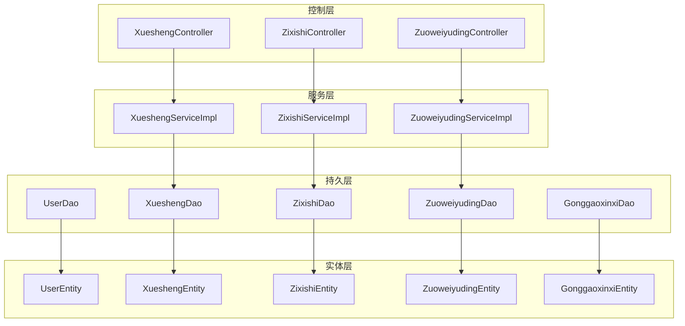
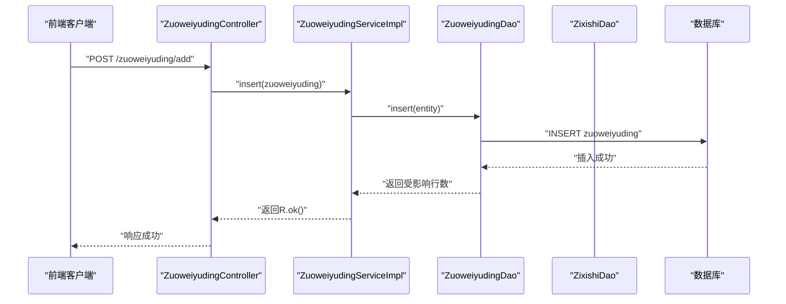
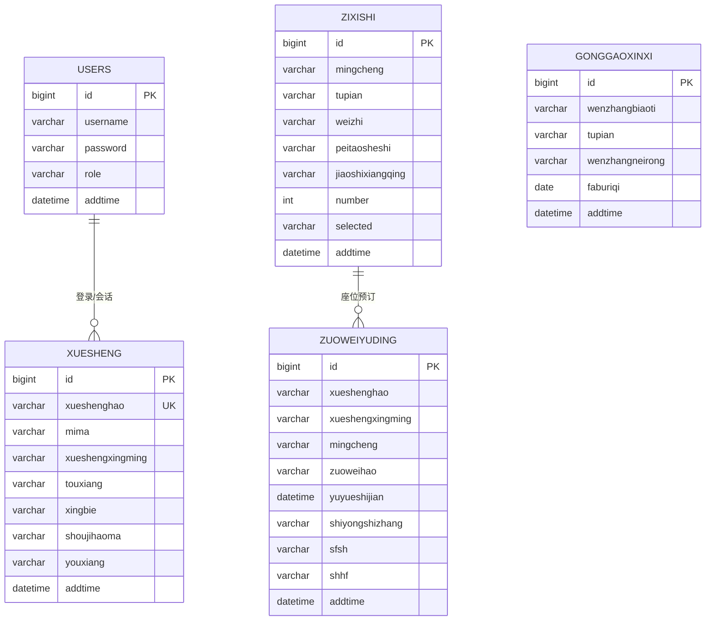
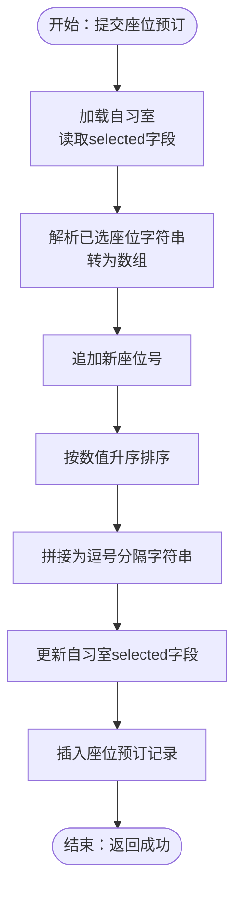
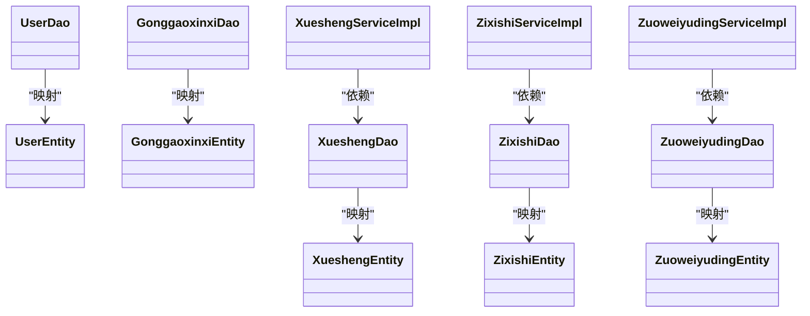
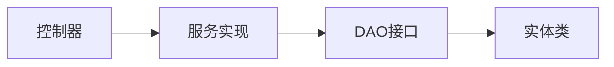

# 实体关系映射

<cite>
**本文引用的文件**
- [XueshengEntity.java](file://src/main/java/com/entity/XueshengEntity.java)
- [ZixishiEntity.java](file://src/main/java/com/entity/ZixishiEntity.java)
- [ZuoweiyudingEntity.java](file://src/main/java/com/entity/ZuoweiyudingEntity.java)
- [UserEntity.java](file://src/main/java/com/entity/UserEntity.java)
- [GonggaoxinxiEntity.java](file://src/main/java/com/entity/GonggaoxinxiEntity.java)
- [XueshengDao.java](file://src/main/java/com/dao/XueshengDao.java)
- [ZixishiDao.java](file://src/main/java/com/dao/ZixishiDao.java)
- [ZuoweiyudingDao.java](file://src/main/java/com/dao/ZuoweiyudingDao.java)
- [UserDao.java](file://src/main/java/com/dao/UserDao.java)
- [GonggaoxinxiDao.java](file://src/main/java/com/dao/GonggaoxinxiDao.java)
- [XueshengServiceImpl.java](file://src/main/java/com/service/impl/XueshengServiceImpl.java)
- [ZixishiServiceImpl.java](file://src/main/java/com/service/impl/ZixishiServiceImpl.java)
- [ZuoweiyudingServiceImpl.java](file://src/main/java/com/service/impl/ZuoweiyudingServiceImpl.java)
- [XueshengController.java](file://src/main/java/com/controller/XueshengController.java)
- [ZixishiController.java](file://src/main/java/com/controller/ZixishiController.java)
- [ZuoweiyudingController.java](file://src/main/java/com/controller/ZuoweiyudingController.java)
</cite>

## 目录
1. [引言](#引言)
2. [项目结构](#项目结构)
3. [核心组件](#核心组件)
4. [架构总览](#架构总览)
5. [详细组件分析](#详细组件分析)
6. [依赖分析](#依赖分析)
7. [性能考量](#性能考量)
8. [故障排查指南](#故障排查指南)
9. [结论](#结论)
10. [附录](#附录)

## 引言
本文件聚焦于自习室管理系统的实体关系映射，系统围绕“用户”“学生”“自习室”“座位预订”“公告信息”等核心实体展开。本文从数据库表结构与实体类出发，梳理各实体之间的关联关系与约束条件，明确一对一、一对多、多对多的实现方式与业务场景；并结合控制器与服务层逻辑，解释外键设计、级联操作与数据完整性约束在代码层面的体现；最后给出ER图与实体关系图，帮助读者快速把握系统的数据架构。

## 项目结构
系统采用典型的分层架构：控制层负责请求入口与参数封装；服务层承载业务逻辑；持久层通过MyBatis-Plus的Mapper接口访问数据库；实体层定义表结构与字段。核心实体对应数据库表如下：
- 用户：users
- 学生：xuesheng
- 自习室：zixishi
- 座位预订：zuoweiyuding
- 公告信息：gonggaoxinxi

图表来源
- [XueshengController.java:48-284](file://src/main/java/com/controller/XueshengController.java#L48-L284)
- [ZixishiController.java:46-208](file://src/main/java/com/controller/ZixishiController.java#L46-L208)
- [ZuoweiyudingController.java:32-224](file://src/main/java/com/controller/ZuoweiyudingController.java#L32-L224)
- [XueshengServiceImpl.java:21-63](file://src/main/java/com/service/impl/XueshengServiceImpl.java#L21-L63)
- [ZixishiServiceImpl.java:21-63](file://src/main/java/com/service/impl/ZixishiServiceImpl.java#L21-L63)
- [ZuoweiyudingServiceImpl.java:21-63](file://src/main/java/com/service/impl/ZuoweiyudingServiceImpl.java#L21-L63)
- [XueshengDao.java:21-33](file://src/main/java/com/dao/XueshengDao.java#L21-L33)
- [ZixishiDao.java:21-33](file://src/main/java/com/dao/ZixishiDao.java#L21-L33)
- [ZuoweiyudingDao.java:21-33](file://src/main/java/com/dao/ZuoweiyudingDao.java#L21-L33)
- [UserDao.java:16-22](file://src/main/java/com/dao/UserDao.java#L16-L22)
- [GonggaoxinxiDao.java:21-33](file://src/main/java/com/dao/GonggaoxinxiDao.java#L21-L33)
- [UserEntity.java:13-78](file://src/main/java/com/entity/UserEntity.java#L13-L78)
- [XueshengEntity.java:31-201](file://src/main/java/com/entity/XueshengEntity.java#L31-L201)
- [ZixishiEntity.java:31-201](file://src/main/java/com/entity/ZixishiEntity.java#L31-L201)
- [ZuoweiyudingEntity.java:21-212](file://src/main/java/com/entity/ZuoweiyudingEntity.java#L21-L212)
- [GonggaoxinxiEntity.java:31-149](file://src/main/java/com/entity/GonggaoxinxiEntity.java#L31-L149)

章节来源
- [XueshengController.java:48-284](file://src/main/java/com/controller/XueshengController.java#L48-L284)
- [ZixishiController.java:46-208](file://src/main/java/com/controller/ZixishiController.java#L46-L208)
- [ZuoweiyudingController.java:32-224](file://src/main/java/com/controller/ZuoweiyudingController.java#L32-L224)

## 核心组件
- 用户（UserEntity）：系统登录主体，支持角色区分，对应表users。
- 学生（XueshengEntity）：系统前台用户，具备学号、密码、姓名、联系方式等字段，对应表xuesheng。
- 自习室（ZixishiEntity）：自习室基础信息，包含名称、图片、位置、设施、座位总数与已选座位集合，对应表zixishi。
- 座位预订（ZuoweiyudingEntity）：座位预订记录，包含学生信息、自习室名称、座位号、预约时间、使用时长、审核状态与回复，对应表zuoweiyuding。
- 公告信息（GonggaoxinxiEntity）：公告条目，包含标题、图片、内容与发布时间，对应表gonggaoxinxi。

章节来源
- [UserEntity.java:13-78](file://src/main/java/com/entity/UserEntity.java#L13-L78)
- [XueshengEntity.java:31-201](file://src/main/java/com/entity/XueshengEntity.java#L31-L201)
- [ZixishiEntity.java:31-201](file://src/main/java/com/entity/ZixishiEntity.java#L31-L201)
- [ZuoweiyudingEntity.java:21-212](file://src/main/java/com/entity/ZuoweiyudingEntity.java#L21-L212)
- [GonggaoxinxiEntity.java:31-149](file://src/main/java/com/entity/GonggaoxinxiEntity.java#L31-L149)

## 架构总览
系统采用前后端分离，控制层接收HTTP请求，构造查询条件与业务参数，调用服务层执行业务逻辑，服务层通过Mapper接口访问数据库，返回视图对象或分页结果。实体类与数据库表一一对应，字段命名遵循驼峰到下划线的映射规则。

图表来源
- [ZuoweiyudingController.java:128-152](file://src/main/java/com/controller/ZuoweiyudingController.java#L128-L152)
- [ZuoweiyudingServiceImpl.java:21-63](file://src/main/java/com/service/impl/ZuoweiyudingServiceImpl.java#L21-L63)
- [ZuoweiyudingDao.java:21-33](file://src/main/java/com/dao/ZuoweiyudingDao.java#L21-L33)

## 详细组件分析

### 实体关系与约束分析
- 一对一关系
  - 用户与学生：系统通过用户表（users）与学生表（xuesheng）实现登录与前台用户的一对一映射。登录流程中，控制器根据学号查询学生记录，生成令牌返回给前端。该关系在代码层面体现为“登录校验”与“会话信息获取”，未见显式外键约束定义。
  - 参考路径：[XueshengController.java:58-104](file://src/main/java/com/controller/XueshengController.java#L58-L104)

- 一对多关系
  - 自习室与座位预订：一个自习室可被多次预订，形成自习室→座位预订的一对多关系。座位预订实体中包含自习室名称字段，便于展示；同时控制器在新增预订时读取自习室的已选座位集合，并追加新座位号后回写自习室表，确保座位占用状态一致。
  - 参考路径：
    - [ZuoweiyudingController.java:128-152](file://src/main/java/com/controller/ZuoweiyudingController.java#L128-L152)
    - [ZixishiEntity.java:88-98](file://src/main/java/com/entity/ZixishiEntity.java#L88-L98)

- 多对多关系
  - 系统未直接建立多对多实体表。座位占用通过自习室表的“已选座位”字符串字段维护，以逗号分隔的座位号集合表达多对多占用关系。该设计简化了模型但引入了字符串拼接与排序的维护成本。
  - 参考路径：
    - [ZuoweiyudingController.java:134-146](file://src/main/java/com/controller/ZuoweiyudingController.java#L134-L146)
    - [ZixishiEntity.java:88-98](file://src/main/java/com/entity/ZixishiEntity.java#L88-L98)

- 外键设计与级联
  - 代码中未发现显式的外键约束定义或级联删除/更新配置。座位占用通过字符串字段维护，未见外键关联；登录与会话信息通过学号字段关联，也未见外键约束。
  - 参考路径：
    - [ZuoweiyudingEntity.java:45-67](file://src/main/java/com/entity/ZuoweiyudingEntity.java#L45-L67)
    - [ZixishiEntity.java:88-98](file://src/main/java/com/entity/ZixishiEntity.java#L88-L98)

- 数据完整性约束
  - 控制器在新增/注册时进行重复性检查（如学号唯一），并在更新时进行非空校验（注释掉的验证工具）。这些逻辑保障了业务层面的数据一致性，但未在数据库层面强制约束。
  - 参考路径：
    - [XueshengController.java:74-85](file://src/main/java/com/controller/XueshengController.java#L74-L85)
    - [XueshengController.java:188-216](file://src/main/java/com/controller/XueshengController.java#L188-L216)

- 导航属性与关联查询
  - 实体类未声明导航属性（如对象引用或集合）。查询通过服务层的selectListView/selectView与分页工具实现，控制器侧通过EntityWrapper组装查询条件。
  - 参考路径：
    - [XueshengServiceImpl.java:42-60](file://src/main/java/com/service/impl/XueshengServiceImpl.java#L42-L60)
    - [ZuoweiyudingController.java:50-61](file://src/main/java/com/controller/ZuoweiyudingController.java#L50-L61)

图表来源
- [UserEntity.java:13-78](file://src/main/java/com/entity/UserEntity.java#L13-L78)
- [XueshengEntity.java:31-201](file://src/main/java/com/entity/XueshengEntity.java#L31-L201)
- [ZixishiEntity.java:31-201](file://src/main/java/com/entity/ZixishiEntity.java#L31-L201)
- [ZuoweiyudingEntity.java:21-212](file://src/main/java/com/entity/ZuoweiyudingEntity.java#L21-L212)
- [GonggaoxinxiEntity.java:31-149](file://src/main/java/com/entity/GonggaoxinxiEntity.java#L31-L149)

章节来源
- [XueshengController.java:58-104](file://src/main/java/com/controller/XueshengController.java#L58-L104)
- [ZuoweiyudingController.java:128-152](file://src/main/java/com/controller/ZuoweiyudingController.java#L128-L152)
- [ZixishiEntity.java:88-98](file://src/main/java/com/entity/ZixishiEntity.java#L88-L98)
- [ZuoweiyudingEntity.java:45-67](file://src/main/java/com/entity/ZuoweiyudingEntity.java#L45-L67)

### 关系映射流程图（座位预订）

图表来源
- [ZuoweiyudingController.java:134-152](file://src/main/java/com/controller/ZuoweiyudingController.java#L134-L152)
- [ZixishiEntity.java:88-98](file://src/main/java/com/entity/ZixishiEntity.java#L88-L98)

章节来源
- [ZuoweiyudingController.java:128-152](file://src/main/java/com/controller/ZuoweiyudingController.java#L128-L152)

### 类图（实体与DAO/Service）

图表来源
- [UserDao.java:16-22](file://src/main/java/com/dao/UserDao.java#L16-L22)
- [XueshengDao.java:21-33](file://src/main/java/com/dao/XueshengDao.java#L21-L33)
- [ZixishiDao.java:21-33](file://src/main/java/com/dao/ZixishiDao.java#L21-L33)
- [ZuoweiyudingDao.java:21-33](file://src/main/java/com/dao/ZuoweiyudingDao.java#L21-L33)
- [GonggaoxinxiDao.java:21-33](file://src/main/java/com/dao/GonggaoxinxiDao.java#L21-L33)
- [XueshengServiceImpl.java:21-63](file://src/main/java/com/service/impl/XueshengServiceImpl.java#L21-L63)
- [ZixishiServiceImpl.java:21-63](file://src/main/java/com/service/impl/ZixishiServiceImpl.java#L21-L63)
- [ZuoweiyudingServiceImpl.java:21-63](file://src/main/java/com/service/impl/ZuoweiyudingServiceImpl.java#L21-L63)

章节来源
- [UserDao.java:16-22](file://src/main/java/com/dao/UserDao.java#L16-L22)
- [XueshengDao.java:21-33](file://src/main/java/com/dao/XueshengDao.java#L21-L33)
- [ZixishiDao.java:21-33](file://src/main/java/com/dao/ZixishiDao.java#L21-L33)
- [ZuoweiyudingDao.java:21-33](file://src/main/java/com/dao/ZuoweiyudingDao.java#L21-L33)
- [GonggaoxinxiDao.java:21-33](file://src/main/java/com/dao/GonggaoxinxiDao.java#L21-L33)
- [XueshengServiceImpl.java:21-63](file://src/main/java/com/service/impl/XueshengServiceImpl.java#L21-L63)
- [ZixishiServiceImpl.java:21-63](file://src/main/java/com/service/impl/ZixishiServiceImpl.java#L21-L63)
- [ZuoweiyudingServiceImpl.java:21-63](file://src/main/java/com/service/impl/ZuoweiyudingServiceImpl.java#L21-L63)

## 依赖分析
- 控制器依赖服务层，服务层依赖DAO接口，DAO接口继承MyBatis-Plus的BaseMapper，实现通用CRUD与分页查询。
- 实体类通过注解标注表名与主键策略，字段与数据库列名保持一致或遵循映射规则。
- 代码中未发现循环依赖，耦合主要体现在“控制器→服务→DAO→实体”的单向依赖链。

图表来源
- [XueshengController.java:48-284](file://src/main/java/com/controller/XueshengController.java#L48-L284)
- [ZixishiController.java:46-208](file://src/main/java/com/controller/ZixishiController.java#L46-L208)
- [ZuoweiyudingController.java:32-224](file://src/main/java/com/controller/ZuoweiyudingController.java#L32-L224)
- [XueshengServiceImpl.java:21-63](file://src/main/java/com/service/impl/XueshengServiceImpl.java#L21-L63)
- [ZixishiServiceImpl.java:21-63](file://src/main/java/com/service/impl/ZixishiServiceImpl.java#L21-L63)
- [ZuoweiyudingServiceImpl.java:21-63](file://src/main/java/com/service/impl/ZuoweiyudingServiceImpl.java#L21-L63)

章节来源
- [XueshengController.java:48-284](file://src/main/java/com/controller/XueshengController.java#L48-L284)
- [ZixishiController.java:46-208](file://src/main/java/com/controller/ZixishiController.java#L46-L208)
- [ZuoweiyudingController.java:32-224](file://src/main/java/com/controller/ZuoweiyudingController.java#L32-L224)

## 性能考量
- 查询性能
  - 分页查询通过PageHelper/PageUtils实现，建议在高频查询字段上建立索引（如学号、自习室名称、预约时间）。
  - 复合条件查询使用EntityWrapper，建议对常用过滤字段建立复合索引以减少全表扫描。
- 写入性能
  - 座位占用更新涉及字符串解析与排序，建议在高并发场景下采用原子更新或数据库层面的集合类型存储，避免竞态条件。
- 缓存策略
  - 对自习室基础信息与热门公告可引入缓存，降低数据库压力。
- 连接池与SQL优化
  - 合理设置连接池大小，避免慢查询阻塞；对批量删除/更新操作使用批处理以提升吞吐量。

## 故障排查指南
- 登录失败
  - 检查学号是否存在且密码匹配；确认会话中用户ID与角色信息是否正确写入。
  - 参考路径：[XueshengController.java:58-68](file://src/main/java/com/controller/XueshengController.java#L58-L68)
- 新增用户失败
  - 若学号重复，返回“用户已存在”；请检查唯一性约束与去重逻辑。
  - 参考路径：[XueshengController.java:74-85](file://src/main/java/com/controller/XueshengController.java#L74-L85)
- 座位预订异常
  - 若座位号未正确写入selected或排序异常，检查字符串拼接与排序逻辑。
  - 参考路径：[ZuoweiyudingController.java:134-152](file://src/main/java/com/controller/ZuoweiyudingController.java#L134-L152)
- 权限过滤
  - 学生视角仅能查询/操作自身相关记录；检查Session中的角色与用户名过滤条件。
  - 参考路径：[ZuoweiyudingController.java:212-216](file://src/main/java/com/controller/ZuoweiyudingController.java#L212-L216)

章节来源
- [XueshengController.java:58-85](file://src/main/java/com/controller/XueshengController.java#L58-L85)
- [ZuoweiyudingController.java:134-152](file://src/main/java/com/controller/ZuoweiyudingController.java#L134-L152)
- [ZuoweiyudingController.java:212-216](file://src/main/java/com/controller/ZuoweiyudingController.java#L212-L216)

## 结论
本系统通过清晰的分层架构与实体映射实现了自习室管理的核心功能。实体关系以一对一（用户↔学生）、一对多（自习室↔座位预订）为主，座位占用通过字符串集合维护，简化了模型但需注意并发与数据一致性。建议在数据库层面补充外键与索引，在服务层引入缓存与批量处理，以进一步提升性能与可维护性。

## 附录
- 字段与表名映射
  - 用户：users → UserEntity
  - 学生：xuesheng → XueshengEntity
  - 自习室：zixishi → ZixishiEntity
  - 座位预订：zuoweiyuding → ZuoweiyudingEntity
  - 公告信息：gonggaoxinxi → GonggaoxinxiEntity
- 关键流程参考
  - 登录与会话：[XueshengController.java:58-104](file://src/main/java/com/controller/XueshengController.java#L58-L104)
  - 座位预订与占用更新：[ZuoweiyudingController.java:128-152](file://src/main/java/com/controller/ZuoweiyudingController.java#L128-L152)
  - 分页与列表查询：[XueshengServiceImpl.java:25-60](file://src/main/java/com/service/impl/XueshengServiceImpl.java#L25-L60)