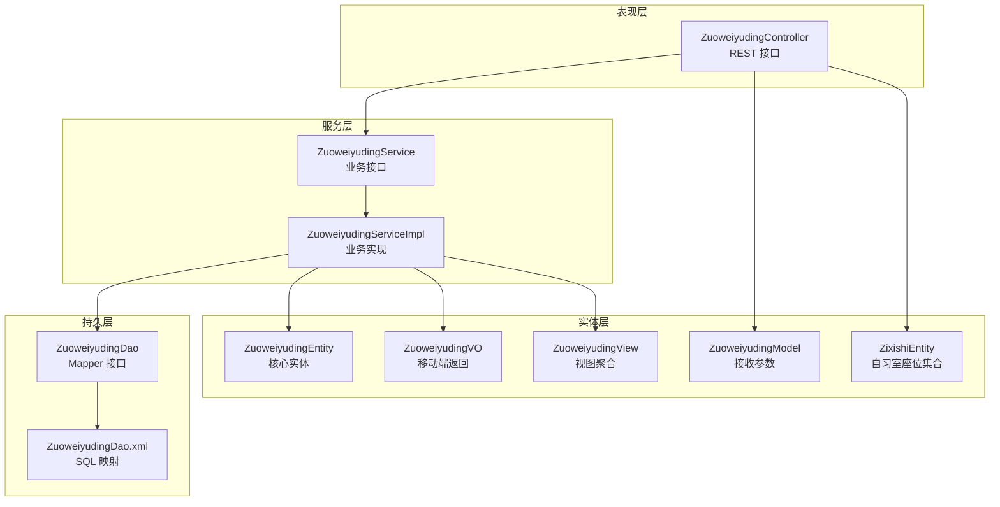
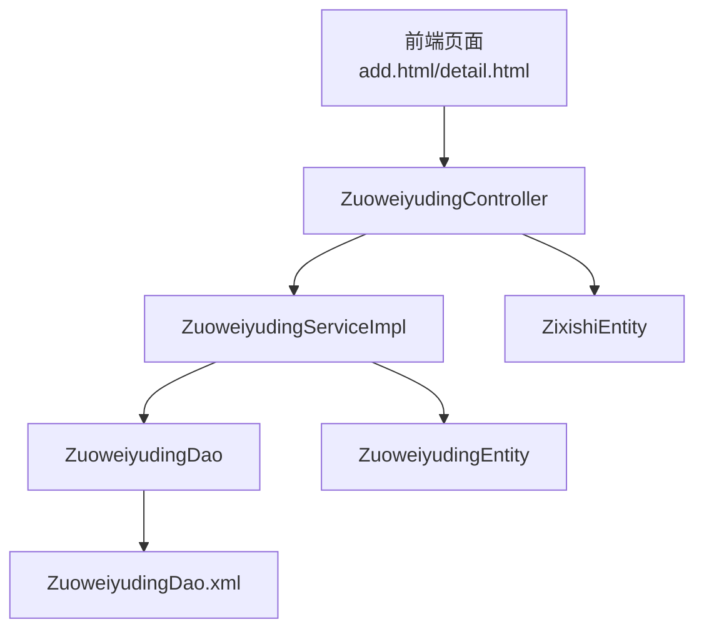
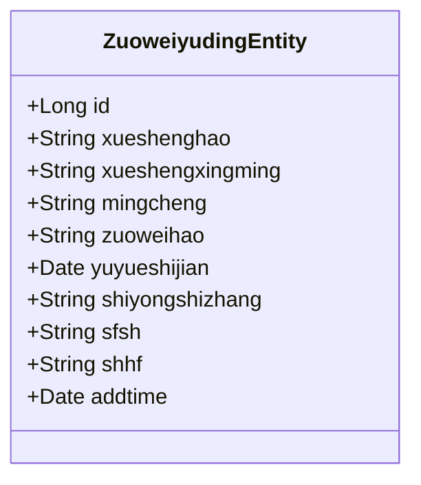
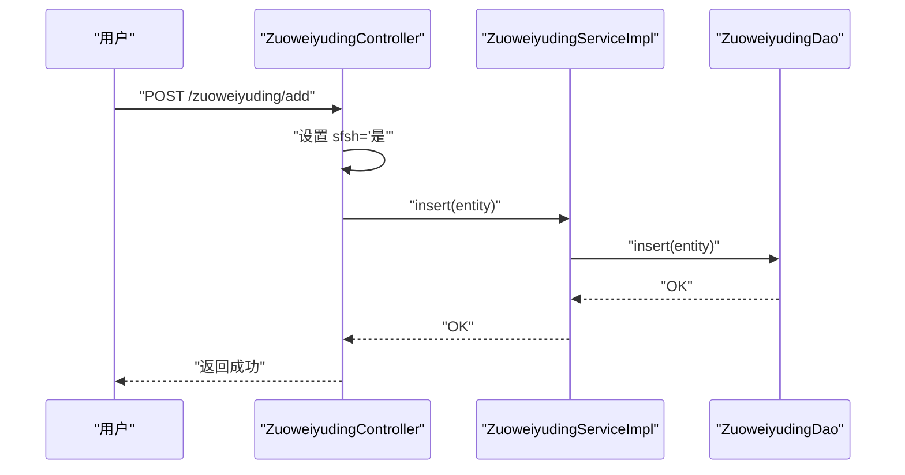
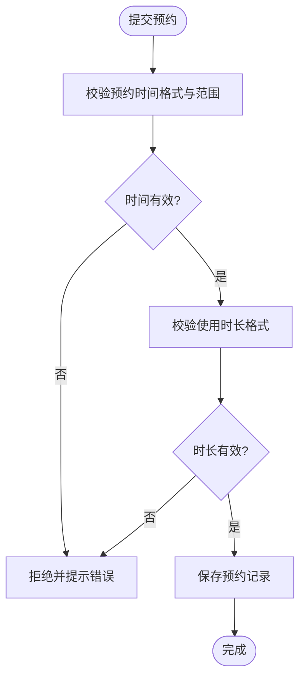
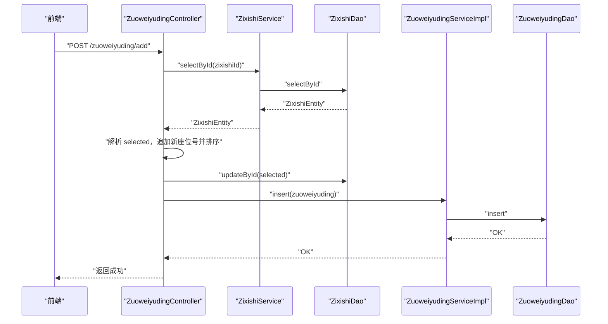
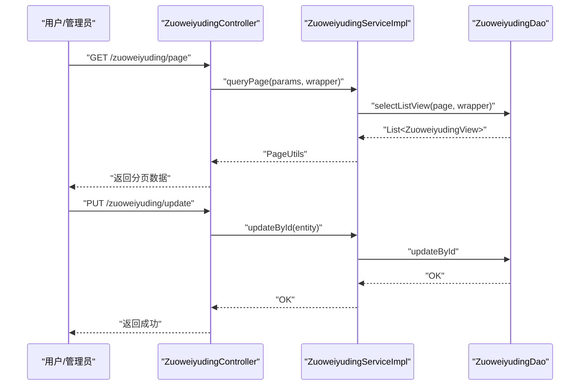
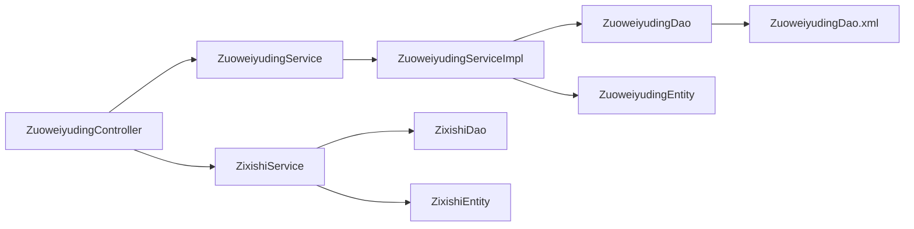

# 座位预约实体模型

<cite>
**本文引用的文件**
- [ZuoweiyudingEntity.java](file://src/main/java/com/entity/ZuoweiyudingEntity.java)
- [ZuoweiyudingService.java](file://src/main/java/com/service/ZuoweiyudingService.java)
- [ZuoweiyudingServiceImpl.java](file://src/main/java/com/service/impl/ZuoweiyudingServiceImpl.java)
- [ZuoweiyudingController.java](file://src/main/java/com/controller/ZuoweiyudingController.java)
- [ZuoweiyudingDao.java](file://src/main/java/com/dao/ZuoweiyudingDao.java)
- [ZuoweiyudingDao.xml](file://src/main/resources/mapper/ZuoweiyudingDao.xml)
- [ZuoweiyudingModel.java](file://src/main/java/com/entity/model/ZuoweiyudingModel.java)
- [ZuoweiyudingVO.java](file://src/main/java/com/entity/vo/ZuoweiyudingVO.java)
- [ZuoweiyudingView.java](file://src/main/java/com/entity/view/ZuoweiyudingView.java)
- [ZixishiEntity.java](file://src/main/java/com/entity/ZixishiEntity.java)
- [ZixishiService.java](file://src/main/java/com/service/ZixishiService.java)
- [ZixishiServiceImpl.java](file://src/main/java/com/service/impl/ZixishiServiceImpl.java)
</cite>

## 目录
1. [简介](#简介)
2. [项目结构](#项目结构)
3. [核心组件](#核心组件)
4. [架构总览](#架构总览)
5. [详细组件分析](#详细组件分析)
6. [依赖关系分析](#依赖关系分析)
7. [性能考量](#性能考量)
8. [故障排查指南](#故障排查指南)
9. [结论](#结论)
10. [附录](#附录)

## 简介
本文件围绕“座位预约”实体模型展开，重点解析 ZuoweiyudingEntity 类的字段设计与业务逻辑，深入阐述状态管理、时间控制与冲突检测机制，明确预约规则、取消政策与座位分配算法，并给出预约查询、状态更新与历史记录的实现要点。同时，结合现有代码，总结座位可用性检查、并发控制与事务处理的最佳实践，分析系统性能优化策略与数据一致性保障机制。

## 项目结构
座位预约模块采用典型的分层架构：
- 控制层：ZuoweiyudingController 提供 REST 接口，负责请求接收、参数校验与响应封装
- 服务层：ZuoweiyudingService 定义业务契约；ZuoweiyudingServiceImpl 实现分页查询、视图映射等
- 持久层：ZuoweiyudingDao 定义数据访问方法；ZuoweiyudingDao.xml 提供 SQL 映射
- 实体层：ZuoweiyudingEntity 为核心实体；ZuoweiyudingModel、ZuoweiyudingVO、ZuoweiyudingView 分别用于接收参数、移动端返回与视图聚合
- 关联实体：ZixishiEntity 表示自习室座位集合，前端通过其 selected 字段维护已选座位

**图表来源**
- [ZuoweiyudingController.java:32-224](file://src/main/java/com/controller/ZuoweiyudingController.java#L32-L224)
- [ZuoweiyudingService.java:21-35](file://src/main/java/com/service/ZuoweiyudingService.java#L21-L35)
- [ZuoweiyudingServiceImpl.java:22-62](file://src/main/java/com/service/impl/ZuoweiyudingServiceImpl.java#L22-L62)
- [ZuoweiyudingDao.java:21-33](file://src/main/java/com/dao/ZuoweiyudingDao.java#L21-L33)
- [ZuoweiyudingDao.xml:4-42](file://src/main/resources/mapper/ZuoweiyudingDao.xml#L4-L42)
- [ZuoweiyudingEntity.java:22-211](file://src/main/java/com/entity/ZuoweiyudingEntity.java#L22-L211)
- [ZuoweiyudingModel.java:22-182](file://src/main/java/com/entity/model/ZuoweiyudingModel.java#L22-L182)
- [ZuoweiyudingVO.java:21-182](file://src/main/java/com/entity/vo/ZuoweiyudingVO.java#L21-L182)
- [ZuoweiyudingView.java:20-36](file://src/main/java/com/entity/view/ZuoweiyudingView.java#L20-L36)
- [ZixishiEntity.java:32-200](file://src/main/java/com/entity/ZixishiEntity.java#L32-L200)

**章节来源**
- [ZuoweiyudingController.java:32-224](file://src/main/java/com/controller/ZuoweiyudingController.java#L32-L224)
- [ZuoweiyudingService.java:21-35](file://src/main/java/com/service/ZuoweiyudingService.java#L21-L35)
- [ZuoweiyudingServiceImpl.java:22-62](file://src/main/java/com/service/impl/ZuoweiyudingServiceImpl.java#L22-L62)
- [ZuoweiyudingDao.java:21-33](file://src/main/java/com/dao/ZuoweiyudingDao.java#L21-L33)
- [ZuoweiyudingDao.xml:4-42](file://src/main/resources/mapper/ZuoweiyudingDao.xml#L4-L42)
- [ZuoweiyudingEntity.java:22-211](file://src/main/java/com/entity/ZuoweiyudingEntity.java#L22-L211)
- [ZuoweiyudingModel.java:22-182](file://src/main/java/com/entity/model/ZuoweiyudingModel.java#L22-L182)
- [ZuoweiyudingVO.java:21-182](file://src/main/java/com/entity/vo/ZuoweiyudingVO.java#L21-L182)
- [ZuoweiyudingView.java:20-36](file://src/main/java/com/entity/view/ZuoweiyudingView.java#L20-L36)
- [ZixishiEntity.java:32-200](file://src/main/java/com/entity/ZixishiEntity.java#L32-L200)

## 核心组件
- 实体模型：ZuoweiyudingEntity 描述座位预约的核心字段，包括学生信息、自习室名称、座位号、预约时间、使用时长、审核状态与回复等
- 服务接口与实现：ZuoweiyudingService 定义分页查询、视图映射等能力；ZuoweiyudingServiceImpl 提供具体实现
- 数据访问：ZuoweiyudingDao 与 ZuoweiyudingDao.xml 完成 SQL 映射与结果集转换
- 控制器：ZuoweiyudingController 提供列表、详情、保存、更新、删除、提醒等接口
- 参数与返回模型：ZuoweiyudingModel 用于接收前端参数；ZuoweiyudingVO 用于移动端返回；ZuoweiyudingView 用于视图聚合
- 关联实体：ZixishiEntity 维护自习室座位总数与已选座位集合，前端通过 selected 字段维护座位占用情况

**章节来源**
- [ZuoweiyudingEntity.java:22-211](file://src/main/java/com/entity/ZuoweiyudingEntity.java#L22-L211)
- [ZuoweiyudingService.java:21-35](file://src/main/java/com/service/ZuoweiyudingService.java#L21-L35)
- [ZuoweiyudingServiceImpl.java:22-62](file://src/main/java/com/service/impl/ZuoweiyudingServiceImpl.java#L22-L62)
- [ZuoweiyudingDao.java:21-33](file://src/main/java/com/dao/ZuoweiyudingDao.java#L21-L33)
- [ZuoweiyudingDao.xml:4-42](file://src/main/resources/mapper/ZuoweiyudingDao.xml#L4-L42)
- [ZuoweiyudingController.java:32-224](file://src/main/java/com/controller/ZuoweiyudingController.java#L32-L224)
- [ZuoweiyudingModel.java:22-182](file://src/main/java/com/entity/model/ZuoweiyudingModel.java#L22-L182)
- [ZuoweiyudingVO.java:21-182](file://src/main/java/com/entity/vo/ZuoweiyudingVO.java#L21-L182)
- [ZuoweiyudingView.java:20-36](file://src/main/java/com/entity/view/ZuoweiyudingView.java#L20-L36)
- [ZixishiEntity.java:32-200](file://src/main/java/com/entity/ZixishiEntity.java#L32-L200)

## 架构总览
座位预约系统遵循前后端分离的典型三层架构。控制器负责路由与参数处理，服务层负责业务编排与数据映射，持久层负责数据库交互。实体模型在服务层与持久层之间传递，确保数据结构清晰、职责分明。

**图表来源**
- [ZuoweiyudingController.java:129-152](file://src/main/java/com/controller/ZuoweiyudingController.java#L129-L152)
- [ZuoweiyudingServiceImpl.java:22-62](file://src/main/java/com/service/impl/ZuoweiyudingServiceImpl.java#L22-L62)
- [ZuoweiyudingDao.java:21-33](file://src/main/java/com/dao/ZuoweiyudingDao.java#L21-L33)
- [ZuoweiyudingDao.xml:4-42](file://src/main/resources/mapper/ZuoweiyudingDao.xml#L4-L42)
- [ZuoweiyudingEntity.java:22-211](file://src/main/java/com/entity/ZuoweiyudingEntity.java#L22-L211)
- [ZixishiEntity.java:32-200](file://src/main/java/com/entity/ZixishiEntity.java#L32-L200)

## 详细组件分析

### 实体模型与字段设计
- 主键与基础信息：id、addtime
- 学生信息：xueshenghao、xueshengxingming
- 场地信息：mingcheng（自习室名称）
- 座位信息：zuoweihao（座位号）
- 时间与时长：yuyueshijian（预约时间）、shiyongshizhang（使用时长）
- 审核相关：sfsh（是否审核）、shhf（审核回复）

字段类型与约束：
- 字符串类字段用于存储文本信息，如学号、姓名、座位号、名称、时长、审核状态与回复
- 时间字段使用日期类型，配合 JSON 与格式化注解进行序列化与展示
- addtime 记录实体创建时间，便于审计与历史追踪

**图表来源**
- [ZuoweiyudingEntity.java:22-211](file://src/main/java/com/entity/ZuoweiyudingEntity.java#L22-L211)

**章节来源**
- [ZuoweiyudingEntity.java:22-211](file://src/main/java/com/entity/ZuoweiyudingEntity.java#L22-L211)

### 状态管理与审核流程
- 审核状态：sfsh 字段标识是否审核，默认在前端保存接口中设置为“是”
- 审核回复：shhf 字段用于记录管理员或系统对预约的回复
- 控制器在前端保存接口中直接设置 sfsh 为“是”，表明默认通过审核

**图表来源**
- [ZuoweiyudingController.java:129-152](file://src/main/java/com/controller/ZuoweiyudingController.java#L129-L152)
- [ZuoweiyudingServiceImpl.java:22-62](file://src/main/java/com/service/impl/ZuoweiyudingServiceImpl.java#L22-L62)
- [ZuoweiyudingDao.java:21-33](file://src/main/java/com/dao/ZuoweiyudingDao.java#L21-L33)

**章节来源**
- [ZuoweiyudingController.java:129-152](file://src/main/java/com/controller/ZuoweiyudingController.java#L129-L152)

### 时间控制与使用时长
- 预约时间：yuyueshijian 为预约开始时间，配合前端页面中的预约时间输入框
- 使用时长：shiyongshizhang 为字符串形式的时长描述，用于记录或展示
- 当前实现未对时间与时长进行严格计算与校验，建议在业务层增加时间有效性与时长合理性校验

**图表来源**
- [ZuoweiyudingController.java:129-152](file://src/main/java/com/controller/ZuoweiyudingController.java#L129-L152)
- [ZuoweiyudingEntity.java:73-81](file://src/main/java/com/entity/ZuoweiyudingEntity.java#L73-L81)

**章节来源**
- [ZuoweiyudingController.java:129-152](file://src/main/java/com/controller/ZuoweiyudingController.java#L129-L152)
- [ZuoweiyudingEntity.java:73-81](file://src/main/java/com/entity/ZuoweiyudingEntity.java#L73-L81)

### 冲突检测与座位分配算法
- 座位占用：ZixishiEntity 的 selected 字段以逗号分隔存储已选座位号
- 前端选择：前端页面支持多座位选择，将选中座位号合并为字符串
- 后端更新：在“添加预约”接口中，读取自习室实体，解析 selected，追加新座位号，排序并写回 selected
- 冲突检测：当前代码未显式进行时间冲突检测，仅维护座位占用集合。建议在插入预约前，按自习室与时间段进行查询，避免同一时段座位重复占用

**图表来源**
- [ZuoweiyudingController.java:129-152](file://src/main/java/com/controller/ZuoweiyudingController.java#L129-L152)
- [ZixishiEntity.java:92-94](file://src/main/java/com/entity/ZixishiEntity.java#L92-L94)
- [ZuoweiyudingServiceImpl.java:22-62](file://src/main/java/com/service/impl/ZuoweiyudingServiceImpl.java#L22-L62)
- [ZuoweiyudingDao.java:21-33](file://src/main/java/com/dao/ZuoweiyudingDao.java#L21-L33)

**章节来源**
- [ZuoweiyudingController.java:129-152](file://src/main/java/com/controller/ZuoweiyudingController.java#L129-L152)
- [ZixishiEntity.java:92-94](file://src/main/java/com/entity/ZixishiEntity.java#L92-L94)

### 预约规则与取消政策
- 预约规则：当前实现未在代码中体现具体的规则（如最短/最长预约时长、提前预约天数限制等），可在服务层增加校验逻辑
- 取消政策：当前未见专门的取消接口或状态变更逻辑，可在控制器与服务层新增取消与状态更新接口

**章节来源**
- [ZuoweiyudingController.java:157-172](file://src/main/java/com/controller/ZuoweiyudingController.java#L157-L172)

### 预约查询、状态更新与历史记录
- 查询：控制器提供列表、详情、条件查询与提醒计数接口
- 状态更新：控制器提供更新接口，可扩展为带业务校验的状态变更
- 历史记录：实体包含 addtime 字段，可用于生成历史记录与审计追踪

**图表来源**
- [ZuoweiyudingController.java:47-110](file://src/main/java/com/controller/ZuoweiyudingController.java#L47-L110)
- [ZuoweiyudingServiceImpl.java:22-62](file://src/main/java/com/service/impl/ZuoweiyudingServiceImpl.java#L22-L62)
- [ZuoweiyudingDao.xml:30-40](file://src/main/resources/mapper/ZuoweiyudingDao.xml#L30-L40)

**章节来源**
- [ZuoweiyudingController.java:47-110](file://src/main/java/com/controller/ZuoweiyudingController.java#L47-L110)
- [ZuoweiyudingServiceImpl.java:22-62](file://src/main/java/com/service/impl/ZuoweiyudingServiceImpl.java#L22-L62)
- [ZuoweiyudingDao.xml:30-40](file://src/main/resources/mapper/ZuoweiyudingDao.xml#L30-L40)

## 依赖关系分析
- 控制器依赖服务层接口与自习室服务/数据访问层
- 服务实现依赖数据访问接口与实体模型
- 数据访问接口与 XML 映射共同完成 SQL 查询与结果转换
- 实体模型在服务与持久层之间传递，保持数据结构一致

**图表来源**
- [ZuoweiyudingController.java:35-43](file://src/main/java/com/controller/ZuoweiyudingController.java#L35-L43)
- [ZuoweiyudingService.java:21-35](file://src/main/java/com/service/ZuoweiyudingService.java#L21-L35)
- [ZuoweiyudingServiceImpl.java:15-19](file://src/main/java/com/service/impl/ZuoweiyudingServiceImpl.java#L15-L19)
- [ZuoweiyudingDao.java:21-33](file://src/main/java/com/dao/ZuoweiyudingDao.java#L21-L33)
- [ZuoweiyudingDao.xml:4-42](file://src/main/resources/mapper/ZuoweiyudingDao.xml#L4-L42)
- [ZixishiService.java:21-34](file://src/main/java/com/service/ZixishiService.java#L21-L34)
- [ZixishiServiceImpl.java:15-19](file://src/main/java/com/service/impl/ZixishiServiceImpl.java#L15-L19)
- [ZixishiEntity.java:32-200](file://src/main/java/com/entity/ZixishiEntity.java#L32-L200)

**章节来源**
- [ZuoweiyudingController.java:35-43](file://src/main/java/com/controller/ZuoweiyudingController.java#L35-L43)
- [ZuoweiyudingServiceImpl.java:15-19](file://src/main/java/com/service/impl/ZuoweiyudingServiceImpl.java#L15-L19)
- [ZuoweiyudingDao.xml:4-42](file://src/main/resources/mapper/ZuoweiyudingDao.xml#L4-L42)
- [ZixishiService.java:21-34](file://src/main/java/com/service/ZixishiService.java#L21-L34)
- [ZixishiServiceImpl.java:15-19](file://src/main/java/com/service/impl/ZixishiServiceImpl.java#L15-L19)
- [ZixishiEntity.java:32-200](file://src/main/java/com/entity/ZixishiEntity.java#L32-L200)

## 性能考量
- 分页查询：服务层使用分页工具与实体包装，减少一次性加载大量数据
- 结果映射：通过 VO/View 进行字段裁剪，降低网络传输与前端渲染压力
- SQL 映射：XML 中使用 where 片段拼接，注意 SQL 注入防护与索引优化
- 并发控制与事务处理：当前代码未显式声明事务，建议在关键业务（如座位占用更新与预约插入）使用事务保证一致性

[本节为通用性能建议，不直接分析具体文件，故无“章节来源”]

## 故障排查指南
- 审核状态异常：若 sfsh 未按预期更新，检查控制器保存接口是否正确设置
- 座位占用不同步：若 selected 未正确更新，检查控制器中座位号追加、排序与写回逻辑
- 查询结果为空：确认分页参数与条件过滤是否正确传递至服务层与 XML 映射
- 时间格式问题：确认前端传入的时间格式与后端日期格式化注解一致

**章节来源**
- [ZuoweiyudingController.java:129-152](file://src/main/java/com/controller/ZuoweiyudingController.java#L129-L152)
- [ZuoweiyudingDao.xml:18-40](file://src/main/resources/mapper/ZuoweiyudingDao.xml#L18-L40)

## 结论
座位预约实体模型以 ZuoweiyudingEntity 为核心，结合服务层与持久层实现基本的 CRUD 与分页查询功能。当前实现具备基础的审核状态与座位占用维护能力，但在时间冲突检测、规则校验与取消政策方面存在扩展空间。建议在服务层增强业务校验与事务控制，在持久层完善索引与查询优化，以提升系统稳定性与性能。

## 附录
- 前端页面：add.html、detail.html 展示了座位号与预约时间等字段的输入与显示
- 关联实体：ZixishiEntity 的 selected 字段用于维护座位占用集合

**章节来源**
- [ZuoweiyudingController.java:177-219](file://src/main/java/com/controller/ZuoweiyudingController.java#L177-L219)
- [ZuoweiyudingDao.xml:18-40](file://src/main/resources/mapper/ZuoweiyudingDao.xml#L18-L40)
- [ZixishiEntity.java:92-94](file://src/main/java/com/entity/ZixishiEntity.java#L92-L94)