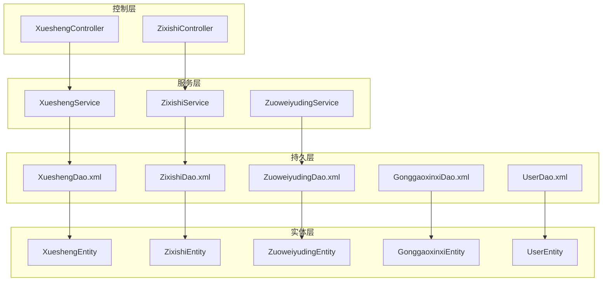
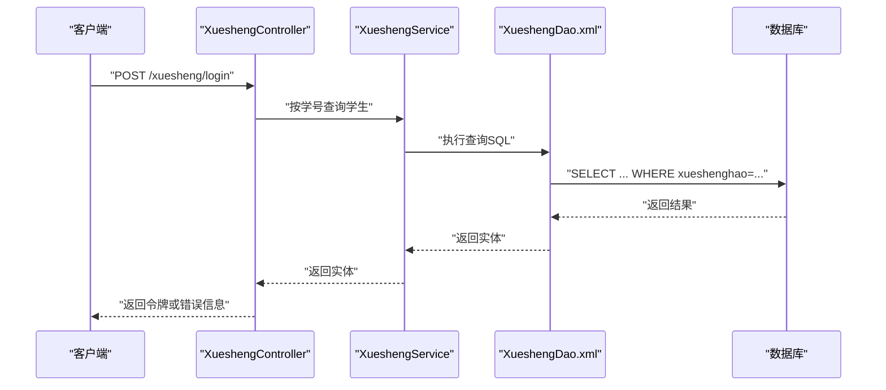
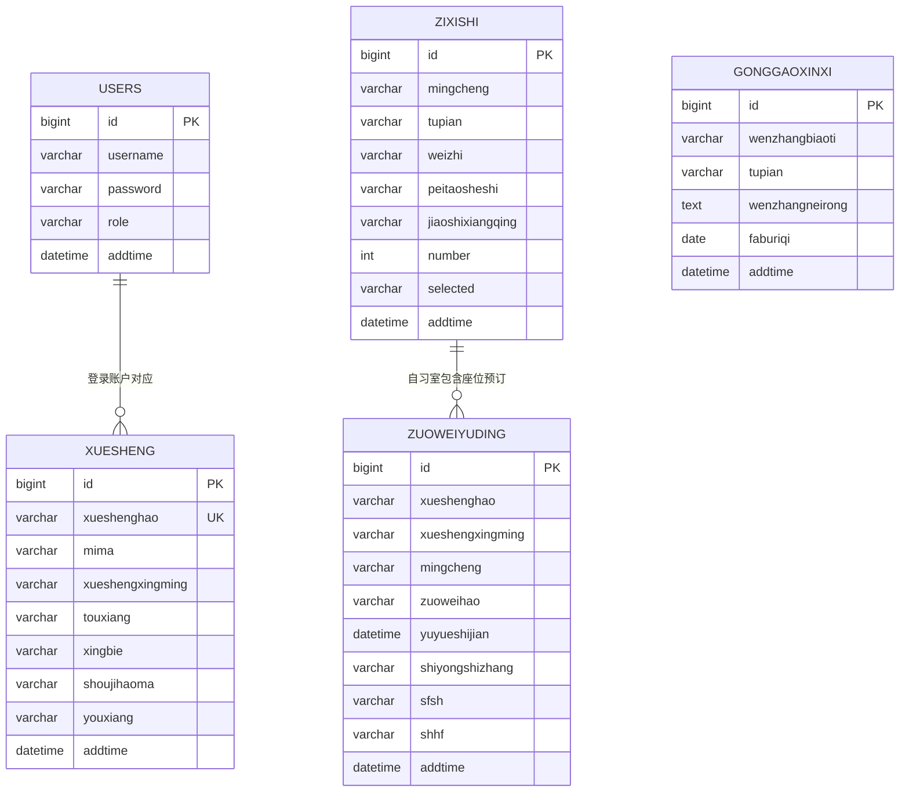
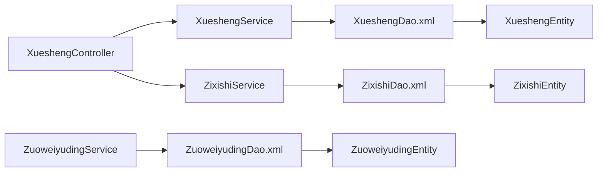

# 数据模型设计

<cite>
**本文引用的文件**
- [XueshengEntity.java](file://src/main/java/com/entity/XueshengEntity.java)
- [ZixishiEntity.java](file://src/main/java/com/entity/ZixishiEntity.java)
- [ZuoweiyudingEntity.java](file://src/main/java/com/entity/ZuoweiyudingEntity.java)
- [GonggaoxinxiEntity.java](file://src/main/java/com/entity/GonggaoxinxiEntity.java)
- [UserEntity.java](file://src/main/java/com/entity/UserEntity.java)
- [XueshengDao.xml](file://src/main/resources/mapper/XueshengDao.xml)
- [ZixishiDao.xml](file://src/main/resources/mapper/ZixishiDao.xml)
- [ZuoweiyudingDao.xml](file://src/main/resources/mapper/ZuoweiyudingDao.xml)
- [GonggaoxinxiDao.xml](file://src/main/resources/mapper/GonggaoxinxiDao.xml)
- [UserDao.xml](file://src/main/resources/mapper/UserDao.xml)
- [XueshengService.java](file://src/main/java/com/service/XueshengService.java)
- [ZixishiService.java](file://src/main/java/com/service/ZixishiService.java)
- [ZuoweiyudingService.java](file://src/main/java/com/service/ZuoweiyudingService.java)
- [XueshengController.java](file://src/main/java/com/controller/XueshengController.java)
- [ZixishiController.java](file://src/main/java/com/controller/ZixishiController.java)
</cite>

## 目录
1. [简介](#简介)
2. [项目结构](#项目结构)
3. [核心组件](#核心组件)
4. [架构总览](#架构总览)
5. [详细组件分析](#详细组件分析)
6. [依赖分析](#依赖分析)
7. [性能考虑](#性能考虑)
8. [故障排查指南](#故障排查指南)
9. [结论](#结论)
10. [附录](#附录)

## 简介
本文件面向自习室管理系统，提供系统数据库层面的数据模型设计文档。重点包括：
- 实体与表结构定义、字段类型与约束
- 实体间关系映射（一对一、一对多、多对多）
- 主键、外键、索引策略与查询优化
- 数据校验与业务规则、数据完整性保障
- ER 图与实体关系图
- 数据访问模式、缓存策略与性能优化
- 数据迁移、版本管理与备份恢复策略

## 项目结构
系统采用前后端分离的典型三层架构：控制层（Controller）、服务层（Service）、持久层（DAO/MyBatis）与实体层（Entity）。数据库表通过 MyBatis XML 映射文件进行查询定义，实体类通过注解映射到数据库表。

图表来源
- [XueshengController.java:46-284](file://src/main/java/com/controller/XueshengController.java#L46-L284)
- [ZixishiController.java:46-208](file://src/main/java/com/controller/ZixishiController.java#L46-L208)
- [XueshengService.java:21-35](file://src/main/java/com/service/XueshengService.java#L21-L35)
- [ZixishiService.java:21-35](file://src/main/java/com/service/ZixishiService.java#L21-L35)
- [ZuoweiyudingService.java:21-35](file://src/main/java/com/service/ZuoweiyudingService.java#L21-L35)
- [XueshengDao.xml:4-41](file://src/main/resources/mapper/XueshengDao.xml#L4-L41)
- [ZixishiDao.xml:4-41](file://src/main/resources/mapper/ZixishiDao.xml#L4-L41)
- [ZuoweiyudingDao.xml:4-43](file://src/main/resources/mapper/ZuoweiyudingDao.xml#L4-L43)
- [GonggaoxinxiDao.xml:4-38](file://src/main/resources/mapper/GonggaoxinxiDao.xml#L4-L38)
- [UserDao.xml:4-13](file://src/main/resources/mapper/UserDao.xml#L4-L13)
- [XueshengEntity.java:31-201](file://src/main/java/com/entity/XueshengEntity.java#L31-L201)
- [ZixishiEntity.java:31-201](file://src/main/java/com/entity/ZixishiEntity.java#L31-L201)
- [ZuoweiyudingEntity.java:21-212](file://src/main/java/com/entity/ZuoweiyudingEntity.java#L21-L212)
- [GonggaoxinxiEntity.java:31-149](file://src/main/java/com/entity/GonggaoxinxiEntity.java#L31-L149)
- [UserEntity.java:13-78](file://src/main/java/com/entity/UserEntity.java#L13-L78)

章节来源
- [XueshengController.java:46-284](file://src/main/java/com/controller/XueshengController.java#L46-L284)
- [ZixishiController.java:46-208](file://src/main/java/com/controller/ZixishiController.java#L46-L208)
- [XueshengService.java:21-35](file://src/main/java/com/service/XueshengService.java#L21-L35)
- [ZixishiService.java:21-35](file://src/main/java/com/service/ZixishiService.java#L21-L35)
- [ZuoweiyudingService.java:21-35](file://src/main/java/com/service/ZuoweiyudingService.java#L21-L35)
- [XueshengDao.xml:4-41](file://src/main/resources/mapper/XueshengDao.xml#L4-L41)
- [ZixishiDao.xml:4-41](file://src/main/resources/mapper/ZixishiDao.xml#L4-L41)
- [ZuoweiyudingDao.xml:4-43](file://src/main/resources/mapper/ZuoweiyudingDao.xml#L4-L43)
- [GonggaoxinxiDao.xml:4-38](file://src/main/resources/mapper/GonggaoxinxiDao.xml#L4-L38)
- [UserDao.xml:4-13](file://src/main/resources/mapper/UserDao.xml#L4-L13)
- [XueshengEntity.java:31-201](file://src/main/java/com/entity/XueshengEntity.java#L31-L201)
- [ZixishiEntity.java:31-201](file://src/main/java/com/entity/ZixishiEntity.java#L31-L201)
- [ZuoweiyudingEntity.java:21-212](file://src/main/java/com/entity/ZuoweiyudingEntity.java#L21-L212)
- [GonggaoxinxiEntity.java:31-149](file://src/main/java/com/entity/GonggaoxinxiEntity.java#L31-L149)
- [UserEntity.java:13-78](file://src/main/java/com/entity/UserEntity.java#L13-L78)

## 核心组件
本系统涉及以下核心实体与表：
- 用户表 users：系统登录用户，支持角色区分
- 学生表 xuesheng：学生信息与登录凭证
- 自习室表 zixishi：自习室基础信息、座位总数与已选座位集合
- 座位预订表 zuoweiyuding：座位预订记录、审核状态与回复
- 公告信息表 gonggaoxinxi：公告标题、图片、内容与发布时间

章节来源
- [UserEntity.java:13-78](file://src/main/java/com/entity/UserEntity.java#L13-L78)
- [XueshengEntity.java:31-201](file://src/main/java/com/entity/XueshengEntity.java#L31-L201)
- [ZixishiEntity.java:31-201](file://src/main/java/com/entity/ZixishiEntity.java#L31-L201)
- [ZuoweiyudingEntity.java:21-212](file://src/main/java/com/entity/ZuoweiyudingEntity.java#L21-L212)
- [GonggaoxinxiEntity.java:31-149](file://src/main/java/com/entity/GonggaoxinxiEntity.java#L31-L149)

## 架构总览
系统采用 MyBatis Plus 的实体-映射-查询模式，控制层负责接收请求、参数校验与返回统一响应；服务层封装业务逻辑与分页查询；持久层通过 XML 映射文件定义查询语句；实体类通过注解映射数据库表。

图表来源
- [XueshengController.java:58-68](file://src/main/java/com/controller/XueshengController.java#L58-L68)
- [XueshengService.java:21-35](file://src/main/java/com/service/XueshengService.java#L21-L35)
- [XueshengDao.xml:17-27](file://src/main/resources/mapper/XueshengDao.xml#L17-L27)

章节来源
- [XueshengController.java:58-68](file://src/main/java/com/controller/XueshengController.java#L58-L68)
- [XueshengService.java:21-35](file://src/main/java/com/service/XueshengService.java#L21-L35)
- [XueshengDao.xml:17-27](file://src/main/resources/mapper/XueshengDao.xml#L17-L27)

## 详细组件分析

### 实体与表结构定义
- 用户表 users
  - 字段：id（自增主键）、username、password、role、addtime
  - 约束：id 自增；role 表示用户角色
  - 用途：系统后台登录与权限控制
- 学生表 xuesheng
  - 字段：id（主键）、xueshenghao、mima、xueshengxingming、touxiang、xingbie、shoujihaoma、youxiang、addtime
  - 约束：xueshenghao 唯一性由业务层保证；id 主键
  - 用途：学生基本信息与登录凭证
- 自习室表 zixishi
  - 字段：id（主键）、mingcheng、tupian、weizhi、peitaosheshi、jiaoshixiangqing、number、selected、addtime
  - 约束：number 为座位总数；selected 以逗号分隔的已选座位标识
  - 用途：自习室基础信息与座位状态
- 座位预订表 zuoweiyuding
  - 字段：id（主键）、xueshenghao、xueshengxingming、mingcheng、zuoweihao、yuyueshijian、shiyongshizhang、sfsh、shhf、addtime
  - 约束：sfsh 表示是否审核（字符串枚举）；shhf 为审核回复
  - 用途：座位预订与审核流程
- 公告信息表 gonggaoxinxi
  - 字段：id（主键）、wenzhangbiaoti、tupian、wenzhangneirong、faburiqi、addtime
  - 约束：faburiqi 为发布日期
  - 用途：公告信息展示

章节来源
- [UserEntity.java:13-78](file://src/main/java/com/entity/UserEntity.java#L13-L78)
- [XueshengEntity.java:31-201](file://src/main/java/com/entity/XueshengEntity.java#L31-L201)
- [ZixishiEntity.java:31-201](file://src/main/java/com/entity/ZixishiEntity.java#L31-L201)
- [ZuoweiyudingEntity.java:21-212](file://src/main/java/com/entity/ZuoweiyudingEntity.java#L21-L212)
- [GonggaoxinxiEntity.java:31-149](file://src/main/java/com/entity/GonggaoxinxiEntity.java#L31-L149)

### 关系映射与ER图
- 一对一
  - 用户表 users 与 学生表 xuesheng：通过登录账号与密码关联，用于身份认证与权限控制
- 一对多
  - 自习室表 zixishi 与 座位预订表 zuoweiyuding：一个自习室可有多条预订记录
  - 公告信息表 gonggaoxinxi 与 系统：作为系统公告信息展示
- 多对多
  - 当前未发现直接的多对多关系；座位选择通过 selected 字段存储逗号分隔的座位编号，属于弱化多对多表达

图表来源
- [UserEntity.java:13-78](file://src/main/java/com/entity/UserEntity.java#L13-L78)
- [XueshengEntity.java:31-201](file://src/main/java/com/entity/XueshengEntity.java#L31-L201)
- [ZixishiEntity.java:31-201](file://src/main/java/com/entity/ZixishiEntity.java#L31-L201)
- [ZuoweiyudingEntity.java:21-212](file://src/main/java/com/entity/ZuoweiyudingEntity.java#L21-L212)
- [GonggaoxinxiEntity.java:31-149](file://src/main/java/com/entity/GonggaoxinxiEntity.java#L31-L149)

### 主键、外键、索引策略与查询优化
- 主键设计
  - users、xuesheng、zixishi、zuoweiyuding、gonggaoxinxi 均使用自增主键或业务主键（如 xueshenghao），确保唯一性
- 外键约束
  - 代码中未显式声明外键约束；通过业务层与查询层保证参照完整性
- 索引策略
  - 建议在以下列建立索引：
    - xuesheng.xueshenghao（唯一索引）
    - zixishi.mingcheng（常用筛选）
    - zuoweiyuding.xueshenghao、zuoweiyuding.mingcheng、zuoweiyuding.zuoweihao（组合索引）
    - gonggaoxinxi.faburiqi（排序与范围查询）
- 查询优化
  - 使用分页查询（PageUtils）与条件过滤（MPUtil）减少数据传输
  - 对高频查询字段建立索引，避免全表扫描
  - 控制层使用 EntityWrapper/Wrapper 进行动态条件拼接，避免复杂 SQL

章节来源
- [XueshengDao.xml:17-39](file://src/main/resources/mapper/XueshengDao.xml#L17-L39)
- [ZixishiDao.xml:17-39](file://src/main/resources/mapper/ZixishiDao.xml#L17-L39)
- [ZuoweiyudingDao.xml:18-41](file://src/main/resources/mapper/ZuoweiyudingDao.xml#L18-L41)
- [GonggaoxinxiDao.xml:14-37](file://src/main/resources/mapper/GonggaoxinxiDao.xml#L14-L37)
- [UserDao.xml:6-12](file://src/main/resources/mapper/UserDao.xml#L6-L12)

### 数据验证规则与业务规则
- 登录与注册
  - 登录：按学号查询学生，比对密码；成功后生成令牌
  - 注册：检查学号唯一性，生成临时 id 插入
- 密码重置
  - 将指定学号学生的密码重置为默认值
- 预订审核
  - 预订记录包含审核状态与回复字段，供管理员处理
- 时间字段
  - addtime 记录创建时间；部分实体包含日期格式化注解，便于前端展示

章节来源
- [XueshengController.java:58-119](file://src/main/java/com/controller/XueshengController.java#L58-L119)
- [ZuoweiyudingEntity.java:84-93](file://src/main/java/com/entity/ZuoweiyudingEntity.java#L84-L93)

### 数据访问模式与缓存策略
- 数据访问模式
  - 控制层调用服务层，服务层通过 MyBatis Plus 接口与 XML 映射执行查询与更新
  - 支持分页查询、条件查询、视图查询等
- 缓存策略
  - 建议对高频读取的静态数据（如公告列表、自习室基础信息）引入 Redis 缓存
  - 对热点查询（如按学号查询）增加本地缓存，降低数据库压力

章节来源
- [XueshengService.java:21-35](file://src/main/java/com/service/XueshengService.java#L21-L35)
- [ZixishiService.java:21-35](file://src/main/java/com/service/ZixishiService.java#L21-L35)
- [ZuoweiyudingService.java:21-35](file://src/main/java/com/service/ZuoweiyudingService.java#L21-L35)

### 数据完整性保障机制
- 唯一性约束
  - 学号唯一性由业务层检查与提示
- 事务与一致性
  - 对于预订与座位状态更新，建议在服务层开启事务，保证数据一致性
- 输入校验
  - 控制层使用工具类进行参数校验，减少非法输入进入数据库

章节来源
- [XueshengController.java:74-85](file://src/main/java/com/controller/XueshengController.java#L74-L85)
- [XueshengController.java:189-216](file://src/main/java/com/controller/XueshengController.java#L189-L216)

## 依赖分析
- 控制器依赖服务接口，服务接口依赖 MyBatis Plus 与 XML 映射
- 实体类通过注解映射数据库表，DAO XML 文件定义查询语句
- 业务层通过 Wrapper 动态拼接查询条件，提升灵活性

图表来源
- [XueshengController.java:46-284](file://src/main/java/com/controller/XueshengController.java#L46-L284)
- [ZixishiController.java:46-208](file://src/main/java/com/controller/ZixishiController.java#L46-L208)
- [XueshengService.java:21-35](file://src/main/java/com/service/XueshengService.java#L21-L35)
- [ZixishiService.java:21-35](file://src/main/java/com/service/ZixishiService.java#L21-L35)
- [ZuoweiyudingService.java:21-35](file://src/main/java/com/service/ZuoweiyudingService.java#L21-L35)
- [XueshengDao.xml:4-41](file://src/main/resources/mapper/XueshengDao.xml#L4-L41)
- [ZixishiDao.xml:4-41](file://src/main/resources/mapper/ZixishiDao.xml#L4-L41)
- [ZuoweiyudingDao.xml:4-43](file://src/main/resources/mapper/ZuoweiyudingDao.xml#L4-L43)
- [XueshengEntity.java:31-201](file://src/main/java/com/entity/XueshengEntity.java#L31-L201)
- [ZixishiEntity.java:31-201](file://src/main/java/com/entity/ZixishiEntity.java#L31-L201)
- [ZuoweiyudingEntity.java:21-212](file://src/main/java/com/entity/ZuoweiyudingEntity.java#L21-L212)

章节来源
- [XueshengController.java:46-284](file://src/main/java/com/controller/XueshengController.java#L46-L284)
- [ZixishiController.java:46-208](file://src/main/java/com/controller/ZixishiController.java#L46-L208)
- [XueshengService.java:21-35](file://src/main/java/com/service/XueshengService.java#L21-L35)
- [ZixishiService.java:21-35](file://src/main/java/com/service/ZixishiService.java#L21-L35)
- [ZuoweiyudingService.java:21-35](file://src/main/java/com/service/ZuoweiyudingService.java#L21-L35)
- [XueshengDao.xml:4-41](file://src/main/resources/mapper/XueshengDao.xml#L4-L41)
- [ZixishiDao.xml:4-41](file://src/main/resources/mapper/ZixishiDao.xml#L4-L41)
- [ZuoweiyudingDao.xml:4-43](file://src/main/resources/mapper/ZuoweiyudingDao.xml#L4-L43)
- [XueshengEntity.java:31-201](file://src/main/java/com/entity/XueshengEntity.java#L31-L201)
- [ZixishiEntity.java:31-201](file://src/main/java/com/entity/ZixishiEntity.java#L31-L201)
- [ZuoweiyudingEntity.java:21-212](file://src/main/java/com/entity/ZuoweiyudingEntity.java#L21-L212)

## 性能考虑
- 索引优化
  - 在高频查询字段上建立索引，如 xueshenghao、mingcheng、faburiqi
- 分页与过滤
  - 使用 PageUtils 与 MPUtil 进行分页与条件过滤，避免一次性加载大量数据
- 缓存
  - 引入 Redis 缓存热门数据，减少数据库访问
- 并发与锁
  - 预订与座位状态更新需考虑并发场景，建议使用乐观锁或分布式锁

## 故障排查指南
- 登录失败
  - 检查学号是否存在、密码是否匹配；确认用户状态正常
- 注册失败
  - 检查学号是否重复；确认必填字段完整
- 预订异常
  - 检查座位是否已被占用（selected 字段）；确认审核状态与回复
- 查询无结果
  - 检查查询条件与分页参数；确认索引是否生效

章节来源
- [XueshengController.java:58-119](file://src/main/java/com/controller/XueshengController.java#L58-L119)
- [XueshengController.java:189-216](file://src/main/java/com/controller/XueshengController.java#L189-L216)
- [ZuoweiyudingEntity.java:84-93](file://src/main/java/com/entity/ZuoweiyudingEntity.java#L84-L93)

## 结论
本数据模型围绕“用户—学生—自习室—座位预订—公告”构建，采用 MyBatis Plus 的实体-映射-查询模式实现清晰的分层与职责划分。通过合理的索引、分页与缓存策略，可有效提升系统性能。建议在后续版本中补充外键约束与事务控制，进一步增强数据一致性与可靠性。

## 附录
- 数据迁移
  - 新增字段：先添加列并补全默认值，再开放业务使用
  - 删除字段：评估影响后迁移数据，再删除列
- 版本管理
  - 通过数据库版本脚本管理结构变更，配合灰度发布
- 备份恢复
  - 定期全量备份与增量日志备份；制定恢复演练计划