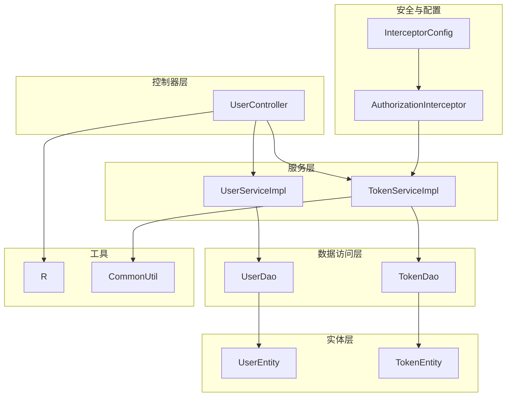
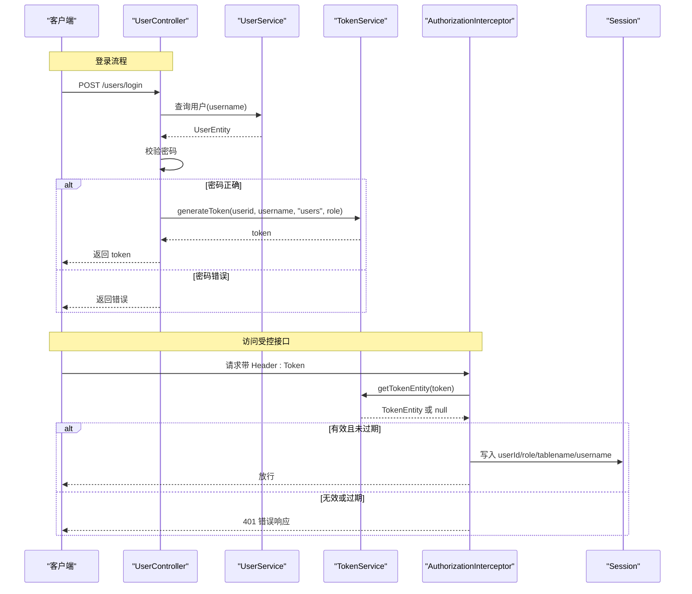
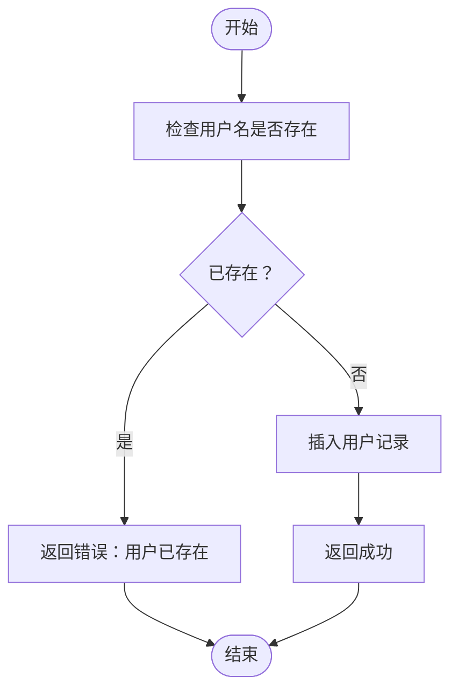
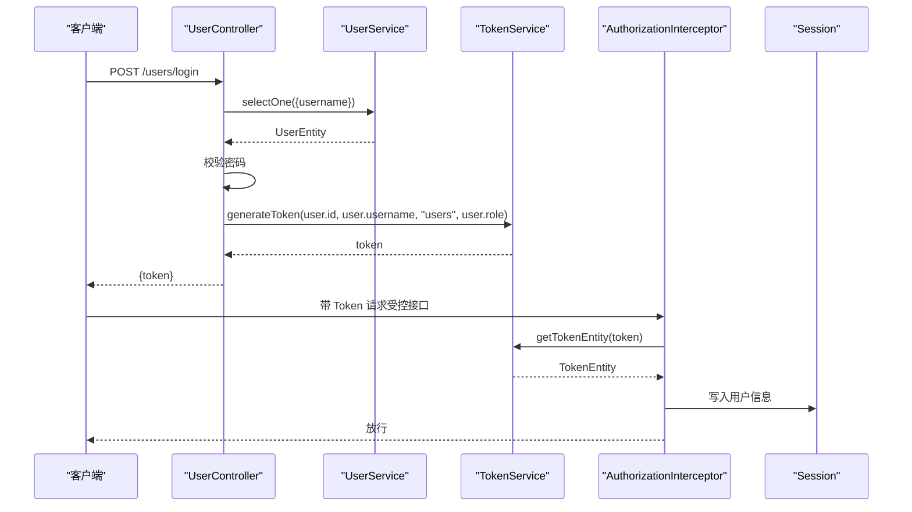
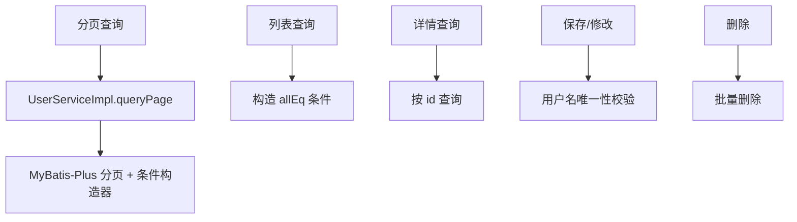
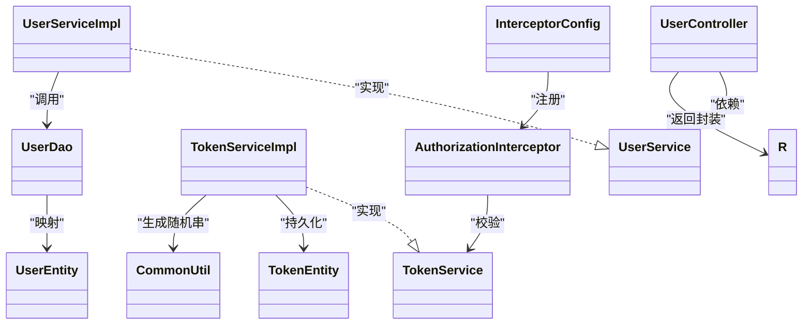

# 用户实体模型

<cite>
**本文引用的文件**
- [UserEntity.java](file://src/main/java/com/entity/UserEntity.java)
- [UserController.java](file://src/main/java/com/controller/UserController.java)
- [UserService.java](file://src/main/java/com/service/UserService.java)
- [UserServiceImpl.java](file://src/main/java/com/service/impl/UserServiceImpl.java)
- [UserDao.java](file://src/main/java/com/dao/UserDao.java)
- [UserDao.xml](file://src/main/resources/mapper/UserDao.xml)
- [TokenEntity.java](file://src/main/java/com/entity/TokenEntity.java)
- [TokenService.java](file://src/main/java/com/service/TokenService.java)
- [TokenServiceImpl.java](file://src/main/java/com/service/impl/TokenServiceImpl.java)
- [AuthorizationInterceptor.java](file://src/main/java/com/interceptor/AuthorizationInterceptor.java)
- [InterceptorConfig.java](file://src/main/java/com/config/InterceptorConfig.java)
- [R.java](file://src/main/java/com/utils/R.java)
- [CommonUtil.java](file://src/main/java/com/utils/CommonUtil.java)
</cite>

## 目录
1. [简介](#简介)
2. [项目结构](#项目结构)
3. [核心组件](#核心组件)
4. [架构总览](#架构总览)
5. [详细组件分析](#详细组件分析)
6. [依赖关系分析](#依赖关系分析)
7. [性能考量](#性能考量)
8. [故障排查指南](#故障排查指南)
9. [结论](#结论)
10. [附录](#附录)

## 简介
本文件围绕“用户实体模型”展开，系统性解析 UserEntity 的字段设计、业务语义与约束；阐述基于 Token 的权限体系、角色分类与访问控制机制；梳理用户注册、登录验证与会话管理的技术实现；并给出用户数据增删改查的最佳实践与安全性建议（包括密码存储策略与隐私保护）。

## 项目结构
围绕用户模块的关键文件组织如下：
- 实体层：UserEntity、TokenEntity
- 数据访问层：UserDao、UserDao.xml
- 服务层：UserService、UserServiceImpl、TokenService、TokenServiceImpl
- 控制层：UserController
- 安全与拦截：AuthorizationInterceptor、InterceptorConfig
- 工具与响应封装：R、CommonUtil

图表来源
- [UserController.java:38-175](file://src/main/java/com/controller/UserController.java#L38-L175)
- [UserServiceImpl.java:24-50](file://src/main/java/com/service/impl/UserServiceImpl.java#L24-L50)
- [TokenServiceImpl.java:28-80](file://src/main/java/com/service/impl/TokenServiceImpl.java#L28-L80)
- [UserDao.java:13-23](file://src/main/java/com/dao/UserDao.java#L13-L23)
- [UserEntity.java:10-78](file://src/main/java/com/entity/UserEntity.java#L10-L78)
- [TokenEntity.java:10-133](file://src/main/java/com/entity/TokenEntity.java#L10-L133)
- [AuthorizationInterceptor.java:25-96](file://src/main/java/com/interceptor/AuthorizationInterceptor.java#L25-L96)
- [InterceptorConfig.java:11-39](file://src/main/java/com/config/InterceptorConfig.java#L11-L39)
- [R.java:6-52](file://src/main/java/com/utils/R.java#L6-L52)
- [CommonUtil.java:5-23](file://src/main/java/com/utils/CommonUtil.java#L5-L23)

章节来源
- [UserEntity.java:10-78](file://src/main/java/com/entity/UserEntity.java#L10-L78)
- [UserController.java:38-175](file://src/main/java/com/controller/UserController.java#L38-L175)
- [UserServiceImpl.java:24-50](file://src/main/java/com/service/impl/UserServiceImpl.java#L24-L50)
- [TokenServiceImpl.java:28-80](file://src/main/java/com/service/impl/TokenServiceImpl.java#L28-L80)
- [AuthorizationInterceptor.java:25-96](file://src/main/java/com/interceptor/AuthorizationInterceptor.java#L25-L96)
- [InterceptorConfig.java:11-39](file://src/main/java/com/config/InterceptorConfig.java#L11-L39)

## 核心组件
- 用户实体 UserEntity
  - 字段与类型：id（Long）、username（String）、password（String）、role（String）、addtime（Date）
  - 主键：自增主键
  - 映射表：users
  - 业务含义：标识系统用户、凭证（账号/密码）、角色类型、创建时间
- Token 实体 TokenEntity
  - 字段与类型：id（Long）、userid（Long）、username（String）、tablename（String）、role（String）、token（String）、expiratedtime（Date）、addtime（Date）
  - 主键：自增主键
  - 映射表：token
  - 业务含义：记录登录态令牌、用户身份、角色、过期时间等
- 控制器 UserController
  - 提供登录、注册、退出、重置密码、分页列表、详情、保存、修改、删除、获取当前会话用户等接口
- 服务层 UserService/Impl
  - 封装用户分页查询、列表查询、插入、更新、批量删除等
- 服务层 TokenService/Impl
  - 生成 Token、校验 Token、设置过期时间（默认1小时）
- 拦截器 AuthorizationInterceptor
  - 统一从 Header 中提取 Token，校验有效性后注入 Session，未通过则返回统一错误响应
- 配置 InterceptorConfig
  - 注册拦截器，排除静态资源路径

章节来源
- [UserEntity.java:10-78](file://src/main/java/com/entity/UserEntity.java#L10-L78)
- [TokenEntity.java:10-133](file://src/main/java/com/entity/TokenEntity.java#L10-L133)
- [UserController.java:38-175](file://src/main/java/com/controller/UserController.java#L38-L175)
- [UserService.java:15-26](file://src/main/java/com/service/UserService.java#L15-L26)
- [UserServiceImpl.java:24-50](file://src/main/java/com/service/impl/UserServiceImpl.java#L24-L50)
- [TokenService.java:13-27](file://src/main/java/com/service/TokenService.java#L13-L27)
- [TokenServiceImpl.java:28-80](file://src/main/java/com/service/impl/TokenServiceImpl.java#L28-L80)
- [AuthorizationInterceptor.java:25-96](file://src/main/java/com/interceptor/AuthorizationInterceptor.java#L25-L96)
- [InterceptorConfig.java:11-39](file://src/main/java/com/config/InterceptorConfig.java#L11-L39)

## 架构总览
用户认证与授权的整体流程如下：

图表来源
- [UserController.java:51-60](file://src/main/java/com/controller/UserController.java#L51-L60)
- [UserServiceImpl.java:24-50](file://src/main/java/com/service/impl/UserServiceImpl.java#L24-L50)
- [TokenServiceImpl.java:54-78](file://src/main/java/com/service/impl/TokenServiceImpl.java#L54-L78)
- [AuthorizationInterceptor.java:58-94](file://src/main/java/com/interceptor/AuthorizationInterceptor.java#L58-L94)
- [R.java:16-29](file://src/main/java/com/utils/R.java#L16-L29)

## 详细组件分析

### 用户实体 UserEntity 字段详解
- id（Long）
  - 类型：长整型
  - 含义：用户唯一标识
  - 约束：自增主键，非空
- username（String）
  - 类型：字符串
  - 含义：用户登录账号
  - 约束：需唯一（注册/保存时进行重复校验）
- password（String）
  - 类型：字符串
  - 含义：用户登录密码
  - 约束：当前实现为明文比较（见安全章节建议）
- role（String）
  - 类型：字符串
  - 含义：用户角色类型（如“users”）
  - 约束：用于权限判定与拦截器放行逻辑
- addtime（Date）
  - 类型：日期时间
  - 含义：记录创建时间
  - 约束：通常由数据库默认值或服务端赋值

字段设计与约束要点
- 使用 MyBatis-Plus 注解映射到 users 表，采用自增主键策略
- 字段命名清晰，便于前后端交互与日志追踪
- 建议对 username 增加唯一索引，避免并发场景下的重复

章节来源
- [UserEntity.java:10-78](file://src/main/java/com/entity/UserEntity.java#L10-L78)

### Token 实体 TokenEntity 字段详解
- id（Long）、userid（Long）、username（String）、tablename（String）、role（String）、token（String）、expiratedtime（Date）、addtime（Date）
- 用途：持久化用户登录态，支持过期时间控制
- 过期策略：生成时设置为当前时间+1小时；校验时若过期则视为无效

章节来源
- [TokenEntity.java:10-133](file://src/main/java/com/entity/TokenEntity.java#L10-L133)
- [TokenServiceImpl.java:54-78](file://src/main/java/com/service/impl/TokenServiceImpl.java#L54-L78)

### 用户权限体系与访问控制
- 角色分类
  - role 字段用于区分用户类型（如“users”），可扩展为更细粒度的角色枚举
- 访问控制机制
  - 全局拦截器 AuthorizationInterceptor 从请求头提取 Token，校验通过后将用户信息写入 Session
  - 对于标注 @IgnoreAuth 的接口，跳过校验
  - 未通过校验时返回统一错误响应

章节来源
- [AuthorizationInterceptor.java:25-96](file://src/main/java/com/interceptor/AuthorizationInterceptor.java#L25-L96)
- [InterceptorConfig.java:11-39](file://src/main/java/com/config/InterceptorConfig.java#L11-L39)
- [UserController.java:23-34](file://src/main/java/com/controller/UserController.java#L23-L34)

### 用户注册流程
- 接口：POST /users/register
- 流程要点
  - 校验用户名是否已存在
  - 插入新用户记录
  - 返回统一成功响应

图表来源
- [UserController.java:65-74](file://src/main/java/com/controller/UserController.java#L65-L74)

章节来源
- [UserController.java:65-74](file://src/main/java/com/controller/UserController.java#L65-L74)

### 登录验证与会话管理
- 接口：POST /users/login
- 流程要点
  - 根据 username 查询用户
  - 明文比对密码（见安全建议）
  - 生成 Token 并返回
- 会话注入
  - 拦截器校验 Token 成功后，将 userId、role、tablename、username 写入 Session，后续接口可通过 Session 获取当前用户

图表来源
- [UserController.java:51-60](file://src/main/java/com/controller/UserController.java#L51-L60)
- [TokenServiceImpl.java:54-78](file://src/main/java/com/service/impl/TokenServiceImpl.java#L54-L78)
- [AuthorizationInterceptor.java:68-79](file://src/main/java/com/interceptor/AuthorizationInterceptor.java#L68-L79)

章节来源
- [UserController.java:51-60](file://src/main/java/com/controller/UserController.java#L51-L60)
- [TokenServiceImpl.java:54-78](file://src/main/java/com/service/impl/TokenServiceImpl.java#L54-L78)
- [AuthorizationInterceptor.java:68-79](file://src/main/java/com/interceptor/AuthorizationInterceptor.java#L68-L79)

### 用户数据的增删改查（CRUD）
- 分页列表：GET /users/page
  - 参数：分页参数与查询条件
  - 实现：调用 UserServiceImpl.queryPage，内部使用 MyBatis-Plus 分页与条件构造器
- 列表查询：GET /users/list
  - 参数：UserEntity 条件对象
  - 实现：构造 allEq 条件，查询视图列表
- 详情查询：GET /users/info/{id}
  - 实现：按 id 查询用户
- 保存新增：POST /users/save
  - 实现：校验用户名唯一后插入
- 修改：POST /users/update
  - 实现：校验用户名唯一性后按 id 更新
- 删除：DELETE /users/delete
  - 实现：批量删除

图表来源
- [UserController.java:103-174](file://src/main/java/com/controller/UserController.java#L103-L174)
- [UserServiceImpl.java:27-48](file://src/main/java/com/service/impl/UserServiceImpl.java#L27-L48)
- [UserDao.xml:6-12](file://src/main/resources/mapper/UserDao.xml#L6-L12)

章节来源
- [UserController.java:103-174](file://src/main/java/com/controller/UserController.java#L103-L174)
- [UserServiceImpl.java:27-48](file://src/main/java/com/service/impl/UserServiceImpl.java#L27-L48)
- [UserDao.xml:6-12](file://src/main/resources/mapper/UserDao.xml#L6-L12)

### 密码重置与退出
- 密码重置：POST /users/resetPass
  - 将用户密码重置为固定值（演示用途）
- 退出：GET /users/logout
  - 使当前会话失效

章节来源
- [UserController.java:88-98](file://src/main/java/com/controller/UserController.java#L88-L98)
- [UserController.java:78-83](file://src/main/java/com/controller/UserController.java#L78-L83)

## 依赖关系分析
- 控制器依赖服务层；服务层依赖数据访问层；拦截器依赖 TokenService
- 统一响应封装 R 用于控制器返回标准化结果
- 拦截器配置在全局生效，排除静态资源路径

图表来源
- [UserController.java:38-175](file://src/main/java/com/controller/UserController.java#L38-L175)
- [UserService.java:15-26](file://src/main/java/com/service/UserService.java#L15-L26)
- [UserServiceImpl.java:24-50](file://src/main/java/com/service/impl/UserServiceImpl.java#L24-L50)
- [TokenService.java:13-27](file://src/main/java/com/service/TokenService.java#L13-L27)
- [TokenServiceImpl.java:28-80](file://src/main/java/com/service/impl/TokenServiceImpl.java#L28-L80)
- [UserDao.java:13-23](file://src/main/java/com/dao/UserDao.java#L13-L23)
- [UserEntity.java:10-78](file://src/main/java/com/entity/UserEntity.java#L10-L78)
- [TokenEntity.java:10-133](file://src/main/java/com/entity/TokenEntity.java#L10-L133)
- [AuthorizationInterceptor.java:25-96](file://src/main/java/com/interceptor/AuthorizationInterceptor.java#L25-L96)
- [InterceptorConfig.java:11-39](file://src/main/java/com/config/InterceptorConfig.java#L11-L39)
- [R.java:6-52](file://src/main/java/com/utils/R.java#L6-L52)
- [CommonUtil.java:5-23](file://src/main/java/com/utils/CommonUtil.java#L5-L23)

章节来源
- [UserServiceImpl.java:24-50](file://src/main/java/com/service/impl/UserServiceImpl.java#L24-L50)
- [TokenServiceImpl.java:28-80](file://src/main/java/com/service/impl/TokenServiceImpl.java#L28-L80)
- [AuthorizationInterceptor.java:25-96](file://src/main/java/com/interceptor/AuthorizationInterceptor.java#L25-L96)
- [InterceptorConfig.java:11-39](file://src/main/java/com/config/InterceptorConfig.java#L11-L39)

## 性能考量
- 分页查询
  - 使用 MyBatis-Plus 分页插件，建议配合合适的排序与过滤条件，避免全表扫描
- 查询优化
  - 为 username 建立唯一索引，降低重复校验成本
- Token 过期
  - 默认1小时过期，可根据业务调整；定期清理过期记录，减少冗余
- 缓存
  - 可引入 Redis 存储 Token 与用户会话，提升高并发下的校验性能

## 故障排查指南
- 登录失败
  - 检查用户名是否存在、密码是否匹配（当前为明文比对）
  - 查看控制器返回的错误信息
- 401 未授权
  - 确认请求头是否携带正确的 Token
  - 检查 Token 是否过期
  - 确认拦截器是否正确注册与生效
- 用户名冲突
  - 保存/修改时出现“用户名已存在”，请更换用户名
- 统一响应
  - 所有接口返回结构遵循 R 封装，错误码与消息可据此定位问题

章节来源
- [UserController.java:51-74](file://src/main/java/com/controller/UserController.java#L51-L74)
- [AuthorizationInterceptor.java:68-94](file://src/main/java/com/interceptor/AuthorizationInterceptor.java#L68-L94)
- [R.java:16-29](file://src/main/java/com/utils/R.java#L16-L29)

## 结论
本用户实体模型以简洁的字段设计支撑基础的用户管理与认证需求。通过 Token 与拦截器实现了统一的访问控制，结合分页与条件查询满足了后台管理的数据操作场景。建议在生产环境中强化密码安全策略与权限细化，并结合缓存与索引优化提升整体性能与安全性。

## 附录

### 字段与约束对照表
- UserEntity
  - id：Long，自增主键
  - username：String，唯一性约束（业务层校验）
  - password：String，当前为明文存储（建议加密）
  - role：String，角色类型
  - addtime：Date，创建时间
- TokenEntity
  - id：Long，自增主键
  - userid：Long，用户标识
  - username：String，用户名
  - tablename：String，表名
  - role：String，角色
  - token：String，令牌
  - expiratedtime：Date，过期时间
  - addtime：Date，新增时间

章节来源
- [UserEntity.java:10-78](file://src/main/java/com/entity/UserEntity.java#L10-L78)
- [TokenEntity.java:10-133](file://src/main/java/com/entity/TokenEntity.java#L10-L133)