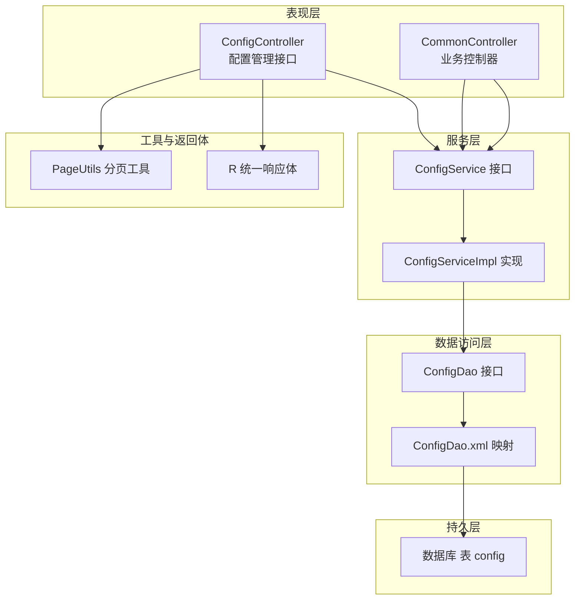
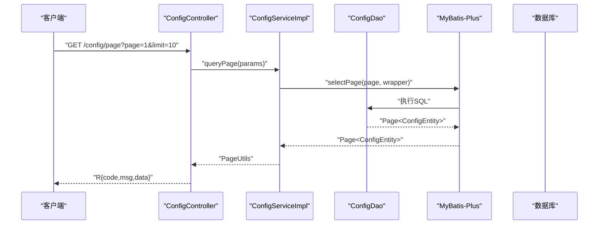
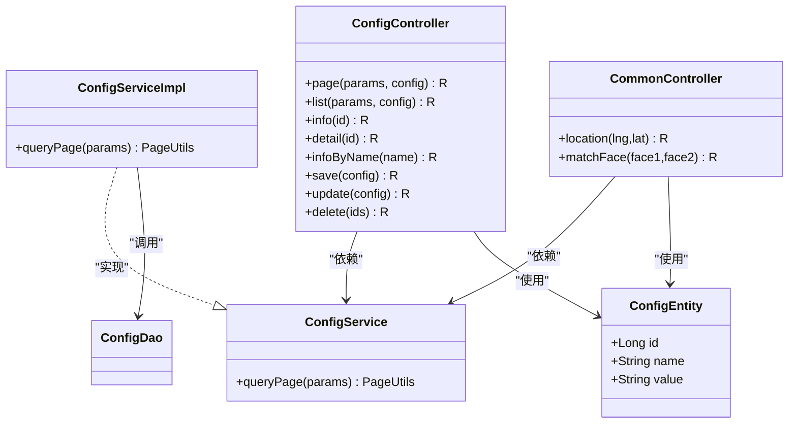

# 系统配置实体模型

<cite>
**本文引用的文件**
- [ConfigEntity.java](file://src/main/java/com/entity/ConfigEntity.java)
- [ConfigController.java](file://src/main/java/com/controller/ConfigController.java)
- [ConfigService.java](file://src/main/java/com/service/ConfigService.java)
- [ConfigServiceImpl.java](file://src/main/java/com/service/impl/ConfigServiceImpl.java)
- [ConfigDao.java](file://src/main/java/com/dao/ConfigDao.java)
- [ConfigDao.xml](file://src/main/resources/mapper/ConfigDao.xml)
- [CommonController.java](file://src/main/java/com/controller/CommonController.java)
- [PageUtils.java](file://src/main/java/com/utils/PageUtils.java)
- [R.java](file://src/main/java/com/utils/R.java)
- [pom.xml](file://pom.xml)
</cite>

## 目录
1. [引言](#引言)
2. [项目结构](#项目结构)
3. [核心组件](#核心组件)
4. [架构总览](#架构总览)
5. [详细组件分析](#详细组件分析)
6. [依赖分析](#依赖分析)
7. [性能考量](#性能考量)
8. [故障排查指南](#故障排查指南)
9. [结论](#结论)
10. [附录](#附录)

## 引言
本文件围绕系统配置实体模型展开，重点解析 ConfigEntity 的字段设计与系统参数管理能力，涵盖配置项的分类管理、动态配置与热更新机制、存储结构与默认值策略、配置验证规则、版本管理与变更审计、回滚机制、读取优化与缓存策略、性能监控方案，以及安全性、权限控制与数据保护措施。本文以代码为依据，结合实际业务场景，提供可操作的实践建议。

## 项目结构
该系统采用经典的分层架构：控制器层（Controller）、服务层（Service）、数据访问层（DAO）与实体模型（Entity），配合 MyBatis-Plus 进行 ORM 映射与分页查询。配置参数通过 ConfigEntity 统一建模，并在业务控制器中按需读取。

**图表来源**
- [ConfigController.java:27-111](file://src/main/java/com/controller/ConfigController.java#L27-L111)
- [ConfigService.java:14-16](file://src/main/java/com/service/ConfigService.java#L14-L16)
- [ConfigServiceImpl.java:24-33](file://src/main/java/com/service/impl/ConfigServiceImpl.java#L24-L33)
- [ConfigDao.java:10-12](file://src/main/java/com/dao/ConfigDao.java#L10-L12)
- [ConfigDao.xml:4-5](file://src/main/resources/mapper/ConfigDao.xml#L4-L5)
- [PageUtils.java:13-101](file://src/main/java/com/utils/PageUtils.java#L13-L101)
- [R.java:9-51](file://src/main/java/com/utils/R.java#L9-L51)

**章节来源**
- [ConfigController.java:27-111](file://src/main/java/com/controller/ConfigController.java#L27-L111)
- [ConfigService.java:14-16](file://src/main/java/com/service/ConfigService.java#L14-L16)
- [ConfigServiceImpl.java:24-33](file://src/main/java/com/service/impl/ConfigServiceImpl.java#L24-L33)
- [ConfigDao.java:10-12](file://src/main/java/com/dao/ConfigDao.java#L10-L12)
- [ConfigDao.xml:4-5](file://src/main/resources/mapper/ConfigDao.xml#L4-L5)
- [PageUtils.java:13-101](file://src/main/java/com/utils/PageUtils.java#L13-L101)
- [R.java:9-51](file://src/main/java/com/utils/R.java#L9-L51)

## 核心组件
- ConfigEntity：系统配置参数的实体模型，字段包括主键、配置名与配置值，用于统一存储与检索。
- ConfigController：提供配置的分页列表、详情查询、按名查询、新增、修改与批量删除等接口。
- ConfigService/ConfigServiceImpl：定义与实现配置的分页查询逻辑，基于 MyBatis-Plus 的分页器与条件构造器。
- ConfigDao/ConfigDao.xml：DAO 接口与 XML 映射，承载基础的 CRUD 能力。
- CommonController：在业务流程中按需读取配置参数，如百度地图 AK、人脸识别 APIKey/SecretKey 等。
- PageUtils/R：统一响应体与分页封装，保证接口输出格式一致。

**章节来源**
- [ConfigEntity.java:12-53](file://src/main/java/com/entity/ConfigEntity.java#L12-L53)
- [ConfigController.java:37-111](file://src/main/java/com/controller/ConfigController.java#L37-L111)
- [ConfigService.java:14-16](file://src/main/java/com/service/ConfigService.java#L14-L16)
- [ConfigServiceImpl.java:24-33](file://src/main/java/com/service/impl/ConfigServiceImpl.java#L24-L33)
- [ConfigDao.java:10-12](file://src/main/java/com/dao/ConfigDao.java#L10-L12)
- [ConfigDao.xml:4-5](file://src/main/resources/mapper/ConfigDao.xml#L4-L5)
- [CommonController.java:52-105](file://src/main/java/com/controller/CommonController.java#L52-L105)
- [PageUtils.java:13-101](file://src/main/java/com/utils/PageUtils.java#L13-L101)
- [R.java:9-51](file://src/main/java/com/utils/R.java#L9-L51)

## 架构总览
系统配置管理遵循“接口隔离 + 服务实现 + DAO 映射”的分层设计，控制器负责请求接入与参数校验，服务层负责业务编排与分页查询，DAO 层负责与数据库交互。配置参数在业务控制器中按需读取，形成“集中存储、按需读取”的模式。

**图表来源**
- [ConfigController.java:37-42](file://src/main/java/com/controller/ConfigController.java#L37-L42)
- [ConfigServiceImpl.java:25-32](file://src/main/java/com/service/impl/ConfigServiceImpl.java#L25-L32)
- [ConfigDao.java:10-12](file://src/main/java/com/dao/ConfigDao.java#L10-L12)
- [PageUtils.java:44-50](file://src/main/java/com/utils/PageUtils.java#L44-L50)
- [R.java:37-45](file://src/main/java/com/utils/R.java#L37-L45)

## 详细组件分析

### ConfigEntity 字段设计与系统参数建模
- 主键 id：自增主键，唯一标识一条配置记录。
- 名称 name：配置项键名，作为配置项的唯一标识，业务侧通过 name 精确读取。
- 值 value：配置项值，统一以字符串形式存储，便于兼容多种类型与复杂结构（如 JSON）。

字段设计简洁明确，满足“键值对”配置模型；通过 name 唯一定位配置项，value 支持灵活扩展，适合系统参数、第三方密钥、开关类配置等多种场景。

**章节来源**
- [ConfigEntity.java:16-27](file://src/main/java/com/entity/ConfigEntity.java#L16-L27)

### 配置项分类管理与动态配置
- 分类管理：当前实现未在实体或服务层引入分类字段，可通过约定命名空间（如前缀）进行逻辑分类（例如以模块名作为前缀），并在业务侧按命名空间聚合展示与管理。
- 动态配置：通过 ConfigController 提供的保存、修改接口，可在运行时动态更新配置项；业务侧通过 selectOne + eq("name", ...) 读取指定配置，实现动态生效。

注意：当前代码未强制要求 name 的唯一性约束，建议在数据库层面增加唯一索引，避免重复键导致的歧义。

**章节来源**
- [ConfigController.java:86-101](file://src/main/java/com/controller/ConfigController.java#L86-L101)
- [CommonController.java:54-62](file://src/main/java/com/controller/CommonController.java#L54-L62)

### 热更新机制
- 现状：系统未内置配置热更新监听与自动刷新机制。业务侧在首次读取配置后会缓存变量（如 BAIDU_DITU_AK、client），减少数据库访问，但不会感知数据库变更而主动刷新。
- 建议：引入配置中心或本地缓存 + 定时刷新策略，或在关键配置变更后触发主动失效与重新加载，确保热更新可控且可追踪。

**章节来源**
- [CommonController.java:54-84](file://src/main/java/com/controller/CommonController.java#L54-L84)

### 存储结构、默认值与配置验证
- 存储结构：实体映射到名为 config 的数据库表，采用 MyBatis-Plus 注解与 XML 映射，支持标准 CRUD 与分页查询。
- 默认值：代码未体现默认值注入逻辑，建议在读取前检查空值并提供兜底策略（如从环境变量或固定常量取默认值）。
- 验证规则：控制器中存在注释掉的实体校验调用，未启用；建议在保存/更新时启用参数校验，确保 name 与 value 合法性与完整性。

**章节来源**
- [ConfigEntity.java:12-13](file://src/main/java/com/entity/ConfigEntity.java#L12-L13)
- [ConfigDao.xml:4-5](file://src/main/resources/mapper/ConfigDao.xml#L4-L5)
- [ConfigController.java:87-100](file://src/main/java/com/controller/ConfigController.java#L87-L100)

### 版本管理、变更审计与回滚
- 变更审计：当前未实现审计日志表或变更记录字段，建议引入配置审计表或在现有表中增加操作人、时间戳、变更前后对比等字段。
- 回滚机制：未提供回滚能力。建议在审计基础上实现“快照 + 撤销”策略：每次变更生成快照，支持按时间点回滚至历史版本。

**章节来源**
- [ConfigController.java:86-111](file://src/main/java/com/controller/ConfigController.java#L86-L111)

### 读取优化、缓存策略与性能监控
- 读取优化：CommonController 中对百度 AK 与人脸识别客户端进行了按需初始化与缓存，减少重复 IO 与网络请求开销。
- 缓存策略：建议在应用层引入二级缓存（如 Caffeine/Redis），以 name 为键缓存配置值，设置 TTL 与失效策略；同时提供手动刷新接口。
- 性能监控：建议埋点统计配置读取 QPS、延迟与错误率，结合缓存命中率评估优化效果。

**章节来源**
- [CommonController.java:54-84](file://src/main/java/com/controller/CommonController.java#L54-L84)
- [PageUtils.java:44-50](file://src/main/java/com/utils/PageUtils.java#L44-L50)

### 安全性、权限控制与数据保护
- 权限控制：ConfigController 对部分接口标注了忽略认证注解，需谨慎评估是否允许匿名访问敏感配置；建议对高风险配置（如密钥类）仅开放给具备权限的角色。
- 数据保护：建议对密钥类配置进行加密存储与传输，读取时进行脱敏输出；对配置变更操作进行鉴权与审计。
- 依赖与安全：项目依赖中包含百度 AI SDK，涉及外部 API 调用，应限制调用频率与失败重试策略，避免对外部服务造成压力。

**章节来源**
- [ConfigController.java:47-53](file://src/main/java/com/controller/ConfigController.java#L47-L53)
- [CommonController.java:74-84](file://src/main/java/com/controller/CommonController.java#L74-L84)
- [pom.xml:110-115](file://pom.xml#L110-L115)

## 依赖分析
- 控制器依赖服务接口，服务实现依赖 DAO 接口，DAO 通过 XML 映射访问数据库。
- 工具类 PageUtils 与 R 提供统一分页与响应封装，提升接口一致性与可维护性。
- 业务控制器依赖配置服务进行参数读取，形成“配置中心”式的能力。

**图表来源**
- [ConfigEntity.java:12-53](file://src/main/java/com/entity/ConfigEntity.java#L12-L53)
- [ConfigController.java:27-111](file://src/main/java/com/controller/ConfigController.java#L27-L111)
- [ConfigService.java:14-16](file://src/main/java/com/service/ConfigService.java#L14-L16)
- [ConfigServiceImpl.java:24-33](file://src/main/java/com/service/impl/ConfigServiceImpl.java#L24-L33)
- [ConfigDao.java:10-12](file://src/main/java/com/dao/ConfigDao.java#L10-L12)
- [CommonController.java:52-105](file://src/main/java/com/controller/CommonController.java#L52-L105)

**章节来源**
- [ConfigController.java:27-111](file://src/main/java/com/controller/ConfigController.java#L27-L111)
- [ConfigService.java:14-16](file://src/main/java/com/service/ConfigService.java#L14-L16)
- [ConfigServiceImpl.java:24-33](file://src/main/java/com/service/impl/ConfigServiceImpl.java#L24-L33)
- [ConfigDao.java:10-12](file://src/main/java/com/dao/ConfigDao.java#L10-L12)
- [CommonController.java:52-105](file://src/main/java/com/controller/CommonController.java#L52-L105)

## 性能考量
- 数据库层面：为 name 字段建立唯一索引，避免重复键带来的查询歧义与锁竞争。
- 应用层面：对热点配置进行本地缓存，设置合理的过期时间与并发刷新策略；对分页查询使用合适的 limit，避免一次性拉取过多数据。
- 接口层面：统一响应体与分页封装，减少前端处理负担；对高频接口进行限流与熔断保护。

[本节为通用性能建议，不直接分析具体文件]

## 故障排查指南
- 无法获取配置：检查 name 是否正确、数据库是否存在对应记录；确认业务侧是否已做空值判断与兜底。
- 接口返回异常：检查控制器中注释掉的校验逻辑是否启用；确认分页参数是否合理。
- 百度接口报错：检查 AK/Token 配置是否正确，确认网络连通性与 SDK 版本兼容性。

**章节来源**
- [CommonController.java:54-62](file://src/main/java/com/controller/CommonController.java#L54-L62)
- [CommonController.java:74-84](file://src/main/java/com/controller/CommonController.java#L74-L84)
- [ConfigController.java:87-100](file://src/main/java/com/controller/ConfigController.java#L87-L100)

## 结论
本系统通过 ConfigEntity 将配置参数抽象为统一的键值对模型，配合 Controller-Service-DAO 分层实现了配置的增删改查与分页展示。当前实现侧重于基础能力，建议在以下方面进一步完善：引入配置分类与唯一性约束、实现热更新与缓存策略、完善配置验证与审计回滚、加强权限控制与数据保护，并结合性能监控持续优化。

[本节为总结性内容，不直接分析具体文件]

## 附录
- 接口清单（示例）
  - GET /config/page：分页查询配置列表
  - GET /config/list：列表查询（忽略认证）
  - GET /config/info/{id}：按 id 查询详情
  - GET /config/detail/{id}：详情查询（忽略认证）
  - GET /config/info：按 name 查询配置
  - POST /config/save：保存配置
  - POST /config/update：修改配置
  - POST /config/delete：批量删除配置
- 业务读取示例
  - 获取百度地图 AK：/location
  - 人脸识别参数：/matchFace

**章节来源**
- [ConfigController.java:37-111](file://src/main/java/com/controller/ConfigController.java#L37-L111)
- [CommonController.java:52-105](file://src/main/java/com/controller/CommonController.java#L52-L105)