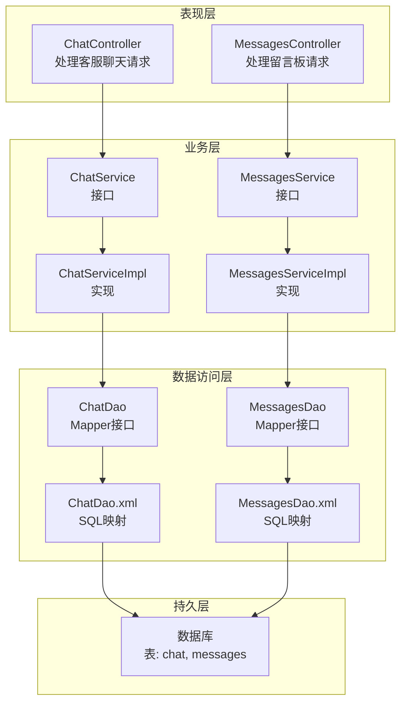
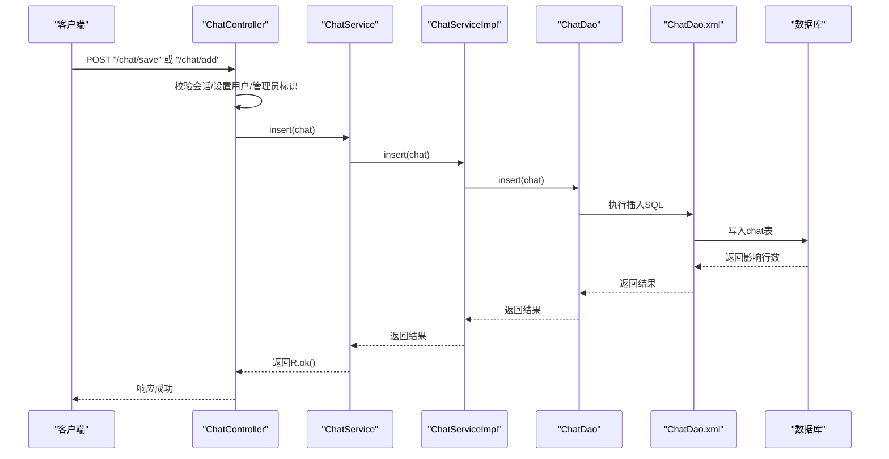
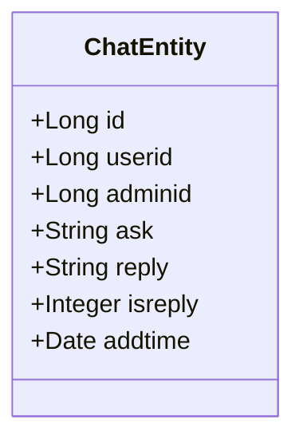
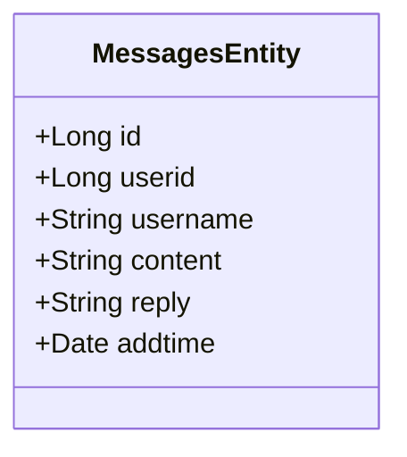
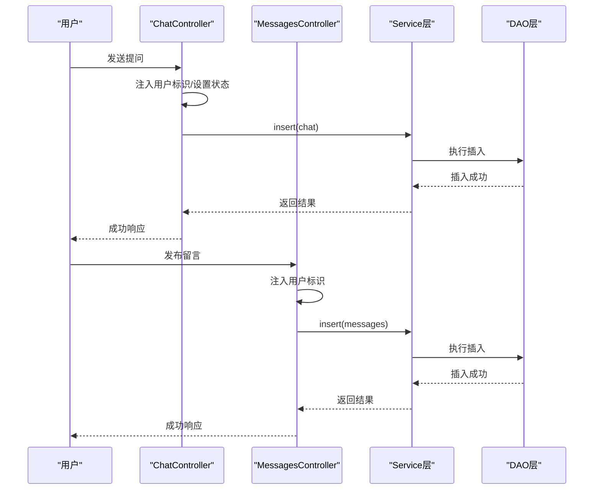
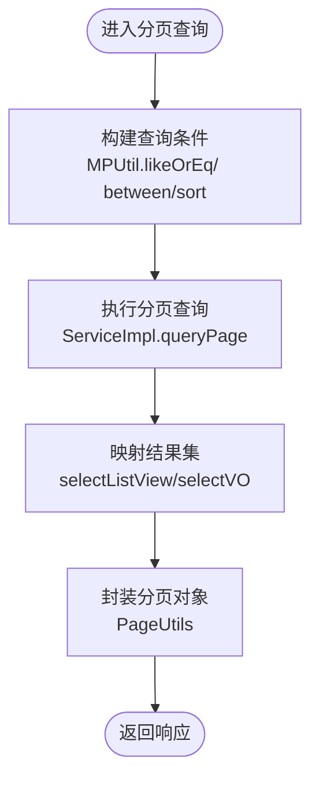
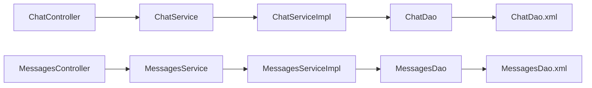

# 聊天消息实体模型

<cite>
**本文引用的文件**
- [ChatEntity.java](file://src/main/java/com/entity/ChatEntity.java)
- [MessagesEntity.java](file://src/main/java/com/entity/MessagesEntity.java)
- [ChatController.java](file://src/main/java/com/controller/ChatController.java)
- [MessagesController.java](file://src/main/java/com/controller/MessagesController.java)
- [ChatService.java](file://src/main/java/com/service/ChatService.java)
- [MessagesService.java](file://src/main/java/com/service/MessagesService.java)
- [ChatServiceImpl.java](file://src/main/java/com/service/impl/ChatServiceImpl.java)
- [MessagesServiceImpl.java](file://src/main/java/com/service/impl/MessagesServiceImpl.java)
- [ChatDao.java](file://src/main/java/com/dao/ChatDao.java)
- [MessagesDao.java](file://src/main/java/com/dao/MessagesDao.java)
- [ChatDao.xml](file://src/main/resources/mapper/ChatDao.xml)
- [MessagesDao.xml](file://src/main/resources/mapper/MessagesDao.xml)
- [PageUtils.java](file://src/main/java/com/utils/PageUtils.java)
- [MPUtil.java](file://src/main/java/com/utils/MPUtil.java)
- [CommonUtil.java](file://src/main/java/com/utils/CommonUtil.java)
</cite>

## 目录
1. [引言](#引言)
2. [项目结构](#项目结构)
3. [核心组件](#核心组件)
4. [架构概览](#架构概览)
5. [详细组件分析](#详细组件分析)
6. [依赖分析](#依赖分析)
7. [性能考虑](#性能考虑)
8. [故障排除指南](#故障排除指南)
9. [结论](#结论)

## 引言
本文件聚焦于自习室管理系统的聊天消息实体模型，深入解析 ChatEntity 与 MessagesEntity 的字段设计、消息通信流程与存储结构。系统通过控制器-服务-数据访问层的分层架构实现用户间客服对话与留言板消息的增删改查、分页检索与排序控制。本文还将讨论消息的实时性保障、离线消息处理与历史管理策略，并提供检索优化、分页加载与性能调优建议，最后分析数据一致性、消息去重与安全防护措施。

## 项目结构
聊天模块采用典型的后端分层架构：
- 控制器层：处理HTTP请求，封装响应，执行权限校验与参数预处理
- 服务层：定义业务接口与实现，负责分页查询、视图映射与复杂逻辑编排
- 数据访问层：基于MyBatis-Plus的Mapper接口，提供通用CRUD与分页查询能力
- 实体层：对应数据库表结构，承载字段与时间格式化注解
- 映射文件：定义SQL查询与结果映射，支持视图查询与列表展示

图表来源
- [ChatController.java:46-231](file://src/main/java/com/controller/ChatController.java#L46-L231)
- [MessagesController.java:46-213](file://src/main/java/com/controller/MessagesController.java#L46-L213)
- [ChatService.java:21-35](file://src/main/java/com/service/ChatService.java#L21-L35)
- [MessagesService.java:21-35](file://src/main/java/com/service/MessagesService.java#L21-L35)
- [ChatServiceImpl.java:22-62](file://src/main/java/com/service/impl/ChatServiceImpl.java#L22-L62)
- [MessagesServiceImpl.java:22-62](file://src/main/java/com/service/impl/MessagesServiceImpl.java#L22-L62)
- [ChatDao.java:21-33](file://src/main/java/com/dao/ChatDao.java#L21-L33)
- [MessagesDao.java:21-33](file://src/main/java/com/dao/MessagesDao.java#L21-L33)
- [ChatDao.xml:4-39](file://src/main/resources/mapper/ChatDao.xml#L4-L39)
- [MessagesDao.xml:4-38](file://src/main/resources/mapper/MessagesDao.xml#L4-L38)

章节来源
- [ChatController.java:46-231](file://src/main/java/com/controller/ChatController.java#L46-L231)
- [MessagesController.java:46-213](file://src/main/java/com/controller/MessagesController.java#L46-L213)
- [ChatServiceImpl.java:22-62](file://src/main/java/com/service/impl/ChatServiceImpl.java#L22-L62)
- [MessagesServiceImpl.java:22-62](file://src/main/java/com/service/impl/MessagesServiceImpl.java#L22-L62)

## 核心组件
本节从实体模型出发，梳理字段设计与业务含义，明确消息类型与存储结构。

- ChatEntity（客服聊天）
  - 关键字段：用户标识、管理员标识、提问内容、回复内容、是否回复标记、创建时间
  - 字段用途：支撑用户与管理员之间的问答式客服对话；通过“是否回复”标记实现未读提醒与状态流转
  - 时间字段：统一使用日期格式化注解，确保序列化输出与前端显示一致

- MessagesEntity（留言板）
  - 关键字段：留言人标识、用户名、留言内容、回复内容、创建时间
  - 字段用途：支持公开或匿名留言场景，便于社区互动与信息反馈

章节来源
- [ChatEntity.java:31-165](file://src/main/java/com/entity/ChatEntity.java#L31-L165)
- [MessagesEntity.java:31-147](file://src/main/java/com/entity/MessagesEntity.java#L31-L147)

## 架构概览
聊天系统遵循前后端分离的REST风格接口设计，控制器负责参数接收与会话校验，服务层负责分页与条件查询，DAO层通过XML映射执行SQL，最终落库到chat与messages两张表。

图表来源
- [ChatController.java:127-163](file://src/main/java/com/controller/ChatController.java#L127-L163)
- [ChatServiceImpl.java:22-62](file://src/main/java/com/service/impl/ChatServiceImpl.java#L22-L62)
- [ChatDao.java:21-33](file://src/main/java/com/dao/ChatDao.java#L21-L33)
- [ChatDao.xml:4-39](file://src/main/resources/mapper/ChatDao.xml#L4-L39)

## 详细组件分析

### ChatEntity 类分析
- 设计要点
  - 使用MyBatis-Plus注解标注主键与表名，支持自动填充与驼峰映射
  - 字段采用包装类型以区分空值与默认值，利于业务判断
  - 统一时间格式化注解，避免时区与时差问题
- 字段语义
  - 用户标识与管理员标识用于区分消息来源与处理方
  - 提问与回复内容承载消息正文
  - 是否回复标记用于状态跟踪与未读提醒
  - 创建时间用于排序与历史追溯

图表来源
- [ChatEntity.java:31-165](file://src/main/java/com/entity/ChatEntity.java#L31-L165)

章节来源
- [ChatEntity.java:31-165](file://src/main/java/com/entity/ChatEntity.java#L31-L165)

### MessagesEntity 类分析
- 设计要点
  - 结构与ChatEntity类似，但面向公开留言场景
  - 用户名字段便于匿名或非登录用户参与
- 字段语义
  - 留言人标识与用户名用于身份识别
  - 留言内容与回复内容构成消息正文
  - 创建时间用于排序与审计

图表来源
- [MessagesEntity.java:31-147](file://src/main/java/com/entity/MessagesEntity.java#L31-L147)

章节来源
- [MessagesEntity.java:31-147](file://src/main/java/com/entity/MessagesEntity.java#L31-L147)

### 控制器与消息处理机制
- 权限与会话控制
  - 管理员可查看所有记录；普通用户仅能查看/操作自身记录
  - 通过会话属性注入用户标识，避免越权访问
- 消息类型与传输协议
  - 客服聊天：提问与回复分别由用户与管理员发起，系统通过“是否回复”标记进行状态管理
  - 留言板：支持匿名留言，回复内容可选
- 实时性与离线处理
  - 系统未实现WebSocket或长轮询等实时推送机制；消息交互以请求-响应模式为主
  - 离线消息：未发现专门的离线队列或消息回放机制，建议在业务层引入消息幂等与重试策略
- 历史管理
  - 支持按时间范围、关键字模糊匹配与排序，满足历史检索需求

图表来源
- [ChatController.java:127-163](file://src/main/java/com/controller/ChatController.java#L127-L163)
- [MessagesController.java:127-145](file://src/main/java/com/controller/MessagesController.java#L127-L145)
- [ChatService.java:21-35](file://src/main/java/com/service/ChatService.java#L21-L35)
- [MessagesService.java:21-35](file://src/main/java/com/service/MessagesService.java#L21-L35)

章节来源
- [ChatController.java:57-183](file://src/main/java/com/controller/ChatController.java#L57-L183)
- [MessagesController.java:57-165](file://src/main/java/com/controller/MessagesController.java#L57-L165)

### 分页加载与检索优化
- 分页工具
  - PageUtils封装总记录数、页大小、总页数、当前页与列表数据，统一返回格式
- 查询条件与排序
  - MPUtil提供驼峰转下划线、模糊匹配、区间过滤与排序组装，简化控制器逻辑
- SQL映射
  - ChatDao.xml与MessagesDao.xml提供基础查询模板，支持where条件拼接与视图查询

图表来源
- [MPUtil.java:60-134](file://src/main/java/com/utils/MPUtil.java#L60-L134)
- [ChatServiceImpl.java:34-40](file://src/main/java/com/service/impl/ChatServiceImpl.java#L34-L40)
- [MessagesServiceImpl.java:34-40](file://src/main/java/com/service/impl/MessagesServiceImpl.java#L34-L40)
- [PageUtils.java:13-102](file://src/main/java/com/utils/PageUtils.java#L13-L102)

章节来源
- [PageUtils.java:13-102](file://src/main/java/com/utils/PageUtils.java#L13-L102)
- [MPUtil.java:60-134](file://src/main/java/com/utils/MPUtil.java#L60-L134)

### 数据一致性、去重与安全防护
- 一致性
  - 通过事务与单表写入保障基本一致性；跨表关联需在业务层补充校验
- 去重
  - 未见显式去重策略；建议在插入前增加幂等键（如消息指纹）与唯一约束
- 安全
  - 控制器中存在会话校验与角色判断，防止越权访问
  - 参数校验注解存在但被注释，默认不强制校验，建议启用或在业务层补充校验
  - 未发现敏感信息脱敏与XSS防护，建议在输入输出层增加过滤与转义

章节来源
- [ChatController.java:60-62](file://src/main/java/com/controller/ChatController.java#L60-L62)
- [MessagesController.java:60-62](file://src/main/java/com/controller/MessagesController.java#L60-L62)

## 依赖分析
- 控制器依赖服务接口，服务实现依赖DAO接口
- DAO通过XML映射执行SQL，最终访问数据库
- 工具类MPUtil与PageUtils贯穿查询与分页流程

图表来源
- [ChatController.java:46-231](file://src/main/java/com/controller/ChatController.java#L46-L231)
- [MessagesController.java:46-213](file://src/main/java/com/controller/MessagesController.java#L46-L213)
- [ChatServiceImpl.java:22-62](file://src/main/java/com/service/impl/ChatServiceImpl.java#L22-L62)
- [MessagesServiceImpl.java:22-62](file://src/main/java/com/service/impl/MessagesServiceImpl.java#L22-L62)
- [ChatDao.java:21-33](file://src/main/java/com/dao/ChatDao.java#L21-L33)
- [MessagesDao.java:21-33](file://src/main/java/com/dao/MessagesDao.java#L21-L33)

章节来源
- [ChatService.java:21-35](file://src/main/java/com/service/ChatService.java#L21-L35)
- [MessagesService.java:21-35](file://src/main/java/com/service/MessagesService.java#L21-L35)

## 性能考虑
- 查询性能
  - 建议为常用查询字段（如用户标识、创建时间）建立索引，提升分页与筛选效率
  - 对模糊查询使用前缀匹配或全文索引，减少全表扫描
- 分页优化
  - 大数据量场景下优先使用“基于游标的分页”或“延迟关联”，降低offset带来的性能损耗
  - 控制每页最大条数，避免一次性返回过多数据
- 缓存策略
  - 对热点消息（如最新N条）引入缓存，结合失效策略与版本号实现一致性
- 并发与锁
  - 写入密集场景建议使用批量提交与异步写入，配合消息队列削峰填谷

## 故障排除指南
- 常见问题
  - 会话丢失导致越权：检查会话注入逻辑与权限判断分支
  - 分页异常：确认Page对象构造与排序字段合法性
  - 时间格式异常：核对日期格式化注解与数据库字段类型
- 排查步骤
  - 在控制器入口打印关键参数与会话信息
  - 在服务层捕获异常并记录SQL片段与参数
  - 使用数据库慢查询日志定位瓶颈

章节来源
- [ChatController.java:57-80](file://src/main/java/com/controller/ChatController.java#L57-L80)
- [MessagesController.java:57-80](file://src/main/java/com/controller/MessagesController.java#L57-L80)

## 结论
本聊天消息实体模型以简洁的字段设计支撑客服对话与留言板两大场景。通过控制器-服务-DAO的清晰分层与MyBatis-Plus的便捷查询能力，系统实现了基础的消息存储、检索与分页功能。为进一步提升系统稳定性与用户体验，建议引入实时推送、离线消息队列、消息去重与安全加固等机制，并结合索引与缓存策略优化查询性能。