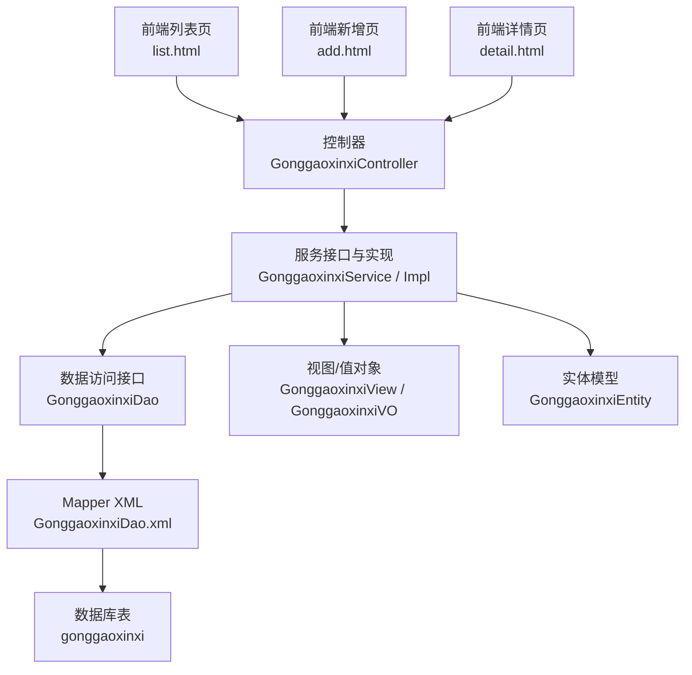
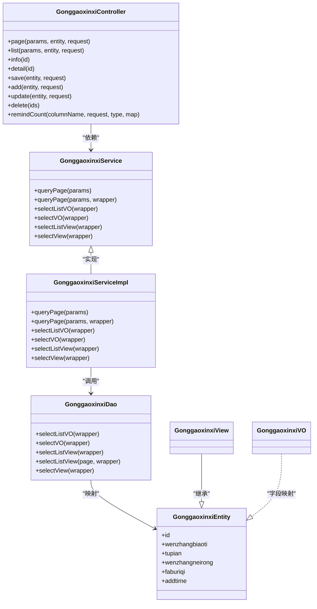
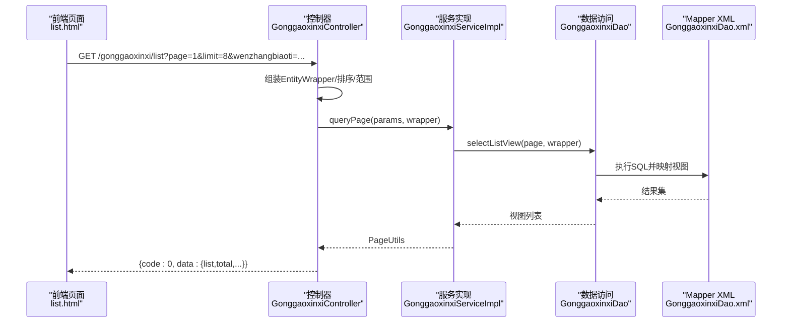
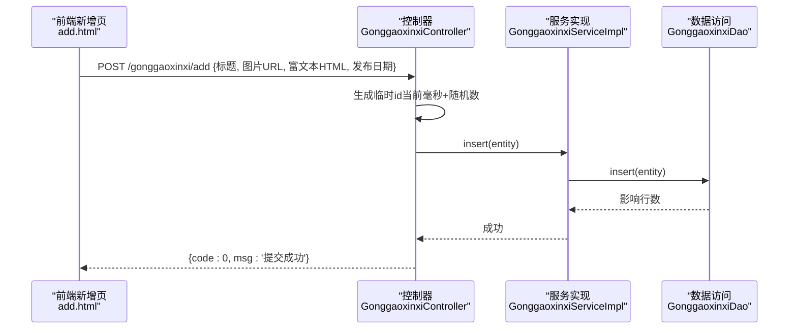
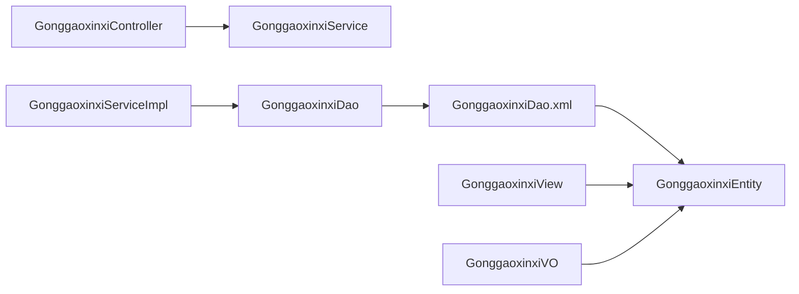

# 公告管理模块

<cite>
**本文引用的文件**
- [GonggaoxinxiEntity.java](file://src/main/java/com/entity/GonggaoxinxiEntity.java)
- [GonggaoxinxiController.java](file://src/main/java/com/controller/GonggaoxinxiController.java)
- [GonggaoxinxiService.java](file://src/main/java/com/service/GonggaoxinxiService.java)
- [GonggaoxinxiServiceImpl.java](file://src/main/java/com/service/impl/GonggaoxinxiServiceImpl.java)
- [GonggaoxinxiDao.java](file://src/main/java/com/dao/GonggaoxinxiDao.java)
- [GonggaoxinxiDao.xml](file://src/main/resources/mapper/GonggaoxinxiDao.xml)
- [GonggaoxinxiView.java](file://src/main/java/com/entity/view/GonggaoxinxiView.java)
- [GonggaoxinxiVO.java](file://src/main/java/com/entity/vo/GonggaoxinxiVO.java)
- [list.html](file://src/main/resources/front/front/pages/gonggaoxinxi/list.html)
- [add.html](file://src/main/resources/front/front/pages/gonggaoxinxi/add.html)
- [detail.html](file://src/main/resources/front/front/pages/gonggaoxinxi/detail.html)
- [MPUtil.java](file://src/main/java/com/utils/MPUtil.java)
- [CommonUtil.java](file://src/main/java/com/utils/CommonUtil.java)
</cite>

## 目录
1. [简介](#简介)
2. [项目结构](#项目结构)
3. [核心组件](#核心组件)
4. [架构总览](#架构总览)
5. [详细组件分析](#详细组件分析)
6. [依赖关系分析](#依赖关系分析)
7. [性能考虑](#性能考虑)
8. [故障排查指南](#故障排查指南)
9. [结论](#结论)
10. [附录](#附录)

## 简介
本文件系统化梳理“公告管理模块”的实现，覆盖公告信息的全生命周期管理（创建、编辑、发布、删除）、富文本与多媒体支持、前后端接口规范、权限与可见性控制、以及可扩展的统计与推送机制建议。基于现有代码，重点分析后端控制器、服务层、数据访问层、实体与视图模型，以及前端页面的交互与富文本编辑能力。

## 项目结构
公告管理模块采用经典的分层架构：
- 控制器层：处理HTTP请求，封装响应，调用业务服务
- 服务层：封装业务逻辑，处理分页、排序、条件查询
- 数据访问层：MyBatis-Plus映射数据库表，提供基础CRUD与复杂查询
- 实体与视图：实体映射数据库字段，视图用于返回聚合或扩展字段
- 前端页面：列表、详情、新增页面，集成富文本编辑器与图片上传

图表来源
- [GonggaoxinxiController.java:1-208](file://src/main/java/com/controller/GonggaoxinxiController.java#L1-L208)
- [GonggaoxinxiService.java:1-37](file://src/main/java/com/service/GonggaoxinxiService.java#L1-L37)
- [GonggaoxinxiServiceImpl.java:1-63](file://src/main/java/com/service/impl/GonggaoxinxiServiceImpl.java#L1-L63)
- [GonggaoxinxiDao.java:1-34](file://src/main/java/com/dao/GonggaoxinxiDao.java#L1-L34)
- [GonggaoxinxiDao.xml:1-38](file://src/main/resources/mapper/GonggaoxinxiDao.xml#L1-L38)
- [GonggaoxinxiEntity.java:1-149](file://src/main/java/com/entity/GonggaoxinxiEntity.java#L1-L149)
- [GonggaoxinxiView.java:1-37](file://src/main/java/com/entity/view/GonggaoxinxiView.java#L1-L37)
- [GonggaoxinxiVO.java:1-94](file://src/main/java/com/entity/vo/GonggaoxinxiVO.java#L1-L94)

章节来源
- [GonggaoxinxiController.java:1-208](file://src/main/java/com/controller/GonggaoxinxiController.java#L1-L208)
- [GonggaoxinxiService.java:1-37](file://src/main/java/com/service/GonggaoxinxiService.java#L1-L37)
- [GonggaoxinxiServiceImpl.java:1-63](file://src/main/java/com/service/impl/GonggaoxinxiServiceImpl.java#L1-L63)
- [GonggaoxinxiDao.java:1-34](file://src/main/java/com/dao/GonggaoxinxiDao.java#L1-L34)
- [GonggaoxinxiDao.xml:1-38](file://src/main/resources/mapper/GonggaoxinxiDao.xml#L1-L38)
- [GonggaoxinxiEntity.java:1-149](file://src/main/java/com/entity/GonggaoxinxiEntity.java#L1-L149)
- [GonggaoxinxiView.java:1-37](file://src/main/java/com/entity/view/GonggaoxinxiView.java#L1-L37)
- [GonggaoxinxiVO.java:1-94](file://src/main/java/com/entity/vo/GonggaoxinxiVO.java#L1-L94)

## 核心组件
- 实体模型：承载公告标题、图片、内容、发布日期等字段，提供标准getter/setter
- 视图模型：用于后端返回聚合或扩展字段，便于接口统一
- 值对象：移动端接口返回精简字段，减少冗余
- 数据访问层：提供基础CRUD与分页查询、条件查询、视图查询
- 服务层：封装分页、排序、条件组合、视图/列表查询
- 控制器层：暴露REST接口，处理列表、详情、新增、修改、删除、提醒等

章节来源
- [GonggaoxinxiEntity.java:49-146](file://src/main/java/com/entity/GonggaoxinxiEntity.java#L49-L146)
- [GonggaoxinxiView.java:21-36](file://src/main/java/com/entity/view/GonggaoxinxiView.java#L21-L36)
- [GonggaoxinxiVO.java:21-94](file://src/main/java/com/entity/vo/GonggaoxinxiVO.java#L21-L94)
- [GonggaoxinxiDao.java:21-31](file://src/main/java/com/dao/GonggaoxinxiDao.java#L21-L31)
- [GonggaoxinxiService.java:21-35](file://src/main/java/com/service/GonggaoxinxiService.java#L21-L35)
- [GonggaoxinxiController.java:54-207](file://src/main/java/com/controller/GonggaoxinxiController.java#L54-L207)

## 架构总览
后端采用Spring MVC + MyBatis-Plus，控制器负责参数接收与响应封装，服务层负责业务编排与分页排序，DAO层通过XML映射SQL，实体/视图/VO分别承担不同场景下的数据传输职责。

图表来源
- [GonggaoxinxiController.java:48-207](file://src/main/java/com/controller/GonggaoxinxiController.java#L48-L207)
- [GonggaoxinxiService.java:21-35](file://src/main/java/com/service/GonggaoxinxiService.java#L21-L35)
- [GonggaoxinxiServiceImpl.java:22-62](file://src/main/java/com/service/impl/GonggaoxinxiServiceImpl.java#L22-L62)
- [GonggaoxinxiDao.java:21-31](file://src/main/java/com/dao/GonggaoxinxiDao.java#L21-L31)
- [GonggaoxinxiEntity.java:32-146](file://src/main/java/com/entity/GonggaoxinxiEntity.java#L32-L146)
- [GonggaoxinxiView.java:21-36](file://src/main/java/com/entity/view/GonggaoxinxiView.java#L21-L36)
- [GonggaoxinxiVO.java:21-94](file://src/main/java/com/entity/vo/GonggaoxinxiVO.java#L21-L94)

## 详细组件分析

### 数据模型设计
- 主键：id（Long）
- 标题：wenzhangbiaoti（String）
- 图片：tupian（String；支持多图逗号分隔）
- 内容：wenzhangneirong（String；富文本）
- 发布日期：faburiqi（Date；yyyy-MM-dd）
- 创建时间：addtime（Date；yyyy-MM-dd HH:mm:ss）

字段约束与格式在实体中通过注解与格式化声明，确保前后端一致的时间格式与日期解析。

章节来源
- [GonggaoxinxiEntity.java:52-146](file://src/main/java/com/entity/GonggaoxinxiEntity.java#L52-L146)

### API接口文档
- 列表查询（后端分页）
  - 方法：GET
  - 路径：/gonggaoxinxi/page
  - 参数：分页参数、公告实体条件（模糊/精确匹配由工具类处理）
  - 返回：分页结果（含list、total等）
- 列表查询（前端）
  - 方法：GET
  - 路径：/gonggaoxinxi/list
  - 参数：分页参数、公告实体条件
  - 返回：分页结果
- 列表查询（简化）
  - 方法：GET
  - 路径：/gonggaoxinxi/lists
  - 参数：公告实体条件（全等）
  - 返回：列表视图
- 条件查询
  - 方法：GET
  - 路径：/gonggaoxinxi/query
  - 参数：公告实体条件
  - 返回：视图对象
- 详情（后端）
  - 方法：GET
  - 路径：/gonggaoxinxi/info/{id}
  - 返回：实体
- 详情（前端）
  - 方法：GET
  - 路径：/gonggaoxinxi/detail/{id}
  - 返回：实体
- 新增（后端）
  - 方法：POST
  - 路径：/gonggaoxinxi/save
  - 参数：公告实体
  - 返回：成功
- 新增（前端）
  - 方法：POST
  - 路径：/gonggaoxinxi/add
  - 参数：公告实体
  - 返回：成功
- 修改
  - 方法：POST
  - 路径：/gonggaoxinxi/update
  - 参数：公告实体
  - 返回：成功
- 删除
  - 方法：DELETE
  - 路径：/gonggaoxinxi/delete
  - 参数：id数组
  - 返回：成功
- 提醒计数
  - 方法：GET
  - 路径：/gonggaoxinxi/remind/{columnName}/{type}
  - 参数：开始/结束时间范围、类型（含按天区间计算）
  - 返回：满足条件的数量

章节来源
- [GonggaoxinxiController.java:57-203](file://src/main/java/com/controller/GonggaoxinxiController.java#L57-L203)

### 处理流程与时序

#### 列表查询时序

图表来源
- [GonggaoxinxiController.java:69-75](file://src/main/java/com/controller/GonggaoxinxiController.java#L69-L75)
- [GonggaoxinxiServiceImpl.java:35-40](file://src/main/java/com/service/impl/GonggaoxinxiServiceImpl.java#L35-L40)
- [GonggaoxinxiDao.xml:26-31](file://src/main/resources/mapper/GonggaoxinxiDao.xml#L26-L31)

#### 新增公告时序（富文本与图片）

图表来源
- [add.html:316-418](file://src/main/resources/front/front/pages/gonggaoxinxi/add.html#L316-L418)
- [GonggaoxinxiController.java:134-140](file://src/main/java/com/controller/GonggaoxinxiController.java#L134-L140)
- [GonggaoxinxiServiceImpl.java:22-62](file://src/main/java/com/service/impl/GonggaoxinxiServiceImpl.java#L22-L62)

### 前端页面与富文本/多媒体支持
- 列表页：支持按标题模糊搜索、分页展示、点击进入详情
- 新增页：集成富文本编辑器（TinyMCE），支持图片上传与富文本内容提交
- 详情页：展示标题、图片轮播、富文本内容

章节来源
- [list.html:374-417](file://src/main/resources/front/front/pages/gonggaoxinxi/list.html#L374-L417)
- [add.html:316-345](file://src/main/resources/front/front/pages/gonggaoxinxi/add.html#L316-L345)
- [add.html:269-315](file://src/main/resources/front/front/pages/gonggaoxinxi/add.html#L269-L315)
- [detail.html:329-368](file://src/main/resources/front/front/pages/gonggaoxinxi/detail.html#L329-L368)

### 权限控制与可见性
- 控制器层使用注解标注忽略认证的接口（如前端列表/详情），表明这些接口默认开放给访客
- 后端列表/保存/更新/删除接口未显式标注忽略认证，实际权限取决于拦截器配置
- 建议：通过拦截器/切面统一鉴权，区分管理员与普通用户权限；对敏感操作增加登录态校验

章节来源
- [GonggaoxinxiController.java:25](file://src/main/java/com/controller/GonggaoxinxiController.java#L25)
- [GonggaoxinxiController.java:69](file://src/main/java/com/controller/GonggaoxinxiController.java#L69)
- [GonggaoxinxiController.java:123](file://src/main/java/com/controller/GonggaoxinxiController.java#L123)

### 分类与优先级机制
- 当前实体未包含分类字段与优先级字段
- 建议扩展：新增分类字段与优先级字段，结合排序策略实现“置顶/加粗/高亮”等展示规则
- 排序：可通过工具类传入排序字段与方向，实现标题/时间等维度排序

章节来源
- [GonggaoxinxiEntity.java:52-146](file://src/main/java/com/entity/GonggaoxinxiEntity.java#L52-L146)
- [MPUtil.java:121-134](file://src/main/java/com/utils/MPUtil.java#L121-L134)

### 有效期与发布状态
- 当前实体未包含有效期字段与发布状态字段
- 建议：新增开始/结束时间字段与状态字段，配合查询条件实现“有效期内显示”、“定时发布/下线”等策略

章节来源
- [GonggaoxinxiEntity.java:52-146](file://src/main/java/com/entity/GonggaoxinxiEntity.java#L52-L146)

### 统计分析与推送通知
- 浏览量统计：可在详情接口增加浏览量字段与原子递增逻辑
- 用户反馈：可在详情页集成评论/评分组件，后端提供评论增删改查接口
- 推送通知：建议引入消息队列与定时任务，实现“定时发布”“到期下线”“新公告推送”等

章节来源
- [detail.html:329-368](file://src/main/resources/front/front/pages/gonggaoxinxi/detail.html#L329-L368)

## 依赖关系分析
- 控制器依赖服务接口，服务实现依赖DAO接口
- DAO通过XML映射数据库表，返回实体/视图/值对象
- 前端页面通过HTTP请求与控制器交互，富文本编辑器与图片上传通过统一文件上传接口

图表来源
- [GonggaoxinxiController.java:48-207](file://src/main/java/com/controller/GonggaoxinxiController.java#L48-L207)
- [GonggaoxinxiService.java:21-35](file://src/main/java/com/service/GonggaoxinxiService.java#L21-L35)
- [GonggaoxinxiServiceImpl.java:22-62](file://src/main/java/com/service/impl/GonggaoxinxiServiceImpl.java#L22-L62)
- [GonggaoxinxiDao.java:21-31](file://src/main/java/com/dao/GonggaoxinxiDao.java#L21-L31)
- [GonggaoxinxiDao.xml:14-36](file://src/main/resources/mapper/GonggaoxinxiDao.xml#L14-L36)
- [GonggaoxinxiEntity.java:32-146](file://src/main/java/com/entity/GonggaoxinxiEntity.java#L32-L146)
- [GonggaoxinxiView.java:21-36](file://src/main/java/com/entity/view/GonggaoxinxiView.java#L21-L36)
- [GonggaoxinxiVO.java:21-94](file://src/main/java/com/entity/vo/GonggaoxinxiVO.java#L21-L94)

章节来源
- [GonggaoxinxiController.java:48-207](file://src/main/java/com/controller/GonggaoxinxiController.java#L48-L207)
- [GonggaoxinxiServiceImpl.java:22-62](file://src/main/java/com/service/impl/GonggaoxinxiServiceImpl.java#L22-L62)
- [GonggaoxinxiDao.xml:14-36](file://src/main/resources/mapper/GonggaoxinxiDao.xml#L14-L36)

## 性能考虑
- 分页查询：使用Page分页与排序，避免一次性加载大量数据
- 条件查询：通过工具类生成EntityWrapper，合理使用like/eq/between，避免全表扫描
- 视图查询：列表页使用视图映射，减少多余字段传输
- 富文本存储：建议对大文本进行压缩或CDN托管，提升渲染性能

## 故障排查指南
- 列表无数据：检查分页参数、条件过滤、排序字段是否正确传入
- 富文本为空：确认TinyMCE内容已同步到隐藏域或通过getContent获取
- 图片上传失败：检查上传接口返回码、Token头、文件类型限制
- 时间格式错误：前后端时间格式需保持一致（yyyy-MM-dd或yyyy-MM-dd HH:mm:ss）

章节来源
- [GonggaoxinxiController.java:69-75](file://src/main/java/com/controller/GonggaoxinxiController.java#L69-L75)
- [add.html:316-345](file://src/main/resources/front/front/pages/gonggaoxinxi/add.html#L316-L345)
- [GonggaoxinxiEntity.java:76-83](file://src/main/java/com/entity/GonggaoxinxiEntity.java#L76-L83)

## 结论
公告管理模块以清晰的分层架构实现了公告的全生命周期管理，具备良好的扩展性。当前版本侧重基础CRUD与富文本/图片支持，后续可在实体模型中补充分类、优先级、有效期、状态等字段，并结合权限拦截与消息推送机制，进一步完善业务闭环。

## 附录

### 字段定义与约束
- 标题：非空，支持模糊搜索
- 图片：字符串，支持多图逗号分隔
- 内容：富文本HTML
- 发布日期：日期格式，yyyy-MM-dd
- 创建时间：自动记录

章节来源
- [GonggaoxinxiEntity.java:52-146](file://src/main/java/com/entity/GonggaoxinxiEntity.java#L52-L146)

### 关键工具类
- MPUtil：封装MyBatis-Plus条件构造、排序、范围查询、驼峰转下划线等
- CommonUtil：生成随机字符串（可用于临时id等场景）

章节来源
- [MPUtil.java:17-184](file://src/main/java/com/utils/MPUtil.java#L17-L184)
- [CommonUtil.java:5-22](file://src/main/java/com/utils/CommonUtil.java#L5-L22)