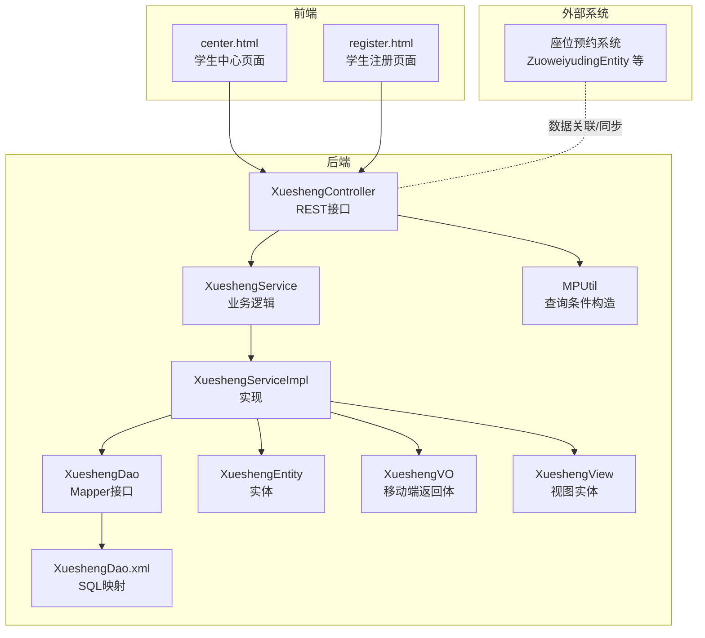
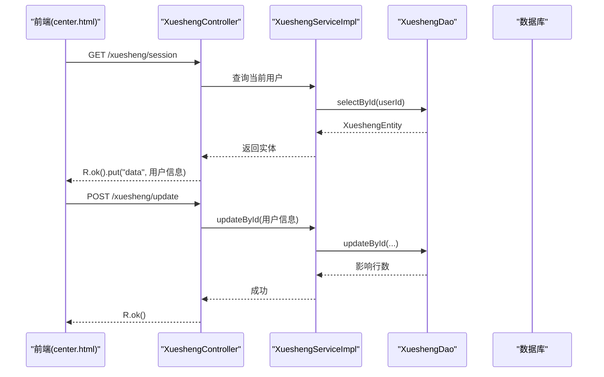
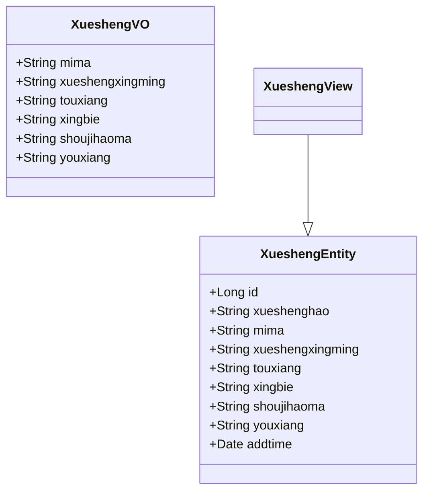
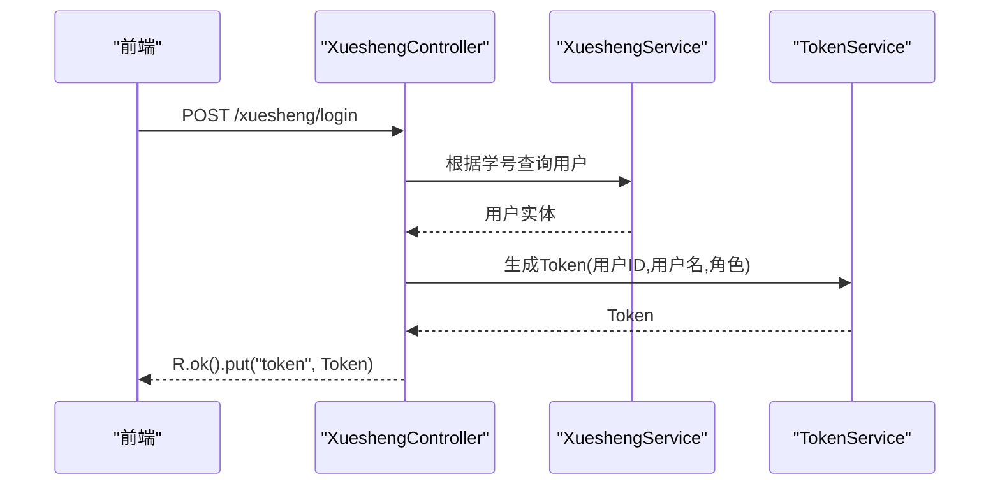
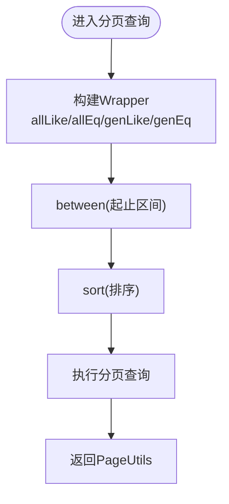
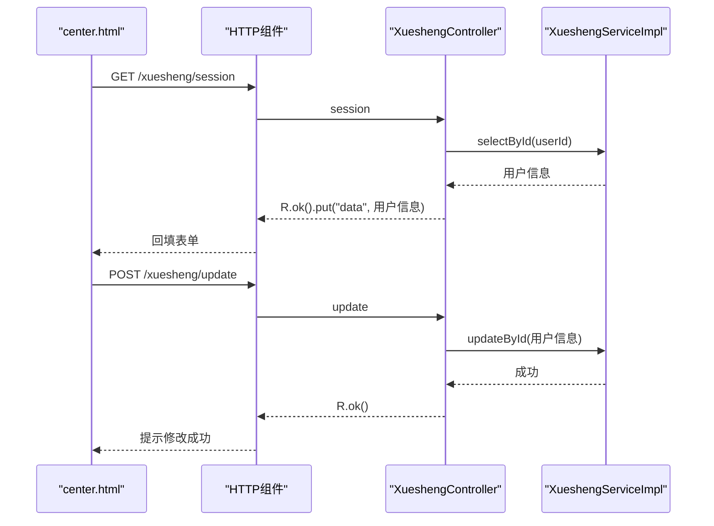
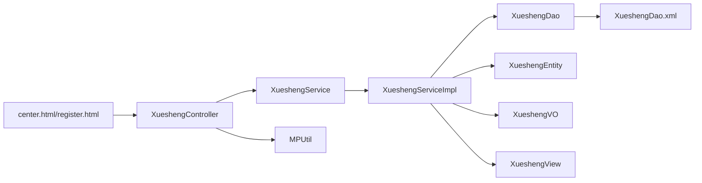

# 学生管理模块

<cite>
**本文引用的文件**
- [XueshengEntity.java](file://src/main/java/com/entity/XueshengEntity.java)
- [XueshengController.java](file://src/main/java/com/controller/XueshengController.java)
- [XueshengService.java](file://src/main/java/com/service/XueshengService.java)
- [XueshengServiceImpl.java](file://src/main/java/com/service/impl/XueshengServiceImpl.java)
- [XueshengDao.java](file://src/main/java/com/dao/XueshengDao.java)
- [XueshengDao.xml](file://src/main/resources/mapper/XueshengDao.xml)
- [XueshengView.java](file://src/main/java/com/entity/view/XueshengView.java)
- [XueshengVO.java](file://src/main/java/com/entity/vo/XueshengVO.java)
- [XueshengModel.java](file://src/main/java/com/entity/model/XueshengModel.java)
- [MPUtil.java](file://src/main/java/com/utils/MPUtil.java)
- [center.html](file://src/main/resources/front/front/pages/xuesheng/center.html)
- [register.html](file://src/main/resources/front/front/pages/xuesheng/register.html)
- [ZuoweiyudingEntity.java](file://src/main/java/com/entity/ZuoweiyudingEntity.java)
- [ZuoweiyudingService.java](file://src/main/java/com/service/ZuoweiyudingService.java)
</cite>

## 目录
1. [引言](#引言)
2. [项目结构](#项目结构)
3. [核心组件](#核心组件)
4. [架构总览](#架构总览)
5. [详细组件分析](#详细组件分析)
6. [依赖分析](#依赖分析)
7. [性能考虑](#性能考虑)
8. [故障排查指南](#故障排查指南)
9. [结论](#结论)
10. [附录](#附录)

## 引言
本文件面向“学生管理模块”的综合技术文档，围绕学生信息管理与相关功能展开，覆盖以下主题：
- 学生注册、登录、信息维护、密码重置等核心业务流程
- 学生与用户系统的关联机制（身份绑定与权限继承）
- 学生信息的数据模型设计（基本信息、联系方式、头像等）
- 学生管理的API接口清单与调用方式
- 学生中心页面的功能实现（个人资料、头像上传、退出登录）
- 学生信息的验证规则与数据完整性保障机制
- 学生统计分析能力（如年级分布、活跃度统计等建议性说明）
- 学生与座位预约系统的集成关系与数据同步机制

## 项目结构
学生管理模块在后端采用标准的分层架构：控制层负责HTTP接口与会话处理；服务层封装业务逻辑；持久层通过MyBatis-Plus进行数据库交互；前端提供学生中心与注册页面。

图表来源
- [XueshengController.java:46-284](file://src/main/java/com/controller/XueshengController.java#L46-L284)
- [XueshengService.java:21-35](file://src/main/java/com/service/XueshengService.java#L21-L35)
- [XueshengServiceImpl.java:22-62](file://src/main/java/com/service/impl/XueshengServiceImpl.java#L22-L62)
- [XueshengDao.java:21-33](file://src/main/java/com/dao/XueshengDao.java#L21-L33)
- [XueshengDao.xml:4-41](file://src/main/resources/mapper/XueshengDao.xml#L4-L41)
- [XueshengEntity.java:32-201](file://src/main/java/com/entity/XueshengEntity.java#L32-L201)
- [XueshengVO.java:21-158](file://src/main/java/com/entity/vo/XueshengVO.java#L21-L158)
- [XueshengView.java:21-36](file://src/main/java/com/entity/view/XueshengView.java#L21-L36)
- [MPUtil.java:17-185](file://src/main/java/com/utils/MPUtil.java#L17-L185)
- [center.html:301-536](file://src/main/resources/front/front/pages/xuesheng/center.html#L301-L536)
- [register.html:110-162](file://src/main/resources/front/front/pages/xuesheng/register.html#L110-L162)
- [ZuoweiyudingEntity.java:22-212](file://src/main/java/com/entity/ZuoweiyudingEntity.java#L22-L212)

章节来源
- [XueshengController.java:46-284](file://src/main/java/com/controller/XueshengController.java#L46-L284)
- [XueshengService.java:21-35](file://src/main/java/com/service/XueshengService.java#L21-L35)
- [XueshengServiceImpl.java:22-62](file://src/main/java/com/service/impl/XueshengServiceImpl.java#L22-L62)
- [XueshengDao.java:21-33](file://src/main/java/com/dao/XueshengDao.java#L21-L33)
- [XueshengDao.xml:4-41](file://src/main/resources/mapper/XueshengDao.xml#L4-L41)
- [XueshengEntity.java:32-201](file://src/main/java/com/entity/XueshengEntity.java#L32-L201)
- [XueshengVO.java:21-158](file://src/main/java/com/entity/vo/XueshengVO.java#L21-L158)
- [XueshengView.java:21-36](file://src/main/java/com/entity/view/XueshengView.java#L21-L36)
- [MPUtil.java:17-185](file://src/main/java/com/utils/MPUtil.java#L17-L185)
- [center.html:301-536](file://src/main/resources/front/front/pages/xuesheng/center.html#L301-L536)
- [register.html:110-162](file://src/main/resources/front/front/pages/xuesheng/register.html#L110-L162)
- [ZuoweiyudingEntity.java:22-212](file://src/main/java/com/entity/ZuoweiyudingEntity.java#L22-L212)

## 核心组件
- 控制器：XueshengController 提供登录、注册、退出、信息查询、分页列表、保存/更新、删除、提醒计数等接口。
- 服务层：XueshengService 定义分页查询、列表视图、视图查询等契约；XueshengServiceImpl 实现分页与视图查询。
- 持久层：XueshengDao 定义Mapper方法；XueshengDao.xml 提供SQL映射。
- 实体与视图：XueshengEntity 为核心实体；XueshengVO 用于移动端返回；XueshengView 作为视图辅助类。
- 工具类：MPUtil 提供驼峰到下划线字段映射、like/eq/between/sort 等查询条件构造。

章节来源
- [XueshengController.java:46-284](file://src/main/java/com/controller/XueshengController.java#L46-L284)
- [XueshengService.java:21-35](file://src/main/java/com/service/XueshengService.java#L21-L35)
- [XueshengServiceImpl.java:22-62](file://src/main/java/com/service/impl/XueshengServiceImpl.java#L22-L62)
- [XueshengDao.java:21-33](file://src/main/java/com/dao/XueshengDao.java#L21-L33)
- [XueshengDao.xml:4-41](file://src/main/resources/mapper/XueshengDao.xml#L4-L41)
- [XueshengEntity.java:32-201](file://src/main/java/com/entity/XueshengEntity.java#L32-L201)
- [XueshengVO.java:21-158](file://src/main/java/com/entity/vo/XueshengVO.java#L21-L158)
- [XueshengView.java:21-36](file://src/main/java/com/entity/view/XueshengView.java#L21-L36)
- [MPUtil.java:17-185](file://src/main/java/com/utils/MPUtil.java#L17-L185)

## 架构总览
学生管理模块遵循前后端分离架构：前端通过HTTP请求调用后端REST接口；后端控制器接收请求参数，调用服务层完成业务处理；服务层通过Mapper访问数据库；返回统一响应对象R，前端渲染页面。

图表来源
- [XueshengController.java:99-104](file://src/main/java/com/controller/XueshengController.java#L99-L104)
- [XueshengController.java:221-226](file://src/main/java/com/controller/XueshengController.java#L221-L226)
- [XueshengServiceImpl.java:22-62](file://src/main/java/com/service/impl/XueshengServiceImpl.java#L22-L62)
- [XueshengDao.java:21-33](file://src/main/java/com/dao/XueshengDao.java#L21-L33)

## 详细组件分析

### 数据模型设计
- 实体字段（示例，非完整）：学生号、密码、姓名、头像、性别、手机号、邮箱、创建时间等。
- 视图与返回体：XueshengView用于复杂查询视图；XueshengVO用于移动端返回，剔除敏感字段。
- 映射文件：XueshengDao.xml 定义了基础字段映射与视图查询SQL。

图表来源
- [XueshengEntity.java:32-201](file://src/main/java/com/entity/XueshengEntity.java#L32-L201)
- [XueshengVO.java:21-158](file://src/main/java/com/entity/vo/XueshengVO.java#L21-L158)
- [XueshengView.java:21-36](file://src/main/java/com/entity/view/XueshengView.java#L21-L36)

章节来源
- [XueshengEntity.java:32-201](file://src/main/java/com/entity/XueshengEntity.java#L32-L201)
- [XueshengVO.java:21-158](file://src/main/java/com/entity/vo/XueshengVO.java#L21-L158)
- [XueshengView.java:21-36](file://src/main/java/com/entity/view/XueshengView.java#L21-L36)
- [XueshengDao.xml:7-15](file://src/main/resources/mapper/XueshengDao.xml#L7-L15)

### 登录与会话管理
- 登录接口：/xuesheng/login，校验账号与密码，生成Token并返回。
- 会话接口：/xuesheng/session，从Session中读取用户ID并查询当前用户信息。
- 退出接口：/xuesheng/logout，使Session失效。

图表来源
- [XueshengController.java:58-68](file://src/main/java/com/controller/XueshengController.java#L58-L68)
- [XueshengController.java:99-104](file://src/main/java/com/controller/XueshengController.java#L99-L104)

章节来源
- [XueshengController.java:58-68](file://src/main/java/com/controller/XueshengController.java#L58-L68)
- [XueshengController.java:99-104](file://src/main/java/com/controller/XueshengController.java#L99-L104)

### 注册与信息维护
- 注册接口：/xuesheng/register，检查学号唯一性，插入新用户。
- 更新接口：/xuesheng/update，按ID全量更新用户信息。
- 列表与详情：/xuesheng/page、/xuesheng/list、/xuesheng/info/{id}、/xuesheng/detail/{id}。
- 删除：/xuesheng/delete，支持批量删除。

章节来源
- [XueshengController.java:73-85](file://src/main/java/com/controller/XueshengController.java#L73-L85)
- [XueshengController.java:221-236](file://src/main/java/com/controller/XueshengController.java#L221-L236)
- [XueshengController.java:125-181](file://src/main/java/com/controller/XueshengController.java#L125-L181)

### 分页与查询条件
- 分页查询：queryPage(params) 与 queryPage(params, wrapper) 支持排序、过滤、范围查询。
- 条件构造：MPUtil 提供 allLike/allEq/genLike/genEq/between/sort 等工具方法，将Java对象属性映射为数据库字段条件。

图表来源
- [XueshengServiceImpl.java:34-40](file://src/main/java/com/service/impl/XueshengServiceImpl.java#L34-L40)
- [MPUtil.java:46-134](file://src/main/java/com/utils/MPUtil.java#L46-L134)

章节来源
- [XueshengServiceImpl.java:25-40](file://src/main/java/com/service/impl/XueshengServiceImpl.java#L25-L40)
- [MPUtil.java:46-134](file://src/main/java/com/utils/MPUtil.java#L46-L134)

### 学生中心页面功能
- 功能点：头像上传、个人信息编辑、提交更新、退出登录。
- 校验规则：手机号格式校验；必填字段校验（学号、密码、姓名、手机号）。
- 数据来源：通过 /xuesheng/session 获取当前用户信息并回填表单。

图表来源
- [center.html:483-530](file://src/main/resources/front/front/pages/xuesheng/center.html#L483-L530)
- [XueshengController.java:99-104](file://src/main/java/com/controller/XueshengController.java#L99-L104)
- [XueshengController.java:221-226](file://src/main/java/com/controller/XueshengController.java#L221-L226)

章节来源
- [center.html:301-536](file://src/main/resources/front/front/pages/xuesheng/center.html#L301-L536)
- [XueshengController.java:99-104](file://src/main/java/com/controller/XueshengController.java#L99-L104)
- [XueshengController.java:221-226](file://src/main/java/com/controller/XueshengController.java#L221-L226)

### 注册页面与校验
- 注册页面提供学号、密码、姓名、手机号、邮箱等字段。
- 前端校验：必填项与手机号格式校验；提交后调用 /xuesheng/register 完成注册。

章节来源
- [register.html:110-162](file://src/main/resources/front/front/pages/xuesheng/register.html#L110-L162)
- [XueshengController.java:73-85](file://src/main/java/com/controller/XueshengController.java#L73-L85)

### API 接口文档（摘要）
- 登录：POST /xuesheng/login
- 注册：POST /xuesheng/register
- 退出：GET /xuesheng/logout
- 会话：GET /xuesheng/session
- 密码重置：POST /xuesheng/resetPass
- 列表：GET /xuesheng/page 或 /xuesheng/list
- 详情：GET /xuesheng/info/{id} 或 /xuesheng/detail/{id}
- 新增：POST /xuesheng/add
- 保存：POST /xuesheng/save
- 更新：POST /xuesheng/update
- 删除：DELETE /xuesheng/delete
- 提醒计数：GET /xuesheng/remind/{columnName}/{type}

章节来源
- [XueshengController.java:58-284](file://src/main/java/com/controller/XueshengController.java#L58-L284)

### 学生与用户系统的关联机制
- 身份绑定：登录成功后生成Token，后续接口通过Token识别当前用户身份。
- 权限继承：系统通过角色标识（如“学生”）区分不同权限集合，具体权限策略由拦截器与注解共同实现（本模块未直接暴露RBAC代码，但通过角色字段体现身份维度）。

章节来源
- [XueshengController.java:66-66](file://src/main/java/com/controller/XueshengController.java#L66-L66)

### 学生信息验证规则与数据完整性
- 前端校验：手机号格式校验、必填字段提示。
- 后端校验：注册时检查学号唯一性；更新时可扩展添加字段校验与规则。
- 数据一致性：通过实体类字段约束与数据库字段定义保障基本完整性。

章节来源
- [center.html:514-520](file://src/main/resources/front/front/pages/xuesheng/center.html#L514-L520)
- [XueshengController.java:77-80](file://src/main/java/com/controller/XueshengController.java#L77-L80)
- [XueshengController.java:193-196](file://src/main/java/com/controller/XueshengController.java#L193-L196)

### 统计分析能力（建议）
- 年级分布：可在座位预约系统中以“学生号”为维度统计各年级人数与使用频次。
- 活跃度统计：结合座位预约记录的时间维度，计算人均预约次数、高峰时段等指标。
- 实施建议：在服务层新增聚合查询接口，前端通过图表组件展示结果。

（本节为概念性建议，不直接分析具体文件）

### 与座位预约系统的集成与数据同步
- 关联字段：座位预约实体包含“学生号”、“学生姓名”等字段，便于与学生信息建立关联。
- 集成方式：学生信息变更（如姓名、联系方式）需同步至预约记录，确保展示与通知一致。
- 数据同步：可通过定时任务或事件驱动方式，对预约记录中的学生信息进行批量更新。

章节来源
- [ZuoweiyudingEntity.java:45-55](file://src/main/java/com/entity/ZuoweiyudingEntity.java#L45-L55)
- [ZuoweiyudingEntity.java:117-136](file://src/main/java/com/entity/ZuoweiyudingEntity.java#L117-L136)
- [ZuoweiyudingService.java:21-35](file://src/main/java/com/service/ZuoweiyudingService.java#L21-L35)

## 依赖分析
- 控制器依赖服务层与工具类；服务层依赖Mapper；Mapper依赖XML映射；实体与视图类相互组合。
- 前端通过HTTP组件与控制器交互，依赖统一响应对象R与工具类validate.js。

图表来源
- [XueshengController.java:46-284](file://src/main/java/com/controller/XueshengController.java#L46-L284)
- [XueshengServiceImpl.java:22-62](file://src/main/java/com/service/impl/XueshengServiceImpl.java#L22-L62)
- [XueshengDao.java:21-33](file://src/main/java/com/dao/XueshengDao.java#L21-L33)
- [XueshengDao.xml:4-41](file://src/main/resources/mapper/XueshengDao.xml#L4-L41)
- [MPUtil.java:17-185](file://src/main/java/com/utils/MPUtil.java#L17-L185)

章节来源
- [XueshengController.java:46-284](file://src/main/java/com/controller/XueshengController.java#L46-L284)
- [XueshengServiceImpl.java:22-62](file://src/main/java/com/service/impl/XueshengServiceImpl.java#L22-L62)
- [XueshengDao.java:21-33](file://src/main/java/com/dao/XueshengDao.java#L21-L33)
- [XueshengDao.xml:4-41](file://src/main/resources/mapper/XueshengDao.xml#L4-L41)
- [MPUtil.java:17-185](file://src/main/java/com/utils/MPUtil.java#L17-L185)

## 性能考虑
- 分页查询：合理使用排序与过滤条件，避免全表扫描；必要时为常用查询字段建立索引。
- 缓存策略：对高频读取的用户信息可引入缓存（如Redis），降低数据库压力。
- 响应优化：移动端返回体（XueshengVO）剔除敏感字段，减少传输体积。
- SQL优化：利用Mapper XML中的条件拼接与排序，避免N+1查询。

（本节为通用指导，不直接分析具体文件）

## 故障排查指南
- 登录失败：确认学号与密码是否匹配；检查Token生成与返回。
- 注册失败：确认学号是否重复；检查必填字段与手机号格式。
- 更新失败：确认请求体字段与实体映射一致；检查ID是否存在。
- 分页无结果：检查查询条件与排序字段是否正确；确认数据库中是否存在匹配数据。

章节来源
- [XueshengController.java:62-64](file://src/main/java/com/controller/XueshengController.java#L62-L64)
- [XueshengController.java:77-80](file://src/main/java/com/controller/XueshengController.java#L77-L80)
- [XueshengController.java:193-196](file://src/main/java/com/controller/XueshengController.java#L193-L196)
- [XueshengController.java:223-225](file://src/main/java/com/controller/XueshengController.java#L223-L225)

## 结论
学生管理模块以清晰的分层架构实现了学生信息的核心业务：注册、登录、信息维护、分页查询与提醒计数。通过统一的响应对象与前后端协作，提供了良好的用户体验。建议在后续迭代中增强数据校验、引入缓存与索引优化，并完善统计分析与与座位预约系统的数据同步机制。

## 附录
- 前端页面路径参考：
  - 学生中心：[center.html:301-536](file://src/main/resources/front/front/pages/xuesheng/center.html#L301-L536)
  - 学生注册：[register.html:110-162](file://src/main/resources/front/front/pages/xuesheng/register.html#L110-L162)
- 后端接口参考：
  - 控制器：[XueshengController.java:46-284](file://src/main/java/com/controller/XueshengController.java#L46-L284)
  - 服务层：[XueshengService.java:21-35](file://src/main/java/com/service/XueshengService.java#L21-L35)，[XueshengServiceImpl.java:22-62](file://src/main/java/com/service/impl/XueshengServiceImpl.java#L22-L62)
  - 持久层：[XueshengDao.java:21-33](file://src/main/java/com/dao/XueshengDao.java#L21-L33)，[XueshengDao.xml:4-41](file://src/main/resources/mapper/XueshengDao.xml#L4-L41)
  - 实体与视图：[XueshengEntity.java:32-201](file://src/main/java/com/entity/XueshengEntity.java#L32-L201)，[XueshengVO.java:21-158](file://src/main/java/com/entity/vo/XueshengVO.java#L21-L158)，[XueshengView.java:21-36](file://src/main/java/com/entity/view/XueshengView.java#L21-L36)
  - 工具类：[MPUtil.java:17-185](file://src/main/java/com/utils/MPUtil.java#L17-L185)
  - 座位预约实体：[ZuoweiyudingEntity.java:22-212](file://src/main/java/com/entity/ZuoweiyudingEntity.java#L22-L212)