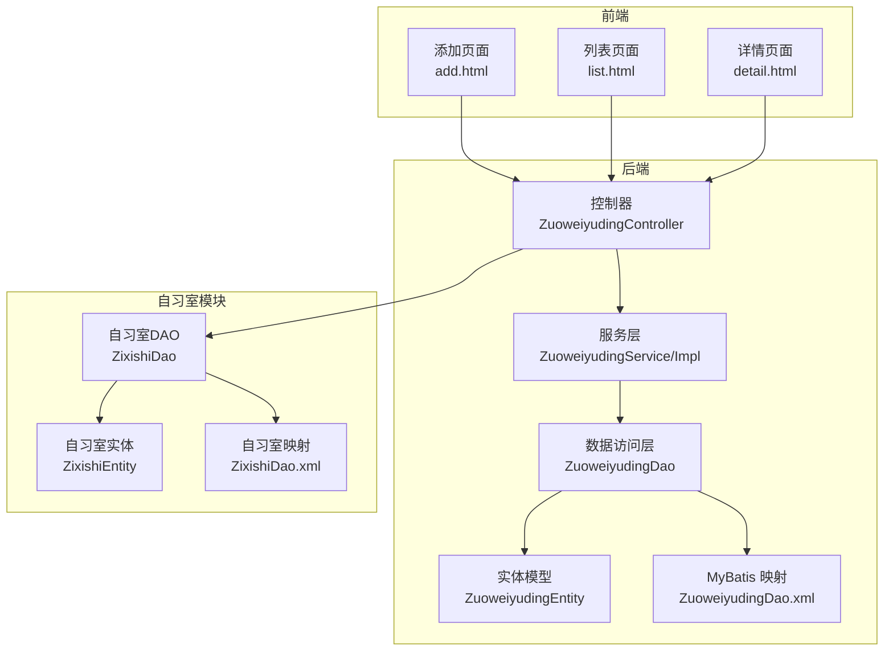
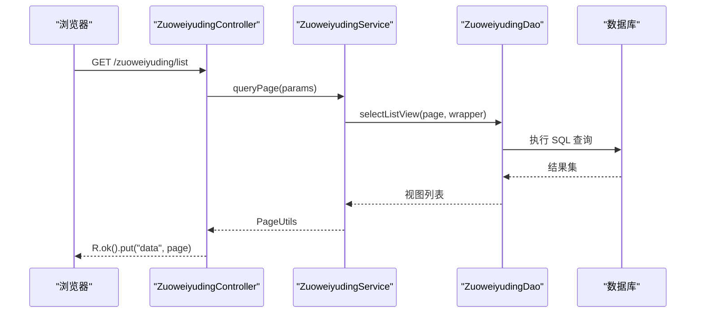
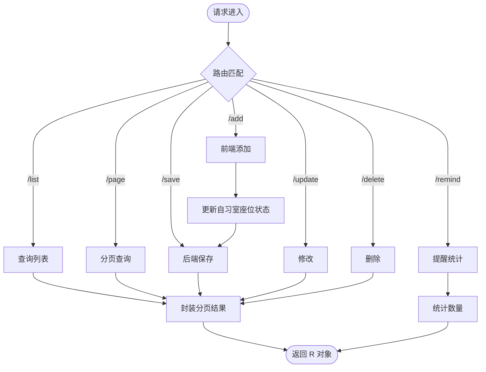
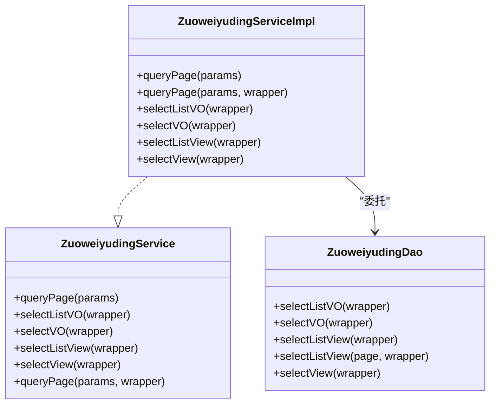
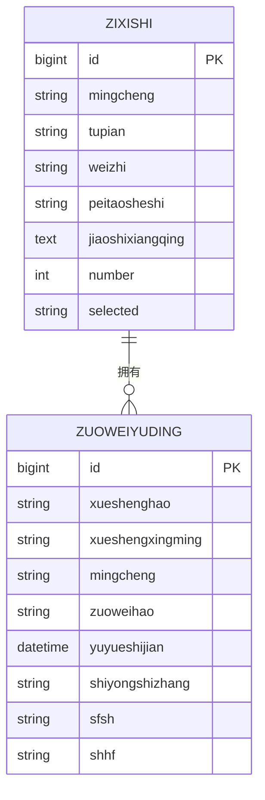
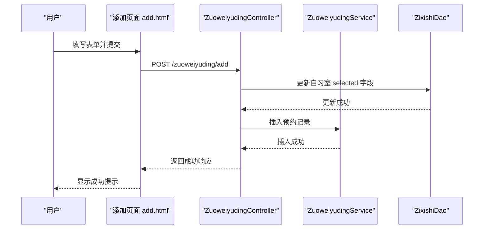
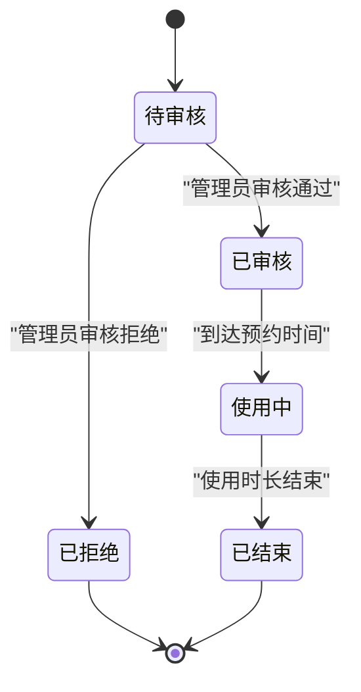
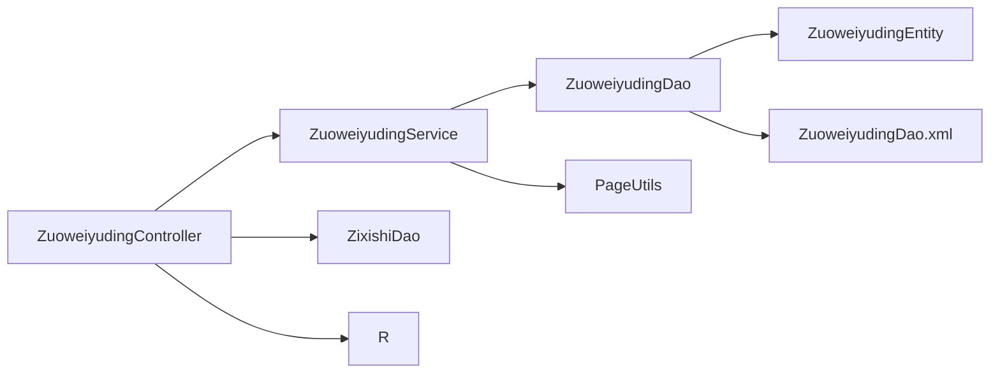

# 座位预约模块

<cite>
**本文档引用的文件**
- [ZuoweiyudingController.java](file://src/main/java/com/controller/ZuoweiyudingController.java)
- [ZuoweiyudingService.java](file://src/main/java/com/service/ZuoweiyudingService.java)
- [ZuoweiyudingServiceImpl.java](file://src/main/java/com/service/impl/ZuoweiyudingServiceImpl.java)
- [ZuoweiyudingEntity.java](file://src/main/java/com/entity/ZuoweiyudingEntity.java)
- [ZuoweiyudingDao.java](file://src/main/java/com/dao/ZuoweiyudingDao.java)
- [ZixishiEntity.java](file://src/main/java/com/entity/ZixishiEntity.java)
- [ZixishiDao.java](file://src/main/java/com/dao/ZixishiDao.java)
- [ZuoweiyudingDao.xml](file://src/main/resources/mapper/ZuoweiyudingDao.xml)
- [ZixishiDao.xml](file://src/main/resources/mapper/ZixishiDao.xml)
- [add.html](file://src/main/resources/front/front/pages/zuoweiyuding/add.html)
- [list.html](file://src/main/resources/front/front/pages/zuoweiyuding/list.html)
- [detail.html](file://src/main/resources/front/front/pages/zuoweiyuding/detail.html)
- [R.java](file://src/main/java/com/utils/R.java)
- [PageUtils.java](file://src/main/java/com/utils/PageUtils.java)
</cite>

## 目录
1. [简介](#简介)
2. [项目结构](#项目结构)
3. [核心组件](#核心组件)
4. [架构概览](#架构概览)
5. [详细组件分析](#详细组件分析)
6. [依赖关系分析](#依赖关系分析)
7. [性能考虑](#性能考虑)
8. [故障排除指南](#故障排除指南)
9. [结论](#结论)
10. [附录](#附录)

## 简介
本文件为自习室座位预约模块的综合技术文档，全面阐述座位预约系统的业务流程、数据模型、API 接口、状态管理与并发控制机制。系统支持座位查询、预约申请、状态管理、取消预约等核心功能，并通过前后端分离的方式实现完整的预约体验。

## 项目结构
座位预约模块采用典型的三层架构（控制器层、服务层、数据访问层），配合 MyBatis-Plus 实现数据库访问，前端使用 Vue.js 和 Layui 构建交互界面。

**图表来源**
- [ZuoweiyudingController.java:32-224](file://src/main/java/com/controller/ZuoweiyudingController.java#L32-L224)
- [ZuoweiyudingService.java:21-35](file://src/main/java/com/service/ZuoweiyudingService.java#L21-L35)
- [ZuoweiyudingServiceImpl.java:22-62](file://src/main/java/com/service/impl/ZuoweiyudingServiceImpl.java#L22-L62)
- [ZuoweiyudingDao.java:21-33](file://src/main/java/com/dao/ZuoweiyudingDao.java#L21-L33)
- [ZuoweiyudingDao.xml:4-42](file://src/main/resources/mapper/ZuoweiyudingDao.xml#L4-L42)
- [ZixishiEntity.java:31-201](file://src/main/java/com/entity/ZixishiEntity.java#L31-L201)
- [ZixishiDao.java:21-33](file://src/main/java/com/dao/ZixishiDao.java#L21-L33)
- [ZixishiDao.xml:4-41](file://src/main/resources/mapper/ZixishiDao.xml#L4-L41)

**章节来源**
- [ZuoweiyudingController.java:32-224](file://src/main/java/com/controller/ZuoweiyudingController.java#L32-L224)
- [ZuoweiyudingService.java:21-35](file://src/main/java/com/service/ZuoweiyudingService.java#L21-L35)
- [ZuoweiyudingServiceImpl.java:22-62](file://src/main/java/com/service/impl/ZuoweiyudingServiceImpl.java#L22-L62)
- [ZuoweiyudingDao.java:21-33](file://src/main/java/com/dao/ZuoweiyudingDao.java#L21-L33)
- [ZuoweiyudingDao.xml:4-42](file://src/main/resources/mapper/ZuoweiyudingDao.xml#L4-L42)
- [ZixishiEntity.java:31-201](file://src/main/java/com/entity/ZixishiEntity.java#L31-L201)
- [ZixishiDao.java:21-33](file://src/main/java/com/dao/ZixishiDao.java#L21-L33)
- [ZixishiDao.xml:4-41](file://src/main/resources/mapper/ZixishiDao.xml#L4-L41)

## 核心组件
- 控制器层：提供 RESTful API，负责请求路由、参数解析、会话处理与响应封装。
- 服务层：封装业务逻辑，处理分页查询、视图映射与数据聚合。
- 数据访问层：基于 MyBatis-Plus 的 DAO 接口，提供通用 CRUD 与自定义查询。
- 实体模型：座位预约记录与自习室信息的数据载体。
- 前端页面：提供预约申请、列表查询与详情展示的用户界面。

**章节来源**
- [ZuoweiyudingController.java:32-224](file://src/main/java/com/controller/ZuoweiyudingController.java#L32-L224)
- [ZuoweiyudingService.java:21-35](file://src/main/java/com/service/ZuoweiyudingService.java#L21-L35)
- [ZuoweiyudingServiceImpl.java:22-62](file://src/main/java/com/service/impl/ZuoweiyudingServiceImpl.java#L22-L62)
- [ZuoweiyudingDao.java:21-33](file://src/main/java/com/dao/ZuoweiyudingDao.java#L21-L33)
- [ZuoweiyudingEntity.java:21-212](file://src/main/java/com/entity/ZuoweiyudingEntity.java#L21-L212)
- [ZixishiEntity.java:31-201](file://src/main/java/com/entity/ZixishiEntity.java#L31-L201)

## 架构概览
系统采用前后端分离架构，控制器统一返回标准响应对象，服务层负责业务编排，DAO 层通过 XML 映射执行 SQL 查询。

**图表来源**
- [ZuoweiyudingController.java:66-71](file://src/main/java/com/controller/ZuoweiyudingController.java#L66-L71)
- [ZuoweiyudingServiceImpl.java:34-40](file://src/main/java/com/service/impl/ZuoweiyudingServiceImpl.java#L34-L40)
- [ZuoweiyudingDao.xml:30-35](file://src/main/resources/mapper/ZuoweiyudingDao.xml#L30-L35)

**章节来源**
- [ZuoweiyudingController.java:66-71](file://src/main/java/com/controller/ZuoweiyudingController.java#L66-L71)
- [ZuoweiyudingServiceImpl.java:34-40](file://src/main/java/com/service/impl/ZuoweiyudingServiceImpl.java#L34-L40)
- [ZuoweiyudingDao.xml:30-35](file://src/main/resources/mapper/ZuoweiyudingDao.xml#L30-L35)

## 详细组件分析

### 控制器层（ZuoweiyudingController）
- 列表与分页：支持后端列表、前端列表、列表查询、详情查询等接口，自动注入分页参数并封装响应。
- 保存与更新：提供后端保存、前端添加、修改与删除接口，支持批量删除。
- 提醒接口：按条件范围提醒统计，支持日期区间与角色过滤。
- 会话与权限：根据会话中的用户角色动态过滤查询条件，保障数据隔离。

**图表来源**
- [ZuoweiyudingController.java:47-224](file://src/main/java/com/controller/ZuoweiyudingController.java#L47-L224)

**章节来源**
- [ZuoweiyudingController.java:47-224](file://src/main/java/com/controller/ZuoweiyudingController.java#L47-L224)

### 服务层（ZuoweiyudingService/Impl）
- 分页查询：基于 MyBatis-Plus Page 对象实现分页，支持自定义 Wrapper 条件。
- 视图映射：提供 VO、View 的查询接口，便于前后端分离的数据传输。
- 适配器模式：通过 ServiceImpl 继承 BaseMapper，减少重复实现。

**图表来源**
- [ZuoweiyudingService.java:21-35](file://src/main/java/com/service/ZuoweiyudingService.java#L21-L35)
- [ZuoweiyudingServiceImpl.java:22-62](file://src/main/java/com/service/impl/ZuoweiyudingServiceImpl.java#L22-L62)
- [ZuoweiyudingDao.java:21-33](file://src/main/java/com/dao/ZuoweiyudingDao.java#L21-L33)

**章节来源**
- [ZuoweiyudingService.java:21-35](file://src/main/java/com/service/ZuoweiyudingService.java#L21-L35)
- [ZuoweiyudingServiceImpl.java:22-62](file://src/main/java/com/service/impl/ZuoweiyudingServiceImpl.java#L22-L62)
- [ZuoweiyudingDao.java:21-33](file://src/main/java/com/dao/ZuoweiyudingDao.java#L21-L33)

### 数据模型（ZuoweiyudingEntity 与 ZixishiEntity）
- 座位预约记录：包含学生信息、自习室名称、座位号、预约时间、使用时长、审核状态与回复等字段。
- 自习室信息：包含名称、图片、位置、设施、座位总数与已选座位集合等字段。
- 关系说明：座位预约记录与自习室存在一对多关系，座位号在自习室中以逗号分隔的字符串形式维护。

**图表来源**
- [ZuoweiyudingEntity.java:21-212](file://src/main/java/com/entity/ZuoweiyudingEntity.java#L21-L212)
- [ZixishiEntity.java:31-201](file://src/main/java/com/entity/ZixishiEntity.java#L31-L201)

**章节来源**
- [ZuoweiyudingEntity.java:21-212](file://src/main/java/com/entity/ZuoweiyudingEntity.java#L21-L212)
- [ZixishiEntity.java:31-201](file://src/main/java/com/entity/ZixishiEntity.java#L31-L201)

### 前端页面（add.html、list.html、detail.html）
- 添加页面：提供预约表单，自动填充当前登录学生的学号与姓名，提交后调用后端添加接口。
- 列表页面：支持按学生号与姓名筛选，显示已审核通过的预约记录，提供分页与跳转。
- 详情页面：展示预约详情，包含学生信息、自习室名称、座位号、预约时间与使用时长等。

**图表来源**
- [add.html:402-425](file://src/main/resources/front/front/pages/zuoweiyuding/add.html#L402-L425)
- [ZuoweiyudingController.java:129-152](file://src/main/java/com/controller/ZuoweiyudingController.java#L129-L152)
- [ZixishiDao.java:21-33](file://src/main/java/com/dao/ZixishiDao.java#L21-L33)

**章节来源**
- [add.html:402-425](file://src/main/resources/front/front/pages/zuoweiyuding/add.html#L402-L425)
- [list.html:376-424](file://src/main/resources/front/front/pages/zuoweiyuding/list.html#L376-L424)
- [detail.html:345-399](file://src/main/resources/front/front/pages/zuoweiyuding/detail.html#L345-L399)

### API 接口文档
- 列表查询
  - 方法：GET
  - 路径：/zuoweiyuding/list
  - 参数：支持按学生号、姓名等条件筛选
  - 响应：R.ok().put("data", PageUtils)
- 分页查询
  - 方法：GET
  - 路径：/zuoweiyuding/page
  - 参数：page、limit 等分页参数
  - 响应：R.ok().put("data", PageUtils)
- 详情查询
  - 方法：GET
  - 路径：/zuoweiyuding/detail/{id}
  - 响应：R.ok().put("data", ZuoweiyudingEntity)
- 前端添加
  - 方法：POST
  - 路径：/zuoweiyuding/add
  - 请求体：ZuoweiyudingEntity
  - 响应：R.ok()
- 后端保存
  - 方法：POST
  - 路径：/zuoweiyuding/save
  - 请求体：ZuoweiyudingEntity
  - 响应：R.ok()
- 修改
  - 方法：POST
  - 路径：/zuoweiyuding/update
  - 请求体：ZuoweiyudingEntity
  - 响应：R.ok()
- 删除
  - 方法：DELETE
  - 路径：/zuoweiyuding/delete
  - 请求体：ids[]
  - 响应：R.ok()
- 提醒统计
  - 方法：GET
  - 路径：/zuoweiyuding/remind/{columnName}/{type}
  - 查询参数：remindstart、remindend
  - 响应：R.ok().put("count", int)

**章节来源**
- [ZuoweiyudingController.java:47-224](file://src/main/java/com/controller/ZuoweiyudingController.java#L47-L224)
- [ZuoweiyudingDao.xml:18-41](file://src/main/resources/mapper/ZuoweiyudingDao.xml#L18-L41)
- [ZixishiDao.xml:17-41](file://src/main/resources/mapper/ZixishiDao.xml#L17-L41)

### 状态管理与业务流程
- 审核状态：sfsh 字段用于标识是否审核（示例值为“是”），前端列表默认仅展示已审核的预约记录。
- 座位状态：自习室 selected 字段维护已选座位集合，添加预约时会更新该字段并保持有序存储。
- 业务流程：用户提交预约 → 更新自习室座位状态 → 保存预约记录 → 返回成功响应。

**图表来源**
- [ZuoweiyudingEntity.java:84-93](file://src/main/java/com/entity/ZuoweiyudingEntity.java#L84-L93)
- [ZuoweiyudingController.java:129-152](file://src/main/java/com/controller/ZuoweiyudingController.java#L129-L152)

**章节来源**
- [ZuoweiyudingEntity.java:84-93](file://src/main/java/com/entity/ZuoweiyudingEntity.java#L84-L93)
- [ZuoweiyudingController.java:129-152](file://src/main/java/com/controller/ZuoweiyudingController.java#L129-L152)

### 冲突检测与并发控制
- 冲突检测：当前实现未显式提供座位冲突检测逻辑。建议在服务层增加时间冲突校验，避免同一时间段内同一座位被重复预约。
- 并发控制：可采用数据库层面的唯一约束或分布式锁机制，确保高并发场景下的数据一致性。

**章节来源**
- [ZuoweiyudingServiceImpl.java:22-62](file://src/main/java/com/service/impl/ZuoweiyudingServiceImpl.java#L22-L62)
- [ZuoweiyudingDao.xml:4-42](file://src/main/resources/mapper/ZuoweiyudingDao.xml#L4-L42)

### 统计与数据分析
- 现状：系统未提供专门的统计与分析接口。
- 建议：可在服务层扩展统计查询，如按时间段、座位使用频率、热门时段等维度生成报表。

**章节来源**
- [ZuoweiyudingService.java:21-35](file://src/main/java/com/service/ZuoweiyudingService.java#L21-L35)

## 依赖关系分析
- 控制器依赖服务层与自习室 DAO，服务层依赖 DAO 接口，DAO 依赖实体与 XML 映射。
- 响应封装：统一使用 R 类返回标准响应；分页使用 PageUtils 封装 MyBatis-Plus 的 Page 对象。

**图表来源**
- [ZuoweiyudingController.java:32-224](file://src/main/java/com/controller/ZuoweiyudingController.java#L32-L224)
- [ZuoweiyudingServiceImpl.java:22-62](file://src/main/java/com/service/impl/ZuoweiyudingServiceImpl.java#L22-L62)
- [ZuoweiyudingDao.xml:4-42](file://src/main/resources/mapper/ZuoweiyudingDao.xml#L4-L42)
- [R.java:9-51](file://src/main/java/com/utils/R.java#L9-L51)
- [PageUtils.java:13-101](file://src/main/java/com/utils/PageUtils.java#L13-L101)

**章节来源**
- [R.java:9-51](file://src/main/java/com/utils/R.java#L9-L51)
- [PageUtils.java:13-101](file://src/main/java/com/utils/PageUtils.java#L13-L101)

## 性能考虑
- 分页优化：使用 PageUtils 与 MyBatis-Plus 分页，避免一次性加载大量数据。
- 查询优化：通过 XML 映射精确选择字段，减少不必要的数据传输。
- 缓存策略：可引入 Redis 缓存热门自习室与座位信息，降低数据库压力。

[本节为通用指导，无需特定文件引用]

## 故障排除指南
- 响应封装：统一使用 R 类返回错误码与消息，便于前端统一处理。
- 分页异常：检查 PageUtils 构造参数与 MyBatis-Plus Page 对象的兼容性。
- 权限问题：确认会话中用户角色与 tableName 的匹配，避免越权查询。

**章节来源**
- [R.java:9-51](file://src/main/java/com/utils/R.java#L9-L51)
- [PageUtils.java:13-101](file://src/main/java/com/utils/PageUtils.java#L13-L101)
- [ZuoweiyudingController.java:53-60](file://src/main/java/com/controller/ZuoweiyudingController.java#L53-L60)

## 结论
座位预约模块实现了从用户提交到管理员审核的完整闭环，结合自习室座位状态管理，提供了基础的预约能力。后续可在冲突检测、并发控制与统计分析方面进一步完善，以提升系统的可靠性与用户体验。

[本节为总结性内容，无需特定文件引用]

## 附录
- 响应对象 R：统一返回 code、msg 与数据体。
- 分页工具 PageUtils：封装 MyBatis-Plus Page 对象，提供序列化支持。

**章节来源**
- [R.java:9-51](file://src/main/java/com/utils/R.java#L9-L51)
- [PageUtils.java:13-101](file://src/main/java/com/utils/PageUtils.java#L13-L101)