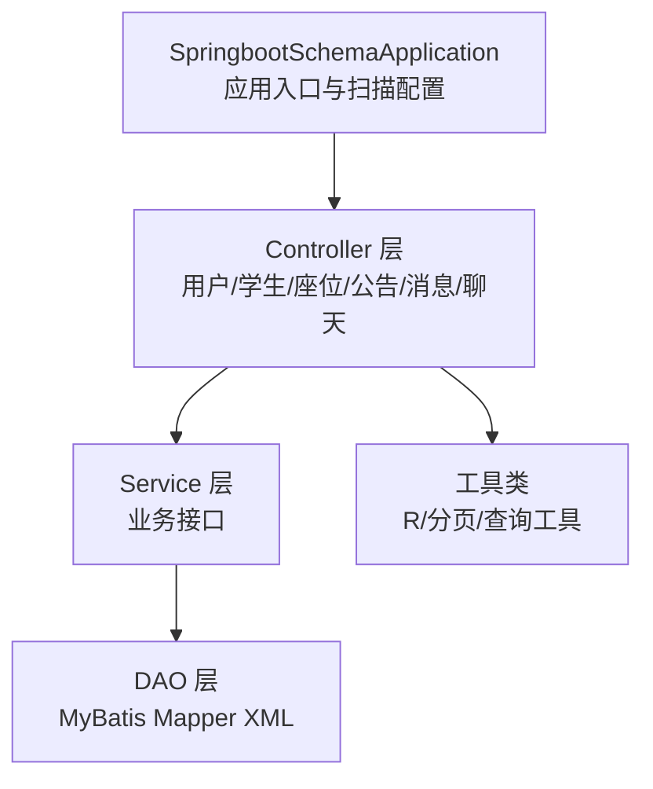
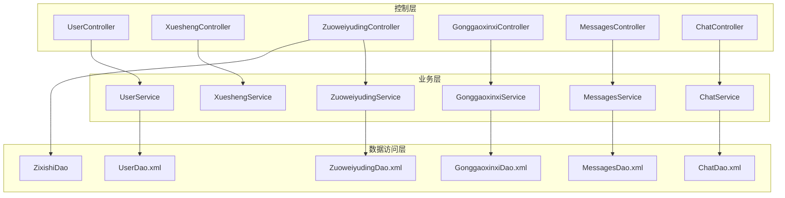
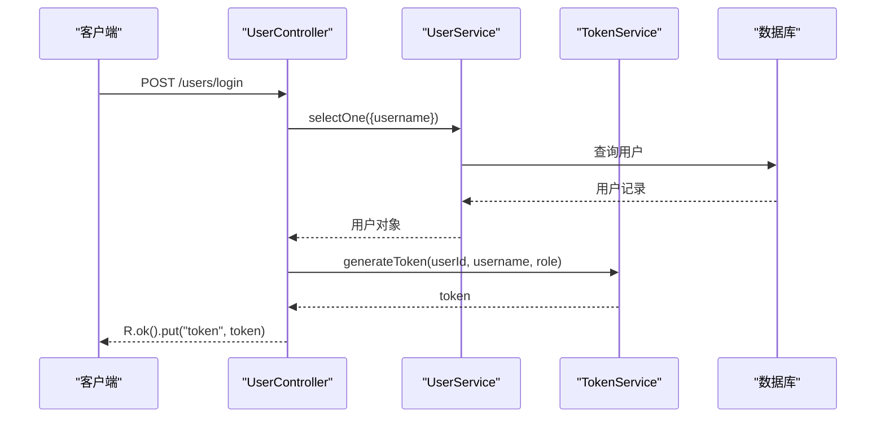
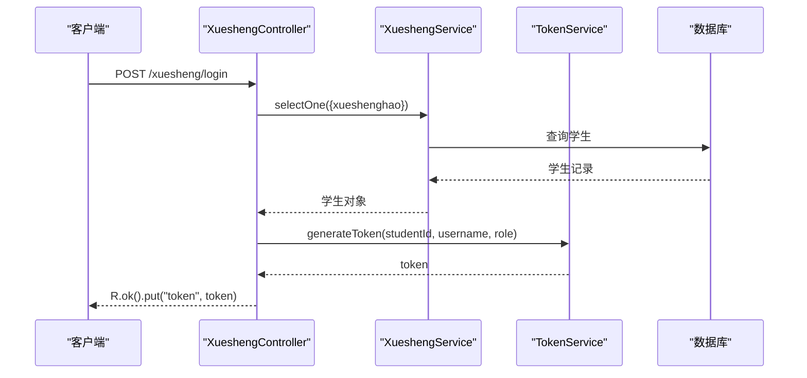
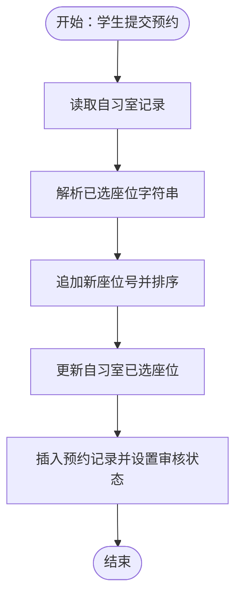
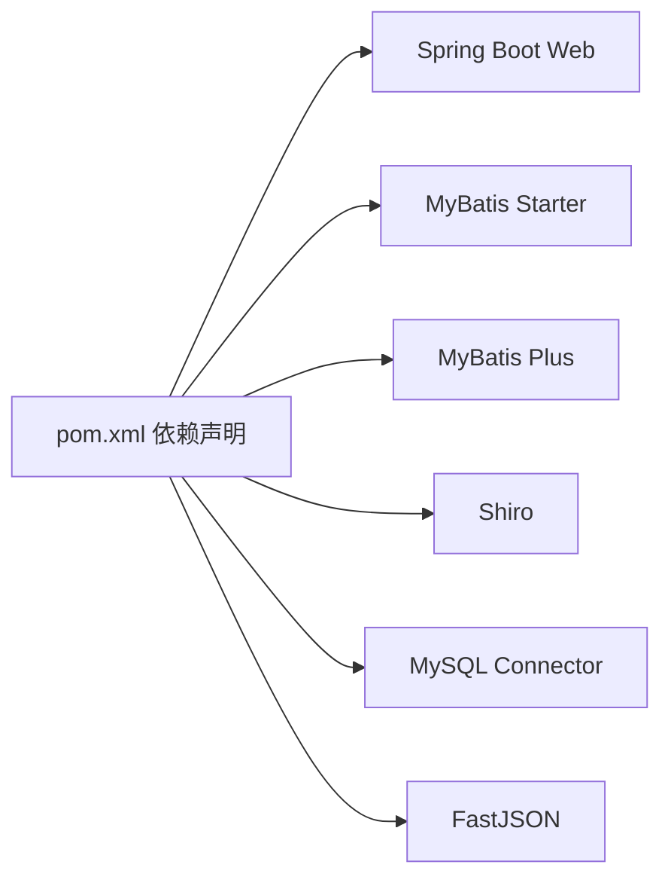

# 核心功能模块

<cite>
**本文引用的文件**
- [SpringbootSchemaApplication.java](file://src/main/java/com/SpringbootSchemaApplication.java)
- [pom.xml](file://pom.xml)
- [README.md](file://README.md)
- [UserController.java](file://src/main/java/com/controller/UserController.java)
- [XueshengController.java](file://src/main/java/com/controller/XueshengController.java)
- [ZuoweiyudingController.java](file://src/main/java/com/controller/ZuoweiyudingController.java)
- [GonggaoxinxiController.java](file://src/main/java/com/controller/GonggaoxinxiController.java)
- [MessagesController.java](file://src/main/java/com/controller/MessagesController.java)
- [ChatController.java](file://src/main/java/com/controller/ChatController.java)
- [UserEntity.java](file://src/main/java/com/entity/UserEntity.java)
- [UserService.java](file://src/main/java/com/service/UserService.java)
- [XueshengService.java](file://src/main/java/com/service/XueshengService.java)
- [R.java](file://src/main/java/com/utils/R.java)
- [PageUtils.java](file://src/main/java/com/utils/PageUtils.java)
- [UserDao.xml](file://src/main/resources/mapper/UserDao.xml)
</cite>

## 目录
1. [简介](#简介)
2. [项目结构](#项目结构)
3. [核心组件](#核心组件)
4. [架构总览](#架构总览)
5. [详细组件分析](#详细组件分析)
6. [依赖分析](#依赖分析)
7. [性能考虑](#性能考虑)
8. [故障排查指南](#故障排查指南)
9. [结论](#结论)
10. [附录](#附录)

## 简介
本系统为基于 Spring Boot 与 MyBatis 的自习室管理系统，面向两类角色：管理员与学生。系统提供用户管理、座位预约、公告管理、消息通知（留言与客服聊天）等核心功能。后端采用标准的 MVC 架构，控制器负责请求入口与参数封装，服务层承担业务逻辑，DAO 层通过 MyBatis Plus 执行数据库操作；统一返回体 R 封装响应结构；分页工具 PageUtils 支持复杂查询与分页。

## 项目结构
- 后端应用入口与扫描配置位于 SpringBootApplication 类中，扫描 DAO 包以启用 MyBatis Mapper。
- 控制器层按功能域划分：用户管理（管理员与学生）、座位预约、公告管理、消息通知（留言与客服聊天）。
- 实体层定义各业务模型，服务层定义接口契约，DAO 层通过 XML 映射 SQL。
- 工具类提供统一返回体、分页、校验、查询条件拼装等通用能力。

图示来源
- [SpringbootSchemaApplication.java:11-20](file://src/main/java/com/SpringbootSchemaApplication.java#L11-L20)
- [UserController.java:38-40](file://src/main/java/com/controller/UserController.java#L38-L40)
- [XueshengController.java:46-48](file://src/main/java/com/controller/XueshengController.java#L46-L48)
- [ZuoweiyudingController.java:32-34](file://src/main/java/com/controller/ZuoweiyudingController.java#L32-L34)
- [GonggaoxinxiController.java:46-48](file://src/main/java/com/controller/GonggaoxinxiController.java#L46-L48)
- [MessagesController.java:46-48](file://src/main/java/com/controller/MessagesController.java#L46-L48)
- [ChatController.java:46-48](file://src/main/java/com/controller/ChatController.java#L46-L48)

章节来源
- [SpringbootSchemaApplication.java:11-20](file://src/main/java/com/SpringbootSchemaApplication.java#L11-L20)
- [pom.xml:24-59](file://pom.xml#L24-L59)

## 核心组件
- 应用入口与扫描
  - 应用启动类启用 Spring Boot 并扫描 com.dao 包下的 Mapper 接口，确保 MyBatis Plus 能自动注入 DAO。
- 统一返回体 R
  - 规范化响应结构，包含 code、msg 以及业务数据字段，便于前后端一致处理。
- 分页工具 PageUtils
  - 封装 MyBatis Plus Page 结果，提供 total、pageSize、currPage、list 等字段，简化分页展示。
- 查询与排序工具
  - 控制器侧通过 MPUtil 进行 like/eq/between 等条件拼装与排序组合，DAO XML 中通过 ${ew.sqlSegment} 注入动态条件。

章节来源
- [R.java:9-51](file://src/main/java/com/utils/R.java#L9-L51)
- [PageUtils.java:13-101](file://src/main/java/com/utils/PageUtils.java#L13-L101)

## 架构总览
系统采用典型的三层架构：控制层（Controller）、业务层（Service）、数据访问层（DAO）。控制器负责接收请求、参数校验与会话处理，服务层组织业务流程，DAO 层执行持久化操作。所有接口统一返回 R 结构，分页场景由 PageUtils 统一处理。

图示来源
- [UserController.java:42-46](file://src/main/java/com/controller/UserController.java#L42-L46)
- [XueshengController.java:49-53](file://src/main/java/com/controller/XueshengController.java#L49-L53)
- [ZuoweiyudingController.java:35-43](file://src/main/java/com/controller/ZuoweiyudingController.java#L35-L43)
- [GonggaoxinxiController.java:49-51](file://src/main/java/com/controller/GonggaoxinxiController.java#L49-L51)
- [MessagesController.java:49-51](file://src/main/java/com/controller/MessagesController.java#L49-L51)
- [ChatController.java:48-51](file://src/main/java/com/controller/ChatController.java#L48-L51)
- [UserDao.xml:4-12](file://src/main/resources/mapper/UserDao.xml#L4-L12)

## 详细组件分析

### 用户管理模块（管理员）
- 主要职责
  - 管理员登录、注册、密码重置、退出登录。
  - 管理员信息的增删改查与分页列表。
- 核心业务流程
  - 登录：根据用户名查询用户，校验密码，生成 token 返回。
  - 注册：检查用户名唯一性，插入新用户。
  - 密码重置：按用户名重置为默认密码。
  - 退出：使 session 失效。
- 数据处理逻辑
  - 使用 EntityWrapper 构建查询条件，调用 UserService 执行 CRUD。
  - 统一返回 R.ok()/R.error()，分页使用 PageUtils。
- 关键接口
  - POST /users/login
  - POST /users/register
  - GET /users/logout
  - POST /users/resetPass
  - GET /users/page
  - GET /users/list
  - GET /users/info/{id}
  - POST /users/save
  - POST /users/update
  - DELETE /users/delete

图示来源
- [UserController.java:51-60](file://src/main/java/com/controller/UserController.java#L51-L60)
- [UserService.java:18-25](file://src/main/java/com/service/UserService.java#L18-L25)

章节来源
- [UserController.java:38-175](file://src/main/java/com/controller/UserController.java#L38-L175)
- [UserService.java:18-25](file://src/main/java/com/service/UserService.java#L18-L25)
- [UserDao.xml:4-12](file://src/main/resources/mapper/UserDao.xml#L4-L12)

### 学生管理模块
- 主要职责
  - 学生登录、注册、密码重置、退出登录。
  - 学生信息的增删改查、分页列表、前端详情。
- 核心业务流程
  - 登录：根据学号查询学生，校验密码，生成 token 返回。
  - 注册：检查学号唯一性，插入新学生记录。
  - 提醒接口：支持按日期区间提醒统计。
- 数据处理逻辑
  - 控制器侧对 session 中的用户信息进行读取与写入。
  - 分页与查询条件通过 MPUtil 组合，DAO XML 动态注入条件。
- 关键接口
  - POST /xuesheng/login
  - POST /xuesheng/register
  - GET /xuesheng/logout
  - POST /xuesheng/resetPass
  - GET /xuesheng/session
  - GET /xuesheng/page
  - GET /xuesheng/list
  - GET /xuesheng/detail/{id}
  - POST /xuesheng/save
  - POST /xuesheng/add
  - POST /xuesheng/update
  - DELETE /xuesheng/delete
  - GET /xuesheng/remind/{columnName}/{type}

图示来源
- [XueshengController.java:58-68](file://src/main/java/com/controller/XueshengController.java#L58-L68)
- [XueshengService.java:21-35](file://src/main/java/com/service/XueshengService.java#L21-L35)

章节来源
- [XueshengController.java:46-284](file://src/main/java/com/controller/XueshengController.java#L46-L284)
- [XueshengService.java:21-35](file://src/main/java/com/service/XueshengService.java#L21-L35)

### 座位预约模块
- 主要职责
  - 管理员与学生均可查看座位预约列表与详情。
  - 学生提交预约申请时，联动更新自习室的已选座位集合。
  - 预约审核状态统一维护。
- 核心业务流程
  - 学生添加预约：读取自习室已选座位，追加新座位号并排序去重，更新自习室记录；同时插入预约记录并标记审核状态。
  - 管理员分页查询：根据会话中的角色与用户名过滤数据。
  - 提醒接口：支持按日期区间提醒统计。
- 数据处理逻辑
  - 控制器从 session 中读取当前用户身份与用户名，构造查询条件。
  - 更新自习室座位集合时，先读取原字符串，分割、追加、排序、合并后写回。
- 关键接口
  - GET /zuoweiyuding/page
  - GET /zuoweiyuding/list
  - GET /zuoweiyuding/info/{id}
  - POST /zuoweiyuding/save
  - POST /zuoweiyuding/add
  - POST /zuoweiyuding/update
  - DELETE /zuoweiyuding/delete
  - GET /zuoweiyuding/remind/{columnName}/{type}

图示来源
- [ZuoweiyudingController.java:129-152](file://src/main/java/com/controller/ZuoweiyudingController.java#L129-L152)

章节来源
- [ZuoweiyudingController.java:32-224](file://src/main/java/com/controller/ZuoweiyudingController.java#L32-L224)

### 公告管理模块
- 主要职责
  - 管理员发布、编辑、删除公告。
  - 学生可查看公告列表与详情。
- 核心业务流程
  - 管理员后台：分页查询、详情、保存、修改、删除。
  - 学生前台：公开列表与详情接口，无需登录。
  - 提醒接口：支持按日期区间提醒统计。
- 数据处理逻辑
  - 控制器侧通过 EntityWrapper 组合查询条件，DAO XML 注入动态条件。
- 关键接口
  - GET /gonggaoxinxi/page
  - GET /gonggaoxinxi/list
  - GET /gonggaoxinxi/detail/{id}
  - POST /gonggaoxinxi/save
  - POST /gonggaoxinxi/add
  - POST /gonggaoxinxi/update
  - DELETE /gonggaoxinxi/delete
  - GET /gonggaoxinxi/remind/{columnName}/{type}

章节来源
- [GonggaoxinxiController.java:46-208](file://src/main/java/com/controller/GonggaoxinxiController.java#L46-L208)

### 消息通知模块（留言与客服聊天）
- 主要职责
  - 留言板：用户可发布留言，管理员可回复。
  - 客服聊天：用户与管理员双向对话，系统维护回复状态。
- 核心业务流程
  - 留言保存：若为提问则标记未回复；若为回复则标记未回复给提问者。
  - 聊天保存：区分提问与回复，设置用户与管理员标识。
  - 权限控制：非管理员仅能查看/操作自己的留言/聊天。
- 数据处理逻辑
  - 控制器侧根据会话中的用户与角色设置查询条件与保存字段。
  - DAO 层通过 XML 执行插入与条件更新。
- 关键接口
  - 留言：GET/POST/PUT/DELETE /messages/*
  - 聊天：GET/POST/PUT/DELETE /chat/*

章节来源
- [MessagesController.java:46-213](file://src/main/java/com/controller/MessagesController.java#L46-L213)
- [ChatController.java:46-231](file://src/main/java/com/controller/ChatController.java#L46-L231)

## 依赖分析
- 技术栈
  - 后端：Spring Boot、MyBatis、MyBatis Plus、Shiro（权限）、MySQL JDBC。
  - 工具：FastJSON、Commons Lang3、Commons IO、Hutool 等。
- 模块耦合
  - 控制器依赖服务接口，服务接口依赖 DAO，DAO 依赖 XML 映射。
  - 统一返回体 R 与分页工具 PageUtils 被多模块共享。
- 外部依赖
  - MySQL 驱动与连接池由 Spring Boot Starter JDBC 提供。
  - Shiro 用于权限控制（注解与拦截器），但控制器中未显式体现。

图示来源
- [pom.xml:24-128](file://pom.xml#L24-L128)

章节来源
- [pom.xml:24-128](file://pom.xml#L24-L128)

## 性能考虑
- 分页优化
  - PageUtils 封装 MyBatis Plus Page，建议在高频查询上配合索引与 LIMIT 优化。
- 查询条件
  - MPUtil 动态拼接条件，注意避免全表扫描，必要时为常用查询列建立索引。
- 缓存策略
  - 可在热点数据（如公告列表）引入缓存，减少数据库压力。
- 日志与监控
  - 建议在控制器与服务层增加方法级日志，结合统一异常处理输出错误堆栈与耗时。
- 异步处理
  - 对于非关键路径（如发送通知）可考虑异步化，提升接口响应速度。

## 故障排查指南
- 登录失败
  - 检查用户名是否存在、密码是否匹配；确认 Token 生成逻辑与会话状态。
- 重复注册
  - 用户名/学号唯一性校验失败，需清理重复数据或提示用户更换标识。
- 预约冲突
  - 自习室座位集合更新逻辑需保证并发安全，建议使用数据库层面的乐观锁或原子更新。
- 权限问题
  - 非管理员用户无法看到他人数据，需检查会话中的 role 与 userId 是否正确写入。
- 统一返回体
  - 所有接口应返回 R 结构，便于前端统一处理错误与提示。

章节来源
- [UserController.java:51-60](file://src/main/java/com/controller/UserController.java#L51-L60)
- [XueshengController.java:77-84](file://src/main/java/com/controller/XueshengController.java#L77-L84)
- [ZuoweiyudingController.java:134-146](file://src/main/java/com/controller/ZuoweiyudingController.java#L134-L146)
- [MessagesController.java:60-62](file://src/main/java/com/controller/MessagesController.java#L60-L62)
- [R.java:9-51](file://src/main/java/com/utils/R.java#L9-L51)

## 结论
本系统以清晰的分层架构实现了自习室管理的核心功能，控制器统一入口、服务层承载业务、DAO 层专注持久化，配合统一返回体与分页工具，具备良好的可维护性与扩展性。建议后续在权限控制、并发安全、缓存与监控方面进一步完善，以提升系统稳定性与用户体验。

## 附录
- 快速概览
  - 项目角色：管理员、学生
  - 核心模块：用户管理、座位预约、公告管理、消息通知（留言与客服聊天）
  - 技术栈：Spring Boot、MyBatis、MyBatis Plus、Shiro、MySQL、FastJSON
- 开发与部署
  - JDK 1.8、MySQL 5.7/8.x、IDE（IDEA/Eclipse）、Maven
- 参考资料
  - README.md 提供了功能模块截图与技术栈说明

章节来源
- [README.md:5-64](file://README.md#L5-L64)