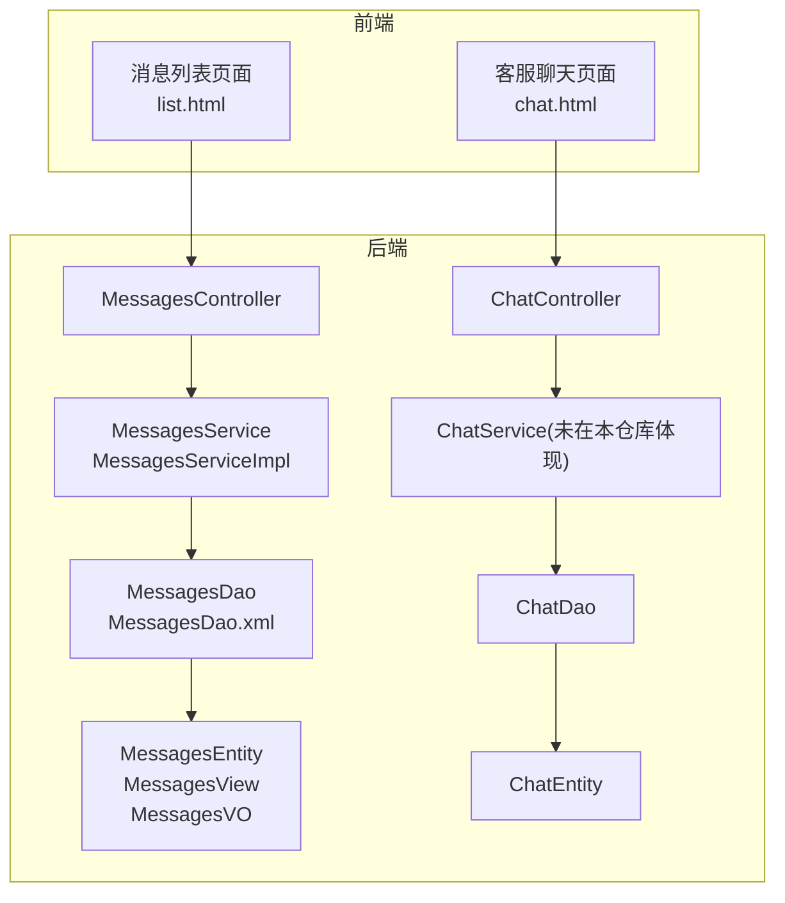
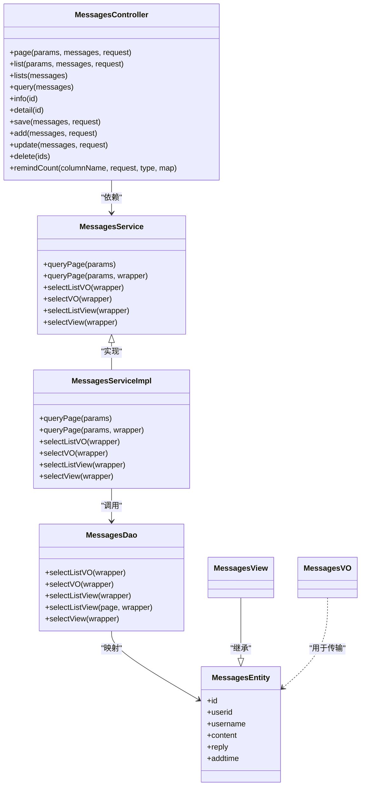
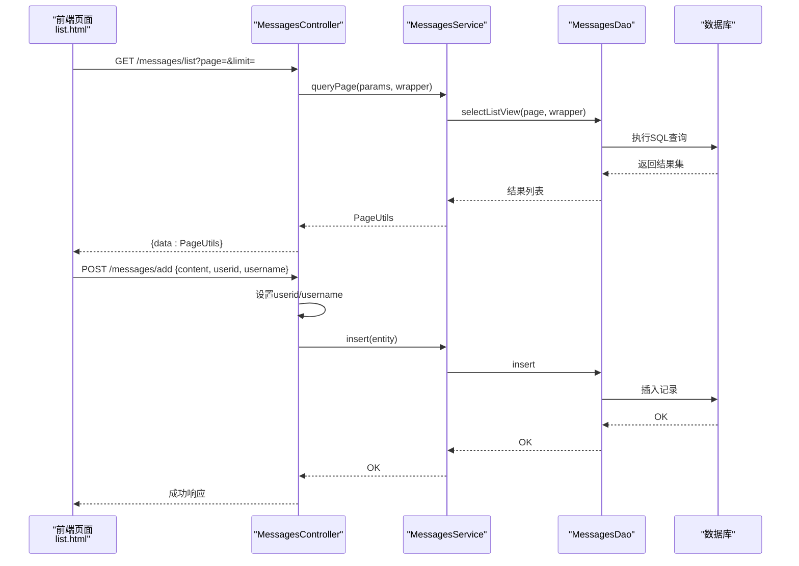
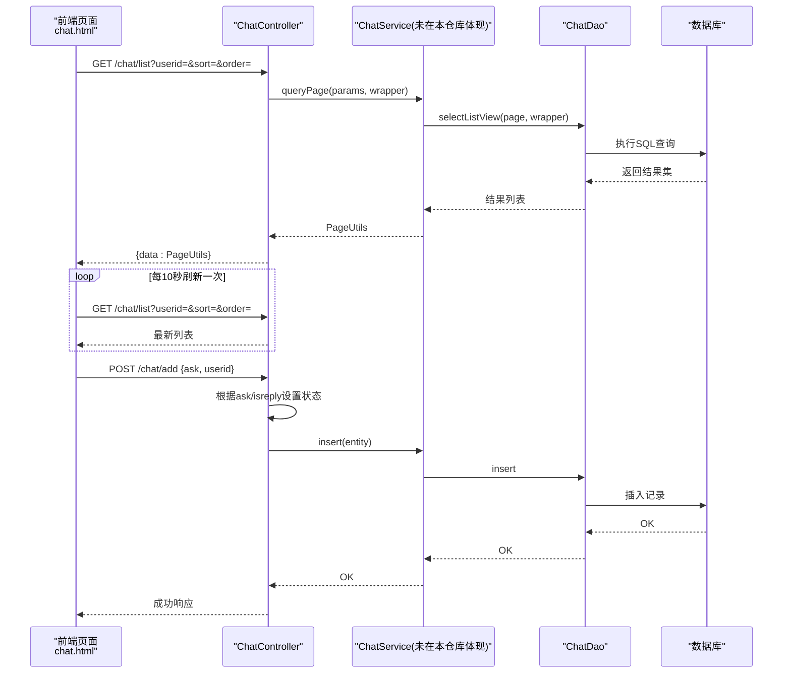
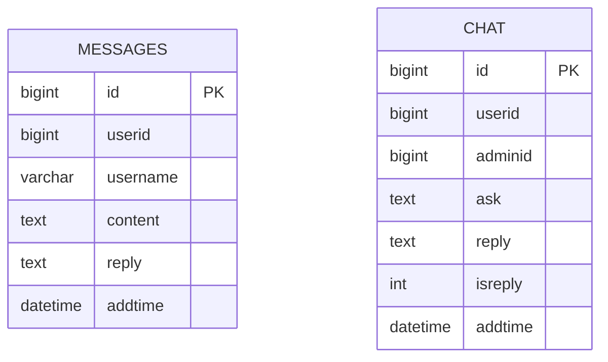
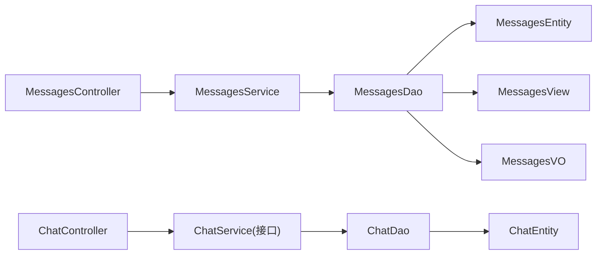

# 消息通知模块

<cite>
**本文引用的文件**
- [MessagesController.java](file://src/main/java/com/controller/MessagesController.java)
- [MessagesService.java](file://src/main/java/com/service/MessagesService.java)
- [MessagesServiceImpl.java](file://src/main/java/com/service/impl/MessagesServiceImpl.java)
- [MessagesDao.java](file://src/main/java/com/dao/MessagesDao.java)
- [MessagesEntity.java](file://src/main/java/com/entity/MessagesEntity.java)
- [MessagesView.java](file://src/main/java/com/entity/view/MessagesView.java)
- [MessagesVO.java](file://src/main/java/com/entity/vo/MessagesVO.java)
- [MessagesDao.xml](file://src/main/resources/mapper/MessagesDao.xml)
- [ChatController.java](file://src/main/java/com/controller/ChatController.java)
- [ChatDao.java](file://src/main/java/com/dao/ChatDao.java)
- [ChatEntity.java](file://src/main/java/com/entity/ChatEntity.java)
- [list.html](file://src/main/resources/front/front/pages/messages/list.html)
- [chat.html](file://src/main/resources/front/front/pages/chat/chat.html)
</cite>

## 目录
1. [简介](#简介)
2. [项目结构](#项目结构)
3. [核心组件](#核心组件)
4. [架构总览](#架构总览)
5. [详细组件分析](#详细组件分析)
6. [依赖分析](#依赖分析)
7. [性能考虑](#性能考虑)
8. [故障排查指南](#故障排查指南)
9. [结论](#结论)
10. [附录](#附录)

## 简介
本文件面向“消息通知模块”，聚焦于系统内的站内信与客服聊天两大消息通道，完整梳理其数据模型、接口能力、前后端交互流程与扩展点。当前代码库中存在两条主线：
- 站内信（messages 表）：支持用户留言与回复，具备分页列表、条件查询、提醒计数等能力。
- 客服聊天（chat 表）：支持用户与管理员之间的问答与回复，具备自动刷新、未读标记等特性。

文档将从架构、组件、数据流、API 规范、性能与安全等方面进行系统化说明，并给出可视化图示与排障建议，帮助开发者快速理解与扩展该模块。

## 项目结构
消息通知模块在后端采用标准的三层架构（Controller-Service-DAO），配合 MyBatis-Plus 实现通用 CRUD 与分页；前端通过 HTML 页面与 JS 调用后端接口，完成消息列表展示与提交。

图表来源
- [MessagesController.java:46-212](file://src/main/java/com/controller/MessagesController.java#L46-L212)
- [MessagesServiceImpl.java:21-62](file://src/main/java/com/service/impl/MessagesServiceImpl.java#L21-L62)
- [MessagesDao.java:21-33](file://src/main/java/com/dao/MessagesDao.java#L21-L33)
- [MessagesDao.xml:4-38](file://src/main/resources/mapper/MessagesDao.xml#L4-L38)
- [MessagesEntity.java:31-146](file://src/main/java/com/entity/MessagesEntity.java#L31-L146)
- [MessagesView.java:20-36](file://src/main/java/com/entity/view/MessagesView.java#L20-L36)
- [MessagesVO.java:21-91](file://src/main/java/com/entity/vo/MessagesVO.java#L21-L91)
- [ChatController.java:46-230](file://src/main/java/com/controller/ChatController.java#L46-L230)
- [ChatDao.java:21-33](file://src/main/java/com/dao/ChatDao.java#L21-L33)
- [ChatEntity.java:31-164](file://src/main/java/com/entity/ChatEntity.java#L31-L164)
- [list.html:218-268](file://src/main/resources/front/front/pages/messages/list.html#L218-L268)
- [chat.html:94-139](file://src/main/resources/front/front/pages/chat/chat.html#L94-L139)

章节来源
- [MessagesController.java:46-212](file://src/main/java/com/controller/MessagesController.java#L46-L212)
- [ChatController.java:46-230](file://src/main/java/com/controller/ChatController.java#L46-L230)
- [list.html:218-268](file://src/main/resources/front/front/pages/messages/list.html#L218-L268)
- [chat.html:94-139](file://src/main/resources/front/front/pages/chat/chat.html#L94-L139)

## 核心组件
- 控制器层
  - MessagesController：提供消息列表、详情、新增、更新、删除、提醒计数等接口。
  - ChatController：提供聊天记录的列表、详情、新增、更新、删除、提醒计数等接口。
- 服务层
  - MessagesService：定义分页查询、视图/值对象查询、通用分页等接口。
  - MessagesServiceImpl：基于 MyBatis-Plus 的分页实现与视图查询适配。
- 数据访问层
  - MessagesDao：定义 VO/View 查询方法与分页查询签名。
  - MessagesDao.xml：提供 SQL 映射，支撑列表、视图查询。
- 实体与视图
  - MessagesEntity：消息实体（含主键、用户标识、用户名、内容、回复、时间戳等字段）。
  - MessagesView：后端返回视图实体（继承消息实体，便于扩展字段）。
  - MessagesVO：移动端接口返回值对象（精简字段集合）。
  - ChatEntity：客服聊天实体（含用户/管理员标识、提问、回复、是否回复标记等）。
- 前端页面
  - list.html：消息列表页面，支持分页与提交留言。
  - chat.html：客服聊天页面，定时刷新聊天记录并支持提交提问。

章节来源
- [MessagesController.java:57-212](file://src/main/java/com/controller/MessagesController.java#L57-L212)
- [MessagesService.java:21-35](file://src/main/java/com/service/MessagesService.java#L21-L35)
- [MessagesServiceImpl.java:25-60](file://src/main/java/com/service/impl/MessagesServiceImpl.java#L25-L60)
- [MessagesDao.java:21-33](file://src/main/java/com/dao/MessagesDao.java#L21-L33)
- [MessagesDao.xml:14-36](file://src/main/resources/mapper/MessagesDao.xml#L14-L36)
- [MessagesEntity.java:31-146](file://src/main/java/com/entity/MessagesEntity.java#L31-L146)
- [MessagesView.java:20-36](file://src/main/java/com/entity/view/MessagesView.java#L20-L36)
- [MessagesVO.java:21-91](file://src/main/java/com/entity/vo/MessagesVO.java#L21-L91)
- [ChatController.java:57-230](file://src/main/java/com/controller/ChatController.java#L57-L230)
- [ChatEntity.java:31-164](file://src/main/java/com/entity/ChatEntity.java#L31-L164)
- [list.html:218-268](file://src/main/resources/front/front/pages/messages/list.html#L218-L268)
- [chat.html:94-139](file://src/main/resources/front/front/pages/chat/chat.html#L94-L139)

## 架构总览
消息通知模块遵循典型的 MVC + 分层架构，结合 MyBatis-Plus 的通用 Mapper 与分页工具，实现高内聚低耦合的数据访问层。控制器负责参数校验与会话权限控制，服务层封装业务逻辑，DAO 层承载 SQL 映射，实体与视图/值对象承担数据传输职责。

图表来源
- [MessagesController.java:46-212](file://src/main/java/com/controller/MessagesController.java#L46-L212)
- [MessagesService.java:21-35](file://src/main/java/com/service/MessagesService.java#L21-L35)
- [MessagesServiceImpl.java:21-62](file://src/main/java/com/service/impl/MessagesServiceImpl.java#L21-L62)
- [MessagesDao.java:21-33](file://src/main/java/com/dao/MessagesDao.java#L21-L33)
- [MessagesEntity.java:31-146](file://src/main/java/com/entity/MessagesEntity.java#L31-L146)
- [MessagesView.java:20-36](file://src/main/java/com/entity/view/MessagesView.java#L20-L36)
- [MessagesVO.java:21-91](file://src/main/java/com/entity/vo/MessagesVO.java#L21-L91)

## 详细组件分析

### 站内信模块（messages）
- 功能范围
  - 列表与分页：支持后台与前台两类列表接口，按用户维度过滤。
  - 查询与详情：支持按条件查询与单条详情。
  - 新增与更新：支持后台保存与前端提交；更新时全量更新。
  - 删除：支持批量删除。
  - 提醒计数：支持按列与时间段区间统计数量。
- 关键接口
  - 列表与分页：/messages/page、/messages/list、/messages/lists
  - 查询与详情：/messages/query、/messages/info/{id}、/messages/detail/{id}
  - 新增与更新：/messages/save、/messages/add、/messages/update
  - 删除：/messages/delete
  - 提醒计数：/messages/remind/{columnName}/{type}
- 数据模型
  - 主键 id、用户标识 userid、用户名 username、留言内容 content、回复内容 reply、创建时间 addtime。
- 前端集成
  - list.html 中通过 HTTP 请求拉取列表、分页渲染，并支持提交留言。

图表来源
- [MessagesController.java:57-165](file://src/main/java/com/controller/MessagesController.java#L57-L165)
- [MessagesServiceImpl.java:25-60](file://src/main/java/com/service/impl/MessagesServiceImpl.java#L25-L60)
- [MessagesDao.xml:14-36](file://src/main/resources/mapper/MessagesDao.xml#L14-L36)
- [list.html:218-268](file://src/main/resources/front/front/pages/messages/list.html#L218-L268)

章节来源
- [MessagesController.java:57-212](file://src/main/java/com/controller/MessagesController.java#L57-L212)
- [MessagesServiceImpl.java:25-60](file://src/main/java/com/service/impl/MessagesServiceImpl.java#L25-L60)
- [MessagesDao.xml:14-36](file://src/main/resources/mapper/MessagesDao.xml#L14-L36)
- [MessagesEntity.java:31-146](file://src/main/java/com/entity/MessagesEntity.java#L31-L146)
- [MessagesView.java:20-36](file://src/main/java/com/entity/view/MessagesView.java#L20-L36)
- [MessagesVO.java:21-91](file://src/main/java/com/entity/vo/MessagesVO.java#L21-L91)
- [list.html:218-268](file://src/main/resources/front/front/pages/messages/list.html#L218-L268)

### 客服聊天模块（chat）
- 功能范围
  - 列表与分页：支持后台与前台两类列表接口，按用户维度过滤。
  - 查询与详情：支持按条件查询与单条详情。
  - 新增与更新：支持后台保存与前端提交；区分提问与回复场景。
  - 删除：支持批量删除。
  - 提醒计数：支持按列与时间段区间统计数量。
- 关键接口
  - 列表与分页：/chat/page、/chat/list、/chat/lists
  - 查询与详情：/chat/query、/chat/info/{id}、/chat/detail/{id}
  - 新增与更新：/chat/save、/chat/add、/chat/update
  - 删除：/chat/delete
  - 提醒计数：/chat/remind/{columnName}/{type}
- 数据模型
  - 主键 id、用户标识 userid、管理员标识 adminid、提问 ask、回复 reply、是否回复 isreply、创建时间 addtime。
- 前端集成
  - chat.html 中定时轮询聊天列表，支持提交提问并清空输入框。

图表来源
- [ChatController.java:57-230](file://src/main/java/com/controller/ChatController.java#L57-L230)
- [ChatDao.java:21-33](file://src/main/java/com/dao/ChatDao.java#L21-L33)
- [ChatEntity.java:31-164](file://src/main/java/com/entity/ChatEntity.java#L31-L164)
- [chat.html:94-139](file://src/main/resources/front/front/pages/chat/chat.html#L94-L139)

章节来源
- [ChatController.java:57-230](file://src/main/java/com/controller/ChatController.java#L57-L230)
- [ChatDao.java:21-33](file://src/main/java/com/dao/ChatDao.java#L21-L33)
- [ChatEntity.java:31-164](file://src/main/java/com/entity/ChatEntity.java#L31-L164)
- [chat.html:94-139](file://src/main/resources/front/front/pages/chat/chat.html#L94-L139)

### 数据模型设计
- messages 表
  - 字段：id、userid、username、content、reply、addtime
  - 用途：站内留言与回复
- chat 表
  - 字段：id、userid、adminid、ask、reply、isreply、addtime
  - 用途：用户与管理员之间的问答与回复

图表来源
- [MessagesEntity.java:52-81](file://src/main/java/com/entity/MessagesEntity.java#L52-L81)
- [ChatEntity.java:52-87](file://src/main/java/com/entity/ChatEntity.java#L52-L87)

章节来源
- [MessagesEntity.java:31-146](file://src/main/java/com/entity/MessagesEntity.java#L31-L146)
- [ChatEntity.java:31-164](file://src/main/java/com/entity/ChatEntity.java#L31-L164)

### API 接口规范（消息通知）
以下为消息通知模块的接口清单与行为说明（以 messages 为例，chat 类似）：

- 列表与分页
  - GET /messages/page
    - 参数：page、limit、排序与筛选条件
    - 权限：非管理员自动附加用户过滤
    - 返回：分页数据
  - GET /messages/list
    - 参数：page、limit、排序与筛选条件
    - 权限：非管理员自动附加用户过滤
    - 返回：分页数据
  - GET /messages/lists
    - 参数：任意 messages 字段的等值条件
    - 返回：列表视图
- 查询与详情
  - GET /messages/query
    - 参数：messages 对象的等值条件
    - 返回：单条视图
  - GET /messages/info/{id}
    - 返回：单条实体
  - GET /messages/detail/{id}
    - 返回：单条实体
- 新增与更新
  - POST /messages/save
    - 请求体：messages
    - 返回：成功
  - POST /messages/add
    - 请求体：messages（前端提交）
    - 自动填充：userid、username
    - 返回：成功
  - PUT /messages/update
    - 请求体：messages（全量更新）
    - 返回：成功
- 删除
  - DELETE /messages/delete
    - 请求体：id 数组
    - 返回：成功
- 提醒计数
  - GET /messages/remind/{columnName}/{type}
    - 参数：remindstart、remindend（type=2 时生效）
    - 返回：满足条件的数量

章节来源
- [MessagesController.java:57-212](file://src/main/java/com/controller/MessagesController.java#L57-L212)

### 模板系统与动态内容
- 当前代码库未发现专门的“消息模板引擎”或“动态内容生成”实现。消息内容（content、reply）直接存储于数据库，前端页面按字段渲染。
- 若需引入模板系统，可在服务层增加模板解析与变量替换逻辑，结合配置中心或消息类型表扩展动态内容生成能力。

### 分类管理与处理逻辑
- 站内信（messages）：以留言与回复为主，适合系统通知、公告反馈等场景。
- 客服聊天（chat）：以问答与回复为主，适合用户咨询、问题反馈等场景。
- 扩展建议：可引入“消息类型”字段与“消息模板”表，按类型路由到不同处理逻辑与渲染模板。

### 实时推送与异步处理
- 现状：前端通过定时轮询（chat.html 每10秒刷新）实现近实时展示。
- 异步处理：当前未见消息发送的异步队列或任务调度实现。
- 建议：引入消息中间件（如 RabbitMQ/Kafka）与异步任务，实现消息落库后的异步通知与推送。

### 统计分析
- 现状：提供提醒计数接口（/remind），可用于统计待处理事项数量。
- 建议：新增消息送达率、用户互动率、消息分类统计等指标，结合埋点与报表模块实现。

### 安全与隐私
- 登录态与权限
  - 控制器中对非管理员请求自动附加用户过滤，避免越权访问。
- 输入校验
  - 控制器中注释了实体校验逻辑，建议启用以增强安全性。
- 敏感字段
  - 建议对 content/reply 等字段进行敏感词过滤与长度限制。
- 会话与令牌
  - 建议结合 TokenService 进行统一鉴权与会话管理。

章节来源
- [MessagesController.java:60-62](file://src/main/java/com/controller/MessagesController.java#L60-L62)
- [ChatController.java:60-62](file://src/main/java/com/controller/ChatController.java#L60-L62)

## 依赖分析
- 控制器与服务
  - MessagesController 依赖 MessagesService；ChatController 依赖 ChatService（服务接口未在本仓库体现）。
- 服务与 DAO
  - MessagesServiceImpl 实现 MessagesService，并委托 MessagesDao 执行 SQL。
- DAO 与实体
  - MessagesDao.xml 提供 SQL 映射，MessagesDao 定义查询签名，MessagesEntity 作为数据载体。
- 前端与后端
  - list.html 与 chat.html 通过 HTTP 请求与后端交互，分别驱动消息列表与聊天对话。

图表来源
- [MessagesController.java:49-50](file://src/main/java/com/controller/MessagesController.java#L49-L50)
- [MessagesService.java:21-35](file://src/main/java/com/service/MessagesService.java#L21-L35)
- [MessagesServiceImpl.java:21-62](file://src/main/java/com/service/impl/MessagesServiceImpl.java#L21-L62)
- [MessagesDao.java:21-33](file://src/main/java/com/dao/MessagesDao.java#L21-L33)
- [MessagesEntity.java:31-146](file://src/main/java/com/entity/MessagesEntity.java#L31-L146)
- [MessagesView.java:20-36](file://src/main/java/com/entity/view/MessagesView.java#L20-L36)
- [MessagesVO.java:21-91](file://src/main/java/com/entity/vo/MessagesVO.java#L21-L91)
- [ChatController.java:49-50](file://src/main/java/com/controller/ChatController.java#L49-L50)
- [ChatDao.java:21-33](file://src/main/java/com/dao/ChatDao.java#L21-L33)
- [ChatEntity.java:31-164](file://src/main/java/com/entity/ChatEntity.java#L31-L164)

章节来源
- [MessagesController.java:49-50](file://src/main/java/com/controller/MessagesController.java#L49-L50)
- [MessagesServiceImpl.java:21-62](file://src/main/java/com/service/impl/MessagesServiceImpl.java#L21-L62)
- [MessagesDao.java:21-33](file://src/main/java/com/dao/MessagesDao.java#L21-L33)
- [ChatController.java:49-50](file://src/main/java/com/controller/ChatController.java#L49-L50)
- [ChatDao.java:21-33](file://src/main/java/com/dao/ChatDao.java#L21-L33)

## 性能考虑
- 分页与索引
  - 使用 PageUtils 与 MyBatis-Plus 分页；建议为常用查询列（如 userid、addtime）建立索引。
- 查询优化
  - 尽量使用等值条件与范围条件组合，减少全表扫描。
- 前端轮询
  - chat.html 的每10秒轮询可调整为更长间隔或 WebSocket 降频策略，降低服务器压力。
- 缓存
  - 对热点消息列表可引入 Redis 缓存，缩短查询延迟。

## 故障排查指南
- 常见问题
  - 无权限访问：确认登录角色与用户过滤逻辑。
  - 列表为空：检查分页参数与筛选条件。
  - 提交失败：检查请求体字段与后端校验逻辑。
- 排查步骤
  - 查看控制器日志与返回码。
  - 核对 DAO XML 与实体字段映射。
  - 检查前端网络请求与响应。
- 建议
  - 启用实体校验与统一异常处理。
  - 记录关键操作的日志以便追踪。

章节来源
- [MessagesController.java:60-62](file://src/main/java/com/controller/MessagesController.java#L60-L62)
- [MessagesDao.xml:14-36](file://src/main/resources/mapper/MessagesDao.xml#L14-L36)
- [chat.html:94-139](file://src/main/resources/front/front/pages/chat/chat.html#L94-L139)

## 结论
消息通知模块以清晰的分层架构实现了站内信与客服聊天两大核心能力，具备完善的列表、查询、新增、更新、删除与提醒统计接口。当前前端通过轮询实现近实时展示，建议后续引入模板系统、异步处理与 WebSocket 推送，进一步提升用户体验与系统性能。同时完善权限控制、输入校验与缓存策略，确保系统的安全性与稳定性。

## 附录
- 前端页面路径
  - 消息列表：[list.html:218-268](file://src/main/resources/front/front/pages/messages/list.html#L218-L268)
  - 客服聊天：[chat.html:94-139](file://src/main/resources/front/front/pages/chat/chat.html#L94-L139)
- 数据模型参考
  - messages：[MessagesEntity.java:31-146](file://src/main/java/com/entity/MessagesEntity.java#L31-L146)
  - chat：[ChatEntity.java:31-164](file://src/main/java/com/entity/ChatEntity.java#L31-L164)