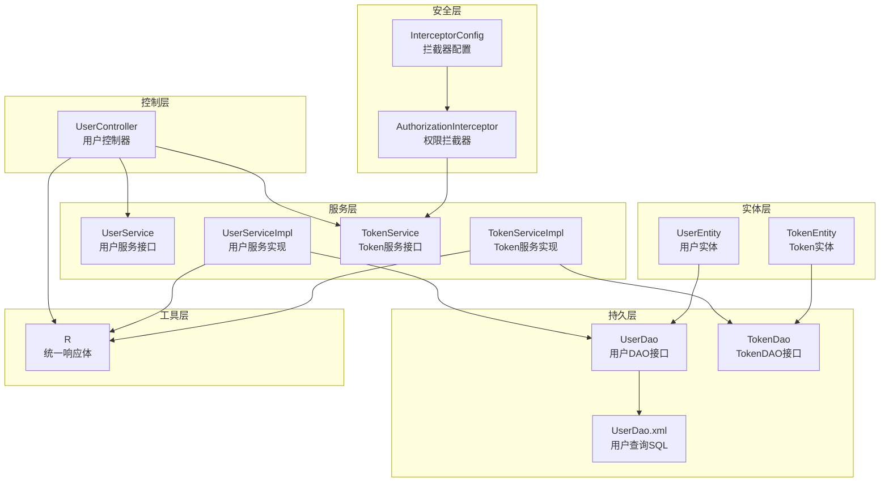
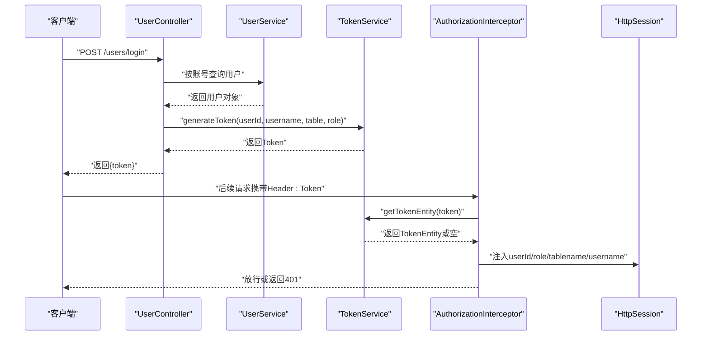
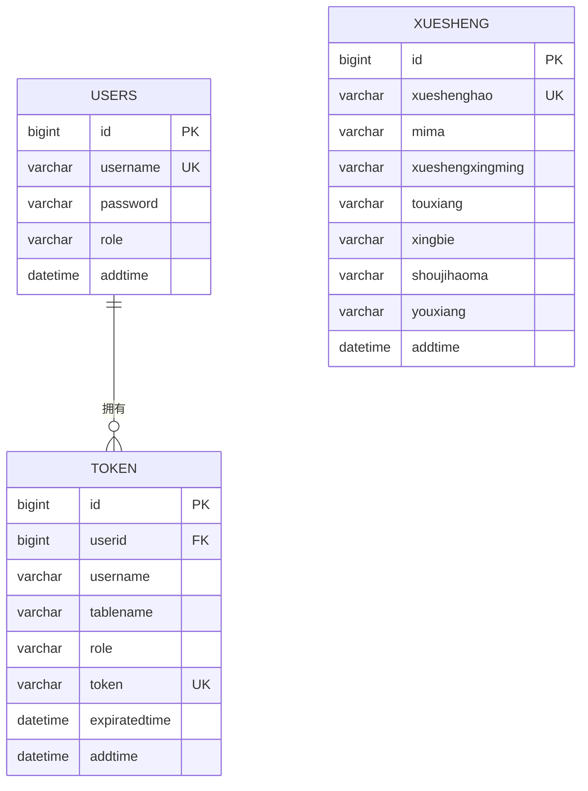
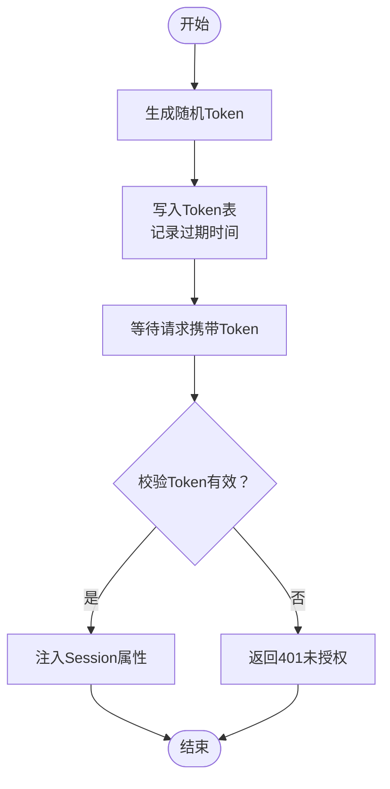
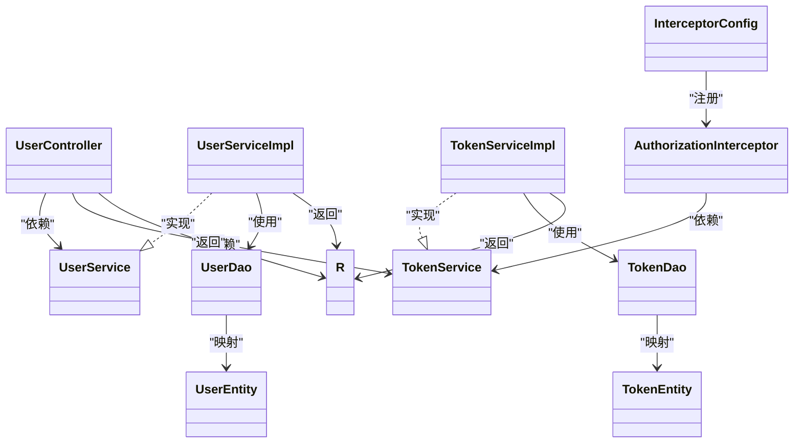

# 用户管理模块

<cite>
**本文引用的文件**
- [UserController.java](file://src/main/java/com/controller/UserController.java)
- [UserEntity.java](file://src/main/java/com/entity/UserEntity.java)
- [TokenEntity.java](file://src/main/java/com/entity/TokenEntity.java)
- [TokenService.java](file://src/main/java/com/service/TokenService.java)
- [TokenServiceImpl.java](file://src/main/java/com/service/impl/TokenServiceImpl.java)
- [AuthorizationInterceptor.java](file://src/main/java/com/interceptor/AuthorizationInterceptor.java)
- [InterceptorConfig.java](file://src/main/java/com/config/InterceptorConfig.java)
- [R.java](file://src/main/java/com/utils/R.java)
- [UserDao.java](file://src/main/java/com/dao/UserDao.java)
- [UserDao.xml](file://src/main/resources/mapper/UserDao.xml)
- [UserService.java](file://src/main/java/com/service/UserService.java)
- [UserServiceImpl.java](file://src/main/java/com/service/impl/UserServiceImpl.java)
- [XueshengEntity.java](file://src/main/java/com/entity/XueshengEntity.java)
- [IgnoreAuth.java](file://src/main/java/com/annotation/IgnoreAuth.java)
- [LoginUser.java](file://src/main/java/com/annotation/LoginUser.java)
</cite>

## 目录
1. [简介](#简介)
2. [项目结构](#项目结构)
3. [核心组件](#核心组件)
4. [架构总览](#架构总览)
5. [详细组件分析](#详细组件分析)
6. [依赖关系分析](#依赖关系分析)
7. [性能与安全考量](#性能与安全考量)
8. [故障排查指南](#故障排查指南)
9. [结论](#结论)
10. [附录](#附录)

## 简介
本文件系统性梳理用户管理模块的认证与权限控制能力，覆盖登录、注册、密码重置、会话保持、Token生成与校验、基于拦截器的权限验证、以及用户数据模型与接口设计。同时对角色体系（管理员、教师、学生）在当前代码中的落地方式给出说明，并提供面向开发与运维的排障建议。

## 项目结构
用户管理模块主要由以下层次构成：
- 控制层：对外暴露REST接口，负责参数接收、调用服务层、封装统一响应。
- 服务层：封装业务逻辑，如用户查询、分页、Token生成与校验。
- 持久层：MyBatis-Plus映射DAO与XML，完成数据库读写。
- 实体层：用户与Token等数据模型。
- 安全层：拦截器链路，统一进行Token校验与会话注入。
- 工具层：统一响应体、分页工具、校验工具等。

图表来源
- [UserController.java:38-175](file://src/main/java/com/controller/UserController.java#L38-L175)
- [UserService.java:18-25](file://src/main/java/com/service/UserService.java#L18-L25)
- [UserServiceImpl.java:24-49](file://src/main/java/com/service/impl/UserServiceImpl.java#L24-L49)
- [TokenService.java:16-26](file://src/main/java/com/service/TokenService.java#L16-L26)
- [TokenServiceImpl.java:28-79](file://src/main/java/com/service/impl/TokenServiceImpl.java#L28-L79)
- [UserDao.java:16-22](file://src/main/java/com/dao/UserDao.java#L16-L22)
- [UserDao.xml:4-12](file://src/main/resources/mapper/UserDao.xml#L4-L12)
- [UserEntity.java:13-77](file://src/main/java/com/entity/UserEntity.java#L13-L77)
- [TokenEntity.java:13-132](file://src/main/java/com/entity/TokenEntity.java#L13-L132)
- [AuthorizationInterceptor.java:28-95](file://src/main/java/com/interceptor/AuthorizationInterceptor.java#L28-L95)
- [InterceptorConfig.java:11-38](file://src/main/java/com/config/InterceptorConfig.java#L11-L38)
- [R.java:9-51](file://src/main/java/com/utils/R.java#L9-L51)

章节来源
- [UserController.java:38-175](file://src/main/java/com/controller/UserController.java#L38-L175)
- [InterceptorConfig.java:11-38](file://src/main/java/com/config/InterceptorConfig.java#L11-L38)

## 核心组件
- 用户控制器：提供登录、注册、退出、密码重置、分页列表、详情、保存、修改、删除等接口。
- 用户服务：封装分页查询、列表查询、基础CRUD。
- Token服务：生成Token、校验Token有效性、过期处理。
- 权限拦截器：从Header读取Token，校验后注入Session，未通过则统一返回401。
- 统一响应体：规范所有接口的返回结构，便于前端统一处理。

章节来源
- [UserController.java:38-175](file://src/main/java/com/controller/UserController.java#L38-L175)
- [UserService.java:18-25](file://src/main/java/com/service/UserService.java#L18-L25)
- [UserServiceImpl.java:24-49](file://src/main/java/com/service/impl/UserServiceImpl.java#L24-L49)
- [TokenService.java:16-26](file://src/main/java/com/service/TokenService.java#L16-L26)
- [TokenServiceImpl.java:28-79](file://src/main/java/com/service/impl/TokenServiceImpl.java#L28-L79)
- [AuthorizationInterceptor.java:28-95](file://src/main/java/com/interceptor/AuthorizationInterceptor.java#L28-L95)
- [R.java:9-51](file://src/main/java/com/utils/R.java#L9-L51)

## 架构总览
下图展示了用户登录到会话注入的关键流程，以及拦截器如何统一校验Token。

图表来源
- [UserController.java:51-60](file://src/main/java/com/controller/UserController.java#L51-L60)
- [TokenServiceImpl.java:54-78](file://src/main/java/com/service/impl/TokenServiceImpl.java#L54-L78)
- [AuthorizationInterceptor.java:68-79](file://src/main/java/com/interceptor/AuthorizationInterceptor.java#L68-L79)

## 详细组件分析

### 用户数据模型
- 用户实体（系统用户）
  - 字段：主键、用户名、密码、角色、创建时间
  - 约束：用户名唯一性由业务层保证；密码明文存储（见安全考量）
  - 业务规则：角色用于权限判定；创建时间用于审计
- Token实体
  - 字段：用户ID、用户名、表名、角色、Token值、过期时间、新增时间
  - 约束：同一用户+角色仅保留一个有效Token；过期时间用于校验
  - 业务规则：过期自动失效；重新登录会刷新Token
- 学生实体（扩展角色）
  - 字段：学号、密码、姓名、头像、性别、手机、邮箱等
  - 业务规则：可独立于系统用户存在，用于前台业务场景

图表来源
- [UserEntity.java:13-77](file://src/main/java/com/entity/UserEntity.java#L13-L77)
- [TokenEntity.java:13-132](file://src/main/java/com/entity/TokenEntity.java#L13-L132)
- [XueshengEntity.java:31-201](file://src/main/java/com/entity/XueshengEntity.java#L31-L201)

章节来源
- [UserEntity.java:13-77](file://src/main/java/com/entity/UserEntity.java#L13-L77)
- [TokenEntity.java:13-132](file://src/main/java/com/entity/TokenEntity.java#L13-L132)
- [XueshengEntity.java:31-201](file://src/main/java/com/entity/XueshengEntity.java#L31-L201)

### 接口与功能

#### 登录
- 请求路径：POST /users/login
- 请求参数：账号、密码、验证码（当前实现未校验验证码）
- 响应：成功返回Token；失败返回错误信息
- 业务流程：根据账号查询用户，比对密码，生成Token并返回

章节来源
- [UserController.java:51-60](file://src/main/java/com/controller/UserController.java#L51-L60)
- [TokenServiceImpl.java:54-69](file://src/main/java/com/service/impl/TokenServiceImpl.java#L54-L69)

#### 注册
- 请求路径：POST /users/register
- 请求参数：用户JSON（用户名、密码、角色等）
- 响应：成功/失败
- 业务流程：检查用户名是否已存在，不存在则插入新用户

章节来源
- [UserController.java:65-74](file://src/main/java/com/controller/UserController.java#L65-L74)

#### 退出
- 请求路径：GET /users/logout
- 请求参数：无
- 响应：成功提示
- 业务流程：使当前Session失效

章节来源
- [UserController.java:79-83](file://src/main/java/com/controller/UserController.java#L79-L83)

#### 密码重置
- 请求路径：GET /users/resetPass
- 请求参数：账号
- 响应：重置后的默认密码提示
- 业务流程：按账号查找用户，设置默认密码并更新

章节来源
- [UserController.java:88-98](file://src/main/java/com/controller/UserController.java#L88-L98)

#### 用户管理接口（CRUD）
- 分页列表：GET /users/page
- 全量列表：GET /users/list
- 详情：GET /users/info/{id}
- 保存：POST /users/save
- 修改：POST /users/update
- 删除：POST /users/delete
- 参数与返回：均通过统一响应体封装，分页结果包含数据集合

章节来源
- [UserController.java:103-173](file://src/main/java/com/controller/UserController.java#L103-L173)
- [UserService.java:18-25](file://src/main/java/com/service/UserService.java#L18-L25)
- [UserServiceImpl.java:24-49](file://src/main/java/com/service/impl/UserServiceImpl.java#L24-L49)
- [UserDao.java:16-22](file://src/main/java/com/dao/UserDao.java#L16-L22)
- [UserDao.xml:4-12](file://src/main/resources/mapper/UserDao.xml#L4-L12)
- [R.java:9-51](file://src/main/java/com/utils/R.java#L9-L51)

### 会话与权限控制

#### Token生成与校验
- 生成策略：为同一用户+角色生成随机32位字符串作为Token，有效期1小时；若已存在则更新Token与过期时间
- 校验策略：从Header读取Token，查询Token表，判断是否存在且未过期
- 过期处理：过期即视为无效

图表来源
- [TokenServiceImpl.java:54-78](file://src/main/java/com/service/impl/TokenServiceImpl.java#L54-L78)
- [AuthorizationInterceptor.java:68-79](file://src/main/java/com/interceptor/AuthorizationInterceptor.java#L68-L79)

章节来源
- [TokenServiceImpl.java:54-78](file://src/main/java/com/service/impl/TokenServiceImpl.java#L54-L78)
- [AuthorizationInterceptor.java:68-79](file://src/main/java/com/interceptor/AuthorizationInterceptor.java#L68-L79)

#### 拦截器与注解
- 拦截器：全局拦截除静态资源外的所有请求，从Header读取Token，校验后注入Session；标注忽略注解的方法跳过校验
- 注解：
  - @IgnoreAuth：标注在方法上，表示该接口无需Token校验
  - @LoginUser：参数级注解（当前未在控制器中使用），可用于提取登录用户信息

章节来源
- [AuthorizationInterceptor.java:28-95](file://src/main/java/com/interceptor/AuthorizationInterceptor.java#L28-L95)
- [InterceptorConfig.java:11-38](file://src/main/java/com/config/InterceptorConfig.java#L11-L38)
- [IgnoreAuth.java:1-14](file://src/main/java/com/annotation/IgnoreAuth.java#L1-L14)
- [LoginUser.java:1-16](file://src/main/java/com/annotation/LoginUser.java#L1-L16)

### 角色体系与权限控制
- 角色字段：用户实体包含role字段，Token实体同样记录role，拦截器校验时以role作为权限依据
- 当前实现要点：
  - 登录时将role注入Session，后续可通过Session获取
  - 未在拦截器中对不同角色进行细粒度权限判定，仅做Token有效性校验
  - 教师与学生角色在当前代码中未体现为独立的用户表或服务，但可通过role字段区分
- 建议：
  - 在拦截器中增加基于角色的权限判定
  - 对敏感接口增加更细粒度的权限注解与校验

章节来源
- [UserEntity.java:33-33](file://src/main/java/com/entity/UserEntity.java#L33-L33)
- [TokenEntity.java:38-38](file://src/main/java/com/entity/TokenEntity.java#L38-L38)
- [AuthorizationInterceptor.java:74-77](file://src/main/java/com/interceptor/AuthorizationInterceptor.java#L74-L77)

## 依赖关系分析

图表来源
- [UserController.java:42-46](file://src/main/java/com/controller/UserController.java#L42-L46)
- [UserService.java:18-25](file://src/main/java/com/service/UserService.java#L18-L25)
- [UserServiceImpl.java:24-49](file://src/main/java/com/service/impl/UserServiceImpl.java#L24-L49)
- [TokenService.java:16-26](file://src/main/java/com/service/TokenService.java#L16-L26)
- [TokenServiceImpl.java:28-79](file://src/main/java/com/service/impl/TokenServiceImpl.java#L28-L79)
- [UserDao.java:16-22](file://src/main/java/com/dao/UserDao.java#L16-L22)
- [UserEntity.java:13-77](file://src/main/java/com/entity/UserEntity.java#L13-L77)
- [TokenEntity.java:13-132](file://src/main/java/com/entity/TokenEntity.java#L13-L132)
- [AuthorizationInterceptor.java:28-95](file://src/main/java/com/interceptor/AuthorizationInterceptor.java#L28-L95)
- [InterceptorConfig.java:11-38](file://src/main/java/com/config/InterceptorConfig.java#L11-L38)
- [R.java:9-51](file://src/main/java/com/utils/R.java#L9-L51)

章节来源
- [UserServiceImpl.java:24-49](file://src/main/java/com/service/impl/UserServiceImpl.java#L24-L49)
- [TokenServiceImpl.java:28-79](file://src/main/java/com/service/impl/TokenServiceImpl.java#L28-L79)
- [AuthorizationInterceptor.java:28-95](file://src/main/java/com/interceptor/AuthorizationInterceptor.java#L28-L95)

## 性能与安全考量
- 性能
  - Token查询为单条记录按用户+角色过滤，索引建议：(userid, role)复合索引
  - 分页查询使用MyBatis-Plus Page对象，注意合理设置每页大小
- 安全
  - 密码明文存储，存在重大风险，建议改为加密存储（如BCrypt）
  - Token有效期1小时，建议结合刷新Token机制与IP绑定、设备指纹等增强防护
  - 拦截器未做跨域预检以外的严格校验，建议补充CSRF防护与请求签名
  - 未对验证码进行校验，建议在登录接口启用图形验证码

[本节为通用指导，不直接分析具体文件]

## 故障排查指南
- 登录失败
  - 检查账号是否存在、密码是否匹配
  - 查看Token生成是否成功、过期时间是否正确
- 401未授权
  - 确认请求Header中是否携带正确的Token键值
  - 检查Token是否过期或被删除
  - 确认拦截器是否正确注册与生效
- 统一响应体
  - 所有接口返回结构一致，错误码与消息在统一响应体中定义，便于前端统一处理

章节来源
- [UserController.java:51-60](file://src/main/java/com/controller/UserController.java#L51-L60)
- [AuthorizationInterceptor.java:68-93](file://src/main/java/com/interceptor/AuthorizationInterceptor.java#L68-L93)
- [R.java:9-51](file://src/main/java/com/utils/R.java#L9-L51)

## 结论
本模块实现了基本的用户认证与权限拦截能力，Token生成与校验流程清晰，拦截器统一接入。当前版本在角色权限细化、密码加密、验证码与跨域安全等方面仍有改进空间。建议尽快引入加密存储、细粒度权限控制与安全加固措施，以满足生产环境的安全与稳定性要求。

[本节为总结性内容，不直接分析具体文件]

## 附录

### 接口一览（摘要）
- 登录：POST /users/login
- 注册：POST /users/register
- 退出：GET /users/logout
- 密码重置：GET /users/resetPass
- 分页列表：GET /users/page
- 全量列表：GET /users/list
- 详情：GET /users/info/{id}
- 保存：POST /users/save
- 修改：POST /users/update
- 删除：POST /users/delete

章节来源
- [UserController.java:51-173](file://src/main/java/com/controller/UserController.java#L51-L173)