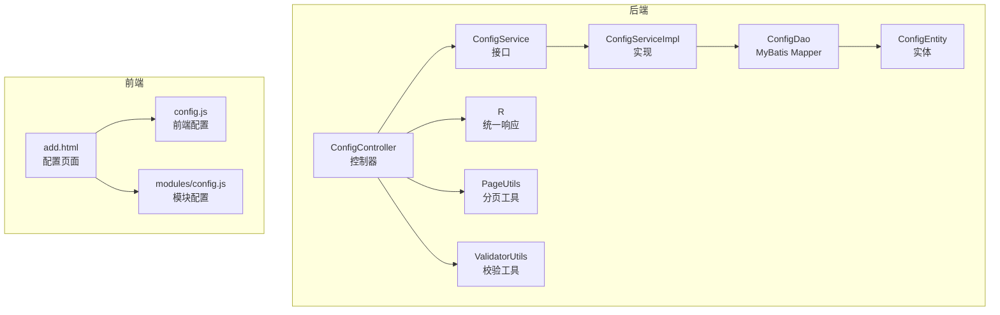
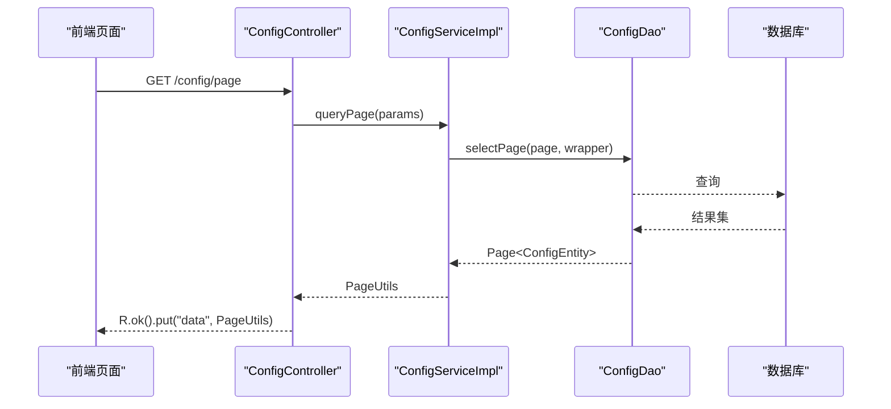
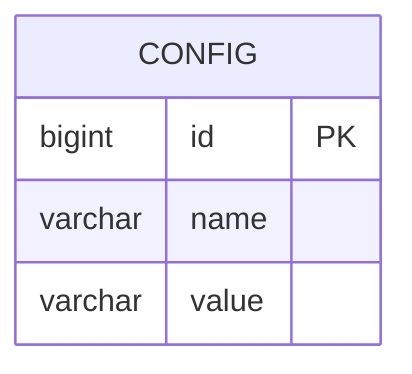
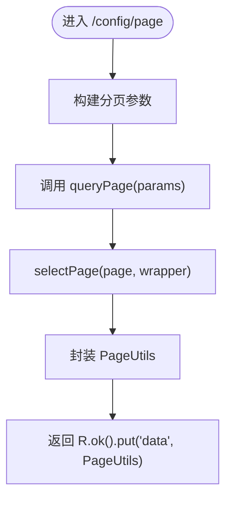
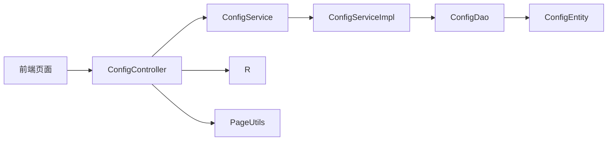

# 系统配置模块

<cite>
**本文引用的文件**
- [ConfigController.java](file://src/main/java/com/controller/ConfigController.java)
- [ConfigService.java](file://src/main/java/com/service/ConfigService.java)
- [ConfigServiceImpl.java](file://src/main/java/com/service/impl/ConfigServiceImpl.java)
- [ConfigDao.java](file://src/main/java/com/dao/ConfigDao.java)
- [ConfigEntity.java](file://src/main/java/com/entity/ConfigEntity.java)
- [ConfigDao.xml](file://src/main/resources/mapper/ConfigDao.xml)
- [R.java](file://src/main/java/com/utils/R.java)
- [PageUtils.java](file://src/main/java/com/utils/PageUtils.java)
- [ValidatorUtils.java](file://src/main/java/com/utils/ValidatorUtils.java)
- [config.js](file://src/main/resources/front/front/js/config.js)
- [modules/config.js](file://src/main/resources/front/front/modules/config.js)
- [add.html](file://src/main/resources/front/front/pages/config/add.html)
</cite>

## 目录
1. [引言](#引言)
2. [项目结构](#项目结构)
3. [核心组件](#核心组件)
4. [架构总览](#架构总览)
5. [详细组件分析](#详细组件分析)
6. [依赖分析](#依赖分析)
7. [性能考虑](#性能考虑)
8. [故障排查指南](#故障排查指南)
9. [结论](#结论)
10. [附录](#附录)

## 引言
本文件系统化梳理“系统配置模块”的设计与实现，覆盖配置项的分类管理、存储结构与访问模式、缓存与热更新策略、验证与默认值管理、API 接口定义、权限与作用域控制、变更日志与审计、备份与恢复、版本与兼容性策略，以及与业务模块的集成关系与依赖影响。目标是帮助开发者与运维人员快速理解与高效使用该配置体系。

## 项目结构
配置模块在后端采用经典的三层架构：控制器层负责对外接口；服务层封装业务逻辑；持久层对接数据库。前端通过静态配置文件与页面模板进行界面与导航等配置的展示与交互。

**图表来源**
- [ConfigController.java:27-111](file://src/main/java/com/controller/ConfigController.java#L27-L111)
- [ConfigService.java:14-16](file://src/main/java/com/service/ConfigService.java#L14-L16)
- [ConfigServiceImpl.java:24-32](file://src/main/java/com/service/impl/ConfigServiceImpl.java#L24-L32)
- [ConfigDao.java:10-12](file://src/main/java/com/dao/ConfigDao.java#L10-L12)
- [ConfigEntity.java:12-53](file://src/main/java/com/entity/ConfigEntity.java#L12-L53)
- [R.java:9-51](file://src/main/java/com/utils/R.java#L9-L51)
- [PageUtils.java:13-101](file://src/main/java/com/utils/PageUtils.java#L13-L101)
- [ValidatorUtils.java:16-39](file://src/main/java/com/utils/ValidatorUtils.java#L16-L39)
- [config.js:1-103](file://src/main/resources/front/front/js/config.js#L1-L103)
- [modules/config.js:1-14](file://src/main/resources/front/front/modules/config.js#L1-L14)
- [add.html:327-353](file://src/main/resources/front/front/pages/config/add.html#L327-L353)

**章节来源**
- [ConfigController.java:27-111](file://src/main/java/com/controller/ConfigController.java#L27-L111)
- [ConfigService.java:14-16](file://src/main/java/com/service/ConfigService.java#L14-L16)
- [ConfigServiceImpl.java:24-32](file://src/main/java/com/service/impl/ConfigServiceImpl.java#L24-L32)
- [ConfigDao.java:10-12](file://src/main/java/com/dao/ConfigDao.java#L10-L12)
- [ConfigEntity.java:12-53](file://src/main/java/com/entity/ConfigEntity.java#L12-L53)
- [R.java:9-51](file://src/main/java/com/utils/R.java#L9-L51)
- [PageUtils.java:13-101](file://src/main/java/com/utils/PageUtils.java#L13-L101)
- [ValidatorUtils.java:16-39](file://src/main/java/com/utils/ValidatorUtils.java#L16-L39)
- [config.js:1-103](file://src/main/resources/front/front/js/config.js#L1-L103)
- [modules/config.js:1-14](file://src/main/resources/front/front/modules/config.js#L1-L14)
- [add.html:327-353](file://src/main/resources/front/front/pages/config/add.html#L327-L353)

## 核心组件
- 控制器层
  - ConfigController：提供配置项的分页查询、列表查询、详情查询、按名称查询、保存、更新、删除等接口。
- 服务层
  - ConfigService：定义分页查询接口。
  - ConfigServiceImpl：基于 MyBatis-Plus 实现分页查询。
- 数据访问层
  - ConfigDao：继承 BaseMapper，提供基础 CRUD 能力。
- 实体层
  - ConfigEntity：映射数据库表 config，包含主键、name、value 字段。
- 工具层
  - R：统一响应包装。
  - PageUtils：分页结果封装。
  - ValidatorUtils：Hibernate 校验工具（注释中预留校验入口）。

**章节来源**
- [ConfigController.java:37-111](file://src/main/java/com/controller/ConfigController.java#L37-L111)
- [ConfigService.java:14-16](file://src/main/java/com/service/ConfigService.java#L14-L16)
- [ConfigServiceImpl.java:24-32](file://src/main/java/com/service/impl/ConfigServiceImpl.java#L24-L32)
- [ConfigDao.java:10-12](file://src/main/java/com/dao/ConfigDao.java#L10-L12)
- [ConfigEntity.java:12-53](file://src/main/java/com/entity/ConfigEntity.java#L12-L53)
- [R.java:9-51](file://src/main/java/com/utils/R.java#L9-L51)
- [PageUtils.java:13-101](file://src/main/java/com/utils/PageUtils.java#L13-L101)
- [ValidatorUtils.java:16-39](file://src/main/java/com/utils/ValidatorUtils.java#L16-L39)

## 架构总览
配置模块遵循“控制器-服务-数据访问-实体”的分层设计，结合 MyBatis-Plus 的分页查询能力，提供标准的 REST 风格接口。前端通过静态配置文件与页面模板实现界面与导航等配置的展示。

**图表来源**
- [ConfigController.java:37-42](file://src/main/java/com/controller/ConfigController.java#L37-L42)
- [ConfigServiceImpl.java:25-32](file://src/main/java/com/service/impl/ConfigServiceImpl.java#L25-L32)
- [ConfigDao.java:10-12](file://src/main/java/com/dao/ConfigDao.java#L10-L12)

## 详细组件分析

### 数据模型与存储结构
- 表结构与字段
  - 表名：config
  - 主键：id（自增）
  - 名称：name（键）
  - 值：value（值）
- 实体映射
  - ConfigEntity 映射上述字段，提供 getter/setter。
- 存储访问
  - ConfigDao 继承 BaseMapper，具备通用 CRUD 能力。
  - MyBatis Mapper XML 文件存在但未声明具体 SQL，实际执行依赖 MyBatis-Plus 的通用 SQL。

**图表来源**
- [ConfigEntity.java:12-53](file://src/main/java/com/entity/ConfigEntity.java#L12-L53)
- [ConfigDao.xml:4-4](file://src/main/resources/mapper/ConfigDao.xml#L4-L4)

**章节来源**
- [ConfigEntity.java:12-53](file://src/main/java/com/entity/ConfigEntity.java#L12-L53)
- [ConfigDao.java:10-12](file://src/main/java/com/dao/ConfigDao.java#L10-L12)
- [ConfigDao.xml:4-4](file://src/main/resources/mapper/ConfigDao.xml#L4-L4)

### 访问模式与分页
- 分页查询
  - 控制器接收分页参数，调用服务层分页查询。
  - 服务层基于 Query 构造 Page 并传入 selectPage。
  - PageUtils 将 MyBatis-Plus 的 Page 结果封装为统一分页对象。
- 列表与详情
  - 提供 /list 与 /page 两种列表接口，后者返回分页数据。
  - 提供 /info/{id} 与 /detail/{id} 详情接口，前者受鉴权注解保护。

**图表来源**
- [ConfigController.java:37-42](file://src/main/java/com/controller/ConfigController.java#L37-L42)
- [ConfigServiceImpl.java:25-32](file://src/main/java/com/service/impl/ConfigServiceImpl.java#L25-L32)
- [PageUtils.java:44-50](file://src/main/java/com/utils/PageUtils.java#L44-L50)

**章节来源**
- [ConfigController.java:37-72](file://src/main/java/com/controller/ConfigController.java#L37-L72)
- [ConfigServiceImpl.java:25-32](file://src/main/java/com/service/impl/ConfigServiceImpl.java#L25-L32)
- [PageUtils.java:13-101](file://src/main/java/com/utils/PageUtils.java#L13-L101)

### 缓存策略与热更新
- 现状
  - 后端未实现配置缓存与热更新机制。
  - 前端存在静态配置文件（如 config.js），用于界面与导航等前端侧配置。
- 建议
  - 后端可引入本地缓存（如 Caffeine 或 Guava Cache）或分布式缓存（Redis）存放常用配置键值。
  - 配置更新时触发缓存失效或主动推送，确保读取到最新值。
  - 对热点配置（如轮播图、菜单、开关项）优先缓存，设定 TTL 与一致性策略。

[本节为通用建议，不直接分析具体文件，故无“章节来源”]

### 验证规则与默认值管理
- 参数校验
  - 控制器中保存与更新接口预留了 ValidatorUtils.validateEntity 调用（注释），可扩展对 ConfigEntity 的字段校验。
- 默认值
  - 代码未体现默认值注入逻辑，可在服务层或工具层增加默认值填充策略，保证缺失配置项的可用性。

**章节来源**
- [ConfigController.java:87-100](file://src/main/java/com/controller/ConfigController.java#L87-L100)
- [ValidatorUtils.java:16-39](file://src/main/java/com/utils/ValidatorUtils.java#L16-L39)

### 权限控制与作用域管理
- 接口鉴权
  - 列表与详情接口使用 @IgnoreAuth 注解，允许匿名访问；其他接口未标注，遵循全局拦截器策略。
- 前端权限
  - 前端配置文件提供 isAuth 与 isFrontAuth 方法，依据本地存储的角色与菜单按钮集合判断权限。
- 建议
  - 对敏感配置（如业务规则、系统参数）应启用鉴权与角色限制。
  - 前端权限与后端鉴权需保持一致，避免越权访问。

**章节来源**
- [ConfigController.java:47-53](file://src/main/java/com/controller/ConfigController.java#L47-L53)
- [config.js:68-102](file://src/main/resources/front/front/js/config.js#L68-L102)

### 变更日志与审计
- 现状
  - 代码未实现配置变更的审计日志与变更记录表。
- 建议
  - 新增配置审计表，记录操作人、时间、配置键、旧值、新值、IP、UA 等。
  - 在更新与删除操作前后钩入审计逻辑，确保可追溯。

[本节为通用建议，不直接分析具体文件，故无“章节来源”]

### 备份与恢复机制
- 现状
  - 未见专门的配置备份与恢复接口或脚本。
- 建议
  - 提供导出接口，将 config 表数据以 JSON/CSV 导出。
  - 提供导入接口，支持批量写入与幂等更新，避免重复键冲突。
  - 支持事务批量导入，失败回滚。

[本节为通用建议，不直接分析具体文件，故无“章节来源”]

### 版本管理与兼容性
- 现状
  - 未见版本号字段或兼容性策略。
- 建议
  - 为配置项增加 version 字段与生效范围（如环境、版本区间）。
  - 新老配置并存期提供兼容映射与迁移脚本，逐步替换旧键。

[本节为通用建议，不直接分析具体文件，故无“章节来源”]

### 与其他业务模块的集成关系
- 前端导航与菜单
  - 前端配置文件（config.js）定义菜单、角色权限、跳转路径等，直接影响页面展示与交互。
- 页面模板
  - 配置页面（add.html）通过 HTTP 请求调用后端 /config 接口完成新增与提交。
- 模块依赖
  - 配置模块与用户模块、公告模块、座位预订模块等共享菜单与权限配置，需保持一致的权限定义。

**章节来源**
- [config.js:38-102](file://src/main/resources/front/front/js/config.js#L38-L102)
- [add.html:327-353](file://src/main/resources/front/front/pages/config/add.html#L327-L353)

## 依赖分析
- 组件耦合
  - 控制器依赖服务接口；服务实现依赖数据访问接口；数据访问依赖实体。
- 外部依赖
  - MyBatis-Plus 提供分页与通用 CRUD。
  - 前端通过静态配置与页面模板进行展示，与后端接口解耦。

**图表来源**
- [ConfigController.java:31-32](file://src/main/java/com/controller/ConfigController.java#L31-L32)
- [ConfigService.java:14-16](file://src/main/java/com/service/ConfigService.java#L14-L16)
- [ConfigServiceImpl.java:24-32](file://src/main/java/com/service/impl/ConfigServiceImpl.java#L24-L32)
- [ConfigDao.java:10-12](file://src/main/java/com/dao/ConfigDao.java#L10-L12)
- [ConfigEntity.java:12-53](file://src/main/java/com/entity/ConfigEntity.java#L12-L53)
- [R.java:9-51](file://src/main/java/com/utils/R.java#L9-L51)
- [PageUtils.java:13-101](file://src/main/java/com/utils/PageUtils.java#L13-L101)

**章节来源**
- [ConfigController.java:31-32](file://src/main/java/com/controller/ConfigController.java#L31-L32)
- [ConfigService.java:14-16](file://src/main/java/com/service/ConfigService.java#L14-L16)
- [ConfigServiceImpl.java:24-32](file://src/main/java/com/service/impl/ConfigServiceImpl.java#L24-L32)
- [ConfigDao.java:10-12](file://src/main/java/com/dao/ConfigDao.java#L10-L12)
- [ConfigEntity.java:12-53](file://src/main/java/com/entity/ConfigEntity.java#L12-L53)
- [R.java:9-51](file://src/main/java/com/utils/R.java#L9-L51)
- [PageUtils.java:13-101](file://src/main/java/com/utils/PageUtils.java#L13-L101)

## 性能考虑
- 分页查询
  - 使用 PageUtils 与 MyBatis-Plus 分页，避免一次性加载全量配置。
- 缓存优化
  - 对高频读取的配置项引入缓存，降低数据库压力。
- 接口幂等
  - 更新与保存接口应具备幂等性，避免重复写入造成抖动。

[本节为通用建议，不直接分析具体文件，故无“章节来源”]

## 故障排查指南
- 常见问题
  - 分页参数无效：检查前端传递的分页参数是否符合后端期望。
  - 保存/更新失败：确认实体字段校验是否开启，必要时启用 ValidatorUtils.validateEntity。
  - 权限不足：核对 @IgnoreAuth 注解与全局拦截器策略，确保敏感接口已鉴权。
- 定位手段
  - 查看控制器返回的统一响应结构（R），定位错误码与消息。
  - 检查服务层分页封装（PageUtils）是否正确转换 MyBatis-Plus 的 Page 结果。

**章节来源**
- [R.java:9-51](file://src/main/java/com/utils/R.java#L9-L51)
- [PageUtils.java:13-101](file://src/main/java/com/utils/PageUtils.java#L13-L101)
- [ConfigController.java:87-100](file://src/main/java/com/controller/ConfigController.java#L87-L100)

## 结论
配置模块以简洁的分层架构实现了配置项的增删改查与分页展示，满足基础管理需求。建议后续完善缓存与热更新、权限控制、审计日志、备份恢复、版本与兼容性策略，并在前端与后端保持权限定义一致，以提升系统的安全性与可维护性。

## 附录

### API 接口定义
- 查询配置列表（分页）
  - 方法：GET
  - 路径：/config/page
  - 参数：分页参数（由 PageUtils 解析）
  - 返回：统一响应，包含分页数据
- 查询配置列表（匿名）
  - 方法：GET
  - 路径：/config/list
  - 返回：统一响应，包含分页数据
- 获取配置详情（按 ID）
  - 方法：GET
  - 路径：/config/info/{id}
  - 返回：统一响应，包含配置实体
- 获取配置详情（匿名）
  - 方法：GET
  - 路径：/config/detail/{id}
  - 返回：统一响应，包含配置实体
- 根据名称查询配置
  - 方法：GET
  - 路径：/config/info
  - 参数：name（查询条件）
  - 返回：统一响应，包含配置实体
- 保存配置
  - 方法：POST
  - 路径：/config/save
  - 请求体：ConfigEntity
  - 返回：统一响应
- 更新配置
  - 方法：POST
  - 路径：/config/update
  - 请求体：ConfigEntity
  - 返回：统一响应
- 删除配置
  - 方法：POST
  - 路径：/config/delete
  - 请求体：id 数组
  - 返回：统一响应

**章节来源**
- [ConfigController.java:37-111](file://src/main/java/com/controller/ConfigController.java#L37-L111)