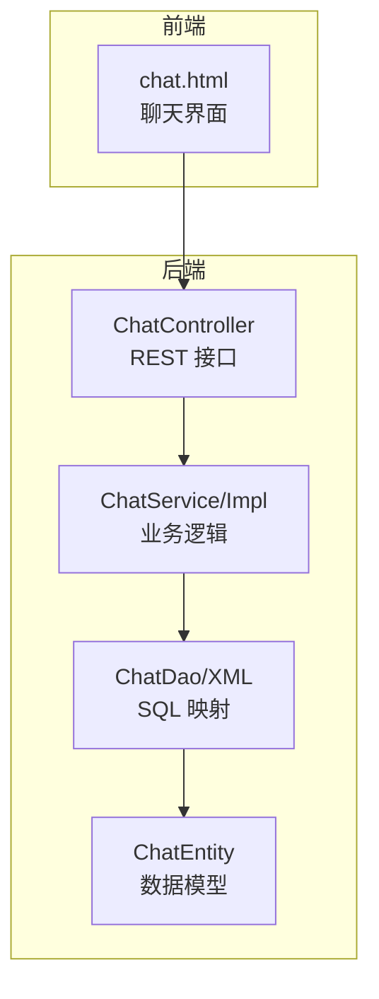
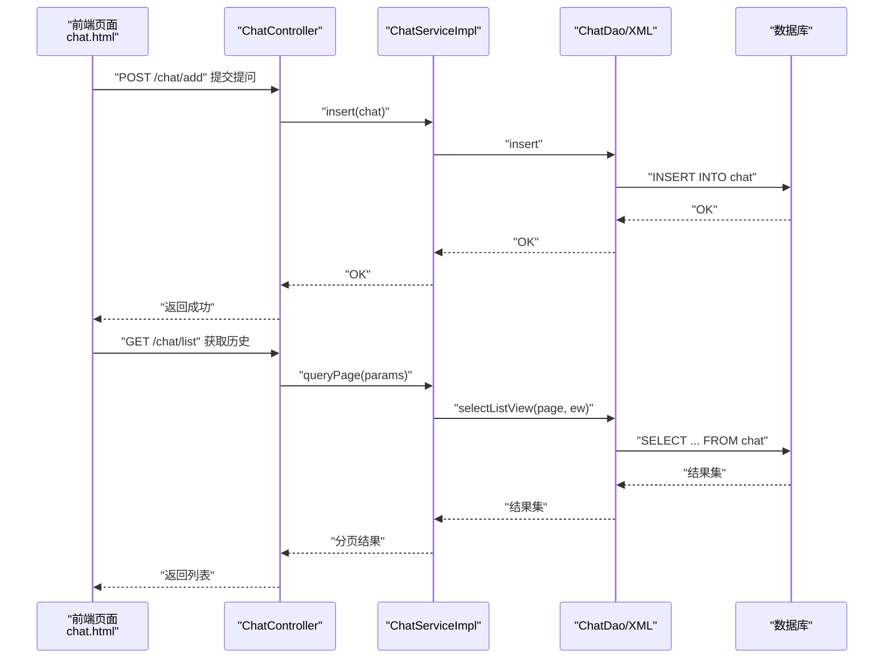
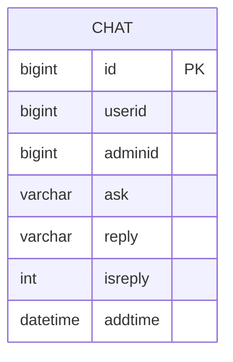
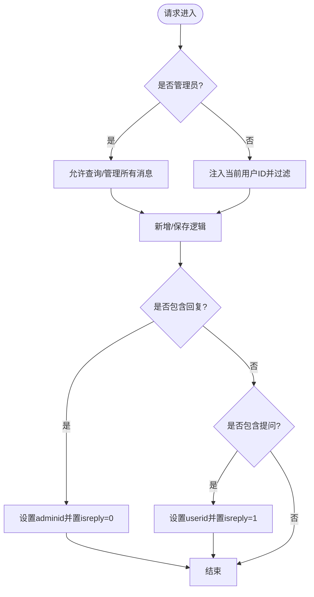
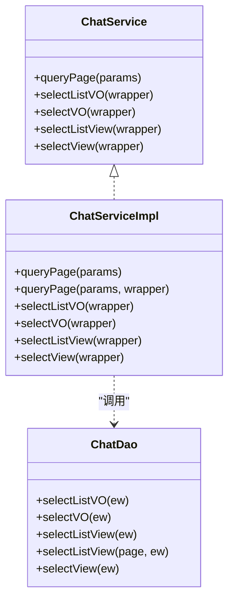
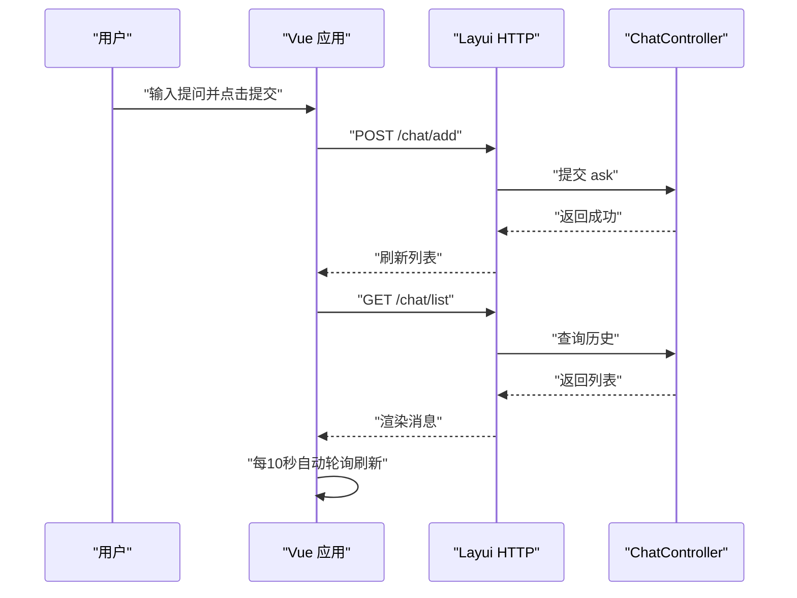
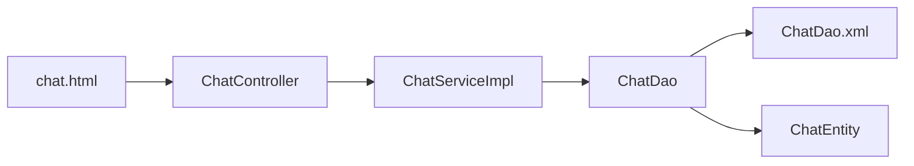

# 聊天交流模块

<cite>
**本文引用的文件**
- [ChatController.java](file://src/main/java/com/controller/ChatController.java)
- [ChatService.java](file://src/main/java/com/service/ChatService.java)
- [ChatServiceImpl.java](file://src/main/java/com/service/impl/ChatServiceImpl.java)
- [ChatDao.java](file://src/main/java/com/dao/ChatDao.java)
- [ChatDao.xml](file://src/main/resources/mapper/ChatDao.xml)
- [ChatEntity.java](file://src/main/java/com/entity/ChatEntity.java)
- [chat.html](file://src/main/resources/front/front/pages/chat/chat.html)
</cite>

## 目录
1. [简介](#简介)
2. [项目结构](#项目结构)
3. [核心组件](#核心组件)
4. [架构总览](#架构总览)
5. [详细组件分析](#详细组件分析)
6. [依赖分析](#依赖分析)
7. [性能考虑](#性能考虑)
8. [故障排查指南](#故障排查指南)
9. [结论](#结论)
10. [附录](#附录)

## 简介
本文件为“聊天交流模块”的综合技术文档，围绕系统内即时通讯与交流功能展开，重点覆盖以下方面：
- 消息存储与检索机制：消息历史记录与会话管理
- 权限控制与参与人员管理：管理员与普通用户的职责边界
- 数据模型设计：消息内容、发送时间、参与者标识等字段定义
- API 接口文档：消息发送、历史查询、分页列表等
- 前端实现与用户交互：聊天界面、轮询刷新与提交流程
- 实时性保障与推送机制：当前采用轮询策略
- 统计分析能力：用户活跃度与消息频率统计（建议扩展）
- 内容安全与敏感词过滤：当前未实现，建议扩展
- 与用户系统的集成关系与数据关联

## 项目结构
聊天模块遵循典型的前后端分离与三层架构组织方式：
- 控制层：负责接收请求、鉴权与参数处理
- 服务层：封装业务逻辑与分页查询
- 数据访问层：MyBatis 映射 XML 定义 SQL 与结果映射
- 实体层：数据库表 chat 的 Java 映射对象
- 前端页面：基于 Element UI 与 Layui 的聊天界面，通过 HTTP 请求与后端交互

图表来源
- [ChatController.java:46-230](file://src/main/java/com/controller/ChatController.java#L46-L230)
- [ChatServiceImpl.java:21-62](file://src/main/java/com/service/impl/ChatServiceImpl.java#L21-L62)
- [ChatDao.java:21-33](file://src/main/java/com/dao/ChatDao.java#L21-L33)
- [ChatDao.xml:4-38](file://src/main/resources/mapper/ChatDao.xml#L4-L38)
- [ChatEntity.java:31-164](file://src/main/java/com/entity/ChatEntity.java#L31-L164)
- [chat.html:82-139](file://src/main/resources/front/front/pages/chat/chat.html#L82-L139)

章节来源
- [ChatController.java:46-230](file://src/main/java/com/controller/ChatController.java#L46-L230)
- [ChatServiceImpl.java:21-62](file://src/main/java/com/service/impl/ChatServiceImpl.java#L21-L62)
- [ChatDao.java:21-33](file://src/main/java/com/dao/ChatDao.java#L21-L33)
- [ChatDao.xml:4-38](file://src/main/resources/mapper/ChatDao.xml#L4-L38)
- [ChatEntity.java:31-164](file://src/main/java/com/entity/ChatEntity.java#L31-L164)
- [chat.html:82-139](file://src/main/resources/front/front/pages/chat/chat.html#L82-L139)

## 核心组件
- 控制器：提供分页列表、列表查询、详情、新增、更新、删除、提醒等接口；对管理员与普通用户进行角色区分，限制非管理员仅能查看或操作自身消息
- 服务层：封装分页查询、视图查询、列表查询等；基于 MyBatis-Plus 分页工具
- 数据访问层：定义 VO/View 查询方法，并在 XML 中实现 SQL 与结果映射
- 实体层：定义 chat 表字段，包含用户标识、管理员标识、提问与回复、是否回复标记、添加时间等
- 前端页面：聊天界面以左右布局显示提问与回复，支持输入框提交提问，定时轮询刷新消息列表

章节来源
- [ChatController.java:57-230](file://src/main/java/com/controller/ChatController.java#L57-L230)
- [ChatService.java:21-35](file://src/main/java/com/service/ChatService.java#L21-L35)
- [ChatServiceImpl.java:25-60](file://src/main/java/com/service/impl/ChatServiceImpl.java#L25-L60)
- [ChatDao.java:23-31](file://src/main/java/com/dao/ChatDao.java#L23-L31)
- [ChatDao.xml:15-37](file://src/main/resources/mapper/ChatDao.xml#L15-L37)
- [ChatEntity.java:52-87](file://src/main/java/com/entity/ChatEntity.java#L52-L87)
- [chat.html:52-129](file://src/main/resources/front/front/pages/chat/chat.html#L52-L129)

## 架构总览
聊天模块采用经典的 MVC 分层与 MyBatis-Plus ORM 模式，前端通过 HTTP 与后端交互，后端通过服务层协调 DAO 层完成数据持久化。

图表来源
- [ChatController.java:147-163](file://src/main/java/com/controller/ChatController.java#L147-L163)
- [ChatServiceImpl.java:34-40](file://src/main/java/com/service/impl/ChatServiceImpl.java#L34-L40)
- [ChatDao.xml:27-32](file://src/main/resources/mapper/ChatDao.xml#L27-L32)
- [chat.html:104-129](file://src/main/resources/front/front/pages/chat/chat.html#L104-L129)

## 详细组件分析

### 数据模型设计
- 表名：chat
- 关键字段
  - id：主键
  - userid：提问用户标识
  - adminid：管理员标识（用于回复场景）
  - ask：提问内容
  - reply：回复内容
  - isreply：是否已回复（0/1）
  - addtime：添加时间（自动填充）
- 字段约束与类型：基于实体类定义，包含基本类型与日期格式化注解

图表来源
- [ChatEntity.java:52-87](file://src/main/java/com/entity/ChatEntity.java#L52-L87)
- [ChatDao.xml:7-13](file://src/main/resources/mapper/ChatDao.xml#L7-L13)

章节来源
- [ChatEntity.java:52-87](file://src/main/java/com/entity/ChatEntity.java#L52-L87)
- [ChatDao.xml:7-13](file://src/main/resources/mapper/ChatDao.xml#L7-L13)

### 控制器与权限控制
- 角色区分
  - 管理员：可查看所有消息，支持分页列表与详情
  - 普通用户：仅能查看/操作自身消息，控制器中通过 session 注入 userid 进行过滤
- 关键接口
  - 列表与分页：/chat/page、/chat/list、/chat/lists
  - 查询与详情：/chat/query、/chat/info/{id}、/chat/detail/{id}
  - 新增与保存：/chat/add、/chat/save
  - 更新与删除：/chat/update、/chat/delete
  - 提醒接口：/chat/remind/{columnName}/{type}

图表来源
- [ChatController.java:57-163](file://src/main/java/com/controller/ChatController.java#L57-L163)

章节来源
- [ChatController.java:57-163](file://src/main/java/com/controller/ChatController.java#L57-L163)

### 服务层与数据访问层
- 服务层
  - 提供分页查询、列表视图查询、单条视图查询等方法
  - 使用 MyBatis-Plus 的分页工具 PageUtils
- 数据访问层
  - 定义 VO/View 查询方法
  - XML 中实现 SQL 片段拼接与 where 条件构造

图表来源
- [ChatService.java:21-35](file://src/main/java/com/service/ChatService.java#L21-L35)
- [ChatServiceImpl.java:22-62](file://src/main/java/com/service/impl/ChatServiceImpl.java#L22-L62)
- [ChatDao.java:21-33](file://src/main/java/com/dao/ChatDao.java#L21-L33)

章节来源
- [ChatService.java:21-35](file://src/main/java/com/service/ChatService.java#L21-L35)
- [ChatServiceImpl.java:25-60](file://src/main/java/com/service/impl/ChatServiceImpl.java#L25-L60)
- [ChatDao.java:23-31](file://src/main/java/com/dao/ChatDao.java#L23-L31)

### 前端实现与用户交互
- 页面布局
  - 上半区：消息列表，左对齐显示提问，右对齐显示回复
  - 下半区：输入框与提交按钮
- 交互流程
  - 初始化：定时轮询（每 10 秒）拉取最新消息
  - 提交：校验输入非空，向后端发送提问并清空输入框
  - 列表：按添加时间升序排列，确保新消息在下方

图表来源
- [chat.html:95-129](file://src/main/resources/front/front/pages/chat/chat.html#L95-L129)
- [ChatController.java:147-163](file://src/main/java/com/controller/ChatController.java#L147-L163)

章节来源
- [chat.html:52-129](file://src/main/resources/front/front/pages/chat/chat.html#L52-L129)

### API 接口文档
- 列表与分页
  - GET /chat/page：后端分页列表（管理员可查看全部）
  - GET /chat/list：前端列表（非管理员仅限自身）
  - GET /chat/lists：通用列表查询
- 查询与详情
  - GET /chat/query：按条件查询
  - GET /chat/info/{id}：后端详情
  - GET /chat/detail/{id}：前端详情
- 新增与保存
  - POST /chat/add：前端新增提问
  - POST /chat/save：后端保存（含回复场景）
- 更新与删除
  - POST /chat/update：更新消息
  - POST /chat/delete：批量删除
- 提醒接口
  - GET /chat/remind/{columnName}/{type}：按时间段提醒统计

章节来源
- [ChatController.java:57-226](file://src/main/java/com/controller/ChatController.java#L57-L226)

### 实时性与推送机制
- 当前实现：前端定时轮询（每 10 秒），后端返回最新消息列表
- 优点：实现简单，兼容性强
- 缺点：存在延迟与服务器压力
- 建议改进：引入 WebSocket 或 SSE，实现服务端主动推送

章节来源
- [chat.html:99-102](file://src/main/resources/front/front/pages/chat/chat.html#L99-L102)

### 统计分析与安全审核
- 统计分析：当前未提供用户活跃度与消息频率统计接口
- 敏感词过滤：当前未实现内容安全与敏感词过滤
- 建议扩展：
  - 新增统计接口：按日/周/月统计消息数量与用户发言频次
  - 引入敏感词库与内容审核流程，在新增/保存接口前进行过滤与标记

章节来源
- [ChatController.java:188-226](file://src/main/java/com/controller/ChatController.java#L188-L226)

### 与用户系统的集成
- 用户标识：通过 session 注入当前用户 ID，确保提问与回复归属正确
- 角色判断：管理员与普通用户在控制器中进行角色判定，限制数据范围
- 数据关联：chat 表通过 userid/adminid 与用户系统关联

章节来源
- [ChatController.java:60-62](file://src/main/java/com/controller/ChatController.java#L60-L62)
- [ChatController.java:149-156](file://src/main/java/com/controller/ChatController.java#L149-L156)

## 依赖分析
- 控制器依赖服务层；服务层依赖数据访问层；数据访问层依赖实体类与 XML 映射
- 前端依赖后端提供的 REST 接口，通过 HTTP 与后端通信

图表来源
- [ChatController.java:49-50](file://src/main/java/com/controller/ChatController.java#L49-L50)
- [ChatServiceImpl.java:15-19](file://src/main/java/com/service/impl/ChatServiceImpl.java#L15-L19)
- [ChatDao.java:21-33](file://src/main/java/com/dao/ChatDao.java#L21-L33)
- [ChatDao.xml:4-38](file://src/main/resources/mapper/ChatDao.xml#L4-L38)
- [ChatEntity.java:31-164](file://src/main/java/com/entity/ChatEntity.java#L31-L164)
- [chat.html:104-111](file://src/main/resources/front/front/pages/chat/chat.html#L104-L111)

章节来源
- [ChatController.java:49-50](file://src/main/java/com/controller/ChatController.java#L49-L50)
- [ChatServiceImpl.java:15-19](file://src/main/java/com/service/impl/ChatServiceImpl.java#L15-L19)
- [ChatDao.java:21-33](file://src/main/java/com/dao/ChatDao.java#L21-L33)
- [ChatDao.xml:4-38](file://src/main/resources/mapper/ChatDao.xml#L4-L38)
- [ChatEntity.java:31-164](file://src/main/java/com/entity/ChatEntity.java#L31-L164)
- [chat.html:104-111](file://src/main/resources/front/front/pages/chat/chat.html#L104-L111)

## 性能考虑
- 轮询频率：当前每 10 秒一次，建议根据业务量调整间隔或改为长轮询/SSE
- 分页查询：服务层使用分页工具，建议合理设置每页大小与排序字段
- SQL 优化：XML 中的 where 条件由工具拼接，需避免全表扫描，必要时增加索引
- 并发写入：新增接口未做幂等处理，建议在业务层增加去重与限流策略

## 故障排查指南
- 提交失败
  - 检查前端输入校验与请求参数
  - 查看后端日志与异常栈
- 列表为空
  - 确认用户身份与过滤条件
  - 检查数据库是否存在对应记录
- 轮询不刷新
  - 检查定时器是否正常运行
  - 确认网络与跨域配置

章节来源
- [chat.html:114-129](file://src/main/resources/front/front/pages/chat/chat.html#L114-L129)
- [ChatController.java:147-163](file://src/main/java/com/controller/ChatController.java#L147-L163)

## 结论
聊天模块实现了基础的消息发送、历史查询与权限控制，前端采用轮询策略保证消息可见性。建议后续增强实时推送、统计分析与内容安全能力，以提升用户体验与系统安全性。

## 附录
- 开发建议
  - 引入 WebSocket/SSE 实现实时推送
  - 增加敏感词过滤与内容审核
  - 扩展统计接口与可视化报表
  - 优化分页与查询性能，增加必要的索引