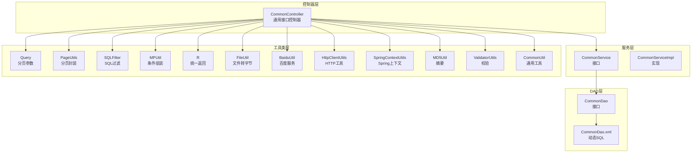
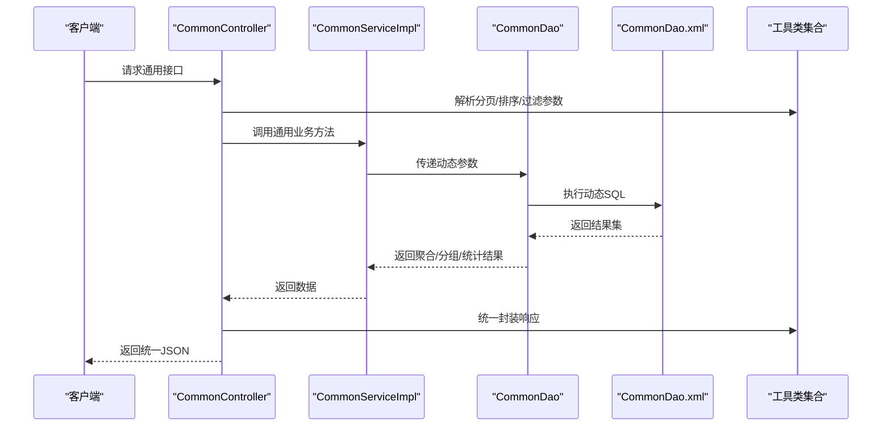
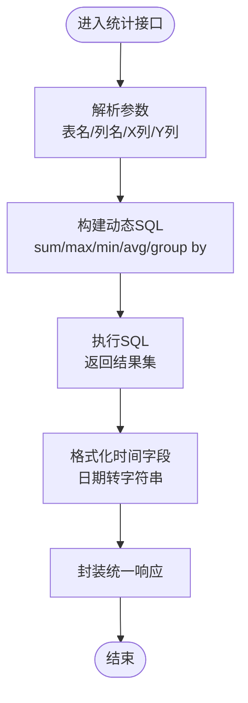
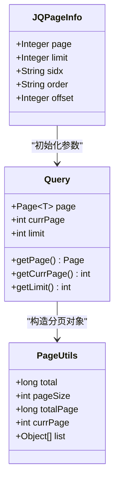
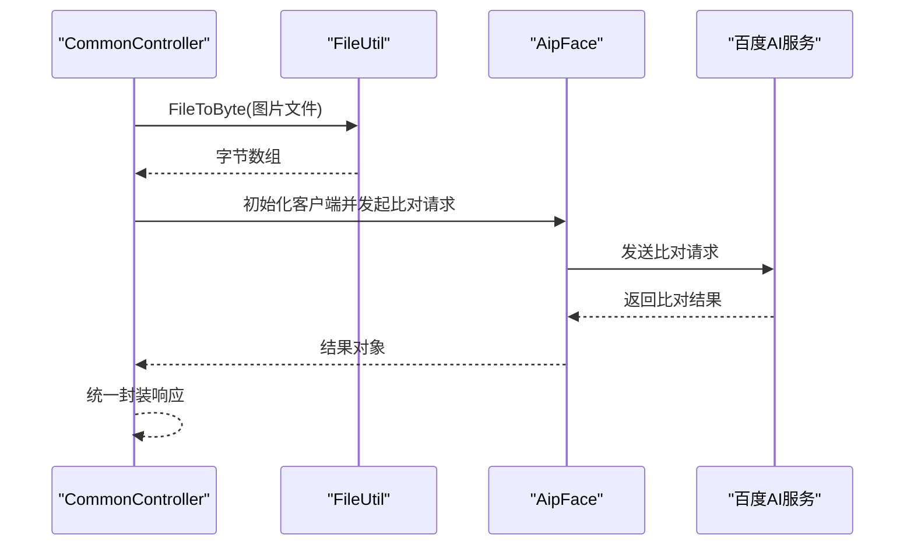
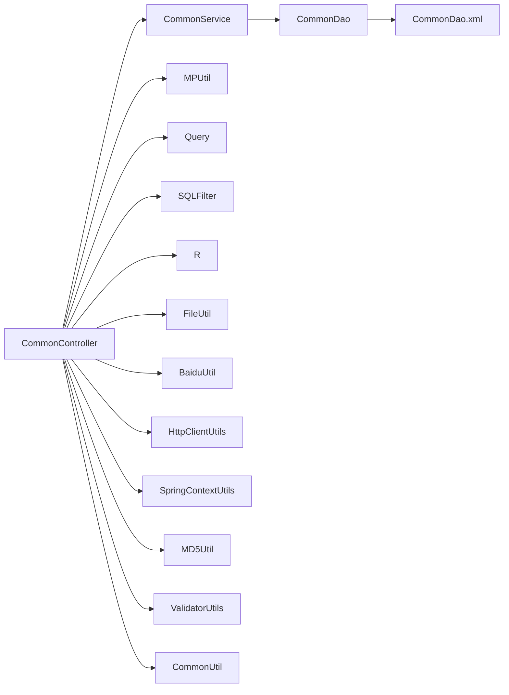

# 通用工具模块

<cite>
**本文引用的文件**
- [CommonController.java](file://src/main/java/com/controller/CommonController.java)
- [CommonService.java](file://src/main/java/com/service/CommonService.java)
- [CommonServiceImpl.java](file://src/main/java/com/service/impl/CommonServiceImpl.java)
- [CommonDao.java](file://src/main/java/com/dao/CommonDao.java)
- [CommonDao.xml](file://src/main/resources/mapper/CommonDao.xml)
- [MPUtil.java](file://src/main/java/com/utils/MPUtil.java)
- [Query.java](file://src/main/java/com/utils/Query.java)
- [PageUtils.java](file://src/main/java/com/utils/PageUtils.java)
- [JQPageInfo.java](file://src/main/java/com/utils/JQPageInfo.java)
- [R.java](file://src/main/java/com/utils/R.java)
- [SQLFilter.java](file://src/main/java/com/utils/SQLFilter.java)
- [FileUtil.java](file://src/main/java/com/utils/FileUtil.java)
- [BaiduUtil.java](file://src/main/java/com/utils/BaiduUtil.java)
- [HttpClientUtils.java](file://src/main/java/com/utils/HttpClientUtils.java)
- [SpringContextUtils.java](file://src/main/java/com/utils/SpringContextUtils.java)
- [MD5Util.java](file://src/main/java/com/utils/MD5Util.java)
- [ValidatorUtils.java](file://src/main/java/com/utils/ValidatorUtils.java)
- [CommonUtil.java](file://src/main/java/com/utils/CommonUtil.java)
</cite>

## 目录
1. [简介](#简介)
2. [项目结构](#项目结构)
3. [核心组件](#核心组件)
4. [架构总览](#架构总览)
5. [详细组件分析](#详细组件分析)
6. [依赖分析](#依赖分析)
7. [性能考虑](#性能考虑)
8. [故障排查指南](#故障排查指南)
9. [结论](#结论)
10. [附录](#附录)

## 简介
本文件系统性梳理“通用工具模块”的设计与实现，覆盖以下方面：
- 通用数据查询与统计分析：跨表联动、条件筛选、分页、排序、聚合统计、分组统计、按值统计等
- 文件上传与下载：文件读取、字节转换、静态资源访问
- 图片处理与缩略图生成：基于百度AI的人脸识别与比对流程
- 通用API接口：选项联动、状态审核、提醒计数、单列统计、分组统计、按值统计
- 工具类与最佳实践：分页参数、返回封装、SQL过滤、Bean映射、校验工具、Spring上下文获取、MD5摘要、HTTP请求
- 性能优化与缓存：分页与SQL过滤、外部服务调用的连接与超时设置
- 扩展点与定制化：动态表名与列名、动态条件组装、排序与分页策略
- 与业务模块协作：通用接口控制器与CommonService/CommonDao的调用链路

## 项目结构
通用工具模块主要由以下层次构成：
- 控制器层：统一入口的通用接口，负责参数接收、调用服务层、返回统一响应
- 服务层：封装通用业务逻辑，协调DAO与工具类
- DAO层：MyBatis映射文件，执行动态SQL（跨表、聚合、分组）
- 工具类层：分页、查询参数、返回封装、SQL过滤、文件处理、HTTP请求、Spring上下文、校验、摘要等

图表来源
- [CommonController.java:1-249](file://src/main/java/com/controller/CommonController.java#L1-L249)
- [CommonService.java:1-21](file://src/main/java/com/service/CommonService.java#L1-L21)
- [CommonServiceImpl.java:1-60](file://src/main/java/com/service/impl/CommonServiceImpl.java#L1-L60)
- [CommonDao.java:1-27](file://src/main/java/com/dao/CommonDao.java#L1-L27)
- [CommonDao.xml:1-57](file://src/main/resources/mapper/CommonDao.xml#L1-L57)
- [Query.java:1-99](file://src/main/java/com/utils/Query.java#L1-L99)
- [PageUtils.java:1-102](file://src/main/java/com/utils/PageUtils.java#L1-L102)
- [SQLFilter.java:1-43](file://src/main/java/com/utils/SQLFilter.java#L1-L43)
- [MPUtil.java:1-185](file://src/main/java/com/utils/MPUtil.java#L1-L185)
- [R.java:1-52](file://src/main/java/com/utils/R.java#L1-L52)
- [FileUtil.java:1-28](file://src/main/java/com/utils/FileUtil.java#L1-L28)
- [BaiduUtil.java:1-97](file://src/main/java/com/utils/BaiduUtil.java#L1-L97)
- [HttpClientUtils.java:1-43](file://src/main/java/com/utils/HttpClientUtils.java#L1-L43)
- [SpringContextUtils.java:1-43](file://src/main/java/com/utils/SpringContextUtils.java#L1-L43)
- [MD5Util.java:1-20](file://src/main/java/com/utils/MD5Util.java#L1-L20)
- [ValidatorUtils.java:1-40](file://src/main/java/com/utils/ValidatorUtils.java#L1-L40)
- [CommonUtil.java:1-23](file://src/main/java/com/utils/CommonUtil.java#L1-L23)

章节来源
- [CommonController.java:1-249](file://src/main/java/com/controller/CommonController.java#L1-L249)
- [CommonService.java:1-21](file://src/main/java/com/service/CommonService.java#L1-L21)
- [CommonServiceImpl.java:1-60](file://src/main/java/com/service/impl/CommonServiceImpl.java#L1-L60)
- [CommonDao.java:1-27](file://src/main/java/com/dao/CommonDao.java#L1-L27)
- [CommonDao.xml:1-57](file://src/main/resources/mapper/CommonDao.xml#L1-L57)

## 核心组件
- 通用接口控制器：提供选项联动、状态审核、提醒计数、统计分析等统一入口
- 服务与DAO：封装动态SQL与跨表查询，支持分页、排序、聚合、分组、按值统计
- 工具类：分页参数解析与封装、SQL注入防护、驼峰到下划线字段映射、统一返回体、文件字节转换、HTTP请求、Spring上下文获取、MD5摘要、Hibernate校验

章节来源
- [CommonController.java:1-249](file://src/main/java/com/controller/CommonController.java#L1-L249)
- [CommonService.java:1-21](file://src/main/java/com/service/CommonService.java#L1-L21)
- [CommonServiceImpl.java:1-60](file://src/main/java/com/service/impl/CommonServiceImpl.java#L1-L60)
- [CommonDao.java:1-27](file://src/main/java/com/dao/CommonDao.java#L1-L27)
- [CommonDao.xml:1-57](file://src/main/resources/mapper/CommonDao.xml#L1-L57)
- [Query.java:1-99](file://src/main/java/com/utils/Query.java#L1-L99)
- [PageUtils.java:1-102](file://src/main/java/com/utils/PageUtils.java#L1-L102)
- [SQLFilter.java:1-43](file://src/main/java/com/utils/SQLFilter.java#L1-L43)
- [MPUtil.java:1-185](file://src/main/java/com/utils/MPUtil.java#L1-L185)
- [R.java:1-52](file://src/main/java/com/utils/R.java#L1-L52)
- [FileUtil.java:1-28](file://src/main/java/com/utils/FileUtil.java#L1-L28)
- [BaiduUtil.java:1-97](file://src/main/java/com/utils/BaiduUtil.java#L1-L97)
- [HttpClientUtils.java:1-43](file://src/main/java/com/utils/HttpClientUtils.java#L1-L43)
- [SpringContextUtils.java:1-43](file://src/main/java/com/utils/SpringContextUtils.java#L1-L43)
- [MD5Util.java:1-20](file://src/main/java/com/utils/MD5Util.java#L1-L20)
- [ValidatorUtils.java:1-40](file://src/main/java/com/utils/ValidatorUtils.java#L1-L40)
- [CommonUtil.java:1-23](file://src/main/java/com/utils/CommonUtil.java#L1-L23)

## 架构总览
通用工具模块采用“控制器-服务-DAO-工具类”的分层架构，统一返回体与参数封装贯穿全链路；动态SQL支持跨表查询、聚合与分组统计；外部服务（百度地图、人脸识别）通过HTTP工具与配置项进行集成。

图表来源
- [CommonController.java:1-249](file://src/main/java/com/controller/CommonController.java#L1-L249)
- [CommonServiceImpl.java:1-60](file://src/main/java/com/service/impl/CommonServiceImpl.java#L1-L60)
- [CommonDao.java:1-27](file://src/main/java/com/dao/CommonDao.java#L1-L27)
- [CommonDao.xml:1-57](file://src/main/resources/mapper/CommonDao.xml#L1-L57)
- [R.java:1-52](file://src/main/java/com/utils/R.java#L1-L52)

## 详细组件分析

### 通用接口控制器（CommonController）
- 功能概览
  - 地理位置反向解析：根据经纬度获取省市区信息
  - 人脸识别比对：读取本地图片，Base64编码后调用百度AI进行人脸比对
  - 选项联动：按层级与父级获取下拉选项
  - 关联查询：根据某列值查询单条记录
  - 审核状态更新：统一更新表的审核状态
  - 提醒计数：按数字或日期范围统计提醒数量
  - 统计分析：单列求和、分组统计、按值统计（X/Y轴）

- 参数与返回
  - 统一使用R封装响应，包含code、msg与data字段
  - 分页参数通过Query/JQPageInfo解析，支持sidx/order排序
  - SQL注入通过SQLFilter进行过滤

- 外部服务集成
  - 百度地图AK从配置表读取，调用BaiduUtil进行反地理编码
  - 百度人脸识别Token从配置表读取，初始化AipFace客户端

章节来源
- [CommonController.java:1-249](file://src/main/java/com/controller/CommonController.java#L1-L249)
- [R.java:1-52](file://src/main/java/com/utils/R.java#L1-L52)
- [Query.java:1-99](file://src/main/java/com/utils/Query.java#L1-L99)
- [JQPageInfo.java:1-55](file://src/main/java/com/utils/JQPageInfo.java#L1-L55)
- [SQLFilter.java:1-43](file://src/main/java/com/utils/SQLFilter.java#L1-L43)
- [BaiduUtil.java:1-97](file://src/main/java/com/utils/BaiduUtil.java#L1-L97)

### 服务与DAO（CommonService/CommonServiceImpl/CommonDao/CommonDao.xml）
- 服务层职责
  - 统一转发控制器请求至DAO
  - 保持业务解耦，便于扩展新统计维度

- DAO与动态SQL
  - 选项联动：distinct列值过滤空值，支持level与parent条件
  - 关联查询：按列值精确匹配
  - 审核状态更新：动态表名与字段更新
  - 提醒计数：支持数字与日期范围（含MySQL日期转换）
  - 统计分析：sum/max/min/avg、count分组、按X列聚合Y列

- 条件组装与映射
  - MPUtil提供allLike/allEq/between/sort/camelToUnderlineMap等工具
  - 支持驼峰字段自动转下划线，适配MyBatis Plus命名规范

图表来源
- [CommonDao.xml:1-57](file://src/main/resources/mapper/CommonDao.xml#L1-L57)
- [CommonController.java:200-246](file://src/main/java/com/controller/CommonController.java#L200-L246)

章节来源
- [CommonService.java:1-21](file://src/main/java/com/service/CommonService.java#L1-L21)
- [CommonServiceImpl.java:1-60](file://src/main/java/com/service/impl/CommonServiceImpl.java#L1-L60)
- [CommonDao.java:1-27](file://src/main/java/com/dao/CommonDao.java#L1-L27)
- [CommonDao.xml:1-57](file://src/main/resources/mapper/CommonDao.xml#L1-L57)
- [MPUtil.java:1-185](file://src/main/java/com/utils/MPUtil.java#L1-L185)

### 分页与查询参数（Query/PageUtils/JQPageInfo）
- Query
  - 解析前端分页参数page/limit/sidx/order
  - 使用SQLFilter防注入
  - 生成MyBatis-Plus Page对象并设置排序字段与方向

- PageUtils
  - 将Page对象封装为标准分页结构（total、pageSize、totalPage、currPage、list）

- JQPageInfo
  - 前端表格分页参数载体（page/limit/sidx/order/offset）

图表来源
- [Query.java:1-99](file://src/main/java/com/utils/Query.java#L1-L99)
- [PageUtils.java:1-102](file://src/main/java/com/utils/PageUtils.java#L1-L102)
- [JQPageInfo.java:1-55](file://src/main/java/com/utils/JQPageInfo.java#L1-L55)

章节来源
- [Query.java:1-99](file://src/main/java/com/utils/Query.java#L1-L99)
- [PageUtils.java:1-102](file://src/main/java/com/utils/PageUtils.java#L1-L102)
- [JQPageInfo.java:1-55](file://src/main/java/com/utils/JQPageInfo.java#L1-L55)

### 统一返回与安全（R/SQLFilter）
- R
  - 统一返回结构：code/msg/data
  - 提供error/ok静态方法与链式put

- SQLFilter
  - 过滤危险字符与关键字，抛出异常阻止非法SQL

章节来源
- [R.java:1-52](file://src/main/java/com/utils/R.java#L1-L52)
- [SQLFilter.java:1-43](file://src/main/java/com/utils/SQLFilter.java#L1-L43)

### 文件与图片处理（FileUtil/百度AI）
- FileUtil
  - 将文件转换为字节数组，用于后续Base64编码与网络传输

- 百度AI集成
  - 通过BaiduUtil获取Token与反地理编码
  - 在CommonController中读取静态资源目录下的图片进行人脸比对

图表来源
- [CommonController.java:71-105](file://src/main/java/com/controller/CommonController.java#L71-L105)
- [FileUtil.java:1-28](file://src/main/java/com/utils/FileUtil.java#L1-L28)
- [BaiduUtil.java:1-97](file://src/main/java/com/utils/BaiduUtil.java#L1-L97)

章节来源
- [FileUtil.java:1-28](file://src/main/java/com/utils/FileUtil.java#L1-L28)
- [CommonController.java:1-249](file://src/main/java/com/controller/CommonController.java#L1-L249)
- [BaiduUtil.java:1-97](file://src/main/java/com/utils/BaiduUtil.java#L1-L97)

### Spring上下文与校验（SpringContextUtils/ValidatorUtils）
- SpringContextUtils
  - 提供静态方法获取Bean、判断单例、获取类型等

- ValidatorUtils
  - 基于Hibernate Validator进行实体校验，异常统一包装为业务异常

章节来源
- [SpringContextUtils.java:1-43](file://src/main/java/com/utils/SpringContextUtils.java#L1-L43)
- [ValidatorUtils.java:1-40](file://src/main/java/com/utils/ValidatorUtils.java#L1-L40)

### 其他实用工具（MD5Util/CommonUtil/HttpClientUtils）
- MD5Util
  - 提供MD5摘要计算

- CommonUtil
  - 生成指定长度的随机字符串

- HttpClientUtils
  - 简易HTTP GET工具，用于外部服务调用

章节来源
- [MD5Util.java:1-20](file://src/main/java/com/utils/MD5Util.java#L1-L20)
- [CommonUtil.java:1-23](file://src/main/java/com/utils/CommonUtil.java#L1-L23)
- [HttpClientUtils.java:1-43](file://src/main/java/com/utils/HttpClientUtils.java#L1-L43)

## 依赖分析
- 控制器依赖服务与工具类，服务依赖DAO，DAO依赖XML映射
- 通用接口通过MPUtil、Query、SQLFilter等工具完成参数解析与安全防护
- 外部服务依赖通过BaiduUtil与HttpClientUtils进行HTTP交互

图表来源
- [CommonController.java:1-249](file://src/main/java/com/controller/CommonController.java#L1-L249)
- [CommonService.java:1-21](file://src/main/java/com/service/CommonService.java#L1-L21)
- [CommonDao.java:1-27](file://src/main/java/com/dao/CommonDao.java#L1-L27)
- [CommonDao.xml:1-57](file://src/main/resources/mapper/CommonDao.xml#L1-L57)
- [MPUtil.java:1-185](file://src/main/java/com/utils/MPUtil.java#L1-L185)
- [Query.java:1-99](file://src/main/java/com/utils/Query.java#L1-L99)
- [SQLFilter.java:1-43](file://src/main/java/com/utils/SQLFilter.java#L1-L43)
- [R.java:1-52](file://src/main/java/com/utils/R.java#L1-L52)
- [FileUtil.java:1-28](file://src/main/java/com/utils/FileUtil.java#L1-L28)
- [BaiduUtil.java:1-97](file://src/main/java/com/utils/BaiduUtil.java#L1-L97)
- [HttpClientUtils.java:1-43](file://src/main/java/com/utils/HttpClientUtils.java#L1-L43)
- [SpringContextUtils.java:1-43](file://src/main/java/com/utils/SpringContextUtils.java#L1-L43)
- [MD5Util.java:1-20](file://src/main/java/com/utils/MD5Util.java#L1-L20)
- [ValidatorUtils.java:1-40](file://src/main/java/com/utils/ValidatorUtils.java#L1-L40)
- [CommonUtil.java:1-23](file://src/main/java/com/utils/CommonUtil.java#L1-L23)

## 性能考虑
- 分页与排序
  - 使用Query/PageUtils进行分页与排序，避免一次性加载全量数据
  - 排序字段通过SQLFilter进行白名单式过滤，降低SQL注入风险同时保证可控性

- 动态SQL与索引
  - 动态SQL按表名与列名拼接，建议在对应列建立合适索引以提升查询性能
  - 聚合与分组统计建议结合WHERE条件与LIMIT，减少扫描范围

- 外部服务调用
  - 百度AI客户端设置连接与Socket超时，避免阻塞
  - Token复用与AK配置集中管理，减少重复获取

- 缓存机制
  - 可在服务层引入Redis缓存热点统计结果（如选项联动、提醒计数）
  - 对频繁调用的地理位置反查结果进行短期缓存

## 故障排查指南
- 统一返回体
  - 使用R封装错误与消息，便于前端统一处理
  - 错误场景包括：配置缺失（AK/SecretKey）、文件不存在、非法SQL关键字

- SQL注入防护
  - SQLFilter会拦截包含非法关键字的字符串，抛出业务异常
  - 建议在接口层统一调用SQLFilter进行参数清洗

- 外部服务异常
  - 百度地图/人脸识别接口可能因网络或鉴权失败导致异常
  - 建议增加重试与降级策略，并记录日志便于追踪

章节来源
- [R.java:1-52](file://src/main/java/com/utils/R.java#L1-L52)
- [SQLFilter.java:1-43](file://src/main/java/com/utils/SQLFilter.java#L1-L43)
- [CommonController.java:52-105](file://src/main/java/com/controller/CommonController.java#L52-L105)

## 结论
通用工具模块通过清晰的分层设计与丰富的工具类，提供了跨表查询、动态条件组装、分页排序、聚合统计、文件处理与外部服务集成的完整能力。其统一的返回体与安全防护机制确保了系统的稳定性与可维护性。建议在生产环境中进一步完善缓存策略与监控告警，持续优化热点SQL与外部依赖的可用性。

## 附录

### 通用API接口清单
- 地理位置反向解析
  - 方法：GET
  - 路径：/location
  - 参数：lng、lat
  - 返回：区域信息（省、市、区、街道）

- 人脸识别比对
  - 方法：POST
  - 路径：/matchFace
  - 参数：face1、face2（图片文件名）
  - 返回：比对结果

- 选项联动
  - 方法：GET
  - 路径：/option/{tableName}/{columnName}
  - 参数：level、parent
  - 返回：distinct列值列表

- 关联查询
  - 方法：GET
  - 路径：/follow/{tableName}/{columnName}
  - 参数：columnValue
  - 返回：匹配记录详情

- 审核状态更新
  - 方法：POST
  - 路径：/sh/{tableName}
  - 参数：id、sfsh
  - 返回：操作结果

- 提醒计数
  - 方法：GET
  - 路径：/remind/{tableName}/{columnName}/{type}
  - 参数：remindstart、remindend
  - 返回：满足条件的记录数

- 单列统计
  - 方法：GET
  - 路径：/cal/{tableName}/{columnName}
  - 返回：sum/max/min/avg

- 分组统计
  - 方法：GET
  - 路径：/group/{tableName}/{columnName}
  - 返回：按列分组的计数

- 按值统计
  - 方法：GET
  - 路径：/value/{tableName}/{xColumnName}/{yColumnName}
  - 返回：按X列聚合Y列的总和

章节来源
- [CommonController.java:52-246](file://src/main/java/com/controller/CommonController.java#L52-L246)
- [CommonDao.xml:1-57](file://src/main/resources/mapper/CommonDao.xml#L1-L57)