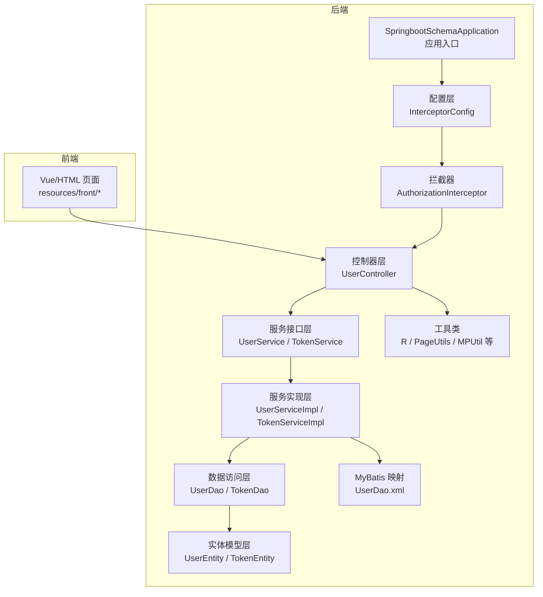
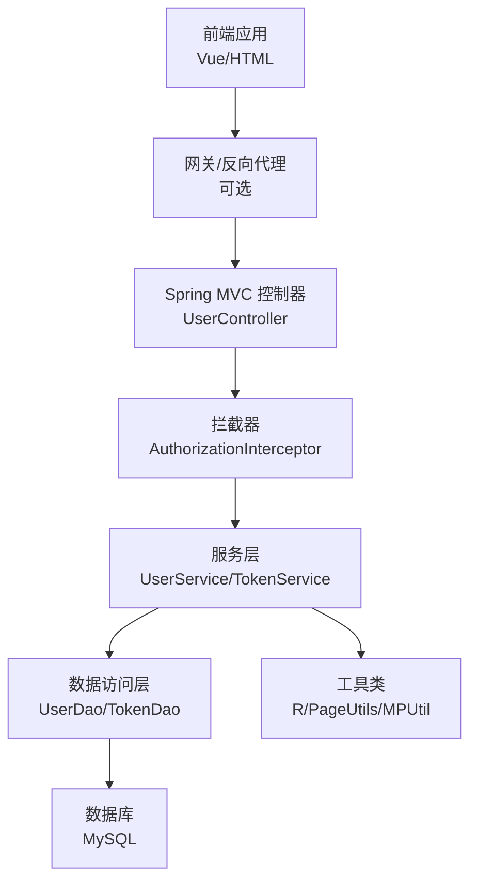
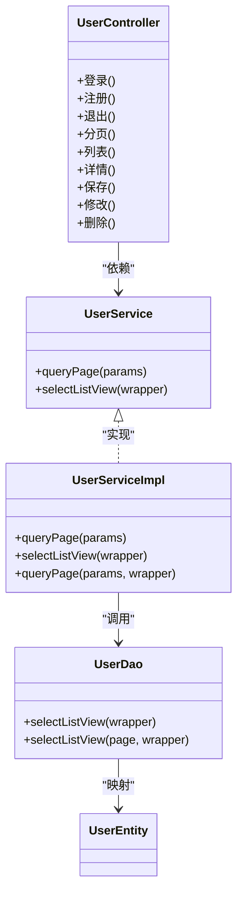
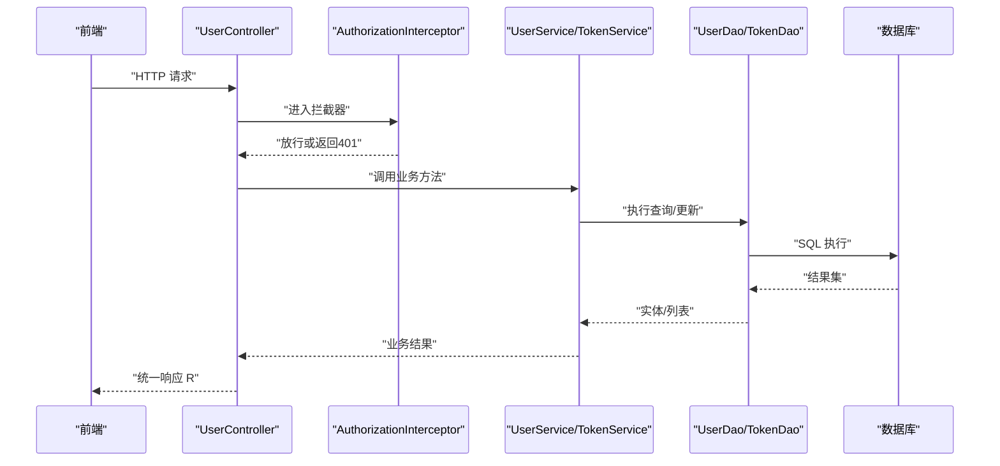
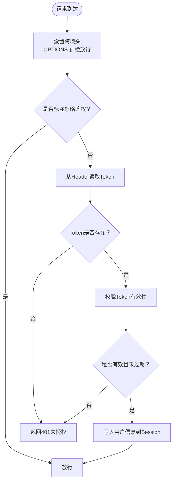
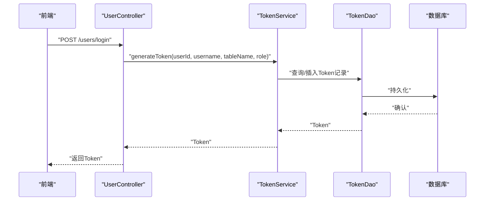
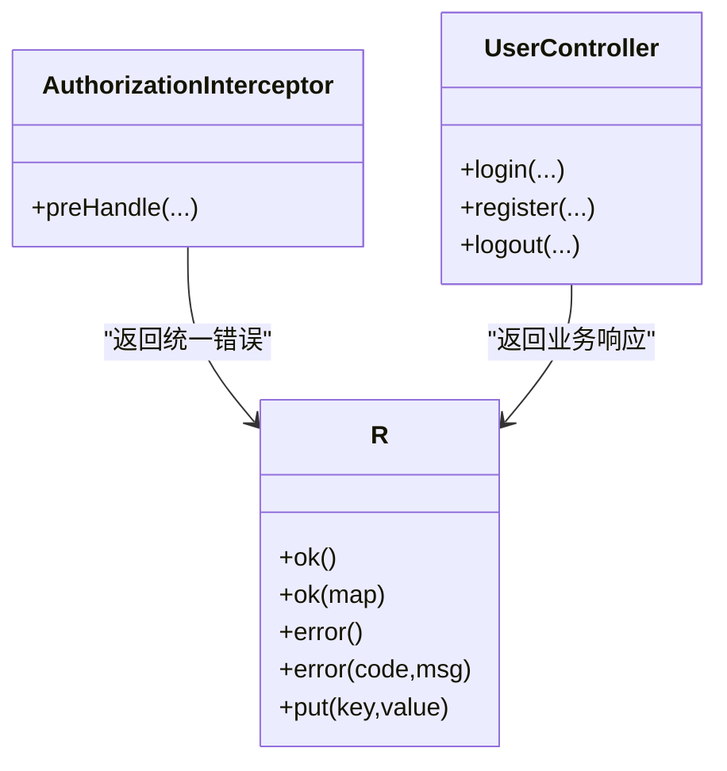
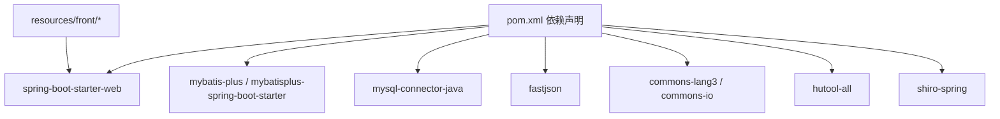

# 系统架构设计

<cite>
**本文引用的文件**
- [SpringbootSchemaApplication.java](file://src/main/java/com/SpringbootSchemaApplication.java)
- [InterceptorConfig.java](file://src/main/java/com/config/InterceptorConfig.java)
- [AuthorizationInterceptor.java](file://src/main/java/com/interceptor/AuthorizationInterceptor.java)
- [IgnoreAuth.java](file://src/main/java/com/annotation/IgnoreAuth.java)
- [LoginUser.java](file://src/main/java/com/annotation/LoginUser.java)
- [UserController.java](file://src/main/java/com/controller/UserController.java)
- [UserService.java](file://src/main/java/com/service/UserService.java)
- [UserServiceImpl.java](file://src/main/java/com/service/impl/UserServiceImpl.java)
- [UserDao.java](file://src/main/java/com/dao/UserDao.java)
- [TokenService.java](file://src/main/java/com/service/TokenService.java)
- [TokenServiceImpl.java](file://src/main/java/com/service/impl/TokenServiceImpl.java)
- [R.java](file://src/main/java/com/utils/R.java)
- [UserDao.xml](file://src/main/resources/mapper/UserDao.xml)
- [pom.xml](file://pom.xml)
- [README.md](file://README.md)
</cite>

## 目录
1. [引言](#引言)
2. [项目结构](#项目结构)
3. [核心组件](#核心组件)
4. [架构总览](#架构总览)
5. [详细组件分析](#详细组件分析)
6. [依赖分析](#依赖分析)
7. [性能考虑](#性能考虑)
8. [故障排查指南](#故障排查指南)
9. [结论](#结论)
10. [附录](#附录)

## 引言
本系统为基于 Spring Boot 的自习室管理系统，采用前后端分离架构，后端以 Spring Boot + MyBatis Plus 为核心，提供 REST 接口；前端使用 Vue/HTML 技术栈。系统通过拦截器实现统一权限校验，采用 Token 机制进行身份认证与会话保持，遵循分层架构（Controller-Service-DAO-Entity）与 MVC 设计模式，职责清晰、易于扩展。

## 项目结构
系统采用标准的 Maven 多模块工程布局，主要包结构如下：
- com.annotation：自定义注解（如忽略鉴权、登录用户参数）
- com.config：Spring 配置类（拦截器配置）
- com.controller：控制器层，暴露 REST 接口
- com.service：服务接口与实现
- com.dao：数据访问接口（MyBatis Mapper）
- com.entity：实体模型（含 Model/VO/View 三层模型）
- com.interceptor：拦截器（统一权限校验）
- com.utils：工具类（响应封装、分页、校验等）
- resources/mapper：MyBatis XML 映射文件
- resources/front：前端静态资源（Vue 页面与静态资源）

图表来源
- [SpringbootSchemaApplication.java:1-22](file://src/main/java/com/SpringbootSchemaApplication.java#L1-L22)
- [InterceptorConfig.java:1-39](file://src/main/java/com/config/InterceptorConfig.java#L1-L39)
- [AuthorizationInterceptor.java:1-96](file://src/main/java/com/interceptor/AuthorizationInterceptor.java#L1-L96)
- [UserController.java:1-175](file://src/main/java/com/controller/UserController.java#L1-L175)
- [UserService.java:1-26](file://src/main/java/com/service/UserService.java#L1-L26)
- [UserServiceImpl.java:1-50](file://src/main/java/com/service/impl/UserServiceImpl.java#L1-L50)
- [UserDao.java:1-23](file://src/main/java/com/dao/UserDao.java#L1-L23)
- [TokenService.java:1-27](file://src/main/java/com/service/TokenService.java#L1-L27)
- [TokenServiceImpl.java:1-80](file://src/main/java/com/service/impl/TokenServiceImpl.java#L1-L80)
- [R.java:1-52](file://src/main/java/com/utils/R.java#L1-L52)
- [UserDao.xml:1-13](file://src/main/resources/mapper/UserDao.xml#L1-L13)

章节来源
- [SpringbootSchemaApplication.java:1-22](file://src/main/java/com/SpringbootSchemaApplication.java#L1-L22)
- [README.md:1-64](file://README.md#L1-L64)

## 核心组件
- 应用入口与扫描配置：应用启动类启用组件扫描与 Mapper 扫描，确保 DAO 层被自动装配。
- 拦截器与权限控制：统一拦截所有请求，支持跨域、忽略鉴权注解、Token 校验并将用户信息注入 Session。
- 控制器层：以 REST 方式提供登录、注册、退出、列表查询、详情、分页、保存、修改、删除等接口。
- 服务层：封装业务逻辑，提供分页查询、列表查询、实体 CRUD 等能力。
- 数据访问层：基于 MyBatis Plus 的 Mapper 接口，配合 XML 映射文件实现复杂查询。
- 实体与模型：定义数据库实体与视图/值对象，支撑不同场景的数据传输。
- 工具类：统一响应格式、分页、查询条件构造、校验等。

章节来源
- [SpringbootSchemaApplication.java:9-20](file://src/main/java/com/SpringbootSchemaApplication.java#L9-L20)
- [InterceptorConfig.java:11-38](file://src/main/java/com/config/InterceptorConfig.java#L11-L38)
- [AuthorizationInterceptor.java:28-96](file://src/main/java/com/interceptor/AuthorizationInterceptor.java#L28-L96)
- [UserController.java:38-175](file://src/main/java/com/controller/UserController.java#L38-L175)
- [UserService.java:18-25](file://src/main/java/com/service/UserService.java#L18-L25)
- [UserServiceImpl.java:24-49](file://src/main/java/com/service/impl/UserServiceImpl.java#L24-L49)
- [UserDao.java:16-22](file://src/main/java/com/dao/UserDao.java#L16-L22)
- [TokenService.java:16-26](file://src/main/java/com/service/TokenService.java#L16-L26)
- [TokenServiceImpl.java:28-79](file://src/main/java/com/service/impl/TokenServiceImpl.java#L28-L79)
- [R.java:9-52](file://src/main/java/com/utils/R.java#L9-L52)
- [UserDao.xml:4-12](file://src/main/resources/mapper/UserDao.xml#L4-L12)

## 架构总览
系统采用前后端分离架构，后端以 Spring MVC 提供 REST 接口，前端通过 HTTP 请求与后端交互。权限控制通过拦截器在进入控制器前完成，Token 用于标识用户身份并在会话中传递用户信息。

图表来源
- [AuthorizationInterceptor.java:36-94](file://src/main/java/com/interceptor/AuthorizationInterceptor.java#L36-L94)
- [UserController.java:51-60](file://src/main/java/com/controller/UserController.java#L51-L60)
- [TokenServiceImpl.java:54-78](file://src/main/java/com/service/impl/TokenServiceImpl.java#L54-L78)
- [UserDao.xml:6-11](file://src/main/resources/mapper/UserDao.xml#L6-L11)

## 详细组件分析

### 分层架构与职责划分
- 控制器层（Controller）：负责接收请求、参数校验、调用服务、封装响应。示例：用户登录、注册、退出、分页查询、保存/修改/删除等。
- 服务层（Service）：封装业务规则，协调 DAO 完成数据处理。示例：分页查询、列表查询、实体操作。
- 数据访问层（DAO）：基于 MyBatis Plus 的 Mapper 接口，提供基础 CRUD 与复杂查询。
- 实体层（Entity/Model/VO/View）：映射数据库表结构与传输对象，支持不同场景的数据封装。
- 工具类（Utils）：统一响应格式（R）、分页工具、查询条件构造、校验工具等。

图表来源
- [UserController.java:38-175](file://src/main/java/com/controller/UserController.java#L38-L175)
- [UserService.java:18-25](file://src/main/java/com/service/UserService.java#L18-L25)
- [UserServiceImpl.java:24-49](file://src/main/java/com/service/impl/UserServiceImpl.java#L24-L49)
- [UserDao.java:16-22](file://src/main/java/com/dao/UserDao.java#L16-L22)
- [UserEntity.java:14-78](file://src/main/java/com/entity/UserEntity.java#L14-L78)

章节来源
- [UserController.java:38-175](file://src/main/java/com/controller/UserController.java#L38-L175)
- [UserService.java:18-25](file://src/main/java/com/service/UserService.java#L18-L25)
- [UserServiceImpl.java:24-49](file://src/main/java/com/service/impl/UserServiceImpl.java#L24-L49)
- [UserDao.java:16-22](file://src/main/java/com/dao/UserDao.java#L16-L22)
- [UserEntity.java:14-78](file://src/main/java/com/entity/UserEntity.java#L14-L78)

### MVC 设计模式与组件交互
- 视图（View）：前端 Vue/HTML 页面，负责展示与用户交互。
- 模型（Model）：后端实体与 VO/View，承载数据与业务状态。
- 控制器（Controller）：接收前端请求，调用服务层处理业务，返回统一响应格式。
- 交互流程：前端发起 HTTP 请求 → 拦截器进行权限校验 → 控制器处理 → 服务层执行业务 → DAO 访问数据库 → 返回 JSON 响应。

图表来源
- [AuthorizationInterceptor.java:36-94](file://src/main/java/com/interceptor/AuthorizationInterceptor.java#L36-L94)
- [UserController.java:51-60](file://src/main/java/com/controller/UserController.java#L51-L60)
- [TokenServiceImpl.java:54-78](file://src/main/java/com/service/impl/TokenServiceImpl.java#L54-L78)
- [UserDao.xml:6-11](file://src/main/resources/mapper/UserDao.xml#L6-L11)

章节来源
- [AuthorizationInterceptor.java:36-94](file://src/main/java/com/interceptor/AuthorizationInterceptor.java#L36-L94)
- [UserController.java:51-60](file://src/main/java/com/controller/UserController.java#L51-L60)
- [TokenServiceImpl.java:54-78](file://src/main/java/com/service/impl/TokenServiceImpl.java#L54-L78)
- [UserDao.xml:6-11](file://src/main/resources/mapper/UserDao.xml#L6-L11)

### 权限控制架构
- 拦截器机制：全局拦截所有请求，设置跨域头，支持 OPTIONS 预检，识别忽略鉴权注解，从 Header 中提取 Token 并校验有效性，成功则将用户信息写入 Session。
- 注解驱动：通过忽略鉴权注解标注无需登录即可访问的接口。
- Token 管理：生成固定有效期的 Token，存储 Token 及过期时间，校验时判断是否过期。

图表来源
- [AuthorizationInterceptor.java:36-94](file://src/main/java/com/interceptor/AuthorizationInterceptor.java#L36-L94)
- [IgnoreAuth.java:8-13](file://src/main/java/com/annotation/IgnoreAuth.java#L8-L13)
- [TokenServiceImpl.java:71-78](file://src/main/java/com/service/impl/TokenServiceImpl.java#L71-L78)

章节来源
- [AuthorizationInterceptor.java:28-96](file://src/main/java/com/interceptor/AuthorizationInterceptor.java#L28-L96)
- [IgnoreAuth.java:8-13](file://src/main/java/com/annotation/IgnoreAuth.java#L8-L13)
- [TokenServiceImpl.java:54-78](file://src/main/java/com/service/impl/TokenServiceImpl.java#L54-L78)

### 登录与会话流程
- 登录：控制器接收用户名、密码与验证码，校验通过后调用 Token 服务生成 Token 并返回。
- 会话：拦截器将用户 ID、角色、表名、用户名写入 Session，后续接口可通过 Session 获取当前用户信息。

图表来源
- [UserController.java:51-60](file://src/main/java/com/controller/UserController.java#L51-L60)
- [TokenServiceImpl.java:54-69](file://src/main/java/com/service/impl/TokenServiceImpl.java#L54-L69)

章节来源
- [UserController.java:51-60](file://src/main/java/com/controller/UserController.java#L51-L60)
- [TokenServiceImpl.java:54-69](file://src/main/java/com/service/impl/TokenServiceImpl.java#L54-L69)

### 统一响应与错误处理
- 统一响应：工具类封装统一响应结构，包含状态码、消息与数据字段，便于前端统一处理。
- 错误处理：拦截器在鉴权失败时返回统一错误响应；控制器在业务异常时也返回统一格式。

图表来源
- [R.java:9-52](file://src/main/java/com/utils/R.java#L9-L52)
- [AuthorizationInterceptor.java:81-93](file://src/main/java/com/interceptor/AuthorizationInterceptor.java#L81-L93)
- [UserController.java:51-60](file://src/main/java/com/controller/UserController.java#L51-L60)

章节来源
- [R.java:9-52](file://src/main/java/com/utils/R.java#L9-L52)
- [AuthorizationInterceptor.java:81-93](file://src/main/java/com/interceptor/AuthorizationInterceptor.java#L81-L93)
- [UserController.java:51-60](file://src/main/java/com/controller/UserController.java#L51-L60)

## 依赖分析
- 后端框架：Spring Boot、MyBatis Plus、MySQL 驱动、Shiro（依赖存在但未在拦截器中使用）。
- 前端资源：Vue/HTML 页面与静态资源位于 resources/front，通过静态资源处理器暴露。
- 关键依赖：Web、MyBatis、MySQL、FastJSON、Apache Commons Lang3、Hutool 等。

图表来源
- [pom.xml:24-128](file://pom.xml#L24-L128)

章节来源
- [pom.xml:24-128](file://pom.xml#L24-L128)

## 性能考虑
- 分页查询：服务层使用分页工具与 MyBatis Plus 分页器，避免一次性加载大量数据。
- 查询优化：XML 映射文件中使用动态 WHERE 片段，减少拼接开销。
- 缓存建议：可在 Token 校验与用户信息读取处引入 Redis 缓存，降低数据库压力。
- 连接池：建议配置连接池参数（最大连接数、空闲超时等），结合数据库监控。
- 跨域预检：拦截器已处理 OPTIONS 预检，减少不必要的后端处理。

章节来源
- [UserServiceImpl.java:28-48](file://src/main/java/com/service/impl/UserServiceImpl.java#L28-L48)
- [UserDao.xml:6-11](file://src/main/resources/mapper/UserDao.xml#L6-L11)
- [AuthorizationInterceptor.java:46-49](file://src/main/java/com/interceptor/AuthorizationInterceptor.java#L46-L49)

## 故障排查指南
- 401 未授权：检查请求头是否携带正确的 Token，确认 Token 是否过期；必要时在控制器上添加忽略鉴权注解。
- 跨域问题：确认拦截器已设置允许的源、方法与头；前端请求头需与后端一致。
- 登录失败：核对用户名与密码是否匹配；确认 Token 生成与存储逻辑。
- 响应格式异常：检查控制器返回是否使用统一响应工具类。

章节来源
- [AuthorizationInterceptor.java:40-49](file://src/main/java/com/interceptor/AuthorizationInterceptor.java#L40-L49)
- [AuthorizationInterceptor.java:81-93](file://src/main/java/com/interceptor/AuthorizationInterceptor.java#L81-L93)
- [UserController.java:51-60](file://src/main/java/com/controller/UserController.java#L51-L60)
- [R.java:9-52](file://src/main/java/com/utils/R.java#L9-L52)

## 结论
该系统采用清晰的分层架构与 MVC 模式，结合拦截器实现统一权限控制与 Token 管理，满足前后端分离场景下的安全与可维护性需求。通过分页查询与统一响应等设计，提升了系统的可扩展性与用户体验。建议后续引入缓存与数据库连接池优化，进一步提升性能与稳定性。

## 附录
- 系统边界：后端仅暴露 REST 接口，前端负责页面渲染与交互；静态资源由 Spring MVC 静态资源处理器托管。
- 外部依赖：MySQL 数据库、前端 Vue/HTML 资源、第三方 SDK（百度 AI）按需引入。
- 集成模式：前后端通过 HTTP 协议通信，权限通过 Token 传递；可扩展接入统一认证中心（如 OAuth2/Spring Security）。

章节来源
- [InterceptorConfig.java:28-37](file://src/main/java/com/config/InterceptorConfig.java#L28-L37)
- [README.md:13-26](file://README.md#L13-L26)