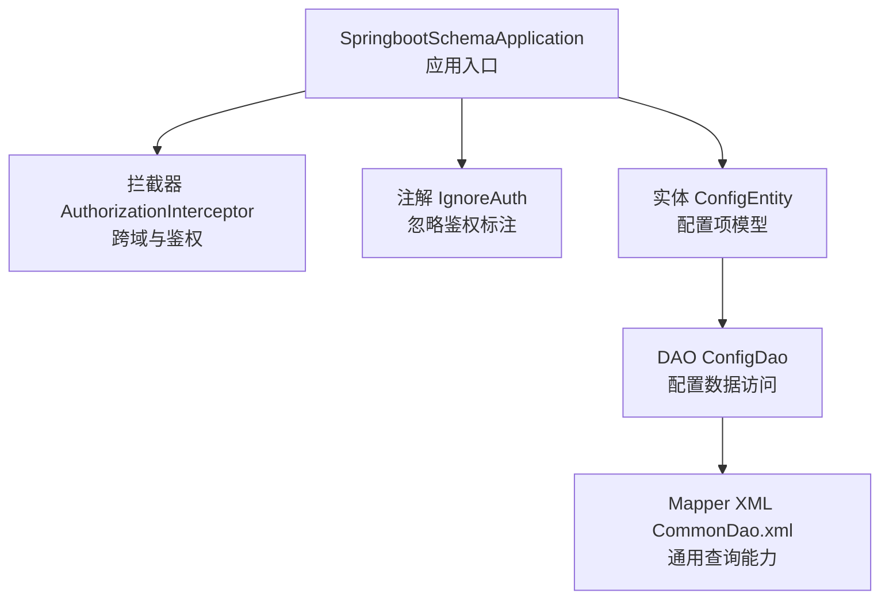
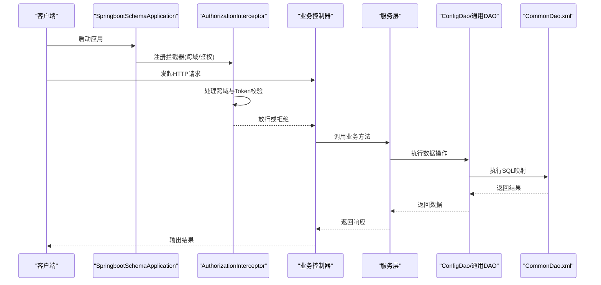
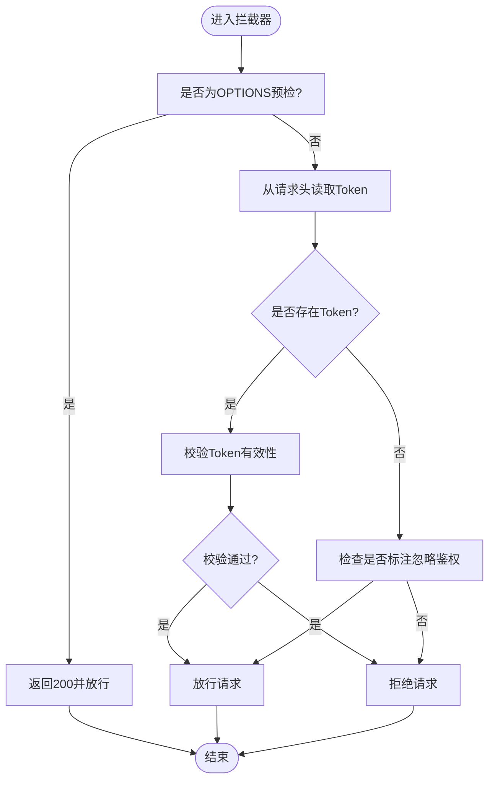
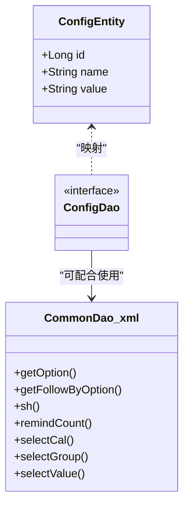
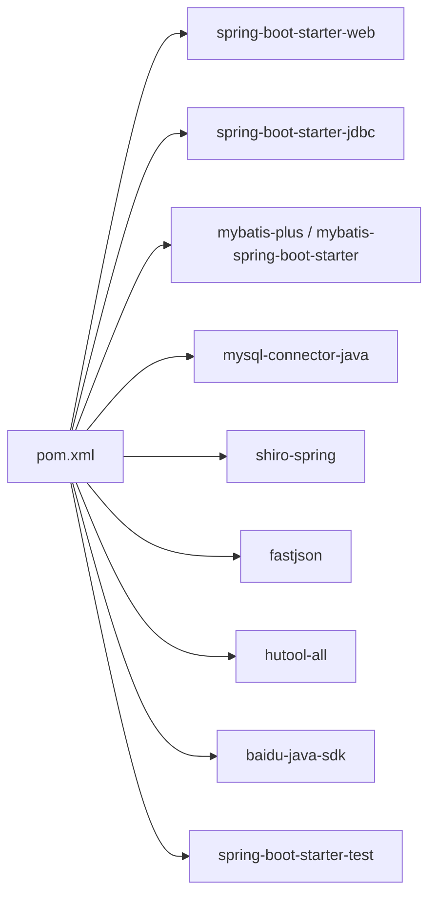

# 配置与部署

<cite>
**本文引用的文件**
- [pom.xml](file://pom.xml)
- [SpringbootSchemaApplication.java](file://src/main/java/com/SpringbootSchemaApplication.java)
- [AuthorizationInterceptor.java](file://src/main/java/com/interceptor/AuthorizationInterceptor.java)
- [IgnoreAuth.java](file://src/main/java/com/annotation/IgnoreAuth.java)
- [ConfigEntity.java](file://src/main/java/com/entity/ConfigEntity.java)
- [ConfigDao.java](file://src/main/java/com/dao/ConfigDao.java)
- [CommonDao.xml](file://src/main/resources/mapper/CommonDao.xml)
- [SpringbootSchemaApplicationTests.java](file://src/test/java/com/SpringbootSchemaApplicationTests.java)
</cite>

## 目录
1. [简介](#简介)
2. [项目结构](#项目结构)
3. [核心组件](#核心组件)
4. [架构总览](#架构总览)
5. [详细组件分析](#详细组件分析)
6. [依赖分析](#依赖分析)
7. [性能考虑](#性能考虑)
8. [故障排查指南](#故障排查指南)
9. [结论](#结论)
10. [附录](#附录)

## 简介
本指南面向自习室管理系统的配置与生产部署，围绕以下目标展开：  
- 解析应用配置与调优要点（基于现有代码结构与依赖推导）  
- 说明 Maven 构建、依赖管理与打包发布流程  
- 提供数据库连接与 MyBatis/MyBatis-Plus 的配置思路  
- 给出容器化与集群化部署的通用策略与注意事项  
- 涵盖环境变量、安全加固、监控与日志、回滚与运维最佳实践  
- 提供常见部署问题的排查路径

说明：当前仓库未包含 application.properties 或 application.yml 等配置文件，本文在不臆测具体配置值的前提下，基于现有依赖与代码结构给出可落地的配置与部署建议。

## 项目结构
项目采用 Spring Boot 标准布局，后端以 Spring Boot + MyBatis-Plus 为核心技术栈，前端资源位于 resources/front 下。核心入口类负责启动与扫描 Mapper 接口。

图示来源
- [SpringbootSchemaApplication.java:1-22](file://src/main/java/com/SpringbootSchemaApplication.java#L1-L22)
- [AuthorizationInterceptor.java:41-73](file://src/main/java/com/interceptor/AuthorizationInterceptor.java#L41-L73)
- [IgnoreAuth.java:1-13](file://src/main/java/com/annotation/IgnoreAuth.java#L1-L13)
- [ConfigEntity.java:1-53](file://src/main/java/com/entity/ConfigEntity.java#L1-L53)
- [ConfigDao.java:1-12](file://src/main/java/com/dao/ConfigDao.java#L1-L12)
- [CommonDao.xml:1-57](file://src/main/resources/mapper/CommonDao.xml#L1-L57)

章节来源
- [SpringbootSchemaApplication.java:1-22](file://src/main/java/com/SpringbootSchemaApplication.java#L1-L22)
- [pom.xml:1-140](file://pom.xml#L1-L140)

## 核心组件
- 应用入口与启动
  - 入口类启用 Spring Boot 并扫描 DAO 包，支持 Servlet 容器部署。
- 配置管理
  - 使用实体与 DAO 访问名为 config 的表，用于存储系统配置键值对。
- 数据访问层
  - 基于 MyBatis-Plus 与自定义 XML 实现通用查询、统计与分组等能力。
- 安全与跨域
  - 通过拦截器统一处理跨域头与鉴权逻辑；提供忽略鉴权的注解。

章节来源
- [SpringbootSchemaApplication.java:9-21](file://src/main/java/com/SpringbootSchemaApplication.java#L9-L21)
- [ConfigEntity.java:12-53](file://src/main/java/com/entity/ConfigEntity.java#L12-L53)
- [ConfigDao.java:10-12](file://src/main/java/com/dao/ConfigDao.java#L10-L12)
- [CommonDao.xml:4-57](file://src/main/resources/mapper/CommonDao.xml#L4-L57)
- [AuthorizationInterceptor.java:41-73](file://src/main/java/com/interceptor/AuthorizationInterceptor.java#L41-L73)
- [IgnoreAuth.java:8-13](file://src/main/java/com/annotation/IgnoreAuth.java#L8-L13)

## 架构总览
下图展示应用启动、请求拦截与数据访问的关键交互：

图示来源
- [SpringbootSchemaApplication.java:13-20](file://src/main/java/com/SpringbootSchemaApplication.java#L13-L20)
- [AuthorizationInterceptor.java:41-73](file://src/main/java/com/interceptor/AuthorizationInterceptor.java#L41-L73)
- [ConfigDao.java:10-12](file://src/main/java/com/dao/ConfigDao.java#L10-L12)
- [CommonDao.xml:4-57](file://src/main/resources/mapper/CommonDao.xml#L4-L57)

## 详细组件分析

### 应用入口与启动
- 功能要点
  - 启用 Spring Boot 自动装配与组件扫描
  - 扫描 com.dao 包下的 Mapper 接口
  - 支持以 WAR 方式部署到外部 Servlet 容器
- 部署建议
  - 生产环境推荐使用内置 Tomcat/Jetty 运行 jar
  - 如需 WAR 部署，请确保容器版本兼容 JDK 8 与 Spring Boot 版本

章节来源
- [SpringbootSchemaApplication.java:9-21](file://src/main/java/com/SpringbootSchemaApplication.java#L9-L21)

### 安全与跨域拦截器
- 功能要点
  - 设置跨域允许的头、源与方法，并对 OPTIONS 预检请求快速放行
  - 从请求头读取 Token 并进行鉴权判断
  - 对标注了忽略鉴权的接口直接放行
- 配置建议
  - 明确允许的 Origin 列表，避免使用通配符 *
  - Token 存储与过期策略应结合业务设计
  - 可结合 Spring Security 或 Shiro 进一步强化认证授权

图示来源
- [AuthorizationInterceptor.java:41-73](file://src/main/java/com/interceptor/AuthorizationInterceptor.java#L41-L73)
- [IgnoreAuth.java:8-13](file://src/main/java/com/annotation/IgnoreAuth.java#L8-L13)

章节来源
- [AuthorizationInterceptor.java:41-73](file://src/main/java/com/interceptor/AuthorizationInterceptor.java#L41-L73)
- [IgnoreAuth.java:1-13](file://src/main/java/com/annotation/IgnoreAuth.java#L1-L13)

### 配置管理（系统参数）
- 数据模型
  - 表名：config
  - 字段：id（主键）、name（键）、value（值）
- 访问方式
  - 通过 ConfigEntity 与 ConfigDao 进行读写
  - 可结合通用 DAO XML 提供的查询能力实现动态配置读取
- 部署建议
  - 将敏感配置放入环境变量或密钥管理服务
  - 对配置变更实施灰度与回滚策略

图示来源
- [ConfigEntity.java:12-53](file://src/main/java/com/entity/ConfigEntity.java#L12-L53)
- [ConfigDao.java:10-12](file://src/main/java/com/dao/ConfigDao.java#L10-L12)
- [CommonDao.xml:4-57](file://src/main/resources/mapper/CommonDao.xml#L4-L57)

章节来源
- [ConfigEntity.java:12-53](file://src/main/java/com/entity/ConfigEntity.java#L12-L53)
- [ConfigDao.java:10-12](file://src/main/java/com/dao/ConfigDao.java#L10-L12)
- [CommonDao.xml:4-57](file://src/main/resources/mapper/CommonDao.xml#L4-L57)

### 数据访问层与通用查询
- 通用能力
  - distinct 列值查询、按条件过滤
  - 分组统计、求和/最大/最小/平均
  - 条件提醒计数（支持日期范围）
- 性能提示
  - 对高频查询建立合适索引
  - 注意 SQL 中的动态拼接风险，确保输入校验与白名单

章节来源
- [CommonDao.xml:4-57](file://src/main/resources/mapper/CommonDao.xml#L4-L57)

## 依赖分析
- 核心依赖概览
  - Spring Boot Web、JDBC、MyBatis-Plus、MySQL Connector、Shiro、FastJSON、Hutool、百度 AI SDK 等
- 构建插件
  - spring-boot-maven-plugin 用于打包可执行 jar/war
- 依赖关系示意

图示来源
- [pom.xml:24-128](file://pom.xml#L24-L128)

章节来源
- [pom.xml:18-137](file://pom.xml#L18-L137)

## 性能考虑
- 数据库连接与事务
  - 建议在生产环境配置连接池（如 HikariCP），并结合慢查询日志与监控
  - 控制单次查询的数据量，必要时分页或限制返回字段
- 缓存策略
  - 对热点配置与只读数据引入本地缓存或分布式缓存，降低数据库压力
- 日志与监控
  - 开启访问日志与业务埋点，结合 APM 工具定位瓶颈
- 线程与资源
  - 合理设置线程池大小与队列长度，避免阻塞与 OOM

## 故障排查指南
- 启动失败
  - 检查 JDK 版本与 Spring Boot 版本兼容性
  - 确认依赖下载完整，网络代理与镜像配置正确
- 数据库连接异常
  - 核对驱动版本与连接串格式
  - 检查防火墙、账号权限与字符集设置
- 跨域与鉴权问题
  - 确认拦截器已注册且允许的来源列表正确
  - 校验 Token 生成与校验逻辑一致性
- 单元测试
  - 测试类存在，可先运行测试以验证基础环境

章节来源
- [SpringbootSchemaApplicationTests.java:1-13](file://src/test/java/com/SpringbootSchemaApplicationTests.java#L1-L13)

## 结论
本指南基于现有代码与依赖，给出了配置与部署的可操作建议。由于仓库未包含具体配置文件，建议在实际部署时补充 application.properties 或 application.yml，并结合本文的配置要点与安全加固建议，完成生产环境的落地实施。

## 附录

### Maven 构建与打包
- 插件
  - spring-boot-maven-plugin：生成可执行包
- 构建命令（示例）
  - mvn clean package -DskipTests
- 运行方式
  - java -jar target/*.jar
  - WAR 部署需在容器中运行

章节来源
- [pom.xml:130-137](file://pom.xml#L130-L137)

### 部署检查清单（建议）
- 环境准备
  - JDK 8、数据库可用、网络连通
- 配置核对
  - 数据库连接、日志级别、跨域白名单、Token 策略
- 安全加固
  - HTTPS、强密码策略、最小权限原则、密钥管理
- 监控与日志
  - 启用健康检查、慢查询、错误日志与告警
- 回滚策略
  - 镜像/包版本管理、金丝雀发布、一键回滚脚本

### 常见问题与解决
- 无法连接数据库
  - 核对驱动版本与连接串；确认数据库服务状态与网络策略
- 跨域失败
  - 检查 Origin 是否在允许列表；确认预检请求处理
- Token 验证失败
  - 校验签名算法、过期时间与存储介质一致性