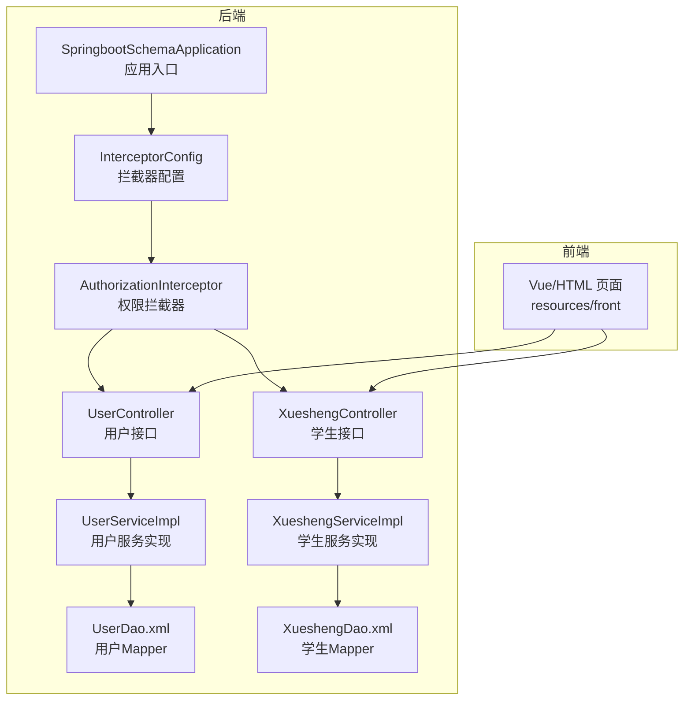
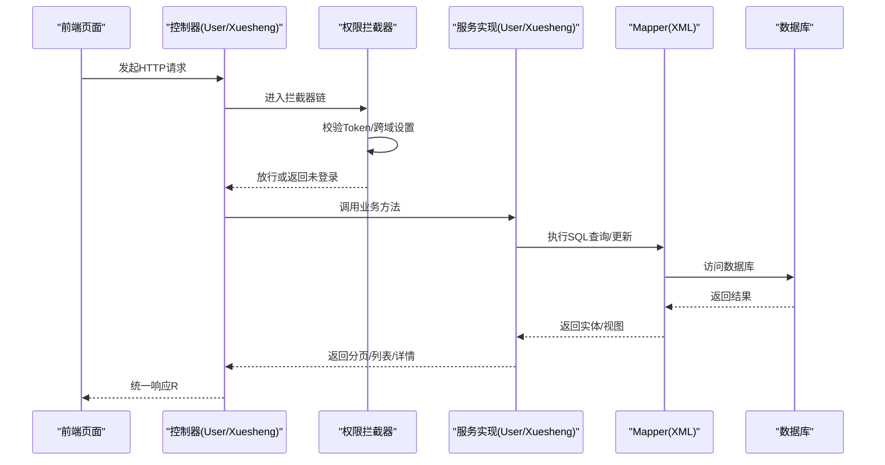
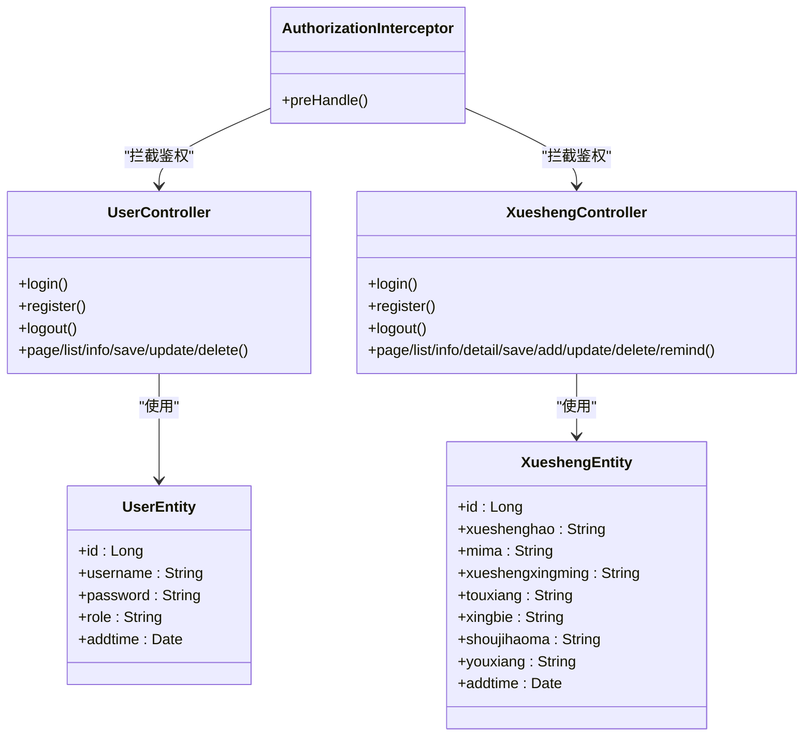
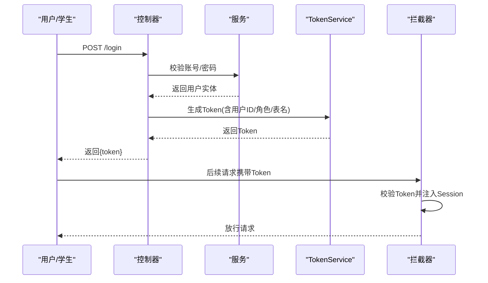
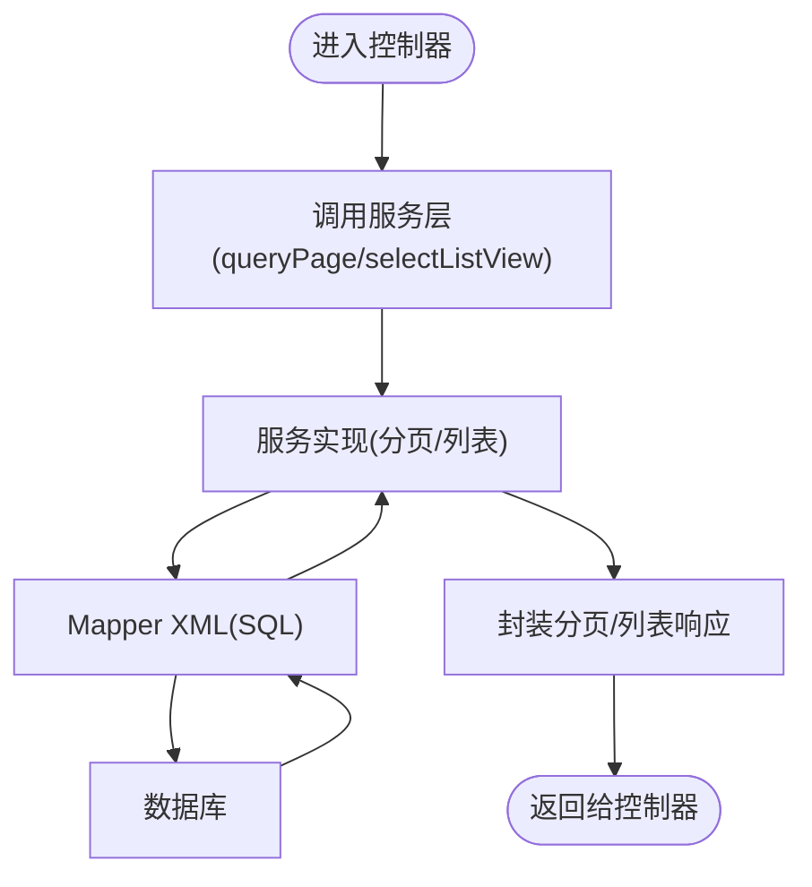
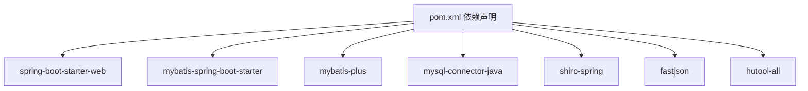

# 项目概述

<cite>
**本文引用的文件**
- [SpringbootSchemaApplication.java](file://src/main/java/com/SpringbootSchemaApplication.java)
- [pom.xml](file://pom.xml)
- [README.md](file://README.md)
- [UserEntity.java](file://src/main/java/com/entity/UserEntity.java)
- [XueshengEntity.java](file://src/main/java/com/entity/XueshengEntity.java)
- [UserController.java](file://src/main/java/com/controller/UserController.java)
- [XueshengController.java](file://src/main/java/com/controller/XueshengController.java)
- [AuthorizationInterceptor.java](file://src/main/java/com/interceptor/AuthorizationInterceptor.java)
- [InterceptorConfig.java](file://src/main/java/com/config/InterceptorConfig.java)
- [UserServiceImpl.java](file://src/main/java/com/service/impl/UserServiceImpl.java)
- [XueshengServiceImpl.java](file://src/main/java/com/service/impl/XueshengServiceImpl.java)
- [UserDao.xml](file://src/main/resources/mapper/UserDao.xml)
- [XueshengDao.xml](file://src/main/resources/mapper/XueshengDao.xml)
</cite>

## 目录
1. [引言](#引言)
2. [项目结构](#项目结构)
3. [核心组件](#核心组件)
4. [架构总览](#架构总览)
5. [详细组件分析](#详细组件分析)
6. [依赖分析](#依赖分析)
7. [性能考虑](#性能考虑)
8. [故障排查指南](#故障排查指南)
9. [结论](#结论)
10. [附录](#附录)

## 引言
本项目是一个基于 Spring Boot 的自习室管理系统，采用前后端分离架构，后端以 Spring Boot + MyBatis 为核心，前端采用 Vue/HTML 技术栈。系统围绕“管理员”和“学生”两类角色构建，分别提供自习室管理、座位预约、公告管理、学生信息维护以及座位预定、公告浏览等能力。项目强调易用性与可扩展性，适合教学实践与中小型场景部署。

- 核心目标：提供稳定、直观、可扩展的自习室预约与管理平台，提升空间利用率与用户体验。
- 主要特性：双角色权限控制、统一认证与拦截、分页查询、数据模型与视图解耦、前后端分离。
- 应用场景：高校或教育机构的自习室、图书馆、共享学习空间的日常运营与管理。
- 预期收益：降低人工管理成本、提高座位使用透明度与公平性、增强用户自助服务能力。

## 项目结构
项目采用典型的分层架构与按功能域组织的包结构：
- 入口与配置：应用启动类、拦截器配置、MyBatis Mapper 扫描配置
- 控制层：各业务模块的 REST 接口（如用户、学生、座位预约等）
- 服务层：业务逻辑封装与分页查询实现
- 持久层：MyBatis Mapper XML 定义与基础 CRUD 映射
- 实体与视图：数据库实体、视图对象与 VO 对象
- 工具与注解：通用工具、校验、响应封装、权限注解
- 前端资源：Vue 页面与静态资源（位于 resources/front）

图表来源
- [SpringbootSchemaApplication.java:11-20](file://src/main/java/com/SpringbootSchemaApplication.java#L11-L20)
- [InterceptorConfig.java:19-23](file://src/main/java/com/config/InterceptorConfig.java#L19-L23)
- [AuthorizationInterceptor.java:36-94](file://src/main/java/com/interceptor/AuthorizationInterceptor.java#L36-L94)
- [UserController.java:38-174](file://src/main/java/com/controller/UserController.java#L38-L174)
- [XueshengController.java:46-283](file://src/main/java/com/controller/XueshengController.java#L46-L283)
- [UserServiceImpl.java:24-49](file://src/main/java/com/service/impl/UserServiceImpl.java#L24-L49)
- [XueshengServiceImpl.java:21-62](file://src/main/java/com/service/impl/XueshengServiceImpl.java#L21-L62)
- [UserDao.xml:4-12](file://src/main/resources/mapper/UserDao.xml#L4-L12)
- [XueshengDao.xml:4-40](file://src/main/resources/mapper/XueshengDao.xml#L4-L40)

章节来源
- [SpringbootSchemaApplication.java:11-20](file://src/main/java/com/SpringbootSchemaApplication.java#L11-L20)
- [InterceptorConfig.java:11-38](file://src/main/java/com/config/InterceptorConfig.java#L11-L38)
- [README.md:5-17](file://README.md#L5-L17)

## 核心组件
- 应用入口与扫描
  - 应用启动类启用 Spring Boot 并扫描 DAO 包，确保 MyBatis Mapper 自动注入。
- 权限拦截与认证
  - 拦截器统一处理跨域、Token 校验与会话注入；通过注解忽略特定接口的权限校验。
- 控制器层
  - 用户控制器与学生控制器分别提供登录、注册、退出、列表、详情、保存、修改、删除、提醒等接口。
- 服务层
  - 用户与学生服务实现分页查询、列表视图与视图对象查询，封装 MyBatis-Plus 分页工具。
- 持久层
  - Mapper XML 定义基础查询与视图映射，支撑控制器的数据访问需求。

章节来源
- [AuthorizationInterceptor.java:36-94](file://src/main/java/com/interceptor/AuthorizationInterceptor.java#L36-L94)
- [UserController.java:38-174](file://src/main/java/com/controller/UserController.java#L38-L174)
- [XueshengController.java:46-283](file://src/main/java/com/controller/XueshengController.java#L46-L283)
- [UserServiceImpl.java:24-49](file://src/main/java/com/service/impl/UserServiceImpl.java#L24-L49)
- [XueshengServiceImpl.java:21-62](file://src/main/java/com/service/impl/XueshengServiceImpl.java#L21-L62)
- [UserDao.xml:4-12](file://src/main/resources/mapper/UserDao.xml#L4-L12)
- [XueshengDao.xml:4-40](file://src/main/resources/mapper/XueshengDao.xml#L4-L40)

## 架构总览
系统采用前后端分离模式，后端提供 REST 接口，前端通过 HTTP 与后端交互。认证流程基于 Token，拦截器在请求进入控制器前进行权限校验与会话注入。

图表来源
- [AuthorizationInterceptor.java:36-94](file://src/main/java/com/interceptor/AuthorizationInterceptor.java#L36-L94)
- [UserController.java:51-60](file://src/main/java/com/controller/UserController.java#L51-L60)
- [XueshengController.java:58-68](file://src/main/java/com/controller/XueshengController.java#L58-L68)
- [UserServiceImpl.java:27-48](file://src/main/java/com/service/impl/UserServiceImpl.java#L27-L48)
- [XueshengServiceImpl.java:25-60](file://src/main/java/com/service/impl/XueshengServiceImpl.java#L25-L60)
- [UserDao.xml:6-11](file://src/main/resources/mapper/UserDao.xml#L6-L11)
- [XueshengDao.xml:17-39](file://src/main/resources/mapper/XueshengDao.xml#L17-L39)

## 详细组件分析

### 角色与权限设计
- 角色定义
  - 管理员：系统用户，具备用户管理、自习室管理、座位预约管理、公告管理等功能。
  - 学生：系统使用者，具备登录注册、座位预定、公告浏览等能力。
- 权限控制
  - 通过拦截器读取请求头中的 Token，解析用户身份并注入到 Session，后续接口可据此判断权限。
  - 使用注解标记无需鉴权的接口（如登录、注册、首页等）。

图表来源
- [UserEntity.java:13-77](file://src/main/java/com/entity/UserEntity.java#L13-L77)
- [XueshengEntity.java:31-200](file://src/main/java/com/entity/XueshengEntity.java#L31-L200)
- [UserController.java:38-174](file://src/main/java/com/controller/UserController.java#L38-L174)
- [XueshengController.java:46-283](file://src/main/java/com/controller/XueshengController.java#L46-L283)
- [AuthorizationInterceptor.java:29-94](file://src/main/java/com/interceptor/AuthorizationInterceptor.java#L29-L94)

章节来源
- [UserEntity.java:13-77](file://src/main/java/com/entity/UserEntity.java#L13-L77)
- [XueshengEntity.java:31-200](file://src/main/java/com/entity/XueshengEntity.java#L31-L200)
- [AuthorizationInterceptor.java:36-94](file://src/main/java/com/interceptor/AuthorizationInterceptor.java#L36-L94)
- [README.md:7-11](file://README.md#L7-L11)

### 登录与认证流程
- 登录接口
  - 用户控制器与学生控制器分别提供登录接口，校验账号与密码后生成 Token。
- Token 注入
  - 拦截器从请求头读取 Token，解析用户信息并注入 Session，供后续接口使用。
- 退出与重置
  - 提供退出接口使会话失效；提供密码重置接口将密码重置为默认值。

图表来源
- [UserController.java:51-60](file://src/main/java/com/controller/UserController.java#L51-L60)
- [XueshengController.java:58-68](file://src/main/java/com/controller/XueshengController.java#L58-L68)
- [AuthorizationInterceptor.java:68-79](file://src/main/java/com/interceptor/AuthorizationInterceptor.java#L68-L79)

章节来源
- [UserController.java:51-98](file://src/main/java/com/controller/UserController.java#L51-L98)
- [XueshengController.java:58-119](file://src/main/java/com/controller/XueshengController.java#L58-L119)
- [AuthorizationInterceptor.java:58-79](file://src/main/java/com/interceptor/AuthorizationInterceptor.java#L58-L79)

### 数据访问与分页查询
- 服务实现
  - 用户与学生服务均继承 MyBatis-Plus 的 ServiceImpl，提供分页查询、列表视图与视图对象查询。
- Mapper XML
  - 定义基础查询、列表视图与视图对象查询，支持动态 SQL 片段拼接。
- 控制器调用
  - 控制器通过服务层完成分页与列表查询，统一返回响应封装对象。

图表来源
- [UserServiceImpl.java:27-48](file://src/main/java/com/service/impl/UserServiceImpl.java#L27-L48)
- [XueshengServiceImpl.java:25-60](file://src/main/java/com/service/impl/XueshengServiceImpl.java#L25-L60)
- [UserDao.xml:6-11](file://src/main/resources/mapper/UserDao.xml#L6-L11)
- [XueshengDao.xml:29-39](file://src/main/resources/mapper/XueshengDao.xml#L29-L39)

章节来源
- [UserServiceImpl.java:24-49](file://src/main/java/com/service/impl/UserServiceImpl.java#L24-L49)
- [XueshengServiceImpl.java:21-62](file://src/main/java/com/service/impl/XueshengServiceImpl.java#L21-L62)
- [UserDao.xml:4-12](file://src/main/resources/mapper/UserDao.xml#L4-L12)
- [XueshengDao.xml:4-40](file://src/main/resources/mapper/XueshengDao.xml#L4-L40)

## 依赖分析
- 技术栈
  - 后端：Spring Boot、MyBatis、MyBatis-Plus、MySQL 驱动、Apache Shiro（安全框架）、FastJSON、Hutool 等。
  - 前端：Vue/HTML 页面与静态资源。
- Maven 依赖
  - 核心依赖包括 web、mybatis-spring-boot-starter、mysql-connector-java、shiro-spring、mybatis-plus 等。
- 配置与扫描
  - 应用启动类启用 Mapper 扫描；拦截器配置注册全局拦截器与静态资源映射。

图表来源
- [pom.xml:24-128](file://pom.xml#L24-L128)

章节来源
- [pom.xml:18-128](file://pom.xml#L18-L128)
- [SpringbootSchemaApplication.java:9-10](file://src/main/java/com/SpringbootSchemaApplication.java#L9-L10)
- [InterceptorConfig.java:19-37](file://src/main/java/com/config/InterceptorConfig.java#L19-L37)

## 性能考虑
- 分页查询
  - 服务层统一使用分页工具，避免一次性加载大量数据，建议在控制器层合理传参与排序。
- SQL 动态拼接
  - Mapper XML 支持动态 SQL 片段，注意参数校验与索引优化，避免全表扫描。
- 缓存与热点
  - 当前未见缓存层实现，建议对高频查询（如公告列表、座位状态）引入缓存策略。
- 跨域与拦截器
  - 拦截器对所有请求生效，建议结合白名单与路径排除减少不必要的处理。

## 故障排查指南
- 未登录/权限不足
  - 现象：返回未登录错误。
  - 排查：确认请求头是否携带 Token；检查拦截器是否正确注入 Session；核对注解是否正确标注忽略鉴权。
- 登录失败
  - 现象：账号或密码不正确。
  - 排查：确认账号是否存在、密码是否匹配；检查控制器登录逻辑与实体字段映射。
- 分页查询异常
  - 现象：分页数据为空或异常。
  - 排查：检查控制器传参、服务层分页构造与 Mapper XML 动态片段；确认数据库表结构与字段名一致。
- 静态资源无法访问
  - 现象：前端页面或静态资源 404。
  - 排查：确认拦截器静态资源映射配置；检查资源路径与打包位置。

章节来源
- [AuthorizationInterceptor.java:68-93](file://src/main/java/com/interceptor/AuthorizationInterceptor.java#L68-L93)
- [UserController.java:51-58](file://src/main/java/com/controller/UserController.java#L51-L58)
- [XueshengController.java:58-68](file://src/main/java/com/controller/XueshengController.java#L58-L68)
- [InterceptorConfig.java:29-37](file://src/main/java/com/config/InterceptorConfig.java#L29-L37)

## 结论
本项目以 Spring Boot 为基础，结合 MyBatis-Plus 与拦截器机制，实现了自习室管理系统的双角色权限控制与核心业务接口。其分层清晰、职责明确，便于扩展与维护。建议在后续迭代中完善缓存策略、日志监控与安全加固，以进一步提升系统稳定性与安全性。

## 附录
- 开发与运行环境
  - JDK 1.8、IDE（IDEA/Eclipse）、MySQL（5.7/8.x）、无需单独 Tomcat、Maven。
- 项目启动
  - 通过应用入口启动 Spring Boot，自动扫描 DAO 与拦截器配置。
- 前端页面
  - 页面位于 resources/front，包含登录、首页、公告、座位预约、学生中心等页面。

章节来源
- [README.md:19-26](file://README.md#L19-L26)
- [SpringbootSchemaApplication.java:13-20](file://src/main/java/com/SpringbootSchemaApplication.java#L13-L20)
- [InterceptorConfig.java:29-37](file://src/main/java/com/config/InterceptorConfig.java#L29-L37)